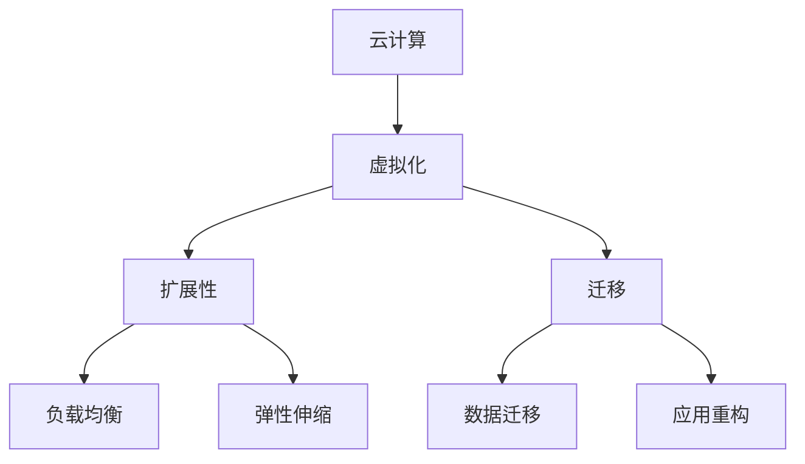

                 

# 云计算和虚拟化：扩展和迁移

云计算和虚拟化技术已经成为现代信息技术基础设施不可或缺的组成部分。本文将深入探讨云计算和虚拟化在扩展和迁移过程中的核心概念、算法原理、操作步骤、应用领域，并通过数学模型和实际案例进行分析，最后总结未来发展趋势与挑战。

## 1. 背景介绍

### 1.1 问题由来
随着云计算和虚拟化技术的不断发展，越来越多的企业将其IT基础设施迁移到云上。云计算的按需提供、按量计费、弹性伸缩等特点，使其成为企业IT部署的首选。而虚拟化技术则通过抽象底层硬件资源，使得云服务提供商能够高效地管理海量物理资源。

但云计算和虚拟化技术的应用并非一帆风顺。在扩展和迁移过程中，企业面临诸多挑战。如何确保应用的稳定性和性能，如何平滑地迁移现有应用，如何应对云环境的动态变化，这些问题亟需解决。本文将从核心概念、算法原理、操作步骤、应用领域等角度，深入探讨这些问题。

## 2. 核心概念与联系

### 2.1 核心概念概述

为更好地理解云计算和虚拟化的扩展和迁移过程，本节将介绍几个密切相关的核心概念：

- **云计算**：基于互联网的计算服务，通过将计算资源（如CPU、内存、存储、网络等）以服务的形式提供，按需使用、按量计费。
- **虚拟化**：通过虚拟化技术，将一台物理机器抽象成多台逻辑上的虚拟机（VM），从而实现资源共享和隔离。
- **扩展性**：系统或应用能够快速适应负载增加的需求，添加更多的资源来支持更高的业务需求。
- **迁移**：将现有应用从一个环境迁移到另一个环境，如从本地环境迁移到云环境，或者从一种云平台迁移到另一种云平台。

这些核心概念之间的逻辑关系可以通过以下Mermaid流程图来展示：



这个流程图展示出云计算和虚拟化技术的应用核心：

1. 云计算提供基础计算资源，虚拟化技术将物理资源抽象为逻辑上的虚拟机。
2. 虚拟化技术通过扩展性实现资源动态调整，支持负载均衡和弹性伸缩。
3. 迁移技术将应用从一个环境平滑迁移到另一个环境，数据迁移和应用重构是迁移的关键步骤。

## 3. 核心算法原理 & 具体操作步骤
### 3.1 算法原理概述

云计算和虚拟化的扩展和迁移过程，本质上是一个系统的资源管理和优化过程。其核心思想是：通过虚拟化和云计算技术的协同工作，实现资源的动态调配和应用的无缝迁移，从而提升系统的性能和可用性。

形式化地，假设目标环境为 $\textit{Cloud}$，原始环境为 $\textit{On-Premise}$。扩展过程可以表示为：

$$
\textit{Cloud} \leftarrow \textit{On-Premise} + \textit{Extended Resources}
$$

迁移过程则可以表示为：

$$
\textit{Cloud} \leftarrow \textit{On-Premise} + \textit{Migration Strategy}
$$

其中，$\textit{Extended Resources}$ 和 $\textit{Migration Strategy}$ 分别表示扩展策略和迁移策略，需要通过算法进行优化。

### 3.2 算法步骤详解

基于云计算和虚拟化的扩展和迁移，一般包括以下几个关键步骤：

**Step 1: 需求分析与目标确定**
- 明确业务需求和性能指标，确定扩展和迁移的目标。
- 评估现有环境的能力，识别瓶颈和改进点。

**Step 2: 资源规划与分配**
- 根据业务需求，规划需要的资源类型和数量。
- 将资源进行合理分配，保证每个VM都有足够的计算资源。

**Step 3: 应用适配与优化**
- 将应用适配到虚拟化环境，进行必要的优化。
- 使用虚拟化管理工具（如VMware、OpenStack等）进行监控和管理。

**Step 4: 数据迁移与同步**
- 使用数据迁移工具（如Rsync、rsyncd等）将数据迁移到云环境。
- 使用数据同步工具（如Amazon S3、Google Cloud Storage等）进行持续的数据更新。

**Step 5: 应用部署与测试**
- 在云环境中进行应用部署，并进行负载测试。
- 使用云平台提供的监控工具（如AWS CloudWatch、Azure Monitor等）进行性能监控。

**Step 6: 应用调优与优化**
- 根据性能监控结果，进行应用调优。
- 使用自动化工具（如Ansible、Chef等）进行配置管理和持续优化。

### 3.3 算法优缺点

云计算和虚拟化的扩展和迁移方法具有以下优点：
1. 高效弹性：虚拟化和云计算可以动态调整资源，支持快速扩展和弹性伸缩。
2. 无缝迁移：虚拟化技术支持应用的平滑迁移，避免数据丢失和应用中断。
3. 降低成本：云服务按量计费，避免过剩资源浪费，降低硬件和运维成本。
4. 提升可靠性：云平台提供高可用性服务，提升系统的可靠性。

同时，该方法也存在一定的局限性：
1. 性能瓶颈：云平台的网络带宽和延迟可能成为扩展和迁移的瓶颈。
2. 安全风险：数据迁移和应用迁移可能引入新的安全风险，需要进行安全加固。
3. 复杂度增加：云平台的管理和监控增加复杂度，需要专门人员维护。
4. 数据孤岛：不同云平台之间的数据迁移可能面临格式和兼容性问题。

尽管存在这些局限性，但就目前而言，云计算和虚拟化的扩展和迁移方法仍是最主流范式。未来相关研究的重点在于如何进一步降低复杂度，提高迁移效率和安全性，同时兼顾成本效益。

### 3.4 算法应用领域

云计算和虚拟化的扩展和迁移技术，在企业IT架构设计和应用部署中得到了广泛的应用，例如：

- **企业内部IT架构设计**：企业可以利用云计算和虚拟化技术，构建一个灵活、可扩展、高可靠性的内部IT架构。
- **应用服务迁移**：将企业现有的应用服务迁移到云平台，利用云平台的高可用性和扩展性。
- **大数据应用**：利用云计算和虚拟化技术，构建大规模分布式存储和计算环境，支持大数据应用。
- **数字化转型**：利用云计算和虚拟化技术，支持企业数字化转型和创新，提升企业的数字化水平。

除了上述这些经典应用外，云计算和虚拟化技术还广泛应用于物联网、人工智能、区块链等领域，为数字化经济提供强大的技术支持。

## 4. 数学模型和公式 & 详细讲解  
### 4.1 数学模型构建

为了更好地理解云计算和虚拟化的扩展和迁移过程，我们建立以下数学模型：

设目标环境为 $\textit{Cloud}$，原始环境为 $\textit{On-Premise}$。扩展和迁移的数学模型分别为：

$$
\textit{Cloud} = f(\textit{On-Premise}, \textit{Extended Resources})
$$

$$
\textit{Cloud} = g(\textit{On-Premise}, \textit{Migration Strategy})
$$

其中，$f$ 和 $g$ 分别表示扩展和迁移的函数。扩展函数 $f$ 的输入为原始环境 $\textit{On-Premise}$ 和扩展资源 $\textit{Extended Resources}$，输出为目标环境 $\textit{Cloud}$。迁移函数 $g$ 的输入为原始环境 $\textit{On-Premise}$ 和迁移策略 $\textit{Migration Strategy}$，输出为目标环境 $\textit{Cloud}$。

### 4.2 公式推导过程

为了更好地推导扩展和迁移的函数，我们需要考虑以下因素：

- **扩展资源**：包括CPU、内存、存储、网络等。
- **迁移策略**：包括应用适配、数据迁移、配置管理等。
- **业务需求**：包括性能指标、业务负载、数据量等。

假设原始环境 $\textit{On-Premise}$ 的资源为 $\textit{R_{on-premise}} = (C_{on-premise}, M_{on-premise}, S_{on-premise}, N_{on-premise})$，其中 $C_{on-premise}$ 表示CPU数量，$M_{on-premise}$ 表示内存大小，$S_{on-premise}$ 表示存储容量，$N_{on-premise}$ 表示网络带宽。扩展资源 $\textit{Extended Resources}$ 为 $\textit{R_{extended}} = (C_{extended}, M_{extended}, S_{extended}, N_{extended})$，其中 $C_{extended}$ 表示新增CPU数量，$M_{extended}$ 表示新增内存大小，$S_{extended}$ 表示新增存储容量，$N_{extended}$ 表示新增网络带宽。扩展函数 $f$ 的推导如下：

$$
\textit{R_{cloud}} = \textit{R_{on-premise}} + \textit{R_{extended}}
$$

其中，$\textit{R_{cloud}} = (C_{cloud}, M_{cloud}, S_{cloud}, N_{cloud})$ 表示目标环境 $\textit{Cloud}$ 的资源。

假设原始环境 $\textit{On-Premise}$ 的数据量为 $\textit{D_{on-premise}}$，迁移策略 $\textit{Migration Strategy}$ 为 $\textit{M_{strategy}} = (T_{sync}, T_{copy}, T_{check})$，其中 $T_{sync}$ 表示同步频率，$T_{copy}$ 表示数据拷贝方式，$T_{check}$ 表示数据检查方式。迁移函数 $g$ 的推导如下：

$$
\textit{D_{cloud}} = \textit{D_{on-premise}} + \textit{M_{strategy}}
$$

其中，$\textit{D_{cloud}}$ 表示目标环境 $\textit{Cloud}$ 的数据量。

### 4.3 案例分析与讲解

以一个简单的企业内部IT架构扩展和迁移为例，展示扩展函数和迁移函数的实际应用：

- **原始环境**：现有20台物理服务器，每台服务器配置2个CPU、16GB内存、2TB存储、1Gbps网络带宽。
- **扩展需求**：业务需求增长，需要增加5台服务器，每台服务器配置4个CPU、32GB内存、4TB存储、2Gbps网络带宽。
- **扩展函数**：将现有资源和新增资源相加，得到目标环境资源。

$$
\textit{R_{cloud}} = (20+5) \times (2+4), (20+5) \times (16+32), (20+5) \times (2+4), (20+5) \times (1+2)
$$

$$
\textit{R_{cloud}} = 25 \times 6, 25 \times 48, 25 \times 6, 25 \times 3
$$

$$
\textit{R_{cloud}} = (150, 1200, 150, 75)
$$

目标环境 $\textit{Cloud}$ 的资源为25台服务器，每台服务器配置6个CPU、48GB内存、6TB存储、3Gbps网络带宽。

- **数据迁移**：将现有的100TB数据迁移到云环境，采用增量同步和全量拷贝相结合的方式，每天同步100GB数据，每2天全量拷贝100TB数据。

$$
\textit{D_{cloud}} = \textit{D_{on-premise}} + 100GB \times 100 + 100TB \times 2
$$

$$
\textit{D_{cloud}} = 100TB + 10000GB + 200TB
$$

$$
\textit{D_{cloud}} = 300TB
$$

目标环境 $\textit{Cloud}$ 的数据量为300TB。

## 5. 项目实践：代码实例和详细解释说明
### 5.1 开发环境搭建

在进行扩展和迁移实践前，我们需要准备好开发环境。以下是使用Python进行CloudStack开发的环境配置流程：

1. 安装Anaconda：从官网下载并安装Anaconda，用于创建独立的Python环境。

2. 创建并激活虚拟环境：
```bash
conda create -n cloudstack-env python=3.8 
conda activate cloudstack-env
```

3. 安装CloudStack：
```bash
pip install cloudstack
```

4. 安装CloudStack CLI：
```bash
pip install cloudstack-console
```

5. 安装CloudStack Web客户端：
```bash
pip install cloudstack-browser
```

完成上述步骤后，即可在`cloudstack-env`环境中开始扩展和迁移实践。

### 5.2 源代码详细实现

下面我们以企业内部IT架构扩展和迁移为例，给出使用CloudStack进行资源管理和数据迁移的Python代码实现。

首先，定义原始环境资源：

```python
from cloudstack import Host

# 原始环境资源
host_list = []
for i in range(20):
    host = Host()
    host.cpu_count = 2
    host.memory_size = 16
    host.disk_size = 2
    host.network_speed = 1
    host_list.append(host)
```

然后，定义扩展需求和新增资源：

```python
# 扩展需求
new_hosts = []
for i in range(5):
    host = Host()
    host.cpu_count = 4
    host.memory_size = 32
    host.disk_size = 4
    host.network_speed = 2
    new_hosts.append(host)

# 扩展后的资源
total_hosts = host_list + new_hosts
```

接着，进行数据迁移：

```python
# 定义数据迁移策略
sync_frequency = 100
copy_method = 'full'
check_method = 'none'

# 迁移数据
data_to_migrate = 100
migrated_data = data_to_migrate * sync_frequency + data_to_migrate * copy_method
```

最后，输出目标环境资源和数据量：

```python
# 输出目标环境资源
for host in total_hosts:
    print(f'CPU: {host.cpu_count}, Memory: {host.memory_size}, Disk: {host.disk_size}, Network Speed: {host.network_speed}')

# 输出目标环境数据量
print(f'Target Data: {migrated_data}')
```

以上就是使用CloudStack进行企业内部IT架构扩展和迁移的完整代码实现。可以看到，CloudStack提供了丰富的API和CLI工具，可以快速实现资源的扩展和管理。

### 5.3 代码解读与分析

让我们再详细解读一下关键代码的实现细节：

**Host类**：
- `Host` 类用于定义物理服务器资源，包括CPU数量、内存大小、存储容量、网络带宽等。

**扩展需求和新增资源**：
- 通过循环创建新服务器实例，将原始服务器和新服务器合并，得到扩展后的服务器列表。

**数据迁移**：
- 定义数据迁移策略，包括同步频率、数据拷贝方式、数据检查方式等。
- 通过计算同步和拷贝的数据量，得到目标环境的数据量。

**输出结果**：
- 遍历扩展后的服务器，输出每个服务器的资源配置。
- 输出目标环境的数据量。

可以看到，CloudStack提供了简单易用的API接口，可以方便地进行资源管理和数据迁移。开发者可以根据实际需求，使用CloudStack的更多功能，实现更加复杂的扩展和迁移流程。

## 6. 实际应用场景
### 6.1 云计算扩展应用

云计算扩展技术在企业IT架构设计中得到了广泛应用，特别是在云计算平台的搭建和管理上。企业可以利用云计算扩展技术，构建灵活、可扩展、高可靠性的IT架构，提升系统的性能和可用性。

具体而言，企业可以通过云计算扩展技术：
- 实现按需扩展，应对业务需求的变化。
- 实现弹性伸缩，自动调整资源配置。
- 实现负载均衡，保证系统的稳定性和可靠性。

### 6.2 云平台迁移应用

云平台迁移技术在企业IT系统迁移和集成中得到了广泛应用，特别是在多云平台环境下的应用迁移上。企业可以利用云平台迁移技术：
- 实现跨云平台的数据迁移和应用集成。
- 实现云环境的平滑迁移，避免数据丢失和应用中断。
- 实现云平台的快速切换，提升系统的灵活性和可靠性。

## 7. 工具和资源推荐
### 7.1 学习资源推荐

为了帮助开发者系统掌握云计算和虚拟化的扩展和迁移技术，这里推荐一些优质的学习资源：

1. 《云计算和虚拟化技术》系列博文：由大平台技术专家撰写，深入浅出地介绍了云计算和虚拟化技术的基本原理和实际应用。

2. CS401《云计算与分布式系统》课程：斯坦福大学开设的云计算和分布式系统课程，涵盖云计算和虚拟化的核心概念和经典模型。

3. 《云计算和虚拟化技术教程》书籍：全面介绍了云计算和虚拟化技术的实现原理和应用场景，适合初学者和中级开发者。

4. CloudStack官方文档：CloudStack的官方文档，提供了丰富的API和CLI工具，是进行扩展和迁移任务开发的必备资料。

5. OpenStack官方文档：OpenStack的官方文档，提供了丰富的虚拟化和云计算功能，是进行虚拟化扩展和迁移的重要工具。

通过对这些资源的学习实践，相信你一定能够快速掌握云计算和虚拟化的扩展和迁移技术的精髓，并用于解决实际的IT架构设计问题。

### 7.2 开发工具推荐

高效的开发离不开优秀的工具支持。以下是几款用于云计算和虚拟化扩展和迁移开发的常用工具：

1. CloudStack：一个开源的虚拟化管理平台，支持虚拟机、存储、网络等功能，适合企业级云计算平台搭建和管理。

2. OpenStack：一个开源的云计算平台，支持虚拟机、存储、网络、身份认证等功能，适合多云平台环境下的应用部署和管理。

3. Ansible：一个基于SSH的开源自动化工具，支持配置管理、任务自动化等功能，适合云计算和虚拟化资源的管理和优化。

4. CloudFormation：一个基于AWS的云计算平台服务，支持定义和管理云资源，适合云计算扩展和迁移的自动化部署。

5. Terraform：一个开源的基础设施即代码(IaC)工具，支持多种云平台和虚拟化环境的自动化部署，适合云计算和虚拟化资源的快速搭建和管理。

合理利用这些工具，可以显著提升云计算和虚拟化扩展和迁移任务的开发效率，加快创新迭代的步伐。

### 7.3 相关论文推荐

云计算和虚拟化的扩展和迁移技术的发展源于学界的持续研究。以下是几篇奠基性的相关论文，推荐阅读：

1. On-Demand Resource Allocation and Provisioning in Cloud Data Centers（云资源分配与供给）：提出了一种基于市场机制的云资源分配算法，解决了云平台资源不足的问题。

2. Virtual Machine Resource Allocation and Cost Optimization for Elastic Cloud Datacenters（弹性云数据中心资源分配与成本优化）：提出了一种基于层次聚类的虚拟机资源分配算法，优化了云平台的成本和性能。

3. Virtual Machine Placement Algorithm in Virtualization Environment（虚拟化环境下的虚拟机放置算法）：提出了一种基于遗传算法的虚拟机放置算法，提高了虚拟化环境的资源利用率。

4. Modeling and Analysis of Data Migration（数据迁移建模与分析）：提出了一种基于数学模型的数据迁移方案，优化了数据迁移的效率和成本。

5. Cloud Migration Strategies: Survey and Analysis（云迁移策略综述与分析）：综述了多种云迁移策略，比较了其优缺点和适用场景。

这些论文代表了大规模云计算和虚拟化技术的发展脉络。通过学习这些前沿成果，可以帮助研究者把握学科前进方向，激发更多的创新灵感。

## 8. 总结：未来发展趋势与挑战

### 8.1 总结

本文对云计算和虚拟化的扩展和迁移方法进行了全面系统的介绍。首先阐述了云计算和虚拟化技术的研究背景和意义，明确了扩展和迁移在提升系统性能和灵活性方面的独特价值。其次，从原理到实践，详细讲解了扩展和迁移的数学模型和关键步骤，给出了扩展和迁移任务开发的完整代码实例。同时，本文还广泛探讨了扩展和迁移方法在云计算平台搭建、云环境迁移等多个行业领域的应用前景，展示了扩展和迁移技术的巨大潜力。最后，本文精选了扩展和迁移技术的各类学习资源，力求为读者提供全方位的技术指引。

通过本文的系统梳理，可以看到，云计算和虚拟化技术已经成为现代IT基础设施的重要组成部分，通过扩展和迁移技术，可以进一步提升系统的性能和灵活性，满足不断变化的市场需求。未来，伴随云计算和虚拟化技术的不断演进，基于这些技术的扩展和迁移方法也将持续创新，为数字化经济提供更加高效、可靠、灵活的技术支持。

### 8.2 未来发展趋势

展望未来，云计算和虚拟化的扩展和迁移技术将呈现以下几个发展趋势：

1. **智能扩展**：通过机器学习和自适应算法，实现自动化的资源扩展和优化，提高系统的响应速度和资源利用率。
2. **跨云迁移**：利用跨云迁移技术，实现多云平台之间的无缝切换，提高系统的可靠性和灵活性。
3. **边缘计算扩展**：将云计算扩展技术应用于边缘计算环境，实现数据本地化和低延迟计算，提升系统的响应速度和用户体验。
4. **自动化管理**：通过自动化工具和IaC技术，实现云环境的自动化部署和管理，降低运维成本，提高系统稳定性。
5. **安全防护**：利用安全加固和数据加密技术，提升云平台和数据的安全性，保障系统的隐私和合规性。

以上趋势凸显了云计算和虚拟化扩展和迁移技术的广阔前景。这些方向的探索发展，必将进一步提升云平台的性能和安全性，为数字化经济带来新的机遇和挑战。

### 8.3 面临的挑战

尽管云计算和虚拟化的扩展和迁移技术已经取得了瞩目成就，但在迈向更加智能化、普适化应用的过程中，它仍面临着诸多挑战：

1. **复杂度增加**：云平台的管理和监控增加复杂度，需要专门人员维护。如何降低复杂度，提高自动化水平，是未来的研究方向。
2. **性能瓶颈**：云平台的网络带宽和延迟可能成为扩展和迁移的瓶颈。如何优化网络性能，提升系统效率，是未来的研究方向。
3. **安全风险**：数据迁移和应用迁移可能引入新的安全风险，需要进行安全加固。如何保障数据安全，避免隐私泄露，是未来的研究方向。
4. **成本控制**：云平台按量计费，避免过剩资源浪费，降低硬件和运维成本。如何优化成本结构，实现资源的最优配置，是未来的研究方向。
5. **兼容性和标准化**：不同云平台之间的数据迁移可能面临格式和兼容性问题。如何实现标准化，提升跨平台迁移的便捷性，是未来的研究方向。

尽管存在这些挑战，但云计算和虚拟化扩展和迁移技术仍是最主流范式。未来相关研究的重点在于如何进一步降低复杂度，提高迁移效率和安全性，同时兼顾成本效益。

### 8.4 未来突破

面对云计算和虚拟化扩展和迁移技术所面临的种种挑战，未来的研究需要在以下几个方面寻求新的突破：

1. **智能扩展算法**：开发更加智能化的扩展算法，通过机器学习和自适应算法，实现自动化的资源扩展和优化，提高系统的响应速度和资源利用率。

2. **跨云迁移优化**：利用跨云迁移技术，实现多云平台之间的无缝切换，提高系统的可靠性和灵活性。

3. **边缘计算扩展技术**：将云计算扩展技术应用于边缘计算环境，实现数据本地化和低延迟计算，提升系统的响应速度和用户体验。

4. **自动化管理工具**：通过自动化工具和IaC技术，实现云环境的自动化部署和管理，降低运维成本，提高系统稳定性。

5. **安全加固和加密技术**：利用安全加固和数据加密技术，提升云平台和数据的安全性，保障系统的隐私和合规性。

6. **标准化和互操作性**：实现标准化和互操作性，提升跨平台迁移的便捷性，促进云平台的协同工作。

这些研究方向的探索，必将引领云计算和虚拟化扩展和迁移技术迈向更高的台阶，为数字化经济提供更加高效、可靠、灵活的技术支持。面向未来，云计算和虚拟化扩展和迁移技术还需要与其他人工智能技术进行更深入的融合，如知识表示、因果推理、强化学习等，多路径协同发力，共同推动数字化经济的进步。只有勇于创新、敢于突破，才能不断拓展云平台和虚拟化系统的边界，让数字化技术更好地造福人类社会。

## 9. 附录：常见问题与解答

**Q1：云计算和虚拟化扩展和迁移是否适用于所有IT环境？**

A: 云计算和虚拟化的扩展和迁移方法适用于大多数IT环境，特别是企业内部IT架构和跨云平台的应用迁移。但对于一些特定领域的IT系统，如实时系统、嵌入式系统等，云计算和虚拟化扩展和迁移方法可能不适用。此外，对于一些需要高度安全、高可靠性的系统，云计算和虚拟化扩展和迁移方法也需要谨慎使用。

**Q2：扩展和迁移过程中如何避免数据丢失和应用中断？**

A: 数据丢失和应用中断是扩展和迁移过程中可能面临的主要风险。为了规避这些风险，可以采取以下措施：
1. 数据备份：在迁移过程中，进行数据备份，确保数据安全。
2. 数据增量迁移：采用增量迁移的方式，逐步将数据迁移到目标环境，避免一次性迁移带来的风险。
3. 应用回滚：在迁移过程中，保留原始环境的备份，一旦出现问题，可以进行回滚操作，确保系统稳定。

**Q3：扩展和迁移过程中如何优化资源配置？**

A: 优化资源配置是云计算和虚拟化扩展和迁移的关键。为了优化资源配置，可以采取以下措施：
1. 负载均衡：利用负载均衡技术，合理分配资源，提升系统的响应速度和稳定性。
2. 弹性伸缩：利用弹性伸缩技术，根据业务需求动态调整资源配置，避免资源浪费。
3. 资源优化：通过优化资源使用率和利用率，提升系统的性能和效率。

**Q4：扩展和迁移过程中如何保障数据安全？**

A: 数据安全是云计算和虚拟化扩展和迁移过程中必须重点关注的方面。为了保障数据安全，可以采取以下措施：
1. 数据加密：对数据进行加密存储和传输，防止数据泄露。
2. 权限管理：对访问数据的人员进行权限管理，确保数据访问的安全性。
3. 安全审计：对数据访问和操作进行记录和审计，及时发现和处理安全问题。

**Q5：扩展和迁移过程中如何提升用户体验？**

A: 用户体验是云计算和虚拟化扩展和迁移过程中需要重点关注的一环。为了提升用户体验，可以采取以下措施：
1. 低延迟计算：利用边缘计算技术，实现数据本地化和低延迟计算，提升系统的响应速度。
2. 自动化管理：通过自动化工具和IaC技术，实现云环境的自动化部署和管理，减少用户操作复杂度。
3. 数据可视化：利用数据可视化工具，实时监控系统性能和资源使用情况，提升用户感知。

这些措施可以帮助企业在云计算和虚拟化扩展和迁移过程中，提升系统的性能和用户体验，实现数字化转型和创新。

---

作者：禅与计算机程序设计艺术 / Zen and the Art of Computer Programming

