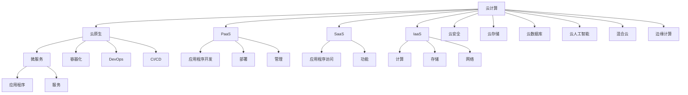

                 

# 云计算时代的程序员创业机会

> 关键词：云计算, 编程语言, 云计算市场, 云原生架构, 创业机会

## 1. 背景介绍

### 1.1 问题由来

随着技术的飞速发展和互联网的广泛应用，云计算已逐渐成为各行各业不可或缺的基础设施。无论是传统企业还是互联网初创公司，都在积极探索如何利用云计算优化资源利用、提升业务效率和降低运营成本。云计算不仅改变了企业的IT架构和业务模式，也孕育了大量的创业机会，吸引越来越多的程序员涉足这一领域。

### 1.2 问题核心关键点

云计算时代的程序员创业机会主要集中在以下几个方面：

1. **云原生应用**：随着微服务、DevOps等云原生技术的发展，越来越多的企业开始采用云原生架构来提升应用系统的灵活性、可伸缩性和可用性。

2. **云平台服务**：各大云服务商提供的PaaS、SaaS、IaaS等平台服务，为企业提供了丰富的技术能力和工具，极大地降低了企业搭建、维护和管理IT基础设施的复杂度。

3. **云安全**：云服务带来了数据和应用的迁移，同时也引入了新的安全威胁。因此，云安全成为了云计算领域的重要组成部分。

4. **云存储和数据库**：随着数据量的爆炸式增长，云存储和数据库技术的发展为数据的存储、管理和分析提供了新的解决方案。

5. **云人工智能**：利用云计算的强大计算能力和大数据处理能力，推动人工智能应用的落地，包括语音识别、图像处理、自然语言处理等领域。

6. **云计算市场**：随着全球云计算市场的快速增长，云计算企业不断涌现，为程序员创业提供了广阔的空间。

7. **混合云和边缘计算**：混合云和边缘计算技术的发展，使得企业能够在公有云和私有云之间灵活切换，同时能够利用边缘计算的优势，提升应用性能和用户体验。

## 2. 核心概念与联系

### 2.1 核心概念概述

为了更好地理解云计算时代的程序员创业机会，本节将介绍几个密切相关的核心概念：

- **云计算(Cloud Computing)**：利用网络技术，通过互联网提供计算、存储、网络等基础设施的服务。云计算是一种按需使用的服务模式，可以帮助企业降低成本、提高灵活性。

- **云原生(Cloud Native)**：指在云环境下设计和运行的软件架构，包括微服务、容器化、DevOps、CI/CD等技术。云原生架构使得应用系统更加灵活、可伸缩、可维护。

- **微服务(Microservices)**：将一个大系统分解为多个小型、自治的服务，每个服务独立部署、独立运行，能够提升系统的可扩展性和可维护性。

- **容器化(Containerization)**：将应用程序和其依赖打包到容器（如Docker）中，使得应用程序的打包、部署、运行更加简单、可移植。

- **DevOps**：一种将开发和运维流程紧密结合的软件开发模式，强调持续交付、持续集成、自动化测试等实践。

- **PaaS(Platform as a Service)**：云平台服务的一种，提供应用程序开发、部署、管理所需的工具和环境。

- **SaaS(Software as a Service)**：云平台服务的一种，提供应用程序的访问和功能，用户无需安装和维护。

- **IaaS(Infrastructure as a Service)**：云平台服务的一种，提供计算、存储、网络等基础设施，用户可以自行部署和管理。

- **云安全(Cloud Security)**：保护云计算环境中的数据、应用和基础设施的安全。

- **云存储(Cloud Storage)**：利用云计算平台提供的存储服务，进行数据的存储、备份和恢复。

- **云数据库(Cloud Database)**：利用云计算平台提供的数据库服务，进行数据的存储、管理和分析。

- **云人工智能(Cloud AI)**：利用云计算平台提供的计算能力和数据处理能力，进行人工智能应用的开发和部署。

- **混合云(Hybrid Cloud)**：将公有云和私有云结合起来，形成混合云架构，实现数据和应用的灵活迁移。

- **边缘计算(Edge Computing)**：将计算资源和数据存储在靠近终端用户的位置，提高应用性能和用户体验。

这些核心概念之间的逻辑关系可以通过以下Mermaid流程图来展示：



这个流程图展示了一系列云计算相关的核心概念及其之间的关系：

1. 云计算平台提供了PaaS、SaaS、IaaS等基础设施服务。
2. 云原生架构包括了微服务、容器化、DevOps、CI/CD等技术。
3. 微服务、容器化和DevOps等技术支持云平台服务的开发、部署和管理。
4. 云计算平台集成了云安全、云存储、云数据库和云人工智能等技术。
5. 混合云和边缘计算提供了更灵活和高效的应用部署和数据处理方式。

## 3. 核心算法原理 & 具体操作步骤
### 3.1 算法原理概述

云计算时代的程序员创业机会，主要基于云计算平台提供的基础设施和服务，结合云原生技术进行应用开发和部署。其核心原理可以总结如下：

1. **按需服务**：云计算提供按需使用的服务，用户只需支付实际使用的资源，无需事先购买硬件和软件。

2. **弹性伸缩**：云计算平台可以根据用户需求动态调整资源，确保应用的稳定性和可伸缩性。

3. **多租户支持**：云计算平台支持多租户环境，各租户之间资源隔离，数据安全可靠。

4. **全球服务**：云计算平台提供全球覆盖的服务，用户可以方便地访问全球资源。

### 3.2 算法步骤详解

基于云计算平台的程序员创业机会，通常包括以下几个关键步骤：

**Step 1: 选择合适的云平台**

- 评估各大云服务商（如AWS、Azure、Google Cloud）的能力、价格和服务质量。
- 选择最适合自身业务需求和预算的云平台。

**Step 2: 设计和构建云原生应用**

- 使用云原生架构设计系统，如微服务、DevOps、CI/CD等。
- 选择合适的编程语言和技术栈，如Go、Java、Python、Kubernetes等。
- 设计和实现系统架构，确保系统的可扩展性、可用性和可维护性。

**Step 3: 部署和测试**

- 将应用部署到云平台，使用容器化技术如Docker进行打包。
- 利用CI/CD工具自动化测试和部署过程。
- 在云平台上进行负载测试，确保系统的稳定性和性能。

**Step 4: 运营和监控**

- 使用云平台提供的监控工具（如云监控、日志服务）进行应用监控。
- 设置自动告警和故障恢复机制，确保系统的可用性。
- 定期进行系统升级和优化，提升应用性能。

**Step 5: 扩展和迁移**

- 根据业务需求，动态调整云资源，进行弹性伸缩。
- 利用混合云和边缘计算技术，实现应用的灵活迁移。

### 3.3 算法优缺点

基于云计算平台和云原生技术的程序员创业机会，具有以下优点：

1. **成本低**：按需使用，避免前期硬件和软件投入，降低运营成本。
2. **灵活性高**：可以根据业务需求动态调整资源，提升系统的灵活性和可扩展性。
3. **可伸缩性**：云平台支持弹性伸缩，能够应对突发流量和高并发场景。
4. **可靠性高**：多租户环境，数据安全和隔离，降低系统故障风险。
5. **全球覆盖**：云平台提供全球覆盖的服务，方便全球部署和访问。

同时，也存在以下缺点：

1. **依赖第三方**：依赖云服务商提供的服务，存在依赖性风险。
2. **性能瓶颈**：云平台资源共享，性能可能受限于其他租户。
3. **合规性问题**：不同国家对数据隐私和安全有不同规定，需合规操作。
4. **技术门槛**：需要掌握云平台和云原生技术，增加学习成本。

### 3.4 算法应用领域

基于云计算平台的程序员创业机会，覆盖了以下多个领域：

- **SaaS平台**：利用云平台提供的基础设施，开发和部署SaaS应用，如CRM、ERP、HRM等。
- **PaaS服务**：提供PaaS服务，如开发平台、测试平台、运维平台等。
- **AI应用**：利用云平台的计算能力和数据处理能力，开发和部署AI应用，如自然语言处理、图像识别、机器学习等。
- **DevOps工具**：开发和部署DevOps工具，如自动化测试工具、持续集成工具、监控工具等。
- **云存储和数据库**：提供云存储和数据库服务，如云存储解决方案、云数据库解决方案等。
- **混合云和边缘计算**：提供混合云和边缘计算解决方案，实现应用的灵活迁移和性能优化。

## 4. 数学模型和公式 & 详细讲解 & 举例说明
### 4.1 数学模型构建

云计算时代的程序员创业机会，主要依赖云计算平台提供的基础设施和服务。因此，本文主要讨论基于云计算平台的系统设计、资源管理和性能优化等方面的数学模型和公式。

假设一个云计算平台提供$M$个计算节点，每个节点的计算能力为$C$，存储容量为$S$，网络带宽为$B$。

记用户的应用负载为$L$，计算需求为$C'$，存储需求为$S'$，网络需求为$B'$。

则系统的资源分配问题可以表示为：

$$
\min_{x,y,z} \sum_{i=1}^M (x_i \cdot C + y_i \cdot S + z_i \cdot B)
$$

其中$x_i$表示第$i$个节点的计算资源分配量，$y_i$表示第$i$个节点的存储资源分配量，$z_i$表示第$i$个节点的网络资源分配量。

约束条件为：

$$
\begin{cases}
\sum_{i=1}^M x_i = C' \\
\sum_{i=1}^M y_i = S' \\
\sum_{i=1}^M z_i = B' \\
x_i \geq 0, y_i \geq 0, z_i \geq 0
\end{cases}
$$

### 4.2 公式推导过程

在上述资源分配问题中，目标是最小化总资源成本，约束条件是满足计算、存储和网络需求。

使用线性规划算法求解该问题，可以得到最优解。

设$x^*$、$y^*$、$z^*$分别为计算、存储和网络资源的分配量，则有：

$$
x^* = \frac{C'}{\sum_{i=1}^M C_i} \cdot \frac{C'}{\sum_{i=1}^M C' \cdot \frac{C'}{\sum_{i=1}^M C_i}}
$$

$$
y^* = \frac{S'}{\sum_{i=1}^M S_i} \cdot \frac{S'}{\sum_{i=1}^M S' \cdot \frac{S'}{\sum_{i=1}^M S_i}}
$$

$$
z^* = \frac{B'}{\sum_{i=1}^M B_i} \cdot \frac{B'}{\sum_{i=1}^M B' \cdot \frac{B'}{\sum_{i=1}^M B_i}}
$$

### 4.3 案例分析与讲解

假设有一个电子商务网站，需要部署在云平台上。该网站日均访问量约为10万次，每次请求需要0.1秒的计算时间和100MB的存储空间。

已知云平台提供1000个计算节点，每个节点的计算能力为2GHz，存储容量为1TB，网络带宽为1Gbps。

则可以通过上述公式计算出最优资源分配方案，确保系统在满足业务需求的同时，最大化资源利用率，降低成本。

## 5. 项目实践：代码实例和详细解释说明
### 5.1 开发环境搭建

在进行云计算项目实践前，我们需要准备好开发环境。以下是使用Python和Kubernetes进行云计算项目开发的环境配置流程：

1. 安装Anaconda：从官网下载并安装Anaconda，用于创建独立的Python环境。

2. 创建并激活虚拟环境：
```bash
conda create -n cloud-env python=3.8 
conda activate cloud-env
```

3. 安装Kubernetes集群管理工具：
```bash
kubectl version
kubectl cluster-info
```

4. 安装必要的Python包：
```bash
pip install kubernetes tensorflow
```

5. 安装云平台SDK：
```bash
pip install awscli azure-cli
```

完成上述步骤后，即可在`cloud-env`环境中开始云计算项目实践。

### 5.2 源代码详细实现

这里我们以一个简单的云原生应用为例，使用Kubernetes和TensorFlow进行云计算项目的开发和部署。

首先，定义一个基于TensorFlow的云原生应用：

```python
import tensorflow as tf

class CloudApp(tf.keras.Model):
    def __init__(self):
        super(CloudApp, self).__init__()
        self.dense1 = tf.keras.layers.Dense(64, activation='relu')
        self.dense2 = tf.keras.layers.Dense(10, activation='softmax')
    
    def call(self, inputs):
        x = self.dense1(inputs)
        x = self.dense2(x)
        return x

app = CloudApp()
model = app.compile(optimizer=tf.keras.optimizers.Adam(), loss=tf.keras.losses.SparseCategoricalCrossentropy(), metrics=[tf.keras.metrics.SparseCategoricalAccuracy()])
```

然后，使用Kubernetes部署该应用：

```python
# 定义服务部署文件
apiVersion: v1
kind: Service
metadata:
  name: cloud-app-service
spec:
  selector:
    app: cloud-app
  ports:
    - port: 80
      targetPort: 8080

# 定义应用部署文件
apiVersion: apps/v1
kind: Deployment
metadata:
  name: cloud-app-deployment
spec:
  replicas: 3
  selector:
    matchLabels:
      app: cloud-app
  template:
    metadata:
      labels:
        app: cloud-app
    spec:
      containers:
      - name: cloud-app-container
        image: cloud-app:latest
        ports:
          - containerPort: 8080
        resources:
          limits:
            cpu: 1
            memory: 512Mi
          requests:
            cpu: 0.5
            memory: 256Mi
```

接下来，使用kubectl命令行工具部署应用：

```bash
kubectl apply -f cloud-app-service.yaml
kubectl apply -f cloud-app-deployment.yaml
```

### 5.3 代码解读与分析

这里我们详细解读一下关键代码的实现细节：

**CloudApp类**：
- `__init__`方法：初始化模型，定义了两个全连接层。
- `call`方法：前向传播，对输入进行两个全连接层的处理，并输出结果。

**服务部署文件**：
- 定义了服务（Service），将应用容器暴露为服务端口，方便外部访问。

**应用部署文件**：
- 定义了部署（Deployment），指定了容器镜像、副本数、资源限制等配置。

通过上述代码实现，可以看出使用Kubernetes进行云原生应用的部署相对简单，只需要定义服务和服务资源配置文件，使用kubectl命令行工具进行部署即可。

## 6. 实际应用场景
### 6.1 云计算平台服务

云计算平台服务是程序员创业的重要方向之一。各大云服务商提供了丰富的云平台服务，如AWS的EC2、S3、RDS，Azure的VM、Blob、SQL Database，Google Cloud的Compute Engine、Cloud Storage、Cloud SQL等。

基于这些云平台服务，程序员可以开发和部署各种SaaS应用，如云存储解决方案、云数据库解决方案、云安全解决方案等。

### 6.2 云原生应用

云原生应用是程序员创业的另一大方向。使用云原生架构（如微服务、容器化、DevOps）设计和构建云原生应用，可以大大提升应用系统的灵活性、可伸缩性和可用性。

云原生应用包括但不限于：

- **云SaaS平台**：如CRM、ERP、HRM等。
- **云PaaS服务**：如开发平台、测试平台、运维平台等。
- **云DevOps工具**：如自动化测试工具、持续集成工具、监控工具等。

### 6.3 云安全

云安全是云计算应用中至关重要的一环。云安全不仅涉及数据和应用的安全，还涉及云计算平台的安全。

基于云平台提供的安全服务和工具，程序员可以开发和部署云安全解决方案，如网络安全、应用安全、数据安全等。

### 6.4 云存储和数据库

云存储和数据库是云计算应用的重要基础设施。利用云平台提供的云存储和数据库服务，可以大大降低数据存储和管理的成本。

程序员可以开发和部署云存储解决方案、云数据库解决方案，提升数据存储和管理的效率和可靠性。

### 6.5 云人工智能

云人工智能是云计算应用的重要方向之一。利用云计算平台的计算能力和数据处理能力，程序员可以开发和部署各种AI应用，如自然语言处理、图像识别、机器学习等。

云人工智能包括但不限于：

- **云自然语言处理**：如语音识别、文本分析、情感分析等。
- **云图像识别**：如图像分类、物体检测、人脸识别等。
- **云机器学习**：如推荐系统、预测分析等。

### 6.6 混合云和边缘计算

混合云和边缘计算是云计算应用的重要趋势之一。利用混合云和边缘计算技术，可以提升应用的灵活性和性能。

程序员可以开发和部署混合云和边缘计算解决方案，实现应用的灵活迁移和性能优化。

## 7. 工具和资源推荐
### 7.1 学习资源推荐

为了帮助程序员掌握云计算和云原生技术的理论基础和实践技巧，这里推荐一些优质的学习资源：

1. **《云计算架构师指南》**：全面介绍云计算架构设计和管理，包括云平台、云原生、云安全等技术。
2. **《Kubernetes权威指南》**：深入讲解Kubernetes集群管理和容器编排，适合初学者和高级开发者。
3. **《TensorFlow实战》**：通过实际案例讲解TensorFlow框架的使用，适合数据分析和机器学习开发。
4. **《云原生应用》**：介绍云原生架构和DevOps工具，适合构建高可用、高性能、可伸缩的应用系统。
5. **《微服务设计与开发》**：讲解微服务架构的设计和实现，适合开发复杂的云原生应用。

### 7.2 开发工具推荐

高效的开发离不开优秀的工具支持。以下是几款用于云计算项目开发的常用工具：

1. **Anaconda**：用于创建和管理Python环境，支持多种Python版本和依赖包管理。
2. **Kubernetes**：容器编排工具，支持集群管理和应用部署。
3. **TensorFlow**：深度学习框架，支持模型训练和推理。
4. **AWS CLI、Azure CLI、Google Cloud SDK**：云平台SDK，用于管理和操作云资源。
5. **Docker**：容器化工具，用于打包和部署应用。
6. **Jupyter Notebook**：交互式编程环境，支持Python、R、Scala等多种编程语言。

### 7.3 相关论文推荐

云计算和云原生技术的发展得益于学界的持续研究。以下是几篇奠基性的相关论文，推荐阅读：

1. **《云计算架构》**：介绍云计算架构设计和实践，涉及云平台、云原生、云安全等技术。
2. **《Kubernetes：集群管理工具》**：介绍Kubernetes集群管理和容器编排技术。
3. **《TensorFlow：深度学习框架》**：介绍TensorFlow框架的使用和优化。
4. **《微服务架构》**：介绍微服务架构的设计和实现，支持云原生应用的开发。
5. **《云原生应用》**：介绍云原生架构和DevOps工具，提升应用系统的灵活性和可伸缩性。

这些论文代表了大规模云计算和云原生技术的发展脉络，为云计算领域的创新发展提供了理论支持。

## 8. 总结：未来发展趋势与挑战
### 8.1 研究成果总结

本文对云计算时代的程序员创业机会进行了全面系统的介绍。首先阐述了云计算和云原生技术的发展背景和应用场景，明确了程序员在云计算领域可以创业的方向和机会。其次，从原理到实践，详细讲解了云计算平台、云原生应用、云安全、云存储和数据库、云人工智能、混合云和边缘计算等关键技术，给出了云计算项目开发的完整代码实例。同时，本文还探讨了云计算平台服务、云原生应用、云安全、云存储和数据库、云人工智能、混合云和边缘计算等实际应用场景，展示了云计算技术的广泛应用。最后，本文精选了云计算和云原生技术的各类学习资源，力求为程序员提供全方位的技术指引。

通过本文的系统梳理，可以看到，云计算和云原生技术的发展为程序员创业提供了广阔的空间，极大地降低了创业门槛，提升了创业效率和成功率。未来，云计算和云原生技术将与人工智能、大数据等前沿技术深度融合，推动云计算和AI应用的不断演进，带来更多的创新机会和发展机遇。

### 8.2 未来发展趋势

展望未来，云计算和云原生技术将呈现以下几个发展趋势：

1. **云原生生态不断完善**：云原生技术生态不断丰富，支持微服务、容器化、DevOps、CI/CD等技术，提升应用系统的灵活性和可伸缩性。
2. **混合云和边缘计算普及**：混合云和边缘计算技术不断普及，提升应用性能和用户体验。
3. **云人工智能不断突破**：云人工智能技术不断突破，推动自然语言处理、图像识别、机器学习等领域的创新发展。
4. **云安全不断增强**：云安全技术不断增强，提升云计算平台和云应用的安全性。
5. **云平台服务不断优化**：云平台服务不断优化，提供更丰富、更高效、更灵活的服务。
6. **云存储和数据库不断发展**：云存储和数据库技术不断发展，提升数据存储和管理的效率和可靠性。

### 8.3 面临的挑战

尽管云计算和云原生技术的发展势头强劲，但在迈向更加智能化、普适化应用的过程中，仍面临诸多挑战：

1. **成本问题**：云计算平台和云应用的开销较高，对中小型企业的负担较大。如何降低成本，提高性价比，将是未来的一个重要挑战。
2. **性能瓶颈**：云平台资源共享，性能可能受限于其他租户，如何优化资源利用，提升应用性能，是未来的一个重要课题。
3. **安全问题**：云计算平台和云应用面临复杂的安全威胁，如何保障数据和应用的安全，是未来的一个重要方向。
4. **技术复杂性**：云平台和云原生技术较为复杂，如何降低学习成本，提高开发效率，是未来的一个重要挑战。
5. **标准化问题**：云平台和云原生技术标准尚未完全统一，如何推动标准化进程，促进不同平台和技术的兼容和互操作，是未来的一个重要方向。
6. **管理复杂性**：云平台和云原生技术的复杂性增加，如何简化管理流程，提升运营效率，是未来的一个重要课题。

### 8.4 研究展望

面向未来，云计算和云原生技术的研发需要在以下几个方面寻求新的突破：

1. **成本优化**：研究云平台和服务成本优化技术，降低中小企业的云应用成本。
2. **性能提升**：研究云平台和应用性能优化技术，提升云应用性能和用户体验。
3. **安全保障**：研究云平台和云应用的安全技术，提升数据和应用的安全性。
4. **标准化推进**：推动云平台和云原生技术标准的制定和推广，促进不同平台和技术的兼容和互操作。
5. **管理简化**：研究云平台和管理工具的优化技术，提升云平台和云应用的运营效率。
6. **创新突破**：推动云平台和云原生技术的创新发展，探索新的应用场景和商业模式。

总之，云计算和云原生技术的前景广阔，挑战重重。未来，需要学界和产业界的共同努力，推动云计算和云原生技术的不断进步，带来更多创新机会和发展机遇。相信随着技术的不断演进和成熟，云计算和云原生技术必将在各行各业中发挥更大作用，引领云计算和AI应用的不断创新和发展。

## 9. 附录：常见问题与解答

**Q1: 云计算和云原生技术的核心优势是什么？**

A: 云计算和云原生技术的核心优势在于其按需使用、弹性伸缩、多租户支持、全球覆盖等特性。

**Q2: 如何选择合适的云平台？**

A: 选择合适的云平台需要考虑以下几个因素：性能、稳定性、安全性、价格、可扩展性、可用性、管理复杂度等。

**Q3: 如何设计和构建云原生应用？**

A: 设计和构建云原生应用需要遵循微服务、容器化、DevOps等原则，使用云原生框架和工具，如Kubernetes、Docker、TensorFlow等。

**Q4: 如何优化云平台资源利用？**

A: 优化云平台资源利用需要采用弹性伸缩、负载均衡、自动扩缩容等技术，提升应用性能和成本效益。

**Q5: 如何提升云平台和应用的安全性？**

A: 提升云平台和应用的安全性需要采用网络隔离、身份认证、访问控制、数据加密等技术，确保数据和应用的安全。

**Q6: 如何简化云平台和管理工具的使用？**

A: 简化云平台和管理工具的使用需要采用统一管理界面、自动化配置、监控告警等技术，提升云平台和应用的运营效率。

**Q7: 如何推动云计算和云原生技术的标准化？**

A: 推动云计算和云原生技术的标准化需要制定和推广云平台、云服务、云应用的标准和规范，促进不同平台和技术的兼容和互操作。

总之，云计算和云原生技术为程序员创业提供了广阔的空间，但也面临着诸多挑战。通过不断优化和创新，云计算和云原生技术必将在各行各业中发挥更大作用，推动云计算和AI应用的不断演进和发展。

---

作者：禅与计算机程序设计艺术 / Zen and the Art of Computer Programming

