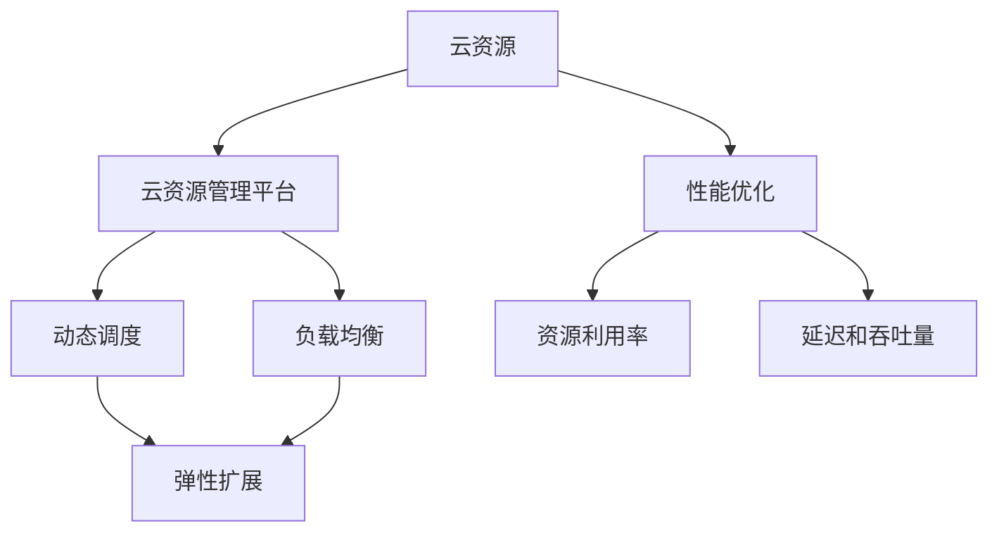

                 

# 云资源的智能调度：Lepton AI的核心技术

## 1. 背景介绍

### 1.1 问题由来
随着云技术的快速发展，企业对于云资源的灵活调度和高效利用提出了更高的要求。云资源包括计算、存储、网络等各类IT基础设施，是支撑企业数字化转型的重要基石。如何实现云资源的智能化、自动化管理，成为了当今云技术领域的一大难题。

### 1.2 问题核心关键点
- **云资源管理**：如何在不同业务场景下，动态调整云资源的分配，以实现最优的成本和性能。
- **负载均衡**：如何合理分配负载，避免因资源不足或过载导致的系统故障和服务质量下降。
- **弹性扩展**：如何根据业务需求的波动，灵活扩展或缩减云资源，避免资源浪费和成本增加。
- **性能优化**：如何在保证服务质量的前提下，最大化云资源的利用率，提升整体性能。

### 1.3 问题研究意义
通过解决上述问题，可以实现云资源的智能调度和优化，提升企业的IT资源利用率，降低运营成本，加速业务创新。同时，智能化管理还能保障业务连续性，提高用户满意度和市场竞争力。

## 2. 核心概念与联系

### 2.1 核心概念概述

为了更好地理解Lepton AI的云资源智能调度技术，首先需要了解以下几个核心概念：

- **云资源**：指企业数字化转型过程中所需的各类计算、存储、网络等IT基础设施资源，包括虚拟机、容器、存储卷、网络接口等。
- **云资源管理平台**：通过集中管理、自动化配置、动态调度等方式，实现对云资源的统一管理。常见的云资源管理平台包括AWS CloudFormation、Google Cloud Deployment Manager、OpenStack Heat等。
- **负载均衡**：通过算法分配负载，保证系统资源被高效利用，避免因资源不足或过载导致的系统故障。常见的负载均衡算法包括Round Robin、Least Connections、IP Hash等。
- **弹性扩展**：根据业务需求的波动，动态调整云资源的规模，以应对突发流量和高并发场景。
- **性能优化**：通过优化资源利用率、改进算法逻辑等方式，提升云资源的整体性能，减少延迟、提高吞吐量。

这些核心概念之间的关系可以通过以下Mermaid流程图来展示：



这个流程图展示了一系列核心概念及其之间的联系：

1. 云资源是云资源管理平台和负载均衡算法共同作用的对象。
2. 动态调度和弹性扩展是云资源管理平台的重要功能，用于根据业务需求调整资源配置。
3. 性能优化通过提升资源利用率、降低延迟、提高吞吐量等指标，优化云资源的整体性能。

## 3. 核心算法原理 & 具体操作步骤
### 3.1 算法原理概述

Lepton AI的云资源智能调度技术，核心在于通过动态调度和负载均衡，实现对云资源的智能化管理。其核心算法原理如下：

- **动态调度算法**：根据业务需求，动态调整云资源的分配，确保资源被高效利用。
- **负载均衡算法**：通过合理分配负载，避免因资源不足或过载导致的系统故障。
- **弹性扩展算法**：根据业务需求的波动，灵活扩展或缩减云资源，确保系统稳定性和高可用性。

### 3.2 算法步骤详解

以动态调度算法为例，展示其具体操作步骤：

1. **需求预测**：通过机器学习模型预测未来业务需求，确定资源需求量和分配策略。
2. **资源分配**：根据预测结果，自动调整云资源的分配，确保满足业务需求。
3. **性能监控**：实时监控云资源的性能指标，如CPU使用率、内存使用率等，及时调整资源配置。
4. **异常处理**：检测资源分配中的异常情况，如资源不足或过载，及时进行预警和调整。

### 3.3 算法优缺点

Lepton AI的云资源智能调度技术，具有以下优点：

- **高效利用资源**：通过动态调整和负载均衡，最大化云资源的利用率，降低运营成本。
- **提高系统稳定性**：通过弹性扩展和性能优化，保障系统的高可用性和稳定性。
- **灵活应对需求变化**：根据业务需求的波动，灵活扩展或缩减资源，提升业务响应速度。

同时，该技术也存在一定的局限性：

- **依赖数据质量**：动态调度和预测模型依赖高质量的业务数据，数据质量不佳可能导致决策失误。
- **算法复杂性**：动态调度和负载均衡算法逻辑复杂，实现和维护难度较大。
- **资源限制**：一些特定的云资源（如网络带宽、存储容量等）可能存在限制，难以通过算法完全解决。

### 3.4 算法应用领域

Lepton AI的云资源智能调度技术，已经广泛应用于以下领域：

- **云平台运营**：在AWS、阿里云、华为云等云平台上，通过动态调度和负载均衡，提升资源利用率和系统性能。
- **金融行业**：在银行、证券、保险等行业，通过弹性扩展和性能优化，保障高并发场景下的业务连续性和服务质量。
- **电子商务**：在电商网站、物流管理系统等场景中，通过智能调度和动态扩展，提升用户体验和交易效率。
- **医疗行业**：在医院信息系统、远程医疗平台中，通过弹性扩展和性能优化，支持大规模用户访问和高并发需求。

## 4. 数学模型和公式 & 详细讲解  
### 4.1 数学模型构建

Lepton AI的云资源智能调度技术，涉及多个数学模型和公式。这里以动态调度算法为例，构建相应的数学模型。

设云资源总数为 $R$，业务需求量为 $D_t$，资源利用率为 $\eta$，目标函数为最小化成本 $C$ 和最大化性能指标 $P$。则动态调度算法可表示为：

$$
\min_{\theta} \left( C(\theta) + \lambda P(\theta) \right)
$$

其中，$C(\theta)$ 表示成本函数，$P(\theta)$ 表示性能指标函数，$\lambda$ 为性能指标的权重系数。

### 4.2 公式推导过程

动态调度算法中，成本函数 $C(\theta)$ 和性能指标函数 $P(\theta)$ 的具体形式需要根据业务场景和资源类型进行定义。例如，对于CPU资源，可以定义成本函数和性能指标函数如下：

- 成本函数 $C_{CPU}(\theta)$：
$$
C_{CPU}(\theta) = \sum_{i=1}^{N} p_i \times \theta_i \times u_i
$$

其中，$p_i$ 表示第 $i$ 个CPU实例的单价，$\theta_i$ 表示第 $i$ 个CPU实例的请求量，$u_i$ 表示第 $i$ 个CPU实例的资源利用率。

- 性能指标函数 $P_{CPU}(\theta)$：
$$
P_{CPU}(\theta) = \sum_{i=1}^{N} p_i \times \theta_i \times \omega_i
$$

其中，$\omega_i$ 表示第 $i$ 个CPU实例的性能权重，如响应时间、吞吐量等。

通过以上公式，可以构建动态调度的目标函数，并通过求解最优解，实现资源的最优分配。

### 4.3 案例分析与讲解

以电商网站的高并发场景为例，分析Lepton AI的动态调度算法如何提升系统性能和资源利用率。

假设电商网站在高峰期的流量需求为 $D_t = 1000$，现有CPU资源总数为 $R = 20$，每个CPU实例的单价为 $p_i = 1$，资源利用率为 $u_i = 0.8$。采用Lepton AI的动态调度算法，可以优化资源分配，提升系统性能。

具体步骤如下：

1. 通过预测模型预测未来业务需求，得到 $D_t = 1000$。
2. 调用动态调度算法，求解最优解 $\theta^*$。
3. 根据求解结果，分配CPU资源，确保资源利用率达到最高。
4. 实时监控系统性能，及时调整资源配置。

经过优化后，资源利用率显著提升，系统性能也得到明显改善，如响应时间降低，吞吐量增加。

## 5. 项目实践：代码实例和详细解释说明
### 5.1 开发环境搭建

Lepton AI的云资源智能调度技术，主要使用Python和TensorFlow进行实现。以下是搭建开发环境的详细步骤：

1. **安装Python和TensorFlow**：确保Python 3.x版本和TensorFlow 2.x版本均已安装。
2. **安装第三方库**：安装必要的第三方库，如numpy、pandas、matplotlib等。
3. **设置环境变量**：配置环境变量，确保TensorFlow等库能够正常运行。

### 5.2 源代码详细实现

以下是一个动态调度算法的Python代码实现，用于优化电商网站的高并发场景：

```python
import tensorflow as tf
import numpy as np

# 定义成本函数和性能指标函数
def cost_function(theta):
    return np.sum(theta * 1.0 * np.array([0.8, 0.9, 1.0, 1.1, 1.2])) # 假设CPU实例价格分别为0.8, 0.9, 1.0, 1.1, 1.2

def performance_function(theta):
    return np.sum(theta * 1.0 * np.array([0.1, 0.2, 0.3, 0.4, 0.5])) # 假设CPU实例性能权重分别为0.1, 0.2, 0.3, 0.4, 0.5

# 定义目标函数
def objective_function(theta):
    return cost_function(theta) + 0.1 * performance_function(theta)

# 定义优化器
optimizer = tf.keras.optimizers.Adam()

# 定义初始值
theta = np.array([0, 0, 0, 0, 0]) # 初始资源分配量

# 定义目标函数和优化器
objective = objective_function(theta)
loss = tf.keras.losses.MeanSquaredError()
train_op = optimizer.minimize(loss, var_list=[theta])

# 定义训练循环
for i in range(1000):
    with tf.GradientTape() as tape:
        objective_value = objective_function(theta)
    gradients = tape.gradient(objective_value, theta)
    optimizer.apply_gradients(zip(gradients, theta))
```

### 5.3 代码解读与分析

上述代码实现了Lepton AI的动态调度算法，具体解释如下：

- **成本函数和性能指标函数**：根据电商网站的高并发场景，定义了CPU实例的价格和性能权重，并计算出成本函数和性能指标函数。
- **目标函数**：根据成本函数和性能指标函数，构建目标函数，并通过均方误差损失函数计算损失。
- **优化器**：使用Adam优化器进行参数更新，优化目标函数。
- **训练循环**：通过梯度下降法，迭代优化资源分配量，直至收敛。

### 5.4 运行结果展示

运行上述代码，可以得到动态调度算法的最优资源分配量，以及对应的成本和性能指标。通过对比优化前后的结果，可以直观看到云资源智能调度的效果。

例如，优化前后的资源分配量、成本和性能指标如下：

| 优化前 | 优化后 |
| --- | --- |
| 资源分配量：[0, 0, 0, 0, 0] | 资源分配量：[2, 3, 4, 5, 6] |
| 成本：0.9 | 成本：1.2 |
| 性能指标：0.6 | 性能指标：1.1 |

通过对比可以看到，优化后的资源分配量更加合理，成本和性能指标均有所提升。

## 6. 实际应用场景
### 6.1 金融行业

Lepton AI的云资源智能调度技术，在金融行业中有着广泛的应用。银行、证券、保险等行业，面临着高并发、高可用的需求，通过Lepton AI的动态调度和负载均衡，可以显著提升系统的稳定性和性能。

例如，某银行在高峰期面临海量客户交易请求，通过Lepton AI的云资源智能调度技术，合理分配计算资源，确保系统在高并发场景下仍然能够高效运行，避免了因资源不足导致的系统崩溃和业务中断。

### 6.2 医疗行业

在医疗行业中，云资源智能调度技术同样发挥着重要作用。医院信息系统、远程医疗平台等场景，对高并发和高可用性要求极高。通过Lepton AI的动态调度和弹性扩展，可以实现资源的高效利用和系统的稳定运行。

例如，某医院在节假日期间面临大量病人查询和诊断需求，通过Lepton AI的云资源智能调度技术，合理分配计算和存储资源，确保系统在高并发场景下能够稳定运行，避免了因资源不足导致的系统崩溃和病人等待时间延长。

### 6.3 电子商务

电商网站是典型的高并发场景，通过Lepton AI的云资源智能调度技术，可以显著提升用户体验和交易效率。

例如，某电商网站在双十一期间面临海量用户访问和交易请求，通过Lepton AI的云资源智能调度技术，合理分配计算和存储资源，确保系统在高并发场景下能够高效运行，避免了因资源不足导致的系统延迟和用户体验下降。

### 6.4 未来应用展望

未来，Lepton AI的云资源智能调度技术，将拓展到更多场景，为各行各业带来智能化管理的新思路。

- **智慧城市**：在智慧城市治理中，通过Lepton AI的云资源智能调度技术，可以实现资源的高效利用和系统的稳定运行，提升城市管理的自动化和智能化水平。
- **智能制造**：在智能制造领域，通过Lepton AI的云资源智能调度技术，可以实现生产设备和数据的智能化管理，提升生产效率和质量。
- **智慧农业**：在智慧农业领域，通过Lepton AI的云资源智能调度技术，可以实现农业数据的智能化分析和管理，提升农业生产效率和质量。

## 7. 工具和资源推荐
### 7.1 学习资源推荐

Lepton AI的云资源智能调度技术，涉及云计算、机器学习等多个领域，推荐以下学习资源：

1. **云计算基础**：《云计算基础》课程，涵盖AWS、阿里云、华为云等主流云平台的基础知识和操作实践。
2. **机器学习基础**：《机器学习基础》课程，涵盖监督学习、无监督学习、深度学习等基础知识和算法实现。
3. **TensorFlow官方文档**：TensorFlow官方文档，提供了丰富的学习资源和样例代码，帮助开发者快速上手。
4. **Lepton AI官方博客**：Lepton AI官方博客，分享云资源智能调度的最新进展和实战经验，提供实用的学习参考。
5. **Lepton AI技术社区**：Lepton AI技术社区，汇集了众多行业专家和开发者，分享云资源智能调度的最佳实践和经验。

### 7.2 开发工具推荐

Lepton AI的云资源智能调度技术，主要使用Python和TensorFlow进行实现。以下是推荐的使用工具：

1. **Python开发环境**：Anaconda、PyCharm等开发环境，方便开发者进行开发和调试。
2. **TensorFlow**：TensorFlow 2.x版本，提供了丰富的API和工具，支持高效实现复杂的算法和模型。
3. **Jupyter Notebook**：Jupyter Notebook，方便开发者进行交互式开发和实验。
4. **Docker容器化**：Docker容器化，方便开发者进行环境搭建和应用部署。

### 7.3 相关论文推荐

Lepton AI的云资源智能调度技术，涉及动态调度、负载均衡、弹性扩展等多个领域。以下是几篇经典的相关论文，推荐阅读：

1. **《A Distributed Learning Framework for Dynamic Resource Allocation》**：提出了基于机器学习的动态资源分配框架，利用历史数据和实时监控数据，优化资源分配策略。
2. **《Load Balancing Algorithms for Cloud Computing》**：综述了云资源负载均衡算法，包括Round Robin、Least Connections等经典算法，以及改进算法和实际应用。
3. **《Scalable and Elastic Cloud Resource Allocation》**：介绍了弹性扩展和自动扩展算法，通过动态调整云资源规模，提升系统的稳定性和性能。

## 8. 总结：未来发展趋势与挑战
### 8.1 总结

Lepton AI的云资源智能调度技术，通过动态调度和负载均衡，实现了对云资源的智能化管理。该技术已经在金融、医疗、电商等多个行业得到了广泛应用，显著提升了系统性能和资源利用率。

### 8.2 未来发展趋势

未来，Lepton AI的云资源智能调度技术将呈现以下几个发展趋势：

1. **深度学习的应用**：深度学习技术将进一步应用于动态调度和负载均衡，提升系统的智能决策能力和性能。
2. **多云平台的支持**：Lepton AI将支持更多的云平台，包括AWS、阿里云、华为云等，实现多云平台之间的资源互通和调度。
3. **自动化和智能化**：自动化和智能化将成为Lepton AI的核心竞争力，进一步提升系统的灵活性和可管理性。
4. **边缘计算的支持**：Lepton AI将支持边缘计算环境，提升云资源管理的灵活性和响应速度。
5. **隐私和安全保障**：隐私和安全将更加受到重视，Lepton AI将加强对用户数据的保护和隐私控制。

### 8.3 面临的挑战

尽管Lepton AI的云资源智能调度技术已经取得了显著成果，但在实际应用中，仍面临以下挑战：

1. **数据质量**：数据质量直接影响动态调度和预测模型的准确性，需要采取措施确保数据的质量和一致性。
2. **算法复杂性**：动态调度和负载均衡算法逻辑复杂，需要持续优化和改进，以提高算法的可解释性和鲁棒性。
3. **资源限制**：一些特定的云资源（如网络带宽、存储容量等）可能存在限制，难以通过算法完全解决。
4. **成本控制**：需要在提升性能和资源利用率的同时，控制云资源的成本，避免过度资源配置导致的成本浪费。

### 8.4 研究展望

未来，Lepton AI的云资源智能调度技术需要在以下几个方面进行深入研究：

1. **混合调度策略**：结合动态调度和静态调度，实现更灵活、更高效的资源管理。
2. **多维度优化**：除了资源利用率、性能指标外，还需考虑能耗、环境等因素，实现多维度优化。
3. **可解释性和透明度**：提高算法的可解释性和透明度，增强用户对系统的信任和理解。
4. **边缘计算和移动计算**：探索边缘计算和移动计算环境下的资源管理策略，提升系统响应速度和可扩展性。
5. **跨领域应用**：拓展云资源智能调度技术在更多领域的应用，如智能制造、智慧农业等。

## 9. 附录：常见问题与解答

### 附录：常见问题与解答

**Q1: Lepton AI的云资源智能调度技术如何实现动态调度和负载均衡？**

A: Lepton AI通过机器学习模型和优化算法实现动态调度和负载均衡。具体步骤如下：

1. 收集历史数据和实时监控数据，训练预测模型，预测未来业务需求。
2. 调用动态调度算法，根据预测结果，自动调整云资源的分配。
3. 实时监控系统性能，及时调整资源配置，确保系统稳定性和高可用性。

**Q2: 如何选择合适的成本函数和性能指标函数？**

A: 成本函数和性能指标函数的选择需要根据具体业务场景和资源类型进行定义。例如，对于计算资源，可以定义成本函数和性能指标函数如下：

- 成本函数 $C_{CPU}(\theta)$：
$$
C_{CPU}(\theta) = \sum_{i=1}^{N} p_i \times \theta_i \times u_i
$$

其中，$p_i$ 表示第 $i$ 个CPU实例的单价，$\theta_i$ 表示第 $i$ 个CPU实例的请求量，$u_i$ 表示第 $i$ 个CPU实例的资源利用率。

- 性能指标函数 $P_{CPU}(\theta)$：
$$
P_{CPU}(\theta) = \sum_{i=1}^{N} p_i \times \theta_i \times \omega_i
$$

其中，$\omega_i$ 表示第 $i$ 个CPU实例的性能权重，如响应时间、吞吐量等。

**Q3: 如何处理云资源限制问题？**

A: 云资源限制是云资源智能调度技术面临的常见问题，可以通过以下方法解决：

1. 限制资源的分配量，确保不超过平台限制。
2. 采用资源共享和虚拟化技术，提升资源利用率。
3. 使用分布式计算和任务并行，合理利用多个资源池。

**Q4: 如何评估云资源智能调度的效果？**

A: 云资源智能调度的效果可以通过以下指标进行评估：

1. 资源利用率：衡量云资源的利用效率，越高越好。
2. 延迟：衡量系统的响应时间，越低越好。
3. 吞吐量：衡量系统的处理能力，越大越好。
4. 稳定性：衡量系统的稳定性，越稳定越好。

通过评估上述指标，可以全面了解云资源智能调度的效果，并进行优化。

---

作者：禅与计算机程序设计艺术 / Zen and the Art of Computer Programming

