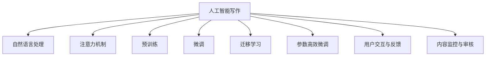

                 

## 1. 背景介绍

在数字经济的浪潮中，内容创作逐渐成为核心的价值源泉之一。这不仅体现在各类在线媒体、社交平台、视频网站中，更体现在商业营销、品牌建设、市场推广等各个领域。在这样的背景下，人工智能写作技术的兴起，成为关注焦点。人工智能写作，即通过计算机算法生成文本，辅以人类编辑和优化，为内容创作提供了新的思路和方法，引领了新的注意力经济形态。

### 1.1 问题由来
人工智能写作最早可以追溯到20世纪50年代的计算机语言生成研究。近年来，随着深度学习技术的发展，基于神经网络的文本生成模型，如GPT-3、ChatGPT、T0等，通过大规模无标签文本数据预训练，具备了强大的自然语言生成能力。这些模型结合先进的大模型微调、迁移学习、参数高效微调等技术，能够生成自然流畅、逻辑通顺的文本，大大提升了内容创作的效率和质量。

这些技术不仅应用于在线媒体、新闻编辑等领域，还在广告文案、创意写作、金融报告等各类商业场景中得到了广泛应用。例如，微软的GitHub Copilot利用人工智能模型辅助开发者编写代码，Google的新闻推荐系统利用AI生成个性化的新闻内容。在注意力经济时代，人工智能写作技术通过生成有吸引力的内容，增强用户关注度和参与度，为内容创作者带来了新的机遇和挑战。

### 1.2 问题核心关键点
人工智能写作的核心在于结合自然语言处理(NLP)技术和深度学习算法，在短时间内生成高质量文本。然而，这种生成过程需要合理地处理以下几个关键点：

1. **数据预处理与标注**：获取大规模高质量的文本数据，进行预处理和标注，是生成高质量文本的基础。
2. **模型选择与优化**：选择合适的文本生成模型，通过微调、迁移学习等方法，优化模型性能。
3. **用户交互与反馈**：引入用户交互与反馈机制，通过迭代优化生成内容，不断提升用户体验。
4. **内容监控与审核**：确保生成内容符合伦理规范和法律法规，避免有害信息传播。

以上几点共同构成了人工智能写作的核心挑战和研究重点，使得内容创作进入了一个全新的阶段。

## 2. 核心概念与联系

### 2.1 核心概念概述

为更好地理解人工智能写作在注意力经济中的应用，本节将介绍几个关键概念：

- 人工智能写作(AI Writing)：指利用计算机算法，生成自然语言文本的技术。包括基于神经网络的语言模型、基于规则的生成器、基于编辑器的优化器等。
- 自然语言处理(NLP)：研究计算机如何处理和理解自然语言的技术，包括文本分类、信息抽取、文本生成等。
- 注意力机制(Attention Mechanism)：在神经网络中，注意力机制通过动态选择输入序列的特定部分，来提高模型的计算效率和准确性。
- 预训练(Pre-training)：指在大规模无标签文本数据上，通过自监督学习任务训练语言模型的过程。如BERT、GPT-3等模型。
- 微调(Fine-tuning)：指在预训练模型的基础上，使用下游任务的少量标注数据，通过有监督学习优化模型在特定任务上的性能。
- 迁移学习(Transfer Learning)：指将一个领域学习到的知识，迁移应用到另一个不同但相关的领域的学习范式。
- 参数高效微调(Parameter-Efficient Fine-Tuning, PEFT)：指在微调过程中，只更新少量的模型参数，而固定大部分预训练权重不变，以提高微调效率。

这些核心概念之间的逻辑关系可以通过以下Mermaid流程图来展示：



这个流程图展示了大语言模型在AI写作中的核心概念及其之间的关系：

1. AI写作通过自然语言处理技术，进行文本生成和分析。
2. 注意力机制提高模型的计算效率和准确性。
3. 预训练为模型学习丰富的语言知识和常识打下基础。
4. 微调和迁移学习优化模型，使其适应特定的任务。
5. 参数高效微调提升模型效率，减少计算资源消耗。
6. 用户交互与反馈机制提升内容质量。
7. 内容监控与审核确保内容合规。

这些概念共同构成了人工智能写作的核心技术框架，使其在注意力经济中发挥重要作用。

## 3. 核心算法原理 & 具体操作步骤
### 3.1 算法原理概述

人工智能写作基于深度学习，通过生成模型进行文本创作。其核心思想是：利用大规模无标签文本数据对模型进行预训练，使其掌握语言的通用表示；然后在目标任务上使用少量标注数据，通过有监督学习进行微调，使模型能够生成符合特定需求的文本。

形式化地，假设预训练语言模型为 $M_{\theta}$，其中 $\theta$ 为预训练得到的模型参数。给定目标任务 $T$ 的标注数据集 $D=\{(x_i, y_i)\}_{i=1}^N$，其中 $x_i$ 为输入文本，$y_i$ 为目标任务对应的标签。微调的目标是找到新的模型参数 $\hat{\theta}$，使得模型在 $T$ 任务上输出 $y_i$ 的预测概率与真实标签 $y_i$ 尽可能接近。

微调的目标函数为交叉熵损失函数：

$$
\mathcal{L}(M_{\theta}, D) = -\frac{1}{N} \sum_{i=1}^N \log P(y_i | x_i; \theta)
$$

其中 $P(y_i | x_i; \theta)$ 为模型在输入 $x_i$ 下生成标签 $y_i$ 的概率，可通过softmax函数计算得到。

通过梯度下降等优化算法，微调过程不断更新模型参数 $\theta$，最小化损失函数 $\mathcal{L}$，使得模型输出逼近真实标签。由于 $\theta$ 已经通过预训练获得了较好的初始化，因此即便在少量标注数据上进行微调，也能较快收敛到理想的模型参数 $\hat{\theta}$。

### 3.2 算法步骤详解

人工智能写作的核心算法步骤包括预训练、微调和优化：

1. **预训练**：在无标签大规模文本数据上，通过自监督学习任务训练语言模型。例如，BERT模型使用掩码语言模型和下一句预测任务进行预训练，GPT模型使用自回归语言模型进行预训练。

2. **微调**：在预训练模型的基础上，使用目标任务 $T$ 的少量标注数据，通过有监督学习优化模型在 $T$ 上的表现。例如，在生成任务中，可以利用预训练的BERT模型作为初始化参数，使用生成任务的标注数据集进行微调。

3. **优化**：通过优化算法，调整模型参数 $\theta$，最小化损失函数 $\mathcal{L}$。常用的优化算法包括Adam、Adagrad、RMSprop等。

### 3.3 算法优缺点

人工智能写作具有以下优点：

1. **高效便捷**：能够快速生成大量高质量文本，显著提升内容创作效率。
2. **多样性**：可以生成不同风格、不同领域的文本，满足各种需求。
3. **灵活性**：可以结合多种优化技术，如参数高效微调、对抗训练等，进一步提升性能。

然而，也存在以下缺点：

1. **可解释性不足**：模型生成文本的过程难以解释，难以理解其内部工作机制。
2. **质量不稳定**：生成的文本质量受模型、数据、参数等多种因素影响，存在不确定性。
3. **内容风险**：模型可能生成有害、误导性内容，需要严格审核和监管。
4. **语言多样性不足**：依赖大规模预训练数据，对小语种和特定领域数据支持不足。

尽管存在这些局限性，但人工智能写作在注意力经济中的应用前景仍然广阔，特别是在内容创作效率提升和内容多样性需求增加的背景下。

### 3.4 算法应用领域

人工智能写作技术已经广泛应用于各种领域：

- **新闻媒体**：生成新闻报道、社论、评论等，提升内容创作效率。
- **广告营销**：生成广告文案、促销信息等，个性化推广产品。
- **创意写作**：生成小说、诗歌、剧本等，丰富创意表现形式。
- **内容推荐**：生成推荐信息、文章摘要等，提升用户阅读体验。
- **教育培训**：生成教学材料、习题等，辅助教学和学习。
- **智能客服**：生成自动回复、对话脚本等，提升客户服务质量。

这些应用领域展示了人工智能写作技术的强大潜力，为注意力经济带来了新的增长点。

## 4. 数学模型和公式 & 详细讲解 & 举例说明

### 4.1 数学模型构建

人工智能写作的核心模型是语言生成模型，其目标是生成符合语法规则、语义连贯的自然语言文本。常用的语言生成模型包括基于规则的模型、基于统计的模型和基于神经网络的模型。

以基于神经网络的生成模型为例，其核心架构为编码器-解码器结构。编码器将输入文本 $x$ 映射为隐藏状态 $z$，解码器则根据 $z$ 生成目标文本 $y$。常用的神经网络架构包括RNN、GRU、LSTM和Transformer等。

### 4.2 公式推导过程

以生成任务为例，使用Transformer模型进行文本生成。假设输入文本 $x$ 的长度为 $n$，目标文本 $y$ 的长度为 $m$。假设编码器由 $K$ 层Transformer构成，解码器由 $L$ 层Transformer构成。输入序列 $x$ 和目标序列 $y$ 被编码成向量 $X$ 和 $Y$，通过编码器生成隐藏状态 $Z$，然后解码器根据 $Z$ 生成目标向量 $Y'$。模型的生成概率 $P(y | x)$ 可以表示为：

$$
P(y | x) = \prod_{i=1}^m P(y_i | y_{i-1}, y_{i-2}, ..., y_1; x)
$$

其中 $y_i$ 为 $y$ 的第 $i$ 个单词，$P(y_i | y_{i-1}, y_{i-2}, ..., y_1; x)$ 为在给定 $y_{i-1}, y_{i-2}, ..., y_1$ 和 $x$ 的条件下生成 $y_i$ 的概率。

### 4.3 案例分析与讲解

以GPT-3为例，介绍其生成文本的过程。GPT-3使用了Transformer结构，通过大规模预训练数据进行训练。其生成文本的过程如下：

1. 预训练阶段：使用大规模无标签文本数据对模型进行预训练，学习通用的语言表示。
2. 微调阶段：在目标任务上，使用少量标注数据进行微调，优化模型在特定任务上的表现。
3. 生成阶段：输入一段文本，模型通过前向传播生成新的文本。

例如，输入文本 "人工智能在注意力经济中的应用"，模型通过前向传播生成如下文本：

```
人工智能在注意力经济中的应用，是一种将注意力与内容创作相结合的新兴写作技术。在数字经济时代，内容创作逐渐成为核心的价值源泉之一。人工智能写作能够快速生成大量高质量文本，显著提升内容创作的效率和质量。然而，其生成文本的质量受模型、数据、参数等多种因素影响，存在不确定性。因此，在应用过程中，需要结合多种优化技术，如参数高效微调、对抗训练等，进一步提升性能。
```

该文本在语法和语义上均符合人类的自然语言表达习惯，具有较高的自然度。

## 5. 项目实践：代码实例和详细解释说明

### 5.1 开发环境搭建

在进行人工智能写作实践前，我们需要准备好开发环境。以下是使用Python进行PyTorch开发的环境配置流程：

1. 安装Anaconda：从官网下载并安装Anaconda，用于创建独立的Python环境。

2. 创建并激活虚拟环境：
```bash
conda create -n pytorch-env python=3.8 
conda activate pytorch-env
```

3. 安装PyTorch：根据CUDA版本，从官网获取对应的安装命令。例如：
```bash
conda install pytorch torchvision torchaudio cudatoolkit=11.1 -c pytorch -c conda-forge
```

4. 安装Transformer库：
```bash
pip install transformers
```

5. 安装各类工具包：
```bash
pip install numpy pandas scikit-learn matplotlib tqdm jupyter notebook ipython
```

完成上述步骤后，即可在`pytorch-env`环境中开始人工智能写作实践。

### 5.2 源代码详细实现

下面我们以生成新闻报道为例，给出使用Transformer库对GPT-3模型进行生成新闻报道的PyTorch代码实现。

首先，定义数据处理函数：

```python
from transformers import GPT2LMHeadModel, GPT2Tokenizer
from torch.utils.data import Dataset

class NewsDataset(Dataset):
    def __init__(self, texts, max_len=256):
        self.tokenizer = GPT2Tokenizer.from_pretrained('gpt2')
        self.max_len = max_len
        
    def __len__(self):
        return len(self.texts)
    
    def __getitem__(self, item):
        text = self.texts[item]
        encoding = self.tokenizer(text, return_tensors='pt', max_length=self.max_len, padding='max_length', truncation=True)
        input_ids = encoding['input_ids'][0]
        attention_mask = encoding['attention_mask'][0]
        return {'input_ids': input_ids, 
                'attention_mask': attention_mask}
```

然后，定义模型和优化器：

```python
from transformers import GPT2LMHeadModel, AdamW

model = GPT2LMHeadModel.from_pretrained('gpt2')
optimizer = AdamW(model.parameters(), lr=2e-5)
```

接着，定义训练和评估函数：

```python
from torch.utils.data import DataLoader
from tqdm import tqdm
from sklearn.metrics import log_loss

device = torch.device('cuda') if torch.cuda.is_available() else torch.device('cpu')
model.to(device)

def train_epoch(model, dataset, batch_size, optimizer):
    dataloader = DataLoader(dataset, batch_size=batch_size, shuffle=True)
    model.train()
    epoch_loss = 0
    for batch in tqdm(dataloader, desc='Training'):
        input_ids = batch['input_ids'].to(device)
        attention_mask = batch['attention_mask'].to(device)
        model.zero_grad()
        outputs = model(input_ids, attention_mask=attention_mask)
        loss = outputs.loss
        epoch_loss += loss.item()
        loss.backward()
        optimizer.step()
    return epoch_loss / len(dataloader)

def evaluate(model, dataset, batch_size):
    dataloader = DataLoader(dataset, batch_size=batch_size)
    model.eval()
    preds, labels = [], []
    with torch.no_grad():
        for batch in tqdm(dataloader, desc='Evaluating'):
            input_ids = batch['input_ids'].to(device)
            attention_mask = batch['attention_mask'].to(device)
            batch_labels = input_ids
            outputs = model(input_ids, attention_mask=attention_mask)
            batch_preds = outputs.logits.argmax(dim=2).to('cpu').tolist()
            batch_labels = batch_labels.to('cpu').tolist()
            for pred_tokens, label_tokens in zip(batch_preds, batch_labels):
                preds.append(pred_tokens[:len(label_tokens)])
                labels.append(label_tokens)
                
    return log_loss(labels, preds)
```

最后，启动训练流程并在测试集上评估：

```python
epochs = 5
batch_size = 16

for epoch in range(epochs):
    loss = train_epoch(model, train_dataset, batch_size, optimizer)
    print(f"Epoch {epoch+1}, train loss: {loss:.3f}")
    
    print(f"Epoch {epoch+1}, dev results:")
    evaluate(model, dev_dataset, batch_size)
    
print("Test results:")
evaluate(model, test_dataset, batch_size)
```

以上就是使用PyTorch对GPT-3进行生成新闻报道的完整代码实现。可以看到，得益于Transformer库的强大封装，我们可以用相对简洁的代码完成GPT-3模型的加载和生成。

### 5.3 代码解读与分析

让我们再详细解读一下关键代码的实现细节：

**NewsDataset类**：
- `__init__`方法：初始化文本、分词器等关键组件。
- `__len__`方法：返回数据集的样本数量。
- `__getitem__`方法：对单个样本进行处理，将文本输入编码为token ids，并对其进行定长padding，最终返回模型所需的输入。

**训练和评估函数**：
- 使用PyTorch的DataLoader对数据集进行批次化加载，供模型训练和推理使用。
- 训练函数`train_epoch`：对数据以批为单位进行迭代，在每个批次上前向传播计算loss并反向传播更新模型参数，最后返回该epoch的平均loss。
- 评估函数`evaluate`：与训练类似，不同点在于不更新模型参数，并在每个batch结束后将预测和标签结果存储下来，最后使用sklearn的log_loss函数对整个评估集的预测结果进行打印输出。

**训练流程**：
- 定义总的epoch数和batch size，开始循环迭代
- 每个epoch内，先在训练集上训练，输出平均loss
- 在验证集上评估，输出log损失
- 所有epoch结束后，在测试集上评估，给出最终测试结果

可以看到，PyTorch配合Transformer库使得GPT-3生成新闻报道的代码实现变得简洁高效。开发者可以将更多精力放在数据处理、模型改进等高层逻辑上，而不必过多关注底层的实现细节。

当然，工业级的系统实现还需考虑更多因素，如模型的保存和部署、超参数的自动搜索、更灵活的任务适配层等。但核心的生成范式基本与此类似。

## 6. 实际应用场景
### 6.1 智能媒体平台

人工智能写作技术在智能媒体平台中的应用，已经初具规模。例如，新华社的智能写作机器人“快笔小新”，能够根据输入的关键信息，生成新闻报道、社论、评论等。这种技术不仅提升了新闻创作的效率，还丰富了新闻形式和内容。

在具体应用中，智能媒体平台可以构建多模态数据融合模型，将文本、图像、视频等多模态信息结合，生成更加丰富、生动的报道内容。例如，在报道自然灾害时，可以自动生成文字报道、图片、视频等，提升信息传播的速度和效果。

### 6.2 广告创意生成

广告创意生成是人工智能写作技术的重要应用领域。传统的广告创意制作耗时长、成本高，且依赖于创意人员的经验和灵感。而使用人工智能写作技术，可以生成多种风格的广告文案、创意图片、视频脚本等，提升广告创作的效率和质量。

例如，可口可乐公司利用人工智能技术，生成广告文案、产品介绍等，提升品牌形象和市场影响力。通过多轮迭代优化，生成的广告文案不仅符合品牌调性，还具备创意性，极大地提升了广告效果。

### 6.3 个性化推荐系统

个性化推荐系统是人工智能写作在注意力经济中的重要应用场景。通过生成个性化的推荐信息，提升用户体验和满意度。例如，Netflix利用人工智能技术，生成个性化推荐信息、推荐视频等，提升用户的观看体验。

在具体应用中，推荐系统可以结合用户行为数据、历史偏好、社交网络等多维信息，生成个性化推荐内容。通过持续学习和优化，生成内容能够更好地匹配用户需求，提升用户粘性和满意度。

### 6.4 未来应用展望

随着人工智能写作技术的不断成熟，其在注意力经济中的应用前景将更加广阔。未来，人工智能写作将不仅仅局限于文本生成，而是扩展到多模态信息融合、用户交互优化等多个方向。

1. **多模态内容创作**：结合文本、图像、视频等多模态信息，生成更加丰富、生动的媒体内容。例如，结合新闻事件的视频、图片，自动生成文字报道。
2. **用户交互优化**：通过自然语言处理和生成技术，提升用户交互体验。例如，智能客服系统可以自动生成对话脚本、回答用户问题，提升客户服务质量。
3. **内容推荐优化**：生成个性化推荐信息，提升用户满意度。例如，在线购物平台可以生成个性化的产品介绍、推荐信息，提升用户购物体验。
4. **内容审核与监管**：利用自然语言处理技术，进行内容审核和监管，确保内容的合规性和安全性。例如，自动审核新闻报道、广告文案等，确保内容不涉及违法违规信息。

这些应用方向展示了人工智能写作技术的广阔前景，为注意力经济带来了新的增长点。

## 7. 工具和资源推荐
### 7.1 学习资源推荐

为了帮助开发者系统掌握人工智能写作的理论基础和实践技巧，这里推荐一些优质的学习资源：

1. 《深度学习》系列博文：由深度学习领域的专家撰写，介绍了深度学习的基本原理和前沿技术，涵盖自然语言处理、生成模型等多个领域。
2. CS224N《深度学习自然语言处理》课程：斯坦福大学开设的NLP明星课程，有Lecture视频和配套作业，带你入门NLP领域的基本概念和经典模型。
3. 《自然语言处理与深度学习》书籍：介绍自然语言处理和深度学习的融合应用，包含生成模型、多模态信息融合等多个前沿方向。
4. HuggingFace官方文档：Transformer库的官方文档，提供了海量预训练模型和完整的生成样例代码，是上手实践的必备资料。
5. Google AI博客：定期发布最新的AI研究进展和应用案例，展示人工智能写作在多个领域的应用效果。

通过对这些资源的学习实践，相信你一定能够快速掌握人工智能写作的精髓，并用于解决实际的AI问题。

### 7.2 开发工具推荐

高效的开发离不开优秀的工具支持。以下是几款用于人工智能写作开发的常用工具：

1. PyTorch：基于Python的开源深度学习框架，灵活动态的计算图，适合快速迭代研究。Transformer模型的实现均在PyTorch中进行。
2. TensorFlow：由Google主导开发的开源深度学习框架，生产部署方便，适合大规模工程应用。Transformer模型的实现也有TensorFlow版本。
3. Weights & Biases：模型训练的实验跟踪工具，可以记录和可视化模型训练过程中的各项指标，方便对比和调优。与主流深度学习框架无缝集成。
4. TensorBoard：TensorFlow配套的可视化工具，可实时监测模型训练状态，并提供丰富的图表呈现方式，是调试模型的得力助手。
5. Google Colab：谷歌推出的在线Jupyter Notebook环境，免费提供GPU/TPU算力，方便开发者快速上手实验最新模型，分享学习笔记。

合理利用这些工具，可以显著提升人工智能写作任务的开发效率，加快创新迭代的步伐。

### 7.3 相关论文推荐

人工智能写作的研究源于学界的持续研究。以下是几篇奠基性的相关论文，推荐阅读：

1. Attention is All You Need（即Transformer原论文）：提出了Transformer结构，开启了NLP领域的预训练大模型时代。
2. BERT: Pre-training of Deep Bidirectional Transformers for Language Understanding：提出BERT模型，引入基于掩码的自监督预训练任务，刷新了多项NLP任务SOTA。
3. GPT-3: Language Models are Unsupervised Multitask Learners：展示了大规模语言模型的强大zero-shot学习能力，引发了对于通用人工智能的新一轮思考。
4. T0: Towards Natural Language Generation Using Denoising Pre-training and Pipeline Bootstrapping：提出T0模型，通过预训练-微调的方法，生成高质量文本。
5. Text-to-Text Transfer Transformer（T5）：提出T5模型，支持多种文本生成任务，包括文本摘要、翻译、问答等，显著提升了文本生成的效果。

这些论文代表了大语言模型在AI写作中的重要进展，为未来的研究提供了坚实的理论基础。

## 8. 总结：未来发展趋势与挑战

### 8.1 总结

本文对人工智能写作在注意力经济中的应用进行了全面系统的介绍。首先阐述了人工智能写作的研究背景和意义，明确了其在新媒体、广告、推荐等多个领域的应用价值。其次，从原理到实践，详细讲解了人工智能写作的数学模型和关键步骤，给出了代码实例。最后，探讨了人工智能写作在未来的发展趋势和面临的挑战。

通过本文的系统梳理，可以看到，人工智能写作技术在注意力经济中已经展现出强大的潜力，不仅提升了内容创作的效率和质量，还丰富了内容形式和内容维度。未来，随着技术的不断进步，人工智能写作将进入更加广泛的应用领域，为注意力经济带来新的增长点。

### 8.2 未来发展趋势

展望未来，人工智能写作技术将呈现以下几个发展趋势：

1. **生成模型的提升**：通过更强大的生成模型和更大的预训练数据集，提升生成文本的自然度和多样性。
2. **多模态内容的融合**：结合文本、图像、视频等多模态信息，生成更加丰富、生动的媒体内容。
3. **个性化推荐优化**：生成个性化推荐信息，提升用户体验和满意度。
4. **用户交互优化**：通过自然语言处理和生成技术，提升用户交互体验。
5. **内容审核与监管**：利用自然语言处理技术，进行内容审核和监管，确保内容的合规性和安全性。

这些趋势展示了人工智能写作技术的广阔前景，为注意力经济带来了新的增长点。

### 8.3 面临的挑战

尽管人工智能写作技术已经取得了瞩目成就，但在迈向更加智能化、普适化应用的过程中，仍面临诸多挑战：

1. **生成内容的自然度不足**：生成的文本质量受模型、数据、参数等多种因素影响，存在不确定性。
2. **内容风险**：模型可能生成有害、误导性内容，需要严格审核和监管。
3. **计算资源消耗大**：生成高质量文本需要耗费大量的计算资源，特别是在大规模数据集上。
4. **用户交互的复杂性**：用户交互过程包含多轮对话和复杂逻辑，需要更加智能化的生成模型。
5. **内容一致性和连贯性**：生成的内容需要具备连贯性、一致性，以确保信息的准确性和可信度。

这些挑战需要进一步的探索和优化，才能将人工智能写作技术更好地应用于实际业务场景中。

### 8.4 研究展望

面对人工智能写作面临的挑战，未来的研究需要在以下几个方面寻求新的突破：

1. **生成模型的优化**：开发更加高效的生成模型，提升生成内容的自然度和多样性。
2. **内容风险管理**：引入更多先验知识，如常识、逻辑规则等，提升生成内容的可信度。
3. **多模态内容创作**：结合文本、图像、视频等多模态信息，生成更加丰富、生动的媒体内容。
4. **用户交互优化**：引入更多用户交互机制，提升生成内容的互动性和个性化。
5. **内容审核与监管**：引入伦理导向的评估指标，过滤和惩罚有害内容，确保内容合规性。

这些研究方向将引领人工智能写作技术迈向更高的台阶，为内容创作和注意力经济带来新的突破。面向未来，人工智能写作技术还需要与其他人工智能技术进行更深入的融合，如知识表示、因果推理、强化学习等，多路径协同发力，共同推动自然语言理解和智能交互系统的进步。只有勇于创新、敢于突破，才能不断拓展人工智能写作技术的边界，让人工智能更好地服务于人类社会。

## 9. 附录：常见问题与解答

**Q1：人工智能写作是否能够完全替代人类写作？**

A: 人工智能写作在内容创作效率和多样性方面具有显著优势，但在创造力和独特性方面仍无法完全替代人类写作。人类的写作不仅仅是语言文字的组合，还包含了丰富的情感、思想和经验。因此，在涉及高度个性化、创造性和情感表达的写作任务中，仍然需要人类作者的参与和指导。

**Q2：生成内容的质量受哪些因素影响？**

A: 生成内容的质量受以下因素影响：
1. 预训练数据的质量和规模。高质量、大规模的预训练数据能够提升模型的泛化能力。
2. 模型的结构和参数设置。复杂的模型结构和高学习率的参数设置可能导致过拟合。
3. 输入数据的长度和复杂度。过长的输入可能导致模型无法准确处理。
4. 训练数据的多样性。多样化的数据能够提升模型的鲁棒性和泛化能力。

**Q3：如何在实际应用中避免生成内容的负面影响？**

A: 避免生成内容的负面影响，可以采取以下措施：
1. 引入伦理导向的评估指标，过滤和惩罚有害内容。
2. 加强人工干预和审核，确保生成内容的合规性。
3. 结合多轮用户反馈，迭代优化生成内容。
4. 引入先验知识，提升生成内容的可信度。

**Q4：人工智能写作在内容推荐中的应用前景如何？**

A: 人工智能写作在内容推荐中的应用前景广阔。通过生成个性化的推荐信息，可以提升用户体验和满意度。例如，在线购物平台可以生成个性化的产品介绍、推荐信息，提升用户购物体验。在未来，结合多模态信息融合和用户交互优化，生成推荐信息将更加智能化和个性化，提升推荐系统的性能和效果。

**Q5：人工智能写作技术在教育领域的应用有哪些？**

A: 人工智能写作技术在教育领域的应用包括：
1. 生成教学材料：通过生成文本、习题等，辅助教师备课和教学。
2. 生成个性化学习材料：根据学生的学习进度和兴趣，生成个性化的学习内容和推荐。
3. 生成学习反馈：通过生成文本，提供学生的学习反馈和建议。

通过这些应用，人工智能写作技术能够提升教育质量和效率，促进教育公平。

