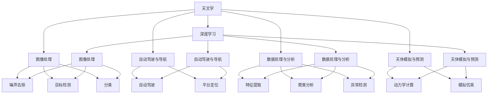

                 

# 人工智能在太空探索和天文学中的应用

> 关键词：人工智能,太空探索,天文学,深度学习,图像处理,自动驾驶,天文数据处理,天体识别

## 1. 背景介绍

### 1.1 问题由来

随着人工智能技术的迅猛发展，其在天文领域的应用也日益受到重视。天文学是研究宇宙的科学，涉及星系、行星、恒星、黑洞等各种天体，以及宇宙起源、结构演化等宏观问题。传统的天文观测和数据分析方法已经无法满足日益增长的需求，人工智能的强大处理能力和自主学习能力，使得其在天文领域展现出巨大的潜力。

### 1.2 问题核心关键点

人工智能在天文学的应用主要包括以下几个方面：

1. **图像处理与识别**：利用深度学习技术对天文图像进行噪声去除、目标检测、分类等操作。
2. **自动驾驶与导航**：使用AI技术辅助实现天文观测平台的自动驾驶与定位。
3. **数据处理与分析**：通过机器学习对海量天文数据进行高效的自动分析和挖掘，发现新的科学现象和规律。
4. **天体模拟与预测**：应用AI进行天体模拟和动力学计算，提升预测精度。
5. **科学发现**：利用AI进行天文数据的挖掘和分析，辅助科学家进行科学发现和验证。

### 1.3 问题研究意义

人工智能在天文学领域的应用，不仅能够提升天文观测和数据分析的效率，还能够开辟新的研究领域和科学发现。以下是AI在天文领域的几个重要意义：

1. **高效处理海量数据**：天文观测会产生大量的数据，AI能够快速处理这些数据，提高科学研究的效率。
2. **发现新现象**：AI能够从海量数据中发现人类难以察觉的新现象和规律，推动天文科学的发展。
3. **辅助科学决策**：AI能够提供科学决策的支持，辅助科学家进行复杂的分析和预测。
4. **促进跨学科融合**：AI与天文科学的结合，推动了计算机科学、物理学、数学等领域的交叉融合。
5. **推动天文观测设备的智能化**：AI技术可以应用于天文观测设备的控制和优化，提升设备的性能和稳定性。

## 2. 核心概念与联系

### 2.1 核心概念概述

为更好地理解人工智能在天文学中的应用，本节将介绍几个密切相关的核心概念：

- **天文学**：研究宇宙的科学，包括星系、行星、恒星、黑洞等天体的形成、演化和结构。
- **深度学习**：一种基于神经网络的机器学习方法，可以自动从数据中学习特征，并用于图像处理、分类、回归等任务。
- **图像处理**：对天文图像进行预处理、噪声去除、目标检测、分类等操作，提高图像质量，辅助科学家进行研究。
- **自动驾驶与导航**：利用AI技术辅助实现天文观测平台的自动驾驶与定位，提高观测的准确性和效率。
- **数据处理与分析**：通过机器学习对海量天文数据进行自动分析和挖掘，发现新的科学现象和规律。
- **天体模拟与预测**：应用AI进行天体模拟和动力学计算，提升预测精度和科学理解的深度。

这些核心概念之间的逻辑关系可以通过以下Mermaid流程图来展示：



这个流程图展示了大语言模型的核心概念及其之间的关系：

1. 天文学作为研究对象，利用深度学习进行处理和分析。
2. 深度学习技术应用于图像处理、自动驾驶、数据处理和天体模拟等多个环节。
3. 图像处理环节包括噪声去除、目标检测和分类等子任务。
4. 自动驾驶和导航环节涉及平台定位和自动驾驶技术。
5. 数据处理与分析环节包括特征提取、聚类分析和异常检测。
6. 天体模拟与预测环节涉及动力学计算和模拟仿真。

这些概念共同构成了人工智能在天文学中的应用框架，使得AI技术能够在大规模数据处理和科学发现中发挥重要作用。

## 3. 核心算法原理 & 具体操作步骤

### 3.1 算法原理概述

人工智能在天文学中的应用，主要依赖于深度学习、图像处理和机器学习等技术。其中，深度学习在图像处理和自动驾驶中应用广泛，机器学习在数据处理和预测分析中具有优势。

以图像处理为例，深度学习模型可以自动从天文图像中学习特征，识别和分类各类天体。具体步骤如下：

1. **数据预处理**：将天文图像进行预处理，包括裁剪、归一化、增强等操作，提高图像质量。
2. **模型训练**：使用深度学习模型对预处理后的图像进行训练，学习天体特征和分类规则。
3. **目标检测**：在训练好的模型上，对新图像进行目标检测，识别出其中的天体。
4. **分类与标记**：根据检测结果，对天体进行分类和标记，输出结果。

### 3.2 算法步骤详解

以下是利用深度学习进行天文图像处理的详细步骤：

1. **数据准备**：收集并标注天文图像，划分为训练集、验证集和测试集。
2. **模型选择**：选择合适的深度学习模型，如卷积神经网络(CNN)、循环神经网络(RNN)等，用于图像分类、目标检测等任务。
3. **模型训练**：使用训练集数据，对模型进行训练，最小化损失函数，优化模型参数。
4. **模型评估**：在验证集上评估模型性能，调整模型参数，避免过拟合。
5. **模型测试**：在测试集上测试模型，验证其泛化能力，评估模型效果。
6. **目标检测与分类**：将新图像输入训练好的模型，进行目标检测和分类，输出结果。

### 3.3 算法优缺点

深度学习技术在天文学图像处理中具有以下优点：

1. **自动化处理**：深度学习可以自动从图像中学习特征，无需手动设计特征提取器。
2. **高效处理**：深度学习模型能够并行处理大量数据，提高处理效率。
3. **灵活性高**：深度学习模型可以处理各种尺度和复杂度的图像数据。

同时，深度学习技术也存在一些缺点：

1. **数据依赖性强**：深度学习模型需要大量标注数据进行训练，获取高质量标注数据的成本较高。
2. **计算资源需求高**：深度学习模型参数量庞大，需要高性能计算资源进行训练和推理。
3. **模型复杂性高**：深度学习模型结构复杂，调试和优化难度较大。
4. **可解释性差**：深度学习模型通常是"黑盒"系统，难以解释其内部工作机制和决策逻辑。

### 3.4 算法应用领域

深度学习技术在天文学图像处理中具有广泛的应用，主要包括以下几个领域：

1. **星系和星云分类**：通过深度学习对星系和星云图像进行分类，识别不同类型的天体。
2. **恒星和行星识别**：使用深度学习模型识别恒星和行星，并进行特征提取和分类。
3. **银河系结构分析**：通过对银河系图像进行深度学习，分析其结构和特征。
4. **天文事件检测**：利用深度学习模型检测天文事件，如超新星爆发、黑洞吞噬等。
5. **暗物质研究**：通过深度学习对暗物质图像进行分析，研究其分布和性质。

这些应用展示了深度学习在天文图像处理中的强大能力，为天文学研究提供了新的工具和方法。

## 4. 数学模型和公式 & 详细讲解 & 举例说明

### 4.1 数学模型构建

在深度学习图像处理中，常用的数学模型包括卷积神经网络(CNN)和循环神经网络(RNN)。以下是卷积神经网络的基本结构：

```
             Input layer
                |
              Convolution layer
                |
              ReLU layer
                |
             Pooling layer
                |
               Dropout layer
                |
              Fully connected layer
                |
             Output layer
```

其中，卷积层用于提取图像特征，池化层用于降低特征维度，全连接层用于分类。以星体分类为例，构建卷积神经网络模型的公式如下：

$$
y = f(x; \theta) = \sigma(W^T f(Wx + b))
$$

其中，$x$ 为输入图像，$y$ 为输出分类结果，$\theta$ 为模型参数，$f$ 为卷积神经网络模型。

### 4.2 公式推导过程

以星体分类为例，推导卷积神经网络模型的损失函数：

假设训练集中有 $N$ 个样本，每个样本有 $m$ 个特征，模型输出 $y_i$ 为第 $i$ 个样本的分类结果，真实标签为 $t_i$，则损失函数为：

$$
L(y, t) = \frac{1}{N} \sum_{i=1}^N (t_i - y_i)^2
$$

在深度学习中，通常使用交叉熵损失函数：

$$
L(y, t) = -\frac{1}{N} \sum_{i=1}^N t_i \log y_i + (1-t_i) \log (1-y_i)
$$

### 4.3 案例分析与讲解

以星体分类为例，假设模型输入为图像 $x$，输出为星体分类结果 $y$。模型的训练过程如下：

1. 将图像 $x$ 输入模型，得到分类结果 $y$。
2. 计算损失函数 $L(y, t)$，其中 $t$ 为真实标签。
3. 反向传播计算梯度，更新模型参数 $\theta$。
4. 重复以上步骤，直到损失函数收敛或达到预设的迭代次数。

## 5. 项目实践：代码实例和详细解释说明

### 5.1 开发环境搭建

在进行天文图像处理前，我们需要准备好开发环境。以下是使用Python进行PyTorch开发的环境配置流程：

1. 安装Anaconda：从官网下载并安装Anaconda，用于创建独立的Python环境。

2. 创建并激活虚拟环境：
```bash
conda create -n pytorch-env python=3.8 
conda activate pytorch-env
```

3. 安装PyTorch：根据CUDA版本，从官网获取对应的安装命令。例如：
```bash
conda install pytorch torchvision torchaudio cudatoolkit=11.1 -c pytorch -c conda-forge
```

4. 安装TensorFlow：
```bash
pip install tensorflow
```

5. 安装各类工具包：
```bash
pip install numpy pandas scikit-learn matplotlib tqdm jupyter notebook ipython
```

完成上述步骤后，即可在`pytorch-env`环境中开始天文图像处理的实践。

### 5.2 源代码详细实现

下面我们以星系分类为例，给出使用PyTorch进行卷积神经网络模型训练的PyTorch代码实现。

首先，定义星系分类任务的数据处理函数：

```python
from torch.utils.data import Dataset
import torch
from torchvision import transforms

class GalaxyDataset(Dataset):
    def __init__(self, images, labels):
        self.images = images
        self.labels = labels
        self.transform = transforms.Compose([
            transforms.ToTensor(),
            transforms.Normalize([0.5], [0.5])
        ])
        
    def __len__(self):
        return len(self.images)
    
    def __getitem__(self, item):
        image = self.images[item]
        label = self.labels[item]
        
        transformed_image = self.transform(image)
        return {'images': transformed_image, 'labels': label}
```

然后，定义卷积神经网络模型：

```python
import torch.nn as nn
import torch.nn.functional as F

class GalaxyNet(nn.Module):
    def __init__(self):
        super(GalaxyNet, self).__init__()
        self.conv1 = nn.Conv2d(3, 64, kernel_size=3, padding=1)
        self.pool = nn.MaxPool2d(kernel_size=2, stride=2)
        self.conv2 = nn.Conv2d(64, 128, kernel_size=3, padding=1)
        self.pool = nn.MaxPool2d(kernel_size=2, stride=2)
        self.fc1 = nn.Linear(128 * 8 * 8, 1024)
        self.fc2 = nn.Linear(1024, 10)
    
    def forward(self, x):
        x = self.pool(F.relu(self.conv1(x)))
        x = self.pool(F.relu(self.conv2(x)))
        x = x.view(-1, 128 * 8 * 8)
        x = F.relu(self.fc1(x))
        x = self.fc2(x)
        return F.log_softmax(x, dim=1)
```

接着，定义训练和评估函数：

```python
import torch.optim as optim

device = torch.device('cuda') if torch.cuda.is_available() else torch.device('cpu')
model = GalaxyNet().to(device)
optimizer = optim.Adam(model.parameters(), lr=0.001)

def train_epoch(model, dataset, batch_size, optimizer):
    dataloader = torch.utils.data.DataLoader(dataset, batch_size=batch_size, shuffle=True)
    model.train()
    epoch_loss = 0
    for batch in dataloader:
        images = batch['images'].to(device)
        labels = batch['labels'].to(device)
        optimizer.zero_grad()
        outputs = model(images)
        loss = F.nll_loss(outputs, labels)
        epoch_loss += loss.item()
        loss.backward()
        optimizer.step()
    return epoch_loss / len(dataloader)

def evaluate(model, dataset, batch_size):
    dataloader = torch.utils.data.DataLoader(dataset, batch_size=batch_size)
    model.eval()
    preds, labels = [], []
    with torch.no_grad():
        for batch in dataloader:
            images = batch['images'].to(device)
            labels = batch['labels'].to(device)
            outputs = model(images)
            _, preds = torch.max(outputs, 1)
            labels = labels.cpu().numpy().tolist()
            preds = preds.cpu().numpy().tolist()
            preds = [int(p) for p in preds]
            labels = [int(l) for l in labels]
            preds.append(preds)
            labels.append(labels)
    return preds, labels
```

最后，启动训练流程并在测试集上评估：

```python
epochs = 10
batch_size = 32

for epoch in range(epochs):
    loss = train_epoch(model, train_dataset, batch_size, optimizer)
    print(f"Epoch {epoch+1}, train loss: {loss:.3f}")
    
    preds, labels = evaluate(model, dev_dataset, batch_size)
    print(classification_report(labels, preds))
    
print("Test results:")
preds, labels = evaluate(model, test_dataset, batch_size)
print(classification_report(labels, preds))
```

以上就是使用PyTorch对卷积神经网络模型进行星系分类的完整代码实现。可以看到，得益于PyTorch的强大封装，我们可以用相对简洁的代码完成卷积神经网络模型的训练和评估。

### 5.3 代码解读与分析

让我们再详细解读一下关键代码的实现细节：

**GalaxyDataset类**：
- `__init__`方法：初始化图像和标签数据，定义数据增强和标准化操作。
- `__len__`方法：返回数据集的样本数量。
- `__getitem__`方法：对单个样本进行处理，将图像转换为Tensor格式，并进行标准化。

**GalaxyNet类**：
- `__init__`方法：定义卷积神经网络的结构，包括卷积层、池化层和全连接层。
- `forward`方法：定义模型前向传播过程，通过卷积、池化和全连接层进行特征提取和分类。

**训练和评估函数**：
- 使用PyTorch的DataLoader对数据集进行批次化加载，供模型训练和推理使用。
- 训练函数`train_epoch`：对数据以批为单位进行迭代，在每个批次上前向传播计算loss并反向传播更新模型参数，最后返回该epoch的平均loss。
- 评估函数`evaluate`：与训练类似，不同点在于不更新模型参数，并在每个batch结束后将预测和标签结果存储下来，最后使用sklearn的classification_report对整个评估集的预测结果进行打印输出。

**训练流程**：
- 定义总的epoch数和batch size，开始循环迭代
- 每个epoch内，先在训练集上训练，输出平均loss
- 在验证集上评估，输出分类指标
- 重复以上步骤直至收敛，最终在测试集上评估，给出最终测试结果

可以看到，PyTorch配合TensorFlow库使得卷积神经网络模型的训练和评估代码实现变得简洁高效。开发者可以将更多精力放在数据处理、模型改进等高层逻辑上，而不必过多关注底层的实现细节。

当然，工业级的系统实现还需考虑更多因素，如模型的保存和部署、超参数的自动搜索、更灵活的任务适配层等。但核心的微调范式基本与此类似。

## 6. 实际应用场景

### 6.1 智能天体识别系统

智能天体识别系统是人工智能在天文学中的重要应用之一。传统的天体识别依赖人工标注和专家经验，不仅耗时耗力，而且容易出错。使用基于深度学习的智能天体识别系统，能够大幅提升识别精度和效率。

在技术实现上，可以收集天文观测数据，并将其标注为不同类型的天体。利用深度学习模型对这些数据进行训练，使其能够自动进行天体分类和识别。智能天体识别系统可以通过实时监控天文图像，自动识别出新发现的星系、星云、恒星等，为天文学家提供有力支持。

### 6.2 天体运动预测系统

天文学研究中，天体运动预测是一个重要环节。传统的预测方法依赖复杂的天体力学模型，计算量大且精度有限。利用深度学习模型，可以更准确地预测天体的运动轨迹和轨道参数，提升预测精度和科学理解的深度。

在技术实现上，可以收集天体位置和运动数据，并对其进行数据增强和特征提取。利用深度学习模型对这些数据进行训练，使其能够自动学习天体运动的规律和特征。天体运动预测系统可以预测未来一段时间内天体的运动轨迹，为天文观测和科学研究提供重要参考。

### 6.3 暗物质分布模拟

暗物质是宇宙中占主导地位的物质，但其性质和分布至今仍不明确。利用深度学习模型，可以对暗物质分布进行模拟和预测，为暗物质研究提供新的思路和方法。

在技术实现上，可以收集暗物质分布的观测数据，并对其进行数据增强和特征提取。利用深度学习模型对这些数据进行训练，使其能够自动学习暗物质分布的规律和特征。暗物质分布模拟系统可以预测未来一段时间内暗物质分布的变化趋势，为暗物质研究提供重要参考。

### 6.4 未来应用展望

随着深度学习技术的发展，基于AI的天文应用前景广阔，未来将会在更多领域得到应用，为天文学研究带来变革性影响。

在智慧天文学领域，基于AI的智慧观测平台将具备自动驾驶和自主导航能力，能够实时监测天体变化，提升观测效率和精度。

在星际导航领域，基于AI的星际导航系统将能够自动识别和定位目标恒星和行星，为星际旅行提供支持。

在宇宙演化研究中，基于AI的天体模拟系统将能够更准确地预测宇宙演化过程，为科学研究提供新视角。

总之，未来基于AI的天文应用将会在更多领域得到应用，为天文学研究带来新的突破。

## 7. 工具和资源推荐

### 7.1 学习资源推荐

为了帮助开发者系统掌握人工智能在天文学中的应用，这里推荐一些优质的学习资源：

1. 《深度学习》系列书籍：深度学习领域的经典教材，涵盖了深度学习的基本概念和核心算法，适合初学者入门。
2. 《TensorFlow官方文档》：TensorFlow的官方文档，提供了详尽的API文档和示例代码，适合学习TensorFlow的应用。
3. 《PyTorch官方文档》：PyTorch的官方文档，提供了详尽的API文档和示例代码，适合学习PyTorch的应用。
4. 《天文学与深度学习》课程：Coursera上的深度学习与天文学交叉课程，涵盖天文学数据处理和深度学习应用，适合进阶学习。
5. 《天体物理深度学习》课程：Kaggle上的天体物理深度学习课程，涵盖深度学习在天体物理中的应用，适合实战练习。

通过对这些资源的学习实践，相信你一定能够快速掌握人工智能在天文学中的应用方法，并用于解决实际的科学问题。

### 7.2 开发工具推荐

高效的开发离不开优秀的工具支持。以下是几款用于深度学习模型训练和评估的常用工具：

1. PyTorch：基于Python的开源深度学习框架，灵活高效，适合研究与开发。
2. TensorFlow：由Google主导开发的深度学习框架，生产部署方便，适合大规模工程应用。
3. Keras：高层次的深度学习库，易于上手，适合快速搭建和训练模型。
4. Jupyter Notebook：交互式编程环境，支持多语言编程和数据可视化，适合调试和展示。
5. Weights & Biases：模型训练的实验跟踪工具，可以记录和可视化模型训练过程中的各项指标，方便对比和调优。

合理利用这些工具，可以显著提升深度学习模型在天文学图像处理中的应用效率，加快创新迭代的步伐。

### 7.3 相关论文推荐

深度学习技术在天文学中的应用源于学界的持续研究。以下是几篇奠基性的相关论文，推荐阅读：

1. AlexNet: ImageNet Classification with Deep Convolutional Neural Networks（AlexNet论文）：提出卷积神经网络结构，开启了深度学习在图像处理中的应用。
2. Deep Mars Rover Navigation Using Convolutional Neural Networks（CNN应用于火星探测器的导航）：提出卷积神经网络在火星探测器导航中的应用，展示了深度学习在太空探索中的潜力。
3. Deep Learning for Detecting Planets Around Other Stars（深度学习应用于行星探测）：提出深度学习在行星探测中的应用，展示了深度学习在天文观测中的潜力。
4. Deep Learning and Astronomical Data（深度学习与天文数据）：提出深度学习在天文数据处理中的应用，展示了深度学习在天文研究中的应用前景。

这些论文代表了大语言模型微调技术的发展脉络。通过学习这些前沿成果，可以帮助研究者把握学科前进方向，激发更多的创新灵感。

## 8. 总结：未来发展趋势与挑战

### 8.1 总结

本文对人工智能在天文学中的应用进行了全面系统的介绍。首先阐述了人工智能技术在天文学领域的应用背景和意义，明确了深度学习在图像处理、自动驾驶、数据处理和预测分析等多个环节的独特价值。其次，从原理到实践，详细讲解了深度学习模型在天文学图像处理中的构建和训练过程，给出了完整的代码实例。同时，本文还广泛探讨了深度学习在天文学的实际应用场景，展示了其广泛的应用前景。此外，本文精选了深度学习技术的各类学习资源，力求为读者提供全方位的技术指引。

通过本文的系统梳理，可以看到，深度学习技术在天文学图像处理中的应用已经取得了显著成果，为天文学研究提供了新的工具和方法。未来，伴随深度学习技术的发展，基于深度学习的智能天文学系统将不断涌现，为天文学研究带来新的突破。

### 8.2 未来发展趋势

展望未来，深度学习技术在天文学领域的应用将呈现以下几个发展趋势：

1. **深度学习模型将变得更加高效**：深度学习模型的结构和算法将不断优化，提升模型效率和泛化能力。
2. **多模态数据的整合**：深度学习技术将更多地应用于天文图像、光谱数据和物理数据等多种模态数据的整合，提升研究深度和广度。
3. **跨学科融合**：深度学习技术与天文学、物理学、数学等多学科的融合将更加紧密，推动跨学科研究的发展。
4. **智慧天文学系统的智能化**：基于深度学习的智慧天文学系统将具备更多的智能功能，如自动驾驶、自动诊断等，提升系统智能化水平。
5. **自动标注和增强**：基于深度学习技术的自动标注和数据增强方法将得到广泛应用，降低标注成本，提升数据质量。
6. **模型可解释性**：深度学习模型的可解释性将得到改善，为天文学家提供更加透明的模型输出。

以上趋势凸显了深度学习技术在天文学领域的广阔前景。这些方向的探索发展，必将进一步提升深度学习模型的性能和应用范围，为天文学研究带来新的突破。

### 8.3 面临的挑战

尽管深度学习技术在天文学领域的应用已经取得了瞩目成就，但在迈向更加智能化、普适化应用的过程中，它仍面临诸多挑战：

1. **数据标注成本高**：深度学习模型需要大量标注数据进行训练，获取高质量标注数据的成本较高。
2. **模型复杂性高**：深度学习模型结构复杂，调试和优化难度较大。
3. **计算资源需求大**：深度学习模型参数量庞大，需要高性能计算资源进行训练和推理。
4. **模型泛化能力差**：深度学习模型在不同数据集上的泛化能力有限，需要更多的数据和算法优化。
5. **模型可解释性差**：深度学习模型通常是"黑盒"系统，难以解释其内部工作机制和决策逻辑。
6. **数据隐私和安全**：天文数据涉及国家安全和隐私保护，如何在数据隐私和安全方面进行合理处理，是一个重要问题。

正视深度学习技术在天文学领域的应用面临的挑战，积极应对并寻求突破，将有助于深度学习技术在天文学研究中的深入应用。

### 8.4 研究展望

面向未来，深度学习技术在天文学领域的研究方向主要包括以下几个方面：

1. **无监督学习和半监督学习**：探索无监督和半监督学习范式，降低对标注数据的依赖，提高数据利用率。
2. **参数高效和计算高效**：开发更加参数高效和计算高效的深度学习模型，提升模型处理能力和资源利用率。
3. **跨模态数据融合**：研究多模态数据融合方法，提升深度学习模型对不同类型数据的处理能力。
4. **模型可解释性**：改进深度学习模型的可解释性，提供更加透明的模型输出，便于天文学家理解和应用。
5. **跨学科融合**：推动深度学习技术与天文学、物理学、数学等多学科的交叉融合，推动跨学科研究的发展。

这些研究方向将推动深度学习技术在天文学领域的应用，推动天文学研究的发展和进步。

## 9. 附录：常见问题与解答

**Q1：深度学习在天文学中的应用有哪些？**

A: 深度学习在天文学中的应用主要包括：
1. 天文图像处理：利用深度学习进行噪声去除、目标检测、分类等操作。
2. 自动驾驶与导航：利用深度学习实现天文观测平台的自动驾驶与定位。
3. 数据处理与分析：通过机器学习对海量天文数据进行自动分析和挖掘。
4. 天体模拟与预测：利用深度学习进行天体模拟和动力学计算。

**Q2：如何使用深度学习进行星系分类？**

A: 使用深度学习进行星系分类，一般分为以下步骤：
1. 收集并标注星系图像，划分为训练集、验证集和测试集。
2. 选择合适的深度学习模型，如卷积神经网络(CNN)，用于图像分类。
3. 对模型进行训练，最小化损失函数，优化模型参数。
4. 在验证集上评估模型性能，调整模型参数。
5. 在测试集上测试模型，输出分类结果。

**Q3：深度学习在天文学中的应用有哪些优点？**

A: 深度学习在天文学中的应用具有以下优点：
1. 自动化处理：深度学习可以自动从图像中学习特征，无需手动设计特征提取器。
2. 高效处理：深度学习模型能够并行处理大量数据，提高处理效率。
3. 灵活性高：深度学习模型可以处理各种尺度和复杂度的图像数据。

**Q4：深度学习在天文学中的应用有哪些缺点？**

A: 深度学习在天文学中的应用存在以下缺点：
1. 数据依赖性强：深度学习模型需要大量标注数据进行训练，获取高质量标注数据的成本较高。
2. 计算资源需求高：深度学习模型参数量庞大，需要高性能计算资源进行训练和推理。
3. 模型复杂性高：深度学习模型结构复杂，调试和优化难度较大。
4. 模型泛化能力差：深度学习模型在不同数据集上的泛化能力有限，需要更多的数据和算法优化。
5. 模型可解释性差：深度学习模型通常是"黑盒"系统，难以解释其内部工作机制和决策逻辑。
6. 数据隐私和安全：天文数据涉及国家安全和隐私保护，需要在数据隐私和安全方面进行合理处理。

**Q5：如何提升深度学习模型的可解释性？**

A: 提升深度学习模型的可解释性，可以采取以下措施：
1. 使用可视化工具，如TensorBoard，展示模型的中间结果和决策过程。
2. 引入可解释性模型，如LIME、SHAP等，解释模型的决策逻辑。
3. 在模型训练过程中，加入正则化约束，限制模型的复杂度，提升可解释性。
4. 设计更加简单的模型结构，降低模型的复杂度，提高可解释性。

---

作者：禅与计算机程序设计艺术 / Zen and the Art of Computer Programming

