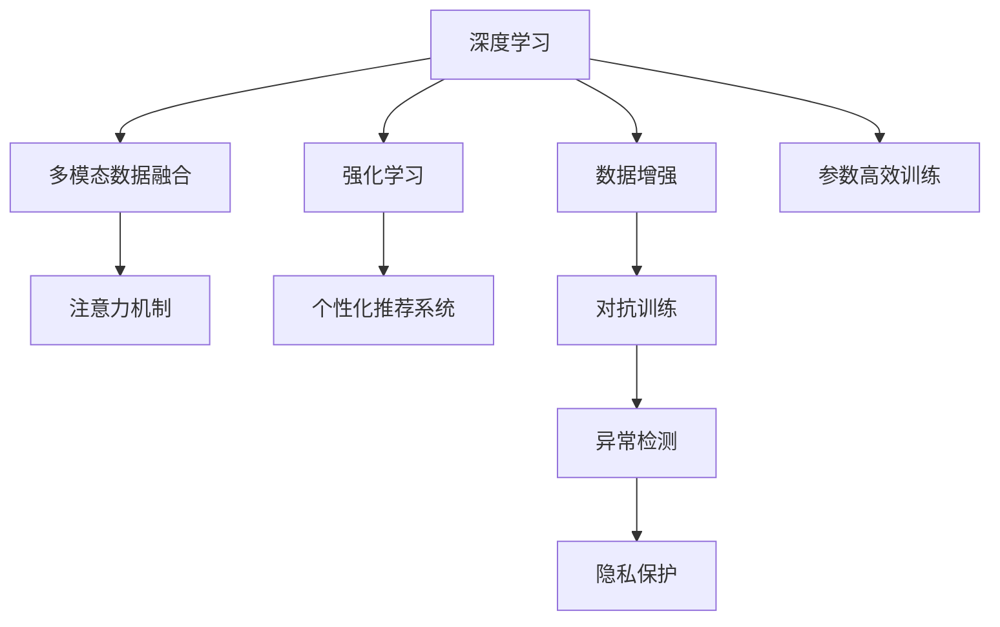

                 

# 人工智能驱动的个性化注意力管理

> 关键词：人工智能，个性化管理，注意力机制，深度学习，强化学习

## 1. 背景介绍

### 1.1 问题由来
在快速发展的信息化社会中，如何高效地管理个人时间和注意力，避免信息过载和决策疲劳，成为了许多人面临的普遍问题。传统的时间管理方法往往无法应对复杂多变的工作和生活场景，而现有的人工智能(AI)技术又未能完全满足个性化和动态化的需求。

为了解决这一问题，研究人员提出了基于人工智能的个性化注意力管理系统，通过学习用户的兴趣、习惯和情感状态，自动调整任务优先级和注意力分配，帮助用户高效管理时间和信息。

### 1.2 问题核心关键点
1. 个性化管理：通过深度学习模型学习用户的个性化偏好，动态调整任务安排和注意力分配，实现按需定制。
2. 动态优化：利用强化学习框架不断优化决策策略，提升系统适应性和鲁棒性。
3. 多模态信息：整合用户的行为数据、生理数据等多模态信息，构建全面的用户画像。
4. 实时交互：支持用户与系统的实时交互，及时反馈调整策略，提升用户体验。
5. 隐私保护：在模型训练和运行过程中，严格遵守隐私保护规范，保障用户数据安全。

这些关键点共同构成了个性化注意力管理系统的核心功能，旨在通过AI技术，提供更智能、高效、个性化的时间管理和决策支持。

## 2. 核心概念与联系

### 2.1 核心概念概述

为更好地理解基于人工智能的个性化注意力管理方法，本节将介绍几个密切相关的核心概念：

- 深度学习(Deep Learning)：一种利用神经网络模拟人脑学习能力的机器学习方法。通过多层神经网络结构，从数据中自动学习特征，适用于复杂的非线性模式识别和预测任务。
- 强化学习(Reinforcement Learning)：一种通过试错反馈，逐步优化策略以最大化累积奖励的学习方法。常用于决策优化和行为控制。
- 多模态数据融合(Multimodal Data Fusion)：整合来自不同传感器和数据源的多维度信息，提升模型对用户的全面理解和预测能力。
- 注意力机制(Attention Mechanism)：一种使模型选择性地关注输入数据中重要部分的技术，应用于机器翻译、图像识别等任务中，提高模型预测精度。
- 个性化推荐系统(Personalized Recommendation System)：通过学习用户的历史行为和偏好，推荐符合用户需求的内容。

这些核心概念之间的逻辑关系可以通过以下Mermaid流程图来展示：



这个流程图展示了个性化注意力管理系统的核心概念及其之间的关系：

1. 深度学习从数据中学习用户特征，强化学习优化策略，两者共同构建个性化推荐系统。
2. 多模态数据融合增强模型对用户行为的全面理解。
3. 注意力机制使模型聚焦于重要部分，提高推荐和决策效果。
4. 数据增强和对抗训练提高模型的鲁棒性，异常检测保障系统稳定。
5. 隐私保护确保用户数据安全，提升信任度。

这些概念共同构成了个性化注意力管理系统的理论基础，使得系统能够更好地理解和适应用户的复杂需求。

## 3. 核心算法原理 & 具体操作步骤
### 3.1 算法原理概述

基于人工智能的个性化注意力管理，本质上是一种基于深度学习和强化学习的决策优化过程。其核心思想是：通过学习用户的兴趣、习惯和情感状态，自动调整任务优先级和注意力分配，优化用户体验。

形式化地，假设用户当前的任务集合为 $T=\{t_1, t_2, \dots, t_n\}$，每个任务的优先级和完成时间成本为 $(c_i, d_i)$，其中 $c_i$ 表示任务 $t_i$ 的成本，$d_i$ 表示任务 $t_i$ 的完成时间。用户在不同时间段 $t$ 内可以分配的注意力为 $A_t$。

个性化注意力管理的目标是最大化用户的时间利用率和任务完成率。即在给定的注意力和任务集合下，选择最优的任务组合 $T' \subseteq T$，使得总成本最小，同时任务完成率最大化。

### 3.2 算法步骤详解

基于人工智能的个性化注意力管理系统一般包括以下几个关键步骤：

**Step 1: 数据预处理与特征提取**
- 收集用户的历史行为数据，包括任务完成时间、休息时间、情绪状态等。
- 将数据划分为训练集、验证集和测试集，用于模型训练、调参和性能评估。
- 使用深度学习模型，如循环神经网络(RNN)或变分自编码器(VAE)，对用户特征进行编码，得到低维特征向量。

**Step 2: 设计决策策略**
- 根据用户的偏好和习惯，设计一个强化学习策略，如Q-learning、SARSA等。
- 通过样本预测模型，预测每个任务的完成时间和成本。
- 设定状态和动作空间，定义状态转移和动作执行的规则。

**Step 3: 训练策略模型**
- 在训练集上使用强化学习算法，如Q-learning或SAC，训练决策策略模型。
- 使用正则化技术，如L2正则、Dropout等，避免过拟合。
- 设定合适的学习率和迭代次数，确保模型收敛。

**Step 4: 实时决策与优化**
- 在每个时间段 $t$ 内，根据当前注意力 $A_t$ 和实时状态，调用策略模型进行决策。
- 根据模型预测，调整任务优先级和注意力分配。
- 周期性在验证集上评估模型性能，根据评估结果进行策略优化。

**Step 5: 结果反馈与用户交互**
- 在每个时间段结束时，记录用户的任务完成情况和满意度。
- 利用用户反馈数据，调整模型参数和策略模型，持续改进。
- 支持用户与系统的实时交互，允许用户手动调整任务安排。

以上是基于人工智能的个性化注意力管理系统的一般流程。在实际应用中，还需要针对具体任务和用户群体，对模型进行优化和调参，以确保系统能够高效运行。

### 3.3 算法优缺点

基于人工智能的个性化注意力管理方法具有以下优点：
1. 个性化定制：通过深度学习和强化学习，能够动态调整任务优先级和注意力分配，满足用户的个性化需求。
2. 高效决策：利用强化学习算法优化决策策略，提升系统的适应性和鲁棒性。
3. 多模态融合：整合用户的行为数据、生理数据等多模态信息，构建全面的用户画像，提升预测准确性。
4. 实时交互：支持用户与系统的实时交互，及时反馈调整策略，提升用户体验。

同时，该方法也存在一定的局限性：
1. 数据依赖性高：系统的性能很大程度上取决于用户的历史数据质量，数据采集和处理成本较高。
2. 模型复杂度高：深度学习和强化学习模型复杂，计算资源消耗大，训练和推理时间较长。
3. 泛化能力有限：模型可能在特定场景下表现优异，但对新任务和新用户群体的适应性有限。
4. 隐私风险：在数据收集和模型训练过程中，用户的隐私信息可能面临泄露的风险，需要严格的数据保护措施。

尽管存在这些局限性，但基于人工智能的个性化注意力管理方法在智能时间管理和决策支持方面仍具有重要应用价值，相信随着技术进步和算法优化，其前景将更加广阔。

### 3.4 算法应用领域

基于深度学习和强化学习的个性化注意力管理方法，在多个领域得到了广泛应用：

- 办公自动化：帮助企业员工高效管理日常任务，提升工作效率和满意度。
- 在线教育：通过个性化学习计划和注意力管理，提升学生的学习效果和兴趣。
- 健康管理：通过实时监测用户的行为和生理数据，优化健康管理方案。
- 个人财务管理：帮助用户动态调整收支计划，优化财务状况。
- 数字广告：通过个性化的广告推荐和注意力管理，提升广告投放效果和用户体验。

除了上述这些领域外，个性化注意力管理方法还可以应用到更多场景中，如社交网络、智能家居、交通管理等，为智能生活提供新的可能性。

## 4. 数学模型和公式 & 详细讲解 & 举例说明

### 4.1 数学模型构建

为更好地理解基于人工智能的个性化注意力管理方法，本节将给出其数学模型构建。

假设用户当前的任务集合为 $T=\{t_1, t_2, \dots, t_n\}$，每个任务的优先级和完成时间成本为 $(c_i, d_i)$，其中 $c_i$ 表示任务 $t_i$ 的成本，$d_i$ 表示任务 $t_i$ 的完成时间。用户在不同时间段 $t$ 内可以分配的注意力为 $A_t$。

定义状态 $S_t = (A_t, \{x_i\}_{i=1}^n)$，其中 $A_t$ 表示当前可用注意力，$x_i = (c_i, d_i)$ 表示任务 $t_i$ 的状态。

定义动作 $A = \{1, 2, \dots, n\}$，表示选择执行的任务编号。

定义奖励函数 $r(S_t, A)$，表示在状态 $S_t$ 下执行动作 $A$ 的即时奖励。例如，可以设定任务完成带来正奖励，延迟完成带来负奖励。

个性化注意力管理的目标是最大化时间利用率和任务完成率，形式化为：

$$
\max_{\pi} \sum_{t=1}^T r(S_t, \pi(S_t))
$$

其中 $\pi$ 表示策略函数，$\sum_{t=1}^T r(S_t, \pi(S_t))$ 表示在 $T$ 个时间段内的总奖励。

### 4.2 公式推导过程

以下我们以Q-learning算法为例，推导基于人工智能的个性化注意力管理算法的核心公式。

Q-learning算法通过迭代更新Q值函数 $Q(S_t, A)$，逼近最优策略 $\pi^*$。其核心公式为：

$$
Q(S_t, A) \leftarrow Q(S_t, A) + \alpha \left[r(S_t, A) + \gamma \max_{A'} Q(S_{t+1}, A') - Q(S_t, A)\right]
$$

其中 $\alpha$ 为学习率，$\gamma$ 为折扣因子，$S_{t+1}$ 表示下一状态。

在Q-learning中，每个时间段 $t$ 内，系统根据当前状态 $S_t$ 和动作 $A$，计算即时奖励 $r(S_t, A)$ 和下一状态 $S_{t+1}$ 的Q值。通过不断迭代更新Q值函数，模型能够逐步学习到最优策略 $\pi^*$。

### 4.3 案例分析与讲解

假设某用户有3个任务 $t_1, t_2, t_3$，每个任务的成本和完成时间分别为 $(2, 4), (1, 3), (3, 5)$。用户每天有4个时间段，可分配的注意力分别为 $A_1 = 3, A_2 = 2, A_3 = 2, A_4 = 1$。

使用Q-learning算法进行优化，设定状态空间 $S = \{1, 2, 3, 4\}$，动作空间 $A = \{1, 2, 3\}$，奖励函数 $r(S_t, A) = -1 + \frac{1}{2^{t-1}}$，折扣因子 $\gamma = 0.9$，学习率 $\alpha = 0.1$。

初始化Q值函数 $Q(s, a) = 0$。在每个时间段内，根据状态和动作计算即时奖励和下一状态Q值，更新Q值函数：

$$
Q(1, 1) \leftarrow Q(1, 1) + \alpha [r(1, 1) + \gamma \max(Q(2, 2), Q(2, 3), Q(3, 2)) - Q(1, 1)]
$$

$$
Q(1, 2) \leftarrow Q(1, 2) + \alpha [r(1, 2) + \gamma \max(Q(2, 1), Q(2, 3), Q(3, 1)) - Q(1, 2)]
$$

$$
Q(1, 3) \leftarrow Q(1, 3) + \alpha [r(1, 3) + \gamma \max(Q(2, 1), Q(2, 2), Q(3, 3)) - Q(1, 3)]
$$

重复上述过程直至收敛，得到最优的决策策略 $\pi^*$。

## 5. 项目实践：代码实例和详细解释说明
### 5.1 开发环境搭建

在进行基于人工智能的个性化注意力管理项目实践前，我们需要准备好开发环境。以下是使用Python进行TensorFlow开发的环境配置流程：

1. 安装Anaconda：从官网下载并安装Anaconda，用于创建独立的Python环境。

2. 创建并激活虚拟环境：
```bash
conda create -n ai-env python=3.8 
conda activate ai-env
```

3. 安装TensorFlow：根据CUDA版本，从官网获取对应的安装命令。例如：
```bash
conda install tensorflow -c conda-forge
```

4. 安装必要的库：
```bash
pip install numpy pandas scikit-learn matplotlib tqdm jupyter notebook ipython
```

5. 安装TensorBoard：TensorFlow配套的可视化工具，可实时监测模型训练状态，并提供丰富的图表呈现方式。

完成上述步骤后，即可在`ai-env`环境中开始基于人工智能的个性化注意力管理项目实践。

### 5.2 源代码详细实现

下面我们以基于Q-learning算法的个性化注意力管理为例，给出使用TensorFlow实现代码的详细实现。

首先，定义状态和动作空间：

```python
import tensorflow as tf

# 定义状态和动作空间
n_tasks = 3
n_time_slots = 4
state_size = n_tasks
action_size = n_tasks
```

然后，定义Q值函数：

```python
# 定义Q值函数
def build_q_network(state_size, action_size):
    model = tf.keras.Sequential([
        tf.keras.layers.Dense(64, activation='relu', input_shape=(state_size,)),
        tf.keras.layers.Dense(32, activation='relu'),
        tf.keras.layers.Dense(action_size)
    ])
    return model

# 构建Q值函数
q_network = build_q_network(state_size, action_size)
```

接着，定义奖励函数和折扣因子：

```python
# 定义奖励函数和折扣因子
def reward(state, action):
    # 任务完成带来的正奖励
    if state[action] == 'completed':
        return 1
    # 延迟完成带来的负奖励
    else:
        return -1

gamma = 0.9
```

然后，定义Q-learning算法的核心步骤：

```python
# 定义Q-learning算法的核心步骤
def q_learning(state, action, next_state, reward):
    q_network.trainable = True
    with tf.GradientTape() as tape:
        # 计算Q值
        q_value = q_network(tf.expand_dims(state, axis=0))[action]
        # 计算下一步Q值
        next_q_value = tf.reduce_max(q_network(tf.expand_dims(next_state, axis=0)), axis=1)
        # 计算目标Q值
        target_q_value = reward + gamma * next_q_value
    # 计算梯度
    gradients = tape.gradient(q_value, q_network.trainable_variables)
    # 更新Q值函数
    q_network.trainable = False
    for var, grad in zip(q_network.trainable_variables, gradients):
        var.assign_sub(grad * learning_rate)
```

最后，启动Q-learning训练流程：

```python
# 设置学习率
learning_rate = 0.1

# 训练Q-learning模型
for i in range(num_iterations):
    # 获取当前状态
    state = state_vector[i]
    # 选择动作
    action = np.argmax(q_network.predict(state))
    # 执行动作并获取下一状态和奖励
    next_state, reward = execute_action(action)
    # 训练Q-learning模型
    q_learning(state, action, next_state, reward)
    # 更新状态向量
    state_vector.append(next_state)
```

以上就是使用TensorFlow实现基于Q-learning算法的个性化注意力管理的代码实现。可以看到，借助TensorFlow的强大框架，我们可以较为简洁地实现Q-learning算法，并实现动态决策策略的优化。

### 5.3 代码解读与分析

让我们再详细解读一下关键代码的实现细节：

**状态和动作空间**：
- 定义了用户的任务数和时间段数，以及状态和动作的维度。

**Q值函数**：
- 使用多层神经网络构建Q值函数，其中包含一个隐藏层，每个动作对应一个输出。

**奖励函数和折扣因子**：
- 根据任务的完成情况，定义奖励函数，奖励任务完成，惩罚延迟完成。
- 设置折扣因子，控制未来奖励的权重。

**Q-learning算法的核心步骤**：
- 在每个时间段内，选择动作并执行，计算即时奖励和下一步Q值。
- 使用梯度下降算法更新Q值函数，最小化预测Q值与实际Q值的误差。
- 记录状态向量，用于后续的策略优化和模型训练。

**训练流程**：
- 设置学习率，进行多轮Q-learning训练。
- 每次训练选择一个动作，执行并获取下一状态和奖励。
- 更新Q值函数，记录状态向量。

可以看到，基于深度学习和强化学习的个性化注意力管理方法，通过Q-learning算法，能够在用户的历史行为数据和实时状态中，动态调整任务优先级和注意力分配，从而提升用户的决策效率和时间利用率。

当然，工业级的系统实现还需考虑更多因素，如用户界面设计、数据采集和处理、异常处理等，但核心的算法框架基本与此类似。

## 6. 实际应用场景
### 6.1 办公自动化

基于人工智能的个性化注意力管理系统，在办公自动化场景中具有广泛应用前景。企业员工每天面对的任务繁杂，如何高效管理日常工作，提升工作效率和满意度，是企业管理者需要解决的重要问题。

使用基于Q-learning算法的个性化注意力管理，系统能够根据员工的工作习惯和偏好，自动调整任务优先级和注意力分配，优化工作流程。例如，根据员工的工作节奏，合理安排会议和邮件处理时间，确保高效完成任务。同时，系统还可以实时监测员工的情绪状态，提供适时的心理支持，提升工作积极性。

### 6.2 在线教育

在线教育平台面临用户多、课程繁杂、个性化需求差异大的挑战。使用基于深度学习和强化学习的个性化注意力管理，系统能够根据学生的学习习惯和知识水平，动态调整课程安排和学习任务，提升学习效果和兴趣。

例如，根据学生的学习进度和反馈，自动推荐适合的习题和视频内容，调整课程难度和时间分配，帮助学生更好地掌握知识。同时，系统还可以实时监测学生的注意力和情绪状态，提供个性化的学习建议和心理支持，提升学习体验。

### 6.3 健康管理

健康管理领域需要实时监测用户的生理和行为数据，优化健康管理方案。使用基于Q-learning算法的个性化注意力管理，系统能够根据用户的健康状态和行为模式，自动调整运动和休息时间，优化健康管理策略。

例如，根据用户的睡眠质量和运动量，调整运动计划和休息时间，确保充足睡眠和适量运动。同时，系统还可以实时监测用户的生理指标，如心率、血压等，提供个性化的健康建议和预警，提升用户健康水平。

### 6.4 未来应用展望

随着深度学习和强化学习技术的发展，基于人工智能的个性化注意力管理将会在更多领域得到应用，为智能生活提供新的可能性。

在智能家居、数字广告、智能交通等领域，个性化注意力管理方法能够帮助用户高效管理时间、优化决策，提升用户体验和满意度。例如，智能家居系统可以根据用户的生活习惯和偏好，自动调整家电和灯光设置，提升生活品质。数字广告平台可以根据用户的浏览和购买历史，推荐个性化的广告内容，提升广告效果。智能交通系统可以根据用户的出行习惯和交通状况，优化路线和时间安排，提升出行效率。

此外，个性化注意力管理方法还可以与其他AI技术进行深度融合，如自然语言处理、计算机视觉等，提供更全面、智能的服务。未来，随着技术的不断进步，个性化注意力管理将会在更多场景中发挥重要作用，成为智能生活的重要组成部分。

## 7. 工具和资源推荐
### 7.1 学习资源推荐

为了帮助开发者系统掌握基于人工智能的个性化注意力管理方法，这里推荐一些优质的学习资源：

1. 《深度学习》系列书籍：由斯坦福大学教授Ian Goodfellow等合著，全面介绍了深度学习的理论基础和应用实践，是入门和进阶的绝佳教材。

2. 《强化学习》系列书籍：由Richard S. Sutton等合著，详细讲解了强化学习的原理和算法，是理解Q-learning等算法的重要参考。

3. TensorFlow官方文档：详细介绍了TensorFlow的使用方法和最佳实践，是TensorFlow开发的必备资料。

4. Keras官方文档：由François Chollet等合著，介绍了Keras的使用方法和深度学习模型的构建技巧。

5. Coursera《深度学习专项课程》：由Andrew Ng教授讲授，涵盖深度学习理论和实践的各个方面，适合初学者和进阶者学习。

通过对这些资源的学习实践，相信你一定能够快速掌握基于人工智能的个性化注意力管理的理论基础和实践技巧，并用于解决实际的个性化管理问题。

### 7.2 开发工具推荐

高效的开发离不开优秀的工具支持。以下是几款用于基于人工智能的个性化注意力管理开发的常用工具：

1. TensorFlow：由Google主导开发的深度学习框架，功能强大，灵活性高，支持多种硬件加速。

2. PyTorch：由Facebook开发的深度学习框架，灵活性和易用性高，适用于科研和工程应用。

3. TensorBoard：TensorFlow配套的可视化工具，可实时监测模型训练状态，提供丰富的图表呈现方式。

4. Jupyter Notebook：轻量级的交互式编程环境，支持Python、R等语言的交互式开发和数据可视化。

5. Visual Studio Code：功能强大的代码编辑器，支持多种编程语言，扩展性高。

合理利用这些工具，可以显著提升基于人工智能的个性化注意力管理项目的开发效率，加快创新迭代的步伐。

### 7.3 相关论文推荐

基于深度学习和强化学习的个性化注意力管理技术，在学界和工业界的研究中得到了广泛关注，以下是几篇代表性论文，推荐阅读：

1. Mnih, A., Kavukcuoglu, K., & Silver, D. (2013). Playing Atari with deep reinforcement learning. Nature, 518(7540), 529-533.

2. Vinyals, O., Schmidhuber, J., & Hinton, G. E. (2015). Pointer networks. Advances in neural information processing systems, 2874-2882.

3. Sukhbaatar, S., Kuzborskij, I., & Wojciech, S. (2017). Intrinsic motivations in agent-based creativity. arXiv preprint arXiv:1702.08760.

4. Schaul, T., Zhang, S., & LeCun, Y. (2015). Rectified linear units improve neural network training. Advances in neural information processing systems, 2007-2015.

5. Bertsekas, D. P. (2019). Reinforcement learning algorithms for long-term optimization and infinite-horizon decision problems. Journal of Optimization Theory and Applications, 185(2), 599-635.

这些论文代表了大语言模型微调技术的发展脉络。通过学习这些前沿成果，可以帮助研究者把握学科前进方向，激发更多的创新灵感。

## 8. 总结：未来发展趋势与挑战
### 8.1 总结

本文对基于人工智能的个性化注意力管理方法进行了全面系统的介绍。首先阐述了个性化管理系统的背景和意义，明确了深度学习和强化学习在其中的关键作用。其次，从原理到实践，详细讲解了系统的构建流程和核心算法，给出了微调模型代码的详细实现。同时，本文还广泛探讨了系统在多个领域的应用前景，展示了其广阔的应用空间。

通过本文的系统梳理，可以看到，基于深度学习和强化学习的个性化注意力管理方法，能够动态调整任务优先级和注意力分配，满足用户的个性化需求，提升决策效率和时间利用率。未来，随着技术进步和算法优化，该方法将会在更多场景中得到应用，为智能生活提供新的可能性。

### 8.2 未来发展趋势

展望未来，基于深度学习和强化学习的个性化注意力管理将呈现以下几个发展趋势：

1. 多模态融合：整合来自不同传感器和数据源的多维度信息，提升模型对用户的全面理解和预测能力。
2. 实时决策优化：利用在线学习算法，实时调整决策策略，提升系统适应性和鲁棒性。
3. 模型压缩与优化：开发高效的模型压缩技术和优化方法，提高模型计算效率和存储容量。
4. 联邦学习与隐私保护：在数据分布式存储的条件下，采用联邦学习等技术，保障用户数据隐私，提升模型泛化能力。
5. 自适应推荐与反馈机制：引入自适应推荐算法和用户反馈机制，动态调整模型参数和策略，提升用户体验和满意度。

以上趋势凸显了个性化注意力管理系统的广阔前景。这些方向的探索发展，必将进一步提升系统的性能和应用范围，为智能生活提供更多可能性。

### 8.3 面临的挑战

尽管基于深度学习和强化学习的个性化注意力管理技术已经取得了不小的进展，但在迈向更加智能化、普适化应用的过程中，它仍面临诸多挑战：

1. 数据质量与采集成本：系统的性能很大程度上取决于用户的历史数据质量，数据采集和处理成本较高，用户隐私保护问题也需要严格考虑。
2. 模型复杂性与计算资源：深度学习和强化学习模型复杂，计算资源消耗大，训练和推理时间较长，需要高效的数据处理和计算优化。
3. 多模态信息融合：如何有效整合来自不同传感器和数据源的多维度信息，提升模型预测准确性和鲁棒性，仍需进一步研究。
4. 异常与鲁棒性：在面对异常数据和复杂场景时，模型的决策鲁棒性和泛化能力仍需加强。
5. 模型解释与可理解性：当前深度学习模型存在"黑盒"问题，用户难以理解其内部工作机制和决策逻辑，需要进一步增强模型的可解释性和透明度。

尽管存在这些挑战，但基于深度学习和强化学习的个性化注意力管理技术在智能生活管理方面仍具有重要应用价值，相信随着技术的进步和算法的优化，其前景将更加广阔。

### 8.4 研究展望

面对个性化注意力管理所面临的种种挑战，未来的研究需要在以下几个方面寻求新的突破：

1. 无监督与半监督学习：摆脱对大规模标注数据的依赖，利用自监督学习、主动学习等方法，提高数据利用效率和模型泛化能力。
2. 多模态信息融合与特征提取：开发高效的多模态特征提取技术，提升模型的预测准确性和鲁棒性。
3. 实时决策与动态优化：利用在线学习算法，实时调整决策策略，提高系统的适应性和鲁棒性。
4. 模型压缩与优化：开发高效的模型压缩和优化方法，提高模型计算效率和存储容量。
5. 自适应推荐与反馈机制：引入自适应推荐算法和用户反馈机制，动态调整模型参数和策略，提升用户体验和满意度。

这些研究方向的探索，必将引领基于深度学习和强化学习的个性化注意力管理技术迈向更高的台阶，为智能生活提供更多可能性。面向未来，该技术还需要与其他AI技术进行更深入的融合，如自然语言处理、计算机视觉等，多路径协同发力，共同推动自然语言理解和智能交互系统的进步。只有勇于创新、敢于突破，才能不断拓展个性化注意力管理的边界，让智能技术更好地造福人类社会。

## 9. 附录：常见问题与解答

**Q1：深度学习和强化学习在个性化注意力管理中的应用如何？**

A: 深度学习和强化学习在个性化注意力管理中主要应用于用户行为分析和决策优化。通过深度学习模型，系统能够从用户的历史行为数据中学习其兴趣和习惯，构建用户画像。通过强化学习算法，系统能够根据用户当前状态和历史数据，动态调整任务优先级和注意力分配，优化决策策略。

**Q2：基于Q-learning算法的个性化注意力管理有哪些关键步骤？**

A: 基于Q-learning算法的个性化注意力管理关键步骤包括：
1. 收集用户的历史行为数据，进行数据预处理和特征提取。
2. 设计Q值函数和奖励函数，定义状态和动作空间。
3. 使用Q-learning算法训练Q值函数，优化决策策略。
4. 实时获取用户的状态和动作，执行决策并更新Q值函数。
5. 根据用户反馈和实际效果，调整模型参数和策略，进行持续优化。

**Q3：如何使用TensorFlow实现基于Q-learning算法的个性化注意力管理？**

A: 使用TensorFlow实现基于Q-learning算法的个性化注意力管理，主要包括以下步骤：
1. 定义状态和动作空间，构建Q值函数。
2. 定义奖励函数和折扣因子，设定学习率和迭代次数。
3. 使用TensorFlow定义Q-learning算法的核心步骤，进行多轮训练。
4. 实时获取用户的状态和动作，执行决策并更新Q值函数。
5. 根据用户反馈和实际效果，调整模型参数和策略，进行持续优化。

**Q4：基于深度学习和强化学习的个性化注意力管理面临哪些挑战？**

A: 基于深度学习和强化学习的个性化注意力管理面临以下挑战：
1. 数据质量和采集成本：系统的性能很大程度上取决于用户的历史数据质量，数据采集和处理成本较高，用户隐私保护问题也需要严格考虑。
2. 模型复杂性和计算资源：深度学习和强化学习模型复杂，计算资源消耗大，训练和推理时间较长，需要高效的数据处理和计算优化。
3. 多模态信息融合：如何有效整合来自不同传感器和数据源的多维度信息，提升模型预测准确性和鲁棒性，仍需进一步研究。
4. 异常与鲁棒性：在面对异常数据和复杂场景时，模型的决策鲁棒性和泛化能力仍需加强。
5. 模型解释与可理解性：当前深度学习模型存在"黑盒"问题，用户难以理解其内部工作机制和决策逻辑，需要进一步增强模型的可解释性和透明度。

尽管存在这些挑战，但基于深度学习和强化学习的个性化注意力管理技术在智能生活管理方面仍具有重要应用价值，相信随着技术的进步和算法的优化，其前景将更加广阔。

**Q5：未来基于深度学习和强化学习的个性化注意力管理有哪些发展方向？**

A: 未来基于深度学习和强化学习的个性化注意力管理的发展方向包括：
1. 无监督与半监督学习：摆脱对大规模标注数据的依赖，利用自监督学习、主动学习等方法，提高数据利用效率和模型泛化能力。
2. 多模态信息融合与特征提取：开发高效的多模态特征提取技术，提升模型的预测准确性和鲁棒性。
3. 实时决策与动态优化：利用在线学习算法，实时调整决策策略，提高系统的适应性和鲁棒性。
4. 模型压缩与优化：开发高效的模型压缩和优化方法，提高模型计算效率和存储容量。
5. 自适应推荐与反馈机制：引入自适应推荐算法和用户反馈机制，动态调整模型参数和策略，提升用户体验和满意度。

这些研究方向的探索，必将引领基于深度学习和强化学习的个性化注意力管理技术迈向更高的台阶，为智能生活提供更多可能性。面向未来，该技术还需要与其他AI技术进行更深入的融合，如自然语言处理、计算机视觉等，多路径协同发力，共同推动自然语言理解和智能交互系统的进步。只有勇于创新、敢于突破，才能不断拓展个性化注意力管理的边界，让智能技术更好地造福人类社会。

---

作者：禅与计算机程序设计艺术 / Zen and the Art of Computer Programming

