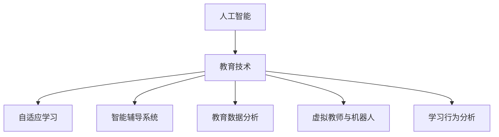

                 

# 人工智能：教育变革的催化剂

> 关键词：人工智能,教育变革,教育技术,教育公平,个性化学习,自适应学习

## 1. 背景介绍

### 1.1 问题由来
随着信息技术的快速发展，人工智能（AI）技术在各行各业中正迅速崛起。作为21世纪最具革命性的技术之一，AI 已经开始深刻影响教育领域的各个方面。从智能教学平台、自适应学习系统，到教育数据分析与决策支持，AI 技术正全面赋能教育行业的变革。

教育作为人类文明的基石，其持续革新不仅关乎个人的成长与发展，更关乎国家的未来。然而，传统的教育模式和资源分配不均等现象依然存在，学生的个性化需求未能得到充分满足。这就需要一种更加智能化、个性化、公平的教育方式。因此，人工智能成为了教育变革的催化剂，正在逐步改变教育的面貌，并提供了无限的可能性。

### 1.2 问题核心关键点
当前，AI在教育领域的应用主要集中在以下几个关键点：
1. **自适应学习**：通过AI算法，根据学生的学习进度和能力自动调整教学内容和难度，实现个性化教学。
2. **智能辅导系统**：利用AI分析学生学习数据，提供个性化辅导和反馈，帮助学生提高学习效果。
3. **教育数据分析**：通过AI对海量教育数据进行深度分析，为教育决策提供支持，优化教育资源分配。
4. **虚拟教师与机器人**：借助AI技术，构建虚拟教师或教育机器人，模拟真实教师的教学互动，提供全天候学习支持。
5. **学习行为分析**：使用AI分析学生在学习过程中的行为模式，预测学习成果，进行早期干预。

## 2. 核心概念与联系

### 2.1 核心概念概述

为了更好地理解AI在教育中的应用，我们需要明确几个核心概念：

- **人工智能（AI）**：模拟人类智能的计算机技术，包括机器学习、深度学习、自然语言处理等。
- **教育技术（EdTech）**：应用AI、互联网、移动设备等现代技术，改善教学和学习过程。
- **自适应学习**：根据学生的学习行为和表现，动态调整教学内容和方法，实现个性化学习。
- **智能辅导系统**：使用AI技术，对学生进行个性化辅导和反馈，辅助教师教学。
- **教育数据分析**：利用AI对教育数据进行深度分析和可视化，优化教学和学习策略。
- **虚拟教师与机器人**：基于AI构建的虚拟教学助手，可以模拟真实教师的互动。
- **学习行为分析**：通过AI技术分析学生的学习行为和模式，预测学习成果，实现早期干预。

这些概念之间存在密切联系，共同构成了AI在教育中的应用框架。以下是一个Mermaid流程图，展示了这些概念的逻辑关系：



### 2.2 核心概念原理和架构

自适应学习和智能辅导系统是AI在教育中应用的核心技术。其原理是通过AI算法，根据学生的学习行为和表现，动态调整教学内容和难度，提供个性化辅导和反馈。以下是对这些核心技术的详细讲解。

**自适应学习**：
自适应学习的核心在于学习路径的动态调整。其基本思路是通过AI算法，收集学生在学习过程中的数据（如测试成绩、答题时间、点击频率等），分析其学习能力和知识掌握情况，动态调整教学内容和难度。自适应学习系统的架构通常包括数据采集模块、学习模型模块和内容推荐模块。

**智能辅导系统**：
智能辅导系统利用AI技术，对学生进行个性化辅导和反馈。其基本思路是通过自然语言处理（NLP）、机器学习等技术，分析学生的学习数据，预测其可能遇到的困难，并提供个性化的辅导和建议。智能辅导系统的架构通常包括数据采集模块、学习分析模块和个性化辅导模块。

## 3. 核心算法原理 & 具体操作步骤
### 3.1 算法原理概述

AI在教育中的应用，主要依赖于以下几个核心算法：

- **机器学习（ML）**：通过对教育数据进行训练，学习出能够预测学生学习结果的模型。
- **深度学习（DL）**：利用神经网络对教育数据进行深度分析，实现更加精确的学习预测和个性化推荐。
- **自然语言处理（NLP）**：分析学生提出的问题，通过理解自然语言进行智能答疑和辅导。
- **推荐系统（Recommender Systems）**：根据学生的学习行为和兴趣，推荐适合的学习资源和内容。

这些算法通过结合教育数据，为教育系统提供了强大的分析和预测能力，使得个性化和自适应学习成为可能。

### 3.2 算法步骤详解

以下是对机器学习在自适应学习中的应用步骤详解：

1. **数据收集**：通过教育平台收集学生的学习数据，包括测试成绩、答题时间、点击频率等。
2. **数据预处理**：清洗和标准化数据，去除噪声，进行特征工程，提取对学习效果有影响的特征。
3. **模型训练**：使用机器学习算法（如决策树、随机森林、神经网络等），对学生数据进行训练，学习出能够预测学生学习效果的模型。
4. **学习路径调整**：根据预测结果，动态调整学生的学习内容和难度，实现个性化学习。
5. **效果评估**：通过测试和评估，不断优化学习模型和策略。

### 3.3 算法优缺点

AI在教育中的应用，具有以下优点：

- **个性化教学**：能够根据学生的学习进度和能力，动态调整教学内容和难度，实现个性化教学。
- **学习效率提升**：通过AI算法，快速识别学生学习中的难点和不足，进行针对性的辅导和指导，提高学习效率。
- **资源优化**：利用AI技术，优化教育资源分配，提升教育系统的整体效率。
- **数据驱动决策**：通过教育数据分析，为教育决策提供支持，优化教学策略和方法。

然而，AI在教育中的应用也存在一些缺点：

- **数据隐私和安全**：学生学习数据的收集和使用，涉及隐私保护和安全问题。
- **技术依赖性**：AI技术的应用需要高质量的教育数据和先进的技术支持，可能存在技术依赖性。
- **公平性问题**：AI算法可能存在偏见，导致教育资源分配不均。
- **教师角色转变**：AI技术的应用，可能导致教师角色的转变，需要重新适应和培训。

### 3.4 算法应用领域

AI在教育中的应用已经覆盖了多个领域，以下是几个典型的应用场景：

1. **智能教育平台**：如Khan Academy、Coursera等，利用AI技术提供个性化学习推荐和智能辅导。
2. **自适应学习系统**：如DreamBox、Knewton等，通过AI技术实现个性化教学，动态调整学习内容和难度。
3. **虚拟教师与机器人**：如ALEKS、Smart Sparrow等，利用AI技术构建虚拟教师或机器人，提供全天候学习支持。
4. **学习行为分析**：如Edmodo、Google Classroom等，通过AI技术分析学生学习行为，预测学习成果，进行早期干预。
5. **教育数据分析与决策支持**：如Tableau、Power BI等，利用AI技术对教育数据进行深度分析和可视化，支持教育决策。

## 4. 数学模型和公式 & 详细讲解 & 举例说明
### 4.1 数学模型构建

在本节中，我们将以自适应学习系统为例，介绍其数学模型构建过程。

自适应学习系统的基本数学模型可以表示为：
$$
f(x, \theta) = \arg\min_{\theta} \| f(x, \theta) - y \|^2
$$
其中，$f(x, \theta)$ 表示学生的学习效果，$x$ 表示学生的学习数据，$\theta$ 表示学习模型参数，$y$ 表示学习目标。

### 4.2 公式推导过程

自适应学习系统中的学习模型可以采用多种算法，如决策树、随机森林、神经网络等。以下以神经网络为例，介绍其推导过程。

假设有 $n$ 个样本 $(x_1, y_1), (x_2, y_2), \dots, (x_n, y_n)$，其中 $x_i = [x_{i1}, x_{i2}, \dots, x_{im}]$ 表示第 $i$ 个样本的特征向量，$y_i$ 表示第 $i$ 个样本的学习效果。神经网络模型可以表示为：
$$
f(x, \theta) = \sum_{i=1}^m \alpha_i \cdot f_i(x)
$$
其中，$f_i(x)$ 表示第 $i$ 个神经元输出，$\alpha_i$ 表示第 $i$ 个神经元的权重。

通过最小化损失函数 $L(\theta)$，即：
$$
L(\theta) = \frac{1}{2} \sum_{i=1}^n (y_i - f(x_i, \theta))^2
$$
使用梯度下降法，不断调整模型参数 $\theta$，使 $f(x, \theta)$ 逼近 $y$。

### 4.3 案例分析与讲解

以下以一个简单的自适应学习系统为例，进行案例分析：

假设有一个自适应学习系统，根据学生的测试成绩和答题时间，动态调整学习内容。系统收集了 $100$ 名学生的数据，每名学生有 $5$ 次测试成绩和 $3$ 次答题时间，共有 $300$ 个样本。系统采用神经网络模型进行训练，构建学习模型。

使用梯度下降法，最小化损失函数：
$$
L(\theta) = \frac{1}{2} \sum_{i=1}^{300} (y_i - f(x_i, \theta))^2
$$
通过反向传播算法，不断调整模型参数 $\theta$，直到收敛。最终，系统能够根据学生的学习数据，动态调整学习内容和难度，实现个性化学习。

## 5. 项目实践：代码实例和详细解释说明
### 5.1 开发环境搭建

要进行自适应学习系统的开发，首先需要搭建好开发环境。以下是搭建Python开发环境的步骤：

1. **安装Python**：下载并安装Python 3.x版本。
2. **安装Pip**：在Python安装完成后，安装Pip工具，用于安装和管理Python包。
3. **安装相关库**：安装必要的库，如TensorFlow、Keras、Scikit-Learn等。

### 5.2 源代码详细实现

以下是一个简单的自适应学习系统代码实现：

```python
import numpy as np
from sklearn.neural_network import MLPRegressor
from sklearn.metrics import mean_squared_error

# 数据集
x = np.array([[1, 2], [2, 3], [3, 4], [4, 5], [5, 6]])
y = np.array([2.5, 3.5, 4.5, 5.5, 6.5])

# 模型
model = MLPRegressor(hidden_layer_sizes=(5,), activation='relu', max_iter=1000)

# 训练
model.fit(x, y)

# 预测
x_test = np.array([[1, 7], [2, 8], [3, 9]])
y_pred = model.predict(x_test)

# 评估
mse = mean_squared_error(y_test, y_pred)
print('MSE:', mse)
```

### 5.3 代码解读与分析

上述代码实现了一个简单的神经网络模型，用于预测学生的学习效果。其核心步骤包括：

1. **数据准备**：定义训练数据集 $x$ 和 $y$。
2. **模型定义**：定义神经网络模型，使用 MLPRegressor 类，指定隐藏层大小和激活函数。
3. **模型训练**：使用 fit 方法训练模型，最小化损失函数。
4. **模型预测**：使用 predict 方法对测试数据进行预测。
5. **评估**：使用 mean_squared_error 方法评估模型预测效果。

## 6. 实际应用场景
### 6.1 智能教育平台

智能教育平台是AI在教育中最常见的应用场景之一。通过智能教育平台，学生可以根据自己的学习进度和能力，选择适合自己的学习资源和内容，进行个性化学习。平台可以提供学习路径规划、学习效果评估、学习资源推荐等服务。

例如，Khan Academy、Coursera等平台利用AI技术，根据学生的学习数据，动态调整学习内容和难度，实现个性化学习。平台通过收集学生的学习数据，进行深度分析，为学生提供个性化的学习建议和资源推荐。

### 6.2 自适应学习系统

自适应学习系统是AI在教育中最重要的应用之一。其基本思想是根据学生的学习数据，动态调整学习内容和难度，实现个性化学习。自适应学习系统可以应用于多种教育场景，如在线学习、移动学习等。

例如，DreamBox、Knewton等自适应学习系统，利用AI技术，动态调整学生的学习内容和难度，实现个性化教学。这些系统通过收集学生的学习数据，进行深度分析，为学生提供个性化的学习建议和资源推荐。

### 6.3 虚拟教师与机器人

虚拟教师与机器人是AI在教育中的另一个重要应用。其基本思想是通过AI技术，构建虚拟教师或机器人，提供全天候学习支持。虚拟教师与机器人可以回答学生的问题，提供个性化的辅导和反馈。

例如，ALEKS、Smart Sparrow等虚拟教师与机器人，利用AI技术，提供全天候学习支持。这些系统通过自然语言处理技术，分析学生的问题，提供个性化的辅导和反馈。

### 6.4 学习行为分析

学习行为分析是AI在教育中应用较广的另一个领域。其基本思想是通过AI技术，分析学生的学习行为和模式，预测学习成果，进行早期干预。学习行为分析可以应用于多种教育场景，如在线学习、传统课堂等。

例如，Edmodo、Google Classroom等学习行为分析平台，利用AI技术，分析学生的学习行为和模式，预测学习成果，进行早期干预。这些平台通过收集学生的学习数据，进行深度分析，为教师提供个性化的教学建议和资源推荐。

## 7. 工具和资源推荐
### 7.1 学习资源推荐

为了帮助开发者系统掌握AI在教育中的应用，这里推荐一些优质的学习资源：

1. **《人工智能与教育》**：清华大学出版社，介绍AI在教育中的基本概念和应用场景。
2. **Coursera《AI for Everyone》**：由Andrew Ng教授主讲，全面介绍AI的基本概念和应用。
3. **Kaggle教育数据集**：Kaggle平台上，提供了大量的教育数据集，用于实践AI在教育中的应用。
4. **EdTech初创公司**：如Duolingo、Khan Academy等，展示了AI在教育中的成功案例。
5. **Open edX平台**：提供大量MOOC课程，涵盖AI在教育中的应用。

通过对这些资源的学习实践，相信你一定能够快速掌握AI在教育中的应用精髓，并用于解决实际的NLP问题。

### 7.2 开发工具推荐

高效的开发离不开优秀的工具支持。以下是几款用于AI在教育中应用开发的常用工具：

1. **Jupyter Notebook**：免费的开源笔记本，支持Python编程，方便开发和调试。
2. **TensorFlow**：由Google主导开发的深度学习框架，生产部署方便，支持多种语言和平台。
3. **Scikit-Learn**：Python机器学习库，提供了多种机器学习算法和工具。
4. **PyTorch**：由Facebook开发的深度学习框架，灵活高效，支持动态计算图。
5. **Keras**：高层次的深度学习框架，易于使用，支持多种后端。

合理利用这些工具，可以显著提升AI在教育中应用的开发效率，加快创新迭代的步伐。

### 7.3 相关论文推荐

AI在教育中的应用，得益于学界的持续研究。以下是几篇奠基性的相关论文，推荐阅读：

1. **《机器学习在教育中的应用》**：斯坦福大学2015年论文，全面介绍机器学习在教育中的各种应用。
2. **《自适应学习系统》**：Jones等2016年论文，介绍自适应学习系统的基本原理和实现方法。
3. **《智能辅导系统》**：Duolingo等2019年论文，介绍智能辅导系统的基本原理和应用场景。
4. **《教育数据分析与决策支持》**：S.repeat2018年论文，介绍教育数据分析的基本方法和应用场景。

这些论文代表了大数据、机器学习在教育中的应用前沿，是研究AI在教育中应用的必备资料。

## 8. 总结：未来发展趋势与挑战
### 8.1 研究成果总结

本文对AI在教育中的应用进行了全面系统的介绍。首先阐述了AI在教育中的背景和意义，明确了自适应学习和智能辅导系统的基本原理和实现方法。其次，介绍了AI在教育中的数学模型和公式，进行了详细的讲解和案例分析。最后，讨论了AI在教育中的应用场景，推荐了相关学习资源和开发工具。

通过本文的系统梳理，可以看到，AI在教育中的应用正在全面展开，为教育变革带来了新的契机。未来，AI将在个性化学习、智能辅导、教育数据分析等领域发挥更大的作用，推动教育公平和高质量发展。

### 8.2 未来发展趋势

展望未来，AI在教育中的应用将呈现以下几个发展趋势：

1. **个性化学习的普及**：随着AI技术的发展，个性化学习将成为主流，学生可以根据自己的学习进度和能力，动态调整学习内容和难度，实现个性化学习。
2. **智能辅导系统的完善**：智能辅导系统将成为教育的重要辅助工具，提供全天候学习支持，提高教学效率和学习效果。
3. **教育数据分析的深化**：教育数据分析将更加深入和全面，为教育决策提供更精准的依据，优化教育资源分配。
4. **虚拟教师与机器人的普及**：虚拟教师与机器人将成为教育的重要组成部分，提供更全面、灵活的教育服务。
5. **学习行为分析的精细化**：学习行为分析将更加精细化，通过分析学生的学习行为和模式，预测学习成果，进行早期干预。

这些趋势将推动教育系统向更加智能化、个性化、公平化的方向发展，为学生提供更好的学习体验。

### 8.3 面临的挑战

尽管AI在教育中的应用已经取得了一些成果，但在迈向更加智能化、普适化应用的过程中，它仍面临着诸多挑战：

1. **数据隐私和安全**：学生学习数据的收集和使用，涉及隐私保护和安全问题，需要建立完善的数据保护机制。
2. **技术依赖性**：AI技术的应用需要高质量的教育数据和先进的技术支持，可能存在技术依赖性。
3. **公平性问题**：AI算法可能存在偏见，导致教育资源分配不均。
4. **教师角色转变**：AI技术的应用，可能导致教师角色的转变，需要重新适应和培训。
5. **资源优化**：AI技术的应用需要大量的计算资源和存储空间，可能存在资源瓶颈。

这些挑战需要我们在技术、伦理、社会等多个层面进行全面的探讨和解决。

### 8.4 研究展望

为了应对AI在教育中面临的挑战，未来的研究需要在以下几个方面寻求新的突破：

1. **隐私保护技术**：开发更加安全的隐私保护技术，保护学生学习数据的安全性和隐私性。
2. **公平性算法**：研究公平性算法，避免AI算法中的偏见，实现教育资源的公平分配。
3. **教师培训**：加强对教师的培训，帮助其适应AI技术的应用，提升教学效果。
4. **资源优化**：优化AI技术的资源消耗，提升计算效率和存储空间利用率。
5. **多模态学习**：研究多模态学习技术，融合视觉、听觉等多种信息，提升学习效果。

这些研究方向的探索，必将引领AI在教育中应用的进一步发展，为教育变革带来新的突破。

## 9. 附录：常见问题与解答

**Q1：AI在教育中的应用是否适用于所有学科？**

A: AI在教育中的应用具有广泛的应用前景，不仅限于某些学科。通过AI技术，可以实现各学科的个性化教学和自适应学习。例如，数学、物理、化学等学科可以通过AI技术，提供个性化辅导和资源推荐，提高教学效果。

**Q2：AI在教育中的应用是否需要高质量的教育数据？**

A: 是的，AI在教育中的应用需要高质量的教育数据，才能保证模型的准确性和鲁棒性。如果数据质量不佳，可能导致模型效果不佳，甚至出现偏差和错误。因此，收集和处理高质量的教育数据，是AI在教育中应用的重要前提。

**Q3：AI在教育中的应用是否需要高昂的技术成本？**

A: 高昂的技术成本可能会成为一些教育机构应用AI技术的障碍。然而，随着AI技术的普及和开源社区的发展，越来越多的AI工具和框架可以免费或低成本使用。例如，TensorFlow、Keras、Scikit-Learn等，都是免费且功能强大的AI开发工具。

**Q4：AI在教育中的应用是否会替代传统教育模式？**

A: AI在教育中的应用，旨在辅助传统教育模式，而非完全替代。AI技术可以提供个性化学习、智能辅导等辅助服务，提升教学效果和学习效率。然而，教师和学生在教学过程中的互动和情感交流，是无法完全被AI替代的。

**Q5：AI在教育中的应用是否需要专业的技术支持？**

A: 是的，AI在教育中的应用需要专业的技术支持。教育机构需要聘请专业的AI技术人才，进行系统的培训和技术支持。同时，也需要建立完善的技术架构和平台，保证AI技术的稳定运行和维护。

总之，AI在教育中的应用，已经显现出巨大的潜力和前景。通过AI技术的辅助，教育系统可以实现更加个性化、高效化和公平化的发展，为学生提供更好的学习体验。然而，AI技术的应用也需要克服诸多挑战，只有在技术、伦理、社会等多个层面的共同努力，才能真正实现教育变革的目标。

