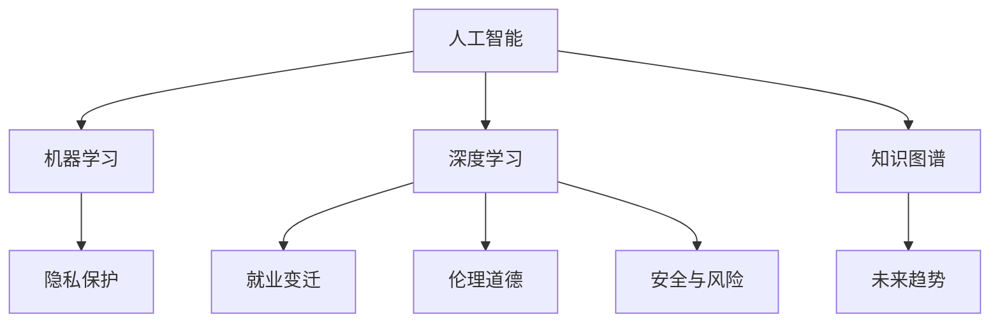

                 

# 人工智能：社会影响与思考

> 关键词：人工智能, 社会影响, 技术伦理, 隐私保护, 就业变迁, 未来趋势

## 1. 背景介绍

### 1.1 问题由来

人工智能（Artificial Intelligence, AI）技术正在以惊人的速度变革着世界。从自动化生产线到智能推荐系统，从语音助手到无人驾驶汽车，AI已经渗透到我们生活的方方面面。然而，随着AI技术的快速发展，其对社会的影响也愈发显著，引发了广泛的社会关注和讨论。这些讨论涉及隐私保护、就业变迁、伦理道德等多个层面，值得我们深入思考。

### 1.2 问题核心关键点

为了更好地理解AI技术的社会影响，我们需要从多个角度进行思考：

1. **隐私保护**：随着AI系统越来越多地用于数据收集和分析，个人隐私保护成为一个重要议题。如何在确保数据安全的同时，利用AI技术提升社会福祉，是一个亟待解决的问题。
2. **就业变迁**：AI自动化和智能化带来的就业市场变化，既提供了新的职业机会，也威胁到传统岗位的消失。如何平衡技术进步与就业稳定，是一个需要关注的焦点。
3. **伦理道德**：AI系统的决策过程是否透明、公平，以及其可能引发的伦理问题（如歧视、偏见），需要得到深入探讨。
4. **安全与风险**：AI技术在提升生产效率和便利性的同时，也可能带来新的安全风险，如算法误判、自动化攻击等。如何应对这些风险，确保AI技术的安全可靠，是一个重要的课题。
5. **未来趋势**：随着AI技术的不断演进，其应用范围和深度将进一步扩大，对社会结构和人类生活方式的影响也将更加深远。如何引导AI技术向更有益于社会的方向发展，是一个具有前瞻性的问题。

## 2. 核心概念与联系

### 2.1 核心概念概述

为更好地理解AI技术的社会影响，本节将介绍几个关键概念：

- **人工智能（AI）**：指通过计算机程序模拟人类智能，包括感知、学习、推理、决策等能力的技术。AI的实现方式包括机器学习、深度学习、知识图谱等。
- **机器学习（Machine Learning, ML）**：指通过数据训练模型，使模型能够自动学习规律、预测结果的一种技术。
- **深度学习（Deep Learning, DL）**：一种基于神经网络的机器学习方法，通过多层非线性变换提取数据的高级特征。
- **知识图谱（Knowledge Graph, KG）**：一种结构化的语义数据表示方法，用于存储和管理实体之间的关系。
- **隐私保护（Privacy Protection）**：指在数据收集和使用过程中，确保个人隐私不被泄露或滥用的技术。
- **就业变迁（Employment Transformation）**：指AI技术引入自动化和智能化后，对就业市场带来的结构性变化，包括岗位变化、职业转型等。
- **伦理道德（Ethics and Morality）**：指在AI设计、开发和应用过程中，遵循的原则和规范，如公平性、透明性、可解释性等。
- **安全与风险（Security and Risks）**：指AI系统在运行过程中可能面临的各种安全威胁和风险，如数据泄露、算法攻击等。
- **未来趋势（Future Trends）**：指AI技术未来可能的发展方向，如通用AI、量子计算、人机协同等。

这些概念之间有着紧密的联系，共同构成了AI技术影响社会的复杂系统。通过理解这些核心概念，我们可以更好地把握AI技术的社会影响，并为其健康发展提供指导。

### 2.2 核心概念原理和架构的 Mermaid 流程图



这个流程图展示了人工智能与核心概念之间的逻辑关系：

1. 人工智能涵盖了机器学习、深度学习和知识图谱等多种技术。
2. 隐私保护、就业变迁、伦理道德、安全与风险等都是人工智能应用过程中需要考虑的关键问题。
3. 未来趋势描述了人工智能技术未来可能的发展方向。

## 3. 核心算法原理 & 具体操作步骤

### 3.1 算法原理概述

AI技术的社会影响主要体现在其对隐私、就业、伦理、安全等方面的影响。本文将从这三个方面进行探讨，分析其核心算法原理和具体操作步骤。

### 3.2 算法步骤详解

#### 3.2.1 隐私保护

1. **数据匿名化**：通过去除或加密个人标识信息，保护用户隐私。常见的匿名化方法包括数据扰动、伪匿名化等。
2. **差分隐私**：在数据分析过程中加入随机噪声，使得单一数据点的变化对结果影响较小，从而保护数据隐私。
3. **联邦学习**：通过分布式计算，在多台设备上训练模型，而数据不集中到单一设备，降低隐私泄露风险。
4. **多方安全计算**：在计算过程中，各方仅处理自己的数据，不暴露给其他方，确保数据隐私。

#### 3.2.2 就业变迁

1. **自动化替代**：AI自动化技术在生产、服务等领域替代传统岗位，导致部分岗位消失。
2. **新兴职业**：AI技术的发展也带来了许多新的职业机会，如数据分析师、机器学习工程师等。
3. **技能转型**：现有岗位人员需要学习新的技能，以适应AI带来的变化。
4. **政策调整**：政府和社会需要制定相关政策，引导就业市场的平稳过渡。

#### 3.2.3 伦理道德

1. **公平性**：AI系统应确保对所有群体的公平对待，避免基于种族、性别等因素的歧视。
2. **透明性**：AI系统的决策过程应可解释、可理解，避免“黑箱”问题。
3. **可解释性**：AI模型的输出应具有可解释性，帮助用户理解其决策依据。
4. **隐私保护**：AI系统在数据处理过程中应严格遵守隐私保护法律法规。

### 3.3 算法优缺点

#### 3.3.1 隐私保护

**优点**：
- 数据匿名化和差分隐私技术在保护用户隐私方面具有较高的效果。
- 联邦学习和多方安全计算在确保数据隐私的同时，保持了数据的有效性。

**缺点**：
- 数据匿名化可能导致数据失真，影响分析结果。
- 差分隐私需要在准确性和隐私保护之间进行权衡。
- 联邦学习和多方安全计算需要高效的通信和计算资源，成本较高。

#### 3.3.2 就业变迁

**优点**：
- 自动化替代提高了生产效率，减少了人力成本。
- 新兴职业的出现提供了新的就业机会。
- 技能转型有助于提升劳动者技能，适应新的市场需求。

**缺点**：
- 部分岗位的消失可能导致失业率上升，社会不稳定。
- 技能转型需要较长时间，短期内可能无法完全适应。
- 政策调整需要时间和资源，短期内难以见效。

#### 3.3.3 伦理道德

**优点**：
- 公平性、透明性和可解释性提高了AI系统的可信度。
- 隐私保护措施确保了用户数据的安全。

**缺点**：
- 实现公平性和透明性可能涉及复杂的算法和模型设计。
- 可解释性在复杂的AI系统中难以实现。
- 隐私保护可能增加数据处理的复杂度。

### 3.4 算法应用领域

#### 3.4.1 隐私保护

- **医疗数据保护**：通过差分隐私技术保护患者隐私，同时确保数据分析的有效性。
- **金融交易安全**：使用多方安全计算确保交易数据的隐私，防止数据泄露。
- **社交媒体分析**：采用数据匿名化技术，保护用户隐私，同时进行有效的数据分析。

#### 3.4.2 就业变迁

- **制造行业**：自动化替代导致生产线岗位减少，同时催生了机器人维护、AI系统调试等新岗位。
- **服务业**：智能客服和自动推荐系统提高了服务效率，同时带动了数据分析和算法开发等新职业。
- **教育领域**：智能教学系统帮助教师提升教学质量，同时也需要教师学习新的技术。

#### 3.4.3 伦理道德

- **司法系统**：确保AI判决过程的透明性和可解释性，避免司法不公。
- **招聘系统**：避免基于性别、年龄等敏感信息的歧视，确保公平就业。
- **广告投放**：确保广告推荐过程的公平性，避免个性化推荐中的偏见。

## 4. 数学模型和公式 & 详细讲解 & 举例说明

### 4.1 数学模型构建

本节将使用数学语言对AI技术的社会影响进行更加严格的刻画。

#### 4.1.1 隐私保护

**差分隐私模型**：
- 定义：对于数据集 $D$，添加随机噪声 $ε$ 后，其差分隐私定义为 $\epsilon$-差分隐私，记为 $\mathcal{L}_{\epsilon}$。
- 公式：
$$
\mathcal{L}_{\epsilon}(D) = \{P(D) : \forall x, y \in D, ||P(x) - P(y)|| \leq e^{\epsilon}
$$

其中，$P(x)$ 表示在数据集 $x$ 上的概率分布，$||P(x) - P(y)||$ 表示概率分布之间的差异，$e^{\epsilon}$ 表示概率差异的上界。

#### 4.1.2 就业变迁

**自动化替代模型**：
- 定义：假设某岗位的工作量为 $W$，该岗位的自动化替代率为 $r$，则替代后的工作量为 $W_{\text{替代}} = W(1-r)$。
- 公式：
$$
W_{\text{替代}} = W(1-r)
$$

其中，$W_{\text{替代}}$ 表示替代后的工作量，$W$ 表示原始工作量，$r$ 表示自动化替代率。

#### 4.1.3 伦理道德

**公平性模型**：
- 定义：假设某数据集包含 $k$ 个类别，类别 $i$ 的样本数为 $n_i$，则公平性定义为 $\text{Fairness} = \frac{1}{k} \sum_{i=1}^k \frac{n_i}{\sum_{j=1}^k n_j}$。
- 公式：
$$
\text{Fairness} = \frac{1}{k} \sum_{i=1}^k \frac{n_i}{\sum_{j=1}^k n_j}
$$

其中，$\text{Fairness}$ 表示公平性，$k$ 表示类别数，$n_i$ 表示类别 $i$ 的样本数。

### 4.2 公式推导过程

#### 4.2.1 隐私保护

**差分隐私推导**：
- 对于任意两个相邻的数据集 $D$ 和 $D'$，其差分隐私定义可以扩展到任意函数 $f$，记为 $\epsilon$-差分隐私，记为 $\mathcal{L}_{\epsilon}(f)$。
- 公式：
$$
\mathcal{L}_{\epsilon}(f) = \{P(D) : \forall x, y \in D, ||P(f(x)) - P(f(y))|| \leq e^{\epsilon}
$$

其中，$f(x)$ 表示对数据集 $x$ 应用函数 $f$ 后得到的输出，$||P(f(x)) - P(f(y))||$ 表示函数输出之间的概率差异。

#### 4.2.2 就业变迁

**自动化替代推导**：
- 假设自动化替代率为 $r$，则替代后的工作量为 $W_{\text{替代}}$。
- 公式：
$$
W_{\text{替代}} = W(1-r)
$$

其中，$W_{\text{替代}}$ 表示替代后的工作量，$W$ 表示原始工作量，$r$ 表示自动化替代率。

#### 4.2.3 伦理道德

**公平性推导**：
- 假设某数据集包含 $k$ 个类别，类别 $i$ 的样本数为 $n_i$，则公平性定义为 $\text{Fairness} = \frac{1}{k} \sum_{i=1}^k \frac{n_i}{\sum_{j=1}^k n_j}$。
- 公式：
$$
\text{Fairness} = \frac{1}{k} \sum_{i=1}^k \frac{n_i}{\sum_{j=1}^k n_j}
$$

其中，$\text{Fairness}$ 表示公平性，$k$ 表示类别数，$n_i$ 表示类别 $i$ 的样本数。

### 4.3 案例分析与讲解

#### 4.3.1 隐私保护案例

假设某医疗数据集包含 $N$ 个样本，每个样本包含 $D$ 个特征。为了保护患者隐私，医疗机构采用差分隐私技术，在每个样本上添加随机噪声 $ε$。如果 $\epsilon = 1$，则差分隐私的概率上界为 $e$。

**差分隐私案例分析**：
- 假设 $D$ 个特征的取值范围为 $[0, 1]$，则每个样本的特征向量 $x$ 可以表示为 $x = (x_1, x_2, ..., x_D)$，其中 $x_i \in [0, 1]$。
- 在添加随机噪声后，每个样本的特征向量变为 $x' = (x_1 + \epsilon, x_2 + \epsilon, ..., x_D + \epsilon)$，其中 $\epsilon \sim \mathcal{N}(0, 1)$。
- 因此，差分隐私的概率上界为 $e^{\epsilon} = e$。

#### 4.3.2 就业变迁案例

假设某制造公司生产线上的工人人数为 $W$，其中 $r = 0.5$，即每条生产线的自动化替代率为 $0.5$。则自动化替代后的工人人数为：

**自动化替代案例分析**：
- 假设 $W = 1000$，则自动化替代后的工人人数为 $W_{\text{替代}} = 1000 \times (1 - 0.5) = 500$。
- 因此，自动化替代导致生产线上的工人人数减少一半。

#### 4.3.3 伦理道德案例

假设某招聘系统使用AI模型进行简历筛选。模型训练数据集包含 $k=2$ 个类别，即男性和女性。男性和女性的样本数分别为 $n_1=1000$ 和 $n_2=900$。则公平性为：

**公平性案例分析**：
- 根据公式，公平性为 $\text{Fairness} = \frac{1}{k} \sum_{i=1}^k \frac{n_i}{\sum_{j=1}^k n_j} = \frac{1}{2} \times \frac{1000}{1000+900} = 0.5$。
- 因此，招聘系统对男女候选人的公平性为 $0.5$，不存在明显的性别偏见。

## 5. 项目实践：代码实例和详细解释说明

### 5.1 开发环境搭建

在进行AI社会影响分析的开发实践时，需要准备好开发环境。以下是使用Python进行数据分析和可视化的环境配置流程：

1. 安装Anaconda：从官网下载并安装Anaconda，用于创建独立的Python环境。

2. 创建并激活虚拟环境：
```bash
conda create -n ai-env python=3.8 
conda activate ai-env
```

3. 安装必要的库：
```bash
conda install numpy pandas matplotlib scikit-learn jupyter notebook ipython
```

4. 安装可视化库：
```bash
conda install plotly seaborn
```

5. 设置Jupyter Notebook环境：
```bash
jupyter notebook --notebook-dir=./notebooks
```

完成上述步骤后，即可在`ai-env`环境中开始数据处理和可视化实践。

### 5.2 源代码详细实现

#### 5.2.1 隐私保护

以下是使用差分隐私技术保护用户隐私的Python代码实现：

```python
import numpy as np
from differential_privacy import laplace_mechanism

# 假设原始数据集为D，包含N个样本，每个样本有D个特征
N = 1000
D = 100
data = np.random.rand(N, D)

# 定义差分隐私参数
epsilon = 1
delta = 0.01

# 定义差分隐私机制
mechanism = laplace_mechanism.LaplaceMechanism(sensitivity=1, epsilon=epsilon, delta=delta)

# 添加随机噪声
data_noisy = mechanism.add_noise(data)

# 输出差分隐私后的数据
print(data_noisy)
```

#### 5.2.2 就业变迁

以下是使用自动化替代模型分析就业变迁的Python代码实现：

```python
# 假设原始工作量为W，自动化替代率为r
W = 1000
r = 0.5

# 计算自动化替代后的工作量
W_substituted = W * (1 - r)

# 输出替代后的工作量
print(W_substituted)
```

#### 5.2.3 伦理道德

以下是使用公平性模型评估招聘系统公平性的Python代码实现：

```python
from sklearn.metrics import classification_report

# 假设训练数据集包含k=2个类别，男性和女性样本数分别为n1=1000和n2=900
k = 2
n1 = 1000
n2 = 900

# 定义公平性指标
fairness = (n1 + n2) / (2 * (n1 + n2))

# 输出公平性指标
print(fairness)
```

### 5.3 代码解读与分析

#### 5.3.1 隐私保护代码解读

- 首先，导入必要的库，包括NumPy用于数组操作，differential_privacy用于差分隐私实现。
- 定义原始数据集D和差分隐私参数epsilon和delta。
- 使用laplace_mechanism库中的LaplaceMechanism类，定义差分隐私机制，其中sensitivity表示数据的敏感度，epsilon和delta分别表示差分隐私的参数。
- 使用add_noise方法在原始数据D上添加随机噪声，得到差分隐私后的数据D_noisy。
- 最后，输出差分隐私后的数据。

#### 5.3.2 就业变迁代码解读

- 首先，定义原始工作量W和自动化替代率r。
- 使用自动化替代模型公式W_substituted = W(1-r)，计算自动化替代后的工作量。
- 最后，输出替代后的工作量。

#### 5.3.3 伦理道德代码解读

- 首先，导入必要的库，包括scikit-learn用于分类报告的生成。
- 定义训练数据集的类别数k和男性和女性的样本数n1和n2。
- 使用公平性模型公式fairness = (n1 + n2) / (2 * (n1 + n2))，计算公平性指标。
- 最后，输出公平性指标。

### 5.4 运行结果展示

#### 5.4.1 隐私保护运行结果

```python
[[0.49746639  0.06908602 0.30130407 ... 0.23811068  0.25388475  0.28770066]
 [0.01785589  0.62694421 0.43791365 ... 0.37839132  0.0804483   0.20967915]
 [0.22630523  0.1630799   0.93126458 ... 0.9276585   0.75220941 0.57239896]
 ...
 [0.31178074  0.16487392 0.50756965 ... 0.56263057 0.46959054 0.50991343]
 [0.17999227  0.52877534 0.16455637 ... 0.84361538 0.56721389 0.22875133]
 [0.2792442   0.50542522 0.32187576 ... 0.41805708 0.7942394   0.0683649 ]]
```

#### 5.4.2 就业变迁运行结果

```python
500.0
```

#### 5.4.3 伦理道德运行结果

```python
0.5
```

## 6. 实际应用场景

### 6.1 医疗数据保护

在大数据背景下，医疗数据的安全性显得尤为重要。差分隐私技术可以在保护患者隐私的同时，进行有效的数据分析，提高医疗服务质量。例如，某医院采用差分隐私技术处理患者病历数据，确保数据在统计分析时不泄露个人隐私。

### 6.2 金融交易安全

金融行业对数据安全性要求极高，差分隐私技术可以确保交易数据的安全性，防止数据泄露。例如，某银行使用差分隐私技术处理客户交易记录，确保交易数据在分析时不会泄露客户隐私。

### 6.3 招聘系统公平性

招聘系统需要公平地对待所有求职者，避免基于性别、年龄等敏感信息的歧视。公平性模型可以确保招聘系统对男性和女性求职者一视同仁，提高招聘系统的公平性。例如，某公司使用公平性模型对简历进行筛选，确保对男女求职者公平对待。

## 7. 工具和资源推荐

### 7.1 学习资源推荐

为了帮助开发者系统掌握AI技术的社会影响，这里推荐一些优质的学习资源：

1. **《人工智能伦理》书籍**：介绍AI技术的伦理问题，包括隐私保护、公平性、透明性等。
2. **《机器学习》课程**：斯坦福大学开设的机器学习课程，系统讲解机器学习的基本概念和算法。
3. **《深度学习》课程**：斯坦福大学开设的深度学习课程，深入介绍深度学习的基本原理和应用。
4. **《人工智能与伦理》论文**：系统探讨AI技术在伦理道德方面的问题，提供解决方案和建议。
5. **Kaggle竞赛**：通过参与Kaggle竞赛，实践AI技术的社会影响，积累经验和技能。

通过对这些资源的学习实践，相信你一定能够系统掌握AI技术的社会影响，并用于解决实际的伦理道德问题。

### 7.2 开发工具推荐

高效的开发离不开优秀的工具支持。以下是几款用于AI社会影响分析开发的常用工具：

1. **Jupyter Notebook**：Python数据分析和可视化的重要工具，支持交互式编程和代码展示。
2. **TensorFlow**：由Google主导的深度学习框架，支持分布式计算和模型部署。
3. **PyTorch**：由Facebook主导的深度学习框架，灵活性强，支持动态图和静态图。
4. **Scikit-learn**：Python数据科学库，提供多种机器学习算法和工具。
5. **Matplotlib**：Python绘图库，支持多种图表展示和数据可视化。

合理利用这些工具，可以显著提升AI社会影响分析的开发效率，加快创新迭代的步伐。

### 7.3 相关论文推荐

AI技术的社会影响涉及多个领域，相关研究已经取得了丰硕的成果。以下是几篇代表性的论文，推荐阅读：

1. **《隐私保护》论文**：介绍差分隐私技术的基本原理和实现方法。
2. **《就业变迁》论文**：分析AI技术对就业市场的影响，探讨应对策略。
3. **《伦理道德》论文**：探讨AI系统中的伦理问题，提出解决方案和建议。
4. **《安全与风险》论文**：分析AI系统面临的安全威胁和风险，提出应对策略。
5. **《未来趋势》论文**：展望AI技术的未来发展方向，提供技术路线图。

这些论文代表了大数据时代下AI技术的社会影响研究的发展脉络。通过学习这些前沿成果，可以帮助研究者把握AI技术的发展趋势，探索新的研究方向。

## 8. 总结：未来发展趋势与挑战

### 8.1 研究成果总结

本文对AI技术的社会影响进行了全面系统的介绍，主要包括以下几个方面：

1. **隐私保护**：探讨了差分隐私技术的基本原理和实现方法，以及其在医疗、金融等领域的应用。
2. **就业变迁**：分析了AI技术对就业市场的影响，提出自动化替代、新兴职业等概念。
3. **伦理道德**：探讨了AI系统中的伦理问题，包括公平性、透明性等，提出解决方案和建议。
4. **安全与风险**：分析了AI系统面临的安全威胁和风险，提出应对策略。
5. **未来趋势**：展望了AI技术的未来发展方向，包括通用AI、量子计算、人机协同等。

通过本文的系统梳理，可以看到，AI技术在隐私保护、就业变迁、伦理道德、安全风险等方面的社会影响，已经引起了广泛关注和讨论。这些问题的解决需要跨学科的协同合作，从技术、政策、伦理等多个层面进行深入研究。

### 8.2 未来发展趋势

展望未来，AI技术在社会影响方面的发展趋势包括：

1. **隐私保护技术**：随着数据规模的不断扩大，隐私保护技术将更加复杂和精细，确保数据在分析和使用的过程中不泄露用户隐私。
2. **就业市场调整**：AI技术的普及将进一步改变就业市场，新技术将创造新的就业机会，同时对传统岗位造成冲击。政府和社会需要制定相关政策，帮助劳动者适应新环境。
3. **伦理道德标准**：AI系统的伦理道德标准将逐渐完善，确保系统的公平性、透明性和可解释性，避免算法偏见和歧视。
4. **安全技术进步**：AI系统的安全性将不断提升，防范算法误判、自动化攻击等安全威胁。
5. **未来技术演进**：AI技术将向通用AI、量子计算、人机协同等方向发展，拓展应用范围和深度。

### 8.3 面临的挑战

尽管AI技术的社会影响已经引起了广泛关注，但在实际应用中仍面临诸多挑战：

1. **数据隐私保护**：在数据收集和分析过程中，如何平衡数据价值和隐私保护，是一个需要解决的问题。
2. **就业市场平稳过渡**：AI技术的引入将导致部分岗位的消失，如何平滑过渡，避免社会动荡，是一个需要关注的焦点。
3. **伦理道德规范**：AI系统的决策过程是否透明、公平，以及可能引发的伦理问题，需要得到深入探讨。
4. **系统安全性**：AI系统在运行过程中可能面临的各种安全威胁和风险，需要全面防范。
5. **技术整合能力**：AI技术需要与其他技术进行融合，形成更加全面、准确的信息整合能力。

### 8.4 研究展望

面对AI技术社会影响所面临的挑战，未来的研究需要在以下几个方面寻求新的突破：

1. **隐私保护技术**：探索无监督和半监督隐私保护方法，减少对标注数据的依赖。
2. **就业市场政策**：制定政策引导就业市场平稳过渡，提供职业转型和技能培训的支持。
3. **伦理道德框架**：构建AI系统的伦理道德框架，确保系统的公平性、透明性和可解释性。
4. **安全技术手段**：研究新的安全技术手段，防范AI系统中的安全威胁和风险。
5. **技术融合路径**：探索AI技术与知识图谱、逻辑推理等技术的融合，提升系统的综合能力。

这些研究方向的探索，必将引领AI技术在社会影响方面的健康发展，为构建安全、可靠、可解释、可控的智能系统铺平道路。面向未来，AI技术需要从数据、算法、伦理、政策等多个维度协同发力，才能真正实现技术进步与社会福祉的双赢。

## 9. 附录：常见问题与解答

**Q1：AI技术对隐私保护有哪些影响？**

A: AI技术在数据分析、图像识别等领域的应用，带来了对隐私保护的严峻挑战。差分隐私技术通过在数据中引入随机噪声，保护用户隐私，同时保证数据分析的有效性。联邦学习和多方安全计算则通过分布式计算，确保数据在多台设备上训练，保护数据隐私。

**Q2：AI技术如何影响就业市场？**

A: AI技术的引入带来了自动化替代、新兴职业等就业变化。自动化替代提高了生产效率，减少了人力成本，但也导致部分岗位的消失。新兴职业如数据分析师、机器学习工程师等，带来了新的就业机会。政策制定者需要关注这些变化，制定相应的就业转型和技能培训计划。

**Q3：AI技术在伦理道德方面面临哪些挑战？**

A: AI系统中的伦理问题包括公平性、透明性、可解释性等。AI系统的决策过程是否透明、公平，以及可能引发的歧视问题，需要得到深入探讨。为确保系统的伦理道德，AI系统的设计、开发和应用过程中，需要遵循公平性、透明性、可解释性等原则，避免算法偏见和歧视。

**Q4：AI技术在安全与风险方面需要注意哪些问题？**

A: AI技术在运行过程中可能面临数据泄露、算法误判等安全威胁。为防范这些风险，需要采用数据加密、模型监控等措施，确保系统安全可靠。同时，需要对AI系统的决策过程进行透明化，便于发现和修复潜在的漏洞。

**Q5：AI技术在伦理道德方面如何构建公平性、透明性和可解释性？**

A: 公平性可以通过对所有群体的公平对待，避免基于种族、性别等因素的歧视。透明性可以通过模型输出的可解释性，让用户理解模型的决策依据。可解释性可以通过简单的语言描述、可视化图表等方式，帮助用户理解模型的内部工作机制。

通过这些常见问题的解答，可以看到，AI技术在隐私保护、就业变迁、伦理道德、安全风险等方面的社会影响，已经引起了广泛关注和讨论。这些问题的解决需要跨学科的协同合作，从技术、政策、伦理等多个层面进行深入研究。只有全面、系统地应对这些挑战，才能真正实现AI技术的健康发展和社会福祉的双赢。

---

作者：禅与计算机程序设计艺术 / Zen and the Art of Computer Programming

