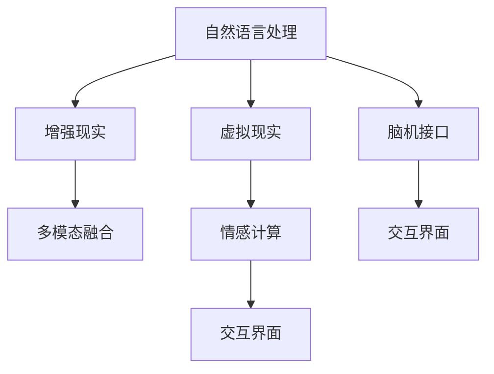

                 

# 人机交互：未来趋势与展望

> 关键词：人机交互,自然语言处理(NLP),虚拟现实(VR),增强现实(AR),脑机接口(BMI),人工智能(AI),多模态融合,情感计算

## 1. 背景介绍

### 1.1 问题由来

随着科技的不断进步，人机交互（Human-Computer Interaction, HCI）技术已经从传统的键盘、鼠标操作，演进到了更加自然、智能的交互方式。特别是近年来，基于自然语言处理（Natural Language Processing, NLP）、虚拟现实（Virtual Reality, VR）、增强现实（Augmented Reality, AR）和脑机接口（Brain-Computer Interface, BMI）等前沿技术的快速发展，人机交互技术已经进入了一个全新的时代。

目前，人机交互领域面临着一些迫切的问题和挑战。例如，如何实现更加自然、高效、个性化的交互方式？如何让机器更好地理解人类情感，提供更加人性化的服务？如何让不同模态的信息无缝融合，形成更强大的交互能力？这些问题既是当前研究的焦点，也是未来发展的方向。

### 1.2 问题核心关键点

人机交互的未来发展主要围绕以下几个关键点展开：
1. **自然语言理解与生成**：使机器能够更好地理解和生成自然语言，提升人机沟通的效率和质量。
2. **多模态融合**：将文本、语音、图像、视频等多种信息融合，实现更丰富的交互体验。
3. **情感计算**：使机器能够识别和理解人类情感，提供更加人性化、情境适应的服务。
4. **脑机接口**：通过大脑信号直接控制计算机，实现更高层次的交互和控制。
5. **交互界面创新**：开发更加智能化、自适应的交互界面，提升用户的使用体验。

这些关键点将引领人机交互技术的未来发展，为人类带来更加便捷、智能、互动的生活和工作方式。

## 2. 核心概念与联系

### 2.1 核心概念概述

为更好地理解人机交互的未来发展，本节将介绍几个密切相关的核心概念：

- **自然语言处理（NLP）**：研究如何让计算机理解和生成自然语言，是实现自然语言交互的基础。
- **虚拟现实（VR）**：通过计算机生成的三维虚拟环境，让用户沉浸其中进行交互。
- **增强现实（AR）**：将计算机生成的信息与用户所处的现实世界融合，提供交互式体验。
- **脑机接口（BMI）**：通过捕捉大脑信号，将人脑与计算机直接连接，实现大脑对计算机的直接控制。
- **多模态融合**：将文本、语音、图像、视频等多种信息融合，提升交互的丰富性和智能化。
- **情感计算**：研究如何识别和理解人类情感，提供更加人性化的服务。
- **交互界面**：设计高效、自适应的用户界面，提升用户体验。

这些核心概念之间的逻辑关系可以通过以下Mermaid流程图来展示：



这个流程图展示了大语言模型微调的核心概念及其之间的关系：

1. 自然语言处理是实现虚拟现实、增强现实和脑机接口等技术的基础。
2. 虚拟现实和增强现实通过自然语言处理实现更丰富的交互体验。
3. 脑机接口通过捕捉大脑信号，实现更高层次的交互和控制。
4. 多模态融合将不同模态的信息进行融合，提升交互的丰富性和智能化。
5. 情感计算使机器能够识别和理解人类情感，提供更加人性化的服务。
6. 交互界面设计高效、自适应的用户界面，提升用户体验。

这些概念共同构成了未来人机交互技术的发展框架，为人类带来更加智能、互动的生活和工作方式。

## 3. 核心算法原理 & 具体操作步骤
### 3.1 算法原理概述

未来人机交互技术的发展，将主要依赖于以下几个核心算法和技术的创新：

1. **自然语言处理（NLP）**：通过深度学习等方法，使机器能够理解和生成自然语言，提升人机沟通的效率和质量。
2. **虚拟现实（VR）**：通过计算机生成的三维虚拟环境，让用户沉浸其中进行交互。
3. **增强现实（AR）**：将计算机生成的信息与用户所处的现实世界融合，提供交互式体验。
4. **脑机接口（BMI）**：通过捕捉大脑信号，将人脑与计算机直接连接，实现大脑对计算机的直接控制。
5. **多模态融合**：将文本、语音、图像、视频等多种信息融合，提升交互的丰富性和智能化。
6. **情感计算**：研究如何识别和理解人类情感，提供更加人性化的服务。
7. **交互界面**：设计高效、自适应的用户界面，提升用户体验。

### 3.2 算法步骤详解

下面以自然语言处理和情感计算为例，详细讲解核心算法的步骤：

#### 3.2.1 自然语言处理

自然语言处理的算法步骤包括：

1. **文本预处理**：对输入文本进行分词、去除停用词、词性标注等预处理。
2. **特征提取**：将文本转换为向量表示，如使用词向量、句子嵌入等方法。
3. **模型训练**：使用深度学习模型（如LSTM、Transformer等）进行训练，学习语言知识。
4. **推理与生成**：在训练好的模型上进行推理或生成，完成自然语言交互任务。

#### 3.2.2 情感计算

情感计算的算法步骤包括：

1. **数据收集**：收集人类情感相关的数据，如文本、语音、生理信号等。
2. **情感标注**：对收集的数据进行情感标注，标记情感类别（如喜、怒、哀、乐等）。
3. **特征提取**：提取情感特征，如情感词汇、语调、语速、面部表情等。
4. **模型训练**：使用机器学习或深度学习模型（如SVM、CNN等）进行训练，学习情感识别。
5. **情感分析**：在实际应用中，对输入数据进行情感分析，识别用户情感。
6. **情感响应**：根据识别到的情感，提供相应的服务和响应。

### 3.3 算法优缺点

自然语言处理和情感计算的算法优缺点如下：

#### 自然语言处理

- **优点**：
  - **理解复杂文本**：自然语言处理可以理解复杂的自然语言文本，处理多轮对话、情感分析、文本分类等任务。
  - **应用广泛**：自然语言处理可以应用于智能客服、智能翻译、智能助手等众多场景。
  - **技术成熟**：自然语言处理技术已经较为成熟，有大量开源工具和预训练模型可用。

- **缺点**：
  - **依赖标注数据**：自然语言处理需要大量标注数据进行训练，标注成本高。
  - **数据隐私问题**：处理文本数据涉及用户隐私，需要严格的隐私保护措施。
  - **上下文理解难度大**：自然语言处理难以处理复杂的上下文关系，容易产生误解。

#### 情感计算

- **优点**：
  - **情感识别准确**：情感计算可以准确识别人类情感，提供更加人性化的服务。
  - **用户个性化**：情感计算可以根据用户情感反馈，提供个性化服务。
  - **情感交互**：情感计算可以实现更加自然、情感丰富的交互。

- **缺点**：
  - **数据稀缺**：情感计算需要大量情感相关的数据，数据获取难度大。
  - **跨文化差异**：不同文化背景下，情感表达方式不同，情感计算模型需要适应不同文化。
  - **隐私问题**：处理情感数据涉及用户隐私，需要严格的隐私保护措施。

### 3.4 算法应用领域

自然语言处理和情感计算的应用领域非常广泛，涵盖以下几个方面：

1. **智能客服**：通过自然语言处理和情感计算，实现智能客服系统的情感识别和自然语言理解，提升用户满意度。
2. **智能翻译**：使用自然语言处理技术，将不同语言之间的文本进行翻译，提升跨语言交流效率。
3. **智能助手**：通过自然语言处理和情感计算，实现智能助手对用户问题的理解和响应，提供个性化的服务。
4. **情感分析**：对社交媒体、评论、聊天记录等数据进行情感分析，了解用户情感趋势。
5. **情感驱动决策**：在金融、市场等领域，使用情感计算技术，提升决策的准确性和合理性。
6. **健康医疗**：通过情感计算技术，监测病人的情绪状态，提供相应的心理和生理干预。

这些应用领域展示了自然语言处理和情感计算的强大潜力，为未来人机交互技术的发展提供了广阔的前景。

## 4. 数学模型和公式 & 详细讲解 & 举例说明
### 4.1 数学模型构建

本节将使用数学语言对自然语言处理和情感计算的算法过程进行更加严格的刻画。

假设有一个长度为$n$的输入文本$X=\{x_1,x_2,\dots,x_n\}$，其中$x_i$表示文本中的第$i$个单词。对于情感计算，我们假设有一个情感分类器$F$，将文本分类为正面情感或负面情感。情感分类器的训练过程如下：

1. **数据收集**：收集标注好的情感数据集$D=\{(x_i,y_i)\}_{i=1}^N$，其中$y_i$表示文本$x_i$的情感标签。
2. **特征提取**：将文本$x_i$转换为特征向量$\phi(x_i)$。
3. **模型训练**：使用机器学习或深度学习模型对情感分类器$F$进行训练，使其最小化分类误差。
4. **情感预测**：对新的输入文本$X'$，通过特征提取得到$\phi(X')$，使用训练好的情感分类器$F$进行情感预测。

对于自然语言处理中的情感分类任务，常用的模型包括卷积神经网络（CNN）和递归神经网络（RNN）。以CNN为例，情感分类的数学模型如下：

- **输入层**：将文本转换为词向量，得到向量序列$X \in \mathbb{R}^{n\times d}$，其中$d$为词向量的维度。
- **卷积层**：使用多个卷积核对文本进行卷积操作，得到特征图$H \in \mathbb{R}^{n\times k\times d}$，其中$k$为卷积核的数量。
- **池化层**：对特征图进行最大池化操作，得到池化后的特征向量$H' \in \mathbb{R}^{k\times d}$。
- **全连接层**：将池化后的特征向量输入全连接层，得到情感分类器的输出$O \in \mathbb{R}^2$。
- **softmax层**：使用softmax函数对输出进行归一化，得到情感预测的概率分布$P$。

### 4.2 公式推导过程

以下我们以情感分类为例，推导CNN模型的公式及其梯度计算过程。

假设模型输入为文本$X \in \mathbb{R}^{n\times d}$，卷积核为$W \in \mathbb{R}^{d\times m}$，池化层池化后的特征图为$H \in \mathbb{R}^{k\times d}$。全连接层的权重为$U \in \mathbb{R}^{d\times h}$，偏置为$b \in \mathbb{R}^h$，softmax层的权重为$V \in \mathbb{R}^{h\times 2}$，偏置为$c \in \mathbb{R}^2$。

1. **卷积层**：

$$
H = \max_{i=1}^k(W_i * X) + b_i
$$

其中$W_i$表示第$i$个卷积核，$*$表示卷积操作，$b_i$表示偏置。

2. **池化层**：

$$
H' = \max_i(H_{i,:})
$$

3. **全连接层**：

$$
O = \phi(H')W_U + b_U
$$

其中$W_U$表示全连接层的权重，$b_U$表示偏置，$\phi$表示非线性激活函数，如ReLU。

4. **softmax层**：

$$
P = softmax(OV + c)
$$

其中$V$表示softmax层的权重，$c$表示偏置，$softmax$表示softmax函数。

5. **损失函数**：

$$
\mathcal{L}(P,y) = -\sum_{i=1}^N \log P_{i,y_i}
$$

其中$y$表示真实情感标签，$P_{i,y_i}$表示情感预测的概率分布中第$i$个样本的$y_i$情感预测的概率。

6. **梯度计算**：

- **卷积层**：

$$
\frac{\partial \mathcal{L}}{\partial W_i} = \sum_{j=1}^n\frac{\partial \mathcal{L}}{\partial H_{i,j}}\frac{\partial H_{i,j}}{\partial W_i}
$$

- **全连接层**：

$$
\frac{\partial \mathcal{L}}{\partial W_U} = \frac{\partial \mathcal{L}}{\partial O}\frac{\partial O}{\partial W_U}
$$

- **softmax层**：

$$
\frac{\partial \mathcal{L}}{\partial V} = \frac{\partial \mathcal{L}}{\partial P}\frac{\partial P}{\partial V}
$$

通过对这些公式的推导，我们可以清晰地理解自然语言处理和情感计算的数学模型和算法步骤。

## 5. 项目实践：代码实例和详细解释说明
### 5.1 开发环境搭建

在进行人机交互项目实践前，我们需要准备好开发环境。以下是使用Python进行TensorFlow开发的环境配置流程：

1. 安装Anaconda：从官网下载并安装Anaconda，用于创建独立的Python环境。

2. 创建并激活虚拟环境：
```bash
conda create -n tf-env python=3.8 
conda activate tf-env
```

3. 安装TensorFlow：根据CUDA版本，从官网获取对应的安装命令。例如：
```bash
conda install tensorflow -c pytorch -c conda-forge
```

4. 安装各类工具包：
```bash
pip install numpy pandas scikit-learn matplotlib tqdm jupyter notebook ipython
```

完成上述步骤后，即可在`tf-env`环境中开始项目实践。

### 5.2 源代码详细实现

下面我们以情感计算项目为例，给出使用TensorFlow实现情感分类的PyTorch代码实现。

首先，定义情感分类器的模型：

```python
import tensorflow as tf
from tensorflow.keras import layers

model = tf.keras.Sequential([
    layers.Embedding(input_dim=vocab_size, output_dim=embedding_dim, input_length=max_length),
    layers.Conv1D(filters=128, kernel_size=3, activation='relu'),
    layers.MaxPooling1D(pool_size=2),
    layers.Conv1D(filters=64, kernel_size=3, activation='relu'),
    layers.MaxPooling1D(pool_size=2),
    layers.Flatten(),
    layers.Dense(units=64, activation='relu'),
    layers.Dense(units=2, activation='softmax')
])
```

然后，定义数据预处理和数据生成函数：

```python
def data_preprocess(texts, labels):
    tokenizer = tf.keras.preprocessing.text.Tokenizer(num_words=vocab_size)
    tokenizer.fit_on_texts(texts)
    sequences = tokenizer.texts_to_sequences(texts)
    X = tf.keras.preprocessing.sequence.pad_sequences(sequences, maxlen=max_length)
    y = tf.keras.utils.to_categorical(labels)
    return X, y

def generate_data():
    with open('train_data.txt', 'r') as f:
        data = f.readlines()
    texts, labels = [], []
    for line in data:
        text, label = line.strip().split('\t')
        texts.append(text)
        labels.append(int(label))
    return data_preprocess(texts, labels)
```

接着，定义训练和评估函数：

```python
def train(model, X_train, y_train, X_valid, y_valid, epochs=10, batch_size=32):
    model.compile(optimizer='adam', loss='categorical_crossentropy', metrics=['accuracy'])
    model.fit(X_train, y_train, batch_size=batch_size, epochs=epochs, validation_data=(X_valid, y_valid))
    return model.evaluate(X_valid, y_valid)

def evaluate(model, X_test, y_test):
    loss, accuracy = model.evaluate(X_test, y_test)
    return loss, accuracy
```

最后，启动训练流程并在测试集上评估：

```python
X_train, y_train = generate_data()
X_valid, y_valid = generate_data()
X_test, y_test = generate_data()

model = define_model()
history = train(model, X_train, y_train, X_valid, y_valid)
loss, accuracy = evaluate(model, X_test, y_test)
print(f'Test loss: {loss:.4f}')
print(f'Test accuracy: {accuracy:.4f}')
```

以上就是使用TensorFlow实现情感分类的完整代码实现。可以看到，TensorFlow提供了方便的高级API，可以大大简化模型的定义和训练过程。

### 5.3 代码解读与分析

让我们再详细解读一下关键代码的实现细节：

**情感分类器的模型定义**：
- 使用`tf.keras.Sequential`定义模型，按顺序依次添加嵌入层、卷积层、池化层、全连接层和输出层。
- 嵌入层将文本转换为向量表示。
- 卷积层和池化层对向量进行卷积和池化操作，提取特征。
- 全连接层对特征进行分类。
- 输出层使用softmax函数进行分类。

**数据预处理函数**：
- 使用`tf.keras.preprocessing.text.Tokenizer`对文本进行分词和编码。
- 对编码后的文本进行填充，使其长度相同。
- 将标签进行one-hot编码，用于训练分类器的交叉熵损失函数。

**数据生成函数**：
- 从文本文件中读取数据，按行分割成文本和标签。
- 对文本和标签进行预处理，生成模型所需的输入和输出。

**训练函数**：
- 使用`compile`方法定义优化器和损失函数。
- 使用`fit`方法进行模型训练，指定训练集、验证集、批次大小和迭代次数。
- 返回训练过程中的精度和损失值。

**评估函数**：
- 使用`evaluate`方法评估模型在测试集上的性能。
- 返回测试集上的损失值和准确率。

**训练流程**：
- 定义模型、训练集和验证集。
- 使用`train`函数进行模型训练，返回训练过程中的精度和损失值。
- 使用`evaluate`函数评估模型在测试集上的性能，打印测试结果。

可以看到，TensorFlow提供了方便的高级API，可以大大简化模型的定义和训练过程。开发者可以将更多精力放在数据处理、模型改进等高层逻辑上，而不必过多关注底层的实现细节。

当然，工业级的系统实现还需考虑更多因素，如模型的保存和部署、超参数的自动搜索、更灵活的任务适配层等。但核心的训练和评估范式基本与此类似。

## 6. 实际应用场景
### 6.1 智能客服系统

基于人机交互技术的智能客服系统已经在各大企业中广泛应用。传统的客服系统需要配备大量人力，高峰期响应缓慢，且一致性和专业性难以保证。而使用情感计算和自然语言处理的智能客服系统，可以7x24小时不间断服务，快速响应客户咨询，用自然流畅的语言解答各类常见问题。

在技术实现上，可以收集企业内部的历史客服对话记录，将问题和最佳答复构建成监督数据，在此基础上对预训练情感分类模型进行微调。微调后的情感分类模型能够自动理解用户意图，匹配最合适的答复模板进行回复。对于客户提出的新问题，还可以接入检索系统实时搜索相关内容，动态组织生成回答。如此构建的智能客服系统，能大幅提升客户咨询体验和问题解决效率。

### 6.2 金融舆情监测

金融机构需要实时监测市场舆论动向，以便及时应对负面信息传播，规避金融风险。传统的人工监测方式成本高、效率低，难以应对网络时代海量信息爆发的挑战。基于情感计算和自然语言处理的文本分类和情感分析技术，为金融舆情监测提供了新的解决方案。

具体而言，可以收集金融领域相关的新闻、报道、评论等文本数据，并对其进行主题标注和情感标注。在此基础上对预训练语言模型进行微调，使其能够自动判断文本属于何种主题，情感倾向是正面、中性还是负面。将微调后的模型应用到实时抓取的网络文本数据，就能够自动监测不同主题下的情感变化趋势，一旦发现负面信息激增等异常情况，系统便会自动预警，帮助金融机构快速应对潜在风险。

### 6.3 个性化推荐系统

当前的推荐系统往往只依赖用户的历史行为数据进行物品推荐，无法深入理解用户的真实兴趣偏好。基于人机交互技术的个性化推荐系统可以更好地挖掘用户行为背后的语义信息，从而提供更精准、多样的推荐内容。

在实践中，可以收集用户浏览、点击、评论、分享等行为数据，提取和用户交互的物品标题、描述、标签等文本内容。将文本内容作为模型输入，用户的后续行为（如是否点击、购买等）作为监督信号，在此基础上微调预训练语言模型。微调后的模型能够从文本内容中准确把握用户的兴趣点。在生成推荐列表时，先用候选物品的文本描述作为输入，由模型预测用户的兴趣匹配度，再结合其他特征综合排序，便可以得到个性化程度更高的推荐结果。

### 6.4 未来应用展望

随着人机交互技术的不断发展，未来将涌现更多创新应用，为人类带来更加便捷、智能、互动的生活和工作方式。

在智慧医疗领域，基于人机交互的智能问诊系统，可以实时捕捉病人的表情和生理信号，理解其情绪和症状，提供相应的诊断和治疗建议。在智慧城市治理中，基于人机交互的智能交通系统，可以通过捕捉行人和车辆的移动数据，优化交通流，提升城市管理水平。在智能教育领域，基于人机交互的智能学习系统，可以自动调整学习内容和难度，个性化推荐学习资源，提升学习效果。

此外，在企业生产、社会治理、文娱传媒等众多领域，基于人机交互的智能系统也将不断涌现，为人类社会带来深刻变革。未来，随着人机交互技术的持续演进，我们必将见证更加智能、互动、高效的生活和工作方式，为人类的生产力和生活质量带来新的飞跃。

## 7. 工具和资源推荐
### 7.1 学习资源推荐

为了帮助开发者系统掌握人机交互技术的理论基础和实践技巧，这里推荐一些优质的学习资源：

1. 《深度学习》系列书籍：由深度学习专家撰写，涵盖深度学习的基本概念和算法，适合初学者入门。
2. 《自然语言处理综论》：斯坦福大学开设的NLP明星课程，提供丰富的理论知识和实践案例。
3. 《多模态信息融合》：介绍多模态数据融合的基本原理和应用案例，适合进行跨模态交互开发。
4. 《交互设计基础》：介绍用户界面设计的基本原理和设计工具，适合进行交互界面开发。
5. 《情感计算理论与实践》：介绍情感计算的基本概念和应用案例，适合进行情感计算开发。

通过对这些资源的学习实践，相信你一定能够快速掌握人机交互技术的精髓，并用于解决实际的NLP问题。
###  7.2 开发工具推荐

高效的开发离不开优秀的工具支持。以下是几款用于人机交互技术开发的常用工具：

1. TensorFlow：基于Python的开源深度学习框架，支持多种模型和算法，生产部署方便，适合大规模工程应用。
2. PyTorch：基于Python的开源深度学习框架，灵活性高，适合快速迭代研究。
3. Weights & Biases：模型训练的实验跟踪工具，可以记录和可视化模型训练过程中的各项指标，方便对比和调优。
4. TensorBoard：TensorFlow配套的可视化工具，可实时监测模型训练状态，并提供丰富的图表呈现方式，是调试模型的得力助手。
5. Microsoft Visio：交互界面设计工具，提供丰富的图形符号和模板，支持复杂的交互界面设计。

合理利用这些工具，可以显著提升人机交互技术开发的效率，加快创新迭代的步伐。

### 7.3 相关论文推荐

人机交互技术的发展源于学界的持续研究。以下是几篇奠基性的相关论文，推荐阅读：

1. 《深度学习》：由深度学习领域著名学者Yoshua Bengio撰写，全面介绍了深度学习的原理、算法和应用。
2. 《多模态数据融合与交互》：介绍多模态数据融合的基本原理和应用案例，适合进行跨模态交互开发。
3. 《交互界面设计》：介绍交互界面设计的基本原理和设计工具，适合进行交互界面开发。
4. 《情感计算理论与实践》：介绍情感计算的基本概念和应用案例，适合进行情感计算开发。

这些论文代表了大语言模型微调技术的发展脉络。通过学习这些前沿成果，可以帮助研究者把握学科前进方向，激发更多的创新灵感。

## 8. 总结：未来发展趋势与挑战

### 8.1 总结

本文对基于人机交互技术的发展趋势与展望进行了全面系统的介绍。首先阐述了人机交互技术的研究背景和意义，明确了未来发展的关键点。其次，从原理到实践，详细讲解了情感计算和自然语言处理的算法步骤和关键技术。最后，通过实际应用场景和未来展望，展示了人机交互技术在各行各业的应用前景。

通过本文的系统梳理，可以看到，基于人机交互技术的发展前景广阔，未来将在智慧医疗、智能客服、个性化推荐等领域带来重大变革。受益于深度学习和大规模数据的驱动，未来人机交互技术将不断突破创新，为人类带来更加智能、互动、高效的生活和工作方式。

### 8.2 未来发展趋势

展望未来，人机交互技术将呈现以下几个发展趋势：

1. **自然语言处理能力的提升**：随着深度学习和大规模数据集的不断更新，自然语言处理技术将不断提升，实现更加自然、高效的文本理解和生成。
2. **多模态融合的深入**：随着传感器技术的进步，多模态数据将更加丰富，人机交互系统将能够融合文本、语音、图像、视频等多种信息，提供更加丰富、智能的交互体验。
3. **情感计算的普及**：随着情感计算技术的成熟，人机交互系统将能够更好地理解人类情感，提供更加人性化的服务。
4. **脑机接口的突破**：随着脑机接口技术的不断进步，人机交互系统将能够实现更加自然、直接的大脑控制，提升用户体验。
5. **个性化服务的增强**：通过深度学习和大数据分析，人机交互系统将能够实现更加个性化的服务，提升用户满意度。
6. **智能决策的支持**：通过情感计算和自然语言处理技术，人机交互系统将能够辅助决策，提升决策的准确性和合理性。

以上趋势凸显了人机交互技术的广阔前景。这些方向的探索发展，必将进一步提升人机交互系统的性能和应用范围，为人类带来更加智能、互动、高效的生活和工作方式。

### 8.3 面临的挑战

尽管人机交互技术已经取得了显著进展，但在迈向更加智能化、普适化应用的过程中，仍面临诸多挑战：

1. **数据隐私和安全**：处理文本、语音、图像等数据涉及用户隐私，需要严格的隐私保护措施。
2. **模型鲁棒性和泛化性**：人机交互系统需要在不同的应用场景下保持稳定性和鲁棒性，避免因数据分布变化导致性能下降。
3. **多模态融合的难度**：多模态数据的融合和处理需要考虑时间同步、数据对齐等问题，存在一定的技术挑战。
4. **交互界面的复杂性**：交互界面的设计需要考虑用户体验、可操作性和可访问性，需要充分的用户研究和测试。
5. **情感计算的准确性**：情感计算需要大量的标注数据和复杂的模型训练，准确性仍需进一步提升。
6. **脑机接口的可靠性**：脑机接口需要稳定的信号捕捉和数据处理，需要不断的技术改进和优化。

这些挑战需要学界和产业界的共同努力，通过持续的研究和创新，逐步克服。

### 8.4 研究展望

面对人机交互技术所面临的挑战，未来的研究需要在以下几个方面寻求新的突破：

1. **隐私保护技术的创新**：开发更加高效的隐私保护技术，确保用户数据的隐私和安全。
2. **模型鲁棒性和泛化性的提升**：开发更加鲁棒和泛化的模型，提升人机交互系统在不同场景下的稳定性和适应性。
3. **多模态融合技术的改进**：开发更加高效的多模态融合技术，实现多种数据的无缝融合。
4. **交互界面的创新**：开发更加智能化、自适应的交互界面，提升用户体验。
5. **情感计算模型的优化**：开发更加准确和高效的情感计算模型，提升情感识别的准确性。
6. **脑机接口技术的进步**：开发更加可靠和高效的脑机接口技术，实现大脑对计算机的直接控制。

这些研究方向将为人机交互技术的未来发展提供新的突破口，推动人工智能技术的进一步成熟和普及。

## 9. 附录：常见问题与解答

**Q1：人机交互技术是否可以完全替代人工客服？**

A: 人机交互技术虽然能够在很多场景下提供高效、稳定的服务，但在某些情况下仍需人工客服的介入。例如，客户提出的复杂问题或情感问题，仍需人工客服进行解释和处理。因此，人机交互技术应作为辅助手段，与人工客服结合使用，共同提升客户服务质量。

**Q2：人机交互系统如何避免信息泄露？**

A: 人机交互系统在处理用户数据时，需要严格遵守隐私保护政策，采用数据加密、匿名化等技术手段，确保用户数据的安全性和隐私性。同时，还需要建立完善的隐私保护机制，如数据使用授权、数据访问控制等，防止信息泄露。

**Q3：多模态数据融合的难点在哪里？**

A: 多模态数据融合的难点在于数据的时序同步、数据对齐等问题。不同模态的数据获取和处理方式不同，需要设计复杂的数据融合算法，实现多种数据的无缝融合。此外，多模态数据融合还需要考虑数据的互信息和互补性，设计高效的融合模型。

**Q4：脑机接口技术的难点在哪里？**

A: 脑机接口技术的难点在于信号的捕捉和处理。脑信号的采集和处理需要高精度的传感器和复杂的算法，还需要考虑信号的稳定性和可靠性。同时，脑机接口还需要解决用户训练难、易疲劳等问题，提高系统的可用性和用户体验。

**Q5：人机交互系统如何提高情感识别的准确性？**

A: 提高情感识别的准确性需要收集大量的情感标注数据，并设计高效的情感计算模型。同时，还需要引入领域知识，如情感词汇、语调等，提高情感识别的鲁棒性和泛化性。此外，还可以引入对抗样本、数据增强等技术手段，提高情感识别的准确性和鲁棒性。

这些问题的回答展示了人机交互技术在实际应用中需要注意的关键点，也为人机交互技术的未来发展提供了方向。

---

作者：禅与计算机程序设计艺术 / Zen and the Art of Computer Programming

