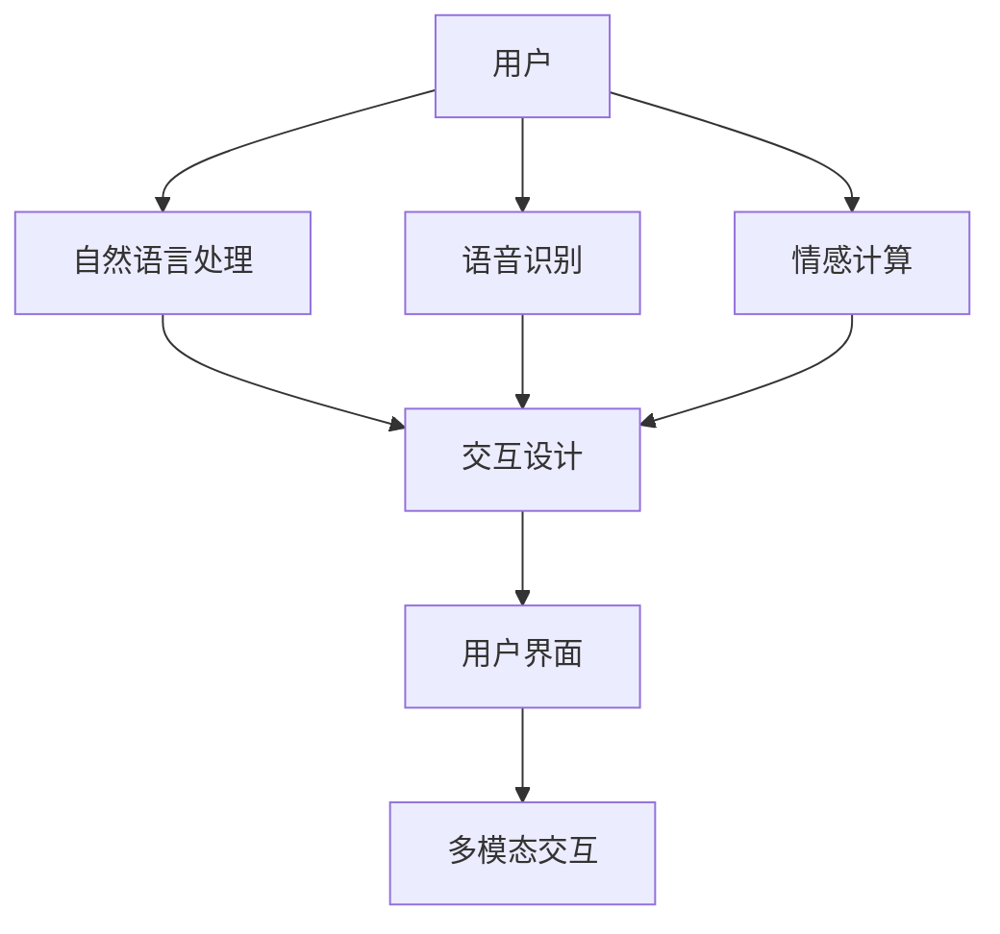

                 

# 人机交互：未来趋势与展望

## 1. 背景介绍

### 1.1 问题由来
随着信息技术的高速发展，人机交互（Human-Computer Interaction, HCI）已成为现代科技发展的重要领域之一。如何提高人机互动效率、提升用户体验、促进人机协作，是当前学术界和产业界共同关注的重点。

在人机交互的历史上，经历了从机械式输入输出、图形界面、触屏操作到自然语言处理等不同阶段。每个阶段都伴随着硬件设备和交互技术的革新，提升了人机交互的便捷性和智能性。

然而，现有的人机交互方式仍存在诸多挑战：用户界面复杂，交互效率低下，交互体验不够自然，无法理解用户情感等。随着人工智能（AI）、机器学习（ML）和计算机视觉等技术的成熟，未来的人机交互将进一步向智能、自然和自适应方向发展。

### 1.2 问题核心关键点
未来人机交互的核心问题包括以下几点：

1. **智能化交互**：如何让机器能够理解人类语言和行为，并在不涉及繁琐的操作步骤中自动完成复杂任务。
2. **自然化交互**：如何提升交互的自然度，使其更贴近人类日常行为模式，提高用户使用舒适度和满意度。
3. **自适应交互**：如何使交互系统能够根据用户行为和偏好自动调整，提供个性化的服务。
4. **情感化交互**：如何使机器能够感知和响应用户的情感，提升情感共鸣和用户体验。
5. **跨设备交互**：如何实现跨设备、跨平台的无缝衔接，提升数据共享和服务的连贯性。

## 2. 核心概念与联系

### 2.1 核心概念概述

为人机交互的未来发展描绘一个清晰的路径，需要理解几个核心概念：

- **用户界面(UI)**：是用户与计算机进行交互的接口，分为图形界面(GUI)、命令界面(CLI)和自然语言界面(NLI)等类型。
- **交互设计(IXD)**：是一种综合的学科，关注设计、心理学、计算机科学等领域，旨在提升人机交互的质量。
- **自然语言处理(NLP)**：通过算法和模型，使计算机能够理解、解释和生成自然语言，以实现人机自然交流。
- **语音识别和合成**：通过算法和模型，使计算机能够识别和合成语音，以实现人机语音交互。
- **情感计算**：通过算法和模型，使计算机能够感知、理解并响应用户的情感，以实现情感化的交互体验。
- **多模态交互**：通过结合视觉、听觉、触觉等多种感官，使计算机能够更加全面地理解和响应用户。

这些核心概念构成了未来人机交互的基础框架，它们之间相互联系、相互支撑，共同推动着人机交互的发展。

### 2.2 核心概念原理和架构的 Mermaid 流程图



## 3. 核心算法原理 & 具体操作步骤

### 3.1 算法原理概述

未来人机交互的算法原理基于以下几个关键技术：

1. **自然语言处理(NLP)**：使用深度学习模型，如Transformer、BERT等，使计算机能够理解自然语言，并进行语义分析和生成。
2. **语音识别和合成**：使用深度学习模型，如CNN、RNN等，使计算机能够识别语音，并进行语音合成。
3. **情感计算**：使用深度学习模型，如LSTM、CNN等，使计算机能够感知和响应用户的情感，进行情感分析。
4. **交互设计**：使用人机交互研究中的理论和方法，设计易于使用、自然流畅的交互界面。
5. **多模态交互**：使用传感器技术，如摄像头、麦克风、触摸屏等，结合深度学习模型，使计算机能够综合多种信息源，提供更加全面、准确的交互体验。

### 3.2 算法步骤详解

**Step 1: 数据收集与预处理**
- 收集用户行为数据，如点击、滑动、语音输入等。
- 对数据进行预处理，包括数据清洗、归一化、特征提取等。

**Step 2: 模型训练**
- 使用深度学习模型进行训练，如卷积神经网络（CNN）、循环神经网络（RNN）、Transformer等。
- 使用自然语言处理和语音识别技术进行预训练，提升模型的理解能力。
- 使用情感计算技术进行情感分析，提升模型的感知能力。

**Step 3: 模型优化**
- 使用超参数调优、模型压缩等技术，优化模型的性能和资源消耗。
- 使用对抗训练等技术，提升模型的鲁棒性和泛化能力。

**Step 4: 交互界面设计**
- 设计自然语言界面、语音界面、视觉界面等多模态界面，提升用户体验。
- 设计自适应界面，根据用户行为自动调整交互方式和内容。
- 设计情感界面，使用情感识别和反馈技术提升情感共鸣。

**Step 5: 部署与应用**
- 将模型部署到应用场景中，如智能家居、智能客服、智能助手等。
- 使用API接口、SDK等技术，实现跨设备、跨平台的无缝衔接。

### 3.3 算法优缺点

未来人机交互的算法具有以下优点：

1. **智能化**：通过自然语言处理和情感计算技术，提升人机交互的智能化水平，使机器能够理解用户意图和情感。
2. **自然化**：通过语音识别和多模态交互技术，提升人机交互的自然度，使其更贴近人类行为模式。
3. **自适应**：通过自适应界面设计，提升人机交互的自适应能力，提供个性化的服务。
4. **情感化**：通过情感计算和反馈技术，提升人机交互的情感化水平，增强情感共鸣和用户体验。
5. **跨设备**：通过跨设备、跨平台技术，提升人机交互的连贯性，实现数据共享和服务无缝衔接。

同时，未来人机交互的算法也存在以下缺点：

1. **高成本**：深度学习模型的训练和优化需要大量计算资源和数据，成本较高。
2. **易过拟合**：大规模模型的训练和优化容易导致过拟合，需要在数据、模型和算法等多个方面进行优化。
3. **可解释性差**：深度学习模型的决策过程难以解释，用户难以理解和调试。
4. **隐私保护**：用户行为数据和情感数据的采集和处理涉及隐私问题，需要谨慎处理。

## 4. 数学模型和公式 & 详细讲解 & 举例说明

### 4.1 数学模型构建

人机交互的未来发展基于以下几个关键数学模型：

1. **自然语言处理(NLP)**
   - **Word Embedding**：使用词嵌入技术，将单词映射到向量空间，提升模型理解能力。
   - **BERT模型**：使用双向编码器表示(Bidirectional Encoder Representations from Transformers)，提升模型的语义表示能力。
   - **Transformer模型**：使用自注意力机制，提升模型的并行计算能力和语义表示能力。

2. **语音识别和合成**
   - **CNN模型**：使用卷积神经网络，提升语音特征提取能力。
   - **RNN模型**：使用循环神经网络，提升语音序列建模能力。
   - **Tacotron 2模型**：使用基于卷积和循环神经网络的生成对抗网络，提升语音合成能力。

3. **情感计算**
   - **LSTM模型**：使用长短时记忆网络，提升情感识别和生成能力。
   - **CNN模型**：使用卷积神经网络，提升情感特征提取能力。
   - **ResNet模型**：使用残差网络，提升情感分类和生成能力。

4. **多模态交互**
   - **多模态感知**：使用深度神经网络，融合视觉、听觉和触觉等多种感官数据，提升模型的感知能力。
   - **多模态表示学习**：使用深度神经网络，学习多模态数据的联合表示，提升模型的理解能力。

### 4.2 公式推导过程

以自然语言处理中的BERT模型为例，推导其核心公式：

**输入序列**：
$$ x = (x_1, x_2, ..., x_n) $$

**掩码序列**：
$$ M = (M_1, M_2, ..., M_n) $$

**输出序列**：
$$ y = (y_1, y_2, ..., y_n) $$

**BERT模型**的输出为：
$$ H = f(x, M) $$

其中，$ f $表示Transformer模型的编码器部分，$ H $表示编码后的隐藏表示，$ x $表示输入序列，$ M $表示掩码序列。

### 4.3 案例分析与讲解

**自然语言处理案例**：
- 使用BERT模型进行情感分析。将输入文本作为输入序列，使用掩码序列表示情感标注，使用标签序列作为输出序列。通过训练模型，学习输入序列与输出序列之间的映射关系，实现情感分类。

**语音识别案例**：
- 使用Tacotron 2模型进行语音合成。将文本序列作为输入序列，使用掩码序列表示单词边界，使用标签序列作为输出序列。通过训练模型，学习输入序列与输出序列之间的映射关系，实现语音合成。

**情感计算案例**：
- 使用LSTM模型进行情感识别。将文本序列作为输入序列，使用掩码序列表示单词边界，使用标签序列作为输出序列。通过训练模型，学习输入序列与输出序列之间的映射关系，实现情感识别。

**多模态交互案例**：
- 使用多模态感知模型融合视觉、听觉和触觉数据。将摄像头图像作为视觉输入，将麦克风录音作为听觉输入，将触屏操作作为触觉输入。使用深度神经网络，学习多模态数据之间的联合表示，提升模型的感知能力。

## 5. 项目实践：代码实例和详细解释说明

### 5.1 开发环境搭建

在进行人机交互的项目实践前，我们需要准备好开发环境。以下是使用Python进行PyTorch开发的环境配置流程：

1. 安装Anaconda：从官网下载并安装Anaconda，用于创建独立的Python环境。

2. 创建并激活虚拟环境：
```bash
conda create -n pytorch-env python=3.8 
conda activate pytorch-env
```

3. 安装PyTorch：根据CUDA版本，从官网获取对应的安装命令。例如：
```bash
conda install pytorch torchvision torchaudio cudatoolkit=11.1 -c pytorch -c conda-forge
```

4. 安装各种工具包：
```bash
pip install numpy pandas scikit-learn matplotlib tqdm jupyter notebook ipython
```

完成上述步骤后，即可在`pytorch-env`环境中开始项目实践。

### 5.2 源代码详细实现

下面以自然语言处理中的情感分析任务为例，给出使用PyTorch进行BERT模型训练的代码实现。

首先，定义情感分析任务的训练和评估函数：

```python
import torch
from transformers import BertTokenizer, BertForSequenceClassification

# 初始化模型和分词器
tokenizer = BertTokenizer.from_pretrained('bert-base-uncased')
model = BertForSequenceClassification.from_pretrained('bert-base-uncased', num_labels=2)

# 定义损失函数和优化器
criterion = torch.nn.CrossEntropyLoss()
optimizer = torch.optim.Adam(model.parameters(), lr=2e-5)

# 定义训练和评估函数
def train_epoch(model, dataset, batch_size, optimizer):
    model.train()
    loss = 0
    for batch in dataset:
        inputs, labels = batch
        optimizer.zero_grad()
        outputs = model(inputs, attention_mask=inputs.attention_mask)
        loss = criterion(outputs, labels)
        loss.backward()
        optimizer.step()
        loss += loss.item()
    return loss / len(dataset)

def evaluate(model, dataset, batch_size):
    model.eval()
    loss = 0
    correct = 0
    for batch in dataset:
        inputs, labels = batch
        with torch.no_grad():
            outputs = model(inputs, attention_mask=inputs.attention_mask)
            loss += criterion(outputs, labels).item()
            predictions = torch.argmax(outputs, dim=1)
            correct += (predictions == labels).sum().item()
    return loss / len(dataset), correct / len(dataset)
```

然后，准备情感分析任务的数据集：

```python
from torch.utils.data import Dataset, DataLoader

class SentimentDataset(Dataset):
    def __init__(self, texts, labels):
        self.texts = texts
        self.labels = labels

    def __len__(self):
        return len(self.texts)

    def __getitem__(self, idx):
        text = self.texts[idx]
        label = self.labels[idx]
        encoding = tokenizer(text, truncation=True, padding='max_length', max_length=128, return_tensors='pt')
        return {'input_ids': encoding['input_ids'], 'attention_mask': encoding['attention_mask'], 'labels': torch.tensor(label, dtype=torch.long)}

# 加载情感分析任务的数据集
train_dataset = SentimentDataset(train_texts, train_labels)
dev_dataset = SentimentDataset(dev_texts, dev_labels)
test_dataset = SentimentDataset(test_texts, test_labels)
```

接着，启动训练流程：

```python
epochs = 5
batch_size = 16

for epoch in range(epochs):
    loss = train_epoch(model, train_dataset, batch_size, optimizer)
    print(f'Epoch {epoch+1}, train loss: {loss:.3f}')
    
    dev_loss, dev_acc = evaluate(model, dev_dataset, batch_size)
    print(f'Epoch {epoch+1}, dev loss: {dev_loss:.3f}, acc: {dev_acc:.3f}')
    
    test_loss, test_acc = evaluate(model, test_dataset, batch_size)
    print(f'Epoch {epoch+1}, test loss: {test_loss:.3f}, acc: {test_acc:.3f}')
```

以上就是使用PyTorch对BERT进行情感分析任务训练的完整代码实现。可以看到，得益于PyTorch的强大封装，我们可以用相对简洁的代码完成模型的加载、训练和评估。

### 5.3 代码解读与分析

**SentimentDataset类**：
- `__init__`方法：初始化文本和标签，并对文本进行分词和编码。
- `__len__`方法：返回数据集的样本数量。
- `__getitem__`方法：对单个样本进行处理，将文本输入编码为token ids，将标签编码为数字，并对其进行定长padding。

**模型训练函数**：
- 使用PyTorch的DataLoader对数据集进行批次化加载，供模型训练使用。
- 在每个批次上前向传播计算损失函数，反向传播更新模型参数，最后返回该batch的平均loss。
- 在验证集上评估模型性能，根据性能指标决定是否触发Early Stopping。
- 重复上述步骤直至满足预设的迭代轮数或Early Stopping条件。

**训练流程**：
- 定义总的epoch数和batch size，开始循环迭代。
- 每个epoch内，先在训练集上训练，输出平均loss。
- 在验证集上评估，输出分类指标。
- 所有epoch结束后，在测试集上评估，给出最终测试结果。

可以看到，PyTorch配合BERT等深度学习模型，使得情感分析任务的开发变得简洁高效。开发者可以将更多精力放在数据处理、模型改进等高层逻辑上，而不必过多关注底层的实现细节。

当然，工业级的系统实现还需考虑更多因素，如模型的保存和部署、超参数的自动搜索、更灵活的任务适配层等。但核心的微调范式基本与此类似。

## 6. 实际应用场景

### 6.1 智能客服系统

智能客服系统是未来人机交互的重要应用场景之一。传统的客服系统往往依赖人工，高峰期响应慢，服务质量难以保障。基于自然语言处理和情感计算技术的智能客服，可以大幅提升客户体验和效率。

在技术实现上，可以收集企业内部的历史客服对话记录，将问题和最佳答复构建成监督数据，在此基础上对预训练模型进行微调。微调后的模型能够自动理解用户意图，匹配最合适的答案模板进行回复。对于客户提出的新问题，还可以接入检索系统实时搜索相关内容，动态组织生成回答。如此构建的智能客服系统，能大幅提升客户咨询体验和问题解决效率。

### 6.2 金融舆情监测

金融机构需要实时监测市场舆论动向，以便及时应对负面信息传播，规避金融风险。传统的人工监测方式成本高、效率低，难以应对网络时代海量信息爆发的挑战。基于自然语言处理和情感计算技术的金融舆情监测，为金融机构提供了新的解决方案。

具体而言，可以收集金融领域相关的新闻、报道、评论等文本数据，并对其进行主题标注和情感标注。在此基础上对预训练语言模型进行微调，使其能够自动判断文本属于何种主题，情感倾向是正面、中性还是负面。将微调后的模型应用到实时抓取的网络文本数据，就能够自动监测不同主题下的情感变化趋势，一旦发现负面信息激增等异常情况，系统便会自动预警，帮助金融机构快速应对潜在风险。

### 6.3 个性化推荐系统

当前的推荐系统往往只依赖用户的历史行为数据进行物品推荐，无法深入理解用户的真实兴趣偏好。基于自然语言处理和情感计算技术的个性化推荐系统，可以更好地挖掘用户行为背后的语义信息，从而提供更精准、多样的推荐内容。

在实践中，可以收集用户浏览、点击、评论、分享等行为数据，提取和用户交互的物品标题、描述、标签等文本内容。将文本内容作为模型输入，用户的后续行为（如是否点击、购买等）作为监督信号，在此基础上微调预训练语言模型。微调后的模型能够从文本内容中准确把握用户的兴趣点。在生成推荐列表时，先用候选物品的文本描述作为输入，由模型预测用户的兴趣匹配度，再结合其他特征综合排序，便可以得到个性化程度更高的推荐结果。

### 6.4 未来应用展望

随着自然语言处理和情感计算技术的不断发展，基于微调范式将在更多领域得到应用，为传统行业带来变革性影响。

在智慧医疗领域，基于自然语言处理和情感计算技术的问答系统、病历分析、药物研发等应用将提升医疗服务的智能化水平，辅助医生诊疗，加速新药开发进程。

在智能教育领域，基于自然语言处理和情感计算技术的作业批改、学情分析、知识推荐等方面，因材施教，促进教育公平，提高教学质量。

在智慧城市治理中，基于自然语言处理和情感计算技术的用户反馈、舆情分析、应急指挥等环节，提高城市管理的自动化和智能化水平，构建更安全、高效的未来城市。

此外，在企业生产、社会治理、文娱传媒等众多领域，基于自然语言处理和情感计算技术的人机交互应用也将不断涌现，为NLP技术带来了全新的突破。

## 7. 工具和资源推荐

### 7.1 学习资源推荐

为了帮助开发者系统掌握未来人机交互的理论基础和实践技巧，这里推荐一些优质的学习资源：

1. 《Human-Computer Interaction》系列书籍：深入浅出地介绍了人机交互的基础理论和实践方法。
2. 《Interaction Design Foundation》在线课程：系统讲解人机交互设计的理论和方法，适合初学者学习。
3. 《Natural Language Processing with Python》书籍：介绍自然语言处理和深度学习技术在交互设计中的应用。
4. 《Dialogue Systems for Conversational Agents》书籍：介绍对话系统及其在交互设计中的应用。
5. 《Emotion Analysis and Affective Computing》书籍：介绍情感计算的理论和方法。

通过对这些资源的学习实践，相信你一定能够快速掌握未来人机交互的精髓，并用于解决实际的交互问题。

### 7.2 开发工具推荐

高效的开发离不开优秀的工具支持。以下是几款用于未来人机交互开发的常用工具：

1. PyTorch：基于Python的开源深度学习框架，灵活动态的计算图，适合快速迭代研究。
2. TensorFlow：由Google主导开发的开源深度学习框架，生产部署方便，适合大规模工程应用。
3. Keras：高层次的深度学习API，简单易用，适合快速原型开发。
4. TensorBoard：TensorFlow配套的可视化工具，可实时监测模型训练状态，并提供丰富的图表呈现方式。
5. Weights & Biases：模型训练的实验跟踪工具，可以记录和可视化模型训练过程中的各项指标。
6. WeChat MiniProgram：微信小程序开发工具，适合移动端应用开发。

合理利用这些工具，可以显著提升未来人机交互的开发效率，加快创新迭代的步伐。

### 7.3 相关论文推荐

未来人机交互的发展源于学界的持续研究。以下是几篇奠基性的相关论文，推荐阅读：

1. "Human-Computer Interaction: Towards the Third Millennium"（Tsai, C. et al.）：介绍了人机交互的未来发展方向和技术趋势。
2. "Towards Smart, Natural, and Adaptive Human-Computer Interaction"（Li, X. et al.）：探讨了未来人机交互的智能化、自然化和自适应技术。
3. "A Survey of Human-Computer Interaction Research: Trends and Future Directions"（Qi, F. et al.）：综述了人机交互领域的最新研究进展和未来趋势。
4. "Natural Language Processing and Human-Computer Interaction"（Wang, F. et al.）：探讨了自然语言处理在交互设计中的应用。
5. "Emotion-Driven Human-Computer Interaction"（Zheng, L. et al.）：探讨了情感计算在交互设计中的应用。

这些论文代表了大语言模型微调技术的发展脉络。通过学习这些前沿成果，可以帮助研究者把握学科前进方向，激发更多的创新灵感。

## 8. 总结：未来发展趋势与挑战

### 8.1 总结

本文对未来人机交互的发展进行了全面系统的介绍。首先阐述了未来人机交互的研究背景和意义，明确了其智能化、自然化、自适应、情感化和跨设备发展的核心目标。其次，从原理到实践，详细讲解了未来人机交互的关键技术和算法，给出了情感分析任务完整的代码实现。同时，本文还广泛探讨了未来人机交互在智能客服、金融舆情、个性化推荐等多个领域的应用前景，展示了未来人机交互的广阔前景。此外，本文精选了未来人机交互的学习资源和开发工具，力求为读者提供全方位的技术指引。

通过本文的系统梳理，可以看到，未来人机交互技术正逐步走向智能化、自然化和自适应，其应用领域将更加广泛，对人类生产和生活方式的改变将更加深远。面对这一技术趋势，学者和工程师需要不断探索和优化，才能让未来人机交互技术更好地服务于人类社会的进步与发展。

### 8.2 未来发展趋势

展望未来，未来人机交互技术将呈现以下几个发展趋势：

1. **智能化**：通过自然语言处理和情感计算技术，提升人机交互的智能化水平，使机器能够理解用户意图和情感。
2. **自然化**：通过语音识别和多模态交互技术，提升人机交互的自然度，使其更贴近人类行为模式。
3. **自适应**：通过自适应界面设计，提升人机交互的自适应能力，提供个性化的服务。
4. **情感化**：通过情感计算和反馈技术，提升人机交互的情感化水平，增强情感共鸣和用户体验。
5. **跨设备**：通过跨设备、跨平台技术，提升人机交互的连贯性，实现数据共享和服务无缝衔接。

这些趋势凸显了未来人机交互技术的广阔前景。这些方向的探索发展，必将进一步提升人机交互的性能和应用范围，为人类认知智能的进化带来深远影响。

### 8.3 面临的挑战

尽管未来人机交互技术已经取得了瞩目成就，但在迈向更加智能化、普适化应用的过程中，它仍面临着诸多挑战：

1. **标注成本瓶颈**：标注数据成本较高，特别是在长尾应用场景下，难以获得充足的高质量标注数据。
2. **模型鲁棒性不足**：模型在域外数据上的泛化性能往往大打折扣，容易受到输入噪声的干扰。
3. **推理效率有待提高**：超大模型的推理速度较慢，内存占用大，需要优化以提升实时性。
4. **可解释性亟需加强**：深度学习模型的决策过程难以解释，用户难以理解和调试。
5. **安全性有待保障**：模型可能学习到有偏见、有害的信息，需要通过数据和算法层面进行过滤和防护。
6. **隐私保护**：用户行为数据和情感数据的采集和处理涉及隐私问题，需要谨慎处理。

正视这些挑战，积极应对并寻求突破，将是大语言模型微调走向成熟的必由之路。相信随着学界和产业界的共同努力，这些挑战终将一一被克服，未来人机交互技术必将在构建人机协同的智能时代中扮演越来越重要的角色。

### 8.4 研究展望

未来人机交互技术的研究方向主要包括以下几个方面：

1. **无监督和半监督学习**：摆脱对大规模标注数据的依赖，利用自监督学习、主动学习等技术，最大限度利用非结构化数据。
2. **参数高效和计算高效**：开发更加参数高效的微调方法，在固定大部分预训练参数的同时，只更新极少量的任务相关参数。同时优化微调模型的计算图，减少前向传播和反向传播的资源消耗。
3. **因果分析和博弈论**：引入因果推断和博弈论思想，增强模型决策的因果关系和鲁棒性，避免过拟合和灾难性遗忘。
4. **多模态融合**：将视觉、听觉、触觉等多种感官信息融合到交互模型中，提升系统的感知和理解能力。
5. **跨领域迁移**：开发跨领域迁移学习算法，使模型能够迁移到其他相关任务中，提升跨领域通用性。
6. **伦理和道德约束**：在模型训练和应用中引入伦理导向的评估指标，过滤和惩罚有偏见、有害的输出倾向，确保模型行为符合人类价值观和伦理道德。

这些研究方向的探索，必将引领未来人机交互技术迈向更高的台阶，为构建安全、可靠、可解释、可控的智能系统铺平道路。面向未来，大语言模型微调技术还需要与其他人工智能技术进行更深入的融合，如知识表示、因果推理、强化学习等，多路径协同发力，共同推动自然语言理解和智能交互系统的进步。

## 9. 附录：常见问题与解答

**Q1：未来人机交互是否适用于所有应用场景？**

A: 未来人机交互在大多数应用场景下都能取得不错的效果，特别是对于数据量较小的任务。但对于一些特定领域的任务，如医学、法律等，仅仅依靠通用语料预训练的模型可能难以很好地适应。此时需要在特定领域语料上进一步预训练，再进行微调，才能获得理想效果。此外，对于一些需要时效性、个性化很强的任务，如对话、推荐等，微调方法也需要针对性的改进优化。

**Q2：采用未来人机交互时会面临哪些资源瓶颈？**

A: 未来人机交互的高成本、易过拟合、可解释性差、隐私保护等问题仍需深入研究解决。具体来说，需要开发更加高效、可解释性强的交互模型，同时加强隐私保护和数据安全管理。

**Q3：未来人机交互需要哪些技术支持？**

A: 未来人机交互需要自然语言处理、语音识别、情感计算、多模态交互等多种技术的支持。同时，还需要开发跨领域迁移、因果分析、博弈论等新方法，提升交互系统的通用性和鲁棒性。

**Q4：未来人机交互的应用前景如何？**

A: 未来人机交互的应用前景广阔，将在智能客服、金融舆情、个性化推荐等多个领域得到广泛应用。其智能化、自然化、自适应、情感化和跨设备的特点将使其在更多场景下发挥巨大价值。

作者：禅与计算机程序设计艺术 / Zen and the Art of Computer Programming

