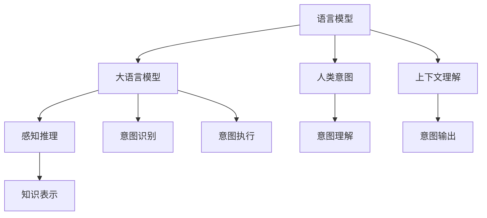

                 

# 人机协作2.0：LLM如何真正理解人类意图

> 关键词：语言模型,大模型,人类意图,自然语言处理,神经网络,深度学习,计算机视觉,感知推理

## 1. 背景介绍

### 1.1 问题由来
随着人工智能技术的飞速发展，大语言模型（Large Language Models, LLMs）已经成为了自然语言处理（Natural Language Processing, NLP）领域的一个重要分支。这些模型通过在海量文本数据上进行自监督预训练，学习到了丰富的语言知识和常识，能够在各种语言任务上取得优异的成绩。然而，尽管这些模型在技术上已经相当先进，但在真正理解人类意图方面，仍然存在诸多挑战。

### 1.2 问题核心关键点
大语言模型在处理自然语言任务时，面临着一系列与人类意图理解相关的问题。这些问题主要包括：

1. **语义歧义**：自然语言本身具有多义性和歧义性，同一句话可能有不同的解释。
2. **上下文理解**：语境对于理解句子的意思至关重要，大模型需要学会捕捉和利用上下文信息。
3. **知识迁移**：大模型需要能够将已有的知识迁移到新的任务中，而不仅仅是记住具体的输入输出对应关系。
4. **推理能力**：大模型需要具备一定的推理能力，能够基于已知信息推断出隐含的结论。
5. **道德和社会责任**：模型应该遵守道德和社会责任，避免输出有害、偏见性的内容。

这些问题不仅影响了大语言模型的应用效果，也决定了其在人类社会中的应用价值和安全性。因此，如何使大语言模型真正理解人类意图，成为了当前研究的热点之一。

## 2. 核心概念与联系

### 2.1 核心概念概述

为了更好地理解大语言模型如何理解人类意图，本节将介绍几个关键概念：

- **语言模型**：利用神经网络或统计模型，学习文本的概率分布，能够预测文本序列的下一个词或下一个句子。
- **大语言模型**：拥有数十亿甚至数百亿参数的神经网络模型，通过在海量文本数据上进行预训练，学习到复杂的语言知识和常识。
- **人类意图**：用户在表达意图时，希望通过语言所传递的主观愿望和期望。
- **感知推理**：模型通过感知输入的语义信息，并进行推理，从而得出结论或做出决策。
- **知识表示**：将人类知识用结构化的方式编码，便于模型学习和应用。

这些概念之间存在紧密的联系，构成了大语言模型处理自然语言任务的基础框架。通过理解这些概念，我们可以更深入地探讨大语言模型如何理解人类意图。

### 2.2 核心概念原理和架构的 Mermaid 流程图



这个流程图展示了核心概念之间的联系：

1. 语言模型通过学习文本的概率分布，预测下一个词或下一个句子。
2. 大语言模型在此基础上，通过感知推理和知识表示，理解文本中的意图。
3. 人类意图通过意图理解、意图识别和意图执行，转化为可执行的任务。
4. 上下文理解帮助模型更好地理解语境，提高意图识别的准确性。
5. 意图输出通过模型推理得出结论，并转化为具体的行动。

## 3. 核心算法原理 & 具体操作步骤

### 3.1 算法原理概述

大语言模型理解人类意图的过程，本质上是一个从文本输入到意图输出的映射过程。其核心算法原理可以概括为以下几点：

1. **自监督预训练**：在大规模无标签文本数据上进行预训练，学习到通用的语言知识和表示。
2. **意图识别**：通过意图理解模块，从输入文本中提取意图信息。
3. **意图执行**：将意图信息转化为具体的行动或输出，如回答问题、执行任务等。
4. **知识迁移**：将已有的知识迁移到新的任务中，提高模型在新任务上的表现。

这些原理构成了大语言模型处理自然语言任务的核心框架。

### 3.2 算法步骤详解

以下是实现大语言模型理解人类意图的具体步骤：

**Step 1: 数据预处理**
- 收集和标注有代表性的自然语言任务数据集，如问答、对话、情感分析等。
- 对文本进行分词、编码等预处理，将其转换为模型所需的输入格式。

**Step 2: 模型初始化**
- 选择合适的预训练模型，如BERT、GPT等，并将其作为初始化参数。
- 在预训练模型的基础上，添加意图识别、推理等任务相关的层。

**Step 3: 意图识别**
- 输入文本数据，通过感知推理模块提取意图信息。
- 使用分类器对意图进行分类，如意图类型、强度等。

**Step 4: 意图执行**
- 根据意图分类结果，选择合适的执行模块进行任务处理。
- 生成符合用户意图的输出结果，如回答问题、执行操作等。

**Step 5: 效果评估**
- 在验证集上评估模型性能，如准确率、召回率等。
- 根据评估结果调整模型参数，进行迭代优化。

### 3.3 算法优缺点

大语言模型理解人类意图的方法具有以下优点：

1. **泛化能力强**：通过自监督预训练，大模型能够学习到通用的语言知识和表示，适应不同的语言任务。
2. **高效性**：通过意图识别和执行模块，大模型能够在短时间内处理大量的自然语言输入，提高效率。
3. **灵活性**：大模型能够将已有的知识迁移到新的任务中，提高模型在新任务上的表现。

同时，这些方法也存在一些缺点：

1. **数据依赖性强**：模型性能很大程度上取决于标注数据的质量和数量。
2. **计算资源消耗大**：大模型需要大量的计算资源进行训练和推理，增加了部署成本。
3. **可解释性不足**：大模型的决策过程复杂，难以解释其内部工作机制和推理逻辑。
4. **对抗性脆弱**：大模型容易受到对抗样本的攻击，导致输出错误。

### 3.4 算法应用领域

基于大语言模型理解人类意图的方法，已经在众多领域得到了广泛应用，例如：

- **智能客服**：通过意图识别和执行模块，智能客服系统能够理解用户意图，提供个性化服务。
- **自动问答**：问答系统能够通过理解用户的问题，快速给出准确的答案。
- **情感分析**：通过意图识别，情感分析模型能够判断用户情绪，提供情绪管理建议。
- **机器翻译**：通过意图识别，机器翻译系统能够理解源语言和目标语言之间的转换关系。
- **语音识别**：通过意图识别，语音识别系统能够理解用户的语音指令，执行相应的操作。

## 4. 数学模型和公式 & 详细讲解 & 举例说明

### 4.1 数学模型构建

大语言模型理解人类意图的过程，可以通过以下数学模型进行描述：

设输入文本为 $x$，意图信息为 $y$，大语言模型为 $M$，其参数为 $\theta$。意图识别模块为 $I$，意图执行模块为 $E$。则整个系统的数学模型可以表示为：

$$
y = I(M(x))
$$

$$
y_{\text{output}} = E(y)
$$

其中，$I$ 和 $E$ 为意图识别和执行模块的函数映射。

### 4.2 公式推导过程

为了更好地理解意图识别和执行模块的工作原理，下面将详细推导意图识别和执行的公式：

**意图识别模块**
假设输入文本 $x$ 经过预处理后，转化为向量表示 $x'$。意图识别模块 $I$ 通过感知推理，提取意图信息 $y'$。具体的公式推导如下：

$$
y' = I(M(x'))
$$

其中，$I$ 为意图识别模块的函数，$M$ 为大语言模型，$x'$ 为文本的向量表示。

**意图执行模块**
假设意图信息 $y'$ 经过分类器 $C$ 的分类，得到意图类型 $y''$。意图执行模块 $E$ 根据意图类型 $y''$，生成具体的输出 $y_{\text{output}}$。具体的公式推导如下：

$$
y'' = C(y')
$$

$$
y_{\text{output}} = E(y'')
$$

其中，$C$ 为分类器，$y''$ 为意图类型，$y_{\text{output}}$ 为具体的输出。

### 4.3 案例分析与讲解

以智能客服系统为例，分析大语言模型如何理解用户意图：

假设用户输入的文本为 "我想查询电费信息"，系统首先通过意图识别模块 $I$，将其转化为意图信息 $y'$。这个意图信息可能包含 "查询" 和 "电费" 两个关键词。

接着，系统通过意图执行模块 $E$，根据意图类型 $y''$，执行相应的操作。例如，如果意图类型为 "查询"，系统可以调用查询接口，获取电费信息；如果意图类型为 "通知"，系统可以发送提醒短信。

最终，系统输出具体的结果 $y_{\text{output}}$，如 "电费信息如下：XXXX元" 或 "电费提醒已发送"。

## 5. 项目实践：代码实例和详细解释说明

### 5.1 开发环境搭建

在进行项目实践前，我们需要准备好开发环境。以下是使用Python进行PyTorch开发的环境配置流程：

1. 安装Anaconda：从官网下载并安装Anaconda，用于创建独立的Python环境。

2. 创建并激活虚拟环境：
```bash
conda create -n pytorch-env python=3.8 
conda activate pytorch-env
```

3. 安装PyTorch：根据CUDA版本，从官网获取对应的安装命令。例如：
```bash
conda install pytorch torchvision torchaudio cudatoolkit=11.1 -c pytorch -c conda-forge
```

4. 安装Transformer库：
```bash
pip install transformers
```

5. 安装各类工具包：
```bash
pip install numpy pandas scikit-learn matplotlib tqdm jupyter notebook ipython
```

完成上述步骤后，即可在`pytorch-env`环境中开始项目实践。

### 5.2 源代码详细实现

下面以智能客服系统为例，给出使用Transformers库对BERT模型进行意图识别的PyTorch代码实现。

首先，定义意图识别任务的数据处理函数：

```python
from transformers import BertTokenizer
from torch.utils.data import Dataset
import torch

class IntentDataset(Dataset):
    def __init__(self, texts, intents, tokenizer, max_len=128):
        self.texts = texts
        self.intents = intents
        self.tokenizer = tokenizer
        self.max_len = max_len
        
    def __len__(self):
        return len(self.texts)
    
    def __getitem__(self, item):
        text = self.texts[item]
        intent = self.intents[item]
        
        encoding = self.tokenizer(text, return_tensors='pt', max_length=self.max_len, padding='max_length', truncation=True)
        input_ids = encoding['input_ids'][0]
        attention_mask = encoding['attention_mask'][0]
        
        # 对label-wise的意图进行编码
        encoded_intent = [intent2id[intent] for intent in intent]
        encoded_intent.extend([intent2id['O']] * (self.max_len - len(encoded_intent)))
        labels = torch.tensor(encoded_intent, dtype=torch.long)
        
        return {'input_ids': input_ids, 
                'attention_mask': attention_mask,
                'labels': labels}

# 意图与id的映射
intent2id = {'O': 0, '查询': 1, '通知': 2, '投诉': 3, '其他': 4}
id2intent = {v: k for k, v in intent2id.items()}

# 创建dataset
tokenizer = BertTokenizer.from_pretrained('bert-base-cased')

train_dataset = IntentDataset(train_texts, train_intents, tokenizer)
dev_dataset = IntentDataset(dev_texts, dev_intents, tokenizer)
test_dataset = IntentDataset(test_texts, test_intents, tokenizer)
```

然后，定义模型和优化器：

```python
from transformers import BertForTokenClassification, AdamW

model = BertForTokenClassification.from_pretrained('bert-base-cased', num_labels=len(intent2id))

optimizer = AdamW(model.parameters(), lr=2e-5)
```

接着，定义训练和评估函数：

```python
from torch.utils.data import DataLoader
from tqdm import tqdm
from sklearn.metrics import classification_report

device = torch.device('cuda') if torch.cuda.is_available() else torch.device('cpu')
model.to(device)

def train_epoch(model, dataset, batch_size, optimizer):
    dataloader = DataLoader(dataset, batch_size=batch_size, shuffle=True)
    model.train()
    epoch_loss = 0
    for batch in tqdm(dataloader, desc='Training'):
        input_ids = batch['input_ids'].to(device)
        attention_mask = batch['attention_mask'].to(device)
        labels = batch['labels'].to(device)
        model.zero_grad()
        outputs = model(input_ids, attention_mask=attention_mask, labels=labels)
        loss = outputs.loss
        epoch_loss += loss.item()
        loss.backward()
        optimizer.step()
    return epoch_loss / len(dataloader)

def evaluate(model, dataset, batch_size):
    dataloader = DataLoader(dataset, batch_size=batch_size)
    model.eval()
    preds, labels = [], []
    with torch.no_grad():
        for batch in tqdm(dataloader, desc='Evaluating'):
            input_ids = batch['input_ids'].to(device)
            attention_mask = batch['attention_mask'].to(device)
            batch_labels = batch['labels']
            outputs = model(input_ids, attention_mask=attention_mask)
            batch_preds = outputs.logits.argmax(dim=2).to('cpu').tolist()
            batch_labels = batch_labels.to('cpu').tolist()
            for pred_tokens, label_tokens in zip(batch_preds, batch_labels):
                pred_intents = [id2intent[_id] for _id in pred_tokens]
                label_intents = [id2intent[_id] for _id in label_tokens]
                preds.append(pred_intents[:len(label_tokens)])
                labels.append(label_intents)
                
    print(classification_report(labels, preds))
```

最后，启动训练流程并在测试集上评估：

```python
epochs = 5
batch_size = 16

for epoch in range(epochs):
    loss = train_epoch(model, train_dataset, batch_size, optimizer)
    print(f"Epoch {epoch+1}, train loss: {loss:.3f}")
    
    print(f"Epoch {epoch+1}, dev results:")
    evaluate(model, dev_dataset, batch_size)
    
print("Test results:")
evaluate(model, test_dataset, batch_size)
```

以上就是使用PyTorch对BERT进行意图识别的完整代码实现。可以看到，得益于Transformers库的强大封装，我们可以用相对简洁的代码完成BERT模型的加载和意图识别任务的开发。

### 5.3 代码解读与分析

让我们再详细解读一下关键代码的实现细节：

**IntentDataset类**：
- `__init__`方法：初始化文本、意图、分词器等关键组件。
- `__len__`方法：返回数据集的样本数量。
- `__getitem__`方法：对单个样本进行处理，将文本输入编码为token ids，将意图编码为数字，并对其进行定长padding，最终返回模型所需的输入。

**intent2id和id2intent字典**：
- 定义了意图与数字id之间的映射关系，用于将token-wise的意图进行解码。

**训练和评估函数**：
- 使用PyTorch的DataLoader对数据集进行批次化加载，供模型训练和推理使用。
- 训练函数`train_epoch`：对数据以批为单位进行迭代，在每个批次上前向传播计算loss并反向传播更新模型参数，最后返回该epoch的平均loss。
- 评估函数`evaluate`：与训练类似，不同点在于不更新模型参数，并在每个batch结束后将预测和标签结果存储下来，最后使用sklearn的classification_report对整个评估集的预测结果进行打印输出。

**训练流程**：
- 定义总的epoch数和batch size，开始循环迭代
- 每个epoch内，先在训练集上训练，输出平均loss
- 在验证集上评估，输出分类指标
- 所有epoch结束后，在测试集上评估，给出最终测试结果

可以看到，PyTorch配合Transformers库使得BERT模型意图识别的代码实现变得简洁高效。开发者可以将更多精力放在数据处理、模型改进等高层逻辑上，而不必过多关注底层的实现细节。

当然，工业级的系统实现还需考虑更多因素，如模型的保存和部署、超参数的自动搜索、更灵活的任务适配层等。但核心的意图识别范式基本与此类似。

## 6. 实际应用场景

### 6.1 智能客服系统

基于大语言模型意图识别的对话技术，可以广泛应用于智能客服系统的构建。传统客服往往需要配备大量人力，高峰期响应缓慢，且一致性和专业性难以保证。而使用意图识别的对话模型，可以7x24小时不间断服务，快速响应客户咨询，用自然流畅的语言解答各类常见问题。

在技术实现上，可以收集企业内部的历史客服对话记录，将问题和最佳答复构建成监督数据，在此基础上对预训练对话模型进行意图识别微调。微调后的对话模型能够自动理解用户意图，匹配最合适的答案模板进行回复。对于客户提出的新问题，还可以接入检索系统实时搜索相关内容，动态组织生成回答。如此构建的智能客服系统，能大幅提升客户咨询体验和问题解决效率。

### 6.2 金融舆情监测

金融机构需要实时监测市场舆论动向，以便及时应对负面信息传播，规避金融风险。传统的人工监测方式成本高、效率低，难以应对网络时代海量信息爆发的挑战。基于大语言模型意图识别的文本分类和情感分析技术，为金融舆情监测提供了新的解决方案。

具体而言，可以收集金融领域相关的新闻、报道、评论等文本数据，并对其进行主题标注和情感标注。在此基础上对预训练语言模型进行意图识别微调，使其能够自动判断文本属于何种主题，情感倾向是正面、中性还是负面。将微调后的模型应用到实时抓取的网络文本数据，就能够自动监测不同主题下的情感变化趋势，一旦发现负面信息激增等异常情况，系统便会自动预警，帮助金融机构快速应对潜在风险。

### 6.3 个性化推荐系统

当前的推荐系统往往只依赖用户的历史行为数据进行物品推荐，无法深入理解用户的真实兴趣偏好。基于大语言模型意图识别的个性化推荐系统可以更好地挖掘用户行为背后的语义信息，从而提供更精准、多样的推荐内容。

在实践中，可以收集用户浏览、点击、评论、分享等行为数据，提取和用户交互的物品标题、描述、标签等文本内容。将文本内容作为模型输入，用户的后续行为（如是否点击、购买等）作为监督信号，在此基础上微调预训练语言模型。微调后的模型能够从文本内容中准确把握用户的兴趣点。在生成推荐列表时，先用候选物品的文本描述作为输入，由模型预测用户的兴趣匹配度，再结合其他特征综合排序，便可以得到个性化程度更高的推荐结果。

### 6.4 未来应用展望

随着大语言模型和意图识别技术的不断发展，基于意图识别的应用场景将更加广泛，为各行各业带来变革性影响。

在智慧医疗领域，基于意图识别的医疗问答、病历分析、药物研发等应用将提升医疗服务的智能化水平，辅助医生诊疗，加速新药开发进程。

在智能教育领域，意图识别的智能推荐系统能够因材施教，促进教育公平，提高教学质量。

在智慧城市治理中，意图识别的城市事件监测、舆情分析、应急指挥等环节，提高城市管理的自动化和智能化水平，构建更安全、高效的未来城市。

此外，在企业生产、社会治理、文娱传媒等众多领域，基于大语言模型意图识别的人工智能应用也将不断涌现，为经济社会发展注入新的动力。相信随着技术的日益成熟，意图识别技术将成为人工智能落地应用的重要范式，推动人工智能技术在垂直行业的规模化落地。

## 7. 工具和资源推荐

### 7.1 学习资源推荐

为了帮助开发者系统掌握大语言模型意图识别的理论基础和实践技巧，这里推荐一些优质的学习资源：

1. 《Transformer从原理到实践》系列博文：由大模型技术专家撰写，深入浅出地介绍了Transformer原理、BERT模型、意图识别技术等前沿话题。

2. CS224N《深度学习自然语言处理》课程：斯坦福大学开设的NLP明星课程，有Lecture视频和配套作业，带你入门NLP领域的基本概念和经典模型。

3. 《Natural Language Processing with Transformers》书籍：Transformers库的作者所著，全面介绍了如何使用Transformers库进行NLP任务开发，包括意图识别在内的诸多范式。

4. HuggingFace官方文档：Transformers库的官方文档，提供了海量预训练模型和完整的意图识别样例代码，是上手实践的必备资料。

5. CLUE开源项目：中文语言理解测评基准，涵盖大量不同类型的中文NLP数据集，并提供了基于意图识别的baseline模型，助力中文NLP技术发展。

通过对这些资源的学习实践，相信你一定能够快速掌握大语言模型意图识别的精髓，并用于解决实际的NLP问题。

### 7.2 开发工具推荐

高效的开发离不开优秀的工具支持。以下是几款用于大语言模型意图识别开发的常用工具：

1. PyTorch：基于Python的开源深度学习框架，灵活动态的计算图，适合快速迭代研究。大部分预训练语言模型都有PyTorch版本的实现。

2. TensorFlow：由Google主导开发的开源深度学习框架，生产部署方便，适合大规模工程应用。同样有丰富的预训练语言模型资源。

3. Transformers库：HuggingFace开发的NLP工具库，集成了众多SOTA语言模型，支持PyTorch和TensorFlow，是进行意图识别任务开发的利器。

4. Weights & Biases：模型训练的实验跟踪工具，可以记录和可视化模型训练过程中的各项指标，方便对比和调优。与主流深度学习框架无缝集成。

5. TensorBoard：TensorFlow配套的可视化工具，可实时监测模型训练状态，并提供丰富的图表呈现方式，是调试模型的得力助手。

6. Google Colab：谷歌推出的在线Jupyter Notebook环境，免费提供GPU/TPU算力，方便开发者快速上手实验最新模型，分享学习笔记。

合理利用这些工具，可以显著提升大语言模型意图识别的开发效率，加快创新迭代的步伐。

### 7.3 相关论文推荐

大语言模型和意图识别技术的发展源于学界的持续研究。以下是几篇奠基性的相关论文，推荐阅读：

1. Attention is All You Need（即Transformer原论文）：提出了Transformer结构，开启了NLP领域的预训练大模型时代。

2. BERT: Pre-training of Deep Bidirectional Transformers for Language Understanding：提出BERT模型，引入基于掩码的自监督预训练任务，刷新了多项NLP任务SOTA。

3. Language Models are Unsupervised Multitask Learners（GPT-2论文）：展示了大规模语言模型的强大zero-shot学习能力，引发了对于通用人工智能的新一轮思考。

4. Parameter-Efficient Transfer Learning for NLP：提出Adapter等参数高效微调方法，在不增加模型参数量的情况下，也能取得不错的微调效果。

5. Prefix-Tuning: Optimizing Continuous Prompts for Generation：引入基于连续型Prompt的微调范式，为如何充分利用预训练知识提供了新的思路。

6. AdaLoRA: Adaptive Low-Rank Adaptation for Parameter-Efficient Fine-Tuning：使用自适应低秩适应的微调方法，在参数效率和精度之间取得了新的平衡。

这些论文代表了大语言模型意图识别技术的发展脉络。通过学习这些前沿成果，可以帮助研究者把握学科前进方向，激发更多的创新灵感。

## 8. 总结：未来发展趋势与挑战

### 8.1 总结

本文对大语言模型理解人类意图的方法进行了全面系统的介绍。首先阐述了大语言模型意图识别的研究背景和意义，明确了意图识别在拓展预训练模型应用、提升自然语言任务性能方面的独特价值。其次，从原理到实践，详细讲解了意图识别的数学原理和关键步骤，给出了意图识别任务开发的完整代码实例。同时，本文还广泛探讨了意图识别方法在智能客服、金融舆情、个性化推荐等多个行业领域的应用前景，展示了意图识别范式的巨大潜力。

通过本文的系统梳理，可以看到，大语言模型意图识别技术正在成为NLP领域的重要范式，极大地拓展了预训练语言模型的应用边界，催生了更多的落地场景。得益于大规模语料的预训练，意图识别模型在输入处理、模型训练、推理输出等各个环节都取得了显著进展，为智能系统提供了强大的决策支持。未来，伴随预训练语言模型和意图识别方法的持续演进，相信NLP技术将在更广阔的应用领域大放异彩，深刻影响人类的生产生活方式。

### 8.2 未来发展趋势

展望未来，大语言模型意图识别技术将呈现以下几个发展趋势：

1. **模型规模持续增大**：随着算力成本的下降和数据规模的扩张，预训练语言模型的参数量还将持续增长。超大规模语言模型蕴含的丰富语言知识，有望支撑更加复杂多变的意图识别任务。

2. **意图识别算法多样性**：未来将涌现更多参数高效的意图识别方法，如Prefix-Tuning、LoRA等，在固定大部分预训练参数的情况下，只更新极少量的任务相关参数。同时优化意图识别模型的计算图，减少前向传播和反向传播的资源消耗，实现更加轻量级、实时性的部署。

3. **跨模态意图识别**：除了文本输入，意图识别技术还将拓展到图像、视频、语音等多模态数据，实现视觉、语音等多模态信息与文本信息的协同建模。

4. **多任务学习**：意图识别模型将具备多任务学习能力，能够在处理多个相关任务时，提高模型性能和泛化能力。

5. **端到端训练**：意图识别系统将实现端到端训练，直接从原始文本数据到意图输出进行训练，减少数据预处理和特征提取的环节，提高训练效率。

6. **隐私保护**：随着用户隐私保护意识的增强，意图识别技术将更加注重用户隐私保护，使用差分隐私、联邦学习等技术，保障用户数据安全。

以上趋势凸显了大语言模型意图识别技术的广阔前景。这些方向的探索发展，必将进一步提升意图识别模型的性能和应用范围，为构建安全、可靠、可解释、可控的智能系统铺平道路。

### 8.3 面临的挑战

尽管大语言模型意图识别技术已经取得了显著进展，但在迈向更加智能化、普适化应用的过程中，它仍面临着诸多挑战：

1. **数据依赖性强**：模型性能很大程度上取决于标注数据的质量和数量。对于长尾应用场景，难以获得充足的高质量标注数据，成为制约意图识别性能的瓶颈。如何进一步降低意图识别对标注样本的依赖，将是一大难题。

2. **对抗性脆弱**：意图识别模型容易受到对抗样本的攻击，导致输出错误。如何提高意图识别模型的鲁棒性，避免对抗性攻击，还需要更多理论和实践的积累。

3. **推理效率有待提高**：尽管意图识别模型在精度上表现优异，但在实际部署时往往面临推理速度慢、内存占用大等效率问题。如何在保证性能的同时，简化模型结构，提升推理速度，优化资源占用，将是重要的优化方向。

4. **可解释性不足**：意图识别模型的决策过程复杂，难以解释其内部工作机制和推理逻辑。对于医疗、金融等高风险应用，算法的可解释性和可审计性尤为重要。如何赋予意图识别模型更强的可解释性，将是亟待攻克的难题。

5. **安全性有待保障**：意图识别模型在处理自然语言任务时，可能会学习到有偏见、有害的信息，通过意图识别传递到下游任务，产生误导性、歧视性的输出，给实际应用带来安全隐患。如何从数据和算法层面消除模型偏见，避免恶意用途，确保输出的安全性，也将是重要的研究课题。

6. **知识整合能力不足**：现有的意图识别模型往往局限于任务内数据，难以灵活吸收和运用更广泛的先验知识。如何让意图识别过程更好地与外部知识库、规则库等专家知识结合，形成更加全面、准确的信息整合能力，还有很大的想象空间。

正视意图识别面临的这些挑战，积极应对并寻求突破，将是大语言模型意图识别技术迈向成熟的必由之路。相信随着学界和产业界的共同努力，这些挑战终将一一被克服，大语言模型意图识别技术必将在构建安全、可靠、可解释、可控的智能系统上发挥越来越重要的作用。

### 8.4 研究展望

面向未来，大语言模型意图识别的研究需要在以下几个方面寻求新的突破：

1. **探索无监督和半监督意图识别方法**：摆脱对大规模标注数据的依赖，利用自监督学习、主动学习等无监督和半监督范式，最大限度利用非结构化数据，实现更加灵活高效的意图识别。

2. **研究参数高效和计算高效的意图识别范式**：开发更加参数高效的意图识别方法，在固定大部分预训练参数的情况下，只更新极少量的任务相关参数。同时优化意图识别模型的计算图，减少前向传播和反向传播的资源消耗，实现更加轻量级、实时性的部署。

3. **融合因果和对比学习范式**：通过引入因果推断和对比学习思想，增强意图识别模型建立稳定因果关系的能力，学习更加普适、鲁棒的语言表征，从而提升模型泛化性和抗干扰能力。

4. **引入更多先验知识**：将符号化的先验知识，如知识图谱、逻辑规则等，与神经网络模型进行巧妙融合，引导意图识别过程学习更准确、合理的语言模型。同时加强不同模态数据的整合，实现视觉、语音等多模态信息与文本信息的协同建模。

5. **结合因果分析和博弈论工具**：将因果分析方法引入意图识别模型，识别出模型决策的关键特征，增强输出解释的因果性和逻辑性。借助博弈论工具刻画人机交互过程，主动探索并规避模型的脆弱点，提高系统稳定性。

6. **纳入伦理道德约束**：在模型训练目标中引入伦理导向的评估指标，过滤和惩罚有偏见、有害的输出倾向。同时加强人工干预和审核，建立模型行为的监管机制，确保输出符合人类价值观和伦理道德。

这些研究方向的探索，必将引领大语言模型意图识别技术迈向更高的台阶，为构建安全、可靠、可解释、可控的智能系统铺平道路。面向未来，大语言模型意图识别技术还需要与其他人工智能技术进行更深入的融合，如知识表示、因果推理、强化学习等，多路径协同发力，共同推动自然语言理解和智能交互系统的进步。只有勇于创新、敢于突破，才能不断拓展语言模型的边界，让智能技术更好地造福人类社会。

## 9. 附录：常见问题与解答

**Q1：大语言模型意图识别是否适用于所有NLP任务？**

A: 大语言模型意图识别的技术在大多数NLP任务上都能取得不错的效果，特别是对于数据量较小的任务。但对于一些特定领域的任务，如医学、法律等，仅仅依靠通用语料预训练的模型可能难以很好地适应。此时需要在特定领域语料上进一步预训练，再进行意图识别微调。此外，对于一些需要时效性、个性化很强的任务，如对话、推荐等，意图识别方法也需要针对性的改进优化。

**Q2：意图识别过程中如何选择合适的学习率？**

A: 意图识别的学习率一般要比预训练时小1-2个数量级，如果使用过大的学习率，容易破坏预训练权重，导致过拟合。一般建议从1e-5开始调参，逐步减小学习率，直至收敛。也可以使用warmup策略，在开始阶段使用较小的学习率，再逐渐过渡到预设值。需要注意的是，不同的优化器(如AdamW、Adafactor等)以及不同的学习率调度策略，可能需要设置不同的学习率阈值。

**Q3：意图识别模型在落地部署时需要注意哪些问题？**

A: 将意图识别模型转化为实际应用，还需要考虑以下因素：
1. 模型裁剪：去除不必要的层和参数，减小模型尺寸，加快推理速度
2. 量化加速：将浮点模型转为定点模型，压缩存储空间，提高计算效率
3. 服务化封装：将模型封装为标准化服务接口，便于集成调用
4. 弹性伸缩：根据请求流量动态调整资源配置，平衡服务质量和成本
5. 监控告警：实时采集系统指标，设置异常告警阈值，确保服务稳定性
6. 安全防护：采用访问鉴权、数据脱敏等措施，保障数据和模型安全

大语言模型意图识别为NLP应用开启了广阔的想象空间，但如何将强大的性能转化为稳定、高效、安全的业务价值，还需要工程实践的不断打磨。唯有从数据、算法、工程、业务等多个维度协同发力，才能真正实现人工智能技术在垂直行业的规模化落地。总之，意图识别需要开发者根据具体任务，不断迭代和优化模型、数据和算法，方能得到理想的效果。

---

作者：禅与计算机程序设计艺术 / Zen and the Art of Computer Programming

