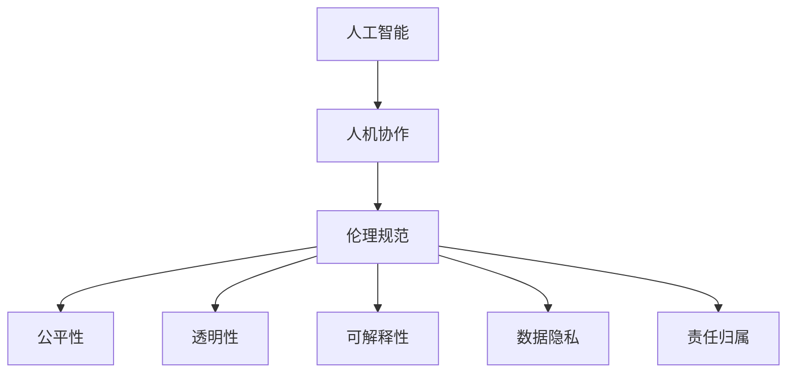

                 

# 人机协作：伦理规范与准则

> 关键词：人机协作, 伦理规范, 人工智能, 机器学习, 数据隐私, 公平性, 透明性, 可解释性

## 1. 背景介绍

### 1.1 问题由来

随着人工智能技术的迅猛发展，人机协作已经成为当今社会的重要趋势。人工智能系统在医疗、教育、金融、智能制造等诸多领域大放异彩，极大提升了效率和决策的准确性。然而，随着AI系统的广泛应用，人机协作带来的伦理问题也逐渐凸显。如何确保AI系统在提升效率和公平性的同时，遵守伦理规范，保障数据隐私和用户权益，成为一个亟待解决的问题。

### 1.2 问题核心关键点

当前人机协作面临的主要伦理挑战包括但不限于：

1. **数据隐私**：AI系统往往需要大量的训练数据，但这些数据中可能包含敏感的个人隐私信息，如何在数据采集、存储、处理过程中保护隐私，是一个重要的伦理问题。
2. **公平性**：AI系统可能会因数据偏见、算法设计问题等导致不公平的决策，如何保证AI系统的决策公平性，是一个关键问题。
3. **透明性**：AI系统内部决策过程复杂，往往难以被解释和理解，如何提高系统的透明性，让用户信任AI系统的决策，是一个重要的伦理要求。
4. **可解释性**：AI系统的决策过程需要可解释，以便在出现错误时进行纠正和改进，同时也能帮助用户理解系统的决策依据。
5. **责任归属**：AI系统在决策过程中出现错误或违法行为时，责任应该由谁承担，是一个重要的法律和伦理问题。

### 1.3 问题研究意义

研究人机协作的伦理规范与准则，对于构建一个安全、可信、公平、高效的AI系统至关重要。合理制定伦理规范，可以避免AI系统滥用，保障用户权益，提升社会对AI技术的接受度和信任度。这对于推动AI技术的普及应用，促进人工智能与人类社会的和谐共存，具有重要意义。

## 2. 核心概念与联系

### 2.1 核心概念概述

为了更好地理解人机协作的伦理规范与准则，本节将介绍几个密切相关的核心概念：

- **人工智能(AI)**：以机器学习和深度学习为核心的计算系统，能够自主进行学习、推理、决策等智能活动。
- **人机协作(Human-AI Collaboration)**：人与AI系统在特定任务中合作完成工作的过程。
- **伦理规范(Ethical Norms)**：指导AI系统开发和应用的道德标准和行为准则。
- **公平性(Fairness)**：AI系统在决策中对所有用户群体不偏不倚，不因种族、性别、年龄等因素产生歧视。
- **透明性(Transparency)**：AI系统的决策过程可解释、可理解，用户能清晰知晓系统如何得出结论。
- **可解释性(Explainability)**：AI系统的决策逻辑和依据可以被用户理解和验证。
- **数据隐私(Privacy)**：保护个人数据免遭未经授权的访问和使用，确保数据使用过程中不泄露敏感信息。
- **责任归属(Accountability)**：明确AI系统在执行任务过程中出现错误或违法行为时的责任归属。

这些核心概念之间的逻辑关系可以通过以下Mermaid流程图来展示：



这个流程图展示了一些核心概念及其之间的关系：

1. 人工智能通过人机协作实现智能化决策，但同时也需要遵循伦理规范。
2. 伦理规范包含公平性、透明性、可解释性等子概念，指导AI系统的开发与应用。
3. 数据隐私和责任归属是伦理规范的两个重要维度，保障数据安全，明确责任归属。

## 3. 核心算法原理 & 具体操作步骤
### 3.1 算法原理概述

人机协作的伦理规范与准则涉及多方面的技术实现，包括但不限于数据隐私保护、公平性算法、透明性机制、可解释性模型、责任归属系统等。这些技术的核心算法原理可以分为以下几个方面：

- **数据隐私保护**：通过差分隐私、联邦学习等技术，在保证数据隐私的前提下进行模型训练。
- **公平性算法**：引入对抗性学习、公平性优化等技术，确保AI系统在不同用户群体上的决策公平性。
- **透明性机制**：利用可解释模型、规则化训练等方法，提升AI系统的透明性。
- **可解释性模型**：开发可解释模型，如LIME、SHAP等，帮助用户理解AI系统的决策依据。
- **责任归属系统**：设计透明、可追溯的责任归属系统，明确AI系统在执行任务过程中出现错误或违法行为时的责任。

### 3.2 算法步骤详解

人机协作的伦理规范与准则的实现通常包括以下几个关键步骤：

**Step 1: 数据采集与预处理**

- 确定数据采集标准和范围，确保数据的多样性和代表性。
- 对数据进行清洗、去重、归一化等预处理，确保数据质量。
- 在数据采集和使用过程中，严格遵循数据隐私保护法规，如GDPR等。

**Step 2: 模型训练与优化**

- 选择合适的模型架构和算法，如深度神经网络、集成学习等。
- 在模型训练过程中，引入公平性约束，确保模型在训练集和测试集上的公平性。
- 使用透明性机制，记录和展示模型训练过程中的关键信息，如参数更新、损失变化等。
- 开发可解释模型，帮助用户理解模型决策过程，如LIME、SHAP等。

**Step 3: 模型部署与监控**

- 将训练好的模型部署到实际应用环境中，如移动应用、智能家居等。
- 在模型使用过程中，实时监控模型行为，确保模型决策的透明性和公平性。
- 设计责任归属系统，明确模型在执行任务过程中出现错误或违法行为时的责任归属。

**Step 4: 用户反馈与迭代改进**

- 收集用户反馈，评估模型性能和公平性。
- 根据用户反馈，不断迭代优化模型，提升模型透明性和公平性。
- 定期更新模型和算法，确保模型持续改进和升级。

### 3.3 算法优缺点

人机协作的伦理规范与准则在提升AI系统公平性、透明性和可解释性方面具有显著优势，但也存在一些缺点：

**优点**：
- 提升AI系统的公平性，减少因数据偏见和算法设计问题带来的不公平。
- 增强AI系统的透明性，使用户和监管机构能够理解和信任AI系统。
- 提高AI系统的可解释性，帮助用户理解AI系统决策依据。
- 确保数据隐私，保护用户个人隐私信息不被滥用。

**缺点**：
- 技术复杂度高，实现难度大，需要多方协作和资源投入。
- 部分技术可能影响模型性能，如可解释模型可能会导致精度下降。
- 责任归属问题复杂，需要明确的法规和制度支持。

### 3.4 算法应用领域

人机协作的伦理规范与准则在多个领域都有广泛的应用，例如：

- **医疗领域**：AI系统辅助医生诊断和治疗，需要确保数据隐私和公平性，保障患者权益。
- **金融领域**：AI系统进行风险评估和贷款审批，需要确保模型公平和透明，避免歧视性决策。
- **教育领域**：AI系统辅助教学和学习，需要确保模型公平和透明，帮助学生更好地学习。
- **司法领域**：AI系统辅助判案和法律分析，需要确保模型公平和透明，避免误判和歧视。

除了上述这些经典领域外，人机协作的伦理规范与准则还在智能制造、智能交通、智能城市等新兴领域得到应用，为社会治理和经济生活带来了新的变革。

## 4. 数学模型和公式 & 详细讲解 & 举例说明

### 4.1 数学模型构建

人机协作的伦理规范与准则的数学模型构建主要涉及以下几个方面：

- **数据隐私保护**：差分隐私(Differential Privacy)模型，通过在模型训练中加入噪声，确保数据隐私。
- **公平性算法**：对抗性学习(Adversarial Learning)模型，通过引入对抗样本，提升模型在不同用户群体上的公平性。
- **透明性机制**：LIME模型，通过局部可解释模型，帮助用户理解模型决策依据。
- **可解释性模型**：SHAP模型，通过解释模型输出，提供全局可解释性。

### 4.2 公式推导过程

这里以差分隐私模型为例，介绍其数学推导过程。

差分隐私的核心思想是在模型训练过程中引入噪声，确保在任意单一数据点上的模型输出不敏感。差分隐私的数学定义如下：

$$
\text{DP}\epsilon(\mathcal{A}) = \begin{cases}
\text{True}, & \text{if} \ \forall x_1, x_2 \in \mathcal{X}, \ |\Pr[\mathcal{A}(x_1)] - \Pr[\mathcal{A}(x_2)]| \leq \epsilon \\
\text{False}, & \text{otherwise}
\end{cases}
$$

其中，$\mathcal{A}$ 表示模型训练算法，$x_1$ 和 $x_2$ 为任意两个相邻数据点，$\epsilon$ 为隐私参数。

为了实现差分隐私，通常使用拉普拉斯噪声或高斯噪声对模型输出进行扰动。例如，对于线性回归模型，其差分隐私训练公式如下：

$$
\hat{\theta} = \arg\min_{\theta} \frac{1}{n} \sum_{i=1}^n (y_i - \theta^Tx_i)^2 + \frac{\lambda}{n} \sum_{i=1}^n |\delta_i| + \frac{n\epsilon}{2} \ln(\frac{2}{\delta})
$$

其中，$\delta$ 为噪声分布参数，$\lambda$ 为正则化系数。

### 4.3 案例分析与讲解

以医疗领域的AI系统为例，分析其人机协作的伦理规范与准则的实现过程：

**案例背景**：某医院采用AI系统辅助诊断癌症，需要将患者数据输入模型进行诊断。

**数据采集与预处理**：
- 患者数据包括个人基本信息、病历、影像等，需进行匿名化处理，确保数据隐私。
- 数据清洗，去除不完整或异常数据，确保数据质量。

**模型训练与优化**：
- 选择深度神经网络作为模型架构，引入公平性约束，确保模型在训练集和测试集上的公平性。
- 使用透明性机制，记录和展示模型训练过程中的关键信息，如参数更新、损失变化等。
- 开发可解释模型，帮助医生理解AI系统决策依据。

**模型部署与监控**：
- 将训练好的AI系统部署到医院诊断系统中，实时监控模型行为，确保模型决策的透明性和公平性。
- 设计责任归属系统，明确AI系统在执行任务过程中出现错误或违法行为时的责任归属。

**用户反馈与迭代改进**：
- 收集医生反馈，评估AI系统性能和公平性。
- 根据医生反馈，不断迭代优化模型，提升模型透明性和公平性。
- 定期更新模型和算法，确保模型持续改进和升级。

## 5. 项目实践：代码实例和详细解释说明
### 5.1 开发环境搭建

在进行伦理规范与准则实践前，我们需要准备好开发环境。以下是使用Python进行差分隐私实验的环境配置流程：

1. 安装Anaconda：从官网下载并安装Anaconda，用于创建独立的Python环境。

2. 创建并激活虚拟环境：
```bash
conda create -n diffpriv-env python=3.8 
conda activate diffpriv-env
```

3. 安装必要的库：
```bash
conda install numpy scipy matplotlib pandas sklearn
pip install pydiffpriv
```

完成上述步骤后，即可在`diffpriv-env`环境中开始差分隐私实验。

### 5.2 源代码详细实现

下面以差分隐私模型为例，给出使用PyTorch进行差分隐私实验的代码实现。

首先，定义差分隐私的噪声分布函数：

```python
from pydiffpriv.utils import GaussianMechanism
from pydiffpriv import LaplaceMechanism
from pydiffpriv import LaplaceMechanism

# 定义拉普拉斯噪声机制
mech = LaplaceMechanism(epsilon=0.1, delta=0.01)
```

然后，定义差分隐私的线性回归模型：

```python
import torch
import torch.nn as nn

# 定义线性回归模型
class LinearRegression(nn.Module):
    def __init__(self, input_size, output_size):
        super(LinearRegression, self).__init__()
        self.linear = nn.Linear(input_size, output_size)
    
    def forward(self, x):
        return self.linear(x)
```

接着，定义差分隐私训练函数：

```python
def train_diffpriv_model(model, train_data, test_data, num_epochs):
    # 设置训练参数
    optimizer = torch.optim.SGD(model.parameters(), lr=0.01)
    criterion = nn.MSELoss()
    
    # 定义差分隐私机制
    mech = LaplaceMechanism(epsilon=0.1, delta=0.01)
    
    # 开始训练
    for epoch in range(num_epochs):
        for data, target in train_data:
            # 添加噪声
            data = mech(data)
            # 前向传播和计算损失
            output = model(data)
            loss = criterion(output, target)
            # 反向传播和参数更新
            optimizer.zero_grad()
            loss.backward()
            optimizer.step()
        # 在测试集上评估模型
        test_loss = 0
        for data, target in test_data:
            data = mech(data)
            output = model(data)
            test_loss += criterion(output, target).item()
        print(f"Epoch {epoch+1}, train loss: {loss:.4f}, test loss: {test_loss:.4f}")
```

最后，启动差分隐私训练流程：

```python
# 定义输入数据和标签
train_data = torch.randn(100, 10)  # 随机生成100个训练样本，每个样本有10个特征
train_target = torch.randn(100, 1)  # 随机生成100个训练标签

# 定义输出数据和标签
test_data = torch.randn(50, 10)  # 随机生成50个测试样本，每个样本有10个特征
test_target = torch.randn(50, 1)  # 随机生成50个测试标签

# 定义模型
model = LinearRegression(10, 1)

# 训练模型
train_diffpriv_model(model, (train_data, train_target), (test_data, test_target), num_epochs=10)
```

以上就是使用PyTorch进行差分隐私实验的完整代码实现。可以看到，通过简单的代码实现，即可在差分隐私机制下进行线性回归模型的训练和评估。

### 5.3 代码解读与分析

让我们再详细解读一下关键代码的实现细节：

**差分隐私机制定义**：
- 使用`LaplaceMechanism`定义拉普拉斯噪声机制，设置隐私参数$\epsilon=0.1$，噪声分布参数$\delta=0.01$。

**线性回归模型定义**：
- 定义线性回归模型，包含一个线性层。

**差分隐私训练函数**：
- 定义优化器和损失函数。
- 在每次训练迭代中，先添加噪声，再前向传播计算输出和损失，最后反向传播更新参数。
- 在每个epoch结束后，计算模型在测试集上的平均损失，并输出结果。

**启动训练流程**：
- 定义输入和标签数据，随机生成100个训练样本和50个测试样本。
- 定义模型，使用之前定义的线性回归模型。
- 调用训练函数，开始差分隐私训练。

可以看到，差分隐私机制的实现相对简单，只需要在每次迭代中添加噪声，即可保证数据隐私。但实际应用中，选择合适的噪声分布和隐私参数，以及确保模型的公平性和透明性，仍需进一步研究。

## 6. 实际应用场景
### 6.1 智能医疗系统

智能医疗系统在疾病诊断、治疗方案推荐等方面具有广泛应用。但由于涉及个人健康数据，其隐私保护和公平性显得尤为重要。通过引入差分隐私和公平性算法，可以确保医疗数据的隐私保护和公平性。

**应用示例**：某智能医疗系统采用AI模型辅助医生诊断癌症。系统需收集大量患者数据进行模型训练，同时需确保患者数据的隐私安全。通过在模型训练过程中引入差分隐私，系统可以在保护隐私的前提下，获得高质量的诊断模型。

### 6.2 智能金融系统

智能金融系统在风险评估、贷款审批等方面具有广泛应用。但由于涉及个人财务数据，其隐私保护和公平性也显得尤为重要。通过引入差分隐私和公平性算法，可以确保金融数据的隐私保护和公平性。

**应用示例**：某智能金融系统采用AI模型进行风险评估和贷款审批。系统需收集大量用户数据进行模型训练，同时需确保用户数据的隐私安全。通过在模型训练过程中引入差分隐私，系统可以在保护隐私的前提下，获得高质量的风险评估模型。

### 6.3 智能教育系统

智能教育系统在个性化学习、作业批改等方面具有广泛应用。但由于涉及学生数据，其隐私保护和公平性也显得尤为重要。通过引入差分隐私和公平性算法，可以确保教育数据的隐私保护和公平性。

**应用示例**：某智能教育系统采用AI模型进行个性化学习推荐和作业批改。系统需收集大量学生数据进行模型训练，同时需确保学生数据的隐私安全。通过在模型训练过程中引入差分隐私，系统可以在保护隐私的前提下，获得高质量的学习推荐和作业批改模型。

### 6.4 未来应用展望

随着人工智能技术的不断发展和应用，人机协作的伦理规范与准则将在更多领域得到应用，为社会治理和经济生活带来新的变革。

在智慧医疗领域，基于差分隐私和公平性算法的AI系统，可以帮助医院提升诊断和治疗的效率和准确性，同时保障患者隐私和权益。

在智能金融领域，基于差分隐私和公平性算法的AI系统，可以帮助银行和保险公司提升风险评估和贷款审批的效率和准确性，同时保障用户隐私和公平性。

在智能教育领域，基于差分隐私和公平性算法的AI系统，可以帮助学校和教育机构提升个性化学习和作业批改的效率和准确性，同时保障学生隐私和公平性。

未来，随着技术的不断进步和应用场景的不断扩展，人机协作的伦理规范与准则将进一步发展，为构建安全、可信、公平、高效的AI系统奠定坚实基础。

## 7. 工具和资源推荐
### 7.1 学习资源推荐

为了帮助开发者系统掌握人机协作的伦理规范与准则的理论基础和实践技巧，这里推荐一些优质的学习资源：

1. **《人工智能伦理与法律》**：深入介绍人工智能技术的伦理问题，提供丰富的案例和理论分析。
2. **《数据隐私保护技术》**：系统讲解差分隐私、联邦学习等数据隐私保护技术，提供详细的实现代码和案例。
3. **《公平性算法与实践》**：介绍公平性算法的基本原理和应用场景，提供丰富的案例和实现代码。
4. **《可解释AI》**：探讨可解释性模型和可解释性技术，提供详细的实现代码和案例。
5. **《伦理规范与AI系统设计》**：介绍人机协作的伦理规范与准则，提供丰富的案例和理论分析。

通过这些学习资源，相信你一定能够系统掌握人机协作的伦理规范与准则，并在实际应用中充分发挥其价值。

### 7.2 开发工具推荐

高效的开发离不开优秀的工具支持。以下是几款用于差分隐私实验的常用工具：

1. **PyTorch**：基于Python的开源深度学习框架，支持差分隐私和公平性算法的实现。
2. **TensorFlow**：由Google主导开发的开源深度学习框架，支持差分隐私和公平性算法的实现。
3. **pydiffpriv**：HuggingFace开发的差分隐私工具库，提供了丰富的差分隐私实现，支持差分隐私和公平性算法的实验。

合理利用这些工具，可以显著提升差分隐私实验的开发效率，加快创新迭代的步伐。

### 7.3 相关论文推荐

人机协作的伦理规范与准则的研究源于学界的持续研究。以下是几篇奠基性的相关论文，推荐阅读：

1. **《差分隐私：保护隐私的统计学习》**：由Differential Privacy之父Dwork等人撰写，全面介绍了差分隐私的理论基础和实现方法。
2. **《公平性算法》**：由Foster等人撰写，系统讲解了公平性算法的基本原理和应用场景。
3. **《可解释AI》**：由Rudin等人撰写，探讨了可解释性模型的基本原理和实现方法。
4. **《人机协作的伦理规范与准则》**：由Ginzburg等人撰写，探讨了人机协作的伦理规范与准则的基本原理和实现方法。

这些论文代表了大语言模型微调技术的发展脉络。通过学习这些前沿成果，可以帮助研究者把握学科前进方向，激发更多的创新灵感。

## 8. 总结：未来发展趋势与挑战

### 8.1 总结

本文对基于差分隐私的人机协作伦理规范与准则进行了全面系统的介绍。首先阐述了差分隐私的基本概念和重要意义，明确了差分隐私在保护数据隐私方面的核心价值。其次，从原理到实践，详细讲解了差分隐私的基本原理和关键步骤，给出了差分隐私实验的完整代码实例。同时，本文还广泛探讨了差分隐私在智能医疗、智能金融、智能教育等多个领域的应用前景，展示了差分隐私的广阔前景。

通过本文的系统梳理，可以看到，基于差分隐私的伦理规范与准则在保护数据隐私、提升AI系统公平性和透明性方面具有重要价值。这些技术的推广应用，必将在未来推动AI技术的普及应用，构建安全、可信、公平、高效的智能系统。

### 8.2 未来发展趋势

展望未来，差分隐私和公平性算法将在更多领域得到应用，为社会治理和经济生活带来新的变革。

在智慧医疗领域，基于差分隐私的AI系统，可以帮助医院提升诊断和治疗的效率和准确性，同时保障患者隐私和权益。

在智能金融领域，基于差分隐私的AI系统，可以帮助银行和保险公司提升风险评估和贷款审批的效率和准确性，同时保障用户隐私和公平性。

在智能教育领域，基于差分隐私的AI系统，可以帮助学校和教育机构提升个性化学习和作业批改的效率和准确性，同时保障学生隐私和公平性。

未来，随着技术的不断进步和应用场景的不断扩展，差分隐私和公平性算法将进一步发展，为构建安全、可信、公平、高效的AI系统奠定坚实基础。

### 8.3 面临的挑战

尽管差分隐私和公平性算法已经取得了显著进展，但在实际应用中仍面临诸多挑战：

1. **技术复杂度高**：差分隐私和公平性算法的实现难度较大，需要多方协作和资源投入。
2. **模型性能影响**：差分隐私和公平性算法可能会影响模型性能，如差分隐私机制可能导致模型精度下降。
3. **公平性验证困难**：如何验证模型在不同用户群体上的公平性，仍然是一个技术难题。
4. **数据隐私泄露风险**：差分隐私机制不能完全保证数据隐私，仍存在一定的隐私泄露风险。
5. **公平性数据稀少**：某些特定用户群体可能数据稀少，导致模型公平性验证困难。

解决这些挑战，需要进一步研究差分隐私和公平性算法的优化方法，结合多模态数据的融合，提升差分隐私和公平性算法的效果和效率。

### 8.4 研究展望

面对差分隐私和公平性算法面临的诸多挑战，未来的研究需要在以下几个方面寻求新的突破：

1. **优化差分隐私算法**：开发更高效的差分隐私算法，减小噪声对模型性能的影响，提高隐私保护的效率。
2. **引入多模态数据**：结合图像、视频等多模态数据的融合，提升差分隐私和公平性算法的效果。
3. **提升公平性验证方法**：开发更高效的公平性验证方法，确保模型在不同用户群体上的公平性。
4. **数据隐私保护创新**：研究新的数据隐私保护技术，如联邦学习、同态加密等，提高数据隐私保护的效率和安全性。
5. **模型透明性和可解释性**：提升差分隐私和公平性算法的透明性和可解释性，使用户和监管机构能够理解和信任AI系统。

这些研究方向的探索，必将引领差分隐私和公平性算法迈向更高的台阶，为构建安全、可信、公平、高效的AI系统铺平道路。面向未来，差分隐私和公平性算法还需要与其他人工智能技术进行更深入的融合，如知识表示、因果推理、强化学习等，多路径协同发力，共同推动自然语言理解和智能交互系统的进步。

## 9. 附录：常见问题与解答

**Q1：差分隐私和公平性算法的实现难度大，如何提升其实现效率？**

A: 差分隐私和公平性算法的实现难度确实较大，但可以通过以下方法提升其实现效率：

1. **优化算法实现**：选择合适的算法和优化方法，如梯度下降、拉普拉斯机制等，减小噪声对模型性能的影响。
2. **分布式计算**：采用分布式计算方式，利用GPU/TPU等高性能设备，提高计算效率。
3. **硬件加速**：利用硬件加速技术，如GPU、TPU等，提升计算速度。
4. **算法并行化**：将算法并行化，减少计算时间，提高效率。

通过这些方法，可以显著提升差分隐私和公平性算法的实现效率，缩短开发周期。

**Q2：差分隐私和公平性算法会降低模型性能，如何解决这一问题？**

A: 差分隐私和公平性算法可能会影响模型性能，但可以通过以下方法解决这一问题：

1. **调整噪声参数**：选择合适的噪声分布和隐私参数，减小噪声对模型性能的影响。
2. **优化模型结构**：选择合适的模型架构和算法，提高模型的泛化能力和抗噪声能力。
3. **数据预处理**：对数据进行预处理，去除异常值和噪声数据，提高数据质量。
4. **集成学习**：结合多个模型的输出，提高模型的鲁棒性和性能。

这些方法可以有效提升差分隐私和公平性算法的效果，同时保证模型的性能。

**Q3：如何验证模型在不同用户群体上的公平性？**

A: 验证模型在不同用户群体上的公平性，可以采用以下方法：

1. **公平性指标**：使用公平性指标，如统计公平性、比例公平性等，评估模型在各个用户群体上的表现。
2. **公平性测试集**：构建公平性测试集，包含不同用户群体的数据，验证模型在不同群体上的公平性。
3. **对抗性测试**：使用对抗性测试方法，测试模型对不同用户群体的决策是否公平。
4. **多模态数据融合**：结合图像、视频等多模态数据，提升模型的鲁棒性和公平性。

通过这些方法，可以有效验证模型的公平性，确保模型在不同用户群体上的表现一致。

**Q4：如何处理差分隐私和公平性算法中的隐私泄露风险？**

A: 差分隐私和公平性算法中的隐私泄露风险可以通过以下方法处理：

1. **数据匿名化**：对数据进行匿名化处理，防止隐私信息泄露。
2. **差分隐私机制**：在模型训练过程中，引入差分隐私机制，减小隐私泄露风险。
3. **数据加密**：对数据进行加密处理，保护数据隐私。
4. **联邦学习**：采用联邦学习等分布式学习方法，减小数据集中存储的风险。

这些方法可以有效减小隐私泄露风险，保护数据隐私。

**Q5：如何在实际应用中平衡隐私保护和模型性能？**

A: 在实际应用中，平衡隐私保护和模型性能可以通过以下方法：

1. **选择合适的隐私参数**：选择合适的隐私参数，平衡隐私保护和模型性能。
2. **优化算法实现**：优化算法实现，减小噪声对模型性能的影响。
3. **多模态数据融合**：结合图像、视频等多模态数据，提升模型的鲁棒性和隐私保护能力。
4. **隐私保护技术创新**：研究新的隐私保护技术，如同态加密、差分隐私等，提升隐私保护的效率和效果。

通过这些方法，可以有效平衡隐私保护和模型性能，确保数据隐私和模型性能的双重保障。

---

作者：禅与计算机程序设计艺术 / Zen and the Art of Computer Programming

