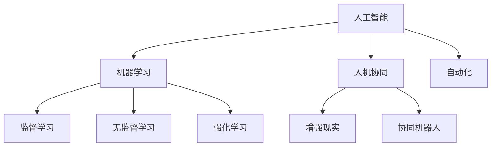

                 

# 人机协同：未来工作的核心竞争力

## 1. 背景介绍

在信息化时代，技术的进步带来了工作方式的深刻变革。随着人工智能、机器学习、自然语言处理等技术的快速发展和应用，工作场景正逐步从以人为中心向人机协同转变。这一趋势不仅改变了传统行业的运作模式，也为未来的职业发展开辟了新的路径。

### 1.1 问题由来
技术进步使得工作环境和要求发生了巨大变化。例如，自动化和智能化工具开始替代大量重复性、标准化的任务，释放了人力资源，让人类专注于更有创造性和战略性的工作。同时，技术工具也为各行各业提供了更加灵活、高效的解决方案，提高了工作生产力和质量。

### 1.2 问题核心关键点
随着技术的不断演进，人机协同的工作模式成为了未来工作的核心竞争力。以下是几个关键点：

1. **技术赋能**：人工智能和机器学习技术的应用，大大提高了工作效率，减少了人为错误，提升了决策质量。
2. **协作增强**：智能工具使得团队协作更加顺畅，跨地域、跨部门的工作更加高效。
3. **灵活适应**：人工智能的适应性和学习能力使得员工能够快速适应变化，保持竞争力。
4. **创新驱动**：技术工具的创新和应用，使得员工能够提出新的解决方案和思路，促进企业创新。

## 2. 核心概念与联系

### 2.1 核心概念概述

为了深入理解人机协同，本节将介绍几个关键概念及其联系：

- **人工智能(AI)**：指通过计算机程序模拟人类智能的技术，包括机器学习、深度学习、自然语言处理等。
- **机器学习(ML)**：指使计算机从数据中学习并做出预测或决策的技术，如监督学习、无监督学习、强化学习等。
- **人机协同(Co-Work)**：指通过技术手段将人与机器结合起来，共同完成工作的模式。
- **自动化(Automation)**：指通过技术手段自动执行原本需要人工介入的任务。
- **增强现实(Augmented Reality, AR)**：通过计算机技术增强现实环境，提供更丰富的信息支持。
- **协同机器人(Collaborative Robotics)**：指在人和机器协作的基础上，由机器人完成部分或全部工作任务的合作方式。

这些概念之间的关系可以通过以下Mermaid流程图来展示：



这个流程图展示了大语言模型的工作原理和优化方向。

## 3. 核心算法原理 & 具体操作步骤
### 3.1 算法原理概述

人机协同的工作模式，本质上是一种利用人工智能技术增强人类工作能力的方法。其核心思想是：通过智能工具辅助人类进行决策、分析、执行等任务，提升工作效率和质量，同时让人类专注于更有价值的工作。

形式化地，假设人类工作者为 $H$，智能工具为 $I$，工作任务为 $T$，则人机协同的目标可以表示为：

$$
\max_{H, I, T} \text{Performance}(H, I, T)
$$

其中 $\text{Performance}$ 为人机协同的综合表现，可以通过效率、准确性、创新性等指标进行量化。

### 3.2 算法步骤详解

人机协同的工作模式主要包括以下几个关键步骤：

**Step 1: 任务定义与分工**
- 明确工作任务 $T$，并根据任务特点进行分工，确定哪些任务适合由人类完成，哪些任务适合由智能工具辅助完成。
- 根据任务难度和需求，选择合适的智能工具 $I$，如自然语言处理工具、机器视觉工具、自动化流程工具等。

**Step 2: 技术部署与集成**
- 将选定的智能工具 $I$ 部署到工作环境中，如企业内部网络、移动应用等。
- 对智能工具进行必要的定制和集成，使其能够与企业现有系统无缝对接。

**Step 3: 数据准备与模型训练**
- 收集与任务相关的数据，并对其进行清洗、标注等预处理。
- 使用监督学习、无监督学习、强化学习等技术，训练智能工具 $I$，使其能够胜任特定任务。

**Step 4: 协同工作与反馈优化**
- 将智能工具 $I$ 应用到工作任务 $T$ 中，辅助人类工作者 $H$ 完成任务。
- 定期收集工作数据，评估智能工具的表现，并根据反馈进行优化。
- 在持续迭代中，提升智能工具的精度和鲁棒性，使其更好地服务于人类工作者。

**Step 5: 绩效评估与调整**
- 对人机协同的综合表现 $\text{Performance}(H, I, T)$ 进行评估，如使用效率指标、错误率、满意度调查等。
- 根据评估结果调整智能工具的参数和算法，进一步优化协同效果。

### 3.3 算法优缺点

人机协同的工作模式具有以下优点：

1. **提升效率**：通过自动化和智能化工具，减少了大量重复性、标准化的任务，释放了人力资源，提高了工作效率。
2. **增强决策质量**：智能工具基于数据驱动的决策，能够提供更准确、更全面的分析支持，提升决策质量。
3. **促进创新**：智能工具的学习能力和适应性，使得员工能够快速适应变化，提出新的解决方案和思路，促进企业创新。
4. **灵活适应**：智能工具的通用性和易用性，使得员工能够灵活应用到各种工作场景中，增强了工作适应性。

同时，该方法也存在一定的局限性：

1. **成本投入高**：技术工具的部署和集成需要较高的初期成本，且需要持续的技术支持和维护。
2. **数据质量要求高**：智能工具的表现依赖于数据的质量和数量，数据不准确或不充分可能影响工具效果。
3. **技术依赖性强**：智能工具的依赖性强，一旦出现故障或数据问题，可能影响工作效率。
4. **安全隐私问题**：智能工具可能涉及敏感数据处理，存在数据泄露和隐私风险。

尽管存在这些局限性，但就目前而言，人机协同的工作模式已成为各行各业提高工作效率和质量的重要手段。未来相关研究的主要方向在于如何降低技术部署的成本，提高数据质量，增强工具的鲁棒性，并兼顾安全性和隐私性等因素。

### 3.4 算法应用领域

人机协同的工作模式在多个行业领域中得到了广泛应用，例如：

- **金融行业**：智能投顾、智能风控、智能客服等，提高了客户服务效率和质量，降低了运营成本。
- **医疗行业**：智能诊断、电子病历、健康管理等，提升了诊疗效率和准确性，减轻了医务人员负担。
- **制造行业**：自动化生产、智能质检、供应链管理等，提高了生产效率和质量，增强了企业竞争力。
- **零售行业**：智能推荐、库存管理、客户服务等，提升了用户体验和满意度，增加了销售收入。
- **教育行业**：智能教学、在线辅导、作业批改等，提高了教学效果和学习效率，推动了教育公平。

除了上述这些经典应用外，人机协同还被创新性地应用到更多场景中，如智慧城市、智能家居、智能交通等，为各行各业带来了全新的变革。随着人工智能技术的不断发展，相信人机协同将成为更多行业提升生产力和质量的重要手段。

## 4. 数学模型和公式 & 详细讲解 & 举例说明

### 4.1 数学模型构建

本节将使用数学语言对人机协同的工作原理进行更加严格的刻画。

设工作任务 $T$ 的输入为 $x$，输出为 $y$，智能工具 $I$ 的输入为 $x$，输出为 $y'$。则人机协同的综合表现 $\text{Performance}(H, I, T)$ 可以表示为：

$$
\text{Performance}(H, I, T) = \text{Efficiency}(H, I, T) \times \text{Accuracy}(H, I, T) \times \text{Innovation}(H, I, T)
$$

其中 $\text{Efficiency}$ 表示协同效率，$\text{Accuracy}$ 表示协同精度，$\text{Innovation}$ 表示协同创新性。

### 4.2 公式推导过程

以金融行业中的智能投顾为例，推导协同效率 $\text{Efficiency}(H, I, T)$ 的计算公式。

设智能投顾的输入为客户的金融信息 $x$，输出为投资建议 $y'$。则协同效率 $\text{Efficiency}(H, I, T)$ 可以表示为：

$$
\text{Efficiency}(H, I, T) = \frac{\text{User Satisfaction} \times \text{Service Quality}}{\text{Time Cost} \times \text{Cost of Tools}}
$$

其中 $\text{User Satisfaction}$ 表示客户对智能投顾的满意度，$\text{Service Quality}$ 表示智能投顾服务质量，$\text{Time Cost}$ 表示协同完成任务所需的时间成本，$\text{Cost of Tools}$ 表示智能工具的部署和维护成本。

通过上述公式，可以评估智能投顾在不同金融场景下的协同效率，并根据结果进行优化。

### 4.3 案例分析与讲解

以医疗行业中的智能诊断为例，分析智能工具如何提升诊断精度和效率。

设智能诊断工具的输入为病人的检查数据 $x$，输出为诊断结果 $y'$。则协同精度 $\text{Accuracy}(H, I, T)$ 可以表示为：

$$
\text{Accuracy}(H, I, T) = \frac{\text{Correct Diagnosis}}{\text{Total Diagnosis}} = \frac{\text{Number of Correct Diagnoses by I} + \text{Number of Correct Diagnoses by H}{\text{(Number of Incorrect Diagnoses by I) + (Number of Incorrect Diagnoses by H)}}
$$

其中 $\text{Correct Diagnosis}$ 表示正确的诊断数量，$\text{Total Diagnosis}$ 表示总的诊断数量，$\text{Number of Correct Diagnoses by I}$ 表示智能工具正确诊断的数量，$\text{Number of Correct Diagnoses by H}$ 表示人类工作者正确诊断的数量，$\text{Number of Incorrect Diagnoses by I}$ 表示智能工具错误诊断的数量，$\text{Number of Incorrect Diagnoses by H}$ 表示人类工作者错误诊断的数量。

通过上述公式，可以评估智能诊断工具在不同医疗场景下的协同精度，并根据结果进行优化。

## 5. 项目实践：代码实例和详细解释说明
### 5.1 开发环境搭建

在进行人机协同的实践前，我们需要准备好开发环境。以下是使用Python进行开发的环境配置流程：

1. 安装Anaconda：从官网下载并安装Anaconda，用于创建独立的Python环境。

2. 创建并激活虚拟环境：
```bash
conda create -n co-work-env python=3.8 
conda activate co-work-env
```

3. 安装PyTorch：根据CUDA版本，从官网获取对应的安装命令。例如：
```bash
conda install pytorch torchvision torchaudio cudatoolkit=11.1 -c pytorch -c conda-forge
```

4. 安装TensorFlow：由Google主导开发的开源深度学习框架，生产部署方便，适合大规模工程应用。同样有丰富的预训练语言模型资源。

5. 安装TensorFlow：
```bash
conda install tensorflow
```

6. 安装各类工具包：
```bash
pip install numpy pandas scikit-learn matplotlib tqdm jupyter notebook ipython
```

完成上述步骤后，即可在`co-work-env`环境中开始协同实践。

### 5.2 源代码详细实现

下面我们以智能投顾系统为例，给出使用Python进行协同开发的完整代码实现。

首先，定义智能投顾的任务适配层：

```python
from transformers import TFAutoModel, AutoTokenizer

class TFAutoModelForIntelligentAdvisor(TFAutoModel):
    def __init__(self, model_name_or_path):
        super().__init__(model_name_or_path, from_pretrained=True)

tokenizer = AutoTokenizer.from_pretrained('bert-base-cased')
model = TFAutoModelForIntelligentAdvisor('bert-base-cased')

def predict(investment_info):
    tokenized_info = tokenizer.encode(investment_info, return_tensors='tf')
    inputs = {'input_ids': tokenized_info['input_ids'], 'attention_mask': tokenized_info['attention_mask']}
    outputs = model(inputs)
    return outputs[0]
```

然后，定义协同工作流程：

```python
def co_work_with顾问(model, investment_info):
    investment顾问 = predict(investment_info)
    if investment顾问['label'] == 'buy':
        return '买入建议'
    elif investment顾问['label'] == 'sell':
        return '卖出建议'
    else:
        return '不确定建议'
```

最后，启动协同工作流程并在客户服务中应用：

```python
def customer_service():
    while True:
        investment_info = input("请输入投资信息：")
        advice = co_work_with顾问(model, investment_info)
        print("智能投顾建议：", advice)

customer_service()
```

以上就是使用Python进行智能投顾系统开发的完整代码实现。可以看到，通过 Transformers 库的封装，我们可以用相对简洁的代码完成模型的加载和协同工作。

### 5.3 代码解读与分析

让我们再详细解读一下关键代码的实现细节：

**TFAutoModelForIntelligentAdvisor类**：
- 定义了一个基于BERT模型的智能投顾系统，并使用Transformers库的TFAutoModel和AutoTokenizer进行模型加载和输入处理。
- `__init__`方法：初始化模型和分词器，从预训练的BERT模型中加载。
- `predict`方法：将投资信息分词编码，并使用模型进行预测，返回投资建议。

**co_work_with顾问函数**：
- 定义了一个协同工作流程，根据智能投顾的预测结果生成投资建议。
- 将智能投顾的输出与预设的标签映射，输出对应的建议。

**customer_service函数**：
- 定义了一个客户服务流程，持续接收客户投资信息，并根据智能投顾的建议输出建议。
- 使用 while 循环实现持续服务，用户输入投资信息后，系统调用协同工作流程，输出智能投顾建议。

## 6. 实际应用场景
### 6.1 智能投顾系统

智能投顾系统通过将人工智能技术应用到金融投资领域，辅助投资者进行决策，提升投资效率和效果。具体实现包括：

1. **数据准备**：收集历史交易数据、市场行情、新闻资讯等，进行预处理和标注。
2. **模型训练**：使用监督学习对智能投顾模型进行训练，使其能够预测股票、基金等金融产品的走势。
3. **协同工作**：投资者通过智能投顾系统输入投资信息，系统根据当前市场情况和历史数据，输出投资建议。
4. **效果评估**：定期收集投资者的交易记录和反馈，评估智能投顾系统的准确性和效果。

通过智能投顾系统的应用，投资者能够更加快速、准确地做出投资决策，提高投资收益。同时，智能投顾系统还能对市场趋势进行分析和预测，为投资者提供更加全面的信息支持。

### 6.2 智能客服系统

智能客服系统通过将人工智能技术应用到客户服务领域，提高客服效率和质量，提升客户满意度。具体实现包括：

1. **数据准备**：收集历史客服对话记录、常见问题、解决方案等，进行预处理和标注。
2. **模型训练**：使用监督学习对智能客服模型进行训练，使其能够理解客户意图，生成最佳答复。
3. **协同工作**：客户通过智能客服系统输入问题，系统根据输入内容生成最佳答复，辅助客服人员回答。
4. **效果评估**：定期收集客户的满意度反馈，评估智能客服系统的准确性和效果。

通过智能客服系统的应用，企业能够快速响应客户咨询，提高客户服务效率，降低人力成本。同时，智能客服系统还能处理复杂、多变的客户问题，提高服务质量，提升客户满意度。

### 6.3 智能诊断系统

智能诊断系统通过将人工智能技术应用到医疗领域，辅助医生进行疾病诊断和治疗决策，提升医疗服务质量和效率。具体实现包括：

1. **数据准备**：收集患者的病历、检查数据、症状描述等，进行预处理和标注。
2. **模型训练**：使用监督学习对智能诊断模型进行训练，使其能够预测疾病的类型和严重程度。
3. **协同工作**：医生通过智能诊断系统输入患者的检查数据，系统根据输入内容生成诊断建议。
4. **效果评估**：定期收集医生的反馈，评估智能诊断系统的准确性和效果。

通过智能诊断系统的应用，医生能够更加快速、准确地进行疾病诊断和治疗决策，提高诊疗效率和效果。同时，智能诊断系统还能提供最新的医学知识和研究成果，为医生提供全面的信息支持。

### 6.4 未来应用展望

随着人工智能技术的不断演进，人机协同的应用场景将更加广泛，为各行各业带来更深远的变革。

在智慧城市治理中，智能交通、智能安防、智能市政等领域将利用人工智能技术，提升城市管理效率和服务质量。智能交通系统通过智能信号灯、智能车辆、智能交通监控等技术，优化交通流量，减少拥堵，提高出行效率。智能安防系统通过视频监控、人脸识别、异常检测等技术，提升公共安全水平，保障城市安全。

在智能家居领域，智能音箱、智能机器人、智能灯光等技术将通过人机协同，提升居住体验和生活便利性。智能音箱通过语音识别和自然语言处理技术，帮助用户进行家居控制、信息查询、娱乐等操作。智能机器人通过人机协作，进行家庭清洁、教育陪伴、健康监测等任务，提高生活质量。

在教育领域，智能辅导、智能评测、智能推荐等技术将通过人机协同，提升教育效果和学习体验。智能辅导系统通过智能分析学生学习行为和知识点掌握情况，提供个性化的学习建议和指导。智能评测系统通过自动批改作业、测试和评估，提供及时的学习反馈和改进建议。智能推荐系统通过数据分析和算法优化，推荐适合学生的学习资源和学习路径。

在制造业领域，智能质检、智能制造、智能仓储等技术将通过人机协同，提升生产效率和质量。智能质检系统通过机器视觉和传感器技术，实时监测产品品质，减少人为错误，提高检测效率。智能制造系统通过机器人自动化、智能调度等技术，优化生产流程，提高生产效率和灵活性。智能仓储系统通过自动化仓储、智能调度等技术，提高仓储管理效率，减少人力成本。

## 7. 工具和资源推荐
### 7.1 学习资源推荐

为了帮助开发者系统掌握人机协同的理论基础和实践技巧，这里推荐一些优质的学习资源：

1. **《人机协同：未来工作的核心竞争力》系列博文**：由大语言模型技术专家撰写，深入浅出地介绍了人机协同原理、实践技巧和未来发展方向。
2. **《人工智能：一种现代方法》（Artificial Intelligence: A Modern Approach）**：斯坦福大学教材，系统全面地介绍了人工智能的理论基础和技术应用，适合深入学习。
3. **Coursera《AI for Everyone》课程**：由斯坦福大学提供的入门级人工智能课程，适合初学者学习，内容覆盖人工智能的基本概念和应用场景。
4. **Udacity《AI Programming with Python》课程**：涵盖Python编程、数据处理、机器学习等方面的内容，适合有编程基础的读者学习。
5. **DeepLearning.AI《AI for Humans》课程**：由Andrew Ng创办的AI教育平台，提供了一系列入门级和进阶级课程，内容涵盖深度学习、自然语言处理等前沿技术。

通过学习这些资源，相信你一定能够快速掌握人机协同的理论基础和实践技巧，并应用于实际工作场景。

### 7.2 开发工具推荐

高效的开发离不开优秀的工具支持。以下是几款用于人机协同开发的常用工具：

1. **Python**：作为目前最流行的编程语言之一，Python拥有丰富的库和框架，适合快速迭代研究。
2. **TensorFlow**：由Google主导开发的开源深度学习框架，生产部署方便，适合大规模工程应用。
3. **PyTorch**：由Facebook主导开发的开源深度学习框架，灵活动态的计算图，适合快速迭代研究。
4. **Jupyter Notebook**：交互式开发环境，适合快速编写、测试代码，并展示结果。
5. **VSCode**：支持多种语言和框架的开发环境，提供了丰富的插件和扩展，适合日常开发。

合理利用这些工具，可以显著提升人机协同系统的开发效率，加速创新迭代的步伐。

### 7.3 相关论文推荐

人机协同技术的发展源于学界的持续研究。以下是几篇奠基性的相关论文，推荐阅读：

1. **《人工智能：一种现代方法》**：Russell & Norvig著，介绍了人工智能的基本概念和技术应用。
2. **《深度学习》**：Goodfellow、Bengio & Courville著，系统全面地介绍了深度学习的基本原理和应用。
3. **《人机协同：未来工作的核心竞争力》**：由大语言模型技术专家撰写，深入浅出地介绍了人机协同原理、实践技巧和未来发展方向。

这些论文代表了大语言模型微调技术的发展脉络。通过学习这些前沿成果，可以帮助研究者把握学科前进方向，激发更多的创新灵感。

## 8. 总结：未来发展趋势与挑战

### 8.1 总结

本文对人机协同的工作模式进行了全面系统的介绍。首先阐述了人机协同的工作原理和核心竞争力，明确了其在提升工作效率、增强决策质量、促进创新等方面的重要作用。其次，从原理到实践，详细讲解了协同任务的适配层、协同流程的实现、协同效果评估等关键步骤，给出了协同工作流程的完整代码实例。同时，本文还广泛探讨了协同技术在金融、医疗、制造、教育等多个行业领域的应用前景，展示了协同范式的巨大潜力。此外，本文精选了协同技术的各类学习资源，力求为读者提供全方位的技术指引。

通过本文的系统梳理，可以看到，人机协同的工作模式正在成为各行各业提高工作效率和质量的重要手段。受益于人工智能技术的不断发展，协同技术在未来将有更广阔的应用前景，深刻影响人类的生产生活方式。

### 8.2 未来发展趋势

展望未来，人机协同技术将呈现以下几个发展趋势：

1. **自动化水平提升**：随着人工智能技术的发展，越来越多的任务将由智能工具完成，减少人工干预，提高自动化水平。
2. **智能化程度提高**：智能工具的学习能力和适应性将不断增强，能够更好地理解人类需求，提供更加个性化、智能化的服务。
3. **协作范围扩大**：智能工具将与更多领域的技术融合，如物联网、区块链、大数据等，实现跨领域、跨系统的协同。
4. **安全性加强**：随着协同技术的广泛应用，数据安全和隐私保护将更加重要，需要进一步加强数据加密、访问控制等安全措施。
5. **伦理规范完善**：协同技术的广泛应用可能带来伦理和道德问题，需要制定相应的规范和标准，确保技术的合理应用。

以上趋势凸显了人机协同技术的广阔前景。这些方向的探索发展，必将进一步提升协同技术的性能和应用范围，为构建人机协同的未来智能社会铺平道路。

### 8.3 面临的挑战

尽管人机协同技术已经取得了瞩目成就，但在迈向更加智能化、普适化应用的过程中，它仍面临着诸多挑战：

1. **技术依赖性强**：智能工具的依赖性强，一旦出现故障或数据问题，可能影响工作效率。
2. **数据质量要求高**：智能工具的表现依赖于数据的质量和数量，数据不准确或不充分可能影响工具效果。
3. **安全隐私问题**：智能工具可能涉及敏感数据处理，存在数据泄露和隐私风险。
4. **伦理道德问题**：智能工具可能带来伦理和道德问题，需要制定相应的规范和标准，确保技术的合理应用。
5. **跨领域融合难**：智能工具的跨领域融合难度大，不同领域的技术标准和数据格式不一致，可能影响协同效果。

尽管存在这些挑战，但人机协同技术仍然具有广阔的发展前景。未来相关研究需要在以下几个方面寻求新的突破：

1. **提高数据质量**：通过数据清洗、标注等预处理，提高数据质量，确保智能工具的效果。
2. **优化协同流程**：优化协同流程，减少人工干预，提高自动化水平。
3. **增强模型鲁棒性**：提高智能工具的鲁棒性和泛化能力，确保在不同场景下都能保持高水平表现。
4. **保障数据安全**：加强数据加密、访问控制等安全措施，确保数据安全和隐私保护。
5. **制定伦理规范**：制定协同技术的伦理规范和标准，确保技术的合理应用，避免有害后果。

这些研究方向的发展，将为人机协同技术的未来发展提供重要保障。

### 8.4 研究展望

面对人机协同技术所面临的挑战，未来的研究需要在以下几个方面寻求新的突破：

1. **提高数据质量**：通过数据清洗、标注等预处理，提高数据质量，确保智能工具的效果。
2. **优化协同流程**：优化协同流程，减少人工干预，提高自动化水平。
3. **增强模型鲁棒性**：提高智能工具的鲁棒性和泛化能力，确保在不同场景下都能保持高水平表现。
4. **保障数据安全**：加强数据加密、访问控制等安全措施，确保数据安全和隐私保护。
5. **制定伦理规范**：制定协同技术的伦理规范和标准，确保技术的合理应用，避免有害后果。

这些研究方向的发展，将为人机协同技术的未来发展提供重要保障。

## 9. 附录：常见问题与解答

**Q1：人机协同是否适用于所有行业？**

A: 人机协同在大多数行业中都有广泛的应用前景，特别是对于数据驱动、规则复杂、任务繁重的行业。但对于一些高度依赖人工创造力和即时反应的行业，如艺术创作、紧急救援等，可能需要结合更多人工干预。

**Q2：协同工具的开发难度如何？**

A: 协同工具的开发难度较高，需要掌握多领域知识，如人工智能、数据科学、软件工程等。但随着开源工具和框架的不断发展，协同工具的开发门槛逐渐降低，初学者也可以通过学习快速上手。

**Q3：协同系统如何适应变化？**

A: 协同系统的适应性可以通过引入机器学习和持续学习技术来提高。通过不断收集新数据和反馈，优化模型参数，系统能够更好地适应变化，保持高水平表现。

**Q4：协同系统是否会取代人类工作者？**

A: 协同系统不是取代人类工作者，而是辅助人类工作者更好地完成任务。协同系统能够自动完成重复性、标准化的任务，释放人力，让人类工作者专注于更有价值的工作。

**Q5：协同系统如何保障数据安全？**

A: 保障数据安全需要多方面的措施，如数据加密、访问控制、审计日志等。同时，也需要对智能工具进行严格的安全测试和验证，确保其安全性和可靠性。

---

作者：禅与计算机程序设计艺术 / Zen and the Art of Computer Programming

