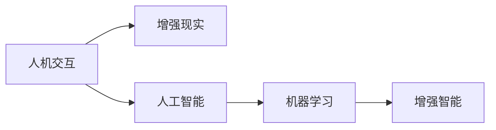
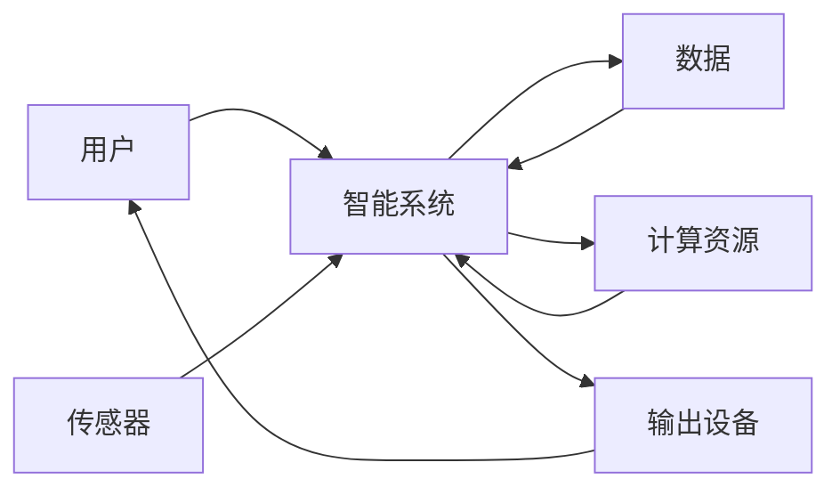

                 

# 人机协同：迈向智能增强的新时代

## 1. 背景介绍

### 1.1 问题由来

在现代社会中，人类与机器的相互依赖和协作已经达到了前所未有的高度。智能增强（Smart Augmentation）作为一项前沿技术，正引领着人类进入一个新的时代，其中人机协同（Human-Machine Collaboration）是智能增强的核心主题之一。这种协同不仅提升了工作效率，也拓展了人类认知和创造的边界。本文章将深入探讨人机协同的原理与实践，以期为未来技术发展提供有价值的见解。

### 1.2 问题核心关键点

- **人机协同**：指通过机器辅助，提升人类能力的过程，涵盖从物理交互到认知增强的各个层面。
- **智能增强**：利用人工智能技术提升人类能力的实践，旨在解决复杂问题、优化决策过程。
- **增强智能**：指通过人机协同技术，使机器具备更强的人类认知能力，如推理、理解、创新等。
- **人机融合**：结合人类与机器的长处，形成新的工作模式，提升整体效能。

人机协同技术的应用遍及医疗、教育、制造、交通等多个领域，其发展前景广阔，但同时也面临诸多挑战，如系统集成、数据安全、人机交互等。理解并解决这些问题，对于推进人机协同技术的深度发展至关重要。

### 1.3 问题研究意义

人机协同技术的发展，对提升社会生产力和生活质量具有重要意义：

1. **生产效率提升**：通过自动化和智能化手段，减轻人类体力和脑力负担，提高生产效率。
2. **知识共享与创新**：促进知识与信息的流动，加速新知识、新产品的产生。
3. **决策支持**：通过数据分析和预测模型，提供科学决策依据。
4. **风险管理**：利用机器学习和数据挖掘技术，预测和防范风险。
5. **人机融合工作环境**：构建和谐的人机交互界面，提升工作体验。

### 1.4 人机协同的发展历程

人机协同的发展经历了几个重要阶段：

- **初级阶段**：以简单的交互设备（如键盘、鼠标）为主，侧重于数据输入与输出。
- **中级阶段**：引入初步的智能助手，辅助完成复杂任务，如文档整理、数据分析等。
- **高级阶段**：通过人机深度融合，实现任务的自动化与智能化，达到高效协同的目的。

当前，人工智能技术的突破使得人机协同进入高级阶段，智能增强技术的应用日益广泛，展现了无限潜力。

## 2. 核心概念与联系

### 2.1 核心概念概述

为更好地理解人机协同的原理和架构，本节将介绍几个关键概念及其关系：

- **人机交互（Human-Machine Interaction, HMI）**：指人与计算机之间的通信，涉及用户输入、机器输出和交互界面。
- **增强现实（Augmented Reality, AR）**：通过计算机视觉和传感器技术，将虚拟信息叠加在现实世界中。
- **人工智能（Artificial Intelligence, AI）**：使计算机具备类似于人类的智能和决策能力。
- **机器学习（Machine Learning, ML）**：机器通过数据学习，提升对未知数据的预测和处理能力。
- **增强智能（Augmented Intelligence, AI）**：结合人类与机器的长处，提升整体智能水平。

这些概念之间的关系可以用以下Mermaid流程图表示：



### 2.2 核心概念原理和架构的 Mermaid 流程图



这个流程图展示了人机协同的基本架构，用户与智能系统通过数据交互，系统利用传感器、计算资源和输出设备，实现对用户的智能增强。

## 3. 核心算法原理 & 具体操作步骤

### 3.1 算法原理概述

人机协同的算法原理主要围绕以下几个核心问题展开：

- **数据融合**：将来自不同来源的数据进行集成和处理，提升信息的质量和可用性。
- **信息传递**：设计高效的通信协议，实现人机之间信息的实时传递和处理。
- **智能决策**：利用机器学习技术，优化决策过程，提高决策的准确性和效率。

人机协同的核心算法可以分为两大类：

- **感知与理解**：通过图像处理、语音识别等技术，将用户的输入转化为机器可以处理的形式。
- **智能决策与反馈**：结合机器学习和推理，生成响应，并对结果进行反馈和优化。

### 3.2 算法步骤详解

人机协同的算法步骤一般包括以下几个关键步骤：

**Step 1: 数据采集与预处理**

- 收集用户输入数据（如文本、语音、图像等）。
- 对数据进行清洗、去噪和标准化处理，提高数据质量。

**Step 2: 数据融合与集成**

- 将不同来源的数据进行集成，建立数据融合模型。
- 利用机器学习算法（如深度学习、集成学习等），对集成后的数据进行分析和处理。

**Step 3: 信息传递与通信**

- 设计高效的信息传输协议，实现人机之间的实时通信。
- 利用网络技术（如Wi-Fi、蓝牙等），将数据在用户和智能系统之间传递。

**Step 4: 智能决策与反馈**

- 结合机器学习算法，对用户输入进行理解和推理。
- 生成智能响应，并将结果反馈给用户。
- 根据反馈信息，优化模型和算法，提升系统性能。

**Step 5: 系统集成与优化**

- 将不同模块和组件集成到统一的系统中。
- 通过调参和优化，提升系统性能和用户体验。

### 3.3 算法优缺点

人机协同的算法具有以下优点：

- **高效性**：利用计算机的快速处理能力，提升决策和反应速度。
- **准确性**：通过机器学习算法，提高决策的精度和可靠性。
- **可扩展性**：系统可以根据需求灵活扩展和升级。
- **用户友好**：通过交互界面设计，提升用户体验。

同时，该算法也存在一些局限性：

- **数据依赖**：需要大量高质量的数据支持。
- **技术复杂性**：涉及多个技术领域，开发和维护难度较大。
- **安全风险**：数据泄露和隐私问题可能影响用户信任。
- **交互瓶颈**：用户与机器之间的交互界面设计需要不断优化。

### 3.4 算法应用领域

人机协同技术在多个领域得到了广泛应用，例如：

- **医疗领域**：利用智能系统进行疾病诊断、治疗方案推荐等。
- **教育领域**：通过智能助手辅助教学，提高教学效果。
- **制造业**：利用智能设备进行质量控制、设备维护等。
- **金融领域**：通过智能系统进行风险评估、交易策略优化等。
- **交通领域**：利用智能导航系统，提升行车安全与效率。
- **智能家居**：通过智能设备实现家庭自动化管理。

## 4. 数学模型和公式 & 详细讲解 & 举例说明

### 4.1 数学模型构建

在人机协同过程中，数学模型扮演着重要的角色，常见的数学模型包括：

- **线性回归模型**：用于建立输入与输出之间的关系。
- **决策树模型**：通过树形结构，对数据进行分类和预测。
- **神经网络模型**：模拟人脑神经元的工作原理，进行复杂模式识别和处理。
- **支持向量机（SVM）**：通过核函数，将数据映射到高维空间进行分类。

### 4.2 公式推导过程

以神经网络模型为例，其基本公式为：

$$
y = f(x; \theta)
$$

其中，$y$ 为输出，$x$ 为输入，$\theta$ 为模型参数，$f$ 为激活函数。神经网络通过多个层次的加权求和和激活函数，对输入数据进行处理和映射。

### 4.3 案例分析与讲解

以医疗诊断为例，可以通过神经网络模型，将患者的症状（输入）与疾病诊断结果（输出）关联起来。通过大量的医疗数据进行训练，模型可以预测患者的疾病类型，辅助医生进行诊断。

## 5. 项目实践：代码实例和详细解释说明

### 5.1 开发环境搭建

在进行人机协同项目实践前，我们需要准备好开发环境。以下是使用Python进行TensorFlow开发的环境配置流程：

1. 安装Anaconda：从官网下载并安装Anaconda，用于创建独立的Python环境。

2. 创建并激活虚拟环境：
```bash
conda create -n tf-env python=3.7 
conda activate tf-env
```

3. 安装TensorFlow：根据CUDA版本，从官网获取对应的安装命令。例如：
```bash
conda install tensorflow -c tf -c conda-forge
```

4. 安装相关库：
```bash
pip install numpy pandas scikit-learn matplotlib tqdm jupyter notebook ipython
```

完成上述步骤后，即可在`tf-env`环境中开始项目开发。

### 5.2 源代码详细实现

这里我们以医疗诊断项目为例，给出使用TensorFlow进行开发的完整代码实现。

首先，定义模型结构：

```python
import tensorflow as tf

model = tf.keras.Sequential([
    tf.keras.layers.Dense(128, activation='relu', input_shape=(8,)),
    tf.keras.layers.Dense(64, activation='relu'),
    tf.keras.layers.Dense(1, activation='sigmoid')
])
```

接着，定义数据集：

```python
import numpy as np
from sklearn.datasets import load_breast_cancer

data = load_breast_cancer().data
labels = load_breast_cancer().target

X_train = data[:300]
X_test = data[300:]
y_train = labels[:300]
y_test = labels[300:]
```

然后，编译模型并进行训练：

```python
model.compile(optimizer='adam', loss='binary_crossentropy', metrics=['accuracy'])

model.fit(X_train, y_train, epochs=10, batch_size=32)
```

最后，评估模型并进行预测：

```python
model.evaluate(X_test, y_test)
predictions = model.predict(X_test)
```

这就是一个完整的医疗诊断项目开发流程，利用TensorFlow构建神经网络模型，并使用Breast Cancer数据集进行训练和预测。

### 5.3 代码解读与分析

让我们再详细解读一下关键代码的实现细节：

**模型结构定义**：
- 使用`tf.keras.Sequential`构建神经网络模型，包含三个全连接层，分别有128、64、1个神经元，并使用ReLU和sigmoid激活函数。

**数据集定义**：
- 使用`load_breast_cancer`函数从scikit-learn库中加载Breast Cancer数据集。
- 将数据集分为训练集和测试集，并指定模型输入维度为8。

**模型编译与训练**：
- 使用`compile`函数设置优化器、损失函数和评价指标。
- 使用`fit`函数进行模型训练，并指定训练轮数为10，批次大小为32。

**模型评估与预测**：
- 使用`evaluate`函数评估模型在测试集上的表现。
- 使用`predict`函数对测试集进行预测，并返回概率值。

这些代码展示了如何使用TensorFlow进行神经网络模型的开发和训练，项目实践需要根据具体需求进行调整和优化。

## 6. 实际应用场景

### 6.1 医疗诊断

人机协同技术在医疗诊断中的应用，可以显著提升诊断效率和准确性。通过智能系统，医生可以更快地获得患者的病情分析、治疗方案推荐等信息，减少误诊和漏诊。

在实践中，可以采集患者的症状描述、历史病历等数据，利用神经网络模型进行训练和预测。通过多轮反馈和优化，系统可以逐步提升诊断的准确性和可靠性。

### 6.2 教育辅助

智能教育系统可以通过人机协同技术，提供个性化的教学方案，帮助学生更好地理解和掌握知识。

在项目实践中，可以采集学生的学习行为数据（如答题记录、学习时间等），利用机器学习算法对学生进行分析，生成个性化学习计划。系统可以根据学生的学习进度和理解能力，动态调整教学内容和难度，提升学习效果。

### 6.3 智能交通

智能交通系统通过人机协同技术，可以实现智能导航、交通管制等功能，提升交通运行效率，降低交通事故。

在项目实践中，可以采集车辆的位置、速度、交通流量等数据，利用深度学习算法进行分析和预测。系统可以实时生成最优的行驶路径和交通管制策略，提升交通安全和效率。

### 6.4 未来应用展望

随着人机协同技术的不断发展，其应用场景将越来越广泛，前景广阔。未来，人机协同技术有望在以下领域得到更多应用：

- **智慧城市**：通过智能系统进行城市管理、公共服务优化等。
- **智能制造**：利用智能设备进行生产监控、质量检测等。
- **虚拟现实（VR）/增强现实（AR）**：结合AR技术，提升用户体验和沉浸感。
- **金融服务**：通过智能系统进行风险评估、交易决策等。
- **智能家居**：通过智能设备实现家庭自动化管理。
- **医疗健康**：利用智能系统进行疾病预防、健康管理等。

## 7. 工具和资源推荐

### 7.1 学习资源推荐

为了帮助开发者系统掌握人机协同的理论基础和实践技巧，这里推荐一些优质的学习资源：

1. **《深度学习》课程**：斯坦福大学开设的深度学习课程，涵盖深度学习的基本概念和算法。

2. **《人机协同系统》书籍**：介绍人机协同技术的基本原理和应用实践，适合初学者和实践者。

3. **TensorFlow官方文档**：提供TensorFlow的详细使用指南和样例代码，是学习TensorFlow的重要资源。

4. **OpenAI的论文和博客**：OpenAI在人工智能和机器学习领域的最新研究和实践，涵盖多个前沿话题。

5. **arXiv论文库**：收集最新的机器学习和人工智能研究论文，适合研究者和开发者参考。

通过对这些资源的学习实践，相信你一定能够快速掌握人机协同的精髓，并用于解决实际的智能增强问题。

### 7.2 开发工具推荐

高效的工具支持是开发人机协同系统的关键。以下是几款用于开发推荐的常用工具：

1. **TensorFlow**：由Google主导开发的深度学习框架，灵活性高，适合深度学习模型的开发和训练。

2. **PyTorch**：Facebook开发的深度学习框架，易于使用，适合研究和实验。

3. **Keras**：一个高层次的深度学习API，提供了简单易用的接口，适合快速开发原型。

4. **OpenCV**：计算机视觉库，提供丰富的图像处理功能，适合计算机视觉项目开发。

5. **ROS（Robot Operating System）**：机器人操作系统，支持多种传感器和硬件设备，适合机器人项目开发。

6. **Jupyter Notebook**：交互式编程环境，支持代码编辑、运行和可视化展示。

合理利用这些工具，可以显著提升人机协同系统的开发效率，加快创新迭代的步伐。

### 7.3 相关论文推荐

人机协同技术的不断发展得益于学界的持续研究。以下是几篇奠基性的相关论文，推荐阅读：

1. **《深度学习与人工智能》论文**：综述了深度学习和人工智能的基本概念和算法，适合初学者和研究者。

2. **《人机协同系统》论文**：介绍人机协同技术的基本原理和应用实践，适合开发人员和项目经理。

3. **《强化学习与人机协同》论文**：探讨强化学习在人机协同中的应用，适合研究者和开发者。

4. **《人机协同中的交互设计》论文**：讨论人机交互设计的基本原则和实践，适合设计师和开发者。

5. **《智能增强与人类认知》论文**：探讨智能增强对人类认知的影响，适合心理学家和工程师。

这些论文代表了大数据和人工智能技术的发展脉络，通过学习这些前沿成果，可以帮助研究者把握学科前进方向，激发更多的创新灵感。

## 8. 总结：未来发展趋势与挑战

### 8.1 总结

本文对人机协同的原理与实践进行了全面系统的介绍。首先阐述了人机协同的基本概念和重要性，明确了人机协同在提升社会生产力和生活质量方面的价值。其次，从原理到实践，详细讲解了人机协同的数学模型和算法步骤，给出了人机协同任务开发的完整代码实例。同时，本文还广泛探讨了人机协同在医疗、教育、交通等多个领域的应用前景，展示了人机协同范式的巨大潜力。此外，本文精选了人机协同技术的各类学习资源，力求为读者提供全方位的技术指引。

通过本文的系统梳理，可以看到，人机协同技术正在成为人工智能技术的重要范式，极大地拓展了人类认知和创造的边界。未来，伴随技术的不断进步和应用场景的拓展，人机协同必将在更多领域大放异彩，为人类认知智能的进化带来深远影响。

### 8.2 未来发展趋势

展望未来，人机协同技术将呈现以下几个发展趋势：

1. **技术融合深化**：人机协同技术将与其他前沿技术（如量子计算、区块链等）深度融合，推动整体技术进步。

2. **智能增强普及**：智能增强技术将逐渐普及到更多行业和领域，提升整体社会效率。

3. **用户个性化定制**：通过用户反馈和优化，人机协同系统将更加个性化和定制化，满足不同用户的需求。

4. **跨领域协作**：人机协同系统将突破领域界限，实现跨领域的协作与创新。

5. **人机共生**：人机协同系统将实现人机共生，人类和机器共同工作，提升整体效能。

6. **道德和伦理问题**：随着人机协同技术的普及，隐私、安全、伦理等道德问题将更加凸显，需要进一步研究和规范。

### 8.3 面临的挑战

尽管人机协同技术已经取得了瞩目成就，但在迈向更加智能化、普适化应用的过程中，它仍面临诸多挑战：

1. **数据隐私保护**：在采集和处理用户数据时，需要严格遵守隐私保护规定，避免数据泄露风险。

2. **系统安全性**：人机协同系统可能面临网络攻击、数据篡改等安全威胁，需要设计有效的防护机制。

3. **人机交互设计**：系统界面设计需要考虑用户体验，提升人机交互的自然性和流畅性。

4. **跨平台兼容性**：系统需要在不同平台（如手机、PC、机器人等）上实现无缝集成和协同。

5. **模型可解释性**：智能系统需要具备一定的可解释性，帮助用户理解其决策过程和推理逻辑。

6. **伦理和法律问题**：人机协同系统涉及诸多伦理和法律问题，如责任归属、隐私保护等，需要制定相应的法律法规。

### 8.4 研究展望

面对人机协同面临的挑战，未来的研究需要在以下几个方面寻求新的突破：

1. **数据隐私保护**：研究数据保护技术，保障用户隐私和数据安全。

2. **系统安全性**：开发安全防护机制，提升系统的鲁棒性和可靠性。

3. **用户交互设计**：设计更加自然和流畅的人机交互界面，提升用户体验。

4. **跨平台兼容性**：研究跨平台技术，实现不同平台上的无缝集成和协同。

5. **模型可解释性**：开发可解释性技术，提升智能系统的透明性和可信度。

6. **伦理和法律问题**：制定相应的伦理和法律规范，保障人机协同技术的健康发展。

这些研究方向将为人机协同技术的进一步发展和应用提供重要支撑，推动其走向更加成熟和可靠。

## 9. 附录：常见问题与解答

**Q1: 人机协同技术在医疗诊断中的应用主要有哪些？**

A: 人机协同技术在医疗诊断中的应用主要包括：

1. **疾病诊断**：利用智能系统对患者的症状进行分析和诊断，辅助医生快速诊断疾病。
2. **治疗方案推荐**：结合病历数据和最新研究成果，为患者推荐个性化的治疗方案。
3. **病情监测**：通过智能设备监测患者的生理指标，实时反馈健康状态，辅助医生进行跟踪和调整。
4. **数据管理**：自动化处理和分析病历数据，提高医疗数据的管理效率。

**Q2: 在开发人机协同系统时，如何保证系统的可扩展性和维护性？**

A: 保证系统的可扩展性和维护性，可以从以下几个方面入手：

1. **模块化设计**：将系统划分为多个独立的模块，每个模块负责一个特定功能，便于扩展和维护。
2. **接口设计**：设计清晰的接口规范，使得模块之间的交互更加方便和灵活。
3. **代码复用**：尽量复用已有的代码和组件，减少重复开发。
4. **文档和注释**：编写详细的文档和注释，帮助开发者理解和维护系统。
5. **版本控制**：使用版本控制工具（如Git），管理代码变更和协作。

**Q3: 如何提升智能系统的可解释性？**

A: 提升智能系统的可解释性，可以从以下几个方面入手：

1. **模型透明性**：选择可解释性更高的模型（如决策树、逻辑回归等），或者使用模型可视化工具（如TensorBoard），帮助理解模型的内部结构。
2. **规则与经验**：结合专家经验和规则，解释智能系统的决策过程。
3. **用户界面设计**：设计简单易懂的界面，帮助用户理解系统的输出结果。
4. **人机交互**：通过自然语言处理技术，与用户进行交互，解释系统的决策依据。

**Q4: 人机协同技术在智能交通中的应用主要有哪些？**

A: 人机协同技术在智能交通中的应用主要包括：

1. **智能导航**：通过智能系统实时获取道路状况、交通流量等信息，为司机提供最优行驶路线。
2. **交通管制**：利用智能系统监测交通流量，动态调整信号灯和限速，缓解交通拥堵。
3. **事故预警**：通过智能系统分析历史事故数据，预测潜在危险，提前采取防范措施。
4. **车辆监控**：利用智能设备实时监控车辆运行状态，提高行车安全。

**Q5: 人机协同技术在教育辅助中的应用主要有哪些？**

A: 人机协同技术在教育辅助中的应用主要包括：

1. **个性化教学**：通过智能系统分析学生的学习数据，生成个性化的学习计划和资源推荐。
2. **智能评估**：利用智能系统自动评估学生的作业和考试，提供及时反馈和建议。
3. **知识图谱构建**：结合知识图谱技术，提供丰富的知识查询和推理功能。
4. **虚拟实验**：利用虚拟现实技术，提供沉浸式的实验环境，增强学生的学习体验。

---

作者：禅与计算机程序设计艺术 / Zen and the Art of Computer Programming

