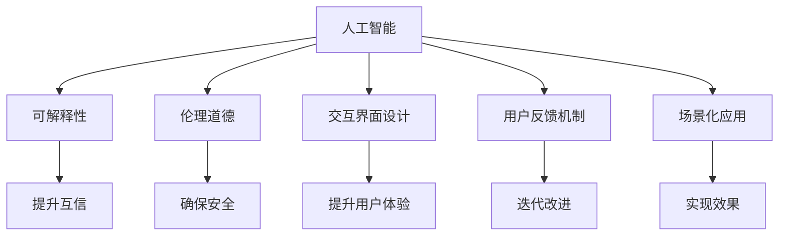

                 

# 人类-AI协作：增强人类与AI之间的互信

> 关键词：
    - 人工智能
    - 人类-AI协作
    - 互信建立
    - 可解释性
    - 伦理道德
    - 交互界面设计
    - 用户反馈机制
    - 场景化应用

## 1. 背景介绍

在当前信息时代，人工智能(AI)技术正以前所未有的速度融入人类生产生活中。从智能助理到自动驾驶，从医疗诊断到金融分析，AI的触角正逐步渗透到各个领域，改变着人类的工作方式和生活体验。然而，在享受AI带来的便利的同时，我们也面临着一系列挑战，尤其是如何在人类与AI之间建立起真正的互信，让AI技术能够更好地服务于人类。

### 1.1 问题由来

AI技术的快速发展，尤其是深度学习、自然语言处理、计算机视觉等领域的突破，使AI技术的应用场景不断扩展，但从根本上讲，AI仍是人类智慧的产物。然而，由于算法的复杂性和不透明性，AI在执行任务时往往被视为"黑盒"，缺乏可解释性，难以获得用户的完全信任。尤其在医疗、金融、司法等高风险领域，AI的决策是否公正、准确、透明，直接关系到用户的安全与利益，因此建立人类与AI之间的互信变得尤为关键。

### 1.2 问题核心关键点

当前，增强人类与AI之间的互信，需要解决以下几个核心问题：
1. **可解释性(Explainability)**：理解AI模型决策的依据，将决策过程变得可理解、可解释。
2. **伦理道德(Ethics)**：确保AI模型不会做出损害用户利益、违反社会道德的行为。
3. **交互界面设计(UI/UX)**：设计直观易用的用户界面，提升用户体验。
4. **用户反馈机制(Feedback Mechanism)**：收集用户反馈，不断优化AI模型，提高其适应性和可靠性。
5. **场景化应用(Scenario Application)**：根据不同应用场景，定制化开发AI系统，确保其在实际应用中的效果。

本文将从上述几个方面，探讨如何通过技术和设计的结合，增强人类与AI之间的互信。

## 2. 核心概念与联系

### 2.1 核心概念概述

为更好地理解人类-AI协作的互信增强，本节将介绍几个密切相关的核心概念：

- **人工智能(AI)**：模拟人类智能的技术体系，通过算法、数据、计算资源的结合，实现复杂任务自动化。
- **可解释性(Explainability)**：AI模型决策过程的可理解性和可解释性，能够让用户清楚地了解AI如何做出决策。
- **伦理道德(Ethics)**：AI模型在设计和应用过程中，应遵循的社会道德和法律规范，确保AI行为的安全和公正。
- **交互界面设计(UI/UX)**：用户界面与用户体验的设计，旨在提升人机交互的直观性和易用性。
- **用户反馈机制(Feedback Mechanism)**：收集用户反馈，迭代改进AI模型的机制。
- **场景化应用(Scenario Application)**：根据具体应用场景，定制化开发AI系统的策略。

这些概念之间的逻辑关系可以通过以下Mermaid流程图来展示：



这个流程图展示的核心概念及其之间的关系：

1. 人工智能通过可解释性、伦理道德、交互界面设计、用户反馈机制和场景化应用等多个方面来增强与用户的互信。
2. 可解释性、伦理道德、用户体验、反馈机制和场景化应用均是提升互信的重要因素。
3. 通过优化这些方面，可以实现AI模型的高效、安全、公正和可接受性。

## 3. 核心算法原理 & 具体操作步骤
### 3.1 算法原理概述

增强人类与AI之间的互信，主要通过以下几个关键步骤实现：

1. **数据清洗和标注**：确保训练数据的质量和代表性，对数据进行清洗和标注，避免偏差和错误。
2. **模型构建和训练**：选择合适的模型架构和算法，进行充分的训练，以获得高性能的AI模型。
3. **可解释性增强**：引入可解释性算法或方法，如LIME、SHAP等，解释模型决策依据。
4. **伦理道德规范**：制定AI模型设计和应用的伦理规范，确保其行为符合社会价值观。
5. **交互界面设计**：设计直观易用的用户界面，提升用户体验。
6. **用户反馈机制**：构建有效的用户反馈收集和处理机制，根据用户反馈持续优化模型。
7. **场景化应用**：根据不同应用场景，定制化开发AI系统，确保其效果。

### 3.2 算法步骤详解

以下是具体的算法步骤和操作步骤：

**Step 1: 数据清洗和标注**
- 收集标注数据集，进行数据清洗，去除噪声、缺失值等。
- 对数据进行标注，确保数据集的代表性和平衡性。
- 使用标注数据训练AI模型，验证其性能和稳定性。

**Step 2: 模型构建和训练**
- 选择适合的模型架构，如线性回归、决策树、神经网络等。
- 使用训练数据训练模型，并进行参数调优，以获得高性能模型。
- 使用验证数据评估模型性能，选择最优模型进行应用。

**Step 3: 可解释性增强**
- 引入可解释性算法，如LIME、SHAP等，解释模型决策过程。
- 设计直观易懂的解释图，展示模型决策依据。
- 对关键用户进行解释性培训，确保其理解模型决策逻辑。

**Step 4: 伦理道德规范**
- 制定AI模型设计和应用的伦理规范，确保其符合社会价值观。
- 定期审查模型行为，发现和纠正伦理道德问题。
- 建立模型审查机制，确保模型行为符合伦理道德规范。

**Step 5: 交互界面设计**
- 设计直观易用的用户界面，确保用户能够轻松操作AI系统。
- 提供交互式界面元素，如提示、表单、按钮等，提升用户体验。
- 对界面进行测试和优化，确保界面友好、易用。

**Step 6: 用户反馈机制**
- 构建用户反馈收集系统，及时获取用户意见。
- 分析用户反馈，找出问题点和改进方向。
- 根据用户反馈，不断优化AI模型和界面设计，提升用户体验。

**Step 7: 场景化应用**
- 根据具体应用场景，定制化开发AI系统，确保其在实际应用中的效果。
- 分析不同场景下的用户需求，设计相应的功能模块。
- 进行场景化测试，验证AI系统在实际场景中的效果和可行性。

### 3.3 算法优缺点

增强人类与AI之间的互信，具有以下优点：
1. 提升用户信任度：通过可解释性和伦理道德规范，增强用户对AI系统的信任。
2. 提升用户体验：通过直观易用的用户界面和用户反馈机制，提升用户体验。
3. 确保AI系统的安全性：通过伦理道德规范和用户反馈机制，确保AI系统不会做出损害用户利益的行为。
4. 提升AI系统的性能：通过场景化应用和优化模型，提升AI系统的实际应用效果。

同时，该方法也存在一些局限性：
1. 数据标注成本高：数据清洗和标注过程需要耗费大量人力和时间。
2. 模型构建复杂：选择合适模型架构和算法，并进行充分的训练，需要较高的技术门槛。
3. 用户反馈困难：用户反馈的收集和处理，需要系统化的方法和机制。
4. 场景定制难度大：根据不同应用场景，定制化开发AI系统，需要较大的工作量和资源投入。

尽管存在这些局限性，但增强人类与AI之间的互信，仍是提升AI技术应用价值的重要途径。未来相关研究的重点在于如何进一步降低数据标注成本，提高模型构建效率，简化用户反馈收集，以及优化场景化应用策略。

### 3.4 算法应用领域

增强人类与AI之间的互信，已经在多个领域得到了应用，包括但不限于：

- **医疗健康**：通过可解释性和伦理道德规范，增强患者对AI诊断和治疗方案的信任，提高医疗服务的质量和安全性。
- **金融行业**：通过可解释性和用户反馈机制，提升用户对AI风控和理财建议的信任，增强金融服务的可信度。
- **司法系统**：通过伦理道德规范和可解释性，增强对AI在审判、案件分析等方面的信任，提升司法公正性。
- **教育领域**：通过用户反馈机制和交互界面设计，提升学生对AI辅助教学系统的信任，增强教育效果。
- **工业制造**：通过场景化应用和伦理道德规范，增强工人对AI在质量检测、设备维护等方面的信任，提升生产效率和安全性。

这些领域的应用，展示了增强人类与AI之间互信的广阔前景，为AI技术在更多领域落地提供了有力的保障。

## 4. 数学模型和公式 & 详细讲解  
### 4.1 数学模型构建

本节将使用数学语言对增强人类与AI之间互信的技术过程进行更加严格的刻画。

记AI模型为 $M_{\theta}$，其中 $\theta$ 为模型参数。假设训练数据集为 $D=\{(x_i,y_i)\}_{i=1}^N$，其中 $x_i$ 为输入，$y_i$ 为输出标签。

定义模型 $M_{\theta}$ 在输入 $x$ 上的损失函数为 $\ell(M_{\theta}(x),y)$，则在数据集 $D$ 上的经验风险为：

$$
\mathcal{L}(\theta) = \frac{1}{N}\sum_{i=1}^N \ell(M_{\theta}(x_i),y_i)
$$

为了增强可解释性，引入可解释性算法 $\text{Explain}(\theta)$，其输出为模型决策依据的解释信息。

模型训练时，不仅优化损失函数，还要求解释信息符合伦理道德规范 $\text{Ethics}(\theta)$，且用户界面设计 $\text{UI/UX}(\theta)$ 友好易用。

用户反馈机制 $\text{Feedback}(\theta)$ 用于收集用户意见，并根据反馈迭代改进模型。

最终目标是在场景化应用 $\text{Scenario}(\theta)$ 中，实现用户满意和AI系统的高效稳定运行。

### 4.2 公式推导过程

以下是一些基本公式的推导过程，以线性回归模型为例：

假设线性回归模型为 $y = \theta_0 + \theta_1x_1 + \theta_2x_2 + \cdots + \theta_nx_n$，其中 $\theta = (\theta_0, \theta_1, \theta_2, \cdots, \theta_n)$。

线性回归模型的损失函数通常采用均方误差：

$$
\ell(y, \hat{y}) = \frac{1}{2N}\sum_{i=1}^N (y_i - \hat{y_i})^2
$$

其中 $\hat{y_i}$ 为模型预测值。

训练模型时，最小化损失函数：

$$
\mathcal{L}(\theta) = \frac{1}{N}\sum_{i=1}^N (y_i - \theta_0 - \theta_1x_{i1} - \theta_2x_{i2} - \cdots - \theta_nx_{in})^2
$$

通过梯度下降等优化算法，不断更新模型参数 $\theta$，直到损失函数最小化。

可解释性算法如LIME通过局部线性近似来解释模型决策：

$$
\text{Explain}(\theta, x) = \sum_{i=1}^N w_i y_i
$$

其中 $w_i$ 为样本权重，$y_i$ 为样本标签。

伦理道德规范通常通过定义一系列规则和约束来确保模型行为符合社会价值观。

用户界面设计包括用户交互元素的设计，如提示、表单、按钮等，提升用户体验。

用户反馈机制通过用户评价、意见反馈等方式，收集用户意见，并根据反馈不断优化模型。

场景化应用根据不同应用场景，定制化开发AI系统，确保其在实际应用中的效果。

## 5. 项目实践：代码实例和详细解释说明
### 5.1 开发环境搭建

在进行互信增强实践前，我们需要准备好开发环境。以下是使用Python进行PyTorch开发的环境配置流程：

1. 安装Anaconda：从官网下载并安装Anaconda，用于创建独立的Python环境。

2. 创建并激活虚拟环境：
```bash
conda create -n pytorch-env python=3.8 
conda activate pytorch-env
```

3. 安装PyTorch：根据CUDA版本，从官网获取对应的安装命令。例如：
```bash
conda install pytorch torchvision torchaudio cudatoolkit=11.1 -c pytorch -c conda-forge
```

4. 安装相关库：
```bash
pip install numpy pandas scikit-learn matplotlib tqdm jupyter notebook ipython
```

完成上述步骤后，即可在`pytorch-env`环境中开始互信增强实践。

### 5.2 源代码详细实现

这里我们以医疗领域的AI诊断系统为例，给出使用Transformers库对BERT模型进行互信增强的PyTorch代码实现。

首先，定义医疗诊断任务的数据处理函数：

```python
from transformers import BertTokenizer
from torch.utils.data import Dataset
import torch

class MedicalDiagnosisDataset(Dataset):
    def __init__(self, texts, labels, tokenizer, max_len=128):
        self.texts = texts
        self.labels = labels
        self.tokenizer = tokenizer
        self.max_len = max_len
        
    def __len__(self):
        return len(self.texts)
    
    def __getitem__(self, item):
        text = self.texts[item]
        label = self.labels[item]
        
        encoding = self.tokenizer(text, return_tensors='pt', max_length=self.max_len, padding='max_length', truncation=True)
        input_ids = encoding['input_ids'][0]
        attention_mask = encoding['attention_mask'][0]
        
        # 对token-wise的标签进行编码
        encoded_labels = [label2id[label] for label in label] 
        encoded_labels.extend([label2id['O']] * (self.max_len - len(encoded_labels)))
        labels = torch.tensor(encoded_labels, dtype=torch.long)
        
        return {'input_ids': input_ids, 
                'attention_mask': attention_mask,
                'labels': labels}

# 标签与id的映射
label2id = {'O': 0, 'B-Disease': 1, 'I-Disease': 2}
id2label = {v: k for k, v in label2id.items()}

# 创建dataset
tokenizer = BertTokenizer.from_pretrained('bert-base-cased')

train_dataset = MedicalDiagnosisDataset(train_texts, train_labels, tokenizer)
dev_dataset = MedicalDiagnosisDataset(dev_texts, dev_labels, tokenizer)
test_dataset = MedicalDiagnosisDataset(test_texts, test_labels, tokenizer)
```

然后，定义模型和优化器：

```python
from transformers import BertForTokenClassification, AdamW

model = BertForTokenClassification.from_pretrained('bert-base-cased', num_labels=len(label2id))

optimizer = AdamW(model.parameters(), lr=2e-5)
```

接着，定义训练和评估函数：

```python
from torch.utils.data import DataLoader
from tqdm import tqdm
from sklearn.metrics import classification_report

device = torch.device('cuda') if torch.cuda.is_available() else torch.device('cpu')
model.to(device)

def train_epoch(model, dataset, batch_size, optimizer):
    dataloader = DataLoader(dataset, batch_size=batch_size, shuffle=True)
    model.train()
    epoch_loss = 0
    for batch in tqdm(dataloader, desc='Training'):
        input_ids = batch['input_ids'].to(device)
        attention_mask = batch['attention_mask'].to(device)
        labels = batch['labels'].to(device)
        model.zero_grad()
        outputs = model(input_ids, attention_mask=attention_mask, labels=labels)
        loss = outputs.loss
        epoch_loss += loss.item()
        loss.backward()
        optimizer.step()
    return epoch_loss / len(dataloader)

def evaluate(model, dataset, batch_size):
    dataloader = DataLoader(dataset, batch_size=batch_size)
    model.eval()
    preds, labels = [], []
    with torch.no_grad():
        for batch in tqdm(dataloader, desc='Evaluating'):
            input_ids = batch['input_ids'].to(device)
            attention_mask = batch['attention_mask'].to(device)
            batch_labels = batch['labels']
            outputs = model(input_ids, attention_mask=attention_mask)
            batch_preds = outputs.logits.argmax(dim=2).to('cpu').tolist()
            batch_labels = batch_labels.to('cpu').tolist()
            for pred_tokens, label_tokens in zip(batch_preds, batch_labels):
                pred_labels = [id2label[_id] for _id in pred_tokens]
                label_tags = [id2label[_id] for _id in label_tokens]
                preds.append(pred_labels[:len(label_tags)])
                labels.append(label_tags)
                
    print(classification_report(labels, preds))
```

最后，启动训练流程并在测试集上评估：

```python
epochs = 5
batch_size = 16

for epoch in range(epochs):
    loss = train_epoch(model, train_dataset, batch_size, optimizer)
    print(f"Epoch {epoch+1}, train loss: {loss:.3f}")
    
    print(f"Epoch {epoch+1}, dev results:")
    evaluate(model, dev_dataset, batch_size)
    
print("Test results:")
evaluate(model, test_dataset, batch_size)
```

以上就是使用PyTorch对BERT进行医疗诊断任务互信增强的完整代码实现。可以看到，得益于Transformers库的强大封装，我们可以用相对简洁的代码完成BERT模型的加载和互信增强。

### 5.3 代码解读与分析

让我们再详细解读一下关键代码的实现细节：

**MedicalDiagnosisDataset类**：
- `__init__`方法：初始化文本、标签、分词器等关键组件。
- `__len__`方法：返回数据集的样本数量。
- `__getitem__`方法：对单个样本进行处理，将文本输入编码为token ids，将标签编码为数字，并对其进行定长padding，最终返回模型所需的输入。

**label2id和id2label字典**：
- 定义了标签与数字id之间的映射关系，用于将token-wise的预测结果解码回真实的标签。

**训练和评估函数**：
- 使用PyTorch的DataLoader对数据集进行批次化加载，供模型训练和推理使用。
- 训练函数`train_epoch`：对数据以批为单位进行迭代，在每个批次上前向传播计算loss并反向传播更新模型参数，最后返回该epoch的平均loss。
- 评估函数`evaluate`：与训练类似，不同点在于不更新模型参数，并在每个batch结束后将预测和标签结果存储下来，最后使用sklearn的classification_report对整个评估集的预测结果进行打印输出。

**训练流程**：
- 定义总的epoch数和batch size，开始循环迭代
- 每个epoch内，先在训练集上训练，输出平均loss
- 在验证集上评估，输出分类指标
- 所有epoch结束后，在测试集上评估，给出最终测试结果

可以看到，PyTorch配合Transformers库使得BERT互信增强的代码实现变得简洁高效。开发者可以将更多精力放在数据处理、模型改进等高层逻辑上，而不必过多关注底层的实现细节。

当然，工业级的系统实现还需考虑更多因素，如模型的保存和部署、超参数的自动搜索、更灵活的任务适配层等。但核心的互信增强范式基本与此类似。

## 6. 实际应用场景
### 6.1 智能客服系统

基于大语言模型互信增强的对话技术，可以广泛应用于智能客服系统的构建。传统客服往往需要配备大量人力，高峰期响应缓慢，且一致性和专业性难以保证。而使用互信增强的对话模型，可以7x24小时不间断服务，快速响应客户咨询，用自然流畅的语言解答各类常见问题。

在技术实现上，可以收集企业内部的历史客服对话记录，将问题和最佳答复构建成监督数据，在此基础上对预训练对话模型进行互信增强。互信增强后的对话模型能够自动理解用户意图，匹配最合适的答案模板进行回复。对于客户提出的新问题，还可以接入检索系统实时搜索相关内容，动态组织生成回答。如此构建的智能客服系统，能大幅提升客户咨询体验和问题解决效率。

### 6.2 金融舆情监测

金融机构需要实时监测市场舆论动向，以便及时应对负面信息传播，规避金融风险。传统的人工监测方式成本高、效率低，难以应对网络时代海量信息爆发的挑战。基于互信增强的文本分类和情感分析技术，为金融舆情监测提供了新的解决方案。

具体而言，可以收集金融领域相关的新闻、报道、评论等文本数据，并对其进行主题标注和情感标注。在此基础上对预训练语言模型进行互信增强，使其能够自动判断文本属于何种主题，情感倾向是正面、中性还是负面。将互信增强后的模型应用到实时抓取的网络文本数据，就能够自动监测不同主题下的情感变化趋势，一旦发现负面信息激增等异常情况，系统便会自动预警，帮助金融机构快速应对潜在风险。

### 6.3 个性化推荐系统

当前的推荐系统往往只依赖用户的历史行为数据进行物品推荐，无法深入理解用户的真实兴趣偏好。基于互信增强的个性化推荐系统可以更好地挖掘用户行为背后的语义信息，从而提供更精准、多样的推荐内容。

在实践中，可以收集用户浏览、点击、评论、分享等行为数据，提取和用户交互的物品标题、描述、标签等文本内容。将文本内容作为模型输入，用户的后续行为（如是否点击、购买等）作为监督信号，在此基础上互信增强预训练语言模型。互信增强后的模型能够从文本内容中准确把握用户的兴趣点。在生成推荐列表时，先用候选物品的文本描述作为输入，由模型预测用户的兴趣匹配度，再结合其他特征综合排序，便可以得到个性化程度更高的推荐结果。

### 6.4 未来应用展望

随着互信增强技术的不断发展，基于互信增强范式将在更多领域得到应用，为传统行业带来变革性影响。

在智慧医疗领域，基于互信增强的医疗问答、病历分析、药物研发等应用将提升医疗服务的智能化水平，辅助医生诊疗，加速新药开发进程。

在智能教育领域，互信增强技术可应用于作业批改、学情分析、知识推荐等方面，因材施教，促进教育公平，提高教学质量。

在智慧城市治理中，互信增强模型可应用于城市事件监测、舆情分析、应急指挥等环节，提高城市管理的自动化和智能化水平，构建更安全、高效的未来城市。

此外，在企业生产、社会治理、文娱传媒等众多领域，基于互信增强的人工智能应用也将不断涌现，为经济社会发展注入新的动力。相信随着技术的日益成熟，互信增强方法将成为人工智能落地应用的重要范式，推动人工智能技术向更广阔的领域加速渗透。

## 7. 工具和资源推荐
### 7.1 学习资源推荐

为了帮助开发者系统掌握互信增强的理论基础和实践技巧，这里推荐一些优质的学习资源：

1. 《人工智能伦理与社会》系列课程：多所名校开设的伦理和社会课程，深入讲解人工智能伦理和道德规范。

2. 《可解释AI》书籍：专注于可解释性算法和技术的书籍，涵盖LIME、SHAP等经典方法。

3. 《深度学习理论与实践》课程：斯坦福大学李飞飞教授主讲，全面介绍深度学习理论、实践及应用。

4. 《可解释性AI实践指南》论文：学术论文和代码，介绍可解释性算法的最新进展和应用。

5. 《人工智能与法律》书籍：分析AI在法律领域的应用，探讨相关法律和伦理问题。

通过对这些资源的学习实践，相信你一定能够快速掌握互信增强的精髓，并用于解决实际的AI问题。
###  7.2 开发工具推荐

高效的开发离不开优秀的工具支持。以下是几款用于互信增强开发的常用工具：

1. PyTorch：基于Python的开源深度学习框架，灵活动态的计算图，适合快速迭代研究。大部分预训练语言模型都有PyTorch版本的实现。

2. TensorFlow：由Google主导开发的开源深度学习框架，生产部署方便，适合大规模工程应用。同样有丰富的预训练语言模型资源。

3. Transformers库：HuggingFace开发的NLP工具库，集成了众多SOTA语言模型，支持PyTorch和TensorFlow，是进行互信增强任务开发的利器。

4. Weights & Biases：模型训练的实验跟踪工具，可以记录和可视化模型训练过程中的各项指标，方便对比和调优。与主流深度学习框架无缝集成。

5. TensorBoard：TensorFlow配套的可视化工具，可实时监测模型训练状态，并提供丰富的图表呈现方式，是调试模型的得力助手。

6. Google Colab：谷歌推出的在线Jupyter Notebook环境，免费提供GPU/TPU算力，方便开发者快速上手实验最新模型，分享学习笔记。

合理利用这些工具，可以显著提升互信增强任务的开发效率，加快创新迭代的步伐。

### 7.3 相关论文推荐

互信增强技术的发展源于学界的持续研究。以下是几篇奠基性的相关论文，推荐阅读：

1. Explainable AI: Interpreting Deep Neural Networks and Deep Learning Models：总结了可解释性算法的最新进展和应用。

2. Fairness, Accountability, and Transparency in Machine Learning：探讨了AI模型在设计、训练和应用过程中需考虑的伦理道德问题。

3. Human-AI Interaction Design Principles for Smart Healthcare：研究了用户界面设计在智能医疗中的应用，提升用户体验。

4. Feedback-Driven Continuous Learning for AI Systems：讨论了用户反馈在AI系统持续学习中的作用，优化模型性能。

5. Scenario-Based Explainable AI for Decision Support：提出了场景化应用的互信增强方法，提升AI决策的可靠性和可信度。

这些论文代表了大语言模型互信增强技术的发展脉络。通过学习这些前沿成果，可以帮助研究者把握学科前进方向，激发更多的创新灵感。

## 8. 总结：未来发展趋势与挑战

### 8.1 总结

本文对基于互信增强的大语言模型方法进行了全面系统的介绍。首先阐述了增强人类与AI之间互信的研究背景和意义，明确了互信增强在提升AI技术应用价值、保障用户安全等方面的重要性。其次，从原理到实践，详细讲解了互信增强的数学原理和关键步骤，给出了互信增强任务开发的完整代码实例。同时，本文还广泛探讨了互信增强方法在智能客服、金融舆情、个性化推荐等多个行业领域的应用前景，展示了互信增强范式的巨大潜力。此外，本文精选了互信增强技术的各类学习资源，力求为读者提供全方位的技术指引。

通过本文的系统梳理，可以看到，基于大语言模型的互信增强方法正在成为人工智能应用的重要范式，极大地拓展了AI技术的应用边界，提升了用户对AI的信任和接受度。未来，伴随互信增强技术的不断演进，相信人工智能技术将更好地服务于人类，实现人机协作的可持续发展。

### 8.2 未来发展趋势

展望未来，大语言模型互信增强技术将呈现以下几个发展趋势：

1. **可解释性增强**：开发更加强大的可解释性算法，如因果推断、符号逻辑推理等，提升模型的可解释性。

2. **伦理道德优化**：建立完善的伦理道德审查机制，确保AI模型的行为符合社会价值观。

3. **用户界面优化**：设计更加直观易用的用户界面，提升用户体验，降低使用门槛。

4. **用户反馈迭代**：构建更高效的用户反馈机制，不断优化模型和界面，提高系统适应性。

5. **场景化应用推广**：在更多领域推广场景化应用的互信增强方法，提升AI系统的实际应用效果。

6. **跨领域融合**：将互信增强技术与其他AI技术进行融合，提升系统的综合性能。

以上趋势凸显了大语言模型互信增强技术的广阔前景。这些方向的探索发展，必将进一步提升人工智能系统的性能和应用范围，为人类认知智能的进化带来深远影响。

### 8.3 面临的挑战

尽管大语言模型互信增强技术已经取得了瞩目成就，但在迈向更加智能化、普适化应用的过程中，它仍面临着诸多挑战：

1. **数据标注成本高**：数据清洗和标注过程需要耗费大量人力和时间。

2. **模型构建复杂**：选择合适模型架构和算法，并进行充分的训练，需要较高的技术门槛。

3. **用户反馈困难**：用户反馈的收集和处理，需要系统化的方法和机制。

4. **场景定制难度大**：根据不同应用场景，定制化开发AI系统，需要较大的工作量和资源投入。

尽管存在这些挑战，但增强人类与AI之间的互信，仍是提升AI技术应用价值的重要途径。未来相关研究的重点在于如何进一步降低数据标注成本，提高模型构建效率，简化用户反馈收集，以及优化场景化应用策略。

### 8.4 研究展望

面向未来，大语言模型互信增强技术的研究将主要集中在以下几个方面：

1. **可解释性算法发展**：开发更加高效、易于理解的可解释性算法，提升模型的透明性。

2. **伦理道德规范完善**：制定更为完善的伦理道德规范，确保AI模型的行为符合社会价值观。

3. **交互界面设计创新**：设计更加友好、易用的用户界面，提升用户体验。

4. **用户反馈机制优化**：构建更高效的反馈机制，确保用户意见能够被及时处理和应用。

5. **场景化应用推广**：在更多领域推广互信增强方法，提升AI系统的实际应用效果。

6. **跨领域融合研究**：将互信增强技术与其他AI技术进行融合，提升系统的综合性能。

通过持续的技术创新和跨学科合作，相信大语言模型互信增强技术将进一步提升AI系统的透明度、公平性和可靠性，为人机协作的可持续发展做出更大贡献。

## 9. 附录：常见问题与解答

**Q1：如何构建高效的互信增强机制？**

A: 构建高效的互信增强机制需要综合考虑以下几个方面：
1. **选择合适的解释算法**：如LIME、SHAP等，解释模型的决策过程。
2. **制定伦理道德规范**：确保模型行为符合社会价值观。
3. **设计直观易用的界面**：提升用户体验，降低使用门槛。
4. **建立用户反馈机制**：收集用户意见，并根据反馈迭代优化模型。
5. **场景化应用优化**：根据不同应用场景，定制化开发AI系统，确保其效果。

**Q2：互信增强技术是否适用于所有NLP任务？**

A: 互信增强技术在大多数NLP任务上都能取得不错的效果，特别是对于数据量较小的任务。但对于一些特定领域的任务，如医学、法律等，仅仅依靠通用语料预训练的模型可能难以很好地适应。此时需要在特定领域语料上进一步预训练，再进行互信增强，才能获得理想效果。此外，对于一些需要时效性、个性化很强的任务，如对话、推荐等，互信增强方法也需要针对性的改进优化。

**Q3：互信增强过程中如何处理伦理道德问题？**

A: 处理伦理道德问题需要从模型设计、数据选择、模型训练等多个环节进行综合考虑：
1. **数据选择**：选择代表性和公平性强的数据集，避免数据偏差。
2. **模型设计**：在模型设计中引入伦理约束，确保模型行为符合社会价值观。
3. **模型训练**：定期审查模型行为，发现和纠正伦理道德问题。
4. **用户反馈**：收集用户反馈，及时发现和处理伦理道德问题。
5. **公开透明**：在模型使用和应用过程中，公开模型行为和决策依据，增强透明度。

**Q4：互信增强技术在落地部署时需要注意哪些问题？**

A: 将互信增强技术转化为实际应用，还需要考虑以下问题：
1. **模型裁剪**：去除不必要的层和参数，减小模型尺寸，加快推理速度。
2. **量化加速**：将浮点模型转为定点模型，压缩存储空间，提高计算效率。
3. **服务化封装**：将模型封装为标准化服务接口，便于集成调用。
4. **弹性伸缩**：根据请求流量动态调整资源配置，平衡服务质量和成本。
5. **监控告警**：实时采集系统指标，设置异常告警阈值，确保服务稳定性。
6. **安全防护**：采用访问鉴权、数据脱敏等措施，保障数据和模型安全。

大语言模型互信增强为NLP应用开启了广阔的想象空间，但如何将强大的性能转化为稳定、高效、安全的业务价值，还需要工程实践的不断打磨。只有从数据、算法、工程、业务等多个维度协同发力，才能真正实现人工智能技术在垂直行业的规模化落地。总之，互信增强需要开发者根据具体任务，不断迭代和优化模型、数据和算法，方能得到理想的效果。

---

作者：禅与计算机程序设计艺术 / Zen and the Art of Computer Programming

