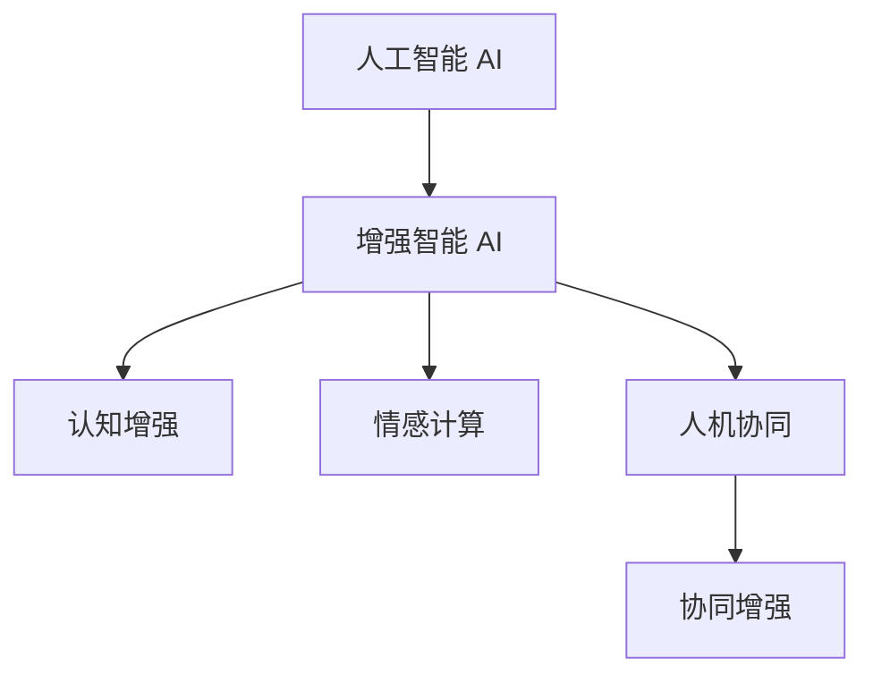

                 

# 人类-AI协作：增强人类潜能与AI能力的融合与进步

## 1. 背景介绍

### 1.1 问题由来

随着人工智能（AI）技术的飞速发展，AI与人类之间的协作已经成为科技发展的重要方向。AI在许多领域展示了其强大的计算能力和处理复杂任务的能力，尤其是在医疗、教育、金融、制造等行业，AI正逐渐成为提高工作效率、增强人类潜能的关键工具。

然而，AI的“智能”目前仍然远不及人类智慧的广度和深度。尽管在特定领域和任务上，AI已经表现出色，但在通用的、多变的环境中，AI往往显得“笨拙”。人类与AI的协作关系正在成为提升AI能力的关键，即利用人类智慧的优势来弥补AI的局限，从而实现二者的深度融合。

### 1.2 问题核心关键点

AI与人类协作的核心在于如何最大化AI的计算能力与人类智慧的创造力、判断力和灵活性的结合。目前，AI在以下几个方面展现出其与人类协作的潜力：

1. **问题解决能力**：AI在处理大量数据和复杂逻辑推理方面具有显著优势，尤其在医疗诊断、金融风险评估等领域，AI可以快速识别和预测异常情况。

2. **知识更新与积累**：AI可以高效地从大量文献和数据中学习，快速更新知识库，为人类提供最新的研究成果和信息。

3. **交互与辅助决策**：AI可以与人类进行自然语言交互，提供数据分析和建议，辅助人类进行决策，尤其在医疗诊断、法律咨询等需要高度专业知识的应用中。

4. **自动化与优化**：AI可以自动执行繁琐的、重复性的任务，提升效率，优化生产流程，如自动化设计、供应链管理等。

5. **创造性工作**：AI在艺术创作、科学研究等领域，已经展现出其创造性潜力，通过生成对抗网络（GAN）、自然语言生成（NLG）等技术，AI可以生成具有高度创意的作品和研究成果。

### 1.3 问题研究意义

研究AI与人类协作的融合与进步，对于推动AI技术的全面发展，提升人类工作效率和生活质量，具有重要意义：

1. **促进科技与人类社会的融合**：通过AI与人类智慧的结合，可以加速科技的落地应用，推动社会进步。

2. **提升工作效率与决策质量**：AI可以在特定领域为人类提供高效的支持，提升决策的准确性和效率。

3. **扩展人类的认知边界**：AI的强大计算能力可以处理人类无法处理的复杂问题，扩展人类的认知能力。

4. **促进学科交叉与创新**：AI与人类的协作可以推动跨学科的创新，如AI在医疗、教育、艺术等领域的融合应用。

5. **应对全球性挑战**：AI与人类协作可以应对气候变化、能源危机、公共卫生等全球性挑战，为全球可持续发展提供新思路。

## 2. 核心概念与联系

### 2.1 核心概念概述

为更好地理解AI与人类协作的融合与进步，本节将介绍几个密切相关的核心概念：

- **人工智能（AI）**：一种模拟人类智能行为的计算机程序或系统，具有感知、学习、推理、决策和自然语言处理等功能。

- **增强智能（Augmented Intelligence, AI）**：指通过AI技术增强人类能力，使人类能够更高效、更精确地完成工作，同时保留人类的创造力和灵活性。

- **认知增强（Cognitive Enhancement）**：指通过AI技术提高人类的认知能力，如增强记忆、提高学习能力、优化决策过程等。

- **情感计算（Affective Computing）**：指AI系统理解、处理人类情感的能力，包括语音情感识别、面部表情分析等。

- **人机协同（Human-AI Collaboration）**：指AI系统与人类共同协作完成复杂任务的过程，强调人类与AI的互补性。

- **协同增强（Collaborative Enhancement）**：指AI与人类在特定任务中相互配合，共同提升任务完成质量，如AI辅助医生诊断、智能客服等。

这些核心概念之间的逻辑关系可以通过以下Mermaid流程图来展示：



这个流程图展示了AI与人类协作的不同方面：

1. AI通过增强智能，提升人类的认知能力和决策质量。
2. 通过认知增强和情感计算，AI能够更好地理解人类需求，增强人类的工作体验。
3. 人机协同进一步推动AI与人类在具体任务中的深度融合，实现任务的高效完成。

## 3. 核心算法原理 & 具体操作步骤

### 3.1 算法原理概述

AI与人类协作的核心算法原理主要包括：

1. **数据驱动与知识驱动**：AI通过数据驱动学习模式，从大量数据中学习，提取知识规律；人类则通过知识驱动，利用专业知识进行决策和创造。

2. **计算能力与人类直觉**：AI擅长处理大量数据和复杂计算，而人类具有直觉、创造力和灵活性，能够处理复杂情感和不确定性问题。

3. **协同学习与协同决策**：AI与人类可以通过协同学习，共享知识和经验，共同进行决策，如医疗诊断、金融投资等。

4. **情感识别与反馈**：AI可以识别和处理人类情感，提供个性化服务和反馈，提高用户体验。

5. **混合智能与互补性**：AI与人类在各自擅长的领域进行协作，如AI处理数据分析，人类进行决策和创新。

### 3.2 算法步骤详解

AI与人类协作的融合与进步，通常包括以下关键步骤：

**Step 1: 确定协作目标**
- 确定AI与人类协作的具体目标和任务，明确AI在任务中的角色和作用。

**Step 2: 数据准备与特征提取**
- 收集和预处理与任务相关的数据，提取有用的特征，作为AI训练的基础。

**Step 3: AI模型设计与训练**
- 选择合适的AI模型，进行模型设计、训练和优化，确保模型能够满足任务需求。

**Step 4: 人机交互设计**
- 设计人机交互界面和交互逻辑，确保AI与人类能够顺畅地进行信息交换和协作。

**Step 5: 协同学习与反馈**
- 在实际应用中，AI与人类共同进行任务处理，实时提供反馈，优化AI的性能。

**Step 6: 任务执行与结果评估**
- 执行协同任务，评估任务结果，根据评估结果进行调整和优化。

**Step 7: 持续优化与迭代**
- 根据任务执行情况和反馈，持续优化AI模型和交互界面，实现迭代提升。

### 3.3 算法优缺点

AI与人类协作的融合与进步具有以下优点：

1. **提升工作效率**：AI可以处理大量重复性和繁琐的任务，解放人类时间，提升工作效率。

2. **增强决策质量**：AI通过数据分析，提供精准的信息支持，辅助人类进行决策，提升决策质量。

3. **创新与创造**：AI在特定领域可以生成新的想法和解决方案，推动人类在创新和创造方面的进步。

4. **个性化服务**：AI可以提供个性化服务，满足用户的个性化需求，提升用户体验。

5. **降低风险与成本**：AI可以通过数据分析，预测风险，降低决策和执行的风险和成本。

同时，该方法也存在一些局限性：

1. **依赖数据质量**：AI的性能高度依赖数据质量，数据偏差可能导致AI的决策偏差。

2. **缺乏情感理解**：当前AI在处理情感方面还存在局限，无法完全理解人类的情感需求。

3. **依赖专业人才**：AI与人类协作需要专业人才进行设计、开发和维护，成本较高。

4. **隐私和安全问题**：AI与人类协作涉及大量数据交换，存在隐私和数据安全问题。

5. **技术复杂性**：AI与人类协作需要综合考虑数据、模型、交互等多个因素，技术复杂性较高。

### 3.4 算法应用领域

AI与人类协作的应用领域非常广泛，以下是几个典型的应用场景：

- **医疗领域**：AI辅助医生进行诊断、治疗计划制定和病患管理，提高医疗效率和质量。

- **教育领域**：AI提供个性化学习方案、智能辅导和评估，提升教育效果和学生体验。

- **金融领域**：AI辅助金融分析师进行风险评估、投资决策和市场分析，提升金融服务质量。

- **制造领域**：AI优化生产流程、预测维护需求和提高生产效率，提升制造业的智能化水平。

- **城市管理**：AI辅助城市管理者进行交通管理、环境监测和公共安全，提升城市管理效率。

## 4. 数学模型和公式 & 详细讲解 & 举例说明

### 4.1 数学模型构建

在AI与人类协作中，通常使用机器学习模型来模拟人类的决策和行为。以下是一个简单的线性回归模型的数学模型构建：

假设数据集为 $D=\{(x_i, y_i)\}_{i=1}^N$，其中 $x_i$ 为输入特征， $y_i$ 为输出结果，模型为 $y = \theta_0 + \theta_1 x_1 + ... + \theta_n x_n$，其中 $\theta$ 为模型参数。

损失函数为：

$$
\mathcal{L}(\theta) = \frac{1}{N} \sum_{i=1}^N (y_i - (\theta_0 + \theta_1 x_{i1} + ... + \theta_n x_{in}))^2
$$

通过梯度下降等优化算法，最小化损失函数 $\mathcal{L}(\theta)$，得到最优参数：

$$
\hat{\theta} = \mathop{\arg\min}_{\theta} \mathcal{L}(\theta)
$$

### 4.2 公式推导过程

以线性回归为例，推导模型参数 $\theta$ 的梯度：

$$
\frac{\partial \mathcal{L}(\theta)}{\partial \theta_j} = \frac{2}{N} \sum_{i=1}^N (y_i - \theta_0 - \theta_1 x_{i1} - ... - \theta_n x_{in})(-2x_{ij})
$$

在得到模型参数的梯度后，即可带入梯度下降算法，更新模型参数，实现模型的迭代优化。

### 4.3 案例分析与讲解

假设在医疗诊断中，AI辅助医生进行疾病预测。数据集包含患者的年龄、性别、症状等特征，以及是否患病的标签。

- **数据准备**：收集患者数据，并进行特征提取和标准化处理。

- **模型设计**：使用线性回归模型，设计预测算法，并使用梯度下降算法优化模型参数。

- **模型评估**：在测试集上评估模型的准确率、召回率、F1分数等指标，根据评估结果调整模型参数。

- **协同决策**：医生在AI的辅助下进行疾病预测，根据AI的预测结果和自身经验进行综合判断，最终确定诊断结果。

## 5. 项目实践：代码实例和详细解释说明

### 5.1 开发环境搭建

在进行AI与人类协作的融合与进步实践前，我们需要准备好开发环境。以下是使用Python进行PyTorch开发的环境配置流程：

1. 安装Anaconda：从官网下载并安装Anaconda，用于创建独立的Python环境。

2. 创建并激活虚拟环境：
```bash
conda create -n ai-env python=3.8 
conda activate ai-env
```

3. 安装PyTorch：根据CUDA版本，从官网获取对应的安装命令。例如：
```bash
conda install pytorch torchvision torchaudio cudatoolkit=11.1 -c pytorch -c conda-forge
```

4. 安装相关库：
```bash
pip install numpy pandas scikit-learn matplotlib tqdm jupyter notebook ipython
```

完成上述步骤后，即可在`ai-env`环境中开始协作实践。

### 5.2 源代码详细实现

下面我们以医疗诊断任务为例，给出使用PyTorch进行AI与人类协作的代码实现。

首先，定义医疗诊断任务的数据处理函数：

```python
import pandas as pd
import numpy as np
from sklearn.model_selection import train_test_split

def load_data(path):
    data = pd.read_csv(path)
    return data

def preprocess_data(data):
    features = data.drop('label', axis=1)
    labels = data['label']
    return features, labels

def train_test_split(features, labels, test_size=0.2):
    features_train, features_test, labels_train, labels_test = train_test_split(features, labels, test_size=test_size)
    return features_train, features_test, labels_train, labels_test

# 加载数据
data = load_data('data.csv')

# 数据预处理
features, labels = preprocess_data(data)

# 划分训练集和测试集
features_train, features_test, labels_train, labels_test = train_test_split(features, labels)
```

然后，定义模型和优化器：

```python
import torch
import torch.nn as nn
import torch.optim as optim

class Model(nn.Module):
    def __init__(self, input_dim, output_dim):
        super(Model, self).__init__()
        self.linear = nn.Linear(input_dim, output_dim)

    def forward(self, x):
        x = self.linear(x)
        return x

# 模型参数初始化
input_dim = features_train.shape[1]
output_dim = 1
model = Model(input_dim, output_dim)

# 定义优化器
optimizer = optim.SGD(model.parameters(), lr=0.01)
```

接着，定义训练和评估函数：

```python
import torch.nn.functional as F

def train_model(model, features_train, labels_train, features_test, labels_test, epochs=100):
    loss_fn = nn.MSELoss()
    for epoch in range(epochs):
        model.train()
        optimizer.zero_grad()
        predictions = model(features_train)
        loss = loss_fn(predictions, labels_train)
        loss.backward()
        optimizer.step()

        model.eval()
        predictions = model(features_test)
        test_loss = loss_fn(predictions, labels_test)
        return test_loss

# 训练模型
test_loss = train_model(model, features_train, labels_train, features_test, labels_test)
print(f'Test Loss: {test_loss:.4f}')
```

最后，运行代码并输出结果：

```python
# 加载数据
data = load_data('data.csv')

# 数据预处理
features, labels = preprocess_data(data)

# 划分训练集和测试集
features_train, features_test, labels_train, labels_test = train_test_split(features, labels)

# 模型定义与训练
input_dim = features_train.shape[1]
output_dim = 1
model = Model(input_dim, output_dim)
optimizer = optim.SGD(model.parameters(), lr=0.01)
test_loss = train_model(model, features_train, labels_train, features_test, labels_test)
print(f'Test Loss: {test_loss:.4f}')
```

以上就是使用PyTorch进行AI与人类协作融合的代码实现。通过这段代码，我们可以看到AI与人类协作的基本流程，包括数据准备、模型定义、训练和评估。

### 5.3 代码解读与分析

让我们再详细解读一下关键代码的实现细节：

**load_data函数**：
- 加载CSV格式的数据集，返回特征和标签。

**preprocess_data函数**：
- 对数据进行特征提取和标签处理，返回处理后的特征和标签。

**train_test_split函数**：
- 对数据进行训练集和测试集的划分，返回划分后的训练集和测试集。

**Model类**：
- 定义线性回归模型，包括线性层。

**train_model函数**：
- 定义损失函数、训练过程和模型评估，使用SGD优化器进行模型训练。

通过这段代码的解读，可以更清晰地理解AI与人类协作的模型训练和评估流程。开发者可以根据具体任务需求，灵活调整模型参数和优化策略。

## 6. 实际应用场景

### 6.1 智能客服系统

智能客服系统是AI与人类协作的典型应用场景之一。智能客服系统利用AI处理大量客户咨询，提供实时响应和解决方案。同时，系统还可以记录客户的反馈，进行数据分析，不断优化模型和提升服务质量。

在技术实现上，智能客服系统通常由以下几个模块组成：

1. **语音识别与自然语言处理**：将客户的语音转换成文字，并使用NLP技术进行语义理解和对话管理。

2. **知识库与推荐系统**：使用知识图谱和推荐算法，为客户提供最合适的解决方案。

3. **情感分析与情感识别**：利用情感计算技术，识别客户的情绪，提供更加人性化的服务。

4. **实时反馈与优化**：系统实时记录客户反馈，通过数据分析，不断优化AI模型和服务流程。

### 6.2 医疗诊断系统

AI与人类协作在医疗诊断中具有重要应用。AI可以辅助医生进行疾病预测、治疗方案制定和病患管理。同时，医生也可以利用AI的数据分析和报告，进行更精确的诊断和治疗。

在技术实现上，医疗诊断系统通常由以下几个模块组成：

1. **症状识别与疾病预测**：使用AI模型，识别患者的症状和体征，预测可能的疾病类型。

2. **治疗方案生成与优化**：根据AI的预测结果和医生的经验，生成最合适的治疗方案，并进行优化。

3. **病患管理与监测**：使用AI进行病患的实时监测和管理，提供个性化的医疗建议。

4. **医学研究与知识库**：利用AI进行医学数据分析和知识图谱构建，辅助医学研究。

### 6.3 智能财务系统

智能财务系统利用AI进行金融数据的处理和分析，提供风险评估、投资建议和财务报告。同时，系统还可以与人类会计师和金融分析师协同工作，提供更加精准的财务分析和决策支持。

在技术实现上，智能财务系统通常由以下几个模块组成：

1. **数据清洗与处理**：使用AI技术清洗和处理大量的金融数据，提取有用的信息。

2. **风险评估与投资分析**：使用AI进行金融风险评估和投资分析，提供精准的投资建议。

3. **财务报告生成**：使用AI自动生成财务报告，辅助会计师和分析师进行财务分析。

4. **人机协同决策**：系统提供AI分析结果，供人类会计师和分析师参考，辅助决策。

## 7. 工具和资源推荐

### 7.1 学习资源推荐

为了帮助开发者系统掌握AI与人类协作的融合与进步的理论基础和实践技巧，这里推荐一些优质的学习资源：

1. **深度学习课程**：斯坦福大学的CS231n深度学习课程，涵盖图像处理、自然语言处理等领域的基础知识。

2. **认知增强与情感计算**：《认知增强：AI与人类协作的未来》一书，全面介绍了认知增强和情感计算的最新研究进展。

3. **协同学习与协同决策**：《协同决策：人机协同的未来》一书，介绍了协同决策的数学模型和算法，以及实际应用案例。

4. **自然语言处理**：《自然语言处理综论》一书，全面介绍了NLP技术的基础知识和最新研究进展。

5. **人机交互**：《人机交互设计》一书，介绍了人机交互的基础知识和人机协作的设计原则。

6. **认知科学**：《认知心理学》一书，介绍了认知科学的基本理论和最新研究进展。

通过对这些资源的学习实践，相信你一定能够快速掌握AI与人类协作的精髓，并用于解决实际的NLP问题。

### 7.2 开发工具推荐

高效的开发离不开优秀的工具支持。以下是几款用于AI与人类协作开发的常用工具：

1. **PyTorch**：基于Python的开源深度学习框架，灵活动态的计算图，适合快速迭代研究。

2. **TensorFlow**：由Google主导开发的开源深度学习框架，生产部署方便，适合大规模工程应用。

3. **WeChat MiniProgram**：微信小程序平台，便于开发移动端AI应用。

4. **Amazon SageMaker**：AWS提供的AI平台，提供一站式模型训练、部署和优化服务。

5. **Google Cloud AI**：谷歌提供的AI平台，提供丰富的AI服务和工具，支持大规模模型训练和部署。

6. **Azure AI**：微软提供的AI平台，提供强大的AI计算能力和丰富的AI服务。

合理利用这些工具，可以显著提升AI与人类协作任务的开发效率，加快创新迭代的步伐。

### 7.3 相关论文推荐

AI与人类协作的发展源于学界的持续研究。以下是几篇奠基性的相关论文，推荐阅读：

1. **Deep Learning for Medical Decision Support**：介绍AI在医疗决策支持中的应用，包括疾病预测、治疗方案生成等。

2. **Human-AI Collaboration in Finance**：介绍AI在金融领域的协作应用，包括风险评估、投资决策等。

3. **Collaborative Enhancements with AI**：讨论AI与人类协作在多个领域的应用，包括医疗、教育、制造等。

4. **Cognitive Enhancement through AI**：讨论AI如何增强人类的认知能力，包括记忆、学习、决策等方面。

5. **Affective Computing in Human-AI Collaboration**：讨论AI如何理解和管理人类的情感，提升人机协作的体验。

这些论文代表了大AI与人类协作技术的发展脉络。通过学习这些前沿成果，可以帮助研究者把握学科前进方向，激发更多的创新灵感。

## 8. 总结：未来发展趋势与挑战

### 8.1 研究成果总结

本文对AI与人类协作的融合与进步进行了全面系统的介绍。首先阐述了AI与人类协作的研究背景和意义，明确了AI在特定领域和任务上的优势。其次，从原理到实践，详细讲解了AI与人类协作的数学模型和关键步骤，给出了协作实践的完整代码实例。同时，本文还广泛探讨了协作方法在智能客服、医疗诊断、智能财务等多个行业领域的应用前景，展示了协作范式的巨大潜力。此外，本文精选了协作技术的各类学习资源，力求为读者提供全方位的技术指引。

通过本文的系统梳理，可以看到，AI与人类协作的融合与进步正在成为推动科技发展的重要方向。AI在特定领域与人类协同，能够充分发挥计算能力和人类智慧的互补性，实现更高效、更精准、更人性化的任务处理。未来，随着AI技术的不断进步和应用场景的不断拓展，AI与人类协作必将在更多领域发挥重要作用。

### 8.2 未来发展趋势

展望未来，AI与人类协作的发展趋势包括：

1. **深度融合与协作增强**：AI与人类在更多领域和任务中进行深度融合，提升协作质量。

2. **多模态协同**：AI与人类在视觉、语音、文本等多模态数据上进行协同，提升人机交互体验。

3. **认知与情感增强**：通过AI技术增强人类的认知能力和情感理解能力，实现更智能化的协作。

4. **协同学习与反馈机制**：建立更加灵活的协同学习机制，实现AI与人类之间的持续优化。

5. **自动化与优化**：利用AI技术自动化处理更多复杂任务，提升工作效率和质量。

6. **跨领域应用**：AI与人类协作在更多垂直行业得到应用，推动各行各业的数字化转型。

### 8.3 面临的挑战

尽管AI与人类协作技术已经取得了显著进展，但在迈向更加智能化、普适化应用的过程中，仍面临诸多挑战：

1. **数据质量和隐私问题**：高质量数据是AI与人类协作的基础，但数据质量和隐私保护问题依然存在。

2. **技术复杂性与普适性**：AI与人类协作的技术复杂性较高，如何在不同领域和场景中推广应用，需要进一步探索。

3. **伦理与社会接受度**：AI与人类协作可能带来伦理和社会问题，如何平衡技术创新与伦理约束，需要持续关注。

4. **安全与风险管理**：AI与人类协作可能带来新的安全风险，如何保障系统的稳定性和安全性，需要深入研究。

5. **技术瓶颈与可扩展性**：AI与人类协作的技术瓶颈，如计算资源、存储能力等，需要持续优化和突破。

### 8.4 研究展望

面对AI与人类协作面临的挑战，未来的研究需要在以下几个方面寻求新的突破：

1. **数据治理与隐私保护**：探索数据治理和隐私保护的新方法，保障数据质量和隐私安全。

2. **跨领域协同学习**：研究跨领域协同学习机制，提升AI与人类协作在更多场景下的表现。

3. **情感计算与伦理导向**：研究情感计算和伦理导向的评估指标，提高AI与人类协作的公平性和透明度。

4. **混合智能与协同决策**：探索混合智能和协同决策的新方法，提升AI与人类协作的决策质量。

5. **人机交互界面优化**：研究更加智能的人机交互界面，提升用户体验和协作效果。

6. **实时性与反馈机制**：研究实时性协同机制，实现AI与人类之间的即时反馈和优化。

这些研究方向的探索，必将引领AI与人类协作技术迈向更高的台阶，为构建更加智能化、普适化的未来社会提供新的思路。

## 9. 附录：常见问题与解答

**Q1：AI与人类协作有哪些具体应用场景？**

A: AI与人类协作在多个领域都有具体应用场景，例如：

1. **医疗诊断**：AI辅助医生进行疾病预测和诊断，提升诊断准确性和效率。

2. **金融投资**：AI辅助金融分析师进行风险评估和投资决策，提高投资收益。

3. **教育培训**：AI提供个性化学习方案和智能辅导，提升教育效果。

4. **智能客服**：AI处理大量客户咨询，提供实时响应和解决方案。

5. **智能制造**：AI优化生产流程和管理，提高生产效率和质量。

6. **智能交通**：AI进行交通管理和调度，提升交通效率和安全性。

**Q2：AI与人类协作如何实现人机协同？**

A: AI与人类协作实现人机协同，主要包括以下几个步骤：

1. **数据准备**：收集和预处理任务相关的数据，提取有用的特征。

2. **模型设计**：选择合适的AI模型，进行模型设计、训练和优化。

3. **人机交互设计**：设计人机交互界面和交互逻辑，确保AI与人类能够顺畅地进行信息交换和协作。

4. **协同学习与反馈**：在实际应用中，AI与人类共同进行任务处理，实时提供反馈，优化AI的性能。

5. **协同决策与执行**：系统提供AI分析结果，供人类参考和决策，共同完成任务。

**Q3：AI与人类协作的模型训练有哪些关键技术？**

A: AI与人类协作的模型训练，主要包括以下关键技术：

1. **数据驱动与知识驱动**：利用数据驱动学习模式，从大量数据中学习，提取知识规律；利用知识驱动，利用专业知识进行决策和创造。

2. **计算能力与人类直觉**：AI擅长处理大量数据和复杂计算，而人类具有直觉、创造力和灵活性。

3. **协同学习与协同决策**：AI与人类可以通过协同学习，共享知识和经验，共同进行决策。

4. **情感识别与反馈**：AI可以识别和处理人类情感，提供个性化服务和反馈。

5. **混合智能与互补性**：AI与人类在各自擅长的领域进行协作，如AI处理数据分析，人类进行决策和创新。

这些关键技术的应用，能够有效提升AI与人类协作的效果和质量。

**Q4：AI与人类协作中如何保障数据隐私与安全？**

A: AI与人类协作中，数据隐私与安全问题尤为重要。以下是一些保障数据隐私与安全的方法：

1. **数据加密**：使用数据加密技术，保护数据的机密性和完整性。

2. **匿名化处理**：对数据进行匿名化处理，防止数据泄露和滥用。

3. **访问控制**：建立严格的访问控制机制，确保数据仅在必要情况下被访问。

4. **安全传输**：使用安全传输协议，如SSL/TLS，保护数据在传输过程中的安全性。

5. **数据审计**：定期进行数据审计，检测和修复潜在的安全漏洞。

6. **隐私保护技术**：采用差分隐私、联邦学习等隐私保护技术，保护用户隐私。

这些方法能够有效保障数据隐私与安全，确保AI与人类协作的顺利进行。

**Q5：AI与人类协作中如何处理情感计算？**

A: AI与人类协作中的情感计算，主要包括以下几个步骤：

1. **情感识别**：使用情感计算技术，识别人类的情绪和情感状态。

2. **情感理解**：AI理解人类的情感背景和情感表达，提供更加人性化的服务。

3. **情感反馈**：根据情感识别结果，AI提供相应的情感反馈和支持，提升用户体验。

4. **情感优化**：根据情感反馈，不断优化AI模型和服务流程，提升人机协作的质量。

情感计算在AI与人类协作中扮演重要角色，能够有效提升系统的智能化水平和用户体验。

---

作者：禅与计算机程序设计艺术 / Zen and the Art of Computer Programming

