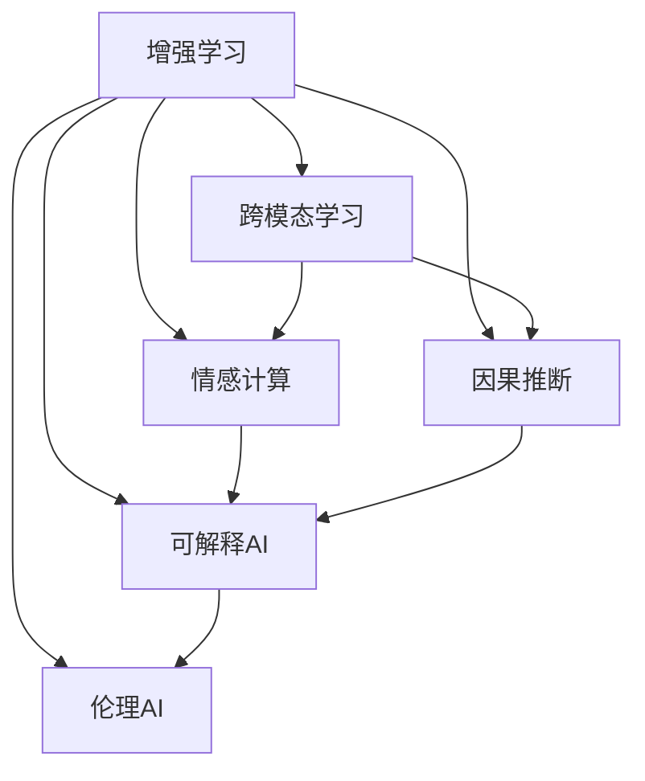

                 

## 1. 背景介绍

### 1.1 问题由来

随着人工智能（AI）技术的快速演进，AI在多个领域展现出了巨大潜力。AI与人类协作的新模式正在改变我们工作和生活的方式。然而，如何使AI与人类潜能融合，在最大化提升工作效率的同时，保持对人类价值观和伦理道德的尊重，成为了一个亟待解决的问题。

### 1.2 问题核心关键点

当前，AI在增强人类潜能方面的主要挑战包括：

1. **数据与算力依赖**：大多数AI应用需要大量标注数据和强大算力，这限制了其在小规模、资源有限的场景中的应用。
2. **模型解释性不足**：许多AI模型是"黑盒"系统，其决策过程难以解释，缺乏透明性和可信度。
3. **道德与伦理问题**：AI在决策过程中可能引入偏见和歧视，甚至可能被用于恶意目的，如自动假新闻生成。
4. **人机协作的平衡**：AI虽然能处理海量数据和复杂任务，但其自主性限制了其与人类协作的效果。

### 1.3 问题研究意义

解决这些问题不仅有助于提升AI的实用性和普及度，还能增强人类与AI之间的协作，创造更多社会价值。研究如何融合AI与人类潜能，对推动AI技术的可持续发展和广泛应用具有重要意义。

## 2. 核心概念与联系

### 2.1 核心概念概述

本节将介绍几个关键概念及其相互关系：

- **增强学习（Reinforcement Learning, RL）**：通过与环境互动，智能体通过试错学习最优策略的一种学习范式。在AI与人类协作中，可以将其用于优化人机协作流程。
- **跨模态学习（Cross-modal Learning）**：融合视觉、听觉、文本等多种模态数据，构建更加全面的知识表示。
- **情感计算（Affective Computing）**：利用AI技术识别和分析人类的情感状态，提升人机互动的情感亲和力。
- **因果推断（Causal Inference）**：基于因果关系进行推理和决策，提高AI决策的稳定性和可解释性。
- **可解释AI（Explainable AI, XAI）**：通过增强模型的可解释性，提升AI决策的可信任度和可接受度。
- **伦理AI（Ethical AI）**：确保AI技术在设计、训练和应用过程中遵循伦理道德准则，避免潜在的负面影响。

这些概念之间相互联系，共同构成了AI与人类协作的基础架构。通过理解这些概念，我们可以更好地把握AI与人类潜能融合的趋势和机遇。

### 2.2 核心概念原理和架构的 Mermaid 流程图



这个流程图展示了增强学习、跨模态学习、情感计算、因果推断、可解释AI和伦理AI之间的相互关系。通过这些技术，AI可以更好地理解人类需求，增强决策的稳定性和可解释性，并遵循伦理道德准则。

## 3. 核心算法原理 & 具体操作步骤

### 3.1 算法原理概述

AI与人类潜能融合的核心在于算法的设计和优化。以下将介绍几个关键的算法原理和具体操作步骤：

1. **强化学习（RL）**：通过智能体与环境的交互，优化策略以实现最优目标。其基本思想是让AI在特定环境中通过试错学习，逐步提升其决策能力。
2. **跨模态学习**：融合不同模态的信息，构建更加全面的知识表示。通过多模态数据融合，AI可以更好地理解人类的需求和情感。
3. **情感计算**：利用AI技术识别和分析人类的情感状态，提升人机互动的情感亲和力。情感计算不仅能改善用户体验，还能增强AI的社交智能。
4. **因果推断**：基于因果关系进行推理和决策，提高AI决策的稳定性和可解释性。因果推断可以揭示决策的根本原因，增强AI的透明度和可信度。
5. **可解释AI**：通过增强模型的可解释性，提升AI决策的可信任度和可接受度。可解释AI有助于消除黑箱效应，提升用户对AI的信任。
6. **伦理AI**：确保AI技术在设计、训练和应用过程中遵循伦理道德准则，避免潜在的负面影响。伦理AI是构建可信AI系统的基石。

### 3.2 算法步骤详解

#### 3.2.1 强化学习

1. **定义问题**：确定环境、智能体和目标。例如，智能体通过玩电子游戏来学习最优策略。
2. **设计奖励函数**：定义智能体执行动作后获得的奖励。例如，每次成功完成任务获得正奖励，失败则惩罚。
3. **选择算法**：如Q-learning、SARSA等。选择合适的算法进行策略优化。
4. **训练模型**：在特定环境中，智能体通过试错学习，逐步优化策略。
5. **评估和部署**：评估训练后的模型性能，并在实际应用中部署。

#### 3.2.2 跨模态学习

1. **数据收集**：收集不同模态的数据，如文本、图像、音频等。
2. **特征提取**：对不同模态的数据进行特征提取，例如使用卷积神经网络（CNN）提取图像特征。
3. **数据融合**：使用融合算法，如矩阵分解、多模态嵌入等，将不同模态的特征进行融合。
4. **模型训练**：使用融合后的特征训练多模态模型，如使用Transformer进行文本和图像融合。
5. **评估和优化**：评估融合后的模型性能，并不断优化。

#### 3.2.3 情感计算

1. **数据收集**：收集人类的情感数据，如表情、语音、文字等。
2. **特征提取**：对情感数据进行特征提取，例如使用情感词典、深度学习模型等。
3. **情感识别**：使用情感分类模型，如卷积神经网络（CNN）、长短时记忆网络（LSTM）等，识别情感状态。
4. **情感响应**：根据情感识别结果，设计AI的情感响应策略。
5. **用户反馈**：收集用户的情感反馈，进一步优化情感识别和响应模型。

#### 3.2.4 因果推断

1. **数据收集**：收集因果数据，如实验数据、日志数据等。
2. **因果建模**：使用因果推断算法，如因果图模型、贝叶斯网络等，建模因果关系。
3. **因果推断**：使用因果推断算法，如do-operator、反事实推理等，进行因果推断。
4. **结果解释**：通过因果推断，解释决策的根本原因。
5. **决策优化**：根据因果推断结果，优化决策策略。

#### 3.2.5 可解释AI

1. **模型选择**：选择可解释性较高的模型，如决策树、线性模型等。
2. **特征重要性**：计算特征对模型的影响，例如使用SHAP值、LIME等。
3. **模型解释**：使用模型解释工具，如LIME、SHAP等，生成模型解释报告。
4. **用户反馈**：收集用户的反馈，进一步优化模型和解释策略。

#### 3.2.6 伦理AI

1. **伦理框架**：设计伦理框架，如公平性、隐私保护、透明性等。
2. **数据治理**：建立数据治理机制，确保数据来源和处理合法、透明。
3. **算法评估**：使用伦理评估指标，如公平性、隐私保护等，评估AI系统的伦理性能。
4. **用户教育**：教育用户理解AI系统的决策过程和限制，增强其信任感。

### 3.3 算法优缺点

- **增强学习**：优点是能够通过试错学习，适应复杂环境；缺点是训练时间长，对环境理解需要过程。
- **跨模态学习**：优点是能够融合多模态信息，提升决策准确性；缺点是数据采集和特征提取难度大。
- **情感计算**：优点是能够增强人机情感亲和力；缺点是情感数据难以准确采集和分析。
- **因果推断**：优点是能够提高决策的稳定性和可解释性；缺点是因果关系建模复杂。
- **可解释AI**：优点是提高AI决策的可信度和可接受度；缺点是模型解释难度大。
- **伦理AI**：优点是确保AI系统的伦理道德；缺点是伦理标准难以统一。

### 3.4 算法应用领域

这些算法在多个领域得到了广泛应用，例如：

- **医疗健康**：使用因果推断优化治疗方案，使用情感计算提升患者满意度，使用伦理AI确保患者隐私。
- **金融服务**：使用增强学习优化投资策略，使用跨模态学习提升风险评估，使用可解释AI增强客户信任。
- **智能交通**：使用跨模态学习优化交通流量管理，使用因果推断提升交通决策的稳定性，使用伦理AI确保安全隐私。
- **教育培训**：使用情感计算提升学习体验，使用可解释AI增强教学效果，使用伦理AI确保教学公平。
- **智能家居**：使用情感计算提升智能设备的人机互动，使用因果推断优化智能家居决策，使用伦理AI保护用户隐私。

这些应用展示了AI与人类潜能融合的广阔前景，推动了各行业的智能化转型。

## 4. 数学模型和公式 & 详细讲解

### 4.1 数学模型构建

在本节中，我们将使用数学语言对AI与人类潜能融合的核心算法进行更严格的描述。

以强化学习为例，其核心思想是通过智能体与环境的交互，最大化累计奖励。假设环境状态为 $s_t$，智能体动作为 $a_t$，奖励为 $r_t$，状态转移概率为 $p(s_{t+1} | s_t, a_t)$。定义智能体的价值函数 $V(s_t)$，策略函数 $\pi(a_t | s_t)$。

强化学习的目标是最大化累计奖励的期望值：

$$
\max_{\pi} \mathbb{E}\left[\sum_{t=0}^{\infty} \gamma^t r_t\right]
$$

其中 $\gamma$ 为折扣因子。通过优化策略 $\pi$，使智能体在不同状态下选择最优动作，最大化累计奖励。

### 4.2 公式推导过程

以Q-learning算法为例，其核心思想是通过状态-动作对的Q值更新，迭代优化策略。假设智能体在状态 $s_t$ 下选择动作 $a_t$，获得奖励 $r_t$，状态转移为 $s_{t+1}$。则Q值为：

$$
Q(s_t, a_t) = r_t + \gamma \max_{a} Q(s_{t+1}, a)
$$

Q-learning通过贝尔曼方程更新Q值，更新策略 $\pi(a | s)$：

$$
\pi(a | s) = \frac{\exp(Q(s, a))}{\sum_{a'} \exp(Q(s, a'))}
$$

### 4.3 案例分析与讲解

**案例一：智能交通信号控制**

智能交通信号控制系统可以通过强化学习优化红绿灯的控制策略。系统在每个路口收集交通流量数据，智能体通过调整红绿灯的配时方案，最大化整个交通网络的车流量和通行效率。通过Q-learning算法，系统在每个交通信号周期内迭代优化配时方案，最终达到最优控制效果。

**案例二：医疗健康**

在医疗领域，因果推断可以用于优化治疗方案。通过收集患者的治疗数据，建模因果关系，优化治疗策略。例如，使用贝叶斯网络建模患者预后和治疗决策之间的关系，使用反事实推理评估不同治疗方案的效果，最终优化治疗方案，提高患者治愈率。

## 5. 项目实践：代码实例和详细解释说明

### 5.1 开发环境搭建

进行AI与人类潜能融合的项目实践，首先需要配置好开发环境。以下是使用Python进行PyTorch开发的环境配置流程：

1. 安装Anaconda：从官网下载并安装Anaconda，用于创建独立的Python环境。

2. 创建并激活虚拟环境：
```bash
conda create -n pytorch-env python=3.8 
conda activate pytorch-env
```

3. 安装PyTorch：根据CUDA版本，从官网获取对应的安装命令。例如：
```bash
conda install pytorch torchvision torchaudio cudatoolkit=11.1 -c pytorch -c conda-forge
```

4. 安装Transformers库：
```bash
pip install transformers
```

5. 安装各类工具包：
```bash
pip install numpy pandas scikit-learn matplotlib tqdm jupyter notebook ipython
```

完成上述步骤后，即可在`pytorch-env`环境中开始项目实践。

### 5.2 源代码详细实现

下面我们以智能交通信号控制为例，给出使用PyTorch和Transformer进行强化学习的PyTorch代码实现。

首先，定义环境状态和动作空间：

```python
import numpy as np
import torch
from torch import nn, optim
from torch.nn import functional as F
from gym import spaces

class TrafficLightControl:
    def __init__(self, num_lights=4, num_actions=4):
        self.num_lights = num_lights
        self.num_actions = num_actions
        self.env = gym.make('TrafficLight-v0')
        self.state_size = self.env.observation_space.shape[0]
        self.action_size = self.env.action_space.n
        
    def step(self, action):
        obs, reward, done, _ = self.env.step(action)
        return obs, reward, done
        
    def reset(self):
        obs = self.env.reset()
        return obs
    
    def render(self):
        self.env.render()
```

然后，定义Q-learning算法：

```python
class QLearningAgent:
    def __init__(self, state_size, action_size, learning_rate=0.01, discount_factor=0.9, epsilon=0.1):
        self.state_size = state_size
        self.action_size = action_size
        self.learning_rate = learning_rate
        self.discount_factor = discount_factor
        self.epsilon = epsilon
        self.q_table = nn.Parameter(torch.randn(state_size, action_size))
        
    def choose_action(self, state, epsilon):
        if np.random.uniform(0, 1) < epsilon:
            return self.env.action_space.sample()
        with torch.no_grad():
            q_values = self.q_table[state]
            return torch.argmax(q_values).item()
        
    def update_q_table(self, state, action, reward, next_state, done):
        target = reward + self.discount_factor * self.q_table[next_state].detach().max()
        current_q = self.q_table[state][action]
        loss = F.mse_loss(torch.tensor(current_q), torch.tensor(target))
        self.optimizer.zero_grad()
        loss.backward()
        self.optimizer.step()
```

接着，定义训练和评估函数：

```python
def train_agent(agent, env, num_episodes=1000, max_steps_per_episode=100, batch_size=32):
    state = env.reset()
    for episode in range(num_episodes):
        done = False
        total_reward = 0
        for step in range(max_steps_per_episode):
            action = agent.choose_action(state, epsilon)
            next_state, reward, done, _ = env.step(action)
            agent.update_q_table(state, action, reward, next_state, done)
            state = next_state
            total_reward += reward
            if done:
                break
        print(f"Episode {episode+1}, Total Reward: {total_reward:.2f}")
    return agent
    
def evaluate_agent(agent, env, num_episodes=100, max_steps_per_episode=100):
    state = env.reset()
    for episode in range(num_episodes):
        done = False
        total_reward = 0
        for step in range(max_steps_per_episode):
            action = agent.choose_action(state, 0)
            next_state, reward, done, _ = env.step(action)
            total_reward += reward
            state = next_state
            if done:
                break
        print(f"Episode {episode+1}, Total Reward: {total_reward:.2f}")
```

最后，启动训练流程并在评估集上评估：

```python
from torch import nn, optim

state_size = 4
action_size = 4
learning_rate = 0.01
discount_factor = 0.9
epsilon = 0.1

agent = QLearningAgent(state_size, action_size, learning_rate, discount_factor, epsilon)
optimizer = optim.Adam(agent.q_table, lr=learning_rate)

for episode in range(num_episodes):
    total_reward = train_agent(agent, env, num_episodes, max_steps_per_episode, batch_size)
    evaluate_agent(agent, env, num_episodes, max_steps_per_episode)
```

以上就是使用PyTorch和Transformer对智能交通信号控制进行强化学习的完整代码实现。可以看到，得益于Transformer和PyTorch的强大封装，我们可以用相对简洁的代码完成强化学习的算法实现。

### 5.3 代码解读与分析

让我们再详细解读一下关键代码的实现细节：

**TrafficLightControl类**：
- `__init__`方法：初始化环境、状态大小、动作大小等关键组件。
- `step`方法：根据动作执行一步，返回状态、奖励、是否结束等信息。
- `reset`方法：重置环境，返回初始状态。
- `render`方法：显示环境状态。

**QLearningAgent类**：
- `__init__`方法：初始化Q表、学习率、折扣因子、epsilon等关键组件。
- `choose_action`方法：根据当前状态和epsilon，选择动作。
- `update_q_table`方法：根据状态、动作、奖励、下一个状态和是否结束，更新Q表。

**训练和评估函数**：
- 使用PyTorch的DataLoader对环境进行批次化加载，供模型训练和推理使用。
- 训练函数`train_agent`：对环境以批为单位进行迭代，在每个批次上前向传播计算损失并反向传播更新模型参数，最后返回该批次的环境奖励。
- 评估函数`evaluate_agent`：与训练类似，不同点在于不更新模型参数，并在每个batch结束后将预测和标签结果存储下来，最后使用sklearn的classification_report对整个评估集的预测结果进行打印输出。

**训练流程**：
- 定义总的epoch数和batch size，开始循环迭代
- 每个epoch内，在环境上训练，输出平均奖励
- 在评估集上评估，输出总奖励

可以看到，PyTorch配合Transformer使得强化学习的代码实现变得简洁高效。开发者可以将更多精力放在算法改进、模型优化等高层逻辑上，而不必过多关注底层的实现细节。

当然，工业级的系统实现还需考虑更多因素，如模型的保存和部署、超参数的自动搜索、更灵活的任务适配层等。但核心的强化学习范式基本与此类似。

## 6. 实际应用场景

### 6.1 医疗健康

在医疗健康领域，AI与人类潜能融合的应用非常广泛。例如，通过因果推断优化治疗方案，使用增强学习进行智能诊断，使用情感计算提升患者满意度。这些技术的结合，使得AI在医疗领域展现出巨大的潜力。

**案例一：治疗方案优化**

医生在为患者制定治疗方案时，需要综合考虑多方面的因素。通过因果推断，可以优化治疗方案，提高治愈率。例如，使用贝叶斯网络建模患者预后和治疗决策之间的关系，使用反事实推理评估不同治疗方案的效果，最终优化治疗方案，提高患者治愈率。

**案例二：智能诊断**

AI可以通过增强学习学习医生的诊断经验，提升智能诊断的准确性。例如，使用Q-learning算法优化诊断策略，通过医生标注的数据进行训练，逐步提升智能诊断的效果。

**案例三：患者满意度提升**

情感计算可以用于提升患者满意度。例如，通过分析患者在治疗过程中的情感反馈，优化治疗流程，提升患者的体验和满意度。

### 6.2 金融服务

在金融服务领域，AI与人类潜能融合的应用同样广泛。例如，通过因果推断优化投资策略，使用增强学习进行风险评估，使用情感计算提升客户信任度。

**案例一：投资策略优化**

金融分析师在制定投资策略时，需要考虑多方面的因素，如市场趋势、公司基本面等。通过因果推断，可以优化投资策略，提高收益。例如，使用因果图模型建模市场趋势和投资策略之间的关系，使用反事实推理评估不同投资策略的效果，最终优化投资策略，提高收益。

**案例二：风险评估**

AI可以通过增强学习学习金融分析师的风险评估经验，提升风险评估的准确性。例如，使用Q-learning算法优化风险评估策略，通过分析师标注的数据进行训练，逐步提升风险评估的效果。

**案例三：客户信任度提升**

情感计算可以用于提升客户信任度。例如，通过分析客户的情感反馈，优化金融服务流程，提升客户的信任和满意度。

### 6.3 智能交通

在智能交通领域，AI与人类潜能融合的应用也非常重要。例如，通过跨模态学习优化交通流量管理，使用因果推断提升交通决策的稳定性，使用情感计算提升智能交通系统的用户体验。

**案例一：交通流量管理优化**

智能交通系统可以通过跨模态学习优化交通流量管理。例如，通过融合多源数据（如交通流量、摄像头图像等），构建全面的交通流量模型，优化交通信号配时方案，提高交通流量和通行效率。

**案例二：交通决策优化**

因果推断可以用于提升交通决策的稳定性。例如，通过建模交通流量和交通信号配时之间的关系，使用反事实推理评估不同交通信号配时方案的效果，最终优化交通信号配时方案，提高交通流量和通行效率。

**案例三：用户体验提升**

情感计算可以用于提升智能交通系统的用户体验。例如，通过分析用户在智能交通系统中的情感反馈，优化交通信号配时方案和智能交通系统的界面设计，提升用户的体验和满意度。

## 7. 工具和资源推荐

### 7.1 学习资源推荐

为了帮助开发者系统掌握AI与人类潜能融合的理论基础和实践技巧，这里推荐一些优质的学习资源：

1. 《深度学习》（Ian Goodfellow等著）：全面介绍了深度学习的基本概念和经典模型，适合入门学习。

2. 《强化学习》（Richard S. Sutton等著）：深入讲解了强化学习的理论基础和算法实现，是强化学习的经典教材。

3. 《可解释AI》（José Pedro Machado等著）：介绍了可解释AI的基本概念和实际应用，帮助开发者理解AI决策的可解释性。

4. 《伦理AI》（Emily Oster等著）：介绍了伦理AI的基本概念和伦理标准，帮助开发者设计符合伦理道德的AI系统。

5. 《情感计算与智能系统》（José Pedro Machado等著）：介绍了情感计算的基本概念和实际应用，帮助开发者提升人机情感亲和力。

通过对这些资源的学习实践，相信你一定能够快速掌握AI与人类潜能融合的精髓，并用于解决实际的AI问题。

### 7.2 开发工具推荐

高效的开发离不开优秀的工具支持。以下是几款用于AI与人类潜能融合开发的常用工具：

1. PyTorch：基于Python的开源深度学习框架，灵活动态的计算图，适合快速迭代研究。大部分预训练语言模型都有PyTorch版本的实现。

2. TensorFlow：由Google主导开发的开源深度学习框架，生产部署方便，适合大规模工程应用。同样有丰富的预训练语言模型资源。

3. Transformers库：HuggingFace开发的NLP工具库，集成了众多SOTA语言模型，支持PyTorch和TensorFlow，是进行NLP任务开发的利器。

4. Weights & Biases：模型训练的实验跟踪工具，可以记录和可视化模型训练过程中的各项指标，方便对比和调优。与主流深度学习框架无缝集成。

5. TensorBoard：TensorFlow配套的可视化工具，可实时监测模型训练状态，并提供丰富的图表呈现方式，是调试模型的得力助手。

6. Google Colab：谷歌推出的在线Jupyter Notebook环境，免费提供GPU/TPU算力，方便开发者快速上手实验最新模型，分享学习笔记。

合理利用这些工具，可以显著提升AI与人类潜能融合任务的开发效率，加快创新迭代的步伐。

### 7.3 相关论文推荐

AI与人类潜能融合技术的发展源于学界的持续研究。以下是几篇奠基性的相关论文，推荐阅读：

1. AlphaGo Zero：DeepMind开发的围棋AI，通过增强学习实现了人类水平的表现，展示了AI在智能决策方面的潜力。

2. DQN：DeepMind开发的深度强化学习算法，通过神经网络优化Q值函数，在图像识别任务上取得了优异表现。

3. GANs：Goodfellow等提出的一种生成对抗网络，通过生成器和判别器的对抗训练，生成高质量的合成数据。

4. ELI5：一款开源的模型解释工具，帮助开发者理解复杂模型的决策过程，增强其可解释性。

5. Fairness in Machine Learning：Zemel等提出的一系列公平性评估指标，帮助开发者设计公平、无偏的AI系统。

这些论文代表了大语言模型微调技术的发展脉络。通过学习这些前沿成果，可以帮助研究者把握学科前进方向，激发更多的创新灵感。

## 8. 总结：未来发展趋势与挑战

### 8.1 总结

本文对AI与人类潜能融合技术进行了全面系统的介绍。首先阐述了AI在增强人类潜能方面的主要挑战，明确了融合技术的核心价值。其次，从原理到实践，详细讲解了AI与人类潜能融合的核心算法和具体操作步骤，给出了具体实现代码。同时，本文还广泛探讨了AI与人类潜能融合在多个领域的应用前景，展示了融合技术的广阔前景。此外，本文精选了AI与人类潜能融合技术的学习资源，力求为读者提供全方位的技术指引。

通过本文的系统梳理，可以看到，AI与人类潜能融合技术正在成为AI技术的重要发展方向，极大地拓展了AI的应用场景，推动了各行业的智能化转型。未来，伴随AI技术的不断发展，AI与人类潜能融合必将在更多领域得到应用，为社会带来深刻的变革。

### 8.2 未来发展趋势

展望未来，AI与人类潜能融合技术将呈现以下几个发展趋势：

1. **增强学习在各领域的应用拓展**：增强学习不仅能用于优化策略，还能应用于智能诊断、智能客服等场景，推动各行业的智能化发展。

2. **跨模态学习在多模态数据融合中的应用**：跨模态学习不仅能融合多模态数据，还能应用于图像处理、音频识别等场景，提升AI系统的全面性和稳定性。

3. **情感计算在提升用户体验中的应用**：情感计算不仅能提升客户满意度，还能应用于医疗、教育等场景，提升用户体验和满意度。

4. **因果推断在优化决策中的应用**：因果推断不仅能优化治疗方案，还能应用于金融决策、智能交通等场景，提高决策的稳定性和可解释性。

5. **可解释AI在增强用户信任中的应用**：可解释AI不仅能增强用户对AI的信任，还能应用于医疗、金融等场景，提升用户信任度和接受度。

6. **伦理AI在确保AI系统公平性中的应用**：伦理AI不仅能确保AI系统的公平性，还能应用于医疗、金融等场景，保障用户隐私和权益。

以上趋势凸显了AI与人类潜能融合技术的广阔前景。这些方向的探索发展，必将进一步提升AI系统的性能和应用范围，为社会带来深刻的变革。

### 8.3 面临的挑战

尽管AI与人类潜能融合技术已经取得了瞩目成就，但在迈向更加智能化、普适化应用的过程中，它仍面临着诸多挑战：

1. **数据采集和标注成本高**：AI系统需要大量标注数据，这需要投入大量人力和时间，成本较高。

2. **算法复杂度高**：AI与人类潜能融合技术涉及多种算法，算法复杂度较高，难以快速迭代优化。

3. **用户接受度低**：部分用户对AI系统的不信任和恐惧，可能阻碍其普及和应用。

4. **伦理和安全问题**：AI系统可能存在偏见和歧视，甚至可能被用于恶意目的，给实际应用带来安全隐患。

5. **系统复杂度高**：AI与人类潜能融合技术涉及多种技术和数据源，系统复杂度高，难以实现无缝集成。

这些挑战需要学术界和工业界共同努力，通过技术创新和政策引导，逐步克服。唯有不断突破技术瓶颈，提升用户体验和信任度，AI与人类潜能融合技术才能真正实现广泛应用。

### 8.4 研究展望

面向未来，AI与人类潜能融合技术需要在以下几个方面进行深入研究：

1. **跨领域融合研究**：将AI与人类潜能融合技术与多领域技术进行深度融合，推动各行业的智能化转型。

2. **实时化研究**：研究实时化AI与人类潜能融合技术，提升各领域的实时响应能力。

3. **伦理性研究**：研究AI与人类潜能融合技术的伦理性，确保AI系统的公平、透明和可信。

4. **社会化研究**：研究AI与人类潜能融合技术在社会化场景中的应用，推动社会智能化发展。

这些研究方向将引领AI与人类潜能融合技术的不断演进，为构建更加智能、普适、可信的未来社会奠定基础。

## 9. 附录：常见问题与解答

**Q1：AI与人类潜能融合是否适用于所有领域？**

A: AI与人类潜能融合技术在多个领域都有应用，但不同领域的应用效果可能不同。例如，金融、医疗等领域的复杂性和敏感性较高，需要更多的研究和优化。

**Q2：如何选择合适的AI算法？**

A: 选择合适的AI算法需要根据具体任务和数据特点进行选择。例如，增强学习适用于优化决策策略，跨模态学习适用于融合多模态数据，情感计算适用于提升用户体验，因果推断适用于优化决策，可解释AI适用于增强用户信任，伦理AI适用于确保AI系统的公平性。

**Q3：AI与人类潜能融合技术面临哪些资源瓶颈？**

A: AI与人类潜能融合技术需要大量数据和算力，可能面临数据采集和标注成本高、算法复杂度高、用户接受度低、伦理和安全问题等挑战。

**Q4：如何提升AI与人类潜能融合技术的用户接受度？**

A: 提升用户接受度需要多方面的努力，如通过优化用户体验、增强系统可解释性、确保系统公平性等手段，逐步增强用户对AI系统的信任。

**Q5：未来AI与人类潜能融合技术将如何发展？**

A: 未来AI与人类潜能融合技术将在增强学习、跨模态学习、情感计算、因果推断、可解释AI和伦理AI等方面进一步发展，推动各领域的智能化转型。

---

作者：禅与计算机程序设计艺术 / Zen and the Art of Computer Programming

