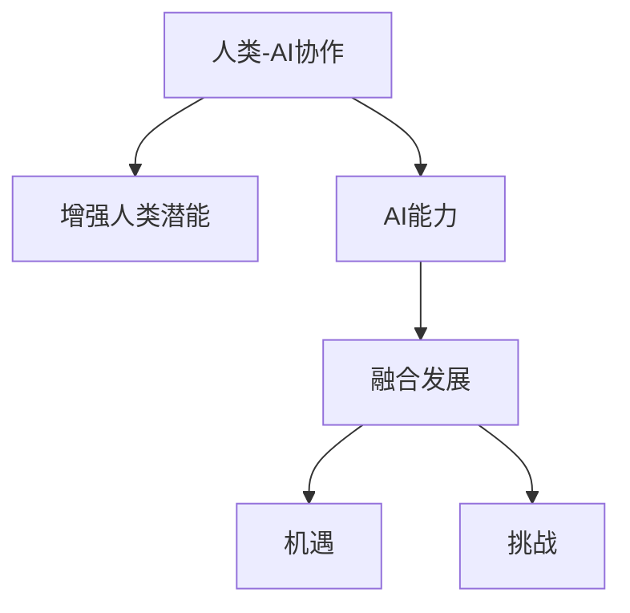

                 

## 1. 背景介绍

### 1.1 问题由来
随着人工智能（AI）技术的快速发展，AI与人类协作的趋势日益明显。AI不仅能够提高工作效率，还能辅助决策、提供新见解，成为人类潜能的增强工具。然而，AI的引入也带来了一系列新的挑战，需要深度理解AI与人类协作的原理、方法以及潜在问题，从而充分利用AI技术的优势，规避其不足。

### 1.2 问题核心关键点
AI与人类协作的核心理念是通过强化技术手段，拓展人类智能的边界。AI通过高效处理数据、复杂计算、模式识别等能力，提升了人类在决策、创造、沟通等方面的效率和质量。然而，AI也面临模型透明度、伦理问题、可解释性等挑战，需要从多个维度进行综合分析。

### 1.3 问题研究意义
了解AI与人类协作的发展趋势、机遇与挑战，有助于企业和研究机构制定合适的AI策略，提升工作效率，解决实际问题。通过科学地应用AI，可以提升创新能力和竞争力，同时也能够更好地应对新兴技术带来的冲击和机遇。

## 2. 核心概念与联系

### 2.1 核心概念概述

- **人类-AI协作（Human-AI Collaboration）**：指AI技术在人类活动中的应用，旨在通过自动化、智能化的方式，增强人类在信息处理、决策支持、沟通交流等方面的能力。

- **增强人类潜能（Augmenting Human Potential）**：通过AI技术的辅助，提升人类在智力、技能、创造力等方面的表现，从而更高效地完成任务。

- **AI能力（AI Capabilities）**：指AI技术在处理数据、识别模式、自动化流程等方面的能力，如机器学习、自然语言处理、计算机视觉等。

- **融合发展（Convergence Development）**：AI与人类在信息、智能、决策等方面的相互渗透、融合，形成协同工作机制。

- **机遇与挑战（Opportunities and Challenges）**：AI在促进协作的同时，也带来了数据隐私、伦理道德、可解释性等方面的问题，需要综合考虑。

### 2.2 核心概念原理和架构的 Mermaid 流程图(Mermaid 流程节点中不要有括号、逗号等特殊字符)



这个流程图展示了AI与人类协作的核心概念及其相互关系：

1. 人类-AI协作基于AI能力，通过自动化和智能化手段，增强人类潜能。
2. 融合发展强调AI与人类在信息、智能等方面的结合，形成协同工作机制。
3. 机遇与挑战分别代表AI协作带来的正面效益和需要解决的问题。

## 3. 核心算法原理 & 具体操作步骤
### 3.1 算法原理概述

人类-AI协作的算法原理基于协同计算、自动化和智能决策的核心思想。AI通过学习人类行为和需求，辅助或替代人类完成特定任务。协同计算模型能够整合人类的逻辑推理和AI的数据驱动能力，形成更全面的决策支持系统。

### 3.2 算法步骤详解

1. **数据收集与预处理**：收集人类与AI交互的各类数据，如用户行为、任务完成情况、反馈信息等。对数据进行清洗、标准化，确保数据质量。

2. **模型训练**：选择适合的AI模型，如机器学习模型、深度学习模型、知识图谱等，使用历史数据进行训练。模型训练过程中，需要注意过拟合、泛化能力等问题。

3. **模型部署与测试**：将训练好的模型部署到实际环境中，进行测试和验证。测试过程中需要关注模型的响应时间、准确率、稳定性等关键指标。

4. **持续优化与迭代**：根据测试结果和反馈信息，持续优化模型和算法，不断迭代改进。例如，通过在线学习、增量学习等技术，提升模型适应性和实时性。

### 3.3 算法优缺点

**优点**：

- **高效性**：AI可以处理大规模数据，快速完成复杂任务，提升工作效率。
- **可扩展性**：AI可以轻松扩展，适应不同的应用场景和需求。
- **智能性**：AI能够通过学习，提升其决策和执行能力，逐步替代人工操作。

**缺点**：

- **数据依赖**：AI模型的性能依赖于数据质量，数据偏差会影响模型的决策。
- **透明度问题**：许多AI算法是"黑箱"模型，难以解释其决策过程。
- **伦理与隐私**：AI可能会侵犯数据隐私，引发伦理道德问题。

### 3.4 算法应用领域

AI与人类协作的应用领域广泛，主要涵盖以下几方面：

- **工业自动化**：通过机器人、自动化生产线等技术，提升生产效率和质量。
- **金融风险管理**：利用AI模型分析金融市场数据，辅助风险评估和管理。
- **医疗健康**：AI辅助诊断、治疗方案推荐，提升医疗服务水平。
- **智能客服**：通过自然语言处理技术，提升客服响应速度和质量。
- **教育培训**：AI辅助个性化学习、智能评估，提升教学效果和学生体验。

## 4. 数学模型和公式 & 详细讲解 & 举例说明（备注：数学公式请使用latex格式，latex嵌入文中独立段落使用 $$，段落内使用 $)
### 4.1 数学模型构建

AI与人类协作的数学模型构建主要包括数据集准备、模型选择、训练与评估等环节。以机器学习为例，构建过程如下：

1. **数据集准备**：收集数据集 $D = \{(x_i, y_i)\}_{i=1}^N$，其中 $x_i$ 为输入特征，$y_i$ 为标签。
2. **模型选择**：选择适合的机器学习模型，如线性回归、支持向量机、神经网络等。
3. **模型训练**：使用训练集 $D_{train} = \{(x_i, y_i)\}_{i=1}^{N_{train}}$ 进行模型训练，得到模型参数 $\theta$。
4. **模型评估**：使用测试集 $D_{test} = \{(x_i, y_i)\}_{i=1}^{N_{test}}$ 评估模型性能，如准确率、召回率等。

### 4.2 公式推导过程

以线性回归模型为例，公式推导如下：

$$
\min_{\theta} \frac{1}{2N} \sum_{i=1}^N (y_i - \theta^T x_i)^2
$$

其中 $\theta$ 为模型参数，$x_i$ 为输入特征，$y_i$ 为标签。通过求解上述最小化问题，可得到最优参数 $\theta$。

### 4.3 案例分析与讲解

以金融风险管理为例，模型构建步骤如下：

1. **数据准备**：收集历史交易数据、市场波动数据、新闻舆情数据等，构建训练集。
2. **模型选择**：选择基于梯度的深度学习模型，如卷积神经网络（CNN）、循环神经网络（RNN）等。
3. **模型训练**：使用训练集训练模型，得到模型参数。
4. **模型评估**：使用测试集评估模型性能，如准确率、召回率、F1分数等。

## 5. 项目实践：代码实例和详细解释说明
### 5.1 开发环境搭建

项目实践前，需准备好开发环境：

1. **安装Python**：
   ```bash
   sudo apt-get install python3
   ```

2. **安装TensorFlow**：
   ```bash
   pip install tensorflow
   ```

3. **安装Keras**：
   ```bash
   pip install keras
   ```

4. **准备数据集**：
   ```bash
   wget https://raw.githubusercontent.com/tensorflow/keras-datasets/master/boston_housing.csv
   ```

### 5.2 源代码详细实现

```python
import pandas as pd
from sklearn.model_selection import train_test_split
from tensorflow.keras.models import Sequential
from tensorflow.keras.layers import Dense
from tensorflow.keras.optimizers import Adam
from sklearn.metrics import mean_squared_error

# 读取数据
data = pd.read_csv('boston_housing.csv')

# 数据预处理
X = data.iloc[:, :-1]
y = data.iloc[:, -1]

# 分割数据集
X_train, X_test, y_train, y_test = train_test_split(X, y, test_size=0.2, random_state=42)

# 构建模型
model = Sequential()
model.add(Dense(64, activation='relu', input_shape=(X_train.shape[1],)))
model.add(Dense(1))

# 编译模型
model.compile(optimizer=Adam(learning_rate=0.01), loss='mse', metrics=['mae'])

# 训练模型
model.fit(X_train, y_train, epochs=100, batch_size=32, validation_data=(X_test, y_test))

# 评估模型
y_pred = model.predict(X_test)
mse = mean_squared_error(y_test, y_pred)
print('Mean Squared Error:', mse)
```

### 5.3 代码解读与分析

- **数据读取**：使用Pandas读取波士顿房价数据集，并进行预处理。
- **模型构建**：使用Keras构建线性回归模型，包含一个输入层、一个隐藏层和一个输出层。
- **模型训练**：使用Adam优化器，学习率为0.01，进行100次迭代，每次迭代使用32个样本。
- **模型评估**：使用均方误差评估模型性能，输出均方误差结果。

## 6. 实际应用场景

### 6.1 工业自动化

工业自动化通过引入机器人、自动化设备等，提升生产效率和质量。AI可以辅助优化生产流程、预测设备故障、提升产品质量。例如，在汽车制造中，AI可以实时监控生产线状态，自动调整生产参数，减少停机时间和生产成本。

### 6.2 金融风险管理

AI在金融风险管理中广泛应用，通过分析海量数据，预测市场趋势、识别风险点。例如，银行利用AI模型分析贷款申请人的信用记录，预测还款风险。保险公司利用AI模型评估客户风险，优化定价策略。

### 6.3 医疗健康

AI在医疗健康中的应用包括辅助诊断、治疗方案推荐、个性化医疗等。例如，AI可以分析医学影像，辅助医生诊断疾病；利用机器学习分析患者数据，推荐个性化的治疗方案。

### 6.4 智能客服

智能客服通过自然语言处理技术，提升客服响应速度和质量。AI可以理解用户意图，提供个性化推荐，解决常见问题。例如，电商平台利用AI进行智能客服，提供24小时在线咨询服务，提升用户体验。

### 6.5 教育培训

AI在教育培训中的应用包括个性化学习、智能评估、学习推荐等。例如，AI可以分析学生的学习数据，提供个性化的学习建议；利用自然语言处理技术，评估学生的作业和论文，提升教学质量。

## 7. 工具和资源推荐
### 7.1 学习资源推荐

- **机器学习课程**：Coursera上的《机器学习》课程，由斯坦福大学教授Andrew Ng主讲，涵盖机器学习基础和常用算法。
- **深度学习框架**：TensorFlow、PyTorch等深度学习框架，提供丰富的API和模型库，方便开发者进行项目实践。
- **Kaggle竞赛**：Kaggle上的数据科学竞赛，提供海量数据集和案例，有助于实践和提升数据处理能力。
- **开源社区**：GitHub等开源社区，提供大量的代码实现和项目资源，方便开发者参考和学习。

### 7.2 开发工具推荐

- **Jupyter Notebook**：Jupyter Notebook是一个开源的交互式笔记本，支持Python代码的编写和执行，适合进行数据处理和模型训练。
- **Google Colab**：Google Colab是一个基于云的Jupyter Notebook服务，提供免费GPU资源，方便进行深度学习实验。
- **GitHub**：GitHub是一个代码托管平台，提供版本控制、代码协作等功能，适合团队合作开发。
- **TensorBoard**：TensorBoard是一个可视化工具，可以实时展示模型训练过程，帮助开发者调试和优化模型。

### 7.3 相关论文推荐

- **《机器学习实战》**：Peter Harrington著，详细介绍机器学习算法和实际应用案例。
- **《深度学习》**：Ian Goodfellow、Yoshua Bengio、Aaron Courville著，涵盖深度学习的基础理论和常用算法。
- **《人工智能导论》**：Russell、Norvig著，详细讲解人工智能的基本概念和应用。

## 8. 总结：未来发展趋势与挑战

### 8.1 研究成果总结

AI与人类协作的研究成果主要集中在以下几个方面：

- **协同计算模型**：如协同过滤、协同进化算法等，通过多智能体协作提升决策质量。
- **深度学习技术**：通过神经网络、卷积神经网络、循环神经网络等技术，提升AI的智能水平和决策能力。
- **知识图谱**：通过构建知识图谱，实现知识表示和推理，提升AI的理解能力和推理能力。

### 8.2 未来发展趋势

- **智能化程度提升**：随着AI技术的发展，AI将逐步具备更高的智能水平，能够更好地理解人类需求和行为。
- **跨领域应用拓展**：AI将逐步渗透到更多领域，如医疗、金融、教育等，提升各领域的效率和质量。
- **可解释性增强**：AI模型将更加透明化，具备更好的可解释性，帮助用户理解和信任AI决策。
- **伦理与隐私保护**：AI技术在应用过程中，将更加重视伦理和隐私保护，确保数据安全和公平使用。

### 8.3 面临的挑战

- **数据质量与多样性**：AI模型的性能依赖于数据质量，如何获取高质量、多样化的数据，是AI应用的关键。
- **模型复杂性与可扩展性**：大规模数据和高维度特征，使得AI模型复杂化，如何提升模型的可扩展性和可维护性，是AI应用的难点。
- **技术壁垒与资源投入**：AI技术的高门槛和高资源投入，使得小规模企业难以应用AI，如何降低应用门槛，是AI普及的关键。
- **伦理与隐私问题**：AI在应用过程中，可能引发数据隐私和伦理道德问题，需要制定相应的规范和标准。

### 8.4 研究展望

未来的AI研究将更加注重以下几个方面：

- **跨学科融合**：AI与各学科的融合，提升AI的创新能力和应用深度。
- **自适应学习**：通过自适应学习，提升AI的泛化能力和适应性，增强其在不同场景下的应用效果。
- **智能化协同**：通过多智能体协同，提升AI的决策能力和响应速度，实现高效协同。
- **伦理与隐私保护**：在AI应用过程中，重视伦理与隐私保护，确保数据安全和使用公平。

## 9. 附录：常见问题与解答

**Q1: 什么是AI与人类协作？**

A: AI与人类协作是指AI技术在人类活动中的应用，通过自动化、智能化手段，提升人类在决策、沟通、创造等方面的效率和质量。

**Q2: 如何提升AI的智能水平？**

A: 提升AI的智能水平，可以从以下几个方面入手：

- **数据质量与多样性**：获取高质量、多样化的数据，提升AI模型的泛化能力。
- **模型选择与优化**：选择适合的AI模型，并通过调参、正则化等技术，优化模型性能。
- **跨学科融合**：将AI与其他学科的知识融合，提升AI的智能水平和应用深度。

**Q3: AI与人类协作的难点是什么？**

A: AI与人类协作的难点主要在于：

- **数据依赖**：AI模型的性能依赖于数据质量，如何获取高质量数据是关键。
- **模型复杂性与可扩展性**：大规模数据和高维度特征，使得AI模型复杂化，如何提升模型的可扩展性和可维护性。
- **伦理与隐私问题**：AI在应用过程中，可能引发数据隐私和伦理道德问题，需要制定相应的规范和标准。

通过科学地理解和应用AI技术，可以有效提升人类潜能，同时也需要不断克服技术挑战，确保AI的安全、可靠和公平使用。

