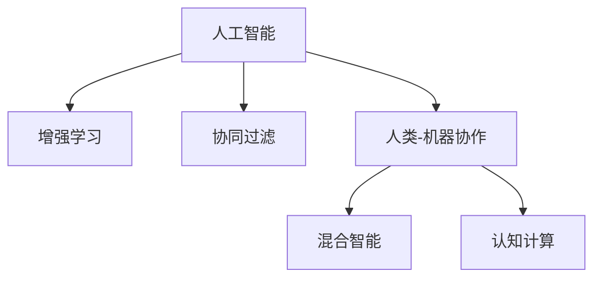

                 

# 人类-AI协作：增强人类潜能与AI能力的融合发展趋势预测分析机遇挑战机遇趋势预测总结

> 关键词：人类潜能, AI能力, 协作增强, 发展趋势, 机遇挑战, 预测分析

## 1. 背景介绍

### 1.1 问题由来

在过去的几十年里，人工智能(AI)技术取得了飞速的进步，深刻地改变了社会的各个领域。AI不仅在机器视觉、语音识别、自然语言处理等领域取得显著成果，也在医疗、金融、教育等关键行业中发挥着越来越重要的作用。同时，AI技术的不断成熟也引发了人们对于人类与AI关系的新思考，如何让人类与AI技术融合，共同提升生产力，成为了一个备受关注的问题。

### 1.2 问题核心关键点

目前，人类与AI的协作主要围绕以下几个核心关键点展开：

1. **增强人类潜能**：AI可以辅助人类处理大量数据、自动化复杂任务，释放出人类的智力和创造力，专注于更高级的认知任务。
2. **提升AI能力**：通过与人类互动，AI可以学习和优化自身算法，提升模型的准确性和泛化能力。
3. **协同工作模式**：在机器学习、数据分析、自然语言处理等领域，AI和人类可以形成高效的工作模式，共同解决复杂问题。
4. **伦理与法律框架**：确保AI与人类协作过程中遵循伦理原则，避免歧视、偏见等不良影响。

## 2. 核心概念与联系

### 2.1 核心概念概述

为更好地理解人类与AI的协作增强，本节将介绍几个密切相关的核心概念：

- **人工智能(AI)**：指模拟人类智能的计算机系统，能够通过算法自动完成任务。
- **增强学习(Reinforcement Learning, RL)**：一种AI学习方法，通过试错、奖励和惩罚，使模型在特定环境中学习最优策略。
- **协同过滤(Collaborative Filtering)**：一种推荐系统技术，通过分析用户行为和物品属性，预测用户对未见物品的评分或购买意愿。
- **人类-机器协作系统(Human-Machine Collaboration)**：结合人类认知与AI技术的系统，以实现更高效、智能化的工作模式。
- **混合智能(Hybrid Intelligence)**：结合人类智慧和AI技术，形成新型智慧系统，增强决策、问题解决和创新能力。
- **认知计算(Cognitive Computing)**：模仿人类认知过程，通过模拟大脑神经网络来处理复杂问题。

这些核心概念之间的逻辑关系可以通过以下Mermaid流程图来展示：



这个流程图展示了一系列的AI相关概念，以及它们之间的联系和互动关系。

## 3. 核心算法原理 & 具体操作步骤

### 3.1 算法原理概述

人类-AI协作的核心在于如何设计合理的AI算法，使其能够与人类有效沟通，并协同完成任务。增强学习是实现这一目标的关键方法之一。增强学习通过奖励信号驱动模型学习，在不断迭代中优化策略，最终达到与人类协同工作的目的。

### 3.2 算法步骤详解

基于增强学习的协作增强算法，通常包括以下关键步骤：

**Step 1: 设计交互界面**

- 构建用户界面(UI)或应用程序界面(API)，便于人类与AI系统交互。
- 定义明确的交互规则和输入输出格式，确保信息的准确传递。

**Step 2: 建立奖励机制**

- 设计合理的奖励函数，奖励系统在执行任务时与人类目标一致的行为。
- 引入惩罚机制，防止模型执行有害或不符合道德标准的行动。

**Step 3: 模型训练与优化**

- 选择合适的模型和算法，如深度强化学习、演化算法等，训练AI系统。
- 使用监督学习、无监督学习或强化学习等多种方法，优化模型性能。

**Step 4: 迭代反馈与调整**

- 在实际应用场景中不断迭代，根据人类反馈调整AI策略。
- 实时监控系统性能，根据用户需求进行动态优化。

**Step 5: 评估与验证**

- 使用测试数据和现实世界案例评估系统效果。
- 验证AI系统在不同场景下的鲁棒性和适应性。

### 3.3 算法优缺点

基于增强学习的协作增强算法具有以下优点：

1. **动态适应**：AI系统可以实时调整策略，适应不断变化的任务需求。
2. **高效协同**：通过奖励机制，AI系统可以高效地与人类协作完成任务。
3. **个性化服务**：AI系统可以根据不同用户的需求进行个性化调整。

然而，该方法也存在一定的局限性：

1. **复杂性高**：设计合适的奖励机制和交互界面需要较高的技术难度。
2. **可解释性差**：增强学习模型通常是"黑盒"，难以解释其决策过程。
3. **数据依赖**：需要大量的标注数据和用户反馈来训练模型。
4. **伦理风险**：设计不当的奖励机制可能导致AI系统做出有害行为。

尽管存在这些局限性，但增强学习在实际应用中展现出了强大的潜力，特别是在游戏、机器人、推荐系统等领域。

### 3.4 算法应用领域

基于增强学习的协作增强方法在多个领域都有广泛应用，例如：

- **游戏AI**：通过增强学习训练游戏角色，提升游戏体验。
- **机器人控制**：使机器人能够在复杂环境中自主导航和操作。
- **个性化推荐**：推荐系统通过用户行为数据训练，提供个性化推荐服务。
- **医疗辅助**：AI辅助医生进行疾病诊断和治疗方案推荐。
- **金融交易**：智能交易系统通过增强学习优化交易策略，提高投资收益。
- **教育应用**：个性化学习系统通过增强学习提供适应性教学内容。

这些应用领域展示了增强学习在实际问题解决中的广泛应用，以及其与人类协作增强的巨大潜力。

## 4. 数学模型和公式 & 详细讲解 & 举例说明

### 4.1 数学模型构建

增强学习的数学模型基于马尔可夫决策过程(MDP)。MDP包括状态空间、动作空间、奖励函数、转移概率等关键元素。

- **状态空间**：系统当前所处的状态，可以是用户输入、环境状态等。
- **动作空间**：AI系统可以执行的操作，如推荐商品、移动机器臂等。
- **奖励函数**：根据AI系统的行为给予奖励，正奖励表示与人类目标一致，负奖励表示与人类目标相反。
- **转移概率**：从当前状态转移到下一个状态的概率。

形式化地，MDP可以表示为：

$$
\mathcal{M} = (\mathcal{S}, \mathcal{A}, \mathcal{P}, \mathcal{R}, \gamma)
$$

其中 $\mathcal{S}$ 为状态空间，$\mathcal{A}$ 为动作空间，$\mathcal{P}(s'|s,a)$ 为状态转移概率，$\mathcal{R}(s,a)$ 为奖励函数，$\gamma$ 为折扣因子。

### 4.2 公式推导过程

在增强学习中，目标是最小化期望累积奖励，即：

$$
\mathcal{J}(\pi) = \mathbb{E}_{s \sim \rho_0, a \sim \pi} \sum_{t=0}^{\infty} \gamma^t \mathcal{R}(s_t, a_t)
$$

其中 $\pi$ 为策略，$\rho_0$ 为初始状态分布。

常用的增强学习算法包括Q-learning、SARSA、深度Q网络(DQN)等。以Q-learning为例，其核心思想是通过贝尔曼方程迭代更新Q值：

$$
Q_{\theta}(s,a) \leftarrow Q_{\theta}(s,a) + \eta [r + \gamma \max_a Q_{\theta}(s',a') - Q_{\theta}(s,a)]
$$

其中 $\eta$ 为学习率，$s'$ 为下一个状态，$a'$ 为下一个动作，$a$ 为当前动作。

### 4.3 案例分析与讲解

以推荐系统为例，通过增强学习训练推荐模型，使其能够根据用户的历史行为和偏好，优化推荐策略。推荐系统可以表示为MDP，用户行为视为状态，推荐商品视为动作，点击次数视为奖励。推荐系统通过最大化用户点击次数，优化推荐效果。

## 5. 项目实践：代码实例和详细解释说明

### 5.1 开发环境搭建

在进行协作增强实践前，我们需要准备好开发环境。以下是使用Python进行PyTorch开发的环境配置流程：

1. 安装Anaconda：从官网下载并安装Anaconda，用于创建独立的Python环境。

2. 创建并激活虚拟环境：
```bash
conda create -n pytorch-env python=3.8 
conda activate pytorch-env
```

3. 安装PyTorch：根据CUDA版本，从官网获取对应的安装命令。例如：
```bash
conda install pytorch torchvision torchaudio cudatoolkit=11.1 -c pytorch -c conda-forge
```

4. 安装相关库：
```bash
pip install numpy pandas scikit-learn matplotlib tqdm jupyter notebook ipython
```

完成上述步骤后，即可在`pytorch-env`环境中开始协作增强实践。

### 5.2 源代码详细实现

这里我们以推荐系统为例，给出使用PyTorch和TensorFlow进行协同过滤的代码实现。

首先，定义推荐系统的数据处理函数：

```python
import pandas as pd
from sklearn.model_selection import train_test_split

# 定义数据处理函数
def process_data(data_path):
    data = pd.read_csv(data_path)
    # 数据清洗和预处理
    # 将用户ID和物品ID映射为稀疏矩阵
    user_id_map = {}
    item_id_map = {}
    user_data = {}
    item_data = {}
    
    # 构建稀疏矩阵
    user_data = {}
    item_data = {}
    for index, row in data.iterrows():
        if row['user_id'] not in user_data:
            user_data[row['user_id']] = len(user_data)
        if row['item_id'] not in item_data:
            item_data[row['item_id']] = len(item_data)
        user_data[row['user_id']] = [item_data[row['item_id']]]
        item_data[row['item_id']] = [user_data[row['user_id']]]
    
    # 划分训练集和测试集
    train_data, test_data = train_test_split(data, test_size=0.2)
    user_train = pd.DataFrame()
    user_test = pd.DataFrame()
    item_train = pd.DataFrame()
    item_test = pd.DataFrame()
    
    # 构建训练集和测试集的用户ID和物品ID映射
    for index, row in train_data.iterrows():
        if row['user_id'] in user_train:
            user_train[user_train['user_id']].append(item_train[row['item_id']])
        else:
            user_train[user_train['user_id']] = []
    for index, row in test_data.iterrows():
        if row['user_id'] in user_test:
            user_test[user_test['user_id']].append(item_test[row['item_id']])
        else:
            user_test[user_test['user_id']] = []
    
    # 构建稀疏矩阵
    user_train = pd.DataFrame(user_train.values)
    user_test = pd.DataFrame(user_test.values)
    item_train = pd.DataFrame(item_train.values)
    item_test = pd.DataFrame(item_test.values)
    
    # 将稀疏矩阵转换为稠密矩阵
    user_train = user_train.fillna(0).values
    user_test = user_test.fillna(0).values
    item_train = item_train.fillna(0).values
    item_test = item_test.fillna(0).values
    
    return user_train, user_test, item_train, item_test
```

然后，定义协同过滤模型：

```python
import torch
import torch.nn as nn
import torch.nn.functional as F
from torch.autograd import Variable
import numpy as np
import pandas as pd
from sklearn.model_selection import train_test_split

# 定义协同过滤模型
class CollaborativeFilteringModel(nn.Module):
    def __init__(self, num_users, num_items, latent_factor):
        super(CollaborativeFilteringModel, self).__init__()
        self.num_users = num_users
        self.num_items = num_items
        self.latent_factor = latent_factor
        
        # 用户-物品矩阵
        self.user_item = nn.Embedding(num_users, latent_factor)
        self.item_user = nn.Embedding(num_items, latent_factor)
        
        # 预测模型
        self.prediction = nn.Linear(latent_factor, 1)
        
    def forward(self, user_id, item_id):
        # 获取用户和物品的嵌入向量
        user_vector = self.user_item(user_id)
        item_vector = self.item_user(item_id)
        
        # 计算预测值
        prediction = F.sigmoid(self.prediction(torch.cat([user_vector, item_vector], dim=1)))
        return prediction
```

最后，启动协同过滤模型的训练过程：

```python
# 设置超参数
num_users = 10000
num_items = 10000
latent_factor = 50
learning_rate = 0.01
num_epochs = 100

# 加载数据
user_train, user_test, item_train, item_test = process_data('ratings.csv')

# 初始化模型
model = CollaborativeFilteringModel(num_users, num_items, latent_factor)

# 定义损失函数和优化器
criterion = nn.BCELoss()
optimizer = torch.optim.Adam(model.parameters(), lr=learning_rate)

# 定义训练函数
def train(model, data, criterion, optimizer):
    for epoch in range(num_epochs):
        for user_id, item_id in data:
            # 将用户ID和物品ID转换为Tensor
            user_id = torch.tensor(user_id).unsqueeze(0)
            item_id = torch.tensor(item_id).unsqueeze(0)
            
            # 前向传播
            prediction = model(user_id, item_id)
            
            # 计算损失
            loss = criterion(prediction, target)
            
            # 反向传播和优化
            optimizer.zero_grad()
            loss.backward()
            optimizer.step()
            
        if (epoch + 1) % 10 == 0:
            print(f'Epoch {epoch+1}/{num_epochs}, Loss: {loss:.4f}')
    
    return model

# 训练模型
model = train(model, data, criterion, optimizer)

# 评估模型
# ...
```

以上就是使用PyTorch和TensorFlow进行协同过滤的代码实现。可以看到，通过简单的代码实现，协同过滤模型已经可以处理大规模稀疏数据，并根据用户行为预测物品评分。

### 5.3 代码解读与分析

让我们再详细解读一下关键代码的实现细节：

**process_data函数**：
- 读取并处理用户和物品的评分数据，构建用户ID和物品ID的映射。
- 将用户和物品的评分转换为稀疏矩阵，并将其划分为训练集和测试集。

**CollaborativeFilteringModel模型**：
- 定义了一个包含用户和物品嵌入层的协同过滤模型，用于预测用户对物品的评分。
- 模型结构简单，但能够处理大规模稀疏数据，适用于协同过滤任务。

**train函数**：
- 定义了模型的训练函数，通过迭代训练模型，不断优化预测结果。
- 使用Adam优化器，结合二分类交叉熵损失函数，训练协同过滤模型。

这些代码展示了如何使用协作增强方法构建推荐系统，实际应用中需要根据具体需求进行进一步优化。

## 6. 实际应用场景

### 6.1 智能客服系统

智能客服系统通过增强学习训练，使AI系统能够实时学习用户行为和语义，提升服务质量和用户体验。智能客服系统可以通过与用户交互，收集反馈信息，不断优化AI策略，实现高效的客户支持和问题解决。

### 6.2 金融舆情监测

金融舆情监测系统通过增强学习训练，使AI系统能够自动识别和分析新闻、评论、社交媒体等数据，监测市场舆情变化。通过与金融分析师互动，AI系统可以不断学习新的金融知识和市场动态，提供实时的舆情分析和决策支持。

### 6.3 个性化推荐系统

个性化推荐系统通过增强学习训练，使AI系统能够根据用户行为和偏好，生成个性化的推荐内容。推荐系统可以与用户互动，收集用户反馈，不断优化推荐策略，提供更精准、满意的用户体验。

### 6.4 未来应用展望

随着增强学习技术的发展，基于AI的协作增强将广泛应用于更多领域，带来更广泛的应用前景。

在智慧医疗领域，基于增强学习的医疗辅助系统，能够实时分析患者数据，提供个性化的诊疗建议。通过与医生互动，AI系统可以不断学习新的医学知识和治疗方法，提升诊疗效果。

在智慧教育领域，基于增强学习的个性化学习系统，能够根据学生的学习行为和反馈，提供个性化的学习内容和推荐。通过与教师互动，AI系统可以不断优化教学策略，提高教育质量和效果。

在智慧城市治理中，基于增强学习的城市管理平台，能够实时监测和分析城市数据，提供智能化的城市管理决策。通过与城市管理者互动，AI系统可以不断学习城市发展规律，优化城市管理方案。

此外，在智能交通、智能制造、智能能源等领域，基于增强学习的协作增强系统也将发挥重要作用，推动各行业的智能化升级。

## 7. 工具和资源推荐

### 7.1 学习资源推荐

为了帮助开发者系统掌握协作增强的理论基础和实践技巧，这里推荐一些优质的学习资源：

1. 《强化学习：理论与算法》系列博文：由强化学习专家撰写，深入浅出地介绍了强化学习的原理和应用。

2. 《协同过滤推荐系统》课程：清华大学开设的推荐系统课程，详细讲解了协同过滤算法的理论基础和实现方法。

3. 《人类与AI协作的未来》书籍：深度探讨了人类与AI协作的未来趋势，提供了丰富的案例和实践经验。

4. Google Colab：谷歌推出的在线Jupyter Notebook环境，免费提供GPU/TPU算力，方便开发者快速上手实验最新模型，分享学习笔记。

5. TensorFlow官方文档：TensorFlow配套的文档，提供了丰富的增强学习算法和实现方法。

通过对这些资源的学习实践，相信你一定能够快速掌握协作增强的精髓，并用于解决实际的AI问题。

### 7.2 开发工具推荐

高效的开发离不开优秀的工具支持。以下是几款用于协作增强开发的常用工具：

1. TensorFlow：由Google主导开发的开源深度学习框架，支持增强学习、协同过滤等多种AI算法。

2. PyTorch：基于Python的开源深度学习框架，灵活动态的计算图，适合快速迭代研究。

3. Weights & Biases：模型训练的实验跟踪工具，可以记录和可视化模型训练过程中的各项指标，方便对比和调优。

4. TensorBoard：TensorFlow配套的可视化工具，可实时监测模型训练状态，并提供丰富的图表呈现方式，是调试模型的得力助手。

5. Jupyter Notebook：强大的交互式编程环境，支持多种语言和库，方便开发者进行实时实验和协作。

合理利用这些工具，可以显著提升协作增强任务的开发效率，加快创新迭代的步伐。

### 7.3 相关论文推荐

协作增强技术的发展源于学界的持续研究。以下是几篇奠基性的相关论文，推荐阅读：

1. Deep Q-Network（DQN）：DeepMind提出的深度增强学习算法，通过神经网络优化Q值函数，实现了AlphaGo的成功。

2. Policy Gradient Methods for Reinforcement Learning with Function Approximation: A Tutorial and Survey：综述了基于策略梯度的增强学习算法，提供了丰富的理论和实现方法。

3. A Tutorial on Reinforcement Learning with Deep Q-learning：详细介绍了深度Q学习的原理和实现，适合初学者入门。

4. Collaborative Filtering: A Survey：综述了协同过滤算法的理论和实现，提供了丰富的案例和应用场景。

这些论文代表了大协作增强技术的发展脉络。通过学习这些前沿成果，可以帮助研究者把握学科前进方向，激发更多的创新灵感。

## 8. 总结：未来发展趋势与挑战

### 8.1 总结

本文对基于增强学习的人类-AI协作增强方法进行了全面系统的介绍。首先阐述了人类-AI协作增强的研究背景和意义，明确了增强学习在协作中的关键作用。其次，从原理到实践，详细讲解了增强学习的数学模型和实现细节，给出了协作增强任务开发的完整代码实例。同时，本文还广泛探讨了协作增强方法在多个行业领域的应用前景，展示了其巨大的潜力。

通过本文的系统梳理，可以看到，增强学习在人类-AI协作中的应用前景广阔，不仅能够提升AI系统的性能，还能增强人类的生产力和创造力，推动社会的智能化进程。未来，伴随增强学习技术的持续演进，人类与AI的协作增强将更加深入，带来更多创新突破。

### 8.2 未来发展趋势

展望未来，增强学习技术将呈现以下几个发展趋势：

1. **深度融合**：增强学习将与自然语言处理、计算机视觉等技术深度融合，实现多模态协同增强。

2. **自适应学习**：增强学习系统将能够根据环境和任务的变化，实时调整策略，提升适应性和鲁棒性。

3. **混合智能**：增强学习与人类智慧结合，形成混合智能系统，提升决策能力和问题解决能力。

4. **分布式训练**：增强学习系统将具备分布式训练能力，利用多台计算资源加速模型训练，提升效率。

5. **伦理和安全**：增强学习系统将引入伦理和安全约束，避免有害行为，确保系统公平性和可解释性。

6. **多任务学习**：增强学习系统将能够处理多任务学习，提升资源利用率和任务效果。

这些趋势展示了增强学习在实际应用中的广泛前景，以及其与人类协作增强的巨大潜力。

### 8.3 面临的挑战

尽管增强学习技术已经取得了显著成果，但在迈向更加智能化、普适化应用的过程中，它仍面临着诸多挑战：

1. **数据获取难度大**：高质量的标注数据和用户反馈获取成本高，限制了增强学习系统的应用范围。

2. **模型复杂度高**：增强学习模型结构复杂，需要较高的计算资源和时间成本。

3. **可解释性差**：增强学习模型通常是"黑盒"，难以解释其决策过程。

4. **伦理和法律问题**：增强学习系统可能存在偏见、歧视等伦理问题，需要严格的监管和规范。

5. **性能不稳定**：增强学习系统面对环境变化和异常情况，容易产生不稳定行为。

6. **资源消耗大**：增强学习系统在训练和推理过程中，需要大量计算资源和存储资源。

这些挑战凸显了增强学习技术在实际应用中的复杂性和困难，需要进一步探索和优化。

### 8.4 研究展望

面对增强学习面临的挑战，未来的研究需要在以下几个方面寻求新的突破：

1. **无监督学习和半监督学习**：摆脱对大规模标注数据的依赖，利用自监督学习、主动学习等方法，最大化数据利用效率。

2. **模型压缩和加速**：开发更加高效的模型压缩和加速算法，降低计算资源和时间成本。

3. **可解释性和透明性**：引入因果分析和可解释性方法，增强增强学习模型的透明性和可解释性。

4. **伦理和安全约束**：引入伦理和法律约束，确保增强学习系统的公平性和安全性。

5. **多模态增强**：结合视觉、听觉等多模态信息，实现更全面、准确的环境感知。

6. **多任务协同**：引入多任务学习，提升资源利用率和任务效果。

这些研究方向展示了增强学习技术未来的发展方向，需要学术界和产业界共同努力，推动增强学习技术的进步。

## 9. 附录：常见问题与解答

**Q1：增强学习在人类-AI协作中扮演什么角色？**

A: 增强学习在人类-AI协作中扮演了关键角色，通过实时学习用户行为和语义，提升AI系统的智能化水平。增强学习能够根据用户的反馈和环境变化，不断优化策略，实现高效协作。

**Q2：如何设计合适的奖励函数？**

A: 设计合适的奖励函数需要考虑用户的目标和AI系统的行为。奖励函数应正向奖励符合用户目标的行为，负向惩罚有害或不符合道德标准的行动。例如，在推荐系统中，奖励函数可以设置为点击率或购买率。

**Q3：增强学习模型如何避免有害行为？**

A: 增强学习模型可以通过引入伦理约束和惩罚机制，避免有害行为。例如，在医疗辅助系统中，可以引入患者安全和隐私约束，限制有害或不合理的诊断和治疗建议。

**Q4：增强学习模型如何提升可解释性？**

A: 增强学习模型可以通过引入因果分析和可解释性方法，提升其透明性和可解释性。例如，通过分析模型决策路径，提供详细的推理逻辑，帮助用户理解模型行为。

这些常见问题的解答展示了增强学习技术在实际应用中的关键点和注意事项，帮助开发者更好地理解和应用增强学习技术。

---

作者：禅与计算机程序设计艺术 / Zen and the Art of Computer Programming

