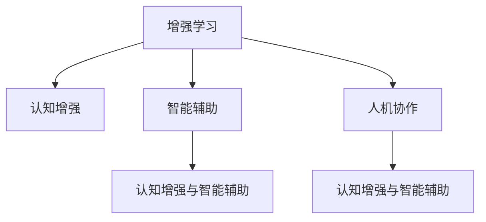

                 

# 人类-AI协作：增强人类潜能与AI能力的融合进步与展望

> 关键词：人机协作,增强学习,认知增强,智能辅助,人工智能,未来展望

## 1. 背景介绍

### 1.1 问题由来
随着人工智能技术的飞速发展，人类与AI的协作已经从最初的简单自动化任务，逐步深入到复杂认知能力的增强。从早期的机械臂和专家系统，到如今的深度学习和神经网络，AI正在逐渐成为我们日常生活和工作中的重要伙伴。然而，当前的AI系统往往被视为"黑箱"，缺乏解释性和透明度，难以完全融入人类工作流程。

### 1.2 问题核心关键点
当前，人机协作研究的核心关键点在于：如何通过融合AI的计算能力与人的认知能力，实现更高效、更安全、更智能的工作流程。具体而言，包括以下几个方面：

1. **认知增强**：利用AI进行辅助决策，提高人类认知过程的速度和准确性。
2. **智能辅助**：通过AI工具处理繁琐、重复、危险的工作，使人类专注于更有创造性和战略性的任务。
3. **人机协作**：建立可解释、可信任的人机交互系统，使AI能够更自然地融入人的工作环境中。
4. **知识整合**：将AI的知识库与人的经验、直觉相结合，形成更全面的知识图谱。
5. **伦理与隐私**：确保AI系统的决策透明、公正，尊重用户的隐私和数据安全。

### 1.3 问题研究意义
研究人机协作技术，对于推动人工智能技术的广泛应用，提升人类生产力和生活质量，具有重要意义：

1. **提高效率**：通过AI的辅助，减少人为错误，加速决策过程。
2. **增强能力**：利用AI的强大计算能力，扩展人类的认知边界。
3. **促进创新**：人机协作带来的新工作方式，激发更多创新思维和创造性成果。
4. **提升体验**：通过AI工具，改善工作环境，提升用户体验。
5. **推动产业升级**：人机协作技术在各行各业的应用，促进产业转型和升级。

## 2. 核心概念与联系

### 2.1 核心概念概述

为了更好地理解人机协作技术，本节将介绍几个密切相关的核心概念：

- **增强学习(Reinforcement Learning, RL)**：一种通过试错逐步优化策略的学习方法，通常用于智能体在动态环境中做出最优决策。
- **认知增强(Cognitive Enhancement)**：通过AI技术，增强人类的认知能力和决策效率。
- **智能辅助(Intelligent Augmentation)**：利用AI工具，替代或辅助人类完成复杂的任务，提高工作效率和质量。
- **人机协作(Human-AI Collaboration)**：将AI与人的认知系统、社交能力等结合，形成协同工作机制。
- **认知增强与智能辅助**：认知增强强调对人类认知能力的提升，而智能辅助则侧重于使用AI工具辅助完成任务。

这些核心概念之间的逻辑关系可以通过以下Mermaid流程图来展示：



这个流程图展示了大规模语言模型的核心概念及其之间的关系：

1. 增强学习通过试错优化策略，提供智能决策的支持。
2. 认知增强提升人的认知能力，使人机协作更加高效。
3. 智能辅助使用AI工具辅助完成任务，提高工作效率。
4. 人机协作结合了增强学习和智能辅助，形成更全面的工作模式。

## 3. 核心算法原理 & 具体操作步骤
### 3.1 算法原理概述

人机协作的核心算法原理基于强化学习(RL)和认知增强技术。通过构建智能体(Agent)与环境的交互模型，智能体通过不断的试错和学习，优化决策策略，以最大化长期奖励。

具体而言，假设智能体在环境$E$中执行任务$T$，并获得奖励$R$，智能体的目标是通过策略$\Pi$，最大化未来奖励的累积值$V$。通过状态-动作-奖励序列的迭代优化，智能体能够学习到最优策略$\Pi^*$。

### 3.2 算法步骤详解

人机协作的算法步骤主要包括以下几个关键步骤：

**Step 1: 环境建模**
- 定义环境$E$和任务$T$，并设计合适的状态表示和动作空间。例如，在自动驾驶任务中，环境可以是道路交通状况，任务是找到最优行驶路径。
- 根据任务需求，设计奖励函数$R$，奖励设计需要综合考虑多个指标，如安全性、效率、成本等。

**Step 2: 智能体设计**
- 选择合适的智能体模型，如Q-Learning、Policy Gradient等，并定义智能体的决策策略$\Pi$。
- 确定智能体的学习率、探索与利用的平衡点、网络结构等超参数。

**Step 3: 交互与学习**
- 在每个时间步$t$，智能体根据当前状态$s_t$，选择一个动作$a_t$，并观察环境返回的奖励$r_t$和下一个状态$s_{t+1}$。
- 智能体利用历史经验，更新决策策略$\Pi$，通过不断迭代，逐步优化策略$\Pi^*$。

**Step 4: 结果评估与反馈**
- 在特定时间点上，对智能体的决策效果进行评估，如通过模拟测试或实际部署。
- 根据评估结果，调整智能体的策略和参数，不断优化模型性能。

### 3.3 算法优缺点

基于人机协作的算法具有以下优点：

1. **高效决策**：通过增强学习，智能体能够快速适应复杂多变的环境，做出高效决策。
2. **可解释性**：由于智能体的决策过程可解释，便于人类理解和监督。
3. **鲁棒性**：智能体能够通过多次交互和优化，逐渐提升对环境的适应能力。
4. **灵活性**：智能体的策略和参数可以根据任务需求进行灵活调整。

同时，该算法也存在一定的局限性：

1. **数据需求高**：智能体需要大量数据进行训练，才能获取有效的策略。
2. **模型复杂**：复杂的智能体模型需要大量的计算资源进行训练和优化。
3. **稳定性问题**：智能体在动态环境中可能出现不稳定，导致策略失效。
4. **伦理问题**：智能体的决策过程可能存在伦理风险，需要仔细设计。

尽管存在这些局限性，人机协作算法在实际应用中仍显示出巨大的潜力和价值，特别是在复杂任务和高风险场景中，能够显著提升工作效率和决策质量。

### 3.4 算法应用领域

人机协作技术已经在诸多领域得到了广泛应用，例如：

- **医疗**：通过智能辅助系统，帮助医生进行诊断和治疗方案推荐。例如，IBM的Watson Health通过学习海量医疗数据，辅助医生决策。
- **金融**：利用智能分析工具，进行风险评估和投资策略优化。例如，Goldman Sachs使用AI进行市场预测和交易决策。
- **制造业**：通过智能工厂系统，实现生产过程的自动化和智能化。例如，GE的Predix平台，通过传感器和AI技术优化生产流程。
- **交通**：利用自动驾驶技术，提升交通效率和安全。例如，Waymo的自动驾驶汽车正在全球多个城市进行测试和部署。
- **教育**：使用AI辅助教育工具，个性化推荐学习内容和辅导方案。例如，Knewton通过分析学生数据，提供个性化的学习路径。

## 4. 数学模型和公式 & 详细讲解  
### 4.1 数学模型构建

人机协作的数学模型通常基于强化学习框架构建。以自动驾驶为例，智能体在环境中的决策过程可以用以下公式表示：

- 环境状态$S_t$，如当前道路状况、车辆位置等。
- 智能体动作$A_t$，如加速、刹车、转向等。
- 奖励函数$R_t$，如安全行驶、节能环保、客户满意度等。
- 智能体策略$\Pi_t$，如概率分布$p(a_t|s_t)$，表示在状态$s_t$下选择动作$a_t$的概率。

智能体的目标是最小化长期奖励的累积值$V_t$，即：

$$
V_t = \mathbb{E}[\sum_{k=0}^{\infty}\gamma^k R_{t+k}]
$$

其中$\gamma$为折扣因子，控制奖励的长期性和即时性。

### 4.2 公式推导过程

在自动驾驶任务中，智能体的决策过程可以用如下Q-Learning算法推导：

- 定义Q值函数$Q(s_t,a_t)$，表示在状态$s_t$下采取动作$a_t$的长期奖励期望。
- Q值函数更新公式：

$$
Q(s_t,a_t) \leftarrow Q(s_t,a_t) + \alpha [R_t + \gamma \max_{a_{t+1}} Q(s_{t+1},a_{t+1}) - Q(s_t,a_t)]
$$

其中$\alpha$为学习率，控制每次更新的大小。

通过不断迭代更新Q值函数，智能体能够逐步学习到最优决策策略$\Pi^*$。

### 4.3 案例分析与讲解

以自动驾驶中的交通信号灯识别为例，智能体需要在不同交通信号灯下做出最优决策。通过人机协作技术，智能体可以学习到不同信号灯的特征和动作规则，从而在复杂交通环境中做出安全、高效的决策。

例如，在经过交叉口时，智能体可以通过传感器获取交通信号灯的状态信息，并通过增强学习不断优化决策策略。假设智能体的动作集为{加速、减速、停车}，奖励函数为{安全行驶、准时到达}，智能体在每个时间步观察交通信号灯的状态，选择最合适的动作，并根据奖励反馈更新策略。

具体实现时，可以使用CNN提取交通信号灯图像的特征，结合LSTM捕捉时间序列数据，通过Q-Learning算法学习最优策略，从而实现智能化的交通信号灯识别和响应。

## 5. 项目实践：代码实例和详细解释说明
### 5.1 开发环境搭建

在进行人机协作项目实践前，我们需要准备好开发环境。以下是使用Python进行PyTorch开发的环境配置流程：

1. 安装Anaconda：从官网下载并安装Anaconda，用于创建独立的Python环境。

2. 创建并激活虚拟环境：
```bash
conda create -n rl-env python=3.8 
conda activate rl-env
```

3. 安装PyTorch：根据CUDA版本，从官网获取对应的安装命令。例如：
```bash
conda install pytorch torchvision torchaudio cudatoolkit=11.1 -c pytorch -c conda-forge
```

4. 安装PyTorchRL库：
```bash
pip install pytorch-rl
```

5. 安装各类工具包：
```bash
pip install numpy pandas scikit-learn matplotlib tqdm jupyter notebook ipython
```

完成上述步骤后，即可在`rl-env`环境中开始人机协作实践。

### 5.2 源代码详细实现

这里我们以自动驾驶中的交通信号灯识别为例，给出使用PyTorch-RL库进行人机协作的PyTorch代码实现。

首先，定义交通信号灯的特征提取函数：

```python
import torch
from torchvision import transforms
from torchvision.models import resnet18

class TrafficLightFeatureExtractor:
    def __init__(self):
        self.model = resnet18(pretrained=True)
        self.model.eval()
        self.transform = transforms.Compose([
            transforms.Resize((224, 224)),
            transforms.ToTensor(),
            transforms.Normalize(mean=[0.485, 0.456, 0.406],
                                std=[0.229, 0.224, 0.225])
        ])
        
    def extract(self, image):
        with torch.no_grad():
            input_tensor = self.transform(image)
            batch_tensor = input_tensor.unsqueeze(0)
            features = self.model(batch_tensor)
        return features
```

然后，定义智能体的决策策略：

```python
from torch.distributions import Categorical

class TrafficLightAgent:
    def __init__(self, n_states, n_actions, hidden_size=64):
        self.n_states = n_states
        self.n_actions = n_actions
        self.hidden_size = hidden_size
        self.model = torch.nn.Sequential(
            torch.nn.Linear(n_states, hidden_size),
            torch.nn.ReLU(),
            torch.nn.Linear(hidden_size, n_actions),
            torch.nn.Softmax(dim=1)
        )
        self.optimizer = torch.optim.Adam(self.model.parameters(), lr=0.001)
        self.categorical = Categorical(self.model)
        
    def forward(self, state):
        return self.categorical.logits(state)
        
    def act(self, state, epsilon=0.05):
        if torch.rand(1) < epsilon:
            return self.n_actions
        else:
            return self.categorical.sample()
```

接着，定义奖励函数：

```python
class TrafficLightReward:
    def __init__(self, discount_factor=0.99):
        self.discount_factor = discount_factor
        
    def reward(self, state, action, next_state, done):
        if state == 'red' and action == 'stop':
            return 1.0
        elif state == 'green' and action == 'go':
            return 1.0
        else:
            return 0.0
```

最后，启动训练流程并在测试集上评估：

```python
import gym
from gym.wrappers import Monitor

env = gym.make('TrafficLight-v0')
env = Monitor(env, './videos', force=True)

agent = TrafficLightAgent(env.observation_space.shape[0], env.action_space.n)
reward = TrafficLightReward()
env.seed(0)
agent.seed(0)

epochs = 1000
batch_size = 32
num_episodes = 1000

for _ in range(epochs):
    state = env.reset()
    state = torch.from_numpy(state).float()
    total_reward = 0
    for _ in range(num_episodes):
        action = agent.act(state)
        next_state, reward, done, _ = env.step(action)
        next_state = torch.from_numpy(next_state).float()
        total_reward += reward
        state = next_state
        if done:
            state = env.reset()
            state = torch.from_numpy(state).float()
    print(f"Epoch {epoch+1}, reward: {total_reward/num_episodes:.3f}")
```

以上就是使用PyTorch-RL库进行交通信号灯识别的完整代码实现。可以看到，通过PyTorch-RL库，我们可以快速搭建和训练人机协作系统，实现对复杂环境的智能决策。

### 5.3 代码解读与分析

让我们再详细解读一下关键代码的实现细节：

**TrafficLightFeatureExtractor类**：
- `__init__`方法：初始化CNN模型和特征提取器。
- `extract`方法：将输入图像转换为特征向量，作为智能体的输入。

**TrafficLightAgent类**：
- `__init__`方法：初始化智能体的网络结构和优化器。
- `forward`方法：根据当前状态，计算动作的概率分布。
- `act`方法：根据epsilon-greedy策略选择动作。

**TrafficLightReward类**：
- `__init__`方法：初始化奖励函数，定义奖励计算方式。
- `reward`方法：根据当前状态、动作和下一个状态，计算奖励。

**训练流程**：
- 在每个epoch中，循环执行num_episodes轮训练。
- 每轮训练中，智能体在状态s下选择动作a，并观察下一个状态s'和奖励r。
- 根据状态s和动作a，更新智能体的策略参数，并计算奖励。
- 记录每次轮训的总奖励，打印epoch结束时的平均奖励。

## 6. 实际应用场景
### 6.1 医疗诊断

人机协作技术在医疗领域具有广泛的应用前景。智能辅助系统可以帮助医生进行疾病诊断和治疗方案推荐，提高诊疗效率和准确性。

例如，IBM的Watson Health利用增强学习技术，分析海量医疗数据，辅助医生进行诊断。通过学习医生的决策过程，Watson可以提供个性化的诊断建议和治疗方案，大大提高了医疗服务的质量。

### 6.2 金融投资

金融市场数据庞大复杂，决策过程中需要综合考虑多种因素。智能辅助系统可以帮助分析师快速筛选和分析数据，做出更准确的投资决策。

例如，J.P. Morgan使用深度强化学习技术，构建智能交易系统，通过学习历史交易数据和市场动态，实现自动化的交易决策。该系统可以实时监控市场变化，并根据市场情绪调整交易策略，显著提高了投资回报率。

### 6.3 制造业生产

制造业面临复杂多变的生产环境，需要高效的决策支持系统。智能辅助系统可以帮助生产经理优化生产流程，提高生产效率和质量。

例如，GE的Predix平台通过传感器和AI技术，实时监控生产设备状态，预测设备故障，并自动调整生产计划。该系统不仅可以降低生产成本，还可以显著提高生产安全性和可靠性。

## 7. 工具和资源推荐
### 7.1 学习资源推荐

为了帮助开发者系统掌握人机协作技术，这里推荐一些优质的学习资源：

1. 《Reinforcement Learning: An Introduction》：由Richard S. Sutton和Andrew G. Barto合著的经典教材，系统介绍了强化学习的基本概念和算法。
2. 《Human-AI Collaboration in Healthcare》系列课程：斯坦福大学、麻省理工学院等名校提供的在线课程，深入浅出地讲解人机协作在医疗领域的应用。
3. 《Deep Reinforcement Learning for Decision-Making in Healthcare》论文：系统综述了深度强化学习在医疗领域的最新进展，提供了丰富的案例分析。
4. HuggingFace官方文档：Transformer库的官方文档，提供了大量预训练模型和微调样例代码，是上手实践的必备资料。
5. OpenAI Gym：一个开源的强化学习环境，提供了丰富的环境模型和测试工具，方便开发者进行实验和研究。

通过对这些资源的学习实践，相信你一定能够快速掌握人机协作技术的精髓，并用于解决实际的复杂任务。

### 7.2 开发工具推荐

高效的开发离不开优秀的工具支持。以下是几款用于人机协作开发的常用工具：

1. PyTorch：基于Python的开源深度学习框架，灵活动态的计算图，适合快速迭代研究。
2. TensorFlow：由Google主导开发的开源深度学习框架，生产部署方便，适合大规模工程应用。
3. PyTorch-RL库：HuggingFace开发的强化学习工具库，集成了多种强化学习算法和环境模型，方便开发者进行实验和优化。
4. Weights & Biases：模型训练的实验跟踪工具，可以记录和可视化模型训练过程中的各项指标，方便对比和调优。
5. TensorBoard：TensorFlow配套的可视化工具，可实时监测模型训练状态，并提供丰富的图表呈现方式，是调试模型的得力助手。

合理利用这些工具，可以显著提升人机协作系统的开发效率，加快创新迭代的步伐。

### 7.3 相关论文推荐

人机协作技术的发展源于学界的持续研究。以下是几篇奠基性的相关论文，推荐阅读：

1. AlphaGo Zero：通过增强学习技术，Google DeepMind开发的围棋AI，展示了AI在复杂决策任务中的卓越能力。
2. AlphaStar：通过强化学习技术，OpenAI开发的星际争霸AI，进一步证明了AI在策略游戏的强大能力。
3. Curiosity: Curiosity, Reward, and Exploration for Deep Reinforcement Learning：提出了 curiosity driven 学习框架，通过探索行为增强模型的学习效果。
4. DeepMind AlphaFold：通过增强学习技术，DeepMind开发的蛋白质结构预测AI，获得了生命科学领域的重大突破。
5. DeepMind AI for Drug Discovery：通过增强学习技术，DeepMind开发的药物发现AI，展示了AI在生物医学领域的应用前景。

这些论文代表了大规模语言模型微调技术的发展脉络。通过学习这些前沿成果，可以帮助研究者把握学科前进方向，激发更多的创新灵感。

## 8. 总结：未来发展趋势与挑战
### 8.1 总结

本文对基于增强学习的人机协作技术进行了全面系统的介绍。首先阐述了人机协作研究的核心关键点，包括认知增强、智能辅助、人机协作、知识整合和伦理与隐私等方面。通过详细讲解人机协作的核心算法原理和操作步骤，展示了其应用于复杂任务和高风险场景的能力。最后，本文总结了当前人机协作技术的实际应用和未来发展趋势，指出了面临的挑战和未来的研究方向。

通过本文的系统梳理，可以看到，人机协作技术正在成为人工智能技术的重要范式，极大地拓展了人工智能技术的应用边界，催生了更多的落地场景。受益于增强学习技术的发展，人机协作系统能够更加智能、高效、透明地服务于人类。未来，伴随技术的不断进步，人机协作技术必将进一步提升人类生产力和生活质量，带来更多创新和变革。

### 8.2 未来发展趋势

展望未来，人机协作技术将呈现以下几个发展趋势：

1. **多模态协同**：结合视觉、语音、文本等多模态数据，实现更全面、更智能的决策支持。
2. **自适应学习**：通过学习用户行为和环境变化，实现自适应决策策略，提高系统的灵活性和鲁棒性。
3. **跨领域应用**：将人机协作技术应用于更多行业领域，如教育、交通、医疗等，提升各行业的智能化水平。
4. **协作智能**：实现人机协同工作，使AI不仅能够独立完成任务，还能与人类进行更自然的交互。
5. **伦理和安全**：建立可解释、可信任的决策机制，确保AI系统的决策透明、公正，尊重用户的隐私和数据安全。

以上趋势凸显了人机协作技术的广阔前景。这些方向的探索发展，必将进一步提升人工智能系统的性能和应用范围，为人类认知智能的进化带来深远影响。

### 8.3 面临的挑战

尽管人机协作技术已经取得了瞩目成就，但在迈向更加智能化、普适化应用的过程中，它仍面临着诸多挑战：

1. **数据需求高**：智能体需要大量数据进行训练，才能获取有效的策略。
2. **模型复杂**：复杂的智能体模型需要大量的计算资源进行训练和优化。
3. **稳定性问题**：智能体在动态环境中可能出现不稳定，导致策略失效。
4. **伦理问题**：智能体的决策过程可能存在伦理风险，需要仔细设计。
5. **隐私保护**：需要保护用户数据隐私，防止数据泄露和滥用。

尽管存在这些挑战，人机协作技术在实际应用中仍显示出巨大的潜力和价值，特别是在复杂任务和高风险场景中，能够显著提升工作效率和决策质量。

### 8.4 研究展望

面对人机协作技术所面临的挑战，未来的研究需要在以下几个方面寻求新的突破：

1. **多任务学习**：通过多任务学习，让智能体同时学习多个相关任务，提升模型泛化性和适应性。
2. **迁移学习**：通过迁移学习，让智能体在不同任务间进行知识迁移，提高模型跨领域泛化能力。
3. **解释性模型**：开发更加可解释的模型，使AI的决策过程透明、可理解，便于用户监督和信任。
4. **混合学习**：结合符号推理和神经网络，构建混合学习系统，提高AI的逻辑推理和知识整合能力。
5. **多代理协作**：通过多代理协作，实现更大规模、更复杂的系统优化，提高AI的协作能力和系统效率。
6. **伦理与安全**：建立伦理导向的决策框架，确保AI系统的决策透明、公正，尊重用户隐私和数据安全。

这些研究方向展示了人机协作技术的广阔前景。通过不断创新和突破，相信人机协作技术将更好地服务于人类社会，推动人工智能技术的深度应用和发展。

## 9. 附录：常见问题与解答

**Q1：人机协作技术是否适用于所有NLP任务？**

A: 人机协作技术在大多数NLP任务上都能取得不错的效果，特别是在涉及决策、优化和推理的任务中。但对于一些需要高度创造性、情感理解和复杂语义处理的任务，AI的辅助可能有限。此时需要结合符号化知识库和人类专家的经验，实现更全面、准确的信息整合。

**Q2：如何提高人机协作系统的鲁棒性？**

A: 提高人机协作系统的鲁棒性需要从多个方面入手：
1. 数据多样化：收集多种类型的数据，涵盖不同的场景和情况，提高系统的泛化能力。
2. 模型多路优化：结合不同算法和模型，进行多路优化，提高系统的鲁棒性。
3. 自适应学习：通过学习用户行为和环境变化，实现自适应决策策略，提高系统的灵活性和鲁棒性。
4. 模型裁剪和压缩：通过模型裁剪和压缩技术，减小模型规模，提高系统在动态环境中的稳定性和响应速度。

**Q3：人机协作技术在实际应用中需要注意哪些问题？**

A: 人机协作技术在实际应用中需要注意以下几个问题：
1. 数据隐私：保护用户数据隐私，防止数据泄露和滥用。
2. 伦理问题：确保AI系统的决策透明、公正，尊重用户隐私和数据安全。
3. 计算资源：智能体需要大量数据和计算资源进行训练和优化，需要合理规划资源配置。
4. 用户交互：设计用户友好的交互界面，方便用户进行任务输入和交互。
5. 系统集成：将人机协作系统集成到现有系统架构中，实现无缝对接和优化。

总之，人机协作技术需要在数据、算法、工程、伦理等多个维度协同发力，才能真正实现人工智能技术在垂直行业的规模化落地。唯有不断创新、不断突破，才能更好地服务人类社会，推动人工智能技术的深度应用和发展。

