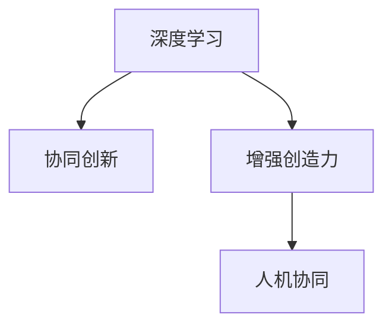

                 

# 人类-AI协作：增强创造力

> 关键词：人机协作, 增强创造力, AI赋能, 深度学习, 协同创新, 机器学习

## 1. 背景介绍

### 1.1 问题由来
在过去几十年里，人工智能(AI)技术取得了突飞猛进的发展，特别是在深度学习领域的突破，使AI在图像识别、自然语言处理、语音识别等多个领域达到了前所未有的水平。然而，AI的发展并未停止在技术层面，它正在以全新的姿态，与人类的协作深度融合，推动着各行各业产生深刻变革。

随着AI技术的不断成熟，人们开始探索其在提升人类创造力方面的潜能。AI不仅能够辅助人类完成复杂任务，还能通过模拟、模仿人类的思维过程，助力人类进行更广泛、更深入的创新活动。因此，探索人类-AI协作的机制，研究如何通过AI增强人类的创造力，成为了当前人工智能研究的一个热点方向。

### 1.2 问题核心关键点
人类-AI协作的增强创造力问题，主要集中在以下几个方面：

- **人机协同的机制**：如何建立有效的协作框架，使AI能够与人类的思维和行为同步，实现无缝对接。
- **增强创造力的方法**：如何在不牺牲人类独特性的前提下，利用AI提供的工具和方法，提高人类的创造性思维和表达能力。
- **协同创新的模式**：如何构建协同创新环境，充分发挥人机协同优势，推动跨学科、跨领域的创新活动。

这些关键点构成了人类-AI协作增强创造力的研究框架，旨在探索如何通过AI技术，辅助人类实现更高层次的创造性工作。

## 2. 核心概念与联系

### 2.1 核心概念概述

为了更好地理解人类-AI协作增强创造力的研究框架，本节将介绍几个核心概念及其相互联系：

- **深度学习**：通过多层神经网络模型，自动学习特征，并在特定任务上表现出色的一类机器学习技术。深度学习在图像、语音、文本等数据上都有广泛应用。

- **协同创新**：通过多学科、多领域的协作，共同探索未知领域，解决复杂问题，创造新的知识和技术。深度学习能够加速信息获取和处理，促进跨领域协作。

- **增强创造力**：利用AI提供的工具、算法和平台，拓展人类的认知边界，激发更广泛的创造性思维和创新活动。深度学习在自然语言处理、图像生成等方面的应用，使人类可以更加便捷地进行创意表达和探索。

- **人机协同**：在人类和AI之间建立无缝协作关系，使AI能够高效辅助人类进行复杂任务，同时保留人类独特的主观判断和创造力。

这些概念之间存在紧密联系，共同构成了一个旨在通过AI增强人类创造力的研究框架。

### 2.2 核心概念原理和架构的 Mermaid 流程图



上述图表展示了核心概念之间的联系。深度学习作为技术基础，为协同创新提供了动力，而协同创新则为增强创造力提供了平台，人机协同则确保了这些技术能够高效协作。

## 3. 核心算法原理 & 具体操作步骤

### 3.1 算法原理概述

人类-AI协作增强创造力的研究，基于深度学习模型的协同创新机制。其核心思想是通过构建人机互动的深度学习模型，使AI能够在理解人类意图的基础上，提供智能化的工具和服务，进而增强人类的创造力。

形式化地，假设存在一个深度学习模型 $M$，用于处理输入数据 $x$，输出预测结果 $y$。模型的训练目标是通过大量的标注数据 $D=\{(x_i, y_i)\}_{i=1}^N$，最小化预测误差 $L(y_i, M(x_i))$。训练好的模型 $M$ 可以作为通用的“智能助手”，辅助人类进行创新活动。

### 3.2 算法步骤详解

基于深度学习的人类-AI协作增强创造力研究，通常包括以下关键步骤：

**Step 1: 数据准备**
- 收集人类创新活动相关的数据集 $D=\{(x_i, y_i)\}_{i=1}^N$，其中 $x_i$ 表示任务输入，$y_i$ 表示任务目标或创意输出。
- 数据集需要覆盖不同的领域和场景，以保证模型具有较强的泛化能力。

**Step 2: 模型构建**
- 选择合适的深度学习模型架构，如循环神经网络(RNN)、卷积神经网络(CNN)、Transformer等，以适应不同的任务类型。
- 设计任务适配层，如Softmax、Attention、Seq2Seq等，以处理不同的任务目标。

**Step 3: 模型训练**
- 将数据集 $D$ 划分为训练集、验证集和测试集。
- 使用优化算法（如SGD、Adam等），在训练集上进行模型训练，最小化预测误差 $L(y_i, M(x_i))$。
- 在验证集上监测模型性能，调整模型参数，防止过拟合。
- 在测试集上评估模型泛化能力，保证模型能够在新数据上表现稳定。

**Step 4: 协同创新实践**
- 利用训练好的模型 $M$，作为“智能助手”，辅助人类进行创新活动。
- 收集人类与模型的交互数据，用于进一步训练和优化模型。
- 通过人机协同机制，优化模型的输入输出接口，提高用户体验。

**Step 5: 持续改进**
- 不断收集新的创新数据，重新训练模型，以适应新的任务和环境。
- 分析协同创新的效果，不断优化人机交互流程，提高创新效率。

### 3.3 算法优缺点

人类-AI协作增强创造力的算法，具有以下优点：

- **高效协同**：AI能够快速处理大量数据，提供实时的智能建议，辅助人类进行创新。
- **知识共享**：AI可以存储和检索大量知识，为人类提供丰富的背景信息和参考。
- **跨领域融合**：AI能够跨学科地处理和分析数据，促进多学科协作，加速创新进程。
- **创新启发**：AI通过模拟人类思维模式，可以提供新颖的创意和灵感。

同时，该算法也存在以下局限性：

- **数据依赖性**：模型的性能很大程度上取决于输入数据的质量和多样性。
- **模型偏见**：如果训练数据存在偏见，模型可能会放大这种偏见，产生不公正的结果。
- **人类依赖**：模型依赖人类的反馈和调整，难以完全独立进行创新。
- **可解释性不足**：深度学习模型的决策过程通常缺乏可解释性，难以理解其内部工作机制。

尽管存在这些局限性，但基于深度学习的人类-AI协作增强创造力算法，已经展现出强大的潜力，并在多个领域得到了广泛应用。

### 3.4 算法应用领域

人类-AI协作增强创造力算法已经在多个领域展现出其广泛的应用前景，具体如下：

- **艺术创作**：利用深度学习生成艺术作品、设计服装、创意文学等，辅助艺术家进行创新。
- **科学研究**：通过分析大规模数据集，提出新理论、发现新现象，加速科学研究进程。
- **商业创新**：在产品设计、市场分析、营销策略等方面，利用AI提供洞察和建议，提升企业竞争力。
- **医疗创新**：利用AI进行疾病诊断、药物研发、治疗方案设计，提高医疗服务的创新水平。
- **教育创新**：通过AI辅助教学、评估和个性化推荐，提升教育质量和创新教育模式。

## 4. 数学模型和公式 & 详细讲解 & 举例说明

### 4.1 数学模型构建

本节将使用数学语言对人类-AI协作增强创造力的研究框架进行严格描述。

假设深度学习模型 $M$ 的输入为 $x$，输出为 $y$。模型 $M$ 可以表示为多层神经网络，其中包含多个隐藏层 $h_1, h_2, ..., h_n$。模型的训练目标为最小化预测误差 $L(y_i, M(x_i))$，其中 $L$ 为损失函数，通常选择均方误差(MSE)或交叉熵(Cross-Entropy)等。

### 4.2 公式推导过程

以均方误差(MSE)作为损失函数，其公式如下：

$$
L(y_i, M(x_i)) = \frac{1}{N} \sum_{i=1}^N (y_i - M(x_i))^2
$$

模型的前向传播过程可以表示为：

$$
\hat{y}_i = M(x_i) = W_n h_n + b_n = \sigma(W_{n-1} h_{n-1} + b_{n-1}) = ... = \sigma(W_1 h_1 + b_1)
$$

其中 $W_i$ 和 $b_i$ 分别表示第 $i$ 层的权重和偏置。

模型的参数更新过程为：

$$
\theta \leftarrow \theta - \eta \nabla_{\theta} L(y_i, M(x_i)) - \eta\lambda\theta
$$

其中 $\eta$ 为学习率，$\lambda$ 为正则化系数，$\nabla_{\theta} L(y_i, M(x_i))$ 为损失函数对参数 $\theta$ 的梯度，通过反向传播算法计算得到。

### 4.3 案例分析与讲解

以生成艺术作品为例，说明如何利用深度学习增强人类创造力。

假设我们希望利用深度学习生成油画作品。首先，我们需要准备大量高质量的油画作品数据集 $D=\{(x_i, y_i)\}_{i=1}^N$，其中 $x_i$ 为作品的像素矩阵，$y_i$ 为作品的描述信息。

然后，我们设计一个生成对抗网络(GAN)，包含生成器 $G$ 和判别器 $D$。生成器 $G$ 学习将输入的噪声向量 $z$ 映射为像素矩阵 $x$，判别器 $D$ 学习区分生成的图片和真实图片。

我们通过大量标注数据对生成器和判别器进行联合训练，最小化生成器的损失函数 $L_G$ 和判别器的损失函数 $L_D$：

$$
L_G = \mathbb{E}_{z} ||G(z) - x||^2
$$
$$
L_D = \mathbb{E}_{x} \log D(x) + \mathbb{E}_{z} \log(1 - D(G(z)))
$$

训练好的生成器 $G$ 能够生成高质量的油画作品，辅助艺术家进行创作。通过不断迭代和优化，生成的作品可以逐渐逼近真实作品，提高艺术家的创新效率。

## 5. 项目实践：代码实例和详细解释说明

### 5.1 开发环境搭建

在进行人类-AI协作增强创造力的项目实践前，我们需要准备好开发环境。以下是使用Python进行TensorFlow开发的环境配置流程：

1. 安装Anaconda：从官网下载并安装Anaconda，用于创建独立的Python环境。

2. 创建并激活虚拟环境：
```bash
conda create -n tf-env python=3.8 
conda activate tf-env
```

3. 安装TensorFlow：根据CUDA版本，从官网获取对应的安装命令。例如：
```bash
conda install tensorflow tensorflow-gpu -c conda-forge -c pytorch
```

4. 安装TensorBoard：
```bash
pip install tensorboard
```

5. 安装TensorFlow Addons：
```bash
pip install tensorflow-addons
```

6. 安装PyTorch：
```bash
pip install torch torchvision torchaudio
```

完成上述步骤后，即可在`tf-env`环境中开始实践项目。

### 5.2 源代码详细实现

下面我们以艺术创作项目为例，给出使用TensorFlow和TensorFlow Addons进行GAN模型训练的Python代码实现。

首先，定义GAN模型：

```python
import tensorflow as tf
from tensorflow.keras.layers import Input, Dense, Flatten, Reshape, Conv2D, Conv2DTranspose, BatchNormalization
from tensorflow.keras.models import Model
from tensorflow.keras.losses import BinaryCrossentropy

class Generator(tf.keras.Model):
    def __init__(self, latent_dim):
        super(Generator, self).__init__()
        self.latent_dim = latent_dim
        self.dense = Dense(256 * 8 * 8, use_bias=False)
        self.reshape = Reshape((8, 8, 256))
        self.conv1 = Conv2DTranspose(128, (5, 5), strides=(1, 1), padding='same', use_bias=False)
        self.conv2 = Conv2DTranspose(64, (5, 5), strides=(2, 2), padding='same', use_bias=False)
        self.conv3 = Conv2DTranspose(3, (5, 5), strides=(2, 2), padding='same', use_bias=False)
        self.bn1 = BatchNormalization()
        self.bn2 = BatchNormalization()
        self.bn3 = BatchNormalization()

    def call(self, x):
        x = self.dense(x)
        x = self.reshape(x)
        x = self.conv1(x)
        x = self.bn1(x)
        x = self.conv2(x)
        x = self.bn2(x)
        x = self.conv3(x)
        x = self.bn3(x)
        return x

class Discriminator(tf.keras.Model):
    def __init__(self):
        super(Discriminator, self).__init__()
        self.flatten = Flatten()
        self.dense1 = Dense(512)
        self.dense2 = Dense(256)
        self.dense3 = Dense(1)

    def call(self, x):
        x = self.flatten(x)
        x = self.dense1(x)
        x = self.dense2(x)
        x = self.dense3(x)
        return x

def build_model(latent_dim):
    inputs = Input(shape=(latent_dim,))
    x = Generator(inputs)
    outputs = Discriminator(x)
    discriminator_model = Model(inputs, outputs)
    return discriminator_model
```

然后，定义优化器和损失函数：

```python
generator_model = build_model(latent_dim)
discriminator_model = build_model(latent_dim)
cross_entropy = BinaryCrossentropy()

generator_optimizer = tf.keras.optimizers.Adam(learning_rate=0.0002, beta_1=0.5)
discriminator_optimizer = tf.keras.optimizers.Adam(learning_rate=0.0002, beta_1=0.5)

def train_step(inputs):
    with tf.GradientTape() as gen_tape, tf.GradientTape() as disc_tape:
        generated_images = generator_model(inputs)
        real_images = tf.random.normal([batch_size, latent_dim])
        real_images = discriminator_model(real_images)
        gen_loss = cross_entropy(discriminator_model(generated_images), tf.ones_like(discriminator_model(generated_images)))
        disc_loss = cross_entropy(discriminator_model(generated_images), tf.zeros_like(discriminator_model(generated_images)) +
                     cross_entropy(discriminator_model(real_images), tf.ones_like(discriminator_model(real_images)))
    gradients_of_generator = gen_tape.gradient(gen_loss, generator_model.trainable_variables)
    gradients_of_discriminator = disc_tape.gradient(disc_loss, discriminator_model.trainable_variables)
    generator_optimizer.apply_gradients(zip(gradients_of_generator, generator_model.trainable_variables))
    discriminator_optimizer.apply_gradients(zip(gradients_of_discriminator, discriminator_model.trainable_variables))
    return gen_loss, disc_loss
```

最后，启动训练流程：

```python
batch_size = 64
epochs = 1000

for epoch in range(epochs):
    gen_loss, disc_loss = train_step(train_images)
    print(f'Epoch {epoch+1}/{epochs}, Generator Loss: {gen_loss.numpy()}, Discriminator Loss: {disc_loss.numpy()}')
```

以上就是使用TensorFlow和TensorFlow Addons进行GAN模型训练的完整代码实现。可以看到，借助TensorFlow丰富的组件库，代码实现相对简洁高效。

### 5.3 代码解读与分析

让我们再详细解读一下关键代码的实现细节：

**Generator类**：
- `__init__`方法：定义了生成器的结构，包括多个卷积层和批量归一化层。
- `call`方法：实现了生成器的前向传播过程，将输入的噪声向量映射为像素矩阵。

**Discriminator类**：
- `__init__`方法：定义了判别器的结构，包括多个全连接层。
- `call`方法：实现了判别器的前向传播过程，输出对输入图片的判别结果。

**train_step函数**：
- 使用`tf.GradientTape`记录梯度。
- 计算生成器和判别器的损失函数，并回传梯度，更新模型参数。

**训练流程**：
- 定义批量大小和训练轮数，开始循环迭代
- 在每个epoch内，对训练集进行前向传播和反向传播，计算损失
- 在每个epoch结束时，输出当前损失，完成一轮训练

## 6. 实际应用场景

### 6.1 智能创作

人类-AI协作增强创造力在智能创作领域具有广泛的应用前景。艺术、音乐、文学等领域，艺术家可以利用AI生成的作品或创意，激发自己的灵感，进行创新创作。

例如，在绘画领域，艺术家可以利用GAN生成逼真的油画作品，在创作过程中进行参考和借鉴。在音乐领域，AI可以生成旋律和和弦，辅助作曲家创作新的作品。在文学领域，AI可以生成小说情节和对话，辅助作者进行创作。

### 6.2 科学研究

科学研究是人类-AI协作增强创造力的另一重要应用领域。利用深度学习对海量数据进行分析和处理，可以提出新理论、发现新现象，加速科学研究进程。

例如，在生物医学领域，AI可以通过分析大规模基因组数据，发现新的基因与疾病之间的关系。在物理学领域，AI可以通过对大量实验数据的分析，提出新的物理模型。在天文学领域，AI可以通过对天文观测数据的分析，发现新的天体和现象。

### 6.3 商业创新

商业创新也是人类-AI协作增强创造力的重要应用方向。在产品设计、市场分析、营销策略等方面，AI可以提供实时的智能建议，帮助企业进行创新和优化。

例如，在产品设计领域，AI可以生成创意草图，辅助设计师进行设计。在市场分析领域，AI可以分析用户行为和市场趋势，提出新的市场策略。在营销策略领域，AI可以生成广告文案和营销计划，提高广告投放效果。

## 7. 工具和资源推荐

### 7.1 学习资源推荐

为了帮助开发者系统掌握人类-AI协作增强创造力的理论基础和实践技巧，这里推荐一些优质的学习资源：

1. 《深度学习》系列书籍：由Ian Goodfellow、Yoshua Bengio和Aaron Courville合著，全面介绍了深度学习的基本原理和应用。
2. TensorFlow官方文档：提供详细的TensorFlow框架介绍和教程，适合初学者和高级开发者。
3. TensorFlow Addons官方文档：提供丰富的TensorFlow组件和工具，适合开发复杂模型和应用。
4. Coursera《深度学习专项课程》：由深度学习领域的顶尖专家讲授，涵盖深度学习的基本原理和应用。
5. ArXiv论文库：提供大量前沿的深度学习论文，适合深入研究最新技术和算法。

通过这些资源的学习实践，相信你一定能够快速掌握人类-AI协作增强创造力的精髓，并用于解决实际的创新问题。

### 7.2 开发工具推荐

高效的开发离不开优秀的工具支持。以下是几款用于人类-AI协作增强创造力开发的常用工具：

1. TensorFlow：由Google主导开发的开源深度学习框架，生产部署方便，适合大规模工程应用。
2. TensorFlow Addons：提供丰富的深度学习组件和工具，适合开发复杂模型和应用。
3. TensorBoard：TensorFlow配套的可视化工具，可实时监测模型训练状态，提供丰富的图表呈现方式。
4. Weights & Biases：模型训练的实验跟踪工具，可以记录和可视化模型训练过程中的各项指标，方便对比和调优。
5. PyTorch：基于Python的开源深度学习框架，灵活动态的计算图，适合快速迭代研究。

合理利用这些工具，可以显著提升人类-AI协作增强创造力的开发效率，加快创新迭代的步伐。

### 7.3 相关论文推荐

人类-AI协作增强创造力的研究源于学界的持续研究。以下是几篇奠基性的相关论文，推荐阅读：

1. "Generative Adversarial Nets"（即GAN论文）：Ian Goodfellow等人在NIPS 2014年提出，为生成式模型提供了新的思路。
2. "Deep Learning for Large-Scale Adversarial Object Tracking"：利用深度学习模型进行目标跟踪，展示了深度学习在计算机视觉中的应用。
3. "Transformers are Artistic Style Transfer Agents"：利用Transformer模型进行艺术风格的迁移，展示了深度学习在艺术创作中的应用。
4. "Beyond Feasibility: Maximizing Creativity in Generative AI"：探讨如何通过生成式模型最大化人类的创造力。
5. "Creative Deep Learning"：利用深度学习进行创造性思维和表达，展示了深度学习在创新活动中的应用。

这些论文代表了大语言模型微调技术的发展脉络。通过学习这些前沿成果，可以帮助研究者把握学科前进方向，激发更多的创新灵感。

## 8. 总结：未来发展趋势与挑战

### 8.1 研究成果总结

人类-AI协作增强创造力的研究已经取得了一系列重要成果，主要集中在以下几个方面：

1. 深度学习模型的广泛应用：深度学习模型在艺术创作、科学研究、商业创新等多个领域得到了广泛应用，展示了其在增强人类创造力方面的潜力。
2. 协同创新环境的构建：通过构建协同创新环境，使AI能够高效辅助人类进行创新活动，加速跨学科、跨领域的创新进程。
3. 人机协同机制的设计：通过设计人机协同机制，优化模型的输入输出接口，提高用户体验。

这些成果为人类-AI协作增强创造力的研究提供了坚实的理论基础和实践经验。

### 8.2 未来发展趋势

展望未来，人类-AI协作增强创造力的研究将呈现以下几个发展趋势：

1. 模型结构的复杂化：随着深度学习技术的不断进步，未来的模型将具备更强的表达能力和学习能力，可以处理更复杂的任务和数据。
2. 数据多样性的增加：未来数据集将更加多样化和全面化，涵盖更多领域的创新活动，为AI提供更丰富的训练数据。
3. 人机协同的增强：未来将更加注重人机协同机制的设计，通过自然语言交互、多模态信息融合等方式，提高人机协作的效率和效果。
4. 跨领域融合的加速：未来的AI将更加注重跨学科的融合，利用多领域的数据和知识，提供更全面的智能辅助。
5. 伦理道德的重视：未来的AI将更加注重伦理道德的考量，确保AI的决策过程公正、透明，避免对人类造成潜在的危害。

以上趋势凸显了人类-AI协作增强创造力的广阔前景。这些方向的探索发展，必将进一步推动人工智能技术的进步，为人类的创造性活动提供更加强大和智能的支撑。

### 8.3 面临的挑战

尽管人类-AI协作增强创造力的研究已经取得了显著进展，但仍面临以下挑战：

1. 数据隐私和安全：如何在保证数据隐私和安全的前提下，充分利用数据进行创新活动，是一个重要的挑战。
2. 模型可解释性：深度学习模型的决策过程通常缺乏可解释性，难以理解其内部工作机制，这可能会影响用户对AI的信任。
3. 伦理道德问题：AI在创新活动中可能引发伦理道德问题，如版权争议、偏见和歧视等，需要加以重视和规范。
4. 硬件资源限制：深度学习模型的计算需求高，需要高性能的硬件资源支持，如何优化模型的计算效率和资源使用，是一个重要的挑战。
5. 多领域协作的复杂性：不同领域的知识和数据具有高度异构性，如何在多领域协作中实现无缝对接，是一个复杂的问题。

这些挑战需要通过技术进步、制度完善和伦理规范等多种方式，逐步加以解决。

### 8.4 研究展望

面对人类-AI协作增强创造力研究面临的挑战，未来的研究方向可以在以下几个方面进行探索：

1. 数据隐私和安全技术：研究如何在保护数据隐私的前提下，充分利用数据进行创新活动，如差分隐私、联邦学习等技术。
2. 模型可解释性研究：研究如何提高深度学习模型的可解释性，如可解释性模型、透明学习等方法。
3. 伦理道德规范：研究如何制定AI在创新活动中的伦理道德规范，确保AI的决策过程公正、透明，避免对人类造成潜在的危害。
4. 硬件资源优化：研究如何优化深度学习模型的计算效率和资源使用，如模型压缩、硬件加速等技术。
5. 跨领域协作机制：研究如何在多领域协作中实现无缝对接，如多模态信息融合、跨学科知识库等技术。

这些研究方向的探索，将为人类-AI协作增强创造力的研究提供新的突破点，进一步推动人工智能技术的发展和应用。

## 9. 附录：常见问题与解答

**Q1：如何理解人类-AI协作增强创造力的含义？**

A: 人类-AI协作增强创造力是指通过深度学习等人工智能技术，辅助人类进行创新活动，提升人类在艺术创作、科学研究、商业创新等领域的创造性思维和表达能力。通过人机协同，AI能够提供实时的智能建议，辅助人类进行创意创作和优化决策。

**Q2：人类-AI协作增强创造力的实现方式有哪些？**

A: 人类-AI协作增强创造力的实现方式包括但不限于：
1. 利用深度学习生成艺术作品、设计方案等，辅助艺术家进行创作。
2. 利用深度学习分析海量数据，提出新理论、发现新现象，加速科学研究进程。
3. 利用深度学习提供洞察和建议，帮助企业进行产品设计、市场分析、营销策略等创新活动。

**Q3：人类-AI协作增强创造力在实际应用中面临哪些挑战？**

A: 人类-AI协作增强创造力在实际应用中面临以下挑战：
1. 数据隐私和安全问题：如何在保护数据隐私的前提下，充分利用数据进行创新活动。
2. 模型可解释性问题：深度学习模型的决策过程缺乏可解释性，难以理解其内部工作机制。
3. 伦理道德问题：AI在创新活动中可能引发伦理道德问题，如版权争议、偏见和歧视等。
4. 硬件资源限制：深度学习模型的计算需求高，需要高性能的硬件资源支持。
5. 多领域协作的复杂性：不同领域的知识和数据具有高度异构性，如何在多领域协作中实现无缝对接。

**Q4：如何构建人类-AI协作增强创造力的协同创新环境？**

A: 构建人类-AI协作增强创造力的协同创新环境需要以下关键要素：
1. 数据共享平台：建立多学科、多领域的数据共享平台，确保数据的开放和共享。
2. 智能工具支持：开发智能工具，如AI辅助设计、AI文本生成等，辅助人类进行创新活动。
3. 协同工作平台：构建协同工作平台，实现跨学科、跨领域的协作，促进知识交流和创新合作。
4. 反馈机制设计：设计高效的反馈机制，及时获取创新活动的效果反馈，优化协同创新过程。
5. 伦理规范制定：制定伦理规范，确保AI的决策过程公正、透明，避免对人类造成潜在的危害。

这些关键要素的协同发挥，将构建更加高效、智能的协同创新环境，推动人类-AI协作增强创造力的发展。

---

作者：禅与计算机程序设计艺术 / Zen and the Art of Computer Programming

