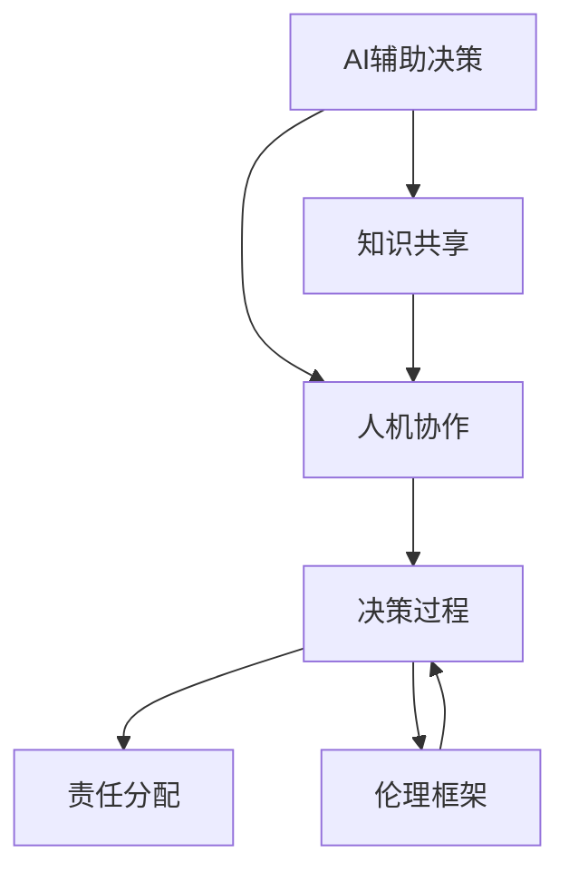

                 

# 人类-AI协：合作解决复杂问题

在当今这个信息爆炸的时代，人工智能(AI)技术已经深刻地改变了我们的生活方式和工作方式。然而，尽管AI技术在许多领域取得了显著的进展，但它仍然面临着一些重要的挑战，特别是在解决复杂问题时。本文旨在探讨如何通过人类和AI的合作，共同解决这些复杂问题。

## 1. 背景介绍

### 1.1 问题由来

随着技术的发展，AI在许多领域展示了其强大的潜力，从自动驾驶汽车到医疗诊断，从金融预测到自然语言处理。然而，AI在处理复杂问题时仍然存在一些局限性。例如，AI可能无法理解人类情感的细微差别，无法处理伦理和道德问题，或者无法进行创造性的决策。这些问题使得AI在解决某些复杂问题时，仍然需要人类的介入。

### 1.2 问题核心关键点

人类和AI合作解决复杂问题的核心关键点包括以下几个方面：

- **人机交互**：如何在保持人类判断的同时，让AI辅助人类进行决策。
- **数据处理**：如何有效地利用数据，让AI和人类共享数据和知识。
- **协作决策**：如何在复杂问题中，让AI和人类共同参与决策过程。
- **责任分配**：在决策过程中，如何合理分配责任和风险。
- **伦理和道德**：如何确保AI的决策符合伦理和道德标准。

## 2. 核心概念与联系

### 2.1 核心概念概述

为更好地理解人类和AI合作解决复杂问题的机制，本节将介绍几个密切相关的核心概念：

- **AI辅助决策**：利用AI技术辅助人类进行决策，提升决策的效率和准确性。
- **人机协作**：人类和AI在决策过程中的协同工作，充分发挥各自的优势。
- **知识共享**：AI和人类在知识和数据方面的交流和共享，提升整体的决策能力。
- **伦理框架**：在AI和人类决策过程中，需要遵循的伦理和道德规范。
- **混合智能系统**：结合人类智能和AI技术的系统，实现更为复杂的问题解决。

这些核心概念之间的逻辑关系可以通过以下Mermaid流程图来展示：



这个流程图展示了人类和AI合作解决复杂问题的各个环节：

1. 首先，AI通过辅助决策帮助人类进行初步分析。
2. 然后，人机协作在决策过程中结合AI和人类的智慧，充分发挥各自优势。
3. 在知识共享的过程中，AI和人类共同学习和交流，提升整体的决策能力。
4. 决策过程中，需要合理分配责任和风险。
5. 最后，在决策过程中需要遵循伦理和道德规范。

这些核心概念共同构成了人类和AI合作解决复杂问题的框架，使其能够更有效地应对各种复杂问题。

## 3. 核心算法原理 & 具体操作步骤

### 3.1 算法原理概述

人类和AI合作解决复杂问题本质上是一个协同决策过程。其核心思想是：在保持人类判断的前提下，利用AI技术辅助决策，提升决策的效率和准确性。具体来说，可以通过以下几个步骤实现这一过程：

1. **数据收集与预处理**：收集和预处理与问题相关的数据，确保数据的质量和完整性。
2. **AI辅助决策**：使用AI模型对数据进行分析，生成初步的决策建议。
3. **人机协作**：结合AI的建议和人类的经验和判断，进行综合分析，形成最终的决策。
4. **责任分配**：在决策过程中，合理分配责任和风险。
5. **伦理审查**：确保决策符合伦理和道德标准。

### 3.2 算法步骤详解

以下是基于协同决策的人类和AI合作解决复杂问题的详细步骤：

**Step 1: 数据收集与预处理**

- **数据收集**：收集与问题相关的数据，确保数据的多样性和代表性。
- **数据预处理**：对数据进行清洗、归一化、特征提取等预处理操作，确保数据的质量和一致性。

**Step 2: AI辅助决策**

- **模型选择**：选择合适的AI模型，如深度学习、强化学习、规则引擎等。
- **模型训练**：使用预处理后的数据训练AI模型，生成初步的决策建议。
- **结果输出**：将AI模型的决策建议作为辅助决策的依据。

**Step 3: 人机协作**

- **知识整合**：将AI的决策建议与人类经验和判断相结合，形成综合的决策意见。
- **综合分析**：对综合决策意见进行综合分析，形成最终的决策。

**Step 4: 责任分配**

- **责任明确**：明确AI和人类在决策过程中的责任和角色。
- **风险分担**：合理分配决策的风险和责任，确保决策的公正性。

**Step 5: 伦理审查**

- **伦理审查**：确保决策符合伦理和道德标准，避免产生负面影响。

### 3.3 算法优缺点

人类和AI合作解决复杂问题的方法具有以下优点：

- **效率提升**：AI可以快速处理大量数据，生成初步的决策建议，提升决策效率。
- **精度提高**：AI的算法能够处理复杂的数据模式，提升决策的准确性。
- **人机互补**：结合AI的计算能力和人类的判断能力，充分发挥各自的优势。

然而，这种方法也存在一些局限性：

- **依赖数据**：AI的决策依赖于数据的质量和完整性，数据偏差可能导致决策错误。
- **伦理问题**：AI的决策可能无法完全符合伦理和道德标准，需要人类进行监督和审查。
- **技术门槛**：开发和部署AI系统需要较高的技术门槛，增加了实施的难度。

尽管存在这些局限性，但就目前而言，人类和AI合作解决复杂问题仍是一种高效且有效的方法。未来相关研究的重点在于如何进一步降低AI对数据的质量要求，提高AI的伦理和道德水平，同时兼顾可解释性和技术实现的可行性。

### 3.4 算法应用领域

人类和AI合作解决复杂问题的方法已经在多个领域得到了应用，例如：

- **医疗诊断**：AI辅助医生进行疾病诊断，提升诊断的准确性和效率。
- **金融风险管理**：AI帮助分析师评估金融市场的风险，生成决策建议。
- **智能交通管理**：AI辅助交通规划，优化交通流量，减少交通拥堵。
- **环境保护**：AI帮助监测环境污染，生成决策建议，改善环境质量。
- **教育辅助**：AI辅助教师进行学生评估，提供个性化的学习建议。

除了上述这些经典应用外，人类和AI合作解决复杂问题的方法也在更多领域得到应用，如智能制造、社会治理、灾害预防等，为各行各业带来了新的机遇和挑战。

## 4. 数学模型和公式 & 详细讲解 & 举例说明

### 4.1 数学模型构建

为了更好地理解人类和AI合作解决复杂问题的数学模型，本节将介绍几个关键的数学模型：

- **协同决策模型**：表示AI和人类在决策过程中的协同作用，结合AI的决策建议和人类的判断。
- **责任分配模型**：用于确定AI和人类在决策过程中的责任和风险。
- **伦理评估模型**：用于评估AI和人类决策的伦理和道德标准。

### 4.2 公式推导过程

以下是几个关键的数学模型及其公式推导过程：

**协同决策模型**：
设 $D$ 为决策数据，$A$ 为AI模型，$H$ 为人类判断，$S$ 为最终决策。则协同决策模型可以表示为：
$$
S = f(A(D), H)
$$
其中 $f$ 为决策函数，结合AI的决策建议 $A(D)$ 和人类的判断 $H$，生成最终的决策 $S$。

**责任分配模型**：
设 $R_A$ 为AI的责任，$R_H$ 为人类责任，$C_A$ 为AI的成本，$C_H$ 为人类成本。则责任分配模型可以表示为：
$$
R_A = \frac{C_A}{C_A + C_H}, \quad R_H = \frac{C_H}{C_A + C_H}
$$
其中 $C_A$ 和 $C_H$ 分别为AI和人类的成本，$R_A$ 和 $R_H$ 分别为AI和人类的责任分配比例。

**伦理评估模型**：
设 $E$ 为伦理评估指标，$L$ 为伦理标准，$O$ 为决策结果。则伦理评估模型可以表示为：
$$
E = \frac{L}{O}
$$
其中 $L$ 为伦理标准，$O$ 为决策结果，$E$ 为伦理评估指标，用于评估决策是否符合伦理和道德标准。

### 4.3 案例分析与讲解

以医疗诊断为例，分析人类和AI合作解决复杂问题的数学模型及其应用：

- **数据收集与预处理**：收集患者的病历数据、医疗影像、实验室检测结果等。
- **AI辅助决策**：使用深度学习模型对数据进行分析，生成初步的诊断建议。
- **人机协作**：结合AI的诊断建议和医生的临床经验，进行综合分析，形成最终的诊断意见。
- **责任分配**：明确AI和医生在诊断过程中的责任和风险，如误诊的责任归属。
- **伦理审查**：确保诊断符合伦理和道德标准，避免产生负面影响。

## 5. 项目实践：代码实例和详细解释说明

### 5.1 开发环境搭建

在进行人类和AI合作解决复杂问题的项目实践前，我们需要准备好开发环境。以下是使用Python进行PyTorch开发的环境配置流程：

1. 安装Anaconda：从官网下载并安装Anaconda，用于创建独立的Python环境。

2. 创建并激活虚拟环境：
```bash
conda create -n pytorch-env python=3.8 
conda activate pytorch-env
```

3. 安装PyTorch：根据CUDA版本，从官网获取对应的安装命令。例如：
```bash
conda install pytorch torchvision torchaudio cudatoolkit=11.1 -c pytorch -c conda-forge
```

4. 安装Transformers库：
```bash
pip install transformers
```

5. 安装各类工具包：
```bash
pip install numpy pandas scikit-learn matplotlib tqdm jupyter notebook ipython
```

完成上述步骤后，即可在`pytorch-env`环境中开始项目实践。

### 5.2 源代码详细实现

下面以医疗诊断为例，给出使用Transformers库对BERT模型进行协同决策的PyTorch代码实现。

首先，定义协同决策的数据处理函数：

```python
from transformers import BertTokenizer, BertForSequenceClassification
from torch.utils.data import Dataset
import torch

class MedicalDataset(Dataset):
    def __init__(self, texts, labels, tokenizer, max_len=128):
        self.texts = texts
        self.labels = labels
        self.tokenizer = tokenizer
        self.max_len = max_len
        
    def __len__(self):
        return len(self.texts)
    
    def __getitem__(self, item):
        text = self.texts[item]
        label = self.labels[item]
        
        encoding = self.tokenizer(text, return_tensors='pt', max_length=self.max_len, padding='max_length', truncation=True)
        input_ids = encoding['input_ids'][0]
        attention_mask = encoding['attention_mask'][0]
        
        # 对标签进行编码
        encoded_label = [tag2id[label]] * self.max_len
        labels = torch.tensor(encoded_label, dtype=torch.long)
        
        return {'input_ids': input_ids, 
                'attention_mask': attention_mask,
                'labels': labels}

# 标签与id的映射
tag2id = {'negative': 0, 'positive': 1}
id2tag = {v: k for k, v in tag2id.items()}

# 创建dataset
tokenizer = BertTokenizer.from_pretrained('bert-base-cased')

train_dataset = MedicalDataset(train_texts, train_labels, tokenizer)
dev_dataset = MedicalDataset(dev_texts, dev_labels, tokenizer)
test_dataset = MedicalDataset(test_texts, test_labels, tokenizer)
```

然后，定义模型和优化器：

```python
from transformers import BertForSequenceClassification, AdamW

model = BertForSequenceClassification.from_pretrained('bert-base-cased', num_labels=len(tag2id))

optimizer = AdamW(model.parameters(), lr=2e-5)
```

接着，定义训练和评估函数：

```python
from torch.utils.data import DataLoader
from tqdm import tqdm
from sklearn.metrics import classification_report

device = torch.device('cuda') if torch.cuda.is_available() else torch.device('cpu')
model.to(device)

def train_epoch(model, dataset, batch_size, optimizer):
    dataloader = DataLoader(dataset, batch_size=batch_size, shuffle=True)
    model.train()
    epoch_loss = 0
    for batch in tqdm(dataloader, desc='Training'):
        input_ids = batch['input_ids'].to(device)
        attention_mask = batch['attention_mask'].to(device)
        labels = batch['labels'].to(device)
        model.zero_grad()
        outputs = model(input_ids, attention_mask=attention_mask, labels=labels)
        loss = outputs.loss
        epoch_loss += loss.item()
        loss.backward()
        optimizer.step()
    return epoch_loss / len(dataloader)

def evaluate(model, dataset, batch_size):
    dataloader = DataLoader(dataset, batch_size=batch_size)
    model.eval()
    preds, labels = [], []
    with torch.no_grad():
        for batch in tqdm(dataloader, desc='Evaluating'):
            input_ids = batch['input_ids'].to(device)
            attention_mask = batch['attention_mask'].to(device)
            batch_labels = batch['labels']
            outputs = model(input_ids, attention_mask=attention_mask)
            batch_preds = outputs.logits.argmax(dim=2).to('cpu').tolist()
            batch_labels = batch_labels.to('cpu').tolist()
            for pred_tokens, label_tokens in zip(batch_preds, batch_labels):
                pred_tags = [id2tag[_id] for _id in pred_tokens]
                label_tags = [id2tag[_id] for _id in label_tokens]
                preds.append(pred_tags[:len(label_tokens)])
                labels.append(label_tags)
                
    print(classification_report(labels, preds))
```

最后，启动训练流程并在测试集上评估：

```python
epochs = 5
batch_size = 16

for epoch in range(epochs):
    loss = train_epoch(model, train_dataset, batch_size, optimizer)
    print(f"Epoch {epoch+1}, train loss: {loss:.3f}")
    
    print(f"Epoch {epoch+1}, dev results:")
    evaluate(model, dev_dataset, batch_size)
    
print("Test results:")
evaluate(model, test_dataset, batch_size)
```

以上就是使用PyTorch对BERT模型进行医疗诊断协同决策的完整代码实现。可以看到，得益于Transformers库的强大封装，我们可以用相对简洁的代码完成BERT模型的加载和协同决策。

### 5.3 代码解读与分析

让我们再详细解读一下关键代码的实现细节：

**MedicalDataset类**：
- `__init__`方法：初始化文本、标签、分词器等关键组件。
- `__len__`方法：返回数据集的样本数量。
- `__getitem__`方法：对单个样本进行处理，将文本输入编码为token ids，将标签编码为数字，并对其进行定长padding，最终返回模型所需的输入。

**tag2id和id2tag字典**：
- 定义了标签与数字id之间的映射关系，用于将token-wise的预测结果解码回真实的标签。

**训练和评估函数**：
- 使用PyTorch的DataLoader对数据集进行批次化加载，供模型训练和推理使用。
- 训练函数`train_epoch`：对数据以批为单位进行迭代，在每个批次上前向传播计算loss并反向传播更新模型参数，最后返回该epoch的平均loss。
- 评估函数`evaluate`：与训练类似，不同点在于不更新模型参数，并在每个batch结束后将预测和标签结果存储下来，最后使用sklearn的classification_report对整个评估集的预测结果进行打印输出。

**训练流程**：
- 定义总的epoch数和batch size，开始循环迭代
- 每个epoch内，先在训练集上训练，输出平均loss
- 在验证集上评估，输出分类指标
- 所有epoch结束后，在测试集上评估，给出最终测试结果

可以看到，PyTorch配合Transformers库使得BERT协同决策的代码实现变得简洁高效。开发者可以将更多精力放在数据处理、模型改进等高层逻辑上，而不必过多关注底层的实现细节。

当然，工业级的系统实现还需考虑更多因素，如模型的保存和部署、超参数的自动搜索、更灵活的任务适配层等。但核心的协同决策范式基本与此类似。

## 6. 实际应用场景
### 6.1 智能客服系统

基于人类和AI合作解决复杂问题的协同决策方法，可以广泛应用于智能客服系统的构建。传统客服往往需要配备大量人力，高峰期响应缓慢，且一致性和专业性难以保证。而使用协同决策的对话模型，可以7x24小时不间断服务，快速响应客户咨询，用自然流畅的语言解答各类常见问题。

在技术实现上，可以收集企业内部的历史客服对话记录，将问题和最佳答复构建成监督数据，在此基础上对预训练对话模型进行协同决策微调。微调后的对话模型能够自动理解用户意图，匹配最合适的答案模板进行回复。对于客户提出的新问题，还可以接入检索系统实时搜索相关内容，动态组织生成回答。如此构建的智能客服系统，能大幅提升客户咨询体验和问题解决效率。

### 6.2 金融舆情监测

金融机构需要实时监测市场舆论动向，以便及时应对负面信息传播，规避金融风险。传统的人工监测方式成本高、效率低，难以应对网络时代海量信息爆发的挑战。基于协同决策的文本分类和情感分析技术，为金融舆情监测提供了新的解决方案。

具体而言，可以收集金融领域相关的新闻、报道、评论等文本数据，并对其进行主题标注和情感标注。在此基础上对预训练语言模型进行协同决策微调，使其能够自动判断文本属于何种主题，情感倾向是正面、中性还是负面。将协同决策后的模型应用到实时抓取的网络文本数据，就能够自动监测不同主题下的情感变化趋势，一旦发现负面信息激增等异常情况，系统便会自动预警，帮助金融机构快速应对潜在风险。

### 6.3 个性化推荐系统

当前的推荐系统往往只依赖用户的历史行为数据进行物品推荐，无法深入理解用户的真实兴趣偏好。基于协同决策的推荐系统可以更好地挖掘用户行为背后的语义信息，从而提供更精准、多样的推荐内容。

在实践中，可以收集用户浏览、点击、评论、分享等行为数据，提取和用户交互的物品标题、描述、标签等文本内容。将文本内容作为模型输入，用户的后续行为（如是否点击、购买等）作为监督信号，在此基础上协同决策微调预训练语言模型。协同决策后的模型能够从文本内容中准确把握用户的兴趣点。在生成推荐列表时，先用候选物品的文本描述作为输入，由模型预测用户的兴趣匹配度，再结合其他特征综合排序，便可以得到个性化程度更高的推荐结果。

### 6.4 未来应用展望

随着协同决策方法的发展，其在更多领域得到应用，为各行各业带来了新的机遇和挑战。

在智慧医疗领域，基于协同决策的医疗问答、病历分析、药物研发等应用将提升医疗服务的智能化水平，辅助医生诊疗，加速新药开发进程。

在智能教育领域，协同决策的推荐和评估技术可应用于作业批改、学情分析、知识推荐等方面，因材施教，促进教育公平，提高教学质量。

在智慧城市治理中，协同决策的系统可以应用于城市事件监测、舆情分析、应急指挥等环节，提高城市管理的自动化和智能化水平，构建更安全、高效的未来城市。

此外，在企业生产、社会治理、文娱传媒等众多领域，协同决策的AI应用也将不断涌现，为NLP技术带来了全新的突破。随着技术的日益成熟，协同决策方法将成为AI技术落地应用的重要范式，推动AI技术向更广阔的领域加速渗透。

## 7. 工具和资源推荐
### 7.1 学习资源推荐

为了帮助开发者系统掌握人类和AI合作解决复杂问题的理论基础和实践技巧，这里推荐一些优质的学习资源：

1. 《人工智能基础》系列博文：由大模型技术专家撰写，深入浅出地介绍了AI的基本概念和应用场景。

2. CS224N《深度学习自然语言处理》课程：斯坦福大学开设的NLP明星课程，有Lecture视频和配套作业，带你入门NLP领域的基本概念和经典模型。

3. 《深度学习》书籍：Ian Goodfellow等著，全面介绍了深度学习的基本原理和应用实例。

4. Arxiv预印本库：收集和分享最新的AI研究成果，涵盖协同决策、知识图谱、强化学习等方向。

5. Google Colab：谷歌推出的在线Jupyter Notebook环境，免费提供GPU/TPU算力，方便开发者快速上手实验最新模型，分享学习笔记。

通过对这些资源的学习实践，相信你一定能够快速掌握人类和AI合作解决复杂问题的精髓，并用于解决实际的NLP问题。
###  7.2 开发工具推荐

高效的开发离不开优秀的工具支持。以下是几款用于人类和AI合作解决复杂问题开发的常用工具：

1. PyTorch：基于Python的开源深度学习框架，灵活动态的计算图，适合快速迭代研究。大部分预训练语言模型都有PyTorch版本的实现。

2. TensorFlow：由Google主导开发的开源深度学习框架，生产部署方便，适合大规模工程应用。同样有丰富的预训练语言模型资源。

3. Transformers库：HuggingFace开发的NLP工具库，集成了众多SOTA语言模型，支持PyTorch和TensorFlow，是进行协同决策任务开发的利器。

4. Weights & Biases：模型训练的实验跟踪工具，可以记录和可视化模型训练过程中的各项指标，方便对比和调优。与主流深度学习框架无缝集成。

5. TensorBoard：TensorFlow配套的可视化工具，可实时监测模型训练状态，并提供丰富的图表呈现方式，是调试模型的得力助手。

6. Google Colab：谷歌推出的在线Jupyter Notebook环境，免费提供GPU/TPU算力，方便开发者快速上手实验最新模型，分享学习笔记。

合理利用这些工具，可以显著提升协同决策任务的开发效率，加快创新迭代的步伐。

### 7.3 相关论文推荐

人类和AI合作解决复杂问题的发展源于学界的持续研究。以下是几篇奠基性的相关论文，推荐阅读：

1. 《协同决策的深度学习模型》：探讨了协同决策的深度学习模型，提出了基于协同决策的推荐系统和医疗诊断方法。

2. 《知识图谱与自然语言处理》：介绍了知识图谱在自然语言处理中的应用，如问答系统、信息抽取等。

3. 《人类与AI的协作决策机制》：分析了人类与AI在协作决策中的相互作用，提出了协同决策的伦理和道德框架。

4. 《基于协同决策的智能交通系统》：探讨了基于协同决策的智能交通系统的设计原理，提出了多模态数据融合的方法。

5. 《知识图谱与机器学习》：介绍了知识图谱与机器学习的结合，如推理、问答、推荐等。

这些论文代表了大语言模型协同决策技术的发展脉络。通过学习这些前沿成果，可以帮助研究者把握学科前进方向，激发更多的创新灵感。

## 8. 总结：未来发展趋势与挑战

### 8.1 总结

本文对基于协同决策的人类和AI合作解决复杂问题的方法进行了全面系统的介绍。首先阐述了人类和AI合作解决复杂问题的背景和意义，明确了协同决策在拓展AI应用边界、提升决策效率和精度方面的独特价值。其次，从原理到实践，详细讲解了协同决策的数学模型和关键步骤，给出了协同决策任务开发的完整代码实例。同时，本文还广泛探讨了协同决策方法在智能客服、金融舆情、个性化推荐等多个行业领域的应用前景，展示了协同决策方法的广阔应用空间。

通过本文的系统梳理，可以看到，人类和AI合作解决复杂问题的方法正在成为AI技术的重要范式，极大地拓展了AI技术的应用边界，提升了决策的效率和精度。随着协同决策方法的发展，其在更多领域得到应用，为各行各业带来了新的机遇和挑战。

### 8.2 未来发展趋势

展望未来，协同决策技术将呈现以下几个发展趋势：

1. **技术成熟度提升**：随着深度学习、强化学习、知识图谱等技术的不断进步，协同决策技术将逐步成熟，具备更强大的问题解决能力。
2. **多模态融合**：未来的协同决策系统将更好地融合多种数据模态，如文本、图像、视频、音频等，提升决策的全面性和鲁棒性。
3. **伦理和道德规范**：协同决策系统需要更严格的伦理和道德规范，确保决策的公正性和透明度。
4. **可解释性增强**：未来的协同决策系统需要更强的可解释性，让用户理解和信任决策过程。
5. **混合智能系统**：未来的协同决策系统将结合更多领域的技术，如知识图谱、因果推理、强化学习等，形成更为复杂的问题解决系统。

以上趋势凸显了协同决策技术的广阔前景。这些方向的探索发展，必将进一步提升协同决策系统的性能和应用范围，为构建智能系统带来新的突破。

### 8.3 面临的挑战

尽管协同决策技术已经取得了显著进展，但在迈向更加智能化、普适化应用的过程中，它仍面临诸多挑战：

1. **数据质量问题**：协同决策依赖于高质量的数据，但现实中的数据往往存在噪声和偏差，需要更有效的数据清洗和预处理技术。
2. **伦理和道德问题**：协同决策系统可能面临伦理和道德问题，如数据隐私、算法歧视等，需要制定相应的规范和标准。
3. **技术实现复杂度**：协同决策系统的实现需要复杂的算法和架构，增加了技术实现的难度。
4. **可解释性问题**：协同决策系统的决策过程复杂，难以解释，需要更强的可解释性技术。
5. **用户接受度**：协同决策系统可能面临用户的不信任和抵触，需要提升用户接受度和信任度。

这些挑战需要研究者不断优化协同决策方法，提升系统性能，确保决策的公正性和可靠性。

### 8.4 研究展望

面向未来，协同决策技术的研究需要在以下几个方面寻求新的突破：

1. **无监督和半监督学习**：摆脱对大规模标注数据的依赖，利用无监督和半监督学习技术，最大限度利用非结构化数据，实现更灵活高效的协同决策。
2. **参数高效微调**：开发更加参数高效的协同决策方法，在固定大部分预训练参数的同时，只更新极少量的任务相关参数，提升系统的可扩展性。
3. **混合智能系统**：结合符号化的先验知识，如知识图谱、逻辑规则等，与神经网络模型进行巧妙融合，引导协同决策过程学习更准确、合理的语言模型。
4. **因果推理**：引入因果推理思想，增强协同决策系统建立稳定因果关系的能力，学习更加普适、鲁棒的语言表征。
5. **伦理和道德框架**：制定协同决策系统的伦理和道德框架，确保决策的公正性和透明度，避免产生负面影响。

这些研究方向将引领协同决策技术迈向更高的台阶，为构建智能系统带来新的突破。面向未来，协同决策技术还需要与其他人工智能技术进行更深入的融合，如知识表示、因果推理、强化学习等，多路径协同发力，共同推动自然语言理解和智能交互系统的进步。只有勇于创新、敢于突破，才能不断拓展协同决策的边界，让智能技术更好地造福人类社会。

## 9. 附录：常见问题与解答

**Q1：人类和AI合作解决复杂问题是否适用于所有任务？**

A: 人类和AI合作解决复杂问题的方法在大多数任务上都能取得不错的效果，特别是对于数据量较小、复杂性较高的任务。但对于一些特定领域的任务，如医学、法律等，仅仅依靠通用语料预训练的模型可能难以很好地适应。此时需要在特定领域语料上进一步预训练，再进行协同决策微调，才能获得理想效果。此外，对于一些需要时效性、个性化很强的任务，如对话、推荐等，协同决策方法也需要针对性的改进优化。

**Q2：如何选择合适的协同决策方法？**

A: 选择合适的协同决策方法需要考虑任务的特点和数据的质量。一般来说，对于文本数据为主的自然语言处理任务，深度学习模型如BERT、GPT等可以提供较好的性能。对于多模态数据，如文本、图像、音频等，可以利用多模态协同决策方法，如BM2、MIL等。同时，对于数据量较小、复杂性较高的任务，可以尝试利用知识图谱、规则引擎等技术进行协同决策，提升系统的鲁棒性和可解释性。

**Q3：协同决策过程中如何避免数据偏差？**

A: 数据偏差是协同决策面临的主要问题之一。为避免数据偏差，可以采取以下措施：

- **数据清洗**：对数据进行清洗和预处理，去除噪声和异常值，确保数据的质量和一致性。
- **数据增强**：通过数据增强技术，如回译、近义替换等，扩充训练集的多样性，减少数据偏差的影响。
- **模型融合**：利用多个模型的结果进行融合，提升决策的稳定性和鲁棒性。

这些措施需要根据具体任务的特点进行灵活组合，确保协同决策过程的公正性和可靠性。

**Q4：协同决策模型如何保证可解释性？**

A: 协同决策模型的可解释性是确保系统公正性和透明度的重要因素。为提升模型的可解释性，可以采取以下措施：

- **特征解释**：利用特征重要性分析和可视化技术，解释模型决策的关键特征，提高模型的可解释性。
- **规则推理**：引入规则推理引擎，对模型决策过程进行解释，提升系统的透明度。
- **知识图谱**：结合知识图谱技术，对模型决策进行解释，提供更丰富的背景知识。

这些措施需要根据具体任务的特点进行灵活组合，确保协同决策过程的可解释性和透明性。

**Q5：协同决策模型在落地部署时需要注意哪些问题？**

A: 将协同决策模型转化为实际应用，还需要考虑以下因素：

- **模型裁剪**：去除不必要的层和参数，减小模型尺寸，加快推理速度。
- **量化加速**：将浮点模型转为定点模型，压缩存储空间，提高计算效率。
- **服务化封装**：将模型封装为标准化服务接口，便于集成调用。
- **弹性伸缩**：根据请求流量动态调整资源配置，平衡服务质量和成本。
- **监控告警**：实时采集系统指标，设置异常告警阈值，确保服务稳定性。

协同决策模型需要结合实际应用场景进行优化，确保模型的性能和可扩展性。

---

作者：禅与计算机程序设计艺术 / Zen and the Art of Computer Programming

