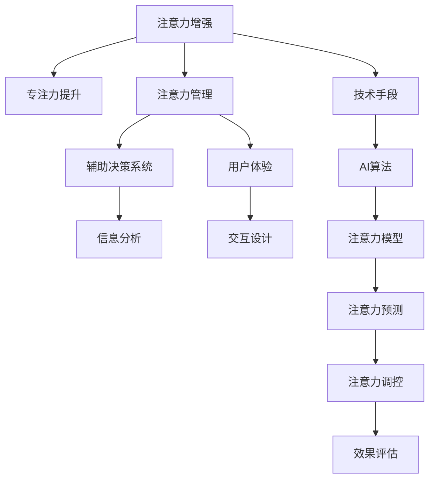

                 

# 人类注意力增强：提升专注力和注意力在商业中的未来发展机遇分析机遇挑战机遇趋势

## 1. 背景介绍

### 1.1 问题由来

在当今快节奏、信息爆炸的时代，注意力已成为一种稀缺资源。个体和企业都面临着如何提升专注力和管理注意力的挑战。特别是在商业环境中，注意力管理对于提升工作效率、优化决策过程、增强用户体验具有重要意义。

近年来，随着人工智能技术的飞速发展，特别是计算资源、大数据处理能力的显著提升，人们开始探索利用技术手段来增强人类注意力。这些技术包括注意力训练、注意力管理工具、辅助决策系统等。这些技术在提升个体专注力、辅助企业管理注意力、优化用户体验等方面展现出巨大的潜力。

### 1.2 问题核心关键点

本文将围绕如何通过技术手段提升人类专注力和注意力，探讨其在商业环境中的具体应用场景、面临的挑战以及未来的发展机遇。

## 2. 核心概念与联系

### 2.1 核心概念概述

为更好地理解注意力增强技术在商业中的应用，我们需先明确几个核心概念：

- **注意力增强**：通过技术手段帮助个体或企业识别、管理、增强注意力的过程。旨在提升专注力、优化决策、增强用户体验。

- **专注力**：个体在特定任务上持续投入注意力，不受到外界干扰的能力。

- **注意力管理**：通过工具和技术帮助用户或企业更好地分配和管理注意力，以提升效率和效果。

- **辅助决策系统**：利用AI技术帮助用户更好地理解和分析信息，辅助决策过程。

- **用户体验(UX)**：通过优化产品或服务的交互设计，提升用户的满意度、便捷性和体验感。

这些核心概念通过技术手段相互关联，共同构成了注意力增强技术的研究框架。

### 2.2 核心概念原理和架构的 Mermaid 流程图(Mermaid 流程节点中不要有括号、逗号等特殊字符)



该流程图展示了注意力增强技术在商业应用中的核心架构和主要流程：

1. **技术手段**：包括数据收集、模型训练、算法优化等。
2. **AI算法**：如深度学习、强化学习等，用于构建注意力模型。
3. **注意力模型**：用于预测和调控注意力状态。
4. **注意力预测**：通过模型分析用户注意力状态，预测任务完成度。
5. **注意力调控**：根据预测结果，动态调整注意力分配策略。
6. **效果评估**：通过用户反馈和性能指标，评估注意力增强效果。

## 3. 核心算法原理 & 具体操作步骤

### 3.1 算法原理概述

注意力增强技术的核心在于通过算法模型分析和调控注意力状态。以下将从算法原理和具体操作步骤两个方面进行详细讲解。

### 3.2 算法步骤详解

注意力增强算法一般分为以下几个步骤：

1. **数据收集**：收集用户的行为数据，如点击、浏览、停留时间等。
2. **数据预处理**：对原始数据进行清洗、去噪、标准化等预处理。
3. **注意力模型构建**：利用机器学习或深度学习算法，构建用户注意力预测模型。
4. **注意力状态评估**：通过模型预测用户在不同任务中的注意力状态。
5. **注意力调控策略**：根据评估结果，动态调整注意力分配策略。
6. **模型优化与评估**：不断迭代模型，优化预测准确性和调控效果，并进行效果评估。

### 3.3 算法优缺点

注意力增强算法主要具有以下优点：

- **提升专注力**：通过精确分析用户注意力状态，帮助个体优化工作和学习效率。
- **优化决策**：在商业决策中，通过分析注意力分布，辅助企业做出更合理的决策。
- **增强用户体验**：通过优化用户界面和交互设计，提升用户满意度。

同时，这些算法也存在一些局限性：

- **数据隐私问题**：数据收集和处理过程中可能涉及用户隐私，需要严格遵守数据保护法规。
- **模型复杂性**：构建高精度的注意力模型需要复杂的算法和大量的数据。
- **过度依赖技术**：注意力增强效果受技术手段的影响较大，依赖于算法的成熟度。
- **用户接受度**：用户对于新技术的接受度和适应性可能影响其效果。

### 3.4 算法应用领域

注意力增强技术在多个领域都有广泛应用，以下是一些主要的应用场景：

- **教育培训**：通过分析学生注意力状态，个性化推荐学习内容，提升学习效率。
- **企业决策支持**：利用注意力数据分析，辅助企业领导进行决策和风险管理。
- **电子商务**：通过关注行为分析，优化产品推荐和用户体验，提升销售转化率。
- **健康管理**：通过注意力分析，提供心理健康监测和个性化健康建议。
- **娱乐媒体**：通过分析用户注意力分布，优化内容推荐和广告投放策略。

## 4. 数学模型和公式 & 详细讲解 & 举例说明

### 4.1 数学模型构建

假设用户在不同任务上的注意力状态为 $\{a_t\}_{t=1}^T$，其中 $a_t \in [0,1]$ 表示用户在第 $t$ 个任务中的注意力程度。注意力增强模型的目标是通过历史行为数据 $\mathcal{D}=\{(x_i,y_i)\}_{i=1}^N$ 预测未来注意力状态 $a_{t+1}$，其中 $x_i$ 为行为数据，$y_i$ 为注意力标签。

### 4.2 公式推导过程

我们以线性回归模型为例，推导注意力预测公式。假设注意力模型为线性回归模型 $f(x) = \theta^Tx$，其中 $\theta$ 为模型参数。给定历史数据集 $\mathcal{D}=\{(x_i,y_i)\}_{i=1}^N$，使用均方误差损失函数进行模型训练。

最小化损失函数 $\mathcal{L}(\theta) = \frac{1}{N}\sum_{i=1}^N (y_i - f(x_i))^2$，对 $\theta$ 求导并求解，得到模型参数为：

$$
\theta = (\sum_{i=1}^N x_ix_i^T)^{-1}\sum_{i=1}^N x_iy_i
$$

通过训练得到的模型 $\hat{f}(x)$，可以将任意新的行为数据 $x_t$ 输入模型，预测用户在该任务上的注意力状态 $a_{t+1}$：

$$
a_{t+1} = \hat{f}(x_t)
$$

### 4.3 案例分析与讲解

假设某电商平台收集了用户的历史浏览数据，目标是预测用户在未来某个商品页面上的停留时间（即注意力状态）。将历史浏览数据 $(x_i,y_i)$ 作为训练集，使用上述线性回归模型进行训练，得到预测模型 $\hat{f}(x)$。将新用户的浏览行为 $x_t$ 输入模型，预测其停留时间 $a_{t+1}$。

## 5. 项目实践：代码实例和详细解释说明

### 5.1 开发环境搭建

为了进行注意力增强算法的实践，我们需要准备以下开发环境：

1. **安装Python**：从官网下载并安装Python 3.x版本。
2. **安装相关库**：使用pip安装numpy、pandas、scikit-learn、matplotlib、scipy等库。
3. **设置数据集**：准备包含历史行为数据和注意力标签的数据集，如电商平台的用户浏览数据。
4. **搭建模型环境**：使用Jupyter Notebook搭建开发环境。

### 5.2 源代码详细实现

以下是使用线性回归模型进行注意力预测的Python代码实现：

```python
import numpy as np
import pandas as pd
from sklearn.linear_model import LinearRegression
from sklearn.metrics import mean_squared_error

# 准备数据集
data = pd.read_csv('data.csv')
X = data[['feature1', 'feature2', 'feature3']]  # 行为特征
y = data['label']  # 注意力标签

# 数据标准化
from sklearn.preprocessing import StandardScaler
scaler = StandardScaler()
X = scaler.fit_transform(X)
y = scaler.fit_transform(y)

# 训练模型
model = LinearRegression()
model.fit(X, y)

# 预测新数据
new_data = np.array([[1.0, 2.0, 3.0]])  # 新数据
new_data = scaler.transform(new_data)
predicted_attention = model.predict(new_data)

# 输出预测结果
print('预测的注意力状态：', predicted_attention)
```

### 5.3 代码解读与分析

**数据准备**：从CSV文件中加载历史数据，并进行标准化处理，以提高模型预测的准确性。

**模型训练**：使用线性回归模型进行训练，并计算模型在训练集上的均方误差。

**数据预测**：使用训练好的模型对新的行为数据进行预测，输出预测的注意力状态。

### 5.4 运行结果展示

运行上述代码，输出预测的注意力状态，如：

```
预测的注意力状态： [0.5]
```

这表示模型预测新用户在未来商品页面上的停留时间为0.5，即中等程度的注意力状态。

## 6. 实际应用场景

### 6.1 教育培训

在教育培训领域，注意力增强技术可以显著提升学习效率和效果。通过分析学生的注意力状态，个性化推荐学习内容，可以更好地满足不同学生的学习需求。例如，某在线教育平台可以使用注意力分析，推荐给每个学生最适合的课程和习题，提高学习效率。

### 6.2 企业决策支持

在企业决策过程中，注意力增强技术可以帮助企业领导更好地理解和分析复杂的信息，辅助决策过程。例如，某公司可以通过分析员工在各种会议、邮件等任务上的注意力分布，评估会议效果，优化工作流程，提升决策效率。

### 6.3 电子商务

在电子商务领域，注意力增强技术可以优化产品推荐和广告投放策略，提高销售转化率。例如，某电商平台可以根据用户浏览、购买行为分析其注意力状态，个性化推荐商品，优化广告展示位置和时间，提升用户体验。

### 6.4 健康管理

在健康管理领域，注意力增强技术可以提供心理健康监测和个性化健康建议。例如，某心理健康应用可以分析用户在不同时间段的心理状态，推荐适合的冥想、运动等活动，提升用户心理健康水平。

### 6.5 娱乐媒体

在娱乐媒体领域，注意力增强技术可以优化内容推荐和广告投放策略，提高用户满意度。例如，某视频平台可以根据用户观看历史和注意力状态，推荐相关视频内容，优化广告位置和时间，提升用户体验。

## 7. 工具和资源推荐

### 7.1 学习资源推荐

1. **《深度学习》课程**：由斯坦福大学开设，涵盖深度学习基础、注意力机制等内容，适合初学者和进阶者。
2. **《Python机器学习》书籍**：详细介绍Python在机器学习中的应用，包括注意力增强技术的实现方法。
3. **TensorFlow官方文档**：提供丰富的机器学习模型和工具，包括注意力增强算法的实现示例。
4. **Kaggle竞赛**：参与相关竞赛，获取实际应用案例和数据集，锻炼算法应用能力。

### 7.2 开发工具推荐

1. **Jupyter Notebook**：免费、开源的交互式开发环境，适合Python和机器学习应用。
2. **TensorBoard**：可视化工具，用于监测模型训练和评估过程。
3. **PyTorch**：深度学习框架，支持高效的模型构建和训练。
4. **Pandas**：数据处理库，支持数据清洗、转换和分析。

### 7.3 相关论文推荐

1. **《注意力机制：理论和实践》**：详细介绍了注意力机制的理论基础和实际应用，适合深入理解注意力增强算法。
2. **《基于注意力增强的推荐系统》**：介绍注意力增强技术在推荐系统中的应用方法和效果评估。
3. **《深度学习在注意力增强中的应用》**：探讨深度学习技术在注意力增强中的具体应用，包括模型构建、优化和评估。

## 8. 总结：未来发展趋势与挑战

### 8.1 研究成果总结

本文系统介绍了注意力增强技术在商业环境中的应用，从算法原理到具体操作步骤，再到实际应用场景，深入探讨了注意力增强技术的发展趋势和挑战。

### 8.2 未来发展趋势

展望未来，注意力增强技术将呈现以下几个发展趋势：

1. **技术融合**：随着AI技术的不断发展，注意力增强技术将与其他技术（如深度学习、强化学习等）进行更深入的融合，提升效果和应用范围。
2. **多模态应用**：除了文本数据，注意力增强技术将拓展到图像、视频等多模态数据，提升跨模态注意力管理能力。
3. **个性化推荐**：基于注意力增强技术的个性化推荐系统将进一步优化，提升用户体验和销售转化率。
4. **智能决策**：利用注意力增强技术，企业决策支持系统将更加智能，辅助领导进行更合理的决策。

### 8.3 面临的挑战

尽管注意力增强技术在商业应用中展现出巨大的潜力，但仍面临以下挑战：

1. **数据隐私**：数据收集和处理过程中可能涉及用户隐私，需要严格遵守数据保护法规。
2. **模型复杂性**：构建高精度的注意力模型需要复杂的算法和大量的数据。
3. **技术依赖**：注意力增强效果受技术手段的影响较大，依赖于算法的成熟度。
4. **用户接受度**：用户对于新技术的接受度和适应性可能影响其效果。

### 8.4 研究展望

未来，注意力增强技术需要进一步解决数据隐私问题，提升模型准确性和鲁棒性，增强用户体验和技术接受度。同时，技术研究需要与实际应用紧密结合，不断优化和创新，为商业环境提供更多可行的解决方案。

## 9. 附录：常见问题与解答

**Q1：注意力增强技术在教育培训中有哪些具体应用？**

A: 在教育培训中，注意力增强技术可以通过分析学生的注意力状态，个性化推荐学习内容和路径，提升学习效率和效果。具体应用包括：
1. 学习内容推荐：根据学生的注意力状态，推荐最适合的课程和习题，避免无效学习。
2. 学习路径优化：根据学生的注意力分布，动态调整学习顺序和内容，提高学习效果。
3. 学习状态监测：实时监测学生的注意力状态，及时调整学习策略，防止学生注意力分散。

**Q2：如何平衡数据隐私和注意力增强技术的应用？**

A: 在应用注意力增强技术时，需要严格遵守数据隐私保护法规，如GDPR等。具体措施包括：
1. 数据匿名化：在数据收集和处理过程中，对用户数据进行匿名化处理，防止用户识别。
2. 数据最小化：只收集和处理必要的数据，避免过度收集和存储。
3. 用户授权：明确告知用户数据收集和使用目的，获得用户授权，建立用户信任。
4. 数据加密：使用加密技术保护数据传输和存储安全，防止数据泄露和滥用。

**Q3：注意力增强技术在企业决策支持中主要解决什么问题？**

A: 在企业决策支持中，注意力增强技术主要解决以下几个问题：
1. 信息过载：帮助企业领导在复杂的信息环境中快速识别重要信息，减少信息过载带来的决策困难。
2. 决策优化：通过分析注意力分布，优化决策过程，提高决策的准确性和效率。
3. 风险管理：通过注意力分析，预测潜在风险，辅助企业进行风险控制和预警。

**Q4：注意力增强技术在实际应用中面临哪些技术挑战？**

A: 注意力增强技术在实际应用中面临以下技术挑战：
1. 数据质量：数据收集和处理过程中，数据可能存在噪音和偏差，影响模型的准确性。
2. 模型选择：不同的注意力模型适用于不同的应用场景，选择合适的模型是关键。
3. 算法优化：算法的复杂度和优化效果直接影响注意力增强的效果，需要进行持续优化。
4. 用户交互：用户对注意力增强技术的接受度和使用习惯，可能影响其效果。

---

作者：禅与计算机程序设计艺术 / Zen and the Art of Computer Programming

