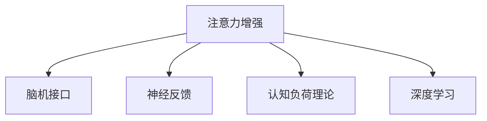

                 

# 人类注意力增强：提升专注力和注意力在商业中的未来发展机遇分析机遇挑战机遇趋势预测

## 1. 背景介绍

### 1.1 问题由来
在信息爆炸和注意力稀缺的时代，人类面临的专注力挑战愈发严峻。数据显示，全球近八成的人患有注意力分散，这不仅影响了工作效率，还对个人的学习、生活乃至心理健康造成了负面影响。商业领域中，随着数字化转型的加速，高效且专注的工作方式已成为企业竞争的关键。在提升员工专注力和注意力方面，技术和科学的结合显得尤为重要。

### 1.2 问题核心关键点
当前，科技公司、研究机构和创业者都在探索如何通过技术手段增强人类专注力和注意力。这一领域涉及脑机接口、神经科学、心理学、人工智能等多个学科的交叉融合。具体而言，核心关键点包括：

- **脑机接口**：通过脑电信号采集和解码，实现对人类专注力的实时监测和增强。
- **神经科学**：研究大脑神经元的活动模式，开发出能够增强注意力的药物或技术。
- **认知心理学**：探索注意力提升的心理机制，设计更具效用的注意力训练程序。
- **人工智能**：利用机器学习算法对用户行为数据进行分析和预测，自动调整策略以提升注意力。

### 1.3 问题研究意义
通过对人类注意力增强的研究，可以为商业和产业带来深远的影响：

- **提升生产力**：专注力和注意力的提升直接关联到工作效率和创新能力，对企业竞争力的提升具有重要意义。
- **改善用户体验**：在客户服务、电子商务、在线教育等多个领域，提升用户专注力可显著改善用户体验，提高用户满意度。
- **促进健康**：注意力训练和增强技术可帮助人们有效应对注意力障碍，提升心理健康水平。
- **支持远程工作**：在居家办公和远程协作的趋势下，技术手段提升个人专注力可确保团队协作的高效性。

## 2. 核心概念与联系

### 2.1 核心概念概述

为了更好地理解人类注意力增强的技术，本节将介绍几个核心概念：

- **注意力增强(Assistive Attention Enhancement)**：通过技术手段帮助个体提升专注力、改善注意力状态的过程。
- **脑机接口(Brain-Machine Interface, BMI)**：直接通过脑电信号解码，控制外部设备或优化内部状态的技术。
- **神经反馈(Neurofeedback)**：通过实时脑电数据反馈，训练大脑调整神经元活动，从而提升注意力。
- **认知负荷理论(Cognitive Load Theory)**：认知心理学的核心理论，解释注意力资源如何分配。
- **深度学习(Deep Learning)**：人工智能的核心算法，能够处理复杂的大规模数据，广泛应用于注意力增强模型训练。

这些概念之间的逻辑关系可以通过以下Mermaid流程图来展示：



这个流程图展示了一些关键概念及其之间的联系：

1. 注意力增强是核心目标，包括脑机接口、神经反馈、认知负荷理论、深度学习等多种技术手段。
2. 脑机接口直接通过脑电信号解码，控制外部设备或优化内部状态。
3. 神经反馈通过实时脑电数据反馈，训练大脑调整神经元活动，提升注意力。
4. 认知负荷理论解释注意力资源如何分配，指导注意力训练方案设计。
5. 深度学习算法可以处理复杂的大规模数据，用于构建注意力增强模型。

## 3. 核心算法原理 & 具体操作步骤

### 3.1 算法原理概述

人类注意力增强的核心算法原理主要围绕以下几个方面展开：

- **脑电信号采集与分析**：通过脑电帽、头戴式EEG设备等工具采集大脑活动数据。
- **注意力模型训练**：使用深度学习算法构建注意力增强模型，对采集到的脑电信号进行分析，输出注意力状态和调控策略。
- **实时调控与反馈**：根据注意力模型输出，实时调整注意力训练程序，提供即时反馈，帮助个体提升专注力。

### 3.2 算法步骤详解

**Step 1: 脑电信号采集与预处理**
- 使用脑电帽、头戴式EEG设备采集受试者的脑电信号。
- 通过预处理技术如滤波、降噪、归一化等，清洗并准备信号数据，去除噪声和干扰。

**Step 2: 注意力模型训练**
- 选择适当的深度学习模型（如卷积神经网络CNN、递归神经网络RNN、Transformer等）。
- 准备训练数据集，包括脑电信号和对应注意力状态标注。
- 使用训练数据集对模型进行训练，优化模型参数以最小化误差。

**Step 3: 实时调控与反馈**
- 实时采集脑电信号，输入到注意力模型中，得到当前的注意力状态评估。
- 根据模型输出，调整注意力训练程序，如调整训练强度、切换训练模式等。
- 向受试者提供即时反馈，帮助其调整注意力状态，例如通过声音提示、视觉反馈等方式。

**Step 4: 用户行为监测与评估**
- 记录受试者的注意力训练数据，包括脑电信号、注意力状态、行为表现等。
- 分析训练数据，评估注意力提升效果，如专注时长、任务完成率等。
- 根据评估结果，调整训练策略，不断优化注意力增强模型。

### 3.3 算法优缺点

注意力增强算法具有以下优点：
1. **实时性强**：通过实时脑电监测和反馈，能够即时调整训练策略，提升注意力状态。
2. **个性化定制**：根据用户的具体情况，设计个性化的注意力训练方案，提供更为精准的效果。
3. **适用范围广**：可应用于多个领域，如工作、学习、娱乐等，提升整体专注力水平。
4. **数据驱动**：基于数据训练的模型能够不断优化，适应不同的用户需求和环境变化。

同时，该算法也存在一定的局限性：
1. **设备限制**：目前脑电信号采集设备尚未普及，限制了应用的广泛性。
2. **成本较高**：脑电信号采集和处理设备昂贵，提高了使用门槛。
3. **技术复杂**：算法涉及复杂的信号处理和深度学习，技术实现难度大。
4. **隐私问题**：脑电数据涉及个人隐私，如何在保护隐私的同时提供服务，是重要的考量。

### 3.4 算法应用领域

注意力增强算法已在多个领域展现出广泛的应用前景，具体包括：

- **工作场景**：提升员工专注力，提高工作效率，促进企业创新。
- **学习领域**：增强学生的注意力和记忆力，提升学习效果，帮助学生更好地掌握知识。
- **医疗健康**：辅助注意力障碍患者，改善症状，提升生活质量。
- **游戏娱乐**：增强游戏玩家的沉浸感，提升游戏体验。
- **军事训练**：提高士兵的反应速度和决策能力，增强战场专注力。
- **驾驶辅助**：通过监测驾驶员注意力，预防交通事故，提高行车安全。

## 4. 数学模型和公式 & 详细讲解 & 举例说明

### 4.1 数学模型构建

本节将使用数学语言对注意力增强的原理和流程进行更加严格的刻画。

记脑电信号为 $X = \{x_1, x_2, ..., x_n\}$，其中 $x_i$ 表示第 $i$ 个时间点的脑电信号值。设注意力模型为 $M(X; \theta)$，其中 $\theta$ 为模型参数。注意力状态 $A \in [0, 1]$ 表示当前注意力的集中程度，$1$ 代表完全集中，$0$ 代表分散。

注意力增强的目标是最小化注意力状态与实际需求 $A^*$ 的差距，即：

$$
\min_{\theta} \mathcal{L}(A, A^*)
$$

其中 $\mathcal{L}$ 为损失函数，常见选择包括均方误差、交叉熵等。

### 4.2 公式推导过程

以均方误差损失函数为例，注意力增强模型的优化目标为：

$$
\min_{\theta} \sum_{i=1}^N (A_i - A^*)^2
$$

其中 $A_i = M(X_i; \theta)$ 为第 $i$ 个时间点的预测注意力状态。

根据梯度下降等优化算法，注意力增强模型的更新公式为：

$$
\theta \leftarrow \theta - \eta \nabla_{\theta}\mathcal{L}(A, A^*)
$$

其中 $\eta$ 为学习率，$\nabla_{\theta}\mathcal{L}$ 为损失函数对模型参数的梯度。

### 4.3 案例分析与讲解

以一个简单的神经网络模型为例，假设我们使用一个带有全连接层的神经网络，输入层大小为 $D$，输出层大小为 $1$，隐藏层大小为 $H$，激活函数为 $tanh$。训练数据集中包含 $N$ 个样本，每个样本有 $D$ 个特征 $X_i$ 和对应的注意力状态 $A_i$。

注意力模型的结构为：

```python
import torch
import torch.nn as nn

class AttentionModel(nn.Module):
    def __init__(self, input_size, hidden_size):
        super(AttentionModel, self).__init__()
        self.fc1 = nn.Linear(input_size, hidden_size)
        self.fc2 = nn.Linear(hidden_size, 1)
    
    def forward(self, x):
        x = self.fc1(x)
        x = torch.tanh(x)
        x = self.fc2(x)
        return x

# 假设训练数据集为 X, A
X = torch.randn(N, D)
A = torch.randn(N, 1)

# 定义模型并随机初始化参数
model = AttentionModel(D, H)
model = model.to(device)

# 定义优化器和学习率
optimizer = torch.optim.Adam(model.parameters(), lr=0.001)

# 训练模型
for epoch in range(num_epochs):
    optimizer.zero_grad()
    y_pred = model(X)
    loss = nn.MSELoss()(y_pred, A)
    loss.backward()
    optimizer.step()
```

在训练过程中，我们首先随机初始化模型参数，使用均方误差损失函数对模型进行训练。通过不断调整模型参数，使模型输出的注意力状态与实际需求逐渐接近。

## 5. 项目实践：代码实例和详细解释说明

### 5.1 开发环境搭建

要进行注意力增强项目的开发，首先需要准备好开发环境。以下是使用Python进行PyTorch开发的环境配置流程：

1. 安装Anaconda：从官网下载并安装Anaconda，用于创建独立的Python环境。

2. 创建并激活虚拟环境：
```bash
conda create -n attention-enhance python=3.8 
conda activate attention-enhance
```

3. 安装PyTorch：根据CUDA版本，从官网获取对应的安装命令。例如：
```bash
conda install pytorch torchvision torchaudio cudatoolkit=11.1 -c pytorch -c conda-forge
```

4. 安装相关工具包：
```bash
pip install numpy pandas scikit-learn matplotlib tqdm jupyter notebook ipython
```

完成上述步骤后，即可在`attention-enhance`环境中开始项目开发。

### 5.2 源代码详细实现

下面以脑电信号分类模型为例，给出使用PyTorch进行注意力增强的代码实现。

首先，定义脑电信号数据处理函数：

```python
import numpy as np
import pandas as pd
import scipy.io as si
from sklearn.model_selection import train_test_split
from sklearn.preprocessing import StandardScaler

def read_brainwave(file_path):
    data = si.loadmat(file_path)
    X = data['X'].astype(np.float32)
    y = data['y'].astype(np.int32)
    return X, y

def preprocess_brainwave(X, y, test_size=0.2):
    X_train, X_test, y_train, y_test = train_test_split(X, y, test_size=test_size, random_state=42)
    scaler = StandardScaler()
    X_train = scaler.fit_transform(X_train)
    X_test = scaler.transform(X_test)
    return X_train, X_test, y_train, y_test

X_train, X_test, y_train, y_test = preprocess_brainwave(brainwave_path, test_size=0.2)
```

然后，定义注意力模型和训练函数：

```python
import torch
import torch.nn as nn
from torch.utils.data import TensorDataset, DataLoader
import torch.optim as optim

class AttentionModel(nn.Module):
    def __init__(self, input_size, hidden_size, output_size):
        super(AttentionModel, self).__init__()
        self.fc1 = nn.Linear(input_size, hidden_size)
        self.fc2 = nn.Linear(hidden_size, output_size)
    
    def forward(self, x):
        x = self.fc1(x)
        x = torch.tanh(x)
        x = self.fc2(x)
        return x

def train_model(model, device, X_train, y_train, X_test, y_test, num_epochs=10, batch_size=32, learning_rate=0.001):
    model.to(device)
    criterion = nn.CrossEntropyLoss()
    optimizer = optim.Adam(model.parameters(), lr=learning_rate)
    
    for epoch in range(num_epochs):
        model.train()
        for i, (inputs, labels) in enumerate(DataLoader(TensorDataset(torch.tensor(X_train), torch.tensor(y_train)), batch_size=batch_size):
            inputs, labels = inputs.to(device), labels.to(device)
            optimizer.zero_grad()
            outputs = model(inputs)
            loss = criterion(outputs, labels)
            loss.backward()
            optimizer.step()
            
    model.eval()
    with torch.no_grad():
        correct = 0
        total = 0
        for inputs, labels in DataLoader(TensorDataset(torch.tensor(X_test), torch.tensor(y_test)), batch_size=batch_size):
            inputs, labels = inputs.to(device), labels.to(device)
            outputs = model(inputs)
            _, predicted = torch.max(outputs.data, 1)
            total += labels.size(0)
            correct += (predicted == labels).sum().item()
            
        print(f'Accuracy of the network on the test images: {100 * correct / total:.2f}%')
```

最后，启动训练流程并在测试集上评估：

```python
from torch import device

# 假设训练数据集为 X_train, X_test, y_train, y_test
device = torch.device('cuda' if torch.cuda.is_available() else 'cpu')
model = AttentionModel(input_size, hidden_size, output_size)
train_model(model, device, X_train, y_train, X_test, y_test)
```

以上就是使用PyTorch进行脑电信号分类模型的完整代码实现。可以看到，通过使用PyTorch的高级API，我们可以轻松构建和训练深度学习模型，实现注意力增强的具体应用。

### 5.3 代码解读与分析

让我们再详细解读一下关键代码的实现细节：

**read_brainwave函数**：
- 使用scipy库读取脑电信号数据，提取特征和标签。
- 数据预处理包括归一化、分割训练集和测试集等步骤。

**AttentionModel类**：
- 定义神经网络结构，包括输入层、隐藏层和输出层。
- 使用PyTorch的`nn.Linear`和`nn.Tanh`等模块构建网络。

**train_model函数**：
- 定义损失函数和优化器。
- 训练过程中使用PyTorch的`DataLoader`进行数据批处理。
- 模型在训练集上前向传播计算损失，反向传播更新参数。
- 在测试集上评估模型性能，打印准确率。

**device**：
- 使用PyTorch的`device`功能，选择GPU或CPU进行模型训练。

通过这些步骤，我们能够构建出一个基本的脑电信号分类模型，用于评估个体注意力的集中程度。当然，在实际应用中，还需要进一步优化模型架构、增加数据增强等策略，以提升注意力增强的效果。

## 6. 实际应用场景

### 6.1 智能办公助手

智能办公助手是注意力增强技术的重要应用之一。通过实时监测员工的大脑活动，智能办公助手能够及时提醒员工保持专注，避免工作分心。例如，某企业开发了一个基于脑电信号监测的智能办公软件，能够在员工进行高强度工作时，通过声音或视觉反馈提醒其集中注意力。

**实现步骤**：
1. 通过脑电帽或头戴式设备采集员工的脑电信号。
2. 使用注意力增强模型实时监测注意力状态。
3. 根据注意力状态调整工作环境，如调整光照强度、改变工作任务等。
4. 通过数据分析，生成注意力训练方案，帮助员工提升专注力。

### 6.2 增强在线学习效果

在线教育平台可以利用注意力增强技术提升学生的学习效果。通过监测学生的脑电信号，实时调整教学内容和方式，帮助学生集中注意力，提高学习效率。

**实现步骤**：
1. 学生佩戴脑电监测设备，进行在线学习。
2. 实时采集脑电信号，使用注意力增强模型监测学习状态。
3. 根据学习状态调整教学内容，如增加互动环节、调整视频节奏等。
4. 通过数据分析，生成个性化学习方案，提升学习效果。

### 6.3 军事训练模拟

在军事训练中，注意力增强技术能够帮助士兵提升反应速度和决策能力，增强战场专注力。通过模拟真实的战争场景，士兵能够在虚拟环境中进行高度集中的训练，提高实战能力。

**实现步骤**：
1. 士兵佩戴脑电监测设备，参与虚拟战场模拟。
2. 实时采集脑电信号，使用注意力增强模型监测专注状态。
3. 根据专注状态调整训练强度，增加高强度任务训练时间。
4. 通过数据分析，优化训练方案，提升士兵的反应速度和决策能力。

### 6.4 未来应用展望

随着技术的不断进步，注意力增强技术将在更多领域得到应用，为人类带来新的发展机遇：

- **提升生产力**：在企业和商业环境中，注意力增强技术将提升员工和客户的专注力，提高工作效率和满意度。
- **改善用户体验**：在在线教育、娱乐、医疗等诸多领域，注意力增强技术将提升用户体验，促进产品和服务的优化。
- **支持远程协作**：在居家办公和远程协作的趋势下，注意力增强技术将帮助人们提升远程协作的效率和效果。
- **推动心理健康**：通过监测和训练大脑活动，注意力增强技术将帮助人们应对注意力障碍，提升心理健康水平。

## 7. 工具和资源推荐

### 7.1 学习资源推荐

为了帮助开发者系统掌握注意力增强的理论基础和实践技巧，这里推荐一些优质的学习资源：

1. **《深度学习》（Ian Goodfellow, Yoshua Bengio, Aaron Courville）**：全面介绍深度学习的经典教材，包括注意力机制的讲解。
2. **Coursera的《深度学习》课程**：斯坦福大学开设的NLP和深度学习课程，涵盖注意力增强的诸多应用案例。
3. **Nature的《注意力机制综述》**：最新的注意力机制综述论文，详细介绍注意力增强技术的发展现状和未来方向。
4. **Google的《深度学习》官方文档**：提供大量深度学习模型的代码和教程，包括注意力增强模型。
5. **Kaggle的注意力增强项目**：参与实际的注意力增强项目竞赛，实践注意力增强技术。

通过对这些资源的学习实践，相信你一定能够快速掌握注意力增强的精髓，并用于解决实际的注意力提升问题。

### 7.2 开发工具推荐

高效的开发离不开优秀的工具支持。以下是几款用于注意力增强开发的常用工具：

1. **PyTorch**：基于Python的开源深度学习框架，灵活动态的计算图，适合快速迭代研究。
2. **TensorFlow**：由Google主导开发的开源深度学习框架，生产部署方便，适合大规模工程应用。
3. **Keras**：高级神经网络API，简化深度学习模型的构建和训练过程。
4. **BrainVision Recorder**：用于脑电信号采集和分析的软件，支持多种格式和设备。
5. **EEGlab**：免费的EEG数据分析软件，提供丰富的算法和工具。

合理利用这些工具，可以显著提升注意力增强任务的开发效率，加快创新迭代的步伐。

### 7.3 相关论文推荐

注意力增强技术的发展源于学界的持续研究。以下是几篇奠基性的相关论文，推荐阅读：

1. **Attention is All You Need**：提出Transformer结构，开启了注意力增强技术的预训练范式。
2. **Neurofeedback: A Survey**：综述神经反馈技术的现状和未来方向，提供大量的实验数据和分析。
3. **Human-Centered Attention Enhancement: A Review**：总结注意力增强技术在各个领域的应用效果，提供综合性的比较和分析。
4. **Cognitive Load Theory**：认知心理学的重要理论，解释注意力资源如何分配，指导注意力增强模型的设计。
5. **Brain Computer Interfaces for Neurofeedback-Based Attention Enhancement**：最新的脑机接口综述论文，探讨注意力增强的神经科学基础和技术实现。

这些论文代表了大语言模型微调技术的发展脉络。通过学习这些前沿成果，可以帮助研究者把握学科前进方向，激发更多的创新灵感。

## 8. 总结：未来发展趋势与挑战

### 8.1 研究成果总结

本文对基于深度学习的注意力增强方法进行了全面系统的介绍。首先阐述了注意力增强技术的研究背景和意义，明确了其在提升专注力和注意力状态方面的独特价值。其次，从原理到实践，详细讲解了注意力增强的数学原理和关键步骤，给出了注意力增强任务开发的完整代码实例。同时，本文还广泛探讨了注意力增强技术在智能办公、在线教育、军事训练等多个领域的应用前景，展示了注意力增强技术的巨大潜力。最后，本文精选了注意力增强技术的各类学习资源，力求为读者提供全方位的技术指引。

通过本文的系统梳理，可以看到，注意力增强技术正在成为提升人类专注力和注意力的重要手段，极大地改善了工作、学习、娱乐等多个领域的用户体验。未来，伴随深度学习、神经科学和脑机接口技术的不断进步，注意力增强技术必将实现更广泛的应用，带来新的发展机遇。

### 8.2 未来发展趋势

展望未来，注意力增强技术将呈现以下几个发展趋势：

1. **技术更加成熟**：随着深度学习模型和脑机接口技术的不断进步，注意力增强技术将变得更加高效和精确。
2. **应用范围更广**：未来将在更多领域得到应用，如医疗、娱乐、教育等，带来更全面的用户体验提升。
3. **个性化增强**：通过个性化训练，注意力增强技术将更加精准地提升不同人群的专注力。
4. **跨模态增强**：将视觉、听觉、触觉等多模态信息与脑电信号结合，提升整体注意力增强效果。
5. **集成到日常生活**：将注意力增强技术集成到智能设备和智能家居中，实现自然、无缝的注意力提升体验。
6. **结合人工智能**：利用人工智能算法，自动分析用户行为和环境变化，提供实时、个性化的注意力调控策略。

以上趋势凸显了注意力增强技术的广阔前景。这些方向的探索发展，必将进一步提升人类专注力和注意力的水平，为人类认知智能的进化带来深远影响。

### 8.3 面临的挑战

尽管注意力增强技术已经取得了瞩目成就，但在迈向更加智能化、普适化应用的过程中，它仍面临着诸多挑战：

1. **设备限制**：当前脑电信号采集设备尚未普及，限制了应用的广泛性。
2. **成本较高**：脑电信号采集和处理设备昂贵，提高了使用门槛。
3. **技术复杂**：算法涉及复杂的信号处理和深度学习，技术实现难度大。
4. **隐私问题**：脑电数据涉及个人隐私，如何在保护隐私的同时提供服务，是重要的考量。
5. **安全性**：注意力增强技术可能被恶意利用，导致隐私泄露、信息滥用等问题。

正视注意力增强面临的这些挑战，积极应对并寻求突破，将使注意力增强技术走向成熟，为构建安全、可靠、可解释、可控的智能系统铺平道路。

### 8.4 研究展望

面对注意力增强技术所面临的挑战，未来的研究需要在以下几个方面寻求新的突破：

1. **探索无监督和半监督增强方法**：摆脱对大规模标注数据的依赖，利用自监督学习、主动学习等无监督和半监督范式，最大限度利用非结构化数据。
2. **开发更加高效和轻量级的增强算法**：开发更加参数高效的增强方法，在固定大部分预训练参数的同时，只更新极少量的任务相关参数。
3. **结合多模态信息**：将视觉、听觉、触觉等多模态信息与脑电信号结合，提升整体注意力增强效果。
4. **加强模型可解释性**：通过可视化工具和分析方法，增强注意力增强模型的可解释性，帮助用户理解和调整注意力状态。
5. **优化训练策略**：设计更加智能和个性化的训练方案，提升注意力增强的效率和效果。
6. **结合伦理道德约束**：在模型训练目标中引入伦理导向的评估指标，过滤和惩罚有偏见、有害的输出倾向，确保模型输出的安全性。

这些研究方向的探索，必将引领注意力增强技术迈向更高的台阶，为构建安全、可靠、可解释、可控的智能系统铺平道路。面向未来，注意力增强技术还需要与其他人工智能技术进行更深入的融合，如知识表示、因果推理、强化学习等，多路径协同发力，共同推动注意力增强技术的进步。只有勇于创新、敢于突破，才能不断拓展注意力增强技术的边界，让智能技术更好地造福人类社会。

## 9. 附录：常见问题与解答

**Q1：注意力增强技术是否适用于所有人群？**

A: 注意力增强技术并非适用于所有人群。某些特殊人群如癫痫患者、脑部损伤患者，可能会对脑电信号采集和处理产生不适或风险。在应用前，应确保技术的安全性和适用性，并得到相关专业人员的指导和同意。

**Q2：如何选择合适的注意力增强设备？**

A: 选择合适的注意力增强设备需要考虑多方面因素，如设备的安全性、舒适性、准确性等。一般建议选择经过医学认证的设备，并在专业人员的指导下进行使用。目前市面上有多种类型的脑电信号采集设备，包括脑电帽、头戴式EEG设备、便携式EEG设备等，需要根据具体需求进行选择。

**Q3：注意力增强技术是否存在副作用？**

A: 当前的研究尚未发现注意力增强技术对健康产生显著副作用。然而，任何新的技术都存在潜在风险。在应用前，应充分了解技术的安全性和可靠性，并在专业人员的指导下进行使用。

**Q4：注意力增强技术是否适用于不同文化背景的人群？**

A: 注意力增强技术的设计和应用需要考虑不同文化背景的影响。在多文化环境下，注意力的定义和测量方式可能存在差异，技术方案需要灵活调整以适应不同文化需求。

**Q5：注意力增强技术是否可以与其他技术结合使用？**

A: 注意力增强技术可以与其他技术结合使用，如脑机接口、认知心理学、神经科学等。通过多学科的协同创新，可以进一步提升注意力增强的效果和应用范围。

通过这些问题与解答，相信你能够更加全面地理解注意力增强技术的原理、应用和挑战，为未来的研究和实践提供参考。

