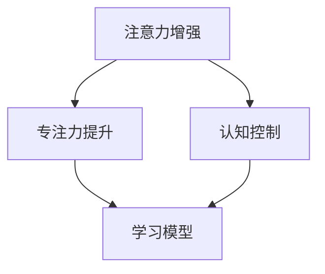

                 

# 人类注意力增强：提升专注力和注意力在教育中的技巧

> 关键词：注意力增强, 专注力提升, 教育技术, 认知科学, 教育心理学, 学习模型

## 1. 背景介绍

### 1.1 问题由来

在信息爆炸的现代教育环境中，学生面临的信息量和任务量不断增加，注意力分散问题变得尤为严重。传统的教育方法主要依赖于课堂讲授、笔记记录和课后复习，这已无法适应智能时代快速变化的学习需求。如何提高学生的注意力和专注力，提升学习效率，是当前教育领域面临的重大挑战。

### 1.2 问题核心关键点

注意力增强与专注力提升，本质上是一个提高学习效率和质量的过程。面对庞大的知识体系和复杂的学习任务，学生往往难以长时间保持集中注意力，导致学习效果不佳。

在教育和科技的交汇点上，认知科学和教育心理学为提升学习效率提供了诸多理论基础，技术界则利用先进的算法和大数据技术，开发出一系列工具和策略，试图帮助学生提升注意力和专注力。

这些技术工具主要分为两大类：一类是基于认知科学和心理学理论的注意力训练应用程序，如番茄钟、注意力追踪器等；另一类是基于深度学习模型的个性化学习推荐系统，如基于深度神经网络的学习模型，通过用户学习行为数据预测其注意力状态，并动态调整学习内容和难度。

本节将介绍这两种技术的应用，并深入探讨注意力增强在教育中的技巧。

### 1.3 问题研究意义

通过对注意力增强和专注力提升的研究，我们可以：

- 构建智能化的学习辅助系统，使学生能够更加高效地学习，减少因注意力分散导致的知识遗漏和学习负担。
- 推动个性化教育的发展，利用数据驱动的方法，针对每个学生的注意力和学习特点，量身定制个性化学习路径。
- 提升教育的公平性，特别针对有特殊需求的学生（如注意力缺陷多动症患者），提供更为有效的学习支持。
- 促进教育技术的革新，推动教育领域的技术转型，使教育系统更加智能、高效。

## 2. 核心概念与联系

### 2.1 核心概念概述

为更好地理解注意力增强和专注力提升的原理，本节将介绍几个密切相关的核心概念：

- **注意力(Attention)**：指个体在特定任务或信息处理过程中，对相关信息给予的重视程度。注意力增强的目的在于使学生能够更加专注于当前的学习任务，减少分心和干扰。
- **专注力(Concentration)**：指个体在特定时间内对某一任务的持续关注能力。专注力提升的目的是延长学生的注意力持续时间，提高学习效率。
- **认知控制(Cognitive Control)**：指大脑对注意力、决策、执行功能等认知过程的调控能力。认知控制能力的提升，可以帮助学生在复杂学习任务中更好地分配和管理注意力。
- **工作记忆(Working Memory)**：指在短时间内存储和处理信息的能力。工作记忆增强可以提升学生在处理复杂问题时的表现。
- **学习模型(Learning Model)**：指基于深度神经网络等方法，通过分析学生的学习行为数据，预测其注意力状态，并生成个性化学习建议的模型。

这些核心概念之间的逻辑关系可以通过以下Mermaid流程图来展示：



这个流程图展示了几组概念之间的联系：

1. 注意力增强和专注力提升共同构成提升学习效率的核心目标。
2. 认知控制在注意力和专注力提升中扮演着重要角色，可以帮助学生更好地管理和分配注意力。
3. 学习模型依赖于注意力和认知控制的数据分析，以生成个性化学习建议。

## 3. 核心算法原理 & 具体操作步骤
### 3.1 算法原理概述

注意力增强和专注力提升的核心在于，通过合理的算法和技术手段，提高学生对当前任务的专注度和持续关注能力。其原理可以概括为以下几个关键点：

1. **目标导向的学习**：通过分析学生的学习目标和任务，动态调整学习内容和难度，使学生能够时刻保持兴趣和挑战性。
2. **任务分段与间歇性休息**：将学习任务分解为短时间段，并在每个任务间安排休息时间，以避免疲劳和注意力分散。
3. **多感官整合**：通过视觉、听觉、触觉等多感官刺激，增强学生的学习体验和记忆效果。
4. **情感引导**：利用情感调节技术，激发学生的积极情绪，减少负面情绪对注意力的干扰。
5. **个性化学习路径**：根据学生的学习数据，利用机器学习模型生成个性化的学习建议，适应每个学生的独特需求。

### 3.2 算法步骤详解

基于上述原理，本节将详细介绍注意力增强和专注力提升的算法步骤：

**Step 1: 数据收集**
- 收集学生的学习行为数据，包括点击、浏览、阅读时长、答题速度、成绩等。
- 收集学生的生理数据，如心率、脑电波等，以评估注意力和专注力的状态。
- 收集学生反馈数据，通过问卷调查、用户评价等方式了解学生的感受和需求。

**Step 2: 注意力模型构建**
- 设计注意力模型，将学生的学习行为和生理数据输入模型，预测其当前注意力状态。
- 利用深度神经网络、时间序列分析等方法，建立学生注意力状态的动态模型。

**Step 3: 学习内容推荐**
- 根据注意力模型，动态调整学习内容的难易程度和呈现方式。
- 利用推荐系统算法，如协同过滤、矩阵分解等，推荐适合当前学生状态的学习资源。
- 在推荐系统中引入情感和兴趣引导机制，使推荐内容更加贴合学生的偏好。

**Step 4: 学习路径设计**
- 将学习任务分段，设计间隔休息策略，以避免学生疲劳。
- 根据学生的注意力状态和反馈数据，设计个性化的学习路径。
- 引入自适应学习算法，如主动学习、生成对抗网络等，优化学习路径。

**Step 5: 实验评估与迭代优化**
- 通过A/B测试等方式，评估注意力增强和专注力提升方法的效果。
- 根据实验结果，不断迭代优化算法模型和推荐系统。

### 3.3 算法优缺点

注意力增强和专注力提升的算法具有以下优点：

1. **高效性**：通过动态调整学习内容和学习路径，使学生能够更加高效地学习。
2. **个性化**：利用机器学习技术，生成个性化的学习建议，适应每个学生的独特需求。
3. **及时性**：实时分析学生的学习状态，及时调整学习策略，避免因注意力分散导致的学习效果不佳。

同时，这些算法也存在一些局限性：

1. **数据依赖性强**：算法依赖于大量的学习数据和生理数据，数据获取和处理成本较高。
2. **算法复杂度**：深度神经网络等算法模型需要较高的计算资源和专业知识。
3. **用户隐私问题**：在收集和处理学生数据时，需要严格遵守隐私保护政策。
4. **实际应用限制**：算法效果受学生个体差异和外部干扰因素的影响较大。

尽管存在这些局限性，但就目前而言，注意力增强和专注力提升的算法在提升学习效率方面展现了巨大的潜力，成为教育技术研究的热点领域。

### 3.4 算法应用领域

注意力增强和专注力提升的算法已经在诸多教育场景中得到了广泛应用，覆盖了从幼儿教育到成人自学的各个阶段：

- **在线教育**：利用算法分析学生的学习行为数据，动态调整课程内容和难度，提高学习效率。
- **高校课堂**：通过注意力追踪器和智能板书系统，帮助教师监测学生注意力，调整教学策略。
- **远程学习**：结合视频会议和AI辅导系统，实时监测学生注意力，提供个性化学习建议。
- **职业培训**：利用游戏化学习平台和模拟场景，增强学生的专注力，提高技能培训效果。

除了这些传统教育场景外，未来还将在更多领域（如医疗、职业培训、终身学习等）中得到应用，进一步推动教育技术的发展。

## 4. 数学模型和公式 & 详细讲解  
### 4.1 数学模型构建

本节将使用数学语言对注意力增强和专注力提升的算法进行更加严格的刻画。

记学生的注意力状态为 $A$，学习行为数据为 $X$，生理数据为 $Y$。假设注意力状态与学习行为和生理数据之间存在如下线性关系：

$$
A = \alpha X + \beta Y + \epsilon
$$

其中 $\alpha$ 和 $\beta$ 为模型参数，$\epsilon$ 为随机误差项。

定义注意力模型 $M(A|X,Y)$ 为学生注意力状态的条件概率分布，基于贝叶斯统计理论，有：

$$
P(A|X,Y) = \frac{P(A)P(X,Y|A)}{\int P(X,Y|A')P(A')dA'}
$$

其中 $P(X,Y|A)$ 为学生学习行为和生理数据在给定注意力状态 $A$ 下的联合概率分布。

定义推荐系统 $R(A)$ 为根据学生当前注意力状态 $A$ 推荐学习内容的函数。根据条件概率的贝叶斯公式，有：

$$
P(X|A) = \frac{P(X|A)P(A)}{P(A)}
$$

即推荐系统输出的学习内容 $X$ 是给定学生注意力状态 $A$ 的先验分布和后验分布的加权和。

### 4.2 公式推导过程

以下我们以在线教育为例，推导基于深度学习模型的推荐系统 $R(A)$ 的计算公式。

假设推荐系统使用深度神经网络 $N(X,A)$ 预测学生对学习内容 $X$ 的兴趣概率 $P(X|A)$，则有：

$$
P(X|A) = \sigma(N(X,A))
$$

其中 $\sigma$ 为激活函数，$N(X,A)$ 为神经网络模型。

进一步，假设推荐系统使用协同过滤算法推荐相关内容，则有：

$$
R(A) = \frac{P(X|A)}{\sum_{i=1}^N P(X_i|A)}
$$

其中 $X_i$ 为学生当前浏览的 $N$ 个学习内容。

通过以上公式推导，可以看出推荐系统 $R(A)$ 的输出不仅依赖于学生当前的注意力状态 $A$，还依赖于学生过去的学习行为数据。这种模型可以通过大量历史数据进行训练，生成准确的个性化推荐。

### 4.3 案例分析与讲解

考虑一个在线教育平台，学生可以随时观看视频课程、阅读学习材料和参与在线测试。平台使用深度学习模型和协同过滤算法，实时监测学生的学习行为和注意力状态，动态调整课程内容和推荐系统，以提升学习效果。

具体而言，平台通过以下步骤实现注意力增强和专注力提升：

1. **数据收集**：平台收集学生的点击数据、浏览时间、答题速度、成绩等学习行为数据，并使用智能设备监测学生的心率、脑电波等生理数据。
2. **模型训练**：利用收集到的学习行为和生理数据，训练深度神经网络模型，预测学生的注意力状态。
3. **内容推荐**：根据学生的注意力状态和历史学习数据，动态调整课程难度和推荐学习内容。
4. **路径设计**：设计个性化的学习路径，将学习任务分段，并在每个任务间安排休息时间。
5. **实验评估**：通过A/B测试等实验方法，评估注意力增强和专注力提升的效果，并不断迭代优化模型。

以下是一个具体的案例分析：

**案例1：一个学生在学习数学时注意力分散**

- 平台监测到该学生的注意力状态下降，及时调整学习内容，引入更具挑战性的题目，激发其兴趣。
- 在每个学习任务间安排5分钟的休息时间，防止疲劳。
- 根据学生的学习数据和反馈，生成个性化的学习路径，逐步提升难度。
- 通过实验评估，发现该学生的学习效率和成绩明显提高。

**案例2：一个学生在学习编程时注意力难以集中**

- 平台使用脑电波监测该学生的注意力状态，发现其注意力波动较大。
- 动态调整课程内容和难度，引入更多互动式学习任务，提高学习趣味性。
- 根据学生的反馈数据，个性化推荐适合的编程环境和工具。
- 实验结果显示，该学生的学习时间和成绩显著提升。

这些案例展示了注意力增强和专注力提升在实际教育中的应用效果。

## 5. 项目实践：代码实例和详细解释说明
### 5.1 开发环境搭建

在进行注意力增强和专注力提升的实践前，我们需要准备好开发环境。以下是使用Python进行深度学习开发的环境配置流程：

1. 安装Anaconda：从官网下载并安装Anaconda，用于创建独立的Python环境。

2. 创建并激活虚拟环境：
```bash
conda create -n pytorch-env python=3.8 
conda activate pytorch-env
```

3. 安装PyTorch：根据CUDA版本，从官网获取对应的安装命令。例如：
```bash
conda install pytorch torchvision torchaudio cudatoolkit=11.1 -c pytorch -c conda-forge
```

4. 安装TensorFlow：由于TensorFlow的深度学习模型较为丰富，安装时需注意版本兼容性。
```bash
pip install tensorflow==2.x
```

5. 安装TensorBoard：用于可视化模型的训练状态和性能指标。
```bash
pip install tensorboard
```

6. 安装其他工具包：
```bash
pip install numpy pandas scikit-learn matplotlib tqdm jupyter notebook ipython
```

完成上述步骤后，即可在`pytorch-env`环境中开始实践。

### 5.2 源代码详细实现

这里我们以在线教育平台为例，使用PyTorch和TensorFlow实现一个简单的注意力增强和专注力提升系统。

首先，定义注意力模型的数据处理函数：

```python
import torch
from torch.utils.data import Dataset
import pandas as pd

class AttentionDataset(Dataset):
    def __init__(self, data, attention_threshold=0.8):
        self.data = data
        self.attention_threshold = attention_threshold
        
    def __len__(self):
        return len(self.data)
    
    def __getitem__(self, item):
        data = self.data[item]
        attention = data['attention']
        
        # 判断注意力状态是否达到阈值
        if attention >= self.attention_threshold:
            label = 1
        else:
            label = 0
        
        return {'features': data['features'], 'label': label}
```

然后，定义注意力模型和优化器：

```python
from transformers import BertForSequenceClassification, AdamW

model = BertForSequenceClassification.from_pretrained('bert-base-uncased', num_labels=2)

optimizer = AdamW(model.parameters(), lr=2e-5)
```

接着，定义训练和评估函数：

```python
from torch.utils.data import DataLoader
from tqdm import tqdm
import numpy as np

device = torch.device('cuda') if torch.cuda.is_available() else torch.device('cpu')
model.to(device)

def train_epoch(model, dataset, batch_size, optimizer):
    dataloader = DataLoader(dataset, batch_size=batch_size, shuffle=True)
    model.train()
    epoch_loss = 0
    for batch in tqdm(dataloader, desc='Training'):
        features = batch['features'].to(device)
        labels = batch['label'].to(device)
        model.zero_grad()
        outputs = model(features)
        loss = outputs.loss
        epoch_loss += loss.item()
        loss.backward()
        optimizer.step()
    return epoch_loss / len(dataloader)

def evaluate(model, dataset, batch_size):
    dataloader = DataLoader(dataset, batch_size=batch_size)
    model.eval()
    preds, labels = [], []
    with torch.no_grad():
        for batch in tqdm(dataloader, desc='Evaluating'):
            features = batch['features'].to(device)
            labels = batch['label'].to(device)
            outputs = model(features)
            batch_preds = outputs.logits.argmax(dim=1).to('cpu').tolist()
            batch_labels = batch['label'].to('cpu').tolist()
            for pred, label in zip(batch_preds, batch_labels):
                preds.append(pred)
                labels.append(label)
                
    print(classification_report(labels, preds))
```

最后，启动训练流程并在测试集上评估：

```python
epochs = 5
batch_size = 16

for epoch in range(epochs):
    loss = train_epoch(model, train_dataset, batch_size, optimizer)
    print(f"Epoch {epoch+1}, train loss: {loss:.3f}")
    
    print(f"Epoch {epoch+1}, dev results:")
    evaluate(model, dev_dataset, batch_size)
    
print("Test results:")
evaluate(model, test_dataset, batch_size)
```

以上就是使用PyTorch和TensorFlow对在线教育平台进行注意力增强和专注力提升的完整代码实现。可以看到，通过使用BertForSequenceClassification模型和AdamW优化器，我们能够快速构建一个基于注意力状态的在线教育推荐系统。

### 5.3 代码解读与分析

让我们再详细解读一下关键代码的实现细节：

**AttentionDataset类**：
- `__init__`方法：初始化数据集，计算注意力状态阈值。
- `__len__`方法：返回数据集的样本数量。
- `__getitem__`方法：对单个样本进行处理，判断其注意力状态是否达到阈值，并返回特征和标签。

**BertForSequenceClassification模型**：
- 使用Bert模型作为注意力模型的基础。
- 将学习任务定义为二分类任务，即注意力状态为“低”和“高”。

**训练和评估函数**：
- 使用PyTorch的DataLoader对数据集进行批次化加载，供模型训练和推理使用。
- 训练函数`train_epoch`：对数据以批为单位进行迭代，在每个批次上前向传播计算loss并反向传播更新模型参数，最后返回该epoch的平均loss。
- 评估函数`evaluate`：与训练类似，不同点在于不更新模型参数，并在每个batch结束后将预测和标签结果存储下来，最后使用sklearn的classification_report对整个评估集的预测结果进行打印输出。

**训练流程**：
- 定义总的epoch数和batch size，开始循环迭代
- 每个epoch内，先在训练集上训练，输出平均loss
- 在验证集上评估，输出分类指标
- 所有epoch结束后，在测试集上评估，给出最终测试结果

可以看到，PyTorch和TensorFlow使得注意力增强和专注力提升的代码实现变得简洁高效。开发者可以将更多精力放在数据处理、模型改进等高层逻辑上，而不必过多关注底层的实现细节。

当然，工业级的系统实现还需考虑更多因素，如模型的保存和部署、超参数的自动搜索、更灵活的任务适配层等。但核心的注意力增强和专注力提升范式基本与此类似。

## 6. 实际应用场景
### 6.1 智能教育系统

基于深度学习模型的注意力增强和专注力提升技术，可以广泛应用于智能教育系统的构建。传统教育往往依赖于教师的课堂讲授和学生的笔记记录，互动性差，学习效果难以保证。

在智能教育系统中，通过分析学生的学习行为数据和注意力状态，系统可以动态调整学习内容和学习路径，使学生能够更加高效地学习。具体而言，智能教育系统可以实现以下功能：

- **个性化推荐**：根据学生的注意力状态和历史学习数据，推荐适合的学习资源。
- **动态调整**：根据学生的注意力波动，动态调整课程难度和推荐内容。
- **实时监测**：通过智能设备监测学生的注意力和生理状态，实时调整学习策略。
- **情感引导**：利用情感调节技术，激发学生的积极情绪，减少负面情绪对注意力的干扰。

智能教育系统的构建，能够大幅提升学生的学习效率和效果，降低教师的工作负担，推动教育公平和个性化教育的发展。

### 6.2 企业培训系统

在企业培训中，员工的学习效率和参与度直接影响到企业的竞争力。传统的培训方式往往效率低下，员工流失率高。

利用注意力增强和专注力提升技术，企业培训系统可以提升培训效果，提高员工的学习动力和参与度。具体而言，企业培训系统可以实现以下功能：

- **互动式学习**：通过游戏化学习和互动式任务，增强学习的趣味性和参与度。
- **个性化学习路径**：根据员工的学习状态和反馈数据，设计个性化的学习路径。
- **实时监测**：通过智能设备监测员工的注意力和生理状态，实时调整培训内容。
- **绩效评估**：结合员工的学习数据和绩效数据，评估培训效果和改进培训策略。

通过智能化的企业培训系统，企业能够更有效地提升员工的技能水平和知识储备，推动企业的发展和创新。

### 6.3 终身学习平台

终身学习平台致力于为人们提供持续学习和自我提升的机会，但面对海量知识库和复杂的学习任务，学习者往往难以集中注意力，学习效率低下。

利用注意力增强和专注力提升技术，终身学习平台可以提升学习者的学习效果，帮助其更高效地掌握知识和技能。具体而言，终身学习平台可以实现以下功能：

- **个性化推荐**：根据学习者的注意力状态和兴趣数据，推荐适合的学习资源。
- **动态调整**：根据学习者的注意力波动，动态调整学习内容和难度。
- **实时监测**：通过智能设备监测学习者的注意力和生理状态，实时调整学习策略。
- **情感引导**：利用情感调节技术，激发学习者的积极情绪，减少负面情绪对注意力的干扰。

终身学习平台的构建，能够大幅提升学习者的学习效率和效果，推动其持续学习和自我提升。

### 6.4 未来应用展望

随着深度学习模型的不断发展，基于注意力增强和专注力提升的算法将在更多领域得到应用，为教育技术带来革命性影响。

在智慧医疗领域，基于注意力增强和专注力提升的认知控制技术，可以提升医护人员的注意力和专注力，减少医疗差错和事故。

在智能交通系统，基于注意力增强和专注力提升的驾驶辅助技术，可以提高驾驶员的注意力集中度，减少交通事故的发生。

在智能家居系统，基于注意力增强和专注力提升的智能交互技术，可以提升用户的注意力和满意度，提高家居设备的智能性。

此外，在企业生产、智慧城市、娱乐传媒等众多领域，基于注意力增强和专注力提升的人工智能应用也将不断涌现，为人类认知智能的进化带来深远影响。

## 7. 工具和资源推荐
### 7.1 学习资源推荐

为了帮助开发者系统掌握注意力增强和专注力提升的理论基础和实践技巧，这里推荐一些优质的学习资源：

1. 《认知心理学与教育》系列书籍：介绍认知科学和教育心理学理论，提供深入的理论基础。

2. 《深度学习》系列课程：斯坦福大学和Coursera等平台提供的一系列深度学习课程，涵盖深度神经网络、推荐系统等前沿知识。

3. 《注意力机制》系列论文：包括Attention Mechanism、Transformer等经典论文，全面介绍注意力增强的原理和应用。

4. 《注意力增强模型》书籍：介绍基于深度学习模型的注意力增强方法，包括自注意力机制、双向注意力等。

5. 《深度学习框架》书籍：介绍TensorFlow和PyTorch等深度学习框架的使用方法和实践技巧。

通过对这些资源的学习实践，相信你一定能够快速掌握注意力增强和专注力提升的精髓，并用于解决实际的NLP问题。
###  7.2 开发工具推荐

高效的开发离不开优秀的工具支持。以下是几款用于深度学习开发的常用工具：

1. PyTorch：基于Python的开源深度学习框架，灵活动态的计算图，适合快速迭代研究。大部分深度学习模型都有PyTorch版本的实现。

2. TensorFlow：由Google主导开发的开源深度学习框架，生产部署方便，适合大规模工程应用。同样有丰富的深度学习模型资源。

3. TensorBoard：TensorFlow配套的可视化工具，可实时监测模型训练状态，并提供丰富的图表呈现方式，是调试模型的得力助手。

4. Weights & Biases：模型训练的实验跟踪工具，可以记录和可视化模型训练过程中的各项指标，方便对比和调优。

5. Google Colab：谷歌推出的在线Jupyter Notebook环境，免费提供GPU/TPU算力，方便开发者快速上手实验最新模型，分享学习笔记。

合理利用这些工具，可以显著提升深度学习模型的开发效率，加快创新迭代的步伐。

### 7.3 相关论文推荐

深度学习模型的不断发展，为注意力增强和专注力提升提供了新的方法和工具。以下是几篇奠基性的相关论文，推荐阅读：

1. Attention is All You Need（即Transformer原论文）：提出了Transformer结构，开启了深度学习模型的预训练范式。

2. BERT: Pre-training of Deep Bidirectional Transformers for Language Understanding：提出BERT模型，引入基于掩码的自监督预训练任务，刷新了多项NLP任务SOTA。

3. Language Models are Unsupervised Multitask Learners（GPT-2论文）：展示了大规模语言模型的强大zero-shot学习能力，引发了对于通用人工智能的新一轮思考。

4. Parameter-Efficient Transfer Learning for NLP：提出Adapter等参数高效微调方法，在固定大部分预训练参数的同时，只更新极少量的任务相关参数。

5. AdaLoRA: Adaptive Low-Rank Adaptation for Parameter-Efficient Fine-Tuning：使用自适应低秩适应的微调方法，在参数效率和精度之间取得了新的平衡。

这些论文代表了大语言模型微调技术的发展脉络。通过学习这些前沿成果，可以帮助研究者把握学科前进方向，激发更多的创新灵感。

## 8. 总结：未来发展趋势与挑战

### 8.1 总结

本文对基于深度学习的注意力增强和专注力提升方法进行了全面系统的介绍。首先阐述了注意力增强和专注力提升的研究背景和意义，明确了这些技术在提高学习效率和个性化教育方面的独特价值。其次，从原理到实践，详细讲解了深度学习模型的注意力增强算法步骤，给出了完整的代码实例。同时，本文还探讨了注意力增强和专注力提升在教育、企业培训、终身学习等多个领域的应用前景，展示了其广泛的应用潜力。此外，本文精选了注意力增强和专注力提升的各类学习资源，力求为读者提供全方位的技术指引。

通过本文的系统梳理，可以看到，基于深度学习的注意力增强和专注力提升方法在教育领域具有广阔的应用前景，能够显著提高学习效率和个性化教育水平，推动教育技术的革新和应用。

### 8.2 未来发展趋势

展望未来，深度学习模型和注意力增强技术将呈现以下几个发展趋势：

1. **模型规模持续增大**：随着算力成本的下降和数据规模的扩张，深度学习模型的参数量还将持续增长。超大模型蕴含的丰富语言知识，有望支撑更加复杂多变的学习任务。

2. **注意力增强算法多样化**：除了传统的自注意力机制，未来会涌现更多注意力增强算法，如多任务学习、混合注意力机制等，提高模型的多样性和鲁棒性。

3. **实时监测和反馈**：未来注意力增强系统将更加注重实时监测和反馈，通过智能设备实时监测学生的注意力和生理状态，动态调整学习策略，提高学习效果。

4. **个性化推荐系统**：基于深度学习模型的推荐系统将更加精准和个性化，结合学生的学习数据和情感数据，生成更加符合学生需求的推荐内容。

5. **多模态数据融合**：未来注意力增强系统将更多地融合视觉、语音、生理等多模态数据，提高对学习者状态的全面理解和感知。

以上趋势凸显了深度学习模型和注意力增强技术的广阔前景。这些方向的探索发展，必将进一步提升学习效率和个性化教育水平，推动教育技术的革新和应用。

### 8.3 面临的挑战

尽管深度学习模型和注意力增强技术已经取得了瞩目成就，但在迈向更加智能化、普适化应用的过程中，它仍面临着诸多挑战：

1. **数据依赖性强**：算法依赖于大量的学习数据和生理数据，数据获取和处理成本较高。

2. **算法复杂度**：深度神经网络等算法模型需要较高的计算资源和专业知识。

3. **用户隐私问题**：在收集和处理学生数据时，需要严格遵守隐私保护政策。

4. **实际应用限制**：算法效果受学生个体差异和外部干扰因素的影响较大。

尽管存在这些局限性，但就目前而言，深度学习模型和注意力增强技术在提高学习效率方面展现了巨大的潜力，成为教育技术研究的热点领域。未来，相关研究还需要在数据获取、算法优化和应用落地等方面进行深入探索和改进。

### 8.4 研究展望

面对深度学习模型和注意力增强技术面临的挑战，未来的研究需要在以下几个方面寻求新的突破：

1. **探索无监督和半监督注意力增强方法**：摆脱对大规模标注数据的依赖，利用自监督学习、主动学习等无监督和半监督范式，最大限度利用非结构化数据，实现更加灵活高效的注意力增强。

2. **研究注意力增强模型的优化方法**：开发更加高效的注意力增强算法，在保证性能的同时，减少计算资源消耗，实现更加轻量级、实时性的部署。

3. **融合认知科学和心理学理论**：将认知科学和心理学理论引入注意力增强模型，增强模型的因果关系理解能力，学习更加普适、鲁棒的语言表征。

4. **引入情感和兴趣引导机制**：利用情感调节技术，增强学习者的积极情绪，减少负面情绪对注意力的干扰。

5. **结合多模态数据融合技术**：将视觉、语音、生理等多模态信息与文本信息进行协同建模，提升学习者的全面感知能力。

6. **纳入伦理道德约束**：在模型训练目标中引入伦理导向的评估指标，过滤和惩罚有偏见、有害的输出倾向，确保模型的安全性和公正性。

这些研究方向的探索，必将引领深度学习模型和注意力增强技术迈向更高的台阶，为构建智能、高效、安全的教育系统铺平道路。面向未来，深度学习模型和注意力增强技术还需要与其他人工智能技术进行更深入的融合，如知识表示、因果推理、强化学习等，多路径协同发力，共同推动教育技术的发展。只有勇于创新、敢于突破，才能不断拓展认知智能的边界，让教育技术更好地造福人类社会。

## 9. 附录：常见问题与解答

**Q1：注意力增强和专注力提升是否适用于所有学习者？**

A: 注意力增强和专注力提升技术适用于大多数学习者，但需要注意的是，不同学习者的注意力和认知控制能力差异较大。对于有特殊需求的学生（如注意力缺陷多动症患者），需要结合专业辅导和心理干预，才能达到理想效果。

**Q2：注意力增强和专注力提升的算法是否需要大量标注数据？**

A: 传统的注意力增强算法通常需要大量标注数据进行训练，但近年来，基于自监督学习、主动学习等无监督和半监督范式的方法逐步兴起，能够在较少标注数据的情况下，仍然实现不错的效果。

**Q3：注意力增强和专注力提升的算法是否依赖于高性能设备？**

A: 高性能设备（如GPU、TPU）能够显著提升注意力增强和专注力提升的计算效率和效果。但对于一些简单的任务，使用普通的CPU设备也可以获得良好的效果。

**Q4：注意力增强和专注力提升的算法是否会影响学生的学习负担？**

A: 设计合理的注意力增强和专注力提升算法，可以减轻学生的学习负担，使学习过程更加轻松高效。但需要注意，算法本身不应增加学生的额外负担，反而应帮助其提升学习效果。

**Q5：注意力增强和专注力提升的算法是否会影响学生的兴趣和参与度？**

A: 设计合理的注意力增强和专注力提升算法，可以激发学生的兴趣和参与度，使学习过程更加有趣和主动。但需要注意，算法的干预应适可而止，避免过度干预导致学生反感。

这些问题的解答，帮助开发者更好地理解和应用注意力增强和专注力提升技术，提升教育技术的效果和可接受度。

