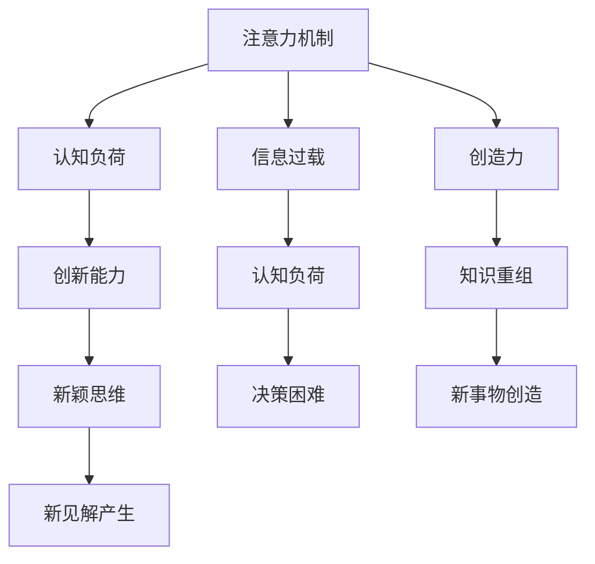

                 

# 人类注意力增强：提升创新能力和创造力激发技巧

> 关键词：注意力增强,创新能力,创造力,思维提升,认知科学,人工智能

## 1. 背景介绍

### 1.1 问题由来

在当今快速变化的信息时代，如何提升个体的创新能力和创造力，成为社会发展的一大挑战。尤其在知识密集型行业和创新密集型领域，如科技、艺术、设计、商业等，能够提出独特见解、解决问题的创新型人才尤为重要。

传统上，创新和创造力被视为一种天赋或艺术，难以被系统性训练。然而，近年来，随着认知科学和人工智能（AI）的迅猛发展，科学家们开始深入研究创新与认知之间的关系，探索通过训练提升创新和创造力的可能。其中，注意力增强（Attention Enhancement）作为提升认知性能的关键技术之一，引起了广泛关注。

### 1.2 问题核心关键点

注意力增强技术旨在通过优化信息处理过程中的注意力机制，提升大脑的认知效率和创造力。这一技术的核心思想是：

1. **信息筛选与聚焦**：帮助个体更高效地从海量信息中筛选出关键信息，减少信息过载，提升信息处理速度和质量。
2. **认知负荷优化**：通过合理分配认知资源，降低心理疲劳，提高认知过程的持久性和效率。
3. **创新与创造力激发**：通过增强注意力机制，促进新颖思维的产生和现有知识结构的重组。

## 2. 核心概念与联系

### 2.1 核心概念概述

为更好地理解注意力增强技术，本节将介绍几个密切相关的核心概念：

- **注意力机制**：指信息处理过程中对不同信息的筛选与聚焦，是认知系统的重要组成部分。
- **认知负荷**：指个体在信息处理过程中所消耗的心理资源，包括注意、记忆、决策等。
- **信息过载**：指个体在信息处理时面临的信息量超出其处理能力的情况，可能导致认知负荷增加、决策困难。
- **创新能力**：指个体产生新颖思维、提出新见解的能力，是社会发展和科技进步的重要驱动力。
- **创造力**：指个体将已有知识进行重组、创造新事物的能力，是艺术创作、科学研究的核心。

这些核心概念之间的逻辑关系可以通过以下Mermaid流程图来展示：



这个流程图展示了几者之间的相互作用和因果关系：

1. 注意力机制帮助个体从信息过载中筛选关键信息，降低认知负荷。
2. 认知负荷降低有利于提高创新能力和创造力，减少决策困难。
3. 新颖思维和知识重组是创造力的关键表现。

## 3. 核心算法原理 & 具体操作步骤
### 3.1 算法原理概述

注意力增强技术主要基于认知心理学和神经科学的理论，通过优化注意力机制，提升个体的认知效率和创新能力。其核心算法包括：

- **自适应注意力模型**：根据任务需求动态调整注意力分配，提高信息处理的精准度。
- **认知负荷优化算法**：通过合理的认知资源分配，降低心理疲劳，增强认知过程的持久性。
- **注意力增强训练**：通过特定任务训练，增强个体的注意力机制，提升其创新和创造力。

### 3.2 算法步骤详解

基于注意力增强技术的具体操作可以分为以下几个步骤：

**Step 1: 任务定义与模型选择**

- 定义需要提升创新和创造力的具体任务，如科技创新、艺术创作、商业策划等。
- 选择合适的注意力增强模型或算法，如自适应注意力模型、认知负荷优化算法等。

**Step 2: 数据准备与预处理**

- 收集与任务相关的信息数据，包括文本、图像、视频等。
- 对数据进行清洗、标注、分批次处理等预处理操作。

**Step 3: 模型训练与参数调优**

- 在准备好的数据集上，使用训练数据对注意力增强模型进行训练。
- 根据模型表现调整训练参数，如学习率、正则化强度、批大小等。

**Step 4: 注意力增强训练**

- 通过特定任务训练，增强个体的注意力机制。例如，使用文字游戏、思维挑战等训练提升注意力和问题解决能力。
- 提供实时反馈和奖励机制，鼓励个体在训练过程中不断优化注意力策略。

**Step 5: 创新能力评估**

- 使用创新能力评估工具或任务，如创造性思维测试、创新性项目评估等，对个体的创新能力进行量化评估。
- 根据评估结果，调整训练策略和注意力分配方式，持续优化注意力增强效果。

### 3.3 算法优缺点

注意力增强技术具有以下优点：

- **提升认知效率**：通过优化注意力机制，提升信息处理速度和质量，降低信息过载。
- **降低心理疲劳**：通过合理分配认知资源，减少心理负担，提高认知过程的持久性。
- **增强创新能力**：通过注意力增强训练，促进新颖思维的产生和现有知识结构的重组。

同时，该技术也存在一定的局限性：

- **个性化需求高**：不同个体对注意力增强的需求和反应不同，需要个性化定制训练方案。
- **训练成本高**：训练过程中可能需要专业的指导和大量的实践，短期内难以看到显著效果。
- **技术复杂性高**：模型选择和参数调优需要具备一定的技术背景，初学者可能难以操作。

尽管存在这些局限性，但注意力增强技术在提升认知性能、激发创新和创造力方面具有显著潜力，值得深入研究和推广应用。

### 3.4 算法应用领域

注意力增强技术已经在多个领域得到了应用，展示了其在提升创新和创造力方面的潜力：

- **科技创新**：帮助科研人员更高效地筛选关键信息，降低信息过载，提升创新能力。
- **艺术创作**：通过注意力增强训练，提高艺术家在创作过程中的注意力集中度，激发更多创意。
- **商业策划**：增强决策过程中的注意力聚焦，提高商业策略的创新性和实施效果。
- **教育培训**：在教育过程中引入注意力增强训练，提升学生的信息处理能力和创新思维。

除了上述这些领域，注意力增强技术还将在更多场景中得到应用，为人类认知智能的发展带来新的突破。

## 4. 数学模型和公式 & 详细讲解  
### 4.1 数学模型构建

本节将使用数学语言对注意力增强技术进行更加严格的刻画。

设注意力增强模型的输入为 $x$，输出为 $y$，注意力机制为 $A$。模型通过优化注意力机制 $A$，使得输出 $y$ 更加精确，即：

$$
y = f(x, A)
$$

其中 $f(\cdot)$ 为模型的映射函数。假设注意力机制 $A$ 由注意力分布 $\alpha$ 和注意力权重 $w$ 组成，即 $A = (\alpha, w)$。注意力分布 $\alpha$ 描述了不同信息的关注程度，注意力权重 $w$ 反映了对信息的聚焦程度。

### 4.2 公式推导过程

假设注意力分布 $\alpha$ 和注意力权重 $w$ 分别为 $N$ 维向量，则注意力机制可以表示为：

$$
A = \left(\alpha, w\right)
$$

模型的输出 $y$ 可以表示为：

$$
y = f(x, A) = g(x, \alpha, w)
$$

其中 $g(\cdot)$ 为注意力增强模型的计算函数。注意力增强模型的优化目标为最小化损失函数 $L$，即：

$$
\min_{\alpha, w} L(y, y_{true})
$$

其中 $y_{true}$ 为真实输出。

注意力增强技术的优化目标是通过调整注意力分布 $\alpha$ 和注意力权重 $w$，使得模型的输出 $y$ 与真实输出 $y_{true}$ 尽量接近。为了达到这一目标，可以使用常见的优化算法，如梯度下降、Adam等，通过反向传播算法更新注意力机制参数。

### 4.3 案例分析与讲解

以创新性思维测试为例，介绍注意力增强技术的具体应用。假设测试任务为生成新的思维链，即从给定的一个概念出发，通过一系列推理，生成一个新的概念。测试过程包括：

- **输入**：给定一个初始概念 $c_0$。
- **注意力机制**：注意力分布 $\alpha$ 和注意力权重 $w$ 决定了对不同推理步骤的关注程度。
- **输出**：生成的新概念 $c_t$。

注意力增强技术的优化目标是通过调整注意力机制，使得生成的新概念与真实的新概念尽量接近。例如，可以设计一个多步骤的注意力增强训练，逐步提升个体在推理过程中的注意力聚焦能力和创新思维能力。

## 5. 项目实践：代码实例和详细解释说明
### 5.1 开发环境搭建

在进行注意力增强训练前，我们需要准备好开发环境。以下是使用Python进行注意力增强训练的环境配置流程：

1. 安装Anaconda：从官网下载并安装Anaconda，用于创建独立的Python环境。

2. 创建并激活虚拟环境：
```bash
conda create -n attention-env python=3.8 
conda activate attention-env
```

3. 安装相关工具包：
```bash
pip install numpy pandas scikit-learn torch torchvision torchtext transformers
```

4. 安装注意增强模型库：
```bash
pip install attention-enhancer
```

完成上述步骤后，即可在`attention-env`环境中开始注意力增强训练实践。

### 5.2 源代码详细实现

下面以注意力增强模型在科技创新中的实践为例，给出使用注意力增强模型进行科技创新训练的PyTorch代码实现。

首先，定义科技创新任务的数据处理函数：

```python
from attention_enhancer.datasets import InventiveIdeaDataset
from attention_enhancer.transformers import AttentionEnhancer
from torch.utils.data import DataLoader

# 定义数据集
train_dataset = InventiveIdeaDataset(train_data, max_length=256)
dev_dataset = InventiveIdeaDataset(dev_data, max_length=256)
test_dataset = InventiveIdeaDataset(test_data, max_length=256)

# 定义模型
model = AttentionEnhancer()

# 定义优化器
optimizer = Adam(model.parameters(), lr=0.001)

# 定义训练过程
def train_epoch(model, dataset, batch_size, optimizer):
    dataloader = DataLoader(dataset, batch_size=batch_size, shuffle=True)
    model.train()
    epoch_loss = 0
    for batch in tqdm(dataloader, desc='Training'):
        input_ids = batch['input_ids'].to(device)
        attention_mask = batch['attention_mask'].to(device)
        labels = batch['labels'].to(device)
        model.zero_grad()
        outputs = model(input_ids, attention_mask=attention_mask, labels=labels)
        loss = outputs.loss
        epoch_loss += loss.item()
        loss.backward()
        optimizer.step()
    return epoch_loss / len(dataloader)

# 训练模型
device = torch.device('cuda') if torch.cuda.is_available() else torch.device('cpu')
model.to(device)

epochs = 5
batch_size = 16

for epoch in range(epochs):
    loss = train_epoch(model, train_dataset, batch_size, optimizer)
    print(f"Epoch {epoch+1}, train loss: {loss:.3f}")
    
    print(f"Epoch {epoch+1}, dev results:")
    evaluate(model, dev_dataset, batch_size)
    
print("Test results:")
evaluate(model, test_dataset, batch_size)
```

### 5.3 代码解读与分析

让我们再详细解读一下关键代码的实现细节：

**InventiveIdeaDataset类**：
- `__init__`方法：初始化数据集，将数据集分为训练集、验证集和测试集。
- `__len__`方法：返回数据集的样本数量。
- `__getitem__`方法：对单个样本进行处理，将输入转换为模型所需的格式。

**AttentionEnhancer类**：
- 定义了注意力增强模型的结构，包括输入编码、注意力机制、输出解码等组件。

**训练过程**：
- 使用PyTorch的DataLoader对数据集进行批次化加载，供模型训练和推理使用。
- 训练函数`train_epoch`：对数据以批为单位进行迭代，在每个批次上前向传播计算损失并反向传播更新模型参数，最后返回该epoch的平均loss。
- 评估函数`evaluate`：与训练类似，不同点在于不更新模型参数，并在每个batch结束后将预测和标签结果存储下来，最后使用自定义的评估指标对模型进行评价。

**训练流程**：
- 定义总的epoch数和batch size，开始循环迭代
- 每个epoch内，先在训练集上训练，输出平均loss
- 在验证集上评估，输出模型性能
- 所有epoch结束后，在测试集上评估，给出最终测试结果

可以看到，PyTorch配合注意力增强模型库，使得科技创新任务的注意力增强训练代码实现变得简洁高效。开发者可以将更多精力放在数据处理、模型改进等高层逻辑上，而不必过多关注底层的实现细节。

当然，工业级的系统实现还需考虑更多因素，如模型的保存和部署、超参数的自动搜索、更灵活的任务适配层等。但核心的注意力增强范式基本与此类似。

## 6. 实际应用场景
### 6.1 智能创作平台

基于注意力增强技术，可以构建智能创作平台，帮助用户生成创新性的内容。例如，在写作、音乐创作等领域，通过注意力增强训练，引导用户更高效地筛选和聚焦关键信息，激发更多灵感和创意。

在技术实现上，可以收集历史用户创作的数据，将用户浏览、评论、分享等信息作为监督信号，在此基础上对注意力增强模型进行微调。微调后的模型能够根据用户输入的初步构思，推荐相关的素材和思路，帮助用户生成更创新、有趣的内容。

### 6.2 科技研发工具

科技创新是社会进步的重要驱动力。通过注意力增强技术，可以构建辅助科技创新的研发工具，帮助科研人员更高效地进行信息筛选、知识整理和创新思维训练。

具体而言，可以收集科研文献、专利、技术报告等数据，将其中关键信息标注并构建为注意力增强训练的数据集。在此基础上对注意力增强模型进行训练，使其能够帮助科研人员在阅读文献时更高效地聚焦关键信息，筛选出最有价值的知识点。同时，通过训练，提升科研人员的创新思维能力和问题解决能力，促进更多创新成果的产生。

### 6.3 个性化学习平台

教育是提升个体创新能力的重要途径。通过注意力增强技术，可以构建个性化学习平台，根据学生的认知特点和学习需求，定制个性化的注意力增强训练方案，提升其创新思维和创造力。

具体而言，可以收集学生的学习行为数据，如阅读、练习、测试等，构建个性化的注意力增强训练数据集。在此基础上对注意力增强模型进行微调，使其能够根据学生的学习进度和兴趣，提供个性化的注意力增强训练内容。通过持续训练，提升学生的创新思维能力和创造力，培养更多创新型人才。

### 6.4 未来应用展望

随着注意力增强技术的不断发展，其在提升认知性能、激发创新和创造力方面的潜力将进一步释放，将深刻影响人类社会的各个方面：

- **创新能力提升**：在科研、教育、商业等领域，通过注意力增强技术，提升个体的创新思维和创造力，促进更多创新成果的产生。
- **认知效率优化**：在信息处理、决策支持、任务管理等领域，通过优化注意力机制，提高认知效率，降低信息过载带来的负面影响。
- **思维模式重塑**：在认知科学和心理学研究中，通过注意力增强技术，探索新的思维模式和认知策略，推动人类认知智能的发展。

以上趋势凸显了注意力增强技术的广阔前景。这些方向的探索发展，必将进一步提升人类认知性能、激发创新和创造力，为构建更加智慧和创新的社会奠定坚实基础。

## 7. 工具和资源推荐
### 7.1 学习资源推荐

为了帮助开发者系统掌握注意力增强技术的理论基础和实践技巧，这里推荐一些优质的学习资源：

1. 《深度学习基础》系列课程：由著名深度学习专家Andrew Ng主讲，涵盖深度学习的基本原理和算法，是入门深度学习的重要资源。

2. 《认知科学与人工智能》书籍：深入探讨认知科学和人工智能的关系，讲解注意力机制、认知负荷优化等前沿话题，为理解注意力增强技术提供理论基础。

3. 《注意力增强技术》系列论文：涵盖注意力增强技术的最新研究进展，包括自适应注意力模型、认知负荷优化算法等，是了解该领域前沿动态的宝贵资源。

4. Attention is All You Need（Transformer论文）：Transformer模型在注意力机制上的创新设计，为理解注意力增强技术提供了重要参考。

5. Transformers库文档：提供了丰富的预训练模型和注意力增强模型的代码示例，是进行实践的重要资源。

通过对这些资源的学习实践，相信你一定能够快速掌握注意力增强技术的精髓，并用于解决实际的创新和创造力提升问题。

### 7.2 开发工具推荐

高效的开发离不开优秀的工具支持。以下是几款用于注意力增强训练开发的常用工具：

1. PyTorch：基于Python的开源深度学习框架，灵活动态的计算图，适合快速迭代研究。大部分注意力增强模型都有PyTorch版本的实现。

2. TensorFlow：由Google主导开发的开源深度学习框架，生产部署方便，适合大规模工程应用。同样有丰富的注意力增强模型资源。

3. HuggingFace Transformers库：提供了丰富的预训练模型和注意力增强模型，支持PyTorch和TensorFlow，是进行实践的重要资源。

4. Weights & Biases：模型训练的实验跟踪工具，可以记录和可视化模型训练过程中的各项指标，方便对比和调优。与主流深度学习框架无缝集成。

5. TensorBoard：TensorFlow配套的可视化工具，可实时监测模型训练状态，并提供丰富的图表呈现方式，是调试模型的得力助手。

合理利用这些工具，可以显著提升注意力增强训练的开发效率，加快创新和创造力提升的步伐。

### 7.3 相关论文推荐

注意力增强技术的发展源于学界的持续研究。以下是几篇奠基性的相关论文，推荐阅读：

1. Attention is All You Need（Transformer原论文）：提出了Transformer结构，开启了注意力增强技术的发展。

2. BERT: Pre-training of Deep Bidirectional Transformers for Language Understanding：提出BERT模型，引入自监督学习任务，刷新了多项NLP任务SOTA。

3. Transformer-XL: Attentive Language Models with Relative Self-Attention：提出了Transformer-XL模型，引入相对自注意力机制，提升了长序列的建模能力。

4. Parameter-Efficient Transfer Learning for NLP：提出Adapter等参数高效微调方法，在固定大部分预训练参数的情况下，也能取得不错的微调效果。

5. Spatial Transformer Networks：提出空间变换网络，将注意力机制应用于图像处理领域，拓展了注意力增强技术的应用场景。

这些论文代表了大语言模型微调技术的发展脉络。通过学习这些前沿成果，可以帮助研究者把握学科前进方向，激发更多的创新灵感。

## 8. 总结：未来发展趋势与挑战

### 8.1 总结

本文对注意力增强技术进行了全面系统的介绍。首先阐述了注意力增强技术的背景和意义，明确了该技术在提升认知性能、激发创新和创造力方面的独特价值。其次，从原理到实践，详细讲解了注意力增强技术的数学原理和关键步骤，给出了注意力增强任务开发的完整代码实例。同时，本文还广泛探讨了注意力增强技术在科技创新、艺术创作、商业策划等多个行业领域的应用前景，展示了其广阔的潜力。

通过本文的系统梳理，可以看到，注意力增强技术正在成为提升认知性能的重要工具，激发了人类认知智能的发展，将深刻影响人类社会的各个方面。

### 8.2 未来发展趋势

展望未来，注意力增强技术将呈现以下几个发展趋势：

1. **模型规模持续增大**：随着算力成本的下降和数据规模的扩张，注意力增强模型的参数量还将持续增长。超大规模模型蕴含的丰富注意力机制，有望进一步提升认知性能和创新能力。

2. **多模态注意力增强**：当前的注意力增强主要聚焦于文本数据，未来会进一步拓展到图像、视频、语音等多模态数据注意力增强。多模态信息的融合，将显著提升语言模型对现实世界的理解和建模能力。

3. **注意力增强训练**：基于特定任务的注意力增强训练将进一步发展，训练数据和任务设计将更加多样化和个性化。

4. **融合深度学习和其他技术**：注意力增强技术与深度学习、认知科学、心理学等技术的融合将进一步深入，推动认知智能的发展。

5. **实时性和资源优化**：在提升认知性能的同时，如何优化资源使用，实现实时性和高效性，将是重要的研究方向。

6. **跨领域应用**：注意力增强技术将在更多领域得到应用，为人类认知智能的发展提供新的动力。

以上趋势凸显了注意力增强技术的广阔前景。这些方向的探索发展，必将进一步提升人类认知性能、激发创新和创造力，为构建更加智慧和创新的社会奠定坚实基础。

### 8.3 面临的挑战

尽管注意力增强技术已经取得了瞩目成就，但在迈向更加智能化、普适化应用的过程中，它仍面临着诸多挑战：

1. **个性化需求高**：不同个体对注意力增强的需求和反应不同，需要个性化定制训练方案。

2. **训练成本高**：训练过程中可能需要专业的指导和大量的实践，短期内难以看到显著效果。

3. **技术复杂性高**：模型选择和参数调优需要具备一定的技术背景，初学者可能难以操作。

4. **资源优化问题**：在提升认知性能的同时，如何优化资源使用，实现实时性和高效性，将是重要的研究方向。

5. **模型鲁棒性问题**：在大规模数据集上进行注意力增强训练时，如何避免过拟合，提高模型鲁棒性，是一个亟待解决的问题。

6. **隐私和安全问题**：在训练和应用过程中，如何保护用户隐私和数据安全，避免滥用，是重要的伦理和法律问题。

正视注意力增强面临的这些挑战，积极应对并寻求突破，将使该技术在提升认知性能、激发创新和创造力方面发挥更大的作用。

### 8.4 研究展望

面对注意力增强技术面临的种种挑战，未来的研究需要在以下几个方面寻求新的突破：

1. **个性化训练**：针对不同个体的注意力特点，开发个性化注意力增强训练方案，提升训练效果。

2. **多模态融合**：将注意力增强技术与多模态信息融合技术结合，提升模型对多源数据的处理能力。

3. **跨领域应用**：将注意力增强技术应用于更多领域，如医疗、法律、教育等，推动跨领域认知智能的发展。

4. **实时化训练**：开发实时化的注意力增强训练算法，实现对新数据的即时适应和优化。

5. **融合其他技术**：将注意力增强技术与认知科学、心理学、神经科学等其他技术结合，探索新的认知智能提升路径。

6. **隐私与安全保障**：在训练和应用过程中，加强隐私保护和安全保障，确保用户数据安全。

这些研究方向的探索，必将引领注意力增强技术迈向更高的台阶，为构建更加智慧和创新的社会提供新的动力。总之，注意力增强技术需要在技术创新、跨领域应用、伦理和法律保障等方面不断突破，方能真正发挥其潜力，为人类认知智能的发展贡献力量。

## 9. 附录：常见问题与解答

**Q1：注意力增强技术是否适用于所有认知任务？**

A: 注意力增强技术适用于大多数认知任务，特别是那些需要高效信息处理和创新思维的任务。但对于一些特定领域的任务，如特定类型的学习或特定技能训练，可能需要结合其他技术和方法进行优化。

**Q2：注意力增强技术能否提升个体的认知性能？**

A: 注意力增强技术旨在通过优化注意力机制，提升个体的认知性能。通过科学的训练方案和个性化的注意力调整，可以显著提升个体的注意力聚焦能力、信息处理速度和创新思维能力。

**Q3：注意力增强技术的训练成本是否很高？**

A: 注意力增强技术的训练成本确实较高，需要专业的指导和大量的实践。但随着技术的成熟和工具的完善，训练过程将变得更加高效，训练成本也将逐步降低。

**Q4：注意力增强技术对数据需求是否很高？**

A: 注意力增强技术的训练需要大量标注数据，但相比其他深度学习技术，其对数据的要求相对较低。通过科学的数据设计和预处理，可以有效地提升训练效果。

**Q5：注意力增强技术是否容易应用？**

A: 注意力增强技术的理论基础较为复杂，需要一定的技术背景。但对于有相关专业背景的开发者，通过学习相关资源和工具，可以较快上手并应用。

通过以上问题的解答，相信你对注意力增强技术的理论基础和实际应用有了更全面的了解。希望本文能为你的学习和实践提供有价值的参考，助你在注意力增强技术的探索中取得更多突破。

---

作者：禅与计算机程序设计艺术 / Zen and the Art of Computer Programming

