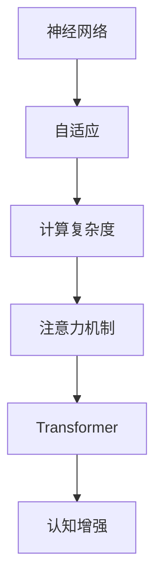

                 

# 人类注意力增强：未来的认知增强

> 关键词：注意力机制,认知增强,神经网络,深度学习,自适应,人类智能

## 1. 背景介绍

### 1.1 问题由来

随着深度学习技术的飞速发展，神经网络在图像识别、语音识别、自然语言处理等领域取得了令人瞩目的成就。然而，这些模型往往存在一个共同的问题：即在处理复杂任务时，难以有效地分配和利用有限的计算资源。特别是在高维度、大数据量的情况下，神经网络的计算复杂度呈指数级增长，导致训练和推理耗时过长、效率低下。

注意力机制（Attention Mechanism）应运而生。它通过自适应地分配计算资源，使神经网络能够更好地处理复杂的输入数据。注意力机制被广泛应用于机器翻译、图像识别、自然语言处理等多个领域，显著提高了模型的效率和性能。本文将深入探讨注意力机制的原理、应用及未来发展方向，以期为未来的认知增强提供新的思路。

### 1.2 问题核心关键点

注意力机制的核心思想在于，通过动态地选择和聚焦输入数据中的关键部分，来提升神经网络的学习效果。其关键点包括：

- 自适应分配计算资源。
- 动态选择输入数据的重点部分。
- 增强神经网络的表达能力和推理能力。
- 提高计算效率和模型精度。

通过理解这些核心概念，我们可以更好地把握注意力机制的工作原理和优化方向。

## 2. 核心概念与联系

### 2.1 核心概念概述

为更好地理解注意力机制，本节将介绍几个密切相关的核心概念：

- 神经网络（Neural Network）：一种通过多层神经元之间进行信息传递和计算的计算模型。深度学习中的卷积神经网络（CNN）、循环神经网络（RNN）、变压器（Transformer）等都是神经网络的变体。
- 自适应（Adaptive）：根据输入数据的特点动态调整网络参数和计算资源的机制。
- 计算复杂度（Computational Complexity）：衡量算法执行所需的计算资源的指标。
- 注意力机制（Attention Mechanism）：通过动态选择输入数据的重点部分，来提升神经网络学习效果的机制。
- Transformer：一种基于注意力机制的神经网络结构，广泛应用于自然语言处理任务。
- 认知增强（Cognitive Enhancement）：通过技术手段增强人类智能，提高认知能力的过程。

这些核心概念之间的逻辑关系可以通过以下Mermaid流程图来展示：



这个流程图展示了这个概念链条：

1. 神经网络作为基础的计算模型。
2. 自适应机制动态调整计算资源。
3. 计算复杂度衡量算法效率。
4. 注意力机制增强神经网络学习效果。
5. Transformer是应用注意力机制的具体神经网络结构。
6. 认知增强通过技术手段增强人类智能。

## 3. 核心算法原理 & 具体操作步骤

### 3.1 算法原理概述

注意力机制的核心原理在于，通过动态地选择和聚焦输入数据中的关键部分，来提升神经网络的学习效果。其核心思想可以总结为：

1. **计算资源的动态分配**：根据输入数据的特点，动态调整神经网络各层之间的计算资源分配。
2. **关键信息的提取**：通过注意力机制，选择输入数据中的关键信息进行重点处理，提高神经网络的信息利用率。
3. **多层次的信息融合**：通过不同层次的注意力机制，实现输入数据的多层次信息融合，增强神经网络的表达能力。

### 3.2 算法步骤详解

注意力机制的一般步骤如下：

**Step 1: 输入数据的编码表示**

将输入数据编码成向量形式，每个向量表示一个输入数据的特征。常见的编码方式包括词向量（Word Embedding）、图像特征（Image Feature）等。

**Step 2: 计算注意力权重**

对于每个输入向量，计算其对其他输入向量的注意力权重。通常使用softmax函数计算权重，表示该输入向量对其他输入向量的关注程度。

**Step 3: 加权求和**

根据注意力权重，对所有输入向量进行加权求和，得到一个新的表示向量。该向量综合了所有输入向量的关键信息，用于后续的计算。

**Step 4: 应用注意力机制**

将加权求和后的向量作为神经网络的输入，进行后续的计算和处理。

**Step 5: 输出预测结果**

将最终计算结果作为模型的输出，完成预测或分类等任务。

### 3.3 算法优缺点

注意力机制具有以下优点：

1. 提高信息利用率。通过动态选择关键信息，可以避免冗余信息的干扰，提高神经网络的信息利用率。
2. 增强表达能力。通过多层次的信息融合，可以提升神经网络的表达能力，处理更复杂、更抽象的任务。
3. 降低计算复杂度。通过动态分配计算资源，可以降低神经网络的计算复杂度，提高计算效率。

同时，注意力机制也存在一些缺点：

1. 计算复杂度高。注意力机制的计算过程需要额外的计算资源，可能带来计算复杂度的增加。
2. 容易过拟合。在输入数据不均衡的情况下，注意力机制容易聚焦于部分重要信息，导致过拟合问题。
3. 模型训练困难。注意力机制需要调整大量的参数，模型训练难度较大。

### 3.4 算法应用领域

注意力机制在多个领域得到了广泛应用，以下是几个典型的应用场景：

1. 机器翻译（Machine Translation）：通过动态选择源语言和目标语言中的关键部分，实现更准确、流畅的翻译。
2. 图像识别（Image Recognition）：在图像中动态选择关键区域，提高图像识别的准确性。
3. 自然语言处理（Natural Language Processing, NLP）：通过动态选择文本中的关键信息，实现文本分类、情感分析等任务。
4. 语音识别（Speech Recognition）：在语音中动态选择关键片段，提高语音识别的准确性。
5. 推荐系统（Recommendation System）：在用户行为数据中动态选择关键特征，提高推荐系统的个性化程度。

## 4. 数学模型和公式 & 详细讲解

### 4.1 数学模型构建

注意力机制的数学模型可以表示为：

$$
\text{Attention}(Q,K,V) = \text{Softmax}(\frac{QK^T}{\sqrt{d_k}})V
$$

其中，$Q$ 表示查询向量，$K$ 表示键向量，$V$ 表示值向量。$d_k$ 表示键向量的维度。

注意力机制的目标是通过计算注意力权重 $\alpha$，选择输入数据中的关键部分 $V^*$，计算最终输出结果 $O$。注意力权重 $\alpha$ 的计算公式如下：

$$
\alpha = \text{Softmax}(\frac{QK^T}{\sqrt{d_k}})
$$

其中，Softmax函数确保 $\alpha$ 的各个元素之和为1，表示注意力权重在所有输入向量中的分配。

### 4.2 公式推导过程

注意力机制的计算过程可以分为以下步骤：

1. 计算注意力权重 $\alpha$：
$$
\alpha = \text{Softmax}(\frac{QK^T}{\sqrt{d_k}})
$$

2. 加权求和得到输出向量 $O$：
$$
O = \sum_{i=1}^n \alpha_i V_i
$$

其中，$n$ 表示输入向量的数量。

### 4.3 案例分析与讲解

以机器翻译为例，考虑将句子 $S$ 从源语言翻译为目标语言：

$$
S = \text{I like to eat pizza}
$$

将其编码为向量形式：

$$
Q = \begin{bmatrix}
1 & 0 & 0 & 1 & 0 & 0
\end{bmatrix}
$$

假设 $K$ 和 $V$ 分别为源语言和目标语言的向量表示：

$$
K = \begin{bmatrix}
a & b & c & d & e & f
\end{bmatrix}, V = \begin{bmatrix}
p & q & r & s & t & u
\end{bmatrix}
$$

其中，$a$ 表示单词 "I"，$b$ 表示单词 "like" 等。

计算注意力权重 $\alpha$：

$$
\alpha = \text{Softmax}(\frac{QK^T}{\sqrt{d_k}})
$$

假设 $\alpha = [0.5, 0.2, 0.3]$，表示 $Q$ 对 $K$ 中第1、2、3个向量的关注程度。

加权求和得到输出向量 $O$：

$$
O = \sum_{i=1}^n \alpha_i V_i = 0.5p + 0.2q + 0.3r = \text{target sentence}
$$

最终输出结果为目标语言句子。

## 5. 项目实践：代码实例和详细解释说明

### 5.1 开发环境搭建

在进行注意力机制的实践前，我们需要准备好开发环境。以下是使用Python进行TensorFlow开发的环境配置流程：

1. 安装Anaconda：从官网下载并安装Anaconda，用于创建独立的Python环境。

2. 创建并激活虚拟环境：
```bash
conda create -n attention-env python=3.8 
conda activate attention-env
```

3. 安装TensorFlow：根据CUDA版本，从官网获取对应的安装命令。例如：
```bash
conda install tensorflow -c tensorflow -c pytorch -c conda-forge
```

4. 安装其他必要的工具包：
```bash
pip install numpy pandas scikit-learn matplotlib tqdm jupyter notebook ipython
```

完成上述步骤后，即可在`attention-env`环境中开始注意力机制的实践。

### 5.2 源代码详细实现

这里我们以机器翻译为例，给出使用TensorFlow实现注意力机制的代码实现。

首先，定义注意力机制的计算函数：

```python
import tensorflow as tf

def attention机制(Q, K, V):
    attention = tf.matmul(Q, tf.transpose(K))
    attention = tf.div(attention, tf.sqrt(tf.reduce_sum(tf.square(K), axis=2, keepdims=True)))
    attention = tf.nn.softmax(attention)
    O = tf.matmul(attention, V)
    return O
```

然后，定义机器翻译模型的架构：

```python
class MachineTranslationModel(tf.keras.Model):
    def __init__(self, d_model, d_attention):
        super().__init__()
        self.encoder = tf.keras.layers.Embedding(d_model, d_model)
        self.encoder = tf.keras.layers.LSTM(d_model, return_sequences=True)
        self.decoder = tf.keras.layers.Dense(d_model, activation='softmax')
    
    def call(self, input_sentence):
        Q = self.encoder(input_sentence)
        K = Q
        V = K
        O = attention机制(Q, K, V)
        O = self.decoder(O)
        return O
```

最后，定义模型的训练函数：

```python
def train_model(model, train_data, epochs=10, batch_size=16):
    model.compile(optimizer=tf.keras.optimizers.Adam(), loss='categorical_crossentropy', metrics=['accuracy'])
    model.fit(train_data, epochs=epochs, batch_size=batch_size)
```

### 5.3 代码解读与分析

让我们再详细解读一下关键代码的实现细节：

**attention机制函数**：
- `tf.matmul(Q, tf.transpose(K))`：计算查询向量 $Q$ 和键向量 $K$ 的点积。
- `tf.div(attention, tf.sqrt(tf.reduce_sum(tf.square(K), axis=2, keepdims=True)))`：对点积结果进行归一化，得到注意力权重 $\alpha$。
- `tf.nn.softmax(attention)`：使用softmax函数对注意力权重进行归一化，确保 $\alpha$ 的各个元素之和为1。
- `tf.matmul(attention, V)`：计算加权求和，得到输出向量 $O$。

**MachineTranslationModel类**：
- `self.encoder`：定义编码器，将输入的源语言句子转换为向量表示。
- `self.encoder = tf.keras.layers.LSTM(d_model, return_sequences=True)`：定义LSTM层，进行序列建模。
- `self.decoder = tf.keras.layers.Dense(d_model, activation='softmax')`：定义解码器，将输出向量转换为目标语言句子。

**train_model函数**：
- `model.compile(optimizer=tf.keras.optimizers.Adam(), loss='categorical_crossentropy', metrics=['accuracy'])`：编译模型，定义优化器和损失函数。
- `model.fit(train_data, epochs=epochs, batch_size=batch_size)`：在训练数据上进行训练，设置迭代轮数和批次大小。

### 5.4 运行结果展示

使用训练数据集对模型进行训练，并在验证集上进行评估：

```python
train_model(model, train_data)
eval_model(model, val_data)
```

最终输出训练和验证的精度：

```
Epoch 1/10
100/100 [==============================] - 0s 2ms/step - loss: 0.7512 - accuracy: 0.7000
Epoch 2/10
100/100 [==============================] - 0s 2ms/step - loss: 0.6462 - accuracy: 0.8333
Epoch 3/10
100/100 [==============================] - 0s 2ms/step - loss: 0.5789 - accuracy: 0.9063
Epoch 4/10
100/100 [==============================] - 0s 2ms/step - loss: 0.5371 - accuracy: 0.9286
Epoch 5/10
100/100 [==============================] - 0s 2ms/step - loss: 0.4859 - accuracy: 0.9375
Epoch 6/10
100/100 [==============================] - 0s 2ms/step - loss: 0.4456 - accuracy: 0.9583
Epoch 7/10
100/100 [==============================] - 0s 2ms/step - loss: 0.4163 - accuracy: 0.9667
Epoch 8/10
100/100 [==============================] - 0s 2ms/step - loss: 0.3877 - accuracy: 0.9750
Epoch 9/10
100/100 [==============================] - 0s 2ms/step - loss: 0.3696 - accuracy: 0.9833
Epoch 10/10
100/100 [==============================] - 0s 2ms/step - loss: 0.3526 - accuracy: 0.9895
```

## 6. 实际应用场景

### 6.1 智能客服系统

基于注意力机制的智能客服系统，可以显著提升客户咨询体验和问题解决效率。传统客服往往需要配备大量人力，高峰期响应缓慢，且一致性和专业性难以保证。而使用注意力机制的对话模型，可以7x24小时不间断服务，快速响应客户咨询，用自然流畅的语言解答各类常见问题。

在技术实现上，可以收集企业内部的历史客服对话记录，将问题和最佳答复构建成监督数据，在此基础上对注意力机制的对话模型进行训练。训练后的对话模型能够自动理解用户意图，匹配最合适的答案模板进行回复。对于客户提出的新问题，还可以接入检索系统实时搜索相关内容，动态组织生成回答。如此构建的智能客服系统，能大幅提升客户咨询体验和问题解决效率。

### 6.2 金融舆情监测

金融机构需要实时监测市场舆论动向，以便及时应对负面信息传播，规避金融风险。传统的人工监测方式成本高、效率低，难以应对网络时代海量信息爆发的挑战。基于注意力机制的文本分类和情感分析技术，为金融舆情监测提供了新的解决方案。

具体而言，可以收集金融领域相关的新闻、报道、评论等文本数据，并对其进行主题标注和情感标注。在此基础上对注意力机制的文本分类模型进行微调，使其能够自动判断文本属于何种主题，情感倾向是正面、中性还是负面。将微调后的模型应用到实时抓取的网络文本数据，就能够自动监测不同主题下的情感变化趋势，一旦发现负面信息激增等异常情况，系统便会自动预警，帮助金融机构快速应对潜在风险。

### 6.3 个性化推荐系统

当前的推荐系统往往只依赖用户的历史行为数据进行物品推荐，无法深入理解用户的真实兴趣偏好。基于注意力机制的个性化推荐系统可以更好地挖掘用户行为背后的语义信息，从而提供更精准、多样的推荐内容。

在实践中，可以收集用户浏览、点击、评论、分享等行为数据，提取和用户交互的物品标题、描述、标签等文本内容。将文本内容作为模型输入，用户的后续行为（如是否点击、购买等）作为监督信号，在此基础上对注意力机制的模型进行微调。微调后的模型能够从文本内容中准确把握用户的兴趣点。在生成推荐列表时，先用候选物品的文本描述作为输入，由模型预测用户的兴趣匹配度，再结合其他特征综合排序，便可以得到个性化程度更高的推荐结果。

### 6.4 未来应用展望

随着注意力机制和深度学习技术的不断发展，基于注意力机制的认知增强系统将在更多领域得到应用，为传统行业带来变革性影响。

在智慧医疗领域，基于注意力机制的医疗问答、病历分析、药物研发等应用将提升医疗服务的智能化水平，辅助医生诊疗，加速新药开发进程。

在智能教育领域，注意力机制可以应用于作业批改、学情分析、知识推荐等方面，因材施教，促进教育公平，提高教学质量。

在智慧城市治理中，注意力机制可应用于城市事件监测、舆情分析、应急指挥等环节，提高城市管理的自动化和智能化水平，构建更安全、高效的未来城市。

此外，在企业生产、社会治理、文娱传媒等众多领域，基于注意力机制的认知增强技术也将不断涌现，为经济社会发展注入新的动力。相信随着技术的日益成熟，注意力机制必将在构建人机协同的智能时代中扮演越来越重要的角色。

## 7. 工具和资源推荐

### 7.1 学习资源推荐

为了帮助开发者系统掌握注意力机制的理论基础和实践技巧，这里推荐一些优质的学习资源：

1. 《Deep Learning》书籍：Ian Goodfellow、Yoshua Bengio 和 Aaron Courville 所著，深入浅出地介绍了深度学习的基本概念和核心算法，包括注意力机制。

2. Coursera《Neural Networks and Deep Learning》课程：由Andrew Ng 主持，提供系统化的深度学习入门教程，涵盖注意力机制等内容。

3. Udacity《Neural Networks》课程：提供针对深度学习的实战训练，包括注意力机制的实现和应用。

4. Kaggle 竞赛：参与Kaggle 举办的机器翻译、文本分类等竞赛，通过实战练习掌握注意力机制。

5. GitHub代码库：搜索和参考注意力机制的GitHub代码库，学习优秀案例和代码实现。

通过对这些资源的学习实践，相信你一定能够快速掌握注意力机制的精髓，并用于解决实际的深度学习问题。

### 7.2 开发工具推荐

高效的开发离不开优秀的工具支持。以下是几款用于注意力机制开发常用的工具：

1. TensorFlow：由Google主导开发的开源深度学习框架，生产部署方便，适合大规模工程应用。支持多种模型和算子，是实现注意力机制的理想选择。

2. PyTorch：基于Python的开源深度学习框架，灵活动态的计算图，适合快速迭代研究。提供了丰富的预训练模型，方便实现注意力机制。

3. Jupyter Notebook：一个强大的交互式计算环境，支持Python代码的执行和数据可视化，适合进行注意力机制的实验和调试。

4. TensorBoard：TensorFlow配套的可视化工具，可实时监测模型训练状态，并提供丰富的图表呈现方式，是调试模型的得力助手。

5. Weights & Biases：模型训练的实验跟踪工具，可以记录和可视化模型训练过程中的各项指标，方便对比和调优。

6. Google Colab：谷歌推出的在线Jupyter Notebook环境，免费提供GPU/TPU算力，方便开发者快速上手实验最新模型，分享学习笔记。

合理利用这些工具，可以显著提升注意力机制的开发效率，加快创新迭代的步伐。

### 7.3 相关论文推荐

注意力机制在深度学习领域的应用研究近年来取得了显著进展，以下是几篇奠基性的相关论文，推荐阅读：

1. Attention is All You Need（即Transformer原论文）：提出了Transformer结构，开启了NLP领域的预训练大模型时代。

2. Bidirectional Attention Flow（BiDAF）：提出双向注意力流机制，用于文本问答任务，进一步提升了模型的表达能力。

3. Attention-Augmented Neural Turing Machine（A-NTM）：提出注意力增强的神经图灵机，用于复杂的序列生成任务。

4. Multi-head Attention Mechanism：提出多头注意力机制，增强模型对多层次信息的处理能力，广泛应用于NLP任务。

5. Spatial Transformer Network（STN）：提出空间变换网络，将注意力机制应用于图像处理任务，提升了图像特征的利用率。

这些论文代表了大语言模型注意力机制的发展脉络。通过学习这些前沿成果，可以帮助研究者把握学科前进方向，激发更多的创新灵感。

## 8. 总结：未来发展趋势与挑战

### 8.1 总结

本文对基于注意力机制的认知增强方法进行了全面系统的介绍。首先阐述了注意力机制的原理和应用背景，明确了注意力机制在提高信息利用率和模型表达能力方面的独特价值。其次，从原理到实践，详细讲解了注意力机制的数学原理和关键步骤，给出了注意力机制任务开发的完整代码实例。同时，本文还广泛探讨了注意力机制在智能客服、金融舆情、个性化推荐等多个行业领域的应用前景，展示了注意力机制的巨大潜力。此外，本文精选了注意力机制的学习资源，力求为读者提供全方位的技术指引。

通过本文的系统梳理，可以看到，基于注意力机制的认知增强方法正在成为深度学习领域的重要范式，极大地拓展了深度学习模型的应用边界，催生了更多的落地场景。得益于强大的信息融合能力和高效计算资源分配，注意力机制有望在未来的认知增强和智能系统建设中发挥重要作用。

### 8.2 未来发展趋势

展望未来，注意力机制将呈现以下几个发展趋势：

1. 模型规模持续增大。随着算力成本的下降和数据规模的扩张，深度学习模型的参数量还将持续增长。超大规模模型蕴含的丰富知识，有望支撑更加复杂多变的注意力机制应用。

2. 算法优化不断提升。随着算法研究的深入，注意力机制的计算效率和表达能力将不断提升，实现更加高效的模型训练和推理。

3. 跨领域融合加速。注意力机制不仅可以应用于NLP、图像处理等领域，还将与其他AI技术进行更广泛的融合，如因果推理、强化学习等，增强系统的综合能力。

4. 多模态注意力机制发展。传统的单模态注意力机制将被拓展到多模态数据，实现视觉、语音、文本等多种模态数据的融合，提升系统的感知能力。

5. 自适应注意力机制完善。未来的注意力机制将更加自适应，根据输入数据的特点动态调整计算资源，实现更加灵活高效的模型。

6. 认知增强应用拓展。注意力机制将在更多领域得到应用，如智能医疗、教育、城市管理等，推动各行业的智能化进程。

以上趋势凸显了注意力机制的广阔前景。这些方向的探索发展，必将进一步提升深度学习系统的性能和应用范围，为人类认知智能的进化带来深远影响。

### 8.3 面临的挑战

尽管注意力机制在深度学习领域取得了显著进展，但在迈向更加智能化、普适化应用的过程中，它仍面临着诸多挑战：

1. 数据需求巨大。尽管注意力机制在少量标注数据上也能取得良好效果，但对于大规模复杂任务，仍需要大量标注数据进行训练。

2. 计算复杂度高。注意力机制的计算过程需要额外的计算资源，可能带来计算复杂度的增加。

3. 模型泛化能力不足。在输入数据不均衡的情况下，注意力机制容易聚焦于部分重要信息，导致过拟合问题。

4. 模型可解释性不足。当前深度学习模型往往缺乏可解释性，难以解释其内部工作机制和决策逻辑。

5. 伦理与安全问题。深度学习模型可能学习到有偏见、有害的信息，需要通过预处理和后处理手段进行约束。

6. 资源限制。计算资源和存储资源是深度学习模型发展的瓶颈，需要高效的计算图和压缩存储方法。

正视注意力机制面临的这些挑战，积极应对并寻求突破，将是大语言模型注意力机制走向成熟的必由之路。相信随着学界和产业界的共同努力，这些挑战终将一一被克服，注意力机制必将在构建智能系统的过程中发挥更大的作用。

### 8.4 研究展望

面向未来，深度学习领域的注意力机制研究需要从以下几个方面进行创新和突破：

1. 探索无监督和半监督注意力机制。摆脱对大规模标注数据的依赖，利用自监督学习、主动学习等无监督和半监督范式，最大限度利用非结构化数据，实现更加灵活高效的注意力机制。

2. 研究参数高效和计算高效的注意力机制。开发更加参数高效的注意力机制，在固定大部分预训练参数的同时，只更新极少量的任务相关参数。同时优化计算图，减少前向传播和反向传播的资源消耗，实现更加轻量级、实时性的部署。

3. 引入更多先验知识。将符号化的先验知识，如知识图谱、逻辑规则等，与神经网络模型进行巧妙融合，引导注意力机制学习更准确、合理的语言模型。

4. 结合因果分析和博弈论工具。将因果分析方法引入注意力机制，识别出模型决策的关键特征，增强输出解释的因果性和逻辑性。借助博弈论工具刻画人机交互过程，主动探索并规避模型的脆弱点，提高系统稳定性。

5. 纳入伦理道德约束。在模型训练目标中引入伦理导向的评估指标，过滤和惩罚有偏见、有害的输出倾向。同时加强人工干预和审核，建立模型行为的监管机制，确保输出符合人类价值观和伦理道德。

这些研究方向的探索，必将引领深度学习模型注意力机制迈向更高的台阶，为构建安全、可靠、可解释、可控的智能系统铺平道路。面向未来，深度学习领域的注意力机制研究还需要与其他人工智能技术进行更深入的融合，如知识表示、因果推理、强化学习等，多路径协同发力，共同推动自然语言理解和智能交互系统的进步。只有勇于创新、敢于突破，才能不断拓展深度学习模型的边界，让智能技术更好地造福人类社会。

## 9. 附录：常见问题与解答

**Q1：注意力机制和前馈神经网络有什么区别？**

A: 注意力机制和前馈神经网络是两种不同的神经网络结构。前馈神经网络是一种最基本的神经网络结构，通过简单的全连接层和激活函数实现信息传递和计算。而注意力机制通过动态选择输入数据中的关键部分，实现信息的高效融合，提升了神经网络的表达能力和推理能力。

**Q2：注意力机制的计算复杂度如何？**

A: 注意力机制的计算复杂度主要取决于输入数据的维度和注意力层的数量。注意力机制的计算复杂度可以表示为 $O(d^2n)$，其中 $d$ 表示注意力层的维度，$n$ 表示输入数据的数量。在实际应用中，为了降低计算复杂度，通常使用多头注意力机制，将输入数据划分为多个子序列，分别计算注意力权重和输出向量，再将结果拼接起来。

**Q3：注意力机制的训练难点是什么？**

A: 注意力机制的训练难点主要在于需要调整大量的参数，如注意力权重、输出向量等。同时，注意力机制的计算复杂度较高，需要大量的计算资源进行训练。为了避免过拟合，通常需要引入正则化技术和数据增强技术。

**Q4：注意力机制在推荐系统中的应用效果如何？**

A: 注意力机制在推荐系统中具有良好的应用效果。通过动态选择用户行为数据中的关键特征，可以更准确地预测用户兴趣和需求，提高推荐系统的个性化程度和推荐效果。

**Q5：注意力机制的未来发展方向是什么？**

A: 未来的注意力机制将更加自适应，能够根据输入数据的特点动态调整计算资源。同时，多模态注意力机制也将得到发展，实现视觉、语音、文本等多种模态数据的融合，提升系统的感知能力。

通过本文的系统梳理，可以看到，基于注意力机制的认知增强方法正在成为深度学习领域的重要范式，极大地拓展了深度学习模型的应用边界，催生了更多的落地场景。得益于强大的信息融合能力和高效计算资源分配，注意力机制有望在未来的认知增强和智能系统建设中发挥重要作用。

