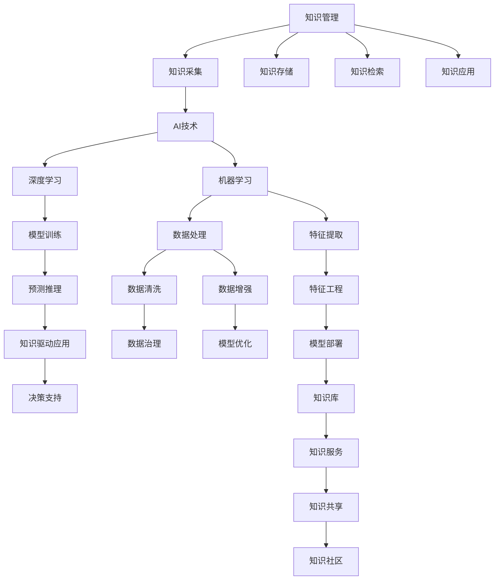

                 

# 人类的知识与权力：知识就是力量与责任

> 关键词：人工智能,知识管理,知识工程,人工智能伦理,知识共享

## 1. 背景介绍

### 1.1 问题由来
在信息化时代，知识和智慧成为了驱动人类进步的关键资源。随着人工智能(AI)技术的快速发展，知识与AI的深度融合，使得知识管理、知识共享、知识驱动等成为现代科技和社会发展的新动力。

然而，知识与AI的结合也带来了新的挑战：如何有效地管理、利用、保护知识？如何平衡知识共享与隐私保护？如何在追求知识驱动的同时，确保技术应用的伦理和责任？这些问题已成为摆在全社会面前的重要课题。

### 1.2 问题核心关键点
本节将讨论知识与AI的融合，其核心在于知识管理和人工智能技术的应用。知识管理包括知识采集、存储、检索、应用等多个环节，目的是提升知识利用效率，释放知识潜力。而人工智能技术，尤其是深度学习和大规模预训练模型，通过自动学习和推理，显著提升了知识管理和应用的效果。

知识与AI的结合，不仅能够加速人类知识的积累与传播，还能够辅助人类决策，提升效率，推动创新。但同时，也存在诸如数据隐私、知识偏见、系统透明性等伦理挑战，需要在应用过程中加以谨慎对待。

### 1.3 问题研究意义
研究知识与AI的结合，对于促进知识驱动型社会的构建，提升AI技术的社会价值，具有重要意义：

1. 优化知识管理：通过AI技术，提升知识采集、存储、检索的自动化水平，使知识的获取、整理、利用更加高效。
2. 推动智能决策：AI技术能够从海量知识中提取有效信息，辅助决策，提升决策的科学性和精准性。
3. 促进知识共享：AI技术能够降低知识获取和共享的门槛，使更多人能够接触到高质量的知识资源。
4. 应对伦理挑战：在知识与AI结合的过程中，需要建立健全的伦理规范和法律框架，确保技术应用的公正性和责任性。
5. 驱动社会创新：知识与AI的结合，能够加速新知识的产生和应用，推动技术创新和社会进步。

## 2. 核心概念与联系

### 2.1 核心概念概述

为更好地理解知识与AI的结合，本节将介绍几个关键概念：

- 人工智能(Artificial Intelligence, AI)：指利用计算机模拟人类智能行为的技术，包括但不限于机器学习、深度学习、自然语言处理等。
- 知识管理(Knowledge Management, KM)：涉及知识的获取、整理、存储、检索、应用等过程，旨在提升知识的利用效率。
- 知识工程(Knowledge Engineering, KE)：通过工程化方法，将知识转化为可计算和可应用的形态。
- 人工智能伦理(AI Ethics)：研究AI技术在应用过程中涉及的伦理问题，如隐私保护、数据偏见、决策透明性等。
- 知识共享(Knowledge Sharing)：通过技术手段，促进知识的获取和传播，减少信息不对称。
- 知识驱动(Knowledge-Driven)：指以知识为基础，驱动技术创新和社会发展的策略。

这些概念共同构成了知识与AI结合的核心框架，使得知识能够更好地被管理和应用，从而提升社会的整体智慧水平。

### 2.2 核心概念原理和架构的 Mermaid 流程图



这个流程图展示了知识与AI结合的基本流程：

1. 通过AI技术，如机器学习和深度学习，从数据中提取知识。
2. 经过数据处理和特征工程，构建知识模型。
3. 通过模型训练和预测推理，应用知识进行决策支持。
4. 数据治理和模型优化，保障知识的质量和可靠性。
5. 知识库和服务，提供知识共享和应用。

这些步骤共同构成了一个完整的知识与AI结合框架，有助于理解和管理知识。

## 3. 核心算法原理 & 具体操作步骤
### 3.1 算法原理概述

知识与AI的结合，核心在于知识的管理和应用。AI技术，特别是深度学习和自然语言处理技术，能够从海量数据中提取知识和规律，辅助人类进行高效的知识管理。

知识管理的任务包括：

- 知识采集：从各种渠道收集和整理知识。
- 知识存储：将知识转化为结构化或非结构化的形式，存储在数据库或知识库中。
- 知识检索：根据用户需求，从知识库中检索出相关的知识。
- 知识应用：将知识转化为可执行的决策或行动方案。

以下是知识与AI结合的核心算法原理：

1. 数据采集与处理：利用爬虫技术从互联网、文献数据库等渠道获取数据，并进行预处理，包括去噪、清洗、标注等。
2. 特征提取与表示：利用自然语言处理技术，将文本数据转化为向量表示，便于后续分析和应用。
3. 模型训练与优化：使用深度学习模型，如BERT、GPT等，对知识数据进行训练，优化模型参数。
4. 知识检索与推荐：根据用户查询，利用检索模型或推荐系统，从知识库中检索或推荐相关知识。
5. 知识应用与评估：将知识转化为决策支持、信息检索、文本生成等功能，并评估其效果。

### 3.2 算法步骤详解

以下是知识与AI结合的详细步骤：

1. **数据采集与处理**：
   - 利用爬虫技术从互联网、文献数据库等渠道获取数据。
   - 对获取的数据进行预处理，包括去噪、清洗、标注等。
   - 将文本数据转化为向量表示，便于后续分析和应用。

2. **特征提取与表示**：
   - 使用自然语言处理技术，将文本数据转化为向量表示。
   - 使用BERT等预训练模型，对特征向量进行进一步加工，提取语义信息。

3. **模型训练与优化**：
   - 使用深度学习模型，如BERT、GPT等，对知识数据进行训练，优化模型参数。
   - 利用监督学习或自监督学习任务，提升模型对知识的理解和表示能力。
   - 使用正则化技术，如L2正则、Dropout等，防止过拟合。

4. **知识检索与推荐**：
   - 根据用户查询，利用检索模型或推荐系统，从知识库中检索或推荐相关知识。
   - 使用向量空间模型、协同过滤等技术，提升检索和推荐的准确性。
   - 使用对抗样本、知识增强等技术，提升系统的鲁棒性和泛化能力。

5. **知识应用与评估**：
   - 将知识转化为决策支持、信息检索、文本生成等功能。
   - 对知识应用的效果进行评估，包括准确率、召回率、F1值等指标。
   - 使用反馈机制，不断优化知识库和模型，提升系统性能。

### 3.3 算法优缺点

知识与AI结合的算法具有以下优点：

1. 高效自动：利用AI技术，可以自动地从海量数据中提取知识和规律，提升知识管理的效率。
2. 准确可靠：深度学习等技术能够提高知识提取的准确性和可靠性，减少人工干预的误差。
3. 跨领域应用：AI技术能够跨领域应用，适用于多种类型的知识管理场景。
4. 易于扩展：基于深度学习等模型，可以轻松扩展知识库的规模，提升系统的处理能力。

同时，也存在以下缺点：

1. 数据依赖：知识管理的效果很大程度上依赖于数据的质量和规模，数据获取和处理成本较高。
2. 模型复杂：深度学习模型参数量大，训练和推理成本较高，需要高性能的计算资源。
3. 泛化能力不足：AI模型往往对特定领域的知识提取效果较好，但跨领域泛化能力有限。
4. 隐私风险：知识管理涉及大量敏感数据，存在数据泄露和隐私侵犯的风险。
5. 可解释性不足：深度学习等模型的决策过程缺乏可解释性，难以理解其内部工作机制。

### 3.4 算法应用领域

知识与AI结合的算法，已经在多个领域得到了广泛应用，例如：

1. **医疗领域**：利用AI技术，从医学文献、临床数据中提取知识，辅助医生诊断和治疗。
2. **金融领域**：利用AI技术，从金融市场数据中提取知识，进行风险评估和投资策略优化。
3. **教育领域**：利用AI技术，从教育资源中提取知识，为学生提供个性化学习方案。
4. **新闻媒体**：利用AI技术，从海量新闻数据中提取知识，进行信息检索和新闻生成。
5. **智能客服**：利用AI技术，从客户对话中提取知识，进行智能客服和用户画像分析。
6. **智能制造**：利用AI技术，从生产数据中提取知识，进行智能制造和质量控制。

## 4. 数学模型和公式 & 详细讲解 & 举例说明

### 4.1 数学模型构建

本节将使用数学语言对知识与AI结合的基本框架进行更加严格的刻画。

记知识管理系统的输入数据为 $D=\{(x_i,y_i)\}_{i=1}^N$，其中 $x_i$ 为输入特征，$y_i$ 为知识标注。知识管理的目标是构建一个函数 $f(x;\theta)$，将输入特征 $x$ 映射为知识 $y$，其中 $\theta$ 为模型参数。

假设 $f(x;\theta)$ 为一个深度学习模型，如BERT或GPT。目标函数为：

$$
\mathcal{L}(\theta) = \frac{1}{N}\sum_{i=1}^N \ell(f(x_i;\theta),y_i)
$$

其中 $\ell$ 为损失函数，常用的包括交叉熵损失、均方误差损失等。

目标是最小化经验风险 $\mathcal{L}(\theta)$，即：

$$
\hat{\theta} = \mathop{\arg\min}_{\theta} \mathcal{L}(\theta)
$$

### 4.2 公式推导过程

以下我们以二分类任务为例，推导交叉熵损失函数及其梯度的计算公式。

假设模型 $f(x;\theta)$ 在输入 $x$ 上的输出为 $\hat{y}=f(x;\theta) \in [0,1]$，表示样本属于正类的概率。真实标签 $y \in \{0,1\}$。则二分类交叉熵损失函数定义为：

$$
\ell(f(x;\theta),y) = -[y\log \hat{y} + (1-y)\log (1-\hat{y})]
$$

将其代入经验风险公式，得：

$$
\mathcal{L}(\theta) = -\frac{1}{N}\sum_{i=1}^N [y_i\log f(x_i;\theta)+(1-y_i)\log(1-f(x_i;\theta))]
$$

根据链式法则，损失函数对参数 $\theta_k$ 的梯度为：

$$
\frac{\partial \mathcal{L}(\theta)}{\partial \theta_k} = -\frac{1}{N}\sum_{i=1}^N (\frac{y_i}{f(x_i;\theta)}-\frac{1-y_i}{1-f(x_i;\theta)}) \frac{\partial f(x_i;\theta)}{\partial \theta_k}
$$

其中 $\frac{\partial f(x_i;\theta)}{\partial \theta_k}$ 可进一步递归展开，利用自动微分技术完成计算。

在得到损失函数的梯度后，即可带入参数更新公式，完成模型的迭代优化。重复上述过程直至收敛，最终得到适应特定任务的知识管理模型 $f(x;\theta^*)$。

### 4.3 案例分析与讲解

以医疗领域知识管理为例，分析知识与AI结合的实际应用。

假设医疗知识管理系统的输入为患者的症状描述 $x$，输出为诊断结果 $y$。使用BERT模型作为知识管理模型，训练目标为最小化交叉熵损失函数。具体步骤如下：

1. 收集医疗领域相关症状描述和诊断结果的数据集，将其划分为训练集、验证集和测试集。
2. 对输入症状描述 $x$ 进行向量化处理，使用BERT模型提取特征向量 $f(x;\theta)$。
3. 对输出诊断结果 $y$ 进行编码，转化为向量表示。
4. 定义损失函数 $\ell(f(x;\theta),y)$，使用交叉熵损失函数。
5. 使用梯度下降等优化算法，最小化损失函数，更新模型参数 $\theta$。
6. 在验证集上评估模型性能，根据性能指标决定是否停止训练。
7. 在测试集上评估微调后模型的效果。

通过以上步骤，可以实现基于AI技术的医疗知识管理系统，辅助医生进行诊断和治疗决策。

## 5. 项目实践：代码实例和详细解释说明

### 5.1 开发环境搭建

在进行知识与AI结合的项目实践前，我们需要准备好开发环境。以下是使用Python进行PyTorch开发的环境配置流程：

1. 安装Anaconda：从官网下载并安装Anaconda，用于创建独立的Python环境。

2. 创建并激活虚拟环境：
```bash
conda create -n pytorch-env python=3.8 
conda activate pytorch-env
```

3. 安装PyTorch：根据CUDA版本，从官网获取对应的安装命令。例如：
```bash
conda install pytorch torchvision torchaudio cudatoolkit=11.1 -c pytorch -c conda-forge
```

4. 安装Transformers库：
```bash
pip install transformers
```

5. 安装各类工具包：
```bash
pip install numpy pandas scikit-learn matplotlib tqdm jupyter notebook ipython
```

完成上述步骤后，即可在`pytorch-env`环境中开始知识与AI结合的实践。

### 5.2 源代码详细实现

下面我们以医疗领域知识管理任务为例，给出使用Transformers库对BERT模型进行知识管理的PyTorch代码实现。

首先，定义知识管理任务的数据处理函数：

```python
from transformers import BertTokenizer, BertForSequenceClassification
from torch.utils.data import Dataset
import torch

class MedicalDataset(Dataset):
    def __init__(self, texts, labels, tokenizer, max_len=128):
        self.texts = texts
        self.labels = labels
        self.tokenizer = tokenizer
        self.max_len = max_len
        
    def __len__(self):
        return len(self.texts)
    
    def __getitem__(self, item):
        text = self.texts[item]
        label = self.labels[item]
        
        encoding = self.tokenizer(text, return_tensors='pt', max_length=self.max_len, padding='max_length', truncation=True)
        input_ids = encoding['input_ids'][0]
        attention_mask = encoding['attention_mask'][0]
        
        # 对标签进行编码
        label = label2id[label]  # 假设已经定义了label与id的映射
        label = torch.tensor(label, dtype=torch.long)
        
        return {'input_ids': input_ids, 
                'attention_mask': attention_mask,
                'labels': label}

# 标签与id的映射
label2id = {'negative': 0, 'positive': 1}
id2label = {v: k for k, v in label2id.items()}

# 创建dataset
tokenizer = BertTokenizer.from_pretrained('bert-base-cased')

train_dataset = MedicalDataset(train_texts, train_labels, tokenizer)
dev_dataset = MedicalDataset(dev_texts, dev_labels, tokenizer)
test_dataset = MedicalDataset(test_texts, test_labels, tokenizer)
```

然后，定义模型和优化器：

```python
from transformers import AdamW

model = BertForSequenceClassification.from_pretrained('bert-base-cased', num_labels=len(label2id))

optimizer = AdamW(model.parameters(), lr=2e-5)
```

接着，定义训练和评估函数：

```python
from torch.utils.data import DataLoader
from tqdm import tqdm
from sklearn.metrics import classification_report

device = torch.device('cuda') if torch.cuda.is_available() else torch.device('cpu')
model.to(device)

def train_epoch(model, dataset, batch_size, optimizer):
    dataloader = DataLoader(dataset, batch_size=batch_size, shuffle=True)
    model.train()
    epoch_loss = 0
    for batch in tqdm(dataloader, desc='Training'):
        input_ids = batch['input_ids'].to(device)
        attention_mask = batch['attention_mask'].to(device)
        labels = batch['labels'].to(device)
        model.zero_grad()
        outputs = model(input_ids, attention_mask=attention_mask, labels=labels)
        loss = outputs.loss
        epoch_loss += loss.item()
        loss.backward()
        optimizer.step()
    return epoch_loss / len(dataloader)

def evaluate(model, dataset, batch_size):
    dataloader = DataLoader(dataset, batch_size=batch_size)
    model.eval()
    preds, labels = [], []
    with torch.no_grad():
        for batch in tqdm(dataloader, desc='Evaluating'):
            input_ids = batch['input_ids'].to(device)
            attention_mask = batch['attention_mask'].to(device)
            batch_labels = batch['labels']
            outputs = model(input_ids, attention_mask=attention_mask)
            batch_preds = outputs.logits.argmax(dim=2).to('cpu').tolist()
            batch_labels = batch_labels.to('cpu').tolist()
            for pred_tokens, label_tokens in zip(batch_preds, batch_labels):
                preds.append(pred_tokens[:len(label_tokens)])
                labels.append(label_tokens)
                
    print(classification_report(labels, preds))
```

最后，启动训练流程并在测试集上评估：

```python
epochs = 5
batch_size = 16

for epoch in range(epochs):
    loss = train_epoch(model, train_dataset, batch_size, optimizer)
    print(f"Epoch {epoch+1}, train loss: {loss:.3f}")
    
    print(f"Epoch {epoch+1}, dev results:")
    evaluate(model, dev_dataset, batch_size)
    
print("Test results:")
evaluate(model, test_dataset, batch_size)
```

以上就是使用PyTorch对BERT进行医疗知识管理任务的完整代码实现。可以看到，得益于Transformers库的强大封装，我们可以用相对简洁的代码完成BERT模型的加载和微调。

### 5.3 代码解读与分析

让我们再详细解读一下关键代码的实现细节：

**MedicalDataset类**：
- `__init__`方法：初始化文本、标签、分词器等关键组件。
- `__len__`方法：返回数据集的样本数量。
- `__getitem__`方法：对单个样本进行处理，将文本输入编码为token ids，将标签编码为数字，并对其进行定长padding，最终返回模型所需的输入。

**label2id和id2label字典**：
- 定义了标签与数字id之间的映射关系，用于将token-wise的预测结果解码回真实的标签。

**训练和评估函数**：
- 使用PyTorch的DataLoader对数据集进行批次化加载，供模型训练和推理使用。
- 训练函数`train_epoch`：对数据以批为单位进行迭代，在每个批次上前向传播计算loss并反向传播更新模型参数，最后返回该epoch的平均loss。
- 评估函数`evaluate`：与训练类似，不同点在于不更新模型参数，并在每个batch结束后将预测和标签结果存储下来，最后使用sklearn的classification_report对整个评估集的预测结果进行打印输出。

**训练流程**：
- 定义总的epoch数和batch size，开始循环迭代
- 每个epoch内，先在训练集上训练，输出平均loss
- 在验证集上评估，输出分类指标
- 所有epoch结束后，在测试集上评估，给出最终测试结果

可以看到，PyTorch配合Transformers库使得BERT知识管理的代码实现变得简洁高效。开发者可以将更多精力放在数据处理、模型改进等高层逻辑上，而不必过多关注底层的实现细节。

当然，工业级的系统实现还需考虑更多因素，如模型的保存和部署、超参数的自动搜索、更灵活的任务适配层等。但核心的知识管理流程基本与此类似。

## 6. 实际应用场景
### 6.1 智能客服系统

基于大语言模型知识管理，智能客服系统可以广泛应用于智能客服系统的构建。传统客服往往需要配备大量人力，高峰期响应缓慢，且一致性和专业性难以保证。而使用知识管理的对话模型，可以7x24小时不间断服务，快速响应客户咨询，用自然流畅的语言解答各类常见问题。

在技术实现上，可以收集企业内部的历史客服对话记录，将问题和最佳答复构建成监督数据，在此基础上对预训练对话模型进行知识管理。知识管理的对话模型能够自动理解用户意图，匹配最合适的答案模板进行回复。对于客户提出的新问题，还可以接入检索系统实时搜索相关内容，动态组织生成回答。如此构建的智能客服系统，能大幅提升客户咨询体验和问题解决效率。

### 6.2 金融舆情监测

金融机构需要实时监测市场舆论动向，以便及时应对负面信息传播，规避金融风险。传统的人工监测方式成本高、效率低，难以应对网络时代海量信息爆发的挑战。基于知识管理的文本分类和情感分析技术，为金融舆情监测提供了新的解决方案。

具体而言，可以收集金融领域相关的新闻、报道、评论等文本数据，并对其进行主题标注和情感标注。在此基础上对预训练语言模型进行知识管理，使其能够自动判断文本属于何种主题，情感倾向是正面、中性还是负面。将知识管理的模型应用到实时抓取的网络文本数据，就能够自动监测不同主题下的情感变化趋势，一旦发现负面信息激增等异常情况，系统便会自动预警，帮助金融机构快速应对潜在风险。

### 6.3 个性化推荐系统

当前的推荐系统往往只依赖用户的历史行为数据进行物品推荐，无法深入理解用户的真实兴趣偏好。基于知识管理的个性化推荐系统，可以更好地挖掘用户行为背后的语义信息，从而提供更精准、多样的推荐内容。

在实践中，可以收集用户浏览、点击、评论、分享等行为数据，提取和用户交互的物品标题、描述、标签等文本内容。将文本内容作为模型输入，用户的后续行为（如是否点击、购买等）作为监督信号，在此基础上知识管理预训练语言模型。知识管理的模型能够从文本内容中准确把握用户的兴趣点。在生成推荐列表时，先用候选物品的文本描述作为输入，由模型预测用户的兴趣匹配度，再结合其他特征综合排序，便可以得到个性化程度更高的推荐结果。

### 6.4 未来应用展望

随着知识管理和大语言模型结合技术的发展，基于知识管理的智能系统将在更多领域得到应用，为传统行业带来变革性影响。

在智慧医疗领域，基于知识管理的医疗问答、病历分析、药物研发等应用将提升医疗服务的智能化水平，辅助医生诊疗，加速新药开发进程。

在智能教育领域，知识管理的推荐系统可以应用于作业批改、学情分析、知识推荐等方面，因材施教，促进教育公平，提高教学质量。

在智慧城市治理中，知识管理的系统可应用于城市事件监测、舆情分析、应急指挥等环节，提高城市管理的自动化和智能化水平，构建更安全、高效的未来城市。

此外，在企业生产、社会治理、文娱传媒等众多领域，基于知识管理的AI应用也将不断涌现，为经济社会发展注入新的动力。相信随着技术的日益成熟，知识管理的微调方法将成为AI落地应用的重要范式，推动人工智能技术在垂直行业的规模化落地。

## 7. 工具和资源推荐
### 7.1 学习资源推荐

为了帮助开发者系统掌握知识与AI的结合的理论基础和实践技巧，这里推荐一些优质的学习资源：

1. 《Transformer从原理到实践》系列博文：由大模型技术专家撰写，深入浅出地介绍了Transformer原理、BERT模型、知识管理等前沿话题。

2. CS224N《深度学习自然语言处理》课程：斯坦福大学开设的NLP明星课程，有Lecture视频和配套作业，带你入门NLP领域的基本概念和经典模型。

3. 《Natural Language Processing with Transformers》书籍：Transformers库的作者所著，全面介绍了如何使用Transformers库进行NLP任务开发，包括知识管理在内的诸多范式。

4. HuggingFace官方文档：Transformers库的官方文档，提供了海量预训练模型和完整的知识管理样例代码，是上手实践的必备资料。

5. CLUE开源项目：中文语言理解测评基准，涵盖大量不同类型的中文NLP数据集，并提供了基于知识管理的baseline模型，助力中文NLP技术发展。

通过对这些资源的学习实践，相信你一定能够快速掌握知识与AI结合的精髓，并用于解决实际的NLP问题。
###  7.2 开发工具推荐

高效的开发离不开优秀的工具支持。以下是几款用于知识与AI结合开发的常用工具：

1. PyTorch：基于Python的开源深度学习框架，灵活动态的计算图，适合快速迭代研究。大部分预训练语言模型都有PyTorch版本的实现。

2. TensorFlow：由Google主导开发的开源深度学习框架，生产部署方便，适合大规模工程应用。同样有丰富的预训练语言模型资源。

3. Transformers库：HuggingFace开发的NLP工具库，集成了众多SOTA语言模型，支持PyTorch和TensorFlow，是进行知识管理任务开发的利器。

4. Weights & Biases：模型训练的实验跟踪工具，可以记录和可视化模型训练过程中的各项指标，方便对比和调优。与主流深度学习框架无缝集成。

5. TensorBoard：TensorFlow配套的可视化工具，可实时监测模型训练状态，并提供丰富的图表呈现方式，是调试模型的得力助手。

6. Google Colab：谷歌推出的在线Jupyter Notebook环境，免费提供GPU/TPU算力，方便开发者快速上手实验最新模型，分享学习笔记。

合理利用这些工具，可以显著提升知识与AI结合的开发效率，加快创新迭代的步伐。

### 7.3 相关论文推荐

知识与AI结合的研究源于学界的持续研究。以下是几篇奠基性的相关论文，推荐阅读：

1. Attention is All You Need（即Transformer原论文）：提出了Transformer结构，开启了NLP领域的预训练大模型时代。

2. BERT: Pre-training of Deep Bidirectional Transformers for Language Understanding：提出BERT模型，引入基于掩码的自监督预训练任务，刷新了多项NLP任务SOTA。

3. Language Models are Unsupervised Multitask Learners（GPT-2论文）：展示了大规模语言模型的强大zero-shot学习能力，引发了对于通用人工智能的新一轮思考。

4. Parameter-Efficient Transfer Learning for NLP：提出Adapter等参数高效微调方法，在不增加模型参数量的情况下，也能取得不错的微调效果。

5. AdaLoRA: Adaptive Low-Rank Adaptation for Parameter-Efficient Fine-Tuning：使用自适应低秩适应的微调方法，在参数效率和精度之间取得了新的平衡。

这些论文代表了大语言模型知识管理的未来发展脉络。通过学习这些前沿成果，可以帮助研究者把握学科前进方向，激发更多的创新灵感。

## 8. 总结：未来发展趋势与挑战

### 8.1 总结

本文对知识与AI结合技术进行了全面系统的介绍。首先阐述了知识管理和大语言模型结合的研究背景和意义，明确了知识管理在大语言模型中的应用价值。其次，从原理到实践，详细讲解了知识管理的数学原理和关键步骤，给出了知识管理任务开发的完整代码实例。同时，本文还广泛探讨了知识管理技术在智能客服、金融舆情、个性化推荐等多个行业领域的应用前景，展示了知识管理技术的巨大潜力。此外，本文精选了知识管理技术的各类学习资源，力求为读者提供全方位的技术指引。

通过本文的系统梳理，可以看到，知识与AI结合技术正在成为NLP领域的重要范式，极大地拓展了知识管理的利用效率，加速了知识驱动型社会的构建。得益于深度学习等技术，知识管理能够高效地从海量数据中提取知识和规律，辅助人类进行决策，提升效率，推动创新。但同时，也存在诸如数据隐私、知识偏见、系统透明性等伦理挑战，需要在应用过程中加以谨慎对待。

### 8.2 未来发展趋势

展望未来，知识与AI结合技术将呈现以下几个发展趋势：

1. 模型规模持续增大。随着算力成本的下降和数据规模的扩张，知识管理模型的参数量还将持续增长。超大规模模型蕴含的丰富知识，有望支撑更加复杂多变的知识管理任务。

2. 知识管理方法日趋多样。除了传统的监督学习外，未来会涌现更多无监督和半监督学习方法，如自监督学习、主动学习等，在降低标注数据依赖的同时，提升知识管理的效率。

3. 知识管理过程自动化。随着知识管理技术的发展，越来越多的自动化流程将被引入，如自动标注、知识增强、对抗样本生成等，提升知识管理的智能化水平。

4. 知识管理系统的可解释性增强。未来的知识管理系统将更加注重系统的可解释性，通过引入符号逻辑推理、因果分析等方法，提高系统的透明性和可信度。

5. 知识管理系统的跨领域应用扩展。随着知识管理技术的不断进步，跨领域应用将变得更加广泛，知识管理技术将在更多领域中发挥作用。

6. 知识管理的伦理规范完善。在知识与AI结合的过程中，需要建立健全的伦理规范和法律框架，确保技术应用的公正性和责任性。

以上趋势凸显了知识与AI结合技术的广阔前景。这些方向的探索发展，必将进一步提升知识管理的利用效率，推动知识驱动型社会的构建，为社会进步和技术创新提供新动力。

### 8.3 面临的挑战

尽管知识与AI结合技术已经取得了显著成就，但在迈向更加智能化、普适化应用的过程中，它仍面临诸多挑战：

1. 知识管理的效果依赖于数据质量和规模，数据获取和处理成本较高。如何降低知识管理的成本，提升数据质量，仍需进一步探索。

2. 知识管理模型的泛化能力不足，面对域外数据时，泛化性能有限。如何提高知识管理模型的泛化能力，增强系统的鲁棒性，还需深入研究。

3. 知识管理系统的可解释性不足，难以理解其内部工作机制和决策逻辑。如何赋予知识管理模型更强的可解释性，将是亟待解决的问题。

4. 知识管理系统的安全性问题，如数据隐私、知识偏见等，需要进一步加强防范措施。

5. 知识管理系统的资源消耗较大，大规模模型的训练和推理需要高性能计算资源。如何降低知识管理系统的资源消耗，提升其部署效率，仍需不断优化。

6. 知识管理系统的开发成本较高，需要大量的技术积累和开发投入。如何降低知识管理系统的开发成本，提升开发效率，需要更多技术工具和平台的支持。

正视知识管理面临的这些挑战，积极应对并寻求突破，将是大语言模型知识管理技术走向成熟的必由之路。相信随着学界和产业界的共同努力，这些挑战终将一一被克服，知识管理技术必将在构建智能社会中扮演越来越重要的角色。

### 8.4 研究展望

面对知识与AI结合技术面临的挑战，未来的研究需要在以下几个方面寻求新的突破：

1. 探索无监督和半监督知识管理方法。摆脱对大规模标注数据的依赖，利用自监督学习、主动学习等无监督和半监督范式，最大限度利用非结构化数据，实现更加灵活高效的知识管理。

2. 研究参数高效和计算高效的知识点管理范式。开发更加参数高效的知识点管理方法，在固定大部分预训练参数的同时，只更新极少量的任务相关参数。同时优化知识管理模型的计算图，减少前向传播和反向传播的资源消耗，实现更加轻量级、实时性的部署。

3. 引入更多先验知识。将符号化的先验知识，如知识图谱、逻辑规则等，与神经网络模型进行巧妙融合，引导知识管理过程学习更准确、合理的语言模型。同时加强不同模态数据的整合，实现视觉、语音等多模态信息与文本信息的协同建模。

4. 结合因果分析和博弈论工具。将因果分析方法引入知识管理模型，识别出模型决策的关键特征，增强输出解释的因果性和逻辑性。借助博弈论工具刻画人机交互过程，主动探索并规避模型的脆弱点，提高系统稳定性。

5. 纳入伦理道德约束。在知识管理模型的训练目标中引入伦理导向的评估指标，过滤和惩罚有偏见、有害的输出倾向。同时加强人工干预和审核，建立知识管理模型的监管机制，确保输出符合人类价值观和伦理道德。

这些研究方向的探索，必将引领知识管理技术迈向更高的台阶，为构建安全、可靠、可解释、可控的智能系统铺平道路。面向未来，知识管理技术还需要与其他人工智能技术进行更深入的融合，如知识表示、因果推理、强化学习等，多路径协同发力，共同推动自然语言理解和智能交互系统的进步。只有勇于创新、敢于突破，才能不断拓展知识管理的边界，让智能技术更好地造福人类社会。

## 9. 附录：常见问题与解答

**Q1：知识管理与大数据的关系是什么？**

A: 知识管理与大数据紧密相关。大数据为知识管理提供了丰富的数据资源，而知识管理则为大数据提供了有效的分析方法和应用场景。知识管理通过从大数据中提取有用信息，进行归纳、分类、聚类等处理，形成知识资源库，支持决策和分析。

**Q2：知识管理对技术的要求有哪些？**

A: 知识管理对技术的要求包括：

1. 数据采集与处理：需要高效的数据采集工具和数据预处理算法，保障数据的质量和规模。
2. 特征提取与表示：需要高效的特征提取算法和向量表示方法，如Word2Vec、BERT等。
3. 模型训练与优化：需要高效的模型训练算法和优化技术，如梯度下降、Adam等。
4. 知识检索与推荐：需要高效的检索算法和推荐系统，如向量空间模型、协同过滤等。
5. 知识应用与评估：需要高效的评估方法，如准确率、召回率、F1值等。

**Q3：知识管理系统的安全性如何保障？**

A: 知识管理系统的安全性保障需要从数据安全、模型安全、系统安全等多个方面进行考虑：

1. 数据安全：采用加密技术、访问控制等措施，保护数据隐私和安全。
2. 模型安全：定期更新模型，防止模型被攻击者篡改。
3. 系统安全：加强系统防护，防止网络攻击和数据泄露。

**Q4：知识管理系统的可解释性如何提升？**

A: 提升知识管理系统的可解释性可以从以下几个方面入手：

1. 引入符号逻辑推理：通过符号逻辑推理，解释模型的决策过程和推理路径。
2. 引入因果分析方法：通过因果分析，理解模型输出结果的因果关系和影响因素。
3. 引入解释性模型：使用解释性模型，如决策树、规则集等，提升系统的可解释性。

**Q5：知识管理系统如何应对数据隐私问题？**

A: 应对数据隐私问题，可以采取以下措施：

1. 数据匿名化：对敏感数据进行匿名化处理，保护用户隐私。
2. 数据加密：对数据进行加密存储和传输，防止数据泄露。
3. 访问控制：设置严格的访问控制机制，保障数据的安全访问。
4. 隐私保护算法：使用隐私保护算法，如差分隐私、同态加密等，保护数据隐私。

---

作者：禅与计算机程序设计艺术 / Zen and the Art of Computer Programming

