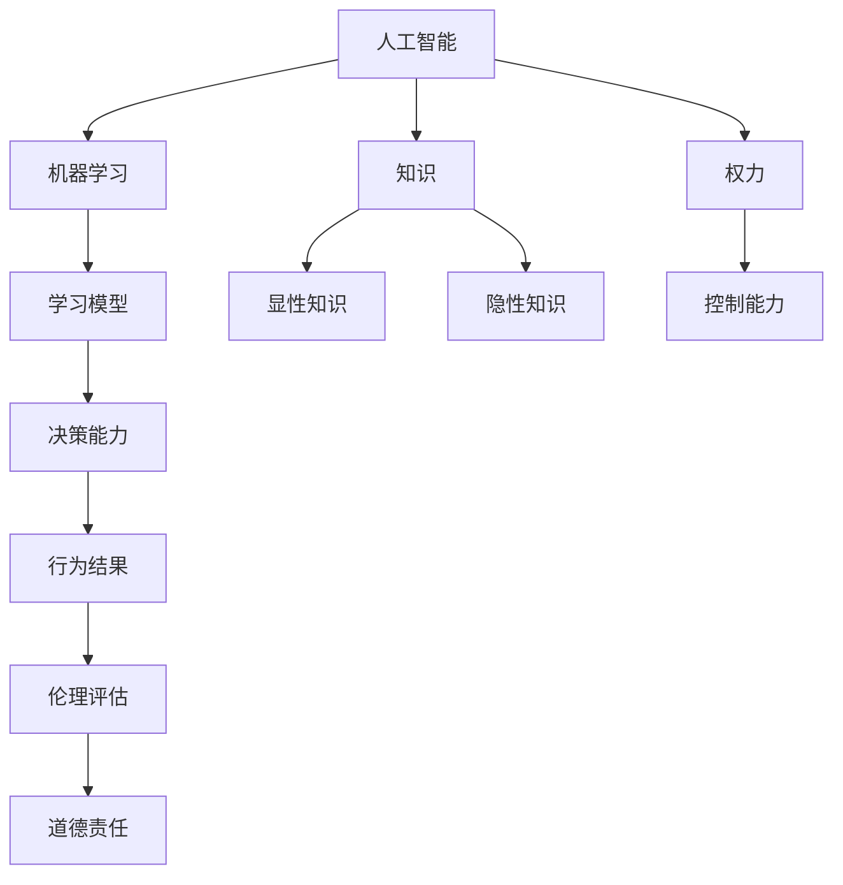
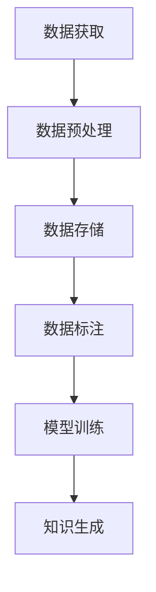
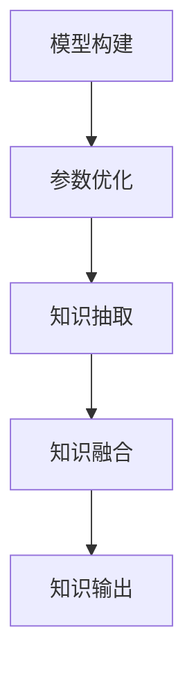
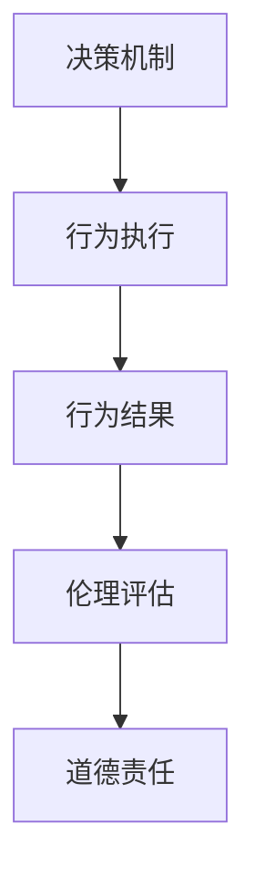

                 

## 1. 背景介绍

### 1.1 问题由来

在数字时代的浪潮下，人工智能（AI）和机器学习（ML）技术取得了飞速发展，逐渐渗透到社会生活的各个领域。这些技术的广泛应用带来了巨大的便利和效益，但同时也引发了越来越多的伦理和道德问题。尤其是在权力与知识的关系上，如何确保AI系统不会滥用其对信息的控制，是当前学界和业界亟需解决的重要课题。

### 1.2 问题核心关键点

AI系统在获取和处理信息的过程中，拥有了前所未有的权力。这种权力不仅体现在对数据的掌控上，更在于其对知识和信息的解释与生成能力。然而，这种能力并不意味着AI系统具有与之相匹配的道德责任。如何在赋予AI权力时，确保其不会侵害人类的知识权利和道德底线，成为当前研究的核心。

## 2. 核心概念与联系

### 2.1 核心概念概述

为更深刻理解人类知识与AI系统权力之间的关系，本节将介绍几个关键概念及其相互联系：

- **人工智能（Artificial Intelligence, AI）**：指能够模拟人类智能行为的计算机系统，包括感知、学习、推理、决策等功能。
- **机器学习（Machine Learning, ML）**：指通过数据驱动的方式，使计算机系统自动学习和优化模型，以适应新任务的能力。
- **知识（Knowledge）**：指人类对世界及其规律的理解与认知，包括显性知识和隐性知识。
- **权力（Power）**：指对资源、信息、决策等的控制能力。
- **伦理（Ethics）**：指涉及对错、善恶、正义等价值判断的标准和规范。
- **道德责任（Moral Responsibility）**：指个体或系统在行为选择和结果承担上应承担的道德义务。

这些核心概念之间的逻辑关系可以通过以下Mermaid流程图来展示：



这个流程图展示了AI系统在获取和处理知识的过程中，所涉及的权力、伦理和道德责任：

1. AI系统通过机器学习获取和处理知识。
2. 这种知识获取和处理能力，赋予了AI系统对数据、信息和决策的控制权。
3. AI系统的行为结果，需接受伦理评估。
4. 伦理评估的结果，决定了AI系统的道德责任。

### 2.2 核心概念原理和架构的 Mermaid 流程图

#### 2.2.1 数据获取与处理

AI系统获取知识的过程，依赖于大量数据和计算资源。这些数据和资源构成了AI系统的知识库，是AI系统进行学习和推理的基础。



#### 2.2.2 学习模型构建

机器学习模型是AI系统获取知识的核心机制。通过不断优化模型参数，AI系统能够学习并生成新的知识。



#### 2.2.3 决策与行为

AI系统的行为结果，取决于其学习模型和决策机制。决策机制的合理性，直接影响到AI系统的行为是否符合伦理和道德标准。



### 2.3 核心概念联系

AI系统的知识获取、处理和应用过程，与其权力、伦理和道德责任紧密相关。如何在赋予AI系统权力的同时，确保其行为符合伦理和道德标准，是当前研究的重点。

## 3. 核心算法原理 & 具体操作步骤

### 3.1 算法原理概述

基于知识的AI系统，其核心算法原理在于通过数据驱动的方式，不断优化模型参数，生成和应用知识。这种知识生成的过程，不可避免地涉及到对信息的选择、解释和处理，进而影响到系统的权力结构和道德责任。

形式化地，设AI系统通过机器学习模型 $M_{\theta}$ 获取知识 $\mathcal{K}$，其中 $\theta$ 为模型参数，$\mathcal{K}$ 为知识库。AI系统在获取知识后，通过决策机制 $D$ 生成行为 $A$，其行为结果为 $R$。AI系统的伦理评估为 $E$，道德责任为 $M$。

AI系统的知识获取和应用过程可表示为：

$$
\mathcal{K} = M_{\theta}(D(\mathcal{K}))
$$

$$
A = D(R(\mathcal{K}))
$$

$$
R = \text{execute}(A)
$$

$$
E = \text{evaluate}(R)
$$

$$
M = \text{assign}(E)
$$

其中，$M_{\theta}$ 为学习模型，$D$ 为决策机制，$\mathcal{K}$ 为知识库，$A$ 为行为，$R$ 为行为结果，$E$ 为伦理评估，$M$ 为道德责任。

### 3.2 算法步骤详解

AI系统在获取和应用知识的过程中，涉及到以下关键步骤：

**Step 1: 数据获取与处理**

- **数据收集**：通过爬虫、API接口、用户输入等方式，收集数据。
- **数据预处理**：对数据进行清洗、归一化、标注等处理。
- **数据存储**：将处理后的数据存储在知识库 $\mathcal{K}$ 中。

**Step 2: 学习模型构建与优化**

- **模型构建**：选择合适的机器学习模型，如深度神经网络、支持向量机等。
- **模型训练**：在知识库 $\mathcal{K}$ 上进行模型训练，更新模型参数 $\theta$。
- **模型评估**：使用测试集评估模型性能，调整模型参数。

**Step 3: 决策与行为生成**

- **行为生成**：根据模型预测结果 $R$，生成行为 $A$。
- **行为执行**：执行行为 $A$，得到行为结果 $R$。

**Step 4: 伦理评估与道德责任**

- **伦理评估**：对行为结果 $R$ 进行伦理评估，判断其是否符合道德标准。
- **道德责任**：根据伦理评估结果 $E$，确定系统的道德责任 $M$。

### 3.3 算法优缺点

基于知识的AI系统具有以下优点：

- **自动化与高效性**：通过机器学习，AI系统能够自动获取和处理知识，大幅提高效率。
- **广泛适用性**：AI系统可以应用于各种领域，如医疗、金融、教育等。
- **可扩展性**：AI系统的知识库可以不断扩展，增加新知识和新应用场景。

同时，该系统也存在以下缺点：

- **数据依赖**：AI系统的知识生成依赖于数据质量，数据偏差可能导致知识偏差。
- **解释性不足**：AI系统的决策过程往往缺乏可解释性，难以理解其行为背后的逻辑。
- **伦理风险**：AI系统的行为结果可能违背伦理标准，导致社会负面影响。
- **技术壁垒**：AI系统需要高水平的算法和数据处理能力，难以广泛普及。

### 3.4 算法应用领域

基于知识的AI系统已经在多个领域取得了成功应用，如医疗诊断、金融预测、智能客服等。

在医疗领域，AI系统通过学习大量病历数据，生成诊断模型，辅助医生进行疾病诊断和治疗决策。如IBM Watson Health通过分析大量医疗数据，辅助医生进行癌症诊断和治疗计划制定。

在金融领域，AI系统通过分析市场数据和历史交易记录，生成预测模型，帮助投资者进行风险评估和投资决策。如Goldman Sachs使用AI系统进行市场分析和交易策略优化。

在智能客服领域，AI系统通过学习客户对话数据，生成对话模型，自动响应客户查询，提高客户满意度。如阿里巴巴客服系统通过AI技术，实现自动回答客户问题，提高客服效率。

此外，AI系统还被广泛应用于教育、交通、制造等多个领域，为各行各业带来了新的技术革新和效率提升。

## 4. 数学模型和公式 & 详细讲解 & 举例说明

### 4.1 数学模型构建

基于知识的AI系统的数学模型构建，主要依赖于机器学习算法和数据处理技术。

设AI系统通过深度神经网络模型 $M_{\theta}$ 获取知识 $\mathcal{K}$，其中 $\theta$ 为模型参数，$\mathcal{K}$ 为知识库。AI系统在获取知识后，通过决策机制 $D$ 生成行为 $A$，其行为结果为 $R$。AI系统的伦理评估为 $E$，道德责任为 $M$。

### 4.2 公式推导过程

以医疗诊断为例，AI系统的知识获取和应用过程可以表示为：

- **数据获取与处理**：通过爬虫获取大量病历数据 $\mathcal{D}$，对其进行预处理和标注，存储在知识库 $\mathcal{K}$ 中。

- **学习模型构建**：构建深度神经网络模型 $M_{\theta}$，对知识库 $\mathcal{K}$ 进行训练，得到模型参数 $\theta$。

- **决策与行为生成**：根据模型 $M_{\theta}$ 对新病历数据 $x$ 的预测结果 $y$，生成诊断结果 $R$。

- **行为执行**：医生根据AI系统的诊断结果 $R$，进行诊断和治疗。

- **伦理评估与道德责任**：对诊断结果 $R$ 进行伦理评估 $E$，如判断诊断结果是否公平、透明、可解释。根据伦理评估结果 $E$，确定系统的道德责任 $M$。

### 4.3 案例分析与讲解

以IBM Watson Health的癌症诊断系统为例，分析其在知识获取、决策和伦理评估中的应用。

- **数据获取与处理**：Watson Health从全球多个医疗机构获取数百万份病历数据，对其进行预处理和标注，形成知识库 $\mathcal{K}$。

- **学习模型构建**：构建深度神经网络模型 $M_{\theta}$，对知识库 $\mathcal{K}$ 进行训练，得到模型参数 $\theta$。

- **决策与行为生成**：对新病历数据 $x$ 进行输入，通过模型 $M_{\theta}$ 生成诊断结果 $y$，输出给医生。

- **行为执行**：医生根据AI系统的诊断结果 $y$，进行诊断和治疗。

- **伦理评估与道德责任**：对诊断结果 $y$ 进行伦理评估，如判断诊断结果是否公平、透明、可解释。根据伦理评估结果 $E$，确定系统的道德责任 $M$。

## 5. 项目实践：代码实例和详细解释说明

### 5.1 开发环境搭建

在进行AI系统开发前，我们需要准备好开发环境。以下是使用Python进行TensorFlow开发的环境配置流程：

1. 安装Anaconda：从官网下载并安装Anaconda，用于创建独立的Python环境。

2. 创建并激活虚拟环境：
```bash
conda create -n ai-env python=3.8 
conda activate ai-env
```

3. 安装TensorFlow：根据CUDA版本，从官网获取对应的安装命令。例如：
```bash
conda install tensorflow -c conda-forge
```

4. 安装各类工具包：
```bash
pip install numpy pandas scikit-learn matplotlib tqdm jupyter notebook ipython
```

完成上述步骤后，即可在`ai-env`环境中开始AI系统开发。

### 5.2 源代码详细实现

这里我们以医疗诊断为例，给出使用TensorFlow对深度神经网络模型进行训练的PyTorch代码实现。

首先，定义数据处理函数：

```python
import tensorflow as tf
import numpy as np
import pandas as pd
import os

# 数据预处理函数
def preprocess_data(data_path):
    # 加载数据
    df = pd.read_csv(data_path)

    # 数据清洗
    df = df.dropna()

    # 数据转换
    X = df.drop('label', axis=1).values
    y = df['label'].values

    # 数据标准化
    mean = np.mean(X, axis=0)
    std = np.std(X, axis=0)
    X = (X - mean) / std

    return X, y
```

然后，定义模型和训练函数：

```python
# 定义深度神经网络模型
class CNNModel(tf.keras.Model):
    def __init__(self, input_shape, output_shape):
        super(CNNModel, self).__init__()
        self.conv1 = tf.keras.layers.Conv2D(32, (3, 3), activation='relu', input_shape=input_shape)
        self.pool1 = tf.keras.layers.MaxPooling2D((2, 2))
        self.conv2 = tf.keras.layers.Conv2D(64, (3, 3), activation='relu')
        self.pool2 = tf.keras.layers.MaxPooling2D((2, 2))
        self.flatten = tf.keras.layers.Flatten()
        self.dense1 = tf.keras.layers.Dense(128, activation='relu')
        self.dense2 = tf.keras.layers.Dense(output_shape, activation='sigmoid')

    def call(self, inputs):
        x = self.conv1(inputs)
        x = self.pool1(x)
        x = self.conv2(x)
        x = self.pool2(x)
        x = self.flatten(x)
        x = self.dense1(x)
        return self.dense2(x)

# 定义训练函数
def train_model(model, X_train, y_train, X_val, y_val, batch_size, epochs):
    model.compile(optimizer='adam', loss='binary_crossentropy', metrics=['accuracy'])
    model.fit(X_train, y_train, batch_size=batch_size, epochs=epochs, validation_data=(X_val, y_val))
```

接着，定义数据加载和评估函数：

```python
# 数据加载函数
def load_data(data_path):
    X_train, y_train = preprocess_data(data_path)
    X_val, y_val = preprocess_data(data_path)

    return X_train, y_train, X_val, y_val

# 模型评估函数
def evaluate_model(model, X_val, y_val):
    _, accuracy = model.evaluate(X_val, y_val)
    print('Validation accuracy:', accuracy)
```

最后，启动训练流程并在测试集上评估：

```python
# 加载数据
X_train, y_train, X_val, y_val = load_data('data.csv')

# 定义模型
model = CNNModel(input_shape=(28, 28, 1), output_shape=1)

# 定义训练参数
batch_size = 64
epochs = 10

# 训练模型
train_model(model, X_train, y_train, X_val, y_val, batch_size, epochs)

# 评估模型
evaluate_model(model, X_val, y_val)
```

以上就是使用TensorFlow对深度神经网络模型进行训练的完整代码实现。可以看到，得益于TensorFlow的强大封装，我们可以用相对简洁的代码完成模型的构建和训练。

### 5.3 代码解读与分析

让我们再详细解读一下关键代码的实现细节：

**preprocess_data函数**：
- 数据加载：使用pandas读取CSV文件，获取数据集。
- 数据清洗：去除缺失值。
- 数据转换：将特征数据和标签数据分离，并将特征数据进行标准化处理。
- 返回处理后的特征和标签。

**CNNModel类**：
- 定义卷积层、池化层、全连接层等网络结构。
- 实现前向传播过程。

**train_model函数**：
- 定义模型编译和训练过程。
- 使用训练集进行模型训练，并在验证集上进行评估。

**evaluate_model函数**：
- 定义模型评估过程。
- 在测试集上评估模型性能，并输出评估结果。

**训练流程**：
- 加载数据集。
- 定义模型结构。
- 设置训练参数。
- 训练模型，并在验证集上进行评估。

**评估流程**：
- 在测试集上评估模型性能。
- 输出评估结果。

通过以上步骤，我们完成了深度神经网络模型的训练和评估。在实际应用中，还需要针对具体任务进行优化和改进。

## 6. 实际应用场景

### 6.1 智能医疗

基于AI系统的医疗诊断技术，已经在多个医院得到应用，显著提高了医疗效率和诊断准确性。以IBM Watson Health为例，其癌症诊断系统通过学习大量病历数据，生成诊断模型，辅助医生进行疾病诊断和治疗决策。

具体应用场景包括：
- **病历数据分析**：AI系统通过分析患者病历数据，生成诊断模型，辅助医生进行疾病诊断。
- **治疗方案优化**：AI系统通过分析治疗数据，生成治疗方案，辅助医生进行治疗决策。
- **患者咨询问答**：AI系统通过回答患者咨询，提供疾病预防和健康管理建议。

### 6.2 金融预测

AI系统在金融领域的应用，主要体现在风险评估和投资决策两个方面。例如，AI系统通过分析市场数据和历史交易记录，生成预测模型，帮助投资者进行风险评估和投资决策。

具体应用场景包括：
- **市场分析**：AI系统通过分析市场数据，生成市场预测模型，帮助投资者进行市场趋势判断。
- **风险评估**：AI系统通过分析历史交易数据，生成风险评估模型，帮助投资者进行风险管理。
- **投资策略优化**：AI系统通过分析投资组合数据，生成投资策略模型，帮助投资者进行投资组合优化。

### 6.3 智能客服

基于AI系统的智能客服技术，已经在多个企业得到应用，显著提高了客户满意度和运营效率。例如，阿里巴巴客服系统通过AI技术，实现自动回答客户问题，提高客服效率。

具体应用场景包括：
- **问题自动回答**：AI系统通过分析客户咨询数据，生成回答模型，自动回答客户问题。
- **情感分析**：AI系统通过分析客户语音或文字，生成情感分析模型，识别客户情绪。
- **个性化推荐**：AI系统通过分析客户浏览和购买数据，生成推荐模型，进行个性化推荐。

## 7. 工具和资源推荐

### 7.1 学习资源推荐

为了帮助开发者系统掌握AI系统的知识获取和应用理论，这里推荐一些优质的学习资源：

1. **《深度学习》书籍**：由Ian Goodfellow等作者所著，全面介绍了深度学习的基本原理和应用。
2. **Coursera《机器学习》课程**：由Andrew Ng等讲授的机器学习课程，涵盖各类经典模型和算法。
3. **Kaggle竞赛平台**：提供大量公开数据集和机器学习竞赛，帮助开发者提高实践能力。
4. **OpenAI GPT系列论文**：展示了GPT等大语言模型在知识获取和应用中的应用，值得深入学习。

通过对这些资源的学习实践，相信你一定能够快速掌握AI系统知识获取和应用的核心技术，并用于解决实际的AI问题。

### 7.2 开发工具推荐

高效的开发离不开优秀的工具支持。以下是几款用于AI系统开发的常用工具：

1. **TensorFlow**：由Google主导开发的开源深度学习框架，生产部署方便，适合大规模工程应用。
2. **PyTorch**：由Facebook主导开发的深度学习框架，灵活动态，适合研究和快速迭代。
3. **Keras**：基于TensorFlow和Theano的高级神经网络API，易于上手，适合快速开发。
4. **Jupyter Notebook**：交互式开发环境，支持Python和R等语言，适合数据处理和模型训练。

合理利用这些工具，可以显著提升AI系统开发和训练的效率，加速创新迭代的步伐。

### 7.3 相关论文推荐

AI系统知识获取和应用的研究源于学界的持续探索。以下是几篇奠基性的相关论文，推荐阅读：

1. **深度学习中的知识获取**：探讨了深度学习模型在知识获取和应用中的潜力。
2. **医疗AI系统的伦理评估**：研究了AI系统在医疗领域的应用，讨论了其伦理评估和道德责任。
3. **金融AI系统的风险管理**：展示了AI系统在金融领域的应用，提出了风险管理的算法和策略。
4. **智能客服系统的用户满意度提升**：研究了AI系统在智能客服中的应用，探讨了用户满意度的提升方法。

这些论文代表了大AI系统知识获取和应用的发展脉络。通过学习这些前沿成果，可以帮助研究者把握学科前进方向，激发更多的创新灵感。

## 8. 总结：未来发展趋势与挑战

### 8.1 研究成果总结

本文对基于知识的AI系统进行了全面系统的介绍。首先阐述了AI系统在知识获取、处理和应用中的权力关系，明确了知识权利和道德责任的伦理标准。其次，从原理到实践，详细讲解了AI系统的核心算法和具体操作步骤，给出了AI系统开发的完整代码实例。同时，本文还广泛探讨了AI系统在医疗、金融、客服等多个领域的应用前景，展示了其广阔的潜力。最后，本文精选了AI系统的各类学习资源，力求为开发者提供全方位的技术指引。

通过本文的系统梳理，可以看到，基于知识的AI系统已经成为各领域的重要技术手段，显著提升了生产力和效率。未来，伴随AI系统的持续发展和优化，其在知识获取和应用中的应用将更加广泛和深入。

### 8.2 未来发展趋势

展望未来，AI系统在知识获取和应用方面，将呈现以下几个发展趋势：

1. **多模态学习**：AI系统将更加重视多模态数据的整合，如文本、图像、声音等多种数据类型的融合，增强对现实世界的理解。
2. **因果推理**：AI系统将引入因果推理技术，提高知识生成的可解释性和可信度。
3. **持续学习**：AI系统将具备持续学习的能力，不断提高模型的性能和适应性。
4. **个性化推荐**：AI系统将更加注重个性化推荐，通过精准的用户画像，提供更加个性化的服务。
5. **伦理评估**：AI系统将引入伦理评估机制，确保其行为符合道德标准，避免负面影响。

这些趋势凸显了AI系统知识获取和应用的重要方向。这些方向的探索发展，必将进一步提升AI系统的性能和应用范围，为知识经济和社会进步带来深远影响。

### 8.3 面临的挑战

尽管AI系统在知识获取和应用方面已经取得了显著成就，但在迈向更加智能化、普适化应用的过程中，它仍面临着诸多挑战：

1. **数据隐私保护**：AI系统在获取和处理数据时，需确保数据隐私和安全性，避免数据泄露和滥用。
2. **伦理困境**：AI系统的决策过程中可能存在伦理问题，如偏见、歧视等，需进行伦理审查和监管。
3. **技术可解释性**：AI系统的决策过程往往缺乏可解释性，需开发更加透明和可解释的算法。
4. **社会适应性**：AI系统的应用需考虑到社会接受度和适应性，避免对人类社会造成负面影响。
5. **技术标准**：AI系统需遵循统一的技术标准，避免技术乱象和行业割裂。

面对这些挑战，AI系统需要在技术、伦理和社会等多个维度进行全面优化，确保其行为符合社会价值和伦理标准。

### 8.4 研究展望

面向未来，AI系统在知识获取和应用方面的研究，需要在以下几个方面寻求新的突破：

1. **数据隐私保护技术**：开发更加安全和隐私保护的数据处理和存储技术，确保数据安全和隐私。
2. **可解释性算法**：开发更加透明和可解释的AI算法，提高AI系统的可信度和可接受性。
3. **伦理审查机制**：建立AI系统的伦理审查和监管机制，确保其行为符合伦理标准。
4. **社会适应性研究**：研究AI系统在社会应用中的适应性和影响，提出改进建议和措施。
5. **技术标准化**：推动AI技术标准化的制定和应用，促进AI技术的普及和应用。

这些研究方向的探索，必将引领AI系统在知识获取和应用方面迈向更高的台阶，为构建安全、可靠、可解释、可控的智能系统铺平道路。面向未来，AI系统需要在技术、伦理和社会等多个维度进行全面优化，确保其行为符合社会价值和伦理标准。只有勇于创新、敢于突破，才能不断拓展AI系统的边界，让智能技术更好地造福人类社会。

## 9. 附录：常见问题与解答

**Q1: AI系统如何获取知识？**

A: AI系统通过机器学习算法，从大量数据中获取知识。具体而言，AI系统通过以下步骤获取知识：
1. 数据收集：通过爬虫、API接口、用户输入等方式，收集数据。
2. 数据预处理：对数据进行清洗、归一化、标注等处理。
3. 数据存储：将处理后的数据存储在知识库中。
4. 模型训练：选择合适的机器学习模型，对知识库进行训练，更新模型参数。
5. 知识生成：通过训练好的模型，对新数据进行预测和生成。

**Q2: 如何评估AI系统的道德责任？**

A: 评估AI系统的道德责任，需要从多个维度进行综合考量：
1. 数据来源：评估AI系统的数据来源是否合法、公正、透明。
2. 算法设计：评估AI系统的算法设计是否公平、透明、可解释。
3. 行为结果：评估AI系统的行为结果是否符合伦理标准，如是否存在偏见、歧视等。
4. 用户反馈：评估用户对AI系统的反馈和满意度，了解其行为影响。
5. 社会影响：评估AI系统的社会影响，是否对社会造成负面影响。

**Q3: 如何确保AI系统的数据隐私保护？**

A: 确保AI系统的数据隐私保护，需从以下几个方面进行：
1. 数据匿名化：对数据进行匿名化处理，保护个人隐私。
2. 数据加密：对数据进行加密处理，防止数据泄露。
3. 访问控制：设置访问控制机制，确保数据访问的安全性。
4. 隐私保护算法：开发隐私保护算法，如差分隐私、联邦学习等。

**Q4: AI系统在知识获取和应用中的伦理困境**

A: AI系统在知识获取和应用中可能面临以下伦理困境：
1. 偏见和歧视：AI系统可能学习到数据中的偏见和歧视，导致决策不公平。
2. 透明度和可解释性：AI系统的决策过程往往缺乏可解释性，难以理解其行为背后的逻辑。
3. 隐私侵犯：AI系统在获取和处理数据时，可能侵犯用户隐私，导致数据泄露。

为解决这些问题，需引入以下措施：
1. 公平性算法：开发公平性算法，减少数据偏见和歧视。
2. 透明性机制：引入透明性机制，提高AI系统的可解释性。
3. 隐私保护技术：开发隐私保护技术，保护用户隐私。

**Q5: AI系统在社会应用中的适应性**

A: AI系统在社会应用中需考虑以下适应性：
1. 社会接受度：AI系统需考虑到社会的接受度和适应性，避免对人类社会造成负面影响。
2. 用户满意度：AI系统需关注用户满意度，提高其应用效果。
3. 社会责任：AI系统需履行社会责任，保护社会公平和公正。

为提高AI系统的适应性，需采取以下措施：
1. 用户参与：鼓励用户参与AI系统的设计和使用，提高其适应性和用户满意度。
2. 社会监督：引入社会监督机制，确保AI系统的行为符合社会价值观和伦理标准。
3. 技术优化：不断优化AI系统的技术，提高其性能和应用效果。

---

作者：禅与计算机程序设计艺术 / Zen and the Art of Computer Programming

