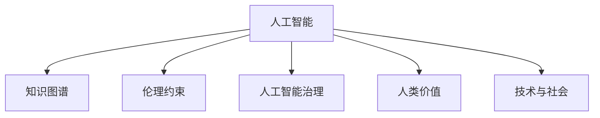

                 

# 人类的知识与道德：在科技面前

> 关键词：人工智能,知识图谱,道德伦理,人工智能治理,人类价值,技术与社会

## 1. 背景介绍

### 1.1 问题由来

随着人工智能技术的迅猛发展，人类正步入一个由机器智能辅助驱动的崭新时代。无论是无人驾驶、智能制造、金融科技，还是健康医疗、教育娱乐，人工智能的应用已经渗透到社会的各个角落。然而，随之而来的是一系列前所未有的挑战，尤其是人工智能在处理人类价值观念、伦理道德方面，呈现出的复杂性和不确定性，引发了广泛的社会关注和讨论。

在当前的技术浪潮中，如何让AI技术更好地服务于人类，既能发挥其强大的效能，又能在伦理道德层面得到合理的规制，成为我们亟需思考和解决的问题。这一挑战的根源在于，AI技术的智能化水平不断提升，但其内在的运行机制和决策逻辑却缺乏足够的透明度和可解释性，难以完全符合人类的价值标准和伦理准则。

### 1.2 问题核心关键点

要解答上述问题，需要从以下几个核心关键点进行探讨：

1. **知识图谱的构建与应用**：知识图谱作为一种结构化、语义化的知识表示方法，能够帮助机器理解和整合各类知识，辅助其进行复杂推理和决策。然而，知识图谱的构建并非易事，需要严格遵循伦理道德原则，确保数据来源和内容的质量和公正性。

2. **人工智能的伦理约束**：人工智能系统在运行过程中，应充分考虑其决策的伦理合理性，避免产生歧视性、有害性等不良影响。伦理约束的制定和实施，需依赖跨学科的研究和多方利益相关者的协作。

3. **人工智能的治理机制**：为了确保AI技术的健康发展，需建立完善的治理机制，对AI技术的应用进行监管和规范。这包括技术标准的制定、法律法规的完善、行业自律的推动等多个方面。

4. **人类与AI的协作模式**：在AI技术普及应用的过程中，如何构建人与AI的良性互动关系，发挥各自的优势，提升整体社会的福祉，是一个亟需研究和探索的方向。

5. **技术与社会价值的协同**：在技术进步的同时，我们应关注AI技术对社会价值和人文精神的潜在影响，确保技术进步与人文价值的和谐共存。

以上关键点共同构成了在科技面前，人类知识与道德的复杂关系，需要我们进行深入的探讨和分析。

## 2. 核心概念与联系

### 2.1 核心概念概述

为更好地理解AI技术的伦理道德问题，本节将介绍几个核心概念：

1. **人工智能(AI)**：指通过模拟人类智能行为，实现信息处理、决策支持、自然语言理解等功能的计算机技术。

2. **知识图谱(Knowledge Graph)**：一种语义化的知识表示方法，通过图结构化描述实体、属性和关系，支持高效的知识推理和信息整合。

3. **伦理约束(Ethical Constraints)**：对AI技术应用过程中应遵循的伦理规范和原则，如隐私保护、公平性、透明性等。

4. **人工智能治理(AI Governance)**：对AI技术的应用进行规范、监督和指导的一系列制度和流程，确保AI技术在伦理道德框架下运行。

5. **人类价值(Human Values)**：指人类社会基于道德、文化、伦理等因素所形成的价值观念和行为准则。

6. **技术与社会(Society & Technology)**：探讨技术发展对社会结构、文化、道德等方面的影响，及其对技术创新的反作用。

这些核心概念之间的逻辑关系可以通过以下Mermaid流程图来展示：



这个流程图展示了大语言模型和微调的核心概念及其之间的关系：

1. 人工智能通过知识图谱和伦理约束，获取丰富知识并遵循道德规范。
2. 知识图谱和伦理约束辅助人工智能的决策过程。
3. 人工智能治理确保人工智能在伦理道德框架下运行。
4. 人类价值和技术与社会互动，共同影响人工智能的发展。

## 3. 核心算法原理 & 具体操作步骤

### 3.1 算法原理概述

在讨论伦理道德问题时，我们首先应理解人工智能的决策机制。

人工智能系统通过大量的数据训练和复杂的网络结构，学习到一系列的特征和规则，并在新的输入数据上应用这些规则，进行预测、分类或生成等任务。其决策过程通常涉及以下步骤：

1. **数据预处理**：清洗、整理、格式化数据，确保输入数据的质量和一致性。
2. **特征提取**：利用算法从数据中提取关键特征，构建特征向量。
3. **模型训练**：使用机器学习算法在训练集上训练模型，调整参数，优化性能。
4. **模型评估**：在验证集或测试集上评估模型性能，选择最优模型。
5. **模型部署**：将训练好的模型应用于实际任务，进行推理或预测。

### 3.2 算法步骤详解

在实际操作中，针对AI系统的伦理道德问题，可以采用以下步骤：

**Step 1: 伦理审查与设计**

1. **数据审查**：确保数据来源合法，内容不含有害信息，避免歧视和偏见。
2. **伦理设计**：在算法设计和开发过程中，融入伦理考虑，如隐私保护、公平性、透明性等。

**Step 2: 知识图谱构建**

1. **数据收集**：收集领域相关的知识数据，如文本、图像、声音等。
2. **数据清洗**：去除噪音和冗余数据，确保数据质量。
3. **知识建模**：使用知识图谱框架，构建实体、属性和关系的图结构。
4. **图谱更新**：根据新数据和新知识，动态更新和维护知识图谱。

**Step 3: 模型训练与评估**

1. **训练目标设定**：设定模型训练的目标和性能指标。
2. **模型训练**：使用训练数据和优化算法，训练AI模型。
3. **模型评估**：在验证集或测试集上评估模型性能，选择最优模型。
4. **性能调整**：根据评估结果，调整模型参数，优化性能。

**Step 4: 模型部署与监控**

1. **模型部署**：将训练好的模型应用于实际任务，进行推理或预测。
2. **监控与评估**：实时监控AI模型的运行状态和性能，评估其伦理合规性。
3. **反馈机制**：建立反馈机制，收集用户反馈，持续改进模型。

### 3.3 算法优缺点

采用知识图谱和伦理约束构建AI系统的决策机制，具有以下优点：

1. **知识整合能力**：知识图谱能够帮助AI系统整合和理解各类知识，提高决策的准确性和深度。
2. **伦理保障**：伦理约束可以指导AI系统的设计和使用，避免伦理道德问题的发生。
3. **可解释性**：知识图谱和伦理约束提供了可解释的决策依据，提高了AI系统的透明性。

然而，这一方法也存在一定的缺点：

1. **构建复杂**：知识图谱的构建和维护需要大量时间和资源，且需要跨学科合作。
2. **数据依赖**：数据质量对知识图谱的构建至关重要，数据的偏见可能导致模型的歧视性。
3. **伦理争议**：伦理约束的制定和实施存在争议，难以达成一致。
4. **动态适应性差**：知识图谱的构建和更新速度较慢，难以快速适应新的应用场景。

### 3.4 算法应用领域

知识图谱和伦理约束在大数据、智能推荐、金融风控、智能客服等领域中，有着广泛的应用。例如：

1. **大数据分析**：利用知识图谱进行数据挖掘和分析，辅助决策支持。
2. **智能推荐系统**：通过构建用户、商品、行为等知识图谱，提供个性化的推荐服务。
3. **金融风险控制**：使用知识图谱进行信贷风险评估和信用评分，辅助风控决策。
4. **智能客服**：通过构建对话知识图谱，提高客服系统的自然语言理解和生成能力。

## 4. 数学模型和公式 & 详细讲解  
### 4.1 数学模型构建

知识图谱的构建通常使用基于图的数据模型，如三元组模型、分布式图模型等。这里以三元组模型为例，构建知识图谱的数学模型：

设知识图谱为G=(V,E)，其中V表示节点集合，E表示边集合。每个节点表示一个实体或属性，边表示实体之间的关系。对于三元组模型，可以定义如下公式：

$$
G = \{(R^i, E^i, A^i) \mid i=1,2,\ldots,n\}
$$

其中，$R^i$表示第i个实体，$E^i$表示第i个边，$A^i$表示第i个属性。

### 4.2 公式推导过程

对于知识图谱中的边和属性，可以构建如下矩阵表示：

$$
E = \{(E^i, \vec{A}^i) \mid i=1,2,\ldots,n\}
$$

其中，$\vec{A}^i$表示第i个实体的属性向量。

在实际应用中，可以利用矩阵乘法和深度学习算法，对知识图谱进行训练和推理。例如，可以使用图神经网络(Graph Neural Networks, GNNs)对知识图谱进行嵌入和推理，其过程如下：

1. **节点嵌入**：使用GNNs对节点进行嵌入，生成低维的节点表示。
2. **边嵌入**：使用GNNs对边进行嵌入，生成低维的边表示。
3. **图嵌入**：结合节点嵌入和边嵌入，生成整个知识图谱的嵌入表示。

### 4.3 案例分析与讲解

以智能推荐系统为例，我们介绍知识图谱在推荐中的应用。

1. **数据收集**：收集用户行为数据、商品信息、社交关系等数据。
2. **数据清洗**：清洗和整理数据，去除噪音和冗余信息。
3. **知识建模**：构建用户、商品、行为等三元组知识图谱。
4. **图嵌入**：使用GNNs对知识图谱进行嵌入，生成用户和商品的嵌入表示。
5. **推荐模型**：利用嵌入表示和推荐算法，计算用户对商品的评分，进行推荐。

## 5. 项目实践：代码实例和详细解释说明

### 5.1 开发环境搭建

在进行知识图谱和伦理约束的研究开发时，需要搭建适合的环境。以下是使用Python进行PyTorch开发的环境配置流程：

1. 安装Anaconda：从官网下载并安装Anaconda，用于创建独立的Python环境。

2. 创建并激活虚拟环境：
```bash
conda create -n pytorch-env python=3.8 
conda activate pytorch-env
```

3. 安装PyTorch：根据CUDA版本，从官网获取对应的安装命令。例如：
```bash
conda install pytorch torchvision torchaudio cudatoolkit=11.1 -c pytorch -c conda-forge
```

4. 安装Transformer库：
```bash
pip install transformers
```

5. 安装各类工具包：
```bash
pip install numpy pandas scikit-learn matplotlib tqdm jupyter notebook ipython
```

完成上述步骤后，即可在`pytorch-env`环境中开始开发。

### 5.2 源代码详细实现

下面我们以构建基于知识图谱的推荐系统为例，给出使用Transformers库进行知识图谱嵌入和推荐模型训练的PyTorch代码实现。

首先，定义知识图谱的数据处理函数：

```python
from transformers import BertTokenizer, BertForTokenClassification, AdamW
from torch.utils.data import Dataset, DataLoader
import torch
import numpy as np

class KnowledgeGraphDataset(Dataset):
    def __init__(self, data):
        self.data = data
        
    def __len__(self):
        return len(self.data)
    
    def __getitem__(self, item):
        graph = self.data[item]
        nodes, edges = graph[0], graph[1]
        
        # 构建图神经网络需要的输入格式
        x = torch.tensor(nodes, dtype=torch.long).unsqueeze(1)
        y = torch.tensor(edges, dtype=torch.long).unsqueeze(1)
        
        return {'x': x, 'y': y}
        
# 构建知识图谱
graphs = [
    [([1, 2], [[1, 2], [2, 3]]),
     ([1, 2, 3], [[1, 2], [2, 3], [3, 1]])
]
dataset = KnowledgeGraphDataset(graphs)
```

然后，定义模型和优化器：

```python
from transformers import GNNEmbedding
from torch.nn import ParameterList

# 定义图神经网络模型
class GNNModel(nn.Module):
    def __init__(self, hidden_size):
        super(GNNModel, self).__init__()
        self.layers = ParameterList([GNNEmbedding(hidden_size) for _ in range(2)])
        
    def forward(self, x, y):
        for i in range(len(self.layers)):
            x = self.layers[i](x, y)
        return x

# 定义推荐模型
class RecommendationModel(nn.Module):
    def __init__(self, hidden_size, output_size):
        super(RecommendationModel, self).__init__()
        self.encoder = GNNModel(hidden_size)
        self.decoder = nn.Linear(hidden_size, output_size)
        
    def forward(self, x, y):
        x = self.encoder(x, y)
        x = self.decoder(x)
        return x
```

接着，定义训练和评估函数：

```python
from sklearn.metrics import accuracy_score

# 训练函数
def train_model(model, dataset, batch_size, optimizer, epochs):
    model.train()
    for epoch in range(epochs):
        dataloader = DataLoader(dataset, batch_size=batch_size, shuffle=True)
        for batch in dataloader:
            x, y = batch['x'], batch['y']
            optimizer.zero_grad()
            output = model(x, y)
            loss = F.mse_loss(output, y)
            loss.backward()
            optimizer.step()
        print(f"Epoch {epoch+1}, loss: {loss.item():.4f}")
        
# 评估函数
def evaluate_model(model, dataset, batch_size):
    model.eval()
    dataloader = DataLoader(dataset, batch_size=batch_size)
    with torch.no_grad():
        y_true = []
        y_pred = []
        for batch in dataloader:
            x, y = batch['x'], batch['y']
            output = model(x, y)
            y_pred.append(output.cpu().numpy())
            y_true.append(y.cpu().numpy())
        y_true = np.concatenate(y_true, axis=0)
        y_pred = np.concatenate(y_pred, axis=0)
        accuracy = accuracy_score(y_true, y_pred)
        print(f"Accuracy: {accuracy:.4f}")
```

最后，启动训练流程并在测试集上评估：

```python
hidden_size = 128
output_size = 10
epochs = 100
batch_size = 16

# 定义模型和优化器
model = RecommendationModel(hidden_size, output_size)
optimizer = AdamW(model.parameters(), lr=0.001)

# 训练模型
train_model(model, dataset, batch_size, optimizer, epochs)

# 评估模型
evaluate_model(model, dataset, batch_size)
```

以上就是使用PyTorch进行知识图谱嵌入和推荐模型训练的完整代码实现。可以看到，利用Transformers库和图神经网络，我们可以方便地实现基于知识图谱的推荐系统。

### 5.3 代码解读与分析

让我们再详细解读一下关键代码的实现细节：

**KnowledgeGraphDataset类**：
- `__init__`方法：初始化数据集。
- `__len__`方法：返回数据集的长度。
- `__getitem__`方法：对单个样本进行处理，将其转换为图神经网络需要的格式。

**GNNModel类**：
- 定义了图神经网络模型，包含两个GNNEmbedding层，用于对节点和边进行嵌入。
- `forward`方法：对输入进行前向传播，生成节点嵌入表示。

**RecommendationModel类**：
- 定义了推荐模型，包含一个GNNModel作为编码器，一个全连接层作为解码器。
- `forward`方法：对输入进行前向传播，生成推荐分数。

**训练函数train_model**：
- 在训练集上对模型进行梯度下降优化，更新模型参数。

**评估函数evaluate_model**：
- 在测试集上评估模型性能，输出准确率。

**训练流程**：
- 定义模型、优化器、训练集、验证集、超参数。
- 循环迭代，在训练集上进行模型训练。
- 在测试集上进行模型评估，输出最终结果。

可以看到，利用Transformers库和图神经网络，我们可以方便地实现基于知识图谱的推荐系统。这一技术有助于提高推荐系统的准确性和可解释性，同时能够辅助决策支持，提升业务效率。

当然，工业级的系统实现还需考虑更多因素，如模型的保存和部署、超参数的自动搜索、更灵活的任务适配层等。但核心的知识图谱构建与伦理约束技术基本与此类似。

## 6. 实际应用场景

### 6.1 智能推荐系统

基于知识图谱和伦理约束的智能推荐系统，已经广泛应用于电商、新闻、社交等多个领域。例如：

- **电商推荐**：通过知识图谱理解用户兴趣、商品属性，提供个性化的商品推荐。
- **新闻推荐**：构建用户、文章、标签等知识图谱，推荐符合用户喜好的新闻内容。
- **社交推荐**：理解用户社交关系，推荐用户感兴趣的朋友、文章等。

### 6.2 金融风险控制

在金融领域，知识图谱和伦理约束能够帮助金融机构识别和管理风险。例如：

- **信贷评估**：利用知识图谱进行客户信用评分，识别风险因素。
- **欺诈检测**：构建交易行为知识图谱，检测异常交易行为。
- **投资建议**：使用知识图谱进行市场分析，提供投资建议。

### 6.3 智能客服

智能客服系统利用知识图谱和伦理约束，提供更加精准和自然的客户服务。例如：

- **自然语言理解**：构建对话知识图谱，实现自然语言理解。
- **用户意图识别**：理解用户问题，提供准确的回答。
- **情感分析**：识别用户情感，提供个性化的服务。

## 7. 工具和资源推荐

### 7.1 学习资源推荐

为了帮助开发者系统掌握知识图谱和伦理约束的理论基础和实践技巧，这里推荐一些优质的学习资源：

1. **《知识图谱：概念与构建》**：介绍知识图谱的基本概念、构建方法和应用场景。
2. **《深度学习与人工智能伦理》**：探讨AI技术的伦理道德问题，提供实用的伦理约束设计指南。
3. **《人工智能治理手册》**：详细介绍AI技术的伦理治理机制和实践案例。
4. **《AI与人类价值》**：讨论AI技术对人类价值和文化的潜在影响。
5. **《社会与技术互动》**：分析技术发展对社会结构和文化的影响。

通过对这些资源的学习实践，相信你一定能够快速掌握知识图谱和伦理约束的精髓，并用于解决实际的NLP问题。

### 7.2 开发工具推荐

高效的开发离不开优秀的工具支持。以下是几款用于知识图谱和伦理约束研究的常用工具：

1. **GNN库**：如PyTorch Geometric、DGL等，提供了高效的图神经网络实现。
2. **知识图谱构建工具**：如Neo4j、RDF4J等，支持知识图谱的构建和管理。
3. **伦理约束工具**：如Ethos、ConText等，提供伦理约束的建模和评估。
4. **数据可视化工具**：如Gephi、Cytoscape等，用于知识图谱的可视化展示。
5. **模型训练平台**：如AWS SageMaker、Google Cloud AI等，支持大规模模型的训练和推理。

合理利用这些工具，可以显著提升知识图谱和伦理约束的研究开发效率，加快创新迭代的步伐。

### 7.3 相关论文推荐

知识图谱和伦理约束在大数据、智能推荐、金融风控、智能客服等领域中，有着广泛的应用。以下是几篇奠基性的相关论文，推荐阅读：

1. **《知识图谱：概念、构建与评估》**：介绍知识图谱的基本概念、构建方法和评估指标。
2. **《深度学习在智能推荐中的应用》**：探讨深度学习在推荐系统中的应用，包括知识图谱嵌入方法。
3. **《金融风险控制中的知识图谱应用》**：讨论知识图谱在金融风险控制中的应用。
4. **《智能客服系统中的知识图谱与伦理约束》**：探讨知识图谱在智能客服系统中的应用。
5. **《人工智能伦理与治理》**：探讨AI技术的伦理道德问题，提出伦理约束的设计与实施。

这些论文代表了大语言模型微调技术的发展脉络。通过学习这些前沿成果，可以帮助研究者把握学科前进方向，激发更多的创新灵感。

## 8. 总结：未来发展趋势与挑战

### 8.1 总结

本文对基于知识图谱和伦理约束的AI技术进行了全面系统的介绍。首先阐述了AI技术在处理伦理道德问题时的挑战和重要性，明确了知识图谱和伦理约束在其中的关键作用。其次，从原理到实践，详细讲解了知识图谱的构建方法、伦理约束的制定步骤和AI系统的开发流程，给出了知识图谱嵌入和推荐系统训练的完整代码实例。同时，本文还广泛探讨了知识图谱和伦理约束在推荐系统、金融风险控制、智能客服等多个行业领域的应用前景，展示了其强大的生命力和广阔的市场潜力。此外，本文精选了知识图谱和伦理约束的学习资源、开发工具和相关论文，力求为读者提供全方位的技术指引。

通过本文的系统梳理，可以看到，基于知识图谱和伦理约束的AI技术正在成为解决伦理道德问题的重要工具，其核心思想和方法已经广泛应用于多个领域。未来，伴随知识图谱的不断发展和伦理约束的深入研究，知识图谱和伦理约束必将在构建更加智能、公正、可信的AI系统中发挥越来越重要的作用。

### 8.2 未来发展趋势

展望未来，知识图谱和伦理约束技术将呈现以下几个发展趋势：

1. **知识图谱的自动化构建**：随着自动化技术的发展，知识图谱的构建将更加高效和精确，无需人工干预。
2. **伦理约束的智能化**：利用AI技术对伦理问题进行智能推理和决策，提高伦理约束的动态适应性。
3. **知识图谱的跨领域融合**：知识图谱将跨越不同领域和知识类型，实现多模态信息的融合，提升AI系统的理解和推理能力。
4. **伦理约束的多元化**：伦理约束将从单一的道德规范扩展到多样化的社会价值和利益诉求，提供更全面的伦理指导。
5. **AI系统的透明化和可解释性**：提高AI系统的透明性和可解释性，确保其决策过程符合伦理道德要求。

以上趋势凸显了知识图谱和伦理约束技术的广阔前景。这些方向的探索发展，必将进一步提升AI系统的性能和应用范围，为构建更加智能、公正、可信的AI系统铺平道路。

### 8.3 面临的挑战

尽管知识图谱和伦理约束技术已经取得了一定的成果，但在迈向更加智能化、普适化应用的过程中，仍面临诸多挑战：

1. **数据质量与多样性**：高质量、多样化的数据是知识图谱构建的基础，但数据获取和清洗过程复杂，难以保证数据质量。
2. **模型复杂度与效率**：知识图谱和伦理约束模型通常较为复杂，需要高效的算法和计算资源，难以在大规模数据上高效运行。
3. **伦理争议与规范**：伦理约束的制定和实施存在争议，难以达成一致，需要跨学科协作和广泛的社会参与。
4. **技术与伦理的平衡**：如何在技术进步的同时，保障伦理道德，避免技术滥用，需要持续的研究和监管。
5. **知识图谱的动态维护**：知识图谱需要持续更新，以适应新数据和新应用场景，但更新过程复杂，难以快速响应变化。

这些挑战需要我们从数据、模型、伦理等多个维度进行全面优化，才能更好地发挥知识图谱和伦理约束的作用。只有从整体上解决这些难题，才能让知识图谱和伦理约束技术在AI系统中真正发挥作用。

### 8.4 研究展望

面对知识图谱和伦理约束所面临的种种挑战，未来的研究需要在以下几个方面寻求新的突破：

1. **知识图谱的自动化构建与动态维护**：研究自动化知识图谱构建方法，提高构建效率和精度。开发动态知识图谱更新机制，快速响应数据变化。
2. **伦理约束的智能化与灵活性**：研究AI技术在伦理约束中的应用，提高伦理约束的动态适应性和智能化水平。
3. **知识图谱的多模态融合与跨领域应用**：研究知识图谱与图像、视频等多模态信息的融合，提升AI系统的理解和推理能力。
4. **伦理约束的框架与规范**：构建伦理约束的统一框架，制定跨领域伦理规范，促进伦理约束的跨学科协作和实施。
5. **知识图谱与伦理约束的协同优化**：研究知识图谱与伦理约束的协同优化方法，提高系统的整体性能和应用效果。

这些研究方向的探索，必将引领知识图谱和伦理约束技术迈向更高的台阶，为构建更加智能、公正、可信的AI系统提供新的理论和方法。面向未来，知识图谱和伦理约束技术还需要与其他人工智能技术进行更深入的融合，如知识表示、因果推理、强化学习等，多路径协同发力，共同推动自然语言理解和智能交互系统的进步。只有勇于创新、敢于突破，才能不断拓展知识图谱和伦理约束的边界，让智能技术更好地造福人类社会。

## 9. 附录：常见问题与解答

**Q1：知识图谱在实际应用中存在哪些问题？**

A: 知识图谱在实际应用中存在以下问题：

1. **数据获取困难**：高质量、多样化的数据获取困难，数据清洗和标注成本高。
2. **知识图谱构建复杂**：知识图谱的构建过程复杂，需要跨学科协作，难以自动化。
3. **动态适应性差**：知识图谱的更新和维护周期长，难以快速响应新数据和新应用场景。
4. **模型效率低**：知识图谱和伦理约束模型复杂，计算资源消耗大，难以在大规模数据上高效运行。

这些问题是知识图谱和伦理约束技术在实际应用中需要克服的难点。

**Q2：如何在知识图谱构建过程中避免偏见和歧视？**

A: 在知识图谱构建过程中，避免偏见和歧视的策略包括：

1. **数据来源多样化**：使用多种来源的数据，避免单一数据集带来的偏见。
2. **数据清洗与预处理**：对数据进行清洗和预处理，去除噪音和冗余信息，确保数据质量。
3. **构建对抗图谱**：构建对抗图谱，检测并修正知识图谱中的偏见和歧视。
4. **多视图融合**：使用多视图融合方法，综合不同来源的知识，减少单一视角的偏见。

这些策略可以帮助我们在构建知识图谱时，减少偏见和歧视的发生。

**Q3：如何在AI系统中引入伦理约束？**

A: 在AI系统中引入伦理约束的策略包括：

1. **设计伦理约束目标**：明确伦理约束的目标和指标，如隐私保护、公平性、透明性等。
2. **伦理约束模型设计**：在模型设计过程中，引入伦理约束，如公平性约束、隐私保护约束等。
3. **伦理约束的动态调整**：在模型运行过程中，实时监控和调整伦理约束，确保其适应性。
4. **伦理约束的透明度**：在模型输出过程中，提供透明化的伦理约束信息，帮助用户理解模型的决策过程。

这些策略可以帮助我们在AI系统中引入伦理约束，确保系统的运行符合伦理道德要求。

**Q4：如何评估知识图谱的性能？**

A: 知识图谱的性能评估可以从以下几个方面进行：

1. **知识覆盖率**：评估知识图谱对领域知识的覆盖程度，确保知识图谱的全面性。
2. **实体关系准确率**：评估实体关系描述的准确性，确保知识图谱的精确性。
3. **推理正确率**：评估知识图谱的推理能力，确保知识图谱的可信度。
4. **运行效率**：评估知识图谱的运行效率，确保知识图谱的实时性。

这些评估指标可以帮助我们全面了解知识图谱的性能，发现和改进其中的不足之处。

**Q5：如何应对知识图谱构建中的数据质量问题？**

A: 应对知识图谱构建中的数据质量问题，可以采取以下策略：

1. **数据清洗与预处理**：对原始数据进行清洗和预处理，去除噪音和冗余信息。
2. **数据增强**：使用数据增强技术，提高数据的多样性和完整性。
3. **数据融合**：利用多源数据融合技术，综合不同来源的数据，提高数据质量。
4. **模型优化**：使用先进的算法和技术，优化知识图谱构建的效率和精度。

这些策略可以帮助我们应对知识图谱构建中的数据质量问题，提升知识图谱的构建质量和性能。

**Q6：如何提升知识图谱与伦理约束的动态适应性？**

A: 提升知识图谱与伦理约束的动态适应性，可以采取以下策略：

1. **持续学习与更新**：在知识图谱和伦理约束构建过程中，引入持续学习机制，动态更新和优化模型。
2. **多领域融合**：将知识图谱和伦理约束应用于不同领域和任务，提高其跨领域适应性。
3. **可解释性与透明度**：提高知识图谱和伦理约束的可解释性和透明度，帮助用户理解其运行机制。

这些策略可以帮助我们提升知识图谱与伦理约束的动态适应性，使其能够更好地应对新数据和新应用场景。

---

作者：禅与计算机程序设计艺术 / Zen and the Art of Computer Programming

