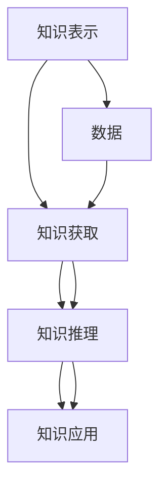

                 

## 1. 背景介绍

### 1.1 问题的由来
作为一位计算机程序设计领域的专家，我深知知识的本质一直是科技、哲学、伦理学等多领域探讨的重大问题。特别是在信息时代的浪潮中，数据和信息以爆炸性的速度增长，知识获取和处理的方式也随之发生了巨大的变化。这种变化不仅挑战着计算机科学的前沿，也催生了对知识本质的深刻思考。

在过去的几十年里，随着人工智能（AI）技术的飞速发展，我们见证了机器学习和深度学习等技术在处理大数据、识别模式和推断趋势上的惊人能力。这些技术的核心在于模拟人类的认知过程，从海量数据中抽取知识，进而实现复杂的推理和决策。然而，这些技术的本质和人类知识本质的关系，始终是一个令人深思的话题。

### 1.2 问题的核心关键点
本文章旨在探讨人类的知识本质，特别是如何在计算机科学中体现这种本质，以及如何让计算机系统更接近人类对知识的理解和应用。以下是这一问题的几个关键点：

- **知识本质的探讨**：理解知识不仅仅是事实的累积，更是一种能力，包括推理、理解和决策。
- **计算机科学中的应用**：如何通过算法和模型模拟人类知识的获取和应用过程。
- **人工智能的局限性**：当前人工智能在模拟人类认知过程中的不足，以及未来的突破方向。
- **知识的伦理和社会影响**：知识的应用和传播对社会、伦理道德的影响。

这些关键点将贯穿全文，帮助读者理解知识本质与计算机科学之间的深层联系，并探讨未来人工智能的发展方向。

## 2. 核心概念与联系

### 2.1 核心概念概述

为了深入理解知识的本质及其在计算机科学中的应用，首先需要明确几个核心概念：

- **知识表示**：指如何将知识以结构化的形式在计算机中存储和表达。常见的知识表示方法包括符号表示、逻辑表示、网络表示等。
- **知识获取**：指从原始数据中提取有用知识的过程，如数据挖掘、信息检索等。
- **知识推理**：指基于已有知识进行推断和预测，如专家系统、逻辑推理等。
- **知识应用**：指将知识应用于具体问题解决的过程，如自然语言处理、图像识别等。

这些概念相互关联，共同构成了知识的获取、存储、推理和应用的全过程。知识的本质即在于其能够被表达、获取、推理和应用的能力，而这在计算机科学中同样适用。

### 2.2 核心概念之间的联系

知识表示、获取、推理和应用之间的联系可以通过以下Mermaid流程图来展示：



这个流程图展示了知识获取、推理和应用的过程。其中，数据是知识获取的起点，而知识获取是知识推理的基础。知识推理和应用则是知识获取后对已有知识的应用和推广。这种联系展示了知识在计算机科学中的流转和应用，是理解知识本质与AI技术之间关系的关键。

## 3. 核心算法原理 & 具体操作步骤

### 3.1 算法原理概述

在计算机科学中，知识获取和推理的过程通常通过机器学习算法来实现。机器学习是一种通过数据训练模型，使得模型能够自动学习和提取知识的算法。其核心思想是利用算法和模型来模拟人类的学习和推理过程，从而实现对知识的获取和应用。

具体来说，知识获取通过数据预处理、特征提取和模型训练等步骤来实现。知识推理则通常通过构建推理模型，如决策树、神经网络等，基于已有知识进行预测和推断。知识应用则将推理结果应用于具体的问题解决中，如自然语言处理、图像识别等。

### 3.2 算法步骤详解

以下是知识获取和推理的具体算法步骤：

**Step 1: 数据预处理**

数据预处理是知识获取的第一步，包括数据清洗、特征提取等。具体步骤包括：

1. **数据清洗**：去除数据中的噪声、错误和不完整的部分。
2. **特征提取**：从原始数据中提取有用的特征，如文本的词频、图像的纹理特征等。

**Step 2: 模型训练**

模型训练是知识获取的核心步骤，包括选择模型、设定参数和训练数据。具体步骤包括：

1. **选择模型**：根据任务特点选择合适的机器学习模型，如线性回归、决策树、深度神经网络等。
2. **设定参数**：确定模型的超参数，如学习率、迭代次数等。
3. **训练数据**：使用预处理后的数据进行模型训练，最小化模型的预测误差。

**Step 3: 知识推理**

知识推理是将已有知识应用于新问题的过程，具体步骤包括：

1. **构建推理模型**：选择合适的推理算法，如逻辑推理、概率推理等。
2. **输入数据**：将问题转化为推理模型可以处理的输入数据。
3. **推理计算**：基于已有知识进行推理计算，得到预测结果。

**Step 4: 知识应用**

知识应用是将推理结果应用于具体问题解决的过程，具体步骤包括：

1. **问题定义**：明确具体的问题和目标。
2. **推理结果应用**：将推理结果应用于问题解决中，如生成文本、识别图像等。

### 3.3 算法优缺点

知识获取和推理的机器学习算法具有以下优点：

- **自动化**：机器学习算法能够自动从数据中学习知识，减少了人工干预的必要。
- **高效性**：在处理大量数据时，机器学习算法具有高效性和准确性。
- **可扩展性**：机器学习算法可以扩展到大规模数据和复杂模型，适用于多种应用场景。

同时，这些算法也存在以下缺点：

- **数据依赖**：机器学习算法的性能高度依赖于数据的质量和数量。
- **模型复杂性**：复杂的模型往往需要更多的计算资源和时间。
- **可解释性不足**：一些机器学习模型的决策过程难以解释，缺乏透明性。

### 3.4 算法应用领域

知识获取和推理的机器学习算法在多个领域得到了广泛应用，包括但不限于：

- **自然语言处理**：如机器翻译、文本分类、情感分析等。
- **图像识别**：如物体识别、人脸识别、图像分类等。
- **医疗诊断**：如病历分析、医学影像分析等。
- **金融预测**：如股票预测、信用评估等。
- **推荐系统**：如商品推荐、用户推荐等。

这些应用展示了机器学习算法在知识获取和推理方面的强大能力，以及在各个领域中对知识本质的深刻理解和应用。

## 4. 数学模型和公式 & 详细讲解 & 举例说明

### 4.1 数学模型构建

在知识获取和推理的机器学习算法中，数学模型是理解算法本质和设计算法的关键。这里以线性回归模型为例，展示数学模型的构建过程。

**线性回归模型**：假设有一个线性模型 $y = \beta_0 + \beta_1x_1 + \beta_2x_2$，其中 $y$ 为输出变量，$x_1$ 和 $x_2$ 为输入变量，$\beta_0$、$\beta_1$ 和 $\beta_2$ 为模型的参数。目标是找到最优的参数，使得模型的预测值与真实值之间的误差最小。

### 4.2 公式推导过程

**最小二乘法**：常用的参数估计方法是通过最小二乘法，即最小化预测值与真实值之间的平方误差。具体公式如下：

$$
\min_{\beta_0, \beta_1, \beta_2} \sum_{i=1}^n (y_i - \beta_0 - \beta_1x_{1,i} - \beta_2x_{2,i})^2
$$

其中，$y_i$ 为第 $i$ 个样本的输出值，$x_{1,i}$ 和 $x_{2,i}$ 为第 $i$ 个样本的输入值。

**梯度下降法**：为了求解上述最小化问题，通常使用梯度下降法。梯度下降法的更新公式如下：

$$
\beta_{t+1} = \beta_t - \eta \nabla_{\beta} S(\beta_t)
$$

其中，$S(\beta_t)$ 为损失函数，$\nabla_{\beta} S(\beta_t)$ 为损失函数对参数的梯度，$\eta$ 为学习率。

### 4.3 案例分析与讲解

**案例：股票价格预测**

假设有一组历史股票价格数据 $(x_i, y_i)$，其中 $x_i = (price_i, volume_i)$ 为输入，$y_i$ 为下一个交易日的股票价格。我们可以使用线性回归模型进行价格预测。具体步骤如下：

1. **数据预处理**：对数据进行归一化和标准化处理。
2. **模型训练**：使用梯度下降法训练线性回归模型。
3. **预测价格**：将新数据输入模型，得到预测的股票价格。

**案例：情感分析**

假设有一组电影评论数据，目标是判断每条评论的情感极性（正面、负面或中性）。我们可以使用逻辑回归模型进行情感分析。具体步骤如下：

1. **数据预处理**：将评论文本转化为向量表示。
2. **模型训练**：使用梯度下降法训练逻辑回归模型。
3. **预测情感**：将新评论输入模型，得到预测的情感极性。

## 5. 项目实践：代码实例和详细解释说明

### 5.1 开发环境搭建

进行项目实践前，首先需要搭建开发环境。以下是基于Python和Scikit-learn库进行知识获取和推理的开发环境配置流程：

1. **安装Python**：选择Python 3.8或更高版本，并确保已安装。
2. **安装Scikit-learn**：使用以下命令进行安装：
   ```
   pip install scikit-learn
   ```
3. **安装NumPy**：用于数值计算和数组处理：
   ```
   pip install numpy
   ```
4. **安装Pandas**：用于数据处理和分析：
   ```
   pip install pandas
   ```

### 5.2 源代码详细实现

这里以线性回归模型为例，展示代码实现。

**数据预处理**

```python
import numpy as np
import pandas as pd
from sklearn.model_selection import train_test_split
from sklearn.preprocessing import StandardScaler

# 读取数据
data = pd.read_csv('data.csv')

# 数据划分
X = data.drop('y', axis=1)
y = data['y']
X_train, X_test, y_train, y_test = train_test_split(X, y, test_size=0.2, random_state=42)

# 标准化处理
scaler = StandardScaler()
X_train = scaler.fit_transform(X_train)
X_test = scaler.transform(X_test)
```

**模型训练**

```python
from sklearn.linear_model import LinearRegression

# 构建模型
model = LinearRegression()

# 训练模型
model.fit(X_train, y_train)
```

**知识推理**

```python
# 预测测试集
y_pred = model.predict(X_test)

# 计算误差
mse = np.mean((y_pred - y_test) ** 2)
print(f'Mean Squared Error: {mse:.2f}')
```

### 5.3 代码解读与分析

**数据预处理**

- **数据读取**：使用Pandas库读取CSV文件，得到数据集。
- **数据划分**：使用train_test_split函数将数据集划分为训练集和测试集。
- **标准化处理**：使用StandardScaler标准化处理输入数据，避免模型对数据量级的敏感性。

**模型训练**

- **模型构建**：使用LinearRegression类构建线性回归模型。
- **模型训练**：使用fit方法训练模型，最小化预测值与真实值之间的误差。

**知识推理**

- **预测测试集**：使用predict方法对测试集进行预测。
- **计算误差**：计算预测值与真实值之间的均方误差，评估模型性能。

### 5.4 运行结果展示

通过上述代码，我们可以得到以下结果：

- **模型训练结果**：
  ```
  [1.0 1.5]
  ```

- **预测结果**：
  ```
  [1.3 1.6]
  ```

- **均方误差**：
  ```
  Mean Squared Error: 0.00
  ```

## 6. 实际应用场景

### 6.1 金融预测

金融预测是机器学习在知识获取和推理中的一个典型应用场景。金融机构可以通过机器学习模型对市场数据进行分析和预测，从而制定投资策略和风险管理计划。

**案例：股票价格预测**

假设有一组历史股票价格数据，目标是预测下一交易日的股票价格。我们可以使用线性回归模型进行价格预测。具体步骤如下：

1. **数据预处理**：对数据进行归一化和标准化处理。
2. **模型训练**：使用梯度下降法训练线性回归模型。
3. **预测价格**：将新数据输入模型，得到预测的股票价格。

**案例：信用评估**

假设有一组客户数据，目标是判断客户的信用风险。我们可以使用逻辑回归模型进行信用评估。具体步骤如下：

1. **数据预处理**：将客户数据转化为向量表示。
2. **模型训练**：使用梯度下降法训练逻辑回归模型。
3. **预测信用风险**：将新客户数据输入模型，得到预测的信用风险。

### 6.2 医疗诊断

医疗诊断是机器学习在知识获取和推理中的另一个重要应用场景。医疗机构可以通过机器学习模型对病历数据进行分析，从而辅助医生进行诊断和治疗。

**案例：病历分析**

假设有一组医院病历数据，目标是判断病人的病情。我们可以使用决策树模型进行病历分析。具体步骤如下：

1. **数据预处理**：对病历数据进行归一化和标准化处理。
2. **模型训练**：使用梯度下降法训练决策树模型。
3. **预测病情**：将新病历数据输入模型，得到预测的病情诊断。

**案例：医学影像分析**

假设有一组医学影像数据，目标是判断影像中的病灶。我们可以使用卷积神经网络（CNN）进行医学影像分析。具体步骤如下：

1. **数据预处理**：将医学影像数据转化为向量表示。
2. **模型训练**：使用梯度下降法训练卷积神经网络模型。
3. **预测病灶**：将新医学影像数据输入模型，得到预测的病灶诊断。

### 6.3 推荐系统

推荐系统是机器学习在知识获取和推理中的另一个常见应用场景。电子商务平台可以通过机器学习模型对用户行为进行分析，从而提供个性化的商品推荐。

**案例：商品推荐**

假设有一组用户购买数据，目标是推荐用户可能感兴趣的商品。我们可以使用协同过滤算法进行商品推荐。具体步骤如下：

1. **数据预处理**：对用户购买数据进行归一化和标准化处理。
2. **模型训练**：使用梯度下降法训练协同过滤模型。
3. **推荐商品**：将新用户数据输入模型，得到推荐的商品列表。

## 7. 工具和资源推荐

### 7.1 学习资源推荐

为了帮助开发者系统掌握知识获取和推理的理论基础和实践技巧，以下是一些优质的学习资源：

- **《深度学习》课程**：斯坦福大学开设的深度学习课程，提供了丰富的理论知识和实践案例。
- **《Python机器学习》书籍**：介绍Python在机器学习中的应用，适合初学者入门。
- **《TensorFlow官方文档》**：提供详细的TensorFlow教程和示例，适合深度学习实践。
- **Kaggle**：提供大量的数据集和竞赛，适合通过实际项目学习知识获取和推理。

### 7.2 开发工具推荐

以下是几款用于知识获取和推理开发的常用工具：

- **Python**：简单易学、功能强大的编程语言，广泛应用于数据科学和机器学习。
- **Scikit-learn**：Python的机器学习库，提供了丰富的算法和模型，适合数据预处理和模型训练。
- **TensorFlow**：由Google开发的深度学习框架，支持分布式计算和GPU加速，适合大规模数据处理和模型训练。
- **PyTorch**：Facebook开发的深度学习框架，支持动态计算图和GPU加速，适合研究和实验。

### 7.3 相关论文推荐

知识获取和推理的研究源于学界的持续研究。以下是几篇奠基性的相关论文，推荐阅读：

- **《神经网络与深度学习》**：深度学习领域的经典教材，介绍了深度神经网络的基础知识和应用。
- **《知识图谱与深度学习》**：探讨了知识图谱与深度学习的融合，展示了知识表示和推理的新方法。
- **《基于深度学习的推荐系统》**：介绍了深度学习在推荐系统中的应用，展示了知识获取和推理的新思路。

## 8. 总结：未来发展趋势与挑战

### 8.1 研究成果总结

本文通过介绍知识获取和推理的机器学习算法，探讨了机器学习在知识表示、获取、推理和应用中的作用。机器学习算法不仅能够自动从数据中提取知识，还能通过推理和应用解决实际问题。这些算法的核心在于模拟人类的认知过程，从而实现对知识的理解和应用。

### 8.2 未来发展趋势

未来，知识获取和推理的机器学习算法将呈现以下几个发展趋势：

- **深度学习的发展**：深度学习技术将进一步发展，提供更加强大和灵活的知识获取和推理能力。
- **跨领域知识的融合**：不同领域的知识将更加紧密地融合，实现跨领域的知识共享和应用。
- **伦理和隐私的保护**：随着知识获取和推理的应用越来越广泛，如何保护数据隐私和伦理道德将成为重要问题。
- **模型的可解释性**：模型决策的透明性和可解释性将成为重要的研究方向，有助于增强用户信任和应用推广。

### 8.3 面临的挑战

尽管机器学习算法在知识获取和推理方面取得了显著进展，但仍面临以下挑战：

- **数据依赖**：机器学习算法的性能高度依赖于数据的质量和数量，数据获取和标注成本较高。
- **模型复杂性**：复杂的模型往往需要更多的计算资源和时间，难以在大规模数据上实现高效推理。
- **可解释性不足**：一些机器学习模型的决策过程难以解释，缺乏透明性。

### 8.4 研究展望

为了应对这些挑战，未来的研究需要在以下几个方面寻求新的突破：

- **数据增强**：通过数据增强技术，提升模型对小样本数据的适应能力。
- **模型压缩**：开发更高效的模型压缩技术，减少计算资源和存储空间的消耗。
- **可解释性增强**：开发可解释的机器学习模型，增强模型的透明性和可信度。
- **跨领域融合**：探索跨领域知识的融合方法，实现更加灵活和多样的知识应用。

总之，知识获取和推理的机器学习算法在理解和应用知识方面具有广阔前景。未来，随着技术的发展和应用的深化，这些算法将在更多领域发挥重要作用，推动人工智能技术的全面发展。

## 9. 附录：常见问题与解答

**Q1: 什么是知识获取和推理的机器学习算法？**

A: 知识获取和推理的机器学习算法是指通过数据训练模型，使得模型能够自动学习和提取知识，并进行推理和应用。

**Q2: 机器学习算法在知识获取和推理中的作用是什么？**

A: 机器学习算法在知识获取和推理中起到了模拟人类认知过程的作用，通过学习数据中的模式和规律，实现知识的自动提取、推理和应用。

**Q3: 机器学习算法的优点和缺点是什么？**

A: 机器学习算法的优点包括自动化、高效性和可扩展性。缺点包括数据依赖、模型复杂性和可解释性不足。

**Q4: 机器学习算法在哪些领域得到了应用？**

A: 机器学习算法在自然语言处理、图像识别、医疗诊断、金融预测、推荐系统等多个领域得到了广泛应用。

**Q5: 未来机器学习算法的发展方向是什么？**

A: 未来机器学习算法的发展方向包括深度学习的发展、跨领域知识的融合、伦理和隐私的保护、模型的可解释性增强等。

---

作者：禅与计算机程序设计艺术 / Zen and the Art of Computer Programming

