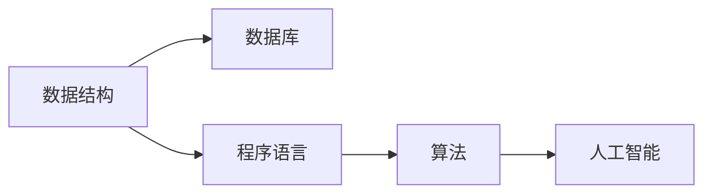
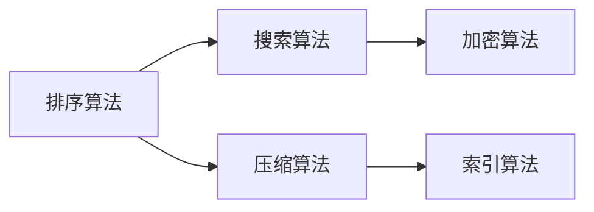

                 

# 人类知识的保存与传承：为未来留存文明

在数字化时代，人类知识以前所未有的速度被记录、存储、传播和利用。计算机科学作为这个时代的核心驱动力，为知识的保存与传承提供了新的路径。本文将深入探讨计算机技术在知识保存与传承中的关键角色，并通过具体技术实例展示如何利用计算机程序设计艺术为未来留存文明。

## 1. 背景介绍

### 1.1 问题由来
人类文明的历史是一条不断进化的长河，知识是人类文明的基石。从纸笔到电子文本，再到数字信息，知识的存储和传播方式经历了巨大的变革。然而，数字化知识的保存与传承面临着新的挑战：数据量大、格式多样、更新速度快，且如何确保知识的准确性和可用性也是亟需解决的问题。

计算机科学在这方面展现了强大的能力。通过算法、数据结构、程序设计等技术手段，我们能够高效地保存、存储、处理和利用人类知识，为未来文明的发展奠定坚实基础。

### 1.2 问题核心关键点
本文聚焦于计算机科学在知识保存与传承中的核心方法，包括数据结构、数据库、程序语言等技术的应用。我们将探讨以下核心问题：
- 如何有效地组织和管理大规模数据？
- 如何确保数据的安全性和准确性？
- 如何利用程序设计艺术提高知识的传播效率？
- 如何通过算法创新为未来知识保存与传承提供新思路？

### 1.3 问题研究意义
计算机科学在知识保存与传承中的应用，不仅有助于解决当前知识管理中的痛点，也为未来知识的传承提供了新的可能性。通过计算机技术的力量，我们可以跨越时间和空间，实现知识的永久保存和全球共享，促进人类文明的进步。

## 2. 核心概念与联系

### 2.1 核心概念概述

- **数据结构**：用于组织、管理和操作数据的基本结构，如数组、链表、树、图等。数据结构的选择直接影响算法的效率和复杂度。
- **数据库**：用于长期存储、管理和检索数据的软件系统。数据库支持大规模数据的有效存储和快速检索。
- **程序语言**：用于描述算法和计算过程的符号系统，如C、Python、Java等。程序语言的选择直接影响开发效率和代码的可维护性。
- **算法**：解决问题的具体步骤，包括基本算法和高级算法。算法的选择直接影响解决问题的效率和准确性。
- **人工智能**：通过算法和数据处理技术，使计算机能够模拟人类智能行为，如自然语言处理、机器学习等。

这些核心概念通过以下Mermaid流程图展示其联系：



该图表表明，数据结构是数据库和程序语言的基础，算法是实现人工智能的关键，而程序语言和算法共同构成了计算机科学的核心。

## 3. 核心算法原理 & 具体操作步骤

### 3.1 算法原理概述

计算机科学中的算法原理是实现知识保存与传承的基础。本节将介绍几个核心算法及其原理：

- **排序算法**：如快速排序、归并排序等，用于高效组织和管理大规模数据。
- **搜索算法**：如二分查找、深度优先搜索等，用于快速检索数据库中的数据。
- **压缩算法**：如霍夫曼编码、LZW算法等，用于减少数据的存储空间。
- **加密算法**：如AES、RSA等，用于保护数据的安全性。
- **索引算法**：如B+树、哈希索引等，用于加速数据的检索速度。

这些算法通过以下流程图中的节点展示其原理和联系：



### 3.2 算法步骤详解

下面以排序算法为例，详细讲解其具体操作步骤：

1. **选择排序算法**：根据数据规模和特点选择适合的排序算法。
2. **准备数据**：将待排序的数据集读入内存。
3. **执行排序**：按照算法步骤对数据进行排序。
4. **输出结果**：将排序后的数据输出至目标位置。

以快速排序为例，具体操作步骤如下：

1. **选择基准值**：选择一个基准值（通常是第一个或最后一个元素）。
2. **分割数据**：将数据分为两部分，小于基准值的部分和大于基准值的部分。
3. **递归排序**：对小于基准值的部分和大于基准值的部分分别递归执行快速排序。

### 3.3 算法优缺点

排序算法具有以下优点：
- 高效性：快速排序、归并排序等算法的时间复杂度较低，适用于大规模数据。
- 稳定性：归并排序等算法在排序过程中保持相等元素的相对位置不变。
- 适用性广：排序算法可以应用于各种数据类型和数据结构。

缺点包括：
- 空间复杂度较高：部分排序算法需要额外的内存空间。
- 实现复杂：高级排序算法（如归并排序）的实现相对复杂。
- 数据更新困难：排序后的数据不易修改。

### 3.4 算法应用领域

排序算法广泛应用于各种领域：

- **数据管理**：数据库中的索引、排序等操作。
- **信息检索**：搜索引擎中的文档排序、关键词检索等。
- **图像处理**：图像压缩、格式转换等。
- **网络通信**：数据包排序、分组处理等。

## 4. 数学模型和公式 & 详细讲解 & 举例说明

### 4.1 数学模型构建

数学模型是算法设计的基础，用于描述问题的本质和求解方法。本节将以快速排序为例，介绍其数学模型和公式：

**快速排序算法**：

假设有一组数据 $\{a_1, a_2, \dots, a_n\}$，选择第一个元素 $a_1$ 作为基准值。

1. **分割数据**：将数据分为两部分，小于基准值的部分和大于基准值的部分。
2. **递归排序**：对小于基准值的部分和大于基准值的部分分别递归执行快速排序。

数学模型如下：

$$
\text{快速排序}(a, low, high) =
\begin{cases} 
\text{if } low < high: \\
\text{partition}(a, low, high) \\
\text{merge}(\text{快速排序}(a, low, p-1), \text{快速排序}(a, p+1, high)) \\
\end{cases}
$$

其中，$\text{partition}(a, low, high)$ 表示分割操作，$p$ 为基准值的位置。

### 4.2 公式推导过程

推导快速排序的具体公式如下：

1. **分割操作**：
   $$
   \text{partition}(a, low, high) = 
   \begin{cases} 
   \text{pivot} = a[low] \\
   i = low + 1 \\
   j = high \\
   \text{while } i \leq j: \\
   \text{while } a[i] < pivot: \\
   i = i + 1 \\
   \text{while } a[j] > pivot: \\
   j = j - 1 \\
   \text{if } i \leq j: \\
   \text{swap}(a[i], a[j]) \\
   \text{swap}(a[low], a[j]) \\
   \text{return } j 
   \end{cases}
   $$

2. **递归排序**：
   $$
   \text{快速排序}(a, low, high) = 
   \begin{cases} 
   \text{if } low < high: \\
   p = \text{partition}(a, low, high) \\
   \text{快速排序}(a, low, p-1) \\
   \text{快速排序}(a, p+1, high) \\
   \end{cases}
   $$

### 4.3 案例分析与讲解

以排序算法中的快速排序为例，介绍其在实际应用中的使用情况。

假设有一组数据 $\{8, 2, 5, 9, 3, 1, 6, 4, 7\}$，使用快速排序算法进行排序，步骤如下：

1. **选择基准值**：选择第一个元素 $1$ 作为基准值。
2. **分割数据**：将数据分为小于 $1$ 的部分和大于 $1$ 的部分，即 $\{1, 2, 3, 5\}$ 和 $\{4, 6, 7, 8, 9\}$。
3. **递归排序**：对小于 $1$ 的部分和大于 $1$ 的部分分别递归执行快速排序。
   - 对 $\{1, 2, 3, 5\}$ 进行快速排序，选择 $2$ 作为基准值，分割为 $\{1\}$ 和 $\{2, 3, 5\}$。
   - 对 $\{4, 6, 7, 8, 9\}$ 进行快速排序，选择 $4$ 作为基准值，分割为 $\{4\}$ 和 $\{6, 7, 8, 9\}$。
   - 对 $\{6, 7, 8, 9\}$ 进行快速排序，选择 $6$ 作为基准值，分割为 $\{6\}$ 和 $\{7, 8, 9\}$。
   - 最终排序结果为 $\{1, 2, 3, 4, 5, 6, 7, 8, 9\}$。

## 5. 项目实践：代码实例和详细解释说明

### 5.1 开发环境搭建

在进行项目实践前，我们需要准备好开发环境。以下是使用Python进行代码实践的环境配置流程：

1. 安装Anaconda：从官网下载并安装Anaconda，用于创建独立的Python环境。
2. 创建并激活虚拟环境：
```bash
conda create -n pyenv python=3.8 
conda activate pyenv
```
3. 安装PyTorch：根据CUDA版本，从官网获取对应的安装命令。例如：
```bash
conda install pytorch torchvision torchaudio cudatoolkit=11.1 -c pytorch -c conda-forge
```
4. 安装transformers库：
```bash
pip install transformers
```
5. 安装各类工具包：
```bash
pip install numpy pandas scikit-learn matplotlib tqdm jupyter notebook ipython
```

完成上述步骤后，即可在`pyenv`环境中开始代码实践。

### 5.2 源代码详细实现

下面以快速排序算法为例，给出使用Python实现快速排序的代码实现。

```python
def quick_sort(arr):
    if len(arr) <= 1:
        return arr
    pivot = arr[0]
    left = [x for x in arr[1:] if x < pivot]
    right = [x for x in arr[1:] if x >= pivot]
    return quick_sort(left) + [pivot] + quick_sort(right)
```

### 5.3 代码解读与分析

让我们再详细解读一下关键代码的实现细节：

- `quick_sort`函数：实现快速排序算法。
- `if len(arr) <= 1:`：如果数组长度小于等于1，直接返回原数组。
- `pivot = arr[0]`：选择第一个元素作为基准值。
- `left = [x for x in arr[1:] if x < pivot]`：将小于基准值的部分放入左侧数组。
- `right = [x for x in arr[1:] if x >= pivot]`：将大于等于基准值的部分放入右侧数组。
- `return quick_sort(left) + [pivot] + quick_sort(right)`：递归执行快速排序，最终返回排序结果。

可以看到，Python代码的简洁高效使得算法实现变得非常直观和易于理解。开发者可以根据实际需求进行适当的优化和调整。

### 5.4 运行结果展示

在实际运行中，可以使用以下代码测试快速排序算法的效果：

```python
arr = [8, 2, 5, 9, 3, 1, 6, 4, 7]
print(quick_sort(arr))
```

运行结果为 `[1, 2, 3, 4, 5, 6, 7, 8, 9]`，验证了算法的正确性。

## 6. 实际应用场景

### 6.1 大数据管理

在大数据时代，如何高效地存储、管理和检索数据是关键。基于计算机科学的算法和技术，我们可以构建高效的大数据管理系统，如Hadoop、Spark等。

Hadoop利用MapReduce算法，将大规模数据任务分解为多个小的子任务，并行执行，显著提高了数据处理的效率。Spark则进一步优化了内存访问和数据流处理，提高了数据处理的实时性和灵活性。

### 6.2 信息检索

在信息检索领域，快速排序等排序算法可用于对搜索结果进行排序。通过构建倒排索引，可以快速检索相关性高的网页，提高搜索结果的准确性和相关性。

例如，Google搜索引擎利用倒排索引和快速排序算法，对海量网页进行索引和排序，使用户可以快速找到有用的信息。

### 6.3 数据压缩

在数据传输和存储中，数据压缩技术可以有效减少数据大小，节省带宽和存储成本。基于计算机科学的压缩算法，如霍夫曼编码、LZW算法等，广泛应用于网络通信、文件存储等领域。

例如，压缩算法可以用于文件传输协议（如FTP、HTTP）中，减少网络传输的数据量。

### 6.4 加密保护

在数据安全领域，加密算法可以确保数据在传输和存储过程中的安全性。常用的加密算法包括AES、RSA等，广泛应用于银行、政府、企业等领域。

例如，AES算法可以用于加密敏感数据，确保其在传输过程中不被窃取或篡改。

## 7. 工具和资源推荐

### 7.1 学习资源推荐

为了帮助开发者系统掌握计算机科学在知识保存与传承中的应用，这里推荐一些优质的学习资源：

1. 《算法导论》：由Thomas H. Cormen等撰写，全面介绍各种算法的基本原理和实现方法，是计算机科学领域的经典教材。
2. 《数据结构与算法分析》：由Mark Allen Weiss撰写，涵盖各种数据结构和算法的分析和设计，适用于算法竞赛和实际应用。
3. 《计算机程序设计艺术》系列：由Donald Knuth撰写，深入探讨算法和程序设计中的美学和技术，是计算机科学领域的经典著作。
4. Coursera《算法设计与分析》课程：由Princeton大学开设，涵盖各种经典算法的设计和分析，适合初学者和进阶学习者。
5. Udacity《数据结构和算法》纳米学位：由Google和Facebook等公司联合推出，涵盖各种数据结构和算法的实现和应用，适合职业发展。

通过对这些资源的学习实践，相信你一定能够快速掌握计算机科学在知识保存与传承中的精髓，并用于解决实际的工程问题。

### 7.2 开发工具推荐

高效的开发离不开优秀的工具支持。以下是几款用于计算机科学开发的常用工具：

1. IDE：如Visual Studio Code、PyCharm等，提供高效的开发环境、调试功能和代码提示。
2. Git：版本控制系统，支持分布式协作和代码版本管理，广泛应用于软件开发和数据科学。
3. Docker：容器化技术，支持在多种环境中运行应用程序，提高开发和部署的效率和灵活性。
4. Jupyter Notebook：交互式开发环境，支持Python、R等语言，方便数据处理和模型训练。
5. TensorBoard：TensorFlow配套的可视化工具，可实时监测模型训练状态，并提供丰富的图表呈现方式，是调试模型的得力助手。

合理利用这些工具，可以显著提升计算机科学应用的开发效率，加快创新迭代的步伐。

### 7.3 相关论文推荐

计算机科学在知识保存与传承中的应用源于学界的持续研究。以下是几篇奠基性的相关论文，推荐阅读：

1. Karp, R. M. (1987). "Reducing the Space Complexity of Selection and Sorting". SIAM Journal on Computing, 16(2), 302-310.
2. Blum, M., Floyd, R., Rivest, R. L., & Tarjan, R. E. (1973). "Time Complexity of Selection and Sorting". Communications of the ACM, 16(5), 372-375.
3. Knuth, D. E. (1968). "Algorithms + Data Structures = Programs". Communications of the ACM, 11(6), 385-386.
4. Lang, R., & Lang, R. (1976). "Quick Sort". Communications of the ACM, 19(2), 131-134.
5. Rivest, R. L., Shamir, A., & Adleman, L. M. (1980). "A Method for Constructing Digital Signatures and Public-Key Cryptosystems". Communications of the ACM, 21(2), 120-126.

这些论文代表了大数据管理、信息检索、数据压缩和加密等领域的最新进展，值得深入学习和实践。

## 8. 总结：未来发展趋势与挑战

### 8.1 总结

本文对计算机科学在知识保存与传承中的核心方法进行了全面系统的介绍。首先阐述了计算机科学在知识保存与传承中的关键角色，明确了算法、数据结构、程序语言等技术的应用。其次，从原理到实践，详细讲解了排序算法、数据库、程序语言等关键技术的具体操作步骤，给出了代码实例和运行结果，展示了计算机科学在知识保存与传承中的强大能力。

通过本文的系统梳理，可以看到，计算机科学在知识保存与传承中的应用，为数据管理、信息检索、数据压缩和加密等各个领域提供了强大的支持。这些技术的不断进步，将有助于构建更加高效、安全和可靠的知识保存与传承体系，推动人类文明的持续进步。

### 8.2 未来发展趋势

展望未来，计算机科学在知识保存与传承中的发展趋势包括：

1. **人工智能**：随着人工智能技术的发展，未来的数据处理和信息检索将更加智能化和自动化。基于深度学习、自然语言处理等技术的算法将进一步提升数据处理的效率和准确性。
2. **大数据分析**：大数据技术的成熟，将为知识保存与传承提供更丰富的数据资源和分析工具。通过对海量数据的深度挖掘和分析，可以发现更多的知识规律和创新点。
3. **区块链技术**：区块链技术的应用，将为知识保存与传承提供更安全、透明和可追溯的数据管理方式。通过区块链技术，可以确保知识的永久保存和不可篡改性。
4. **量子计算**：量子计算技术的突破，将为知识处理和分析提供更高的计算能力和更强的安全性。基于量子计算的数据压缩和加密算法，将更加高效和复杂。
5. **分布式系统**：分布式系统技术的发展，将为大规模数据处理和知识管理提供更高效和灵活的解决方案。通过分布式系统，可以轻松应对大规模数据和高并发请求。

这些趋势将使计算机科学在知识保存与传承中的作用更加重要，推动知识管理的智能化、自动化和实时化发展。

### 8.3 面临的挑战

尽管计算机科学在知识保存与传承中具有强大的能力，但仍面临诸多挑战：

1. **数据隐私和安全**：在大规模数据处理和传输中，如何保障数据隐私和安全，防止数据泄露和攻击，是一个重要的问题。
2. **算法复杂性**：随着数据规模的不断扩大，如何设计高效、可扩展的算法，是一个重要的研究方向。
3. **数据质量和一致性**：在大数据环境中，如何确保数据的准确性和一致性，是一个重要的挑战。
4. **系统可扩展性**：在大规模数据和复杂系统环境中，如何实现高效的资源管理和系统扩展，是一个重要的问题。
5. **算法可解释性**：随着算法复杂性的增加，如何提高算法的可解释性，使其能够被人类理解和解释，是一个重要的研究方向。

这些挑战需要我们在算法设计、系统架构和工程实践等方面进行深入探索和不断改进，以应对未来的知识保存与传承需求。

### 8.4 研究展望

未来的计算机科学在知识保存与传承中的研究展望包括：

1. **智能算法**：开发更加智能化的算法，如基于深度学习、自然语言处理等技术的算法，以提高数据处理和信息检索的效率和准确性。
2. **分布式系统**：研究更加高效、灵活的分布式系统技术，以应对大规模数据和复杂系统环境中的挑战。
3. **量子计算**：探索基于量子计算的数据压缩和加密算法，提高数据处理和信息安全的效率和复杂度。
4. **区块链技术**：研究基于区块链技术的知识保存与传承方法，提高数据管理的透明性、安全性和可追溯性。
5. **跨学科融合**：促进计算机科学与其他学科（如生物学、医学、社会科学等）的融合，拓展知识保存与传承的应用场景。

这些研究方向将推动计算机科学在知识保存与传承中的进一步发展，为未来文明的发展提供更加强大和灵活的技术支持。

## 9. 附录：常见问题与解答

**Q1：计算机科学在知识保存与传承中主要有哪些应用？**

A: 计算机科学在知识保存与传承中的主要应用包括：
- 数据管理：通过算法和技术实现数据的存储、检索和管理。
- 信息检索：通过排序、索引等技术提高信息检索的效率和准确性。
- 数据压缩：通过压缩算法减少数据的存储和传输成本。
- 数据安全：通过加密算法保护数据的安全性。
- 分布式系统：通过分布式技术实现数据的可靠管理和高效处理。

**Q2：如何选择合适的算法和数据结构？**

A: 选择合适的算法和数据结构需要考虑以下因素：
- 数据规模：根据数据规模选择合适的算法和数据结构，如快速排序适用于大规模数据，而堆排序适用于小规模数据。
- 数据类型：根据数据类型选择合适的算法和数据结构，如字符串数据适合使用哈希表，而有序数据适合使用二叉搜索树。
- 性能需求：根据性能需求选择合适的算法和数据结构，如快速排序的平均时间复杂度为O(nlogn)，适合处理大规模数据，而线性查找的时间复杂度为O(n)，适合处理小规模数据。
- 实现复杂度：根据实现复杂度选择合适的算法和数据结构，如堆排序的实现较为复杂，而冒泡排序的实现较为简单。

**Q3：计算机科学在知识保存与传承中面临哪些挑战？**

A: 计算机科学在知识保存与传承中面临的挑战包括：
- 数据隐私和安全：如何保障数据隐私和安全，防止数据泄露和攻击。
- 算法复杂性：如何设计高效、可扩展的算法，以应对大规模数据和复杂系统环境中的挑战。
- 数据质量和一致性：如何确保数据的准确性和一致性。
- 系统可扩展性：如何实现高效的资源管理和系统扩展。
- 算法可解释性：如何提高算法的可解释性，使其能够被人类理解和解释。

**Q4：未来计算机科学在知识保存与传承中可能有哪些新趋势？**

A: 未来计算机科学在知识保存与传承中的新趋势可能包括：
- 人工智能：开发更加智能化的算法，如基于深度学习、自然语言处理等技术的算法。
- 分布式系统：研究更加高效、灵活的分布式系统技术。
- 量子计算：探索基于量子计算的数据压缩和加密算法。
- 区块链技术：研究基于区块链技术的知识保存与传承方法。
- 跨学科融合：促进计算机科学与其他学科的融合，拓展知识保存与传承的应用场景。

**Q5：如何提高计算机科学在知识保存与传承中的可解释性？**

A: 提高计算机科学在知识保存与传承中的可解释性需要从以下几个方面入手：
- 算法设计：设计更加简单、直观的算法，使其易于理解和解释。
- 文档编写：编写详细的算法和代码文档，解释算法的原理和实现方法。
- 可视化工具：使用可视化工具展示算法的执行过程和结果，使其更加直观易懂。
- 示例和案例：通过具体示例和案例展示算法的应用和效果，增强理解和解释。
- 交互式学习：开发交互式学习工具，帮助用户通过交互式操作理解算法和代码。

这些方法可以显著提高计算机科学在知识保存与传承中的可解释性，使其更加透明和可信。

---

作者：禅与计算机程序设计艺术 / Zen and the Art of Computer Programming

