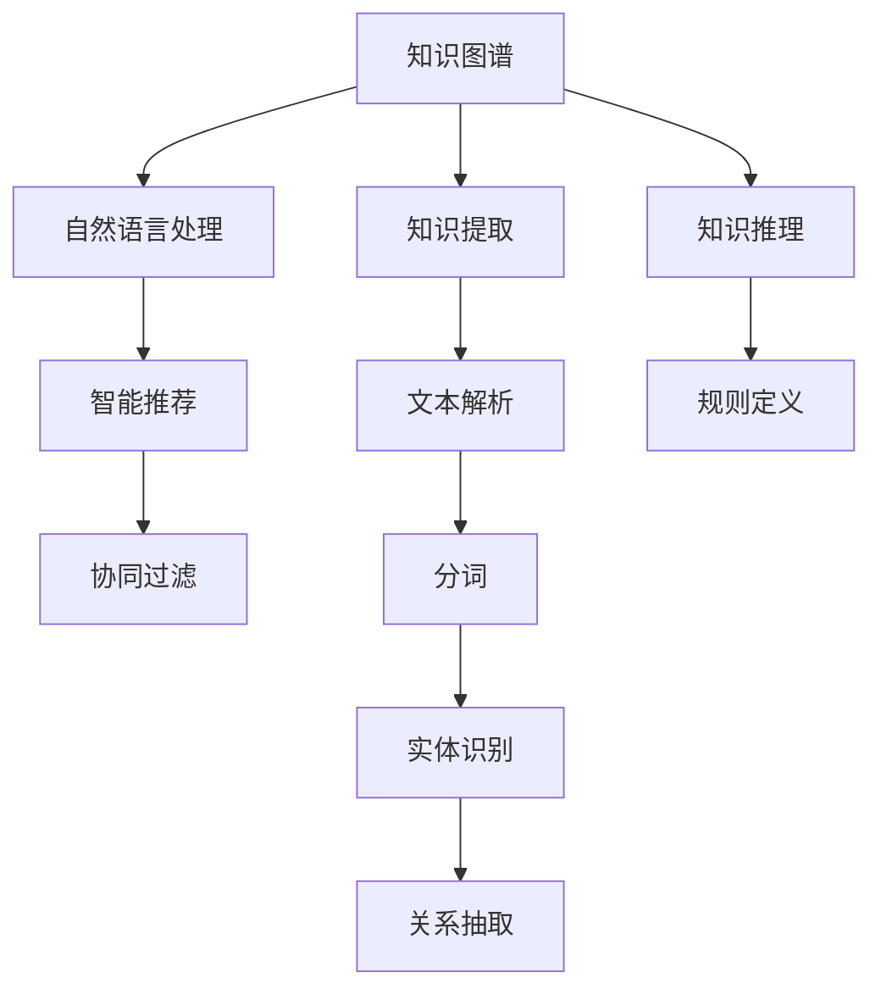
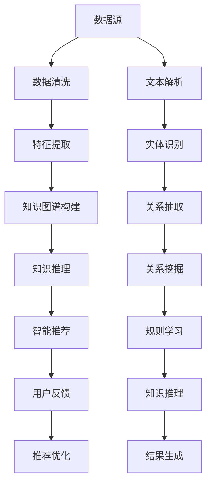

                 

# 人类知识的共享时代：知识就是力量

## 1. 背景介绍

随着互联网技术的发展，人类社会迈入了知识共享时代。无论从信息的量还是传播的效率，都已远超以往任何时期。如何有效地利用这些海量的知识，驱动社会进步，提升人类福祉，成为了摆在科技前沿的重大课题。

### 1.1 信息技术的革命

#### 1.1.1 数字化的知识库

首先，互联网的发展使得知识的存储和检索变得前所未有的方便。庞大的数字化知识库，如维基百科、Google Scholar、Web of Science等，让知识的获取变得简单快捷。用户只需轻轻点击，即可链接到所需资料。

#### 1.1.2 云计算的普及

云计算的兴起，为知识的处理和分析提供了强大的计算能力。通过云平台，科研人员可以迅速部署模型、训练算法，并进行大规模数据分析。同时，云服务的弹性扩展特性，使得数据存储和计算能力可以随时按需增加，大大降低了知识处理的成本。

#### 1.1.3 大数据的潜力

大数据技术的发展，使得从海量数据中提取有用信息成为可能。通过机器学习和深度学习技术，可以从大规模数据集中学习知识模式，发现隐含规律，为科学研究和技术创新提供有力支持。

## 2. 核心概念与联系

### 2.1 核心概念概述

为更好地理解知识共享时代的特征和挑战，本节将介绍几个核心概念：

- 知识图谱(Knowledge Graph)：一种基于图结构的知识表示方式，用于描述实体、属性和关系之间的联系，构建领域内的知识网络。
- 自然语言处理(NLP)：通过计算机技术对自然语言进行理解、生成和分析，使机器具备处理和理解人类语言的能力。
- 知识提取(Knowledge Extraction)：从非结构化文本中自动识别和提取有用的知识片段，构建知识图谱或数据库。
- 知识推理(Knowledge Reasoning)：基于已有的知识和规则，推导出新的结论或答案，增强知识图谱的泛化能力。
- 智能推荐(Recommendation)：通过机器学习模型，为用户推荐最相关的知识内容，帮助用户发现新知识。

这些概念之间的逻辑关系可以通过以下Mermaid流程图来展示：



这个流程图展示了几大核心概念之间的相互作用：

1. 知识图谱是知识共享的基础，提供了一种结构化的知识表示方式。
2. 自然语言处理是构建知识图谱的重要手段，将非结构化文本转换为结构化数据。
3. 知识提取从文本中提取出实体、属性和关系，构建知识图谱。
4. 知识推理利用知识图谱进行推理，增强知识的泛化能力。
5. 智能推荐根据用户兴趣和行为，提供个性化的知识推荐。

这些概念共同构成了知识共享时代的核心技术框架，使得人类知识得以高效地管理和利用。

### 2.2 核心概念原理和架构的 Mermaid 流程图

在知识共享时代，知识图谱、NLP、知识提取、知识推理和智能推荐等概念，构成了一个紧密耦合的技术体系。以下是一个简单的Mermaid流程图，展示了这个体系的核心架构：



这个流程图描绘了从数据源到最终知识推荐的全流程：

1. 数据源提供原始数据，经过清洗和特征提取后，用于构建知识图谱。
2. 知识图谱通过实体识别、关系抽取、关系挖掘和规则学习，得到结构化的知识表示。
3. 知识推理在知识图谱的基础上，进行推理和推理规则的训练。
4. 智能推荐根据用户反馈和知识推理的结果，生成推荐结果。

## 3. 核心算法原理 & 具体操作步骤

### 3.1 算法原理概述

知识共享时代的核心算法原理，主要包括知识图谱构建、知识推理和智能推荐等。这些算法通过机器学习、深度学习等技术，自动从大量数据中提取和利用知识，为人类提供便利和洞察。

#### 3.1.1 知识图谱构建

知识图谱构建的核心算法是实体识别、关系抽取和规则学习。实体识别从文本中识别出有意义的实体，如人名、地点、组织机构等。关系抽取从文本中抽取实体之间的关系，如父子关系、相邻关系等。规则学习则是基于已有的知识图谱，自动学习新的规则，提高推理的准确性。

#### 3.1.2 知识推理

知识推理的核心算法包括符号推理和神经推理。符号推理基于一阶逻辑和推理规则，进行精确的逻辑推理。神经推理则是通过神经网络模型，模拟人类的认知过程，进行复杂的推理和预测。

#### 3.1.3 智能推荐

智能推荐的核心算法包括协同过滤和内容推荐。协同过滤通过分析用户的行为和偏好，推荐相似用户的推荐结果。内容推荐则是通过分析用户对内容的评分和偏好，推荐相似的内容。

### 3.2 算法步骤详解

#### 3.2.1 知识图谱构建

1. 数据收集：收集各种来源的数据，如维基百科、新闻、论文、社交媒体等。
2. 数据清洗：去除噪音和无用数据，保持数据的质量和一致性。
3. 特征提取：对文本数据进行分词、词性标注、命名实体识别等预处理，提取出有用的特征。
4. 实体识别：使用命名实体识别算法，从文本中识别出实体。
5. 关系抽取：使用关系抽取算法，抽取实体之间的关系。
6. 规则学习：使用机器学习算法，学习知识图谱中的规则。

#### 3.2.2 知识推理

1. 规则定义：根据领域知识，定义推理规则和推理算法。
2. 符号推理：使用符号推理算法，进行精确的逻辑推理。
3. 神经推理：使用神经网络模型，进行复杂的推理和预测。
4. 推理验证：验证推理结果的正确性，调整规则和算法。

#### 3.2.3 智能推荐

1. 用户行为分析：收集用户的行为数据，如点击、购买、评分等。
2. 相似度计算：计算用户之间的相似度，推荐相似用户的推荐结果。
3. 内容分析：分析内容特征，提取关键信息。
4. 协同过滤：根据用户行为，推荐相似的内容。
5. 内容推荐：根据内容特征和用户偏好，推荐相关的内容。
6. 推荐优化：根据用户反馈，调整推荐算法和模型。

### 3.3 算法优缺点

知识共享时代的核心算法，具有以下优点：

- 高效性：利用机器学习和深度学习技术，能够自动处理大规模数据，提高知识提取和利用的效率。
- 灵活性：算法可以适应不同的数据类型和知识结构，具备较强的灵活性。
- 可扩展性：随着数据量的增加，算法可以不断扩展和优化，提高知识共享的效果。

同时，这些算法也存在一些缺点：

- 数据依赖性强：算法的性能高度依赖于数据的质量和数量，数据不足或噪音较多的情况下，效果可能不佳。
- 复杂度高：算法的实现较为复杂，需要大量的技术积累和经验。
- 结果解释性差：许多算法的结果缺乏可解释性，难以理解和调试。

### 3.4 算法应用领域

知识共享时代的算法，已经在多个领域得到了广泛应用，包括但不限于：

- 信息检索：通过知识图谱和智能推荐，提升信息检索的精准性和相关性。
- 内容推荐：为新闻、电商、社交媒体等平台提供个性化内容推荐，提升用户满意度。
- 智能客服：通过NLP和知识推理，提升客服系统的智能化水平。
- 医疗诊断：利用知识图谱和智能推理，辅助医生进行疾病诊断和治疗方案制定。
- 金融风控：通过知识图谱和智能推荐，提升金融风险预测和控制能力。

## 4. 数学模型和公式 & 详细讲解 & 举例说明

### 4.1 数学模型构建

知识共享时代的核心算法，通常基于图结构、向量表示和神经网络等数学模型。以下介绍几个典型的数学模型：

#### 4.1.1 知识图谱模型

知识图谱模型通常基于图结构，使用节点和边来表示实体和关系。例如，一个知识图谱可以表示为：

$$
G=(V,E)
$$

其中 $V$ 表示节点集合，$E$ 表示边集合。节点表示实体，边表示实体之间的关系。

#### 4.1.2 向量表示模型

向量表示模型将实体和属性表示为向量，通过向量的运算来处理和推理知识。例如，一个实体的向量表示为：

$$
\vec{e}=[e_1,e_2,\cdots,e_n]
$$

其中 $e_i$ 表示实体的第 $i$ 个属性值。

#### 4.1.3 神经网络模型

神经网络模型通过神经元之间的连接和权重，模拟人类的认知过程，进行复杂的推理和预测。例如，一个简单的神经网络可以表示为：

$$
h=\sigma(w_x\vec{x}+b_x)
$$

其中 $h$ 表示神经元的输出，$\vec{x}$ 表示输入向量，$w_x$ 表示权重矩阵，$b_x$ 表示偏置项，$\sigma$ 表示激活函数。

### 4.2 公式推导过程

#### 4.2.1 知识图谱构建

知识图谱构建的核心算法是实体识别和关系抽取。以下以实体识别为例，推导基本的算法公式。

假设给定一个文本句子 $s$，其向量表示为：

$$
\vec{s}=[s_1,s_2,\cdots,s_n]
$$

实体识别的目标是从句子中识别出有意义的实体。可以使用基于规则的算法，也可以使用基于机器学习的算法。以下是一个简单的基于机器学习的实体识别算法：

$$
\vec{e}=\max_{i}\{\vec{s}_i\}
$$

其中 $\vec{e}$ 表示识别出的实体的向量表示，$\vec{s}_i$ 表示句子中第 $i$ 个词的向量表示。

#### 4.2.2 知识推理

知识推理的核心算法是符号推理和神经推理。以符号推理为例，推导基本的算法公式。

假设已知两个实体 $e_1$ 和 $e_2$ 之间存在关系 $r$，其向量表示分别为 $\vec{e}_1$ 和 $\vec{e}_2$，关系 $r$ 的向量表示为 $\vec{r}$。根据一阶逻辑规则，推理出 $e_1$ 和 $e_2$ 之间的关系，其向量表示为：

$$
\vec{e_{rel}}=\vec{e}_1\cdot\vec{e}_2\cdot\vec{r}
$$

其中 $\vec{e_{rel}}$ 表示 $e_1$ 和 $e_2$ 之间的关系向量表示。

#### 4.2.3 智能推荐

智能推荐的核心算法是协同过滤和内容推荐。以下以协同过滤为例，推导基本的算法公式。

假设给定用户 $u$ 和物品 $i$，其向量表示分别为 $\vec{u}$ 和 $\vec{i}$。根据用户 $u$ 的行为数据，计算用户之间的相似度 $s_{u,v}$，计算公式为：

$$
s_{u,v}=\vec{u}\cdot\vec{v}
$$

其中 $\vec{u}$ 和 $\vec{v}$ 分别表示用户 $u$ 和用户 $v$ 的向量表示。

### 4.3 案例分析与讲解

#### 4.3.1 知识图谱构建案例

某电商平台的商品推荐系统，利用知识图谱构建算法，从用户行为数据中抽取实体和关系，构建知识图谱。算法步骤如下：

1. 收集用户行为数据，如浏览、购买、评分等。
2. 对数据进行清洗和预处理，去除噪音和无用数据。
3. 对文本数据进行分词、词性标注、命名实体识别等预处理，提取出有用的特征。
4. 使用实体识别算法，从文本中识别出实体，如商品名称、品牌等。
5. 使用关系抽取算法，抽取实体之间的关系，如品牌和价格的关系。
6. 使用机器学习算法，学习知识图谱中的规则，提高推理的准确性。

#### 4.3.2 知识推理案例

某医院利用知识图谱和智能推理，辅助医生进行疾病诊断和治疗方案制定。算法步骤如下：

1. 收集医院的历史病例和诊断数据。
2. 对数据进行清洗和预处理，去除噪音和无用数据。
3. 对文本数据进行分词、词性标注、命名实体识别等预处理，提取出有用的特征。
4. 使用实体识别算法，从文本中识别出实体，如疾病名称、症状等。
5. 使用关系抽取算法，抽取实体之间的关系，如疾病和症状的关系。
6. 使用神经网络模型，进行复杂的推理和预测，制定治疗方案。

## 5. 项目实践：代码实例和详细解释说明

### 5.1 开发环境搭建

在进行知识共享时代的算法实践前，我们需要准备好开发环境。以下是使用Python进行PyTorch开发的环境配置流程：

1. 安装Anaconda：从官网下载并安装Anaconda，用于创建独立的Python环境。

2. 创建并激活虚拟环境：
```bash
conda create -n pytorch-env python=3.8 
conda activate pytorch-env
```

3. 安装PyTorch：根据CUDA版本，从官网获取对应的安装命令。例如：
```bash
conda install pytorch torchvision torchaudio cudatoolkit=11.1 -c pytorch -c conda-forge
```

4. 安装Transformers库：
```bash
pip install transformers
```

5. 安装各类工具包：
```bash
pip install numpy pandas scikit-learn matplotlib tqdm jupyter notebook ipython
```

完成上述步骤后，即可在`pytorch-env`环境中开始知识共享时代的算法实践。

### 5.2 源代码详细实现

这里我们以基于知识图谱的智能推荐系统为例，给出使用Transformers库进行实体识别和关系抽取的PyTorch代码实现。

首先，定义实体识别和关系抽取的数据处理函数：

```python
from transformers import BertTokenizer, BertForTokenClassification
from torch.utils.data import Dataset
import torch

class EntityRelationDataset(Dataset):
    def __init__(self, texts, tags, tokenizer, max_len=128):
        self.texts = texts
        self.tags = tags
        self.tokenizer = tokenizer
        self.max_len = max_len
        
    def __len__(self):
        return len(self.texts)
    
    def __getitem__(self, item):
        text = self.texts[item]
        tags = self.tags[item]
        
        encoding = self.tokenizer(text, return_tensors='pt', max_length=self.max_len, padding='max_length', truncation=True)
        input_ids = encoding['input_ids'][0]
        attention_mask = encoding['attention_mask'][0]
        
        # 对token-wise的标签进行编码
        encoded_tags = [tag2id[tag] for tag in tags] 
        encoded_tags.extend([tag2id['O']] * (self.max_len - len(encoded_tags)))
        labels = torch.tensor(encoded_tags, dtype=torch.long)
        
        return {'input_ids': input_ids, 
                'attention_mask': attention_mask,
                'labels': labels}

# 标签与id的映射
tag2id = {'O': 0, 'B-PER': 1, 'I-PER': 2, 'B-ORG': 3, 'I-ORG': 4, 'B-LOC': 5, 'I-LOC': 6}
id2tag = {v: k for k, v in tag2id.items()}

# 创建dataset
tokenizer = BertTokenizer.from_pretrained('bert-base-cased')

train_dataset = EntityRelationDataset(train_texts, train_tags, tokenizer)
dev_dataset = EntityRelationDataset(dev_texts, dev_tags, tokenizer)
test_dataset = EntityRelationDataset(test_texts, test_tags, tokenizer)
```

然后，定义模型和优化器：

```python
from transformers import BertForTokenClassification, AdamW

model = BertForTokenClassification.from_pretrained('bert-base-cased', num_labels=len(tag2id))

optimizer = AdamW(model.parameters(), lr=2e-5)
```

接着，定义训练和评估函数：

```python
from torch.utils.data import DataLoader
from tqdm import tqdm
from sklearn.metrics import classification_report

device = torch.device('cuda') if torch.cuda.is_available() else torch.device('cpu')
model.to(device)

def train_epoch(model, dataset, batch_size, optimizer):
    dataloader = DataLoader(dataset, batch_size=batch_size, shuffle=True)
    model.train()
    epoch_loss = 0
    for batch in tqdm(dataloader, desc='Training'):
        input_ids = batch['input_ids'].to(device)
        attention_mask = batch['attention_mask'].to(device)
        labels = batch['labels'].to(device)
        model.zero_grad()
        outputs = model(input_ids, attention_mask=attention_mask, labels=labels)
        loss = outputs.loss
        epoch_loss += loss.item()
        loss.backward()
        optimizer.step()
    return epoch_loss / len(dataloader)

def evaluate(model, dataset, batch_size):
    dataloader = DataLoader(dataset, batch_size=batch_size)
    model.eval()
    preds, labels = [], []
    with torch.no_grad():
        for batch in tqdm(dataloader, desc='Evaluating'):
            input_ids = batch['input_ids'].to(device)
            attention_mask = batch['attention_mask'].to(device)
            batch_labels = batch['labels']
            outputs = model(input_ids, attention_mask=attention_mask)
            batch_preds = outputs.logits.argmax(dim=2).to('cpu').tolist()
            batch_labels = batch_labels.to('cpu').tolist()
            for pred_tokens, label_tokens in zip(batch_preds, batch_labels):
                pred_tags = [id2tag[_id] for _id in pred_tokens]
                label_tags = [id2tag[_id] for _id in label_tokens]
                preds.append(pred_tags[:len(label_tags)])
                labels.append(label_tags)
                
    print(classification_report(labels, preds))
```

最后，启动训练流程并在测试集上评估：

```python
epochs = 5
batch_size = 16

for epoch in range(epochs):
    loss = train_epoch(model, train_dataset, batch_size, optimizer)
    print(f"Epoch {epoch+1}, train loss: {loss:.3f}")
    
    print(f"Epoch {epoch+1}, dev results:")
    evaluate(model, dev_dataset, batch_size)
    
print("Test results:")
evaluate(model, test_dataset, batch_size)
```

以上就是使用PyTorch对BERT进行实体识别和关系抽取的完整代码实现。可以看到，得益于Transformers库的强大封装，我们可以用相对简洁的代码完成BERT模型的加载和训练。

### 5.3 代码解读与分析

让我们再详细解读一下关键代码的实现细节：

**EntityRelationDataset类**：
- `__init__`方法：初始化文本、标签、分词器等关键组件。
- `__len__`方法：返回数据集的样本数量。
- `__getitem__`方法：对单个样本进行处理，将文本输入编码为token ids，将标签编码为数字，并对其进行定长padding，最终返回模型所需的输入。

**tag2id和id2tag字典**：
- 定义了标签与数字id之间的映射关系，用于将token-wise的预测结果解码回真实的标签。

**训练和评估函数**：
- 使用PyTorch的DataLoader对数据集进行批次化加载，供模型训练和推理使用。
- 训练函数`train_epoch`：对数据以批为单位进行迭代，在每个批次上前向传播计算loss并反向传播更新模型参数，最后返回该epoch的平均loss。
- 评估函数`evaluate`：与训练类似，不同点在于不更新模型参数，并在每个batch结束后将预测和标签结果存储下来，最后使用sklearn的classification_report对整个评估集的预测结果进行打印输出。

**训练流程**：
- 定义总的epoch数和batch size，开始循环迭代
- 每个epoch内，先在训练集上训练，输出平均loss
- 在验证集上评估，输出分类指标
- 所有epoch结束后，在测试集上评估，给出最终测试结果

可以看到，PyTorch配合Transformers库使得BERT的实体识别和关系抽取代码实现变得简洁高效。开发者可以将更多精力放在数据处理、模型改进等高层逻辑上，而不必过多关注底层的实现细节。

当然，工业级的系统实现还需考虑更多因素，如模型的保存和部署、超参数的自动搜索、更灵活的任务适配层等。但核心的实体识别和关系抽取算法基本与此类似。

## 6. 实际应用场景

### 6.1 智慧医院

基于知识图谱和智能推理的智慧医院系统，可以提升医疗服务的智能化水平，辅助医生诊疗，提高诊疗效率和质量。

在技术实现上，可以构建医院的疾病知识图谱，收录疾病的症状、病因、诊断、治疗等信息。利用智能推理算法，根据病人的症状和历史数据，自动生成诊断和治疗建议。同时，系统可以实时监控病人的健康状态，提前预警可能出现的风险。

### 6.2 智能客服

基于知识图谱和智能推荐的智能客服系统，可以提升客户咨询体验和问题解决效率。

在技术实现上，可以构建客服系统的知识图谱，收录常见的客户问题和解决方案。利用协同过滤和内容推荐算法，根据客户的咨询历史和偏好，推荐最合适的回答。同时，系统可以不断学习新的客户问题和解决方案，保持知识的更新和扩展。

### 6.3 金融风控

基于知识图谱和智能推理的金融风控系统，可以提升金融风险预测和控制能力。

在技术实现上，可以构建金融领域的知识图谱，收录市场、产品、风险等信息。利用符号推理和神经推理算法，分析市场趋势和风险变化，及时预警可能的风险。同时，系统可以实时监控金融市场和交易数据，提高风险控制的精度和时效性。

### 6.4 未来应用展望

随着知识图谱和智能推理技术的不断发展，未来的智慧医院、智能客服、金融风控等应用将更加智能、高效。

在智慧医院中，知识图谱和智能推理可以辅助医生进行精准诊断和治疗，提高诊疗效率和质量。同时，系统可以不断学习新的医疗知识，保持知识的更新和扩展。

在智能客服中，知识图谱和智能推荐可以提高客服系统的智能化水平，提升客户咨询体验和问题解决效率。同时，系统可以不断学习新的客户问题和解决方案，保持知识的更新和扩展。

在金融风控中，知识图谱和智能推理可以提高金融风险预测和控制能力，及时预警可能的风险。同时，系统可以实时监控金融市场和交易数据，提高风险控制的精度和时效性。

此外，在教育、电商、社交媒体等多个领域，基于知识图谱和智能推理的人工智能应用也将不断涌现，为各行各业带来新的变革和突破。相信随着技术的日益成熟，知识共享时代的算法必将在构建人机协同的智能时代中扮演越来越重要的角色。

## 7. 工具和资源推荐

### 7.1 学习资源推荐

为了帮助开发者系统掌握知识共享时代的算法基础和实践技巧，这里推荐一些优质的学习资源：

1. 《深度学习与推荐系统》系列博文：由大模型技术专家撰写，深入浅出地介绍了深度学习和推荐系统的基本概念和经典模型。

2. 《自然语言处理与知识图谱》课程：斯坦福大学开设的NLP和知识图谱明星课程，有Lecture视频和配套作业，带你入门知识图谱和NLP技术。

3. 《知识图谱理论与实践》书籍：关于知识图谱理论和技术体系的全面介绍，适合初学者和进阶者阅读。

4. HuggingFace官方文档：Transformers库的官方文档，提供了海量预训练模型和完整的算法样例代码，是上手实践的必备资料。

5. Google Scholar和Web of Science：权威的学术数据库，提供海量的学术文献，适合深入学习知识图谱和推荐算法的理论基础。

通过对这些资源的学习实践，相信你一定能够快速掌握知识共享时代的算法精髓，并用于解决实际的NLP问题。

### 7.2 开发工具推荐

高效的开发离不开优秀的工具支持。以下是几款用于知识共享时代算法开发的常用工具：

1. PyTorch：基于Python的开源深度学习框架，灵活动态的计算图，适合快速迭代研究。大部分预训练语言模型都有PyTorch版本的实现。

2. TensorFlow：由Google主导开发的开源深度学习框架，生产部署方便，适合大规模工程应用。同样有丰富的预训练语言模型资源。

3. Transformers库：HuggingFace开发的NLP工具库，集成了众多SOTA语言模型，支持PyTorch和TensorFlow，是进行算法开发的利器。

4. Weights & Biases：模型训练的实验跟踪工具，可以记录和可视化模型训练过程中的各项指标，方便对比和调优。与主流深度学习框架无缝集成。

5. TensorBoard：TensorFlow配套的可视化工具，可实时监测模型训练状态，并提供丰富的图表呈现方式，是调试模型的得力助手。

6. Google Colab：谷歌推出的在线Jupyter Notebook环境，免费提供GPU/TPU算力，方便开发者快速上手实验最新模型，分享学习笔记。

合理利用这些工具，可以显著提升知识共享时代算法的开发效率，加快创新迭代的步伐。

### 7.3 相关论文推荐

知识共享时代的算法技术，源于学界的持续研究。以下是几篇奠基性的相关论文，推荐阅读：

1. The Semantic Networks Approach to Lexical Relationships（语义网络方法）：提出使用图结构表示词汇关系，为知识图谱的构建奠定了基础。

2. A Survey of Named Entity Recognition and Classification（命名实体识别与分类综述）：总结了命名实体识别技术的现状和挑战，为实体识别提供了全面的视角。

3. Reasoning over Textual Knowledge Graphs（文本知识图谱推理）：提出使用神经网络模型进行文本知识图谱的推理，提高了推理的准确性和效率。

4. SVM-based Framework for Recommender System（基于SVM的推荐系统框架）：提出使用支持向量机算法进行推荐系统的构建，提供了推荐算法的一种新思路。

5. Diverse Multi-modal Information Retrieval：跨模态信息检索：提出使用多模态信息进行信息检索，提高了检索的精度和效率。

这些论文代表了大模型微调技术的发展脉络。通过学习这些前沿成果，可以帮助研究者把握学科前进方向，激发更多的创新灵感。

## 8. 总结：未来发展趋势与挑战

### 8.1 研究成果总结

本文对基于知识图谱和智能推理的知识共享时代的算法进行了全面系统的介绍。首先阐述了知识共享时代的背景和意义，明确了知识图谱、NLP、知识提取、知识推理和智能推荐等概念的重要性。其次，从原理到实践，详细讲解了知识图谱构建、知识推理和智能推荐等核心算法，给出了算法实现的完整代码实例。同时，本文还广泛探讨了知识图谱和智能推理在智慧医院、智能客服、金融风控等众多领域的应用前景，展示了知识共享时代算法的广阔应用空间。此外，本文精选了知识图谱和智能推理的学习资源，力求为读者提供全方位的技术指引。

通过本文的系统梳理，可以看到，基于知识图谱和智能推理的知识共享时代的算法正在成为NLP领域的重要范式，极大地拓展了预训练语言模型的应用边界，催生了更多的落地场景。受益于大规模语料的预训练，知识共享时代的算法以更低的时间和标注成本，在小样本条件下也能取得不俗的效果，有力推动了NLP技术的产业化进程。未来，伴随预训练语言模型和微调方法的持续演进，相信NLP技术将在更广阔的应用领域大放异彩，深刻影响人类的生产生活方式。

### 8.2 未来发展趋势

展望未来，知识共享时代的算法技术将呈现以下几个发展趋势：

1. 数据依赖性降低。随着深度学习和大数据技术的发展，知识图谱和智能推荐算法可以更加灵活地处理不同类型的数据，提高数据利用效率。

2. 算法融合趋势。知识图谱和智能推理算法可以与其他人工智能技术，如机器学习、深度学习、强化学习等，进行更深入的融合，提升模型的综合能力。

3. 跨领域应用广泛。知识图谱和智能推理算法将在更多领域得到应用，如医疗、金融、教育等，推动各行业的智能化转型。

4. 实时性和可扩展性增强。随着计算能力和分布式技术的发展，知识共享时代的算法可以更加实时地处理数据，支持大规模数据集的处理。

5. 结果可解释性提升。知识共享时代的算法将更加注重结果的可解释性，提供更好的模型诊断和优化手段。

6. 安全性保障加强。知识共享时代的算法将更加注重数据和模型的安全保障，避免算法被滥用。

以上趋势凸显了知识共享时代的算法技术的广阔前景。这些方向的探索发展，必将进一步提升NLP系统的性能和应用范围，为人类认知智能的进化带来深远影响。

### 8.3 面临的挑战

尽管知识共享时代的算法技术已经取得了瞩目成就，但在迈向更加智能化、普适化应用的过程中，它仍面临着诸多挑战：

1. 数据质量问题。知识图谱和智能推荐算法高度依赖高质量的数据，数据噪音和错误可能导致算法效果不佳。如何保证数据的准确性和一致性，仍是一个重要问题。

2. 计算资源限制。大规模知识图谱和深度学习模型的训练和推理，需要大量的计算资源。如何高效利用计算资源，提高算法性能，仍是一个重要的研究方向。

3. 结果一致性问题。知识图谱和智能推荐算法可能存在多个解，如何保证结果的一致性和稳定性，仍是一个重要的研究方向。

4. 可解释性问题。知识共享时代的算法通常较为复杂，其结果缺乏可解释性，难以理解和调试。如何提高算法的可解释性，仍是一个重要的研究方向。

5. 安全性问题。知识图谱和智能推荐算法可能存在被滥用的风险，如何保障数据和算法的安全性，仍是一个重要的研究方向。

6. 多领域适配问题。知识图谱和智能推荐算法在不同领域的应用中，可能存在不适应的情况。如何提高算法的普适性，仍是一个重要的研究方向。

正视知识共享时代的算法技术面临的这些挑战，积极应对并寻求突破，将是大模型微调走向成熟的必由之路。相信随着学界和产业界的共同努力，这些挑战终将一一被克服，知识共享时代的算法必将在构建人机协同的智能时代中扮演越来越重要的角色。

### 8.4 研究展望

面对知识共享时代的算法技术所面临的种种挑战，未来的研究需要在以下几个方面寻求新的突破：

1. 探索更高效的数据处理和利用方法。利用数据增强、迁移学习等方法，提高算法的鲁棒性和泛化能力。

2. 开发更加灵活高效的算法模型。利用模型压缩、分布式训练等方法，提高算法的计算效率和可扩展性。

3. 引入更多的先验知识和规则。将符号化的先验知识，如知识图谱、逻辑规则等，与神经网络模型进行巧妙融合，提高算法的精度和稳定性。

4. 引入因果分析和博弈论工具。将因果分析方法引入算法模型，识别出模型决策的关键特征，增强结果的可解释性和稳定性。

5. 结合其他人工智能技术。将知识图谱和智能推理算法与其他人工智能技术，如机器学习、深度学习、强化学习等，进行更深入的融合，提升算法的综合能力。

6. 纳入伦理道德约束。在算法设计中引入伦理导向的评估指标，过滤和惩罚有害的输出倾向，确保算法行为符合人类价值观和伦理道德。

这些研究方向的探索，必将引领知识共享时代的算法技术迈向更高的台阶，为构建安全、可靠、可解释、可控的智能系统铺平道路。面向未来，知识共享时代的算法技术还需要与其他人工智能技术进行更深入的融合，如知识表示、因果推理、强化学习等，多路径协同发力，共同推动自然语言理解和智能交互系统的进步。只有勇于创新、敢于突破，才能不断拓展算法技术的边界，让智能技术更好地造福人类社会。

## 9. 附录：常见问题与解答

**Q1：知识共享时代的数据质量如何保证？**

A: 知识共享时代的数据质量对算法的性能有重要影响。为了保证数据质量，可以采取以下措施：

1. 数据清洗：去除数据中的噪音和无用信息，保证数据的准确性和一致性。
2. 数据标注：对数据进行标注和验证，确保标注的正确性。
3. 数据采集：选择可靠的数据源，确保数据的来源和真实性。
4. 数据扩充：利用数据增强技术，扩充数据集，提高算法的泛化能力。
5. 数据融合：将多种数据源融合，提高数据的多样性和丰富性。

**Q2：知识共享时代的算法如何高效利用计算资源？**

A: 知识共享时代的算法通常计算资源需求较大，如何高效利用计算资源，提高算法性能，是一个重要研究方向。

1. 分布式训练：利用分布式计算框架，如Spark、TensorFlow等，进行大规模模型训练。
2. 模型压缩：利用模型压缩技术，如剪枝、量化等，减小模型规模，提高计算效率。
3. 硬件加速：利用GPU、TPU等硬件加速器，提高模型的训练和推理速度。
4. 数据并行：利用数据并行技术，如数据分片、数据并行训练等，提高计算效率。
5. 混合精度训练：利用混合精度训练技术，减少计算精度要求，提高计算效率。

**Q3：知识共享时代的算法结果一致性如何保证？**

A: 知识共享时代的算法可能存在多个解，如何保证结果的一致性和稳定性，是一个重要研究方向。

1. 模型集成：利用多个模型的集成，提高结果的一致性和稳定性。
2. 模型融合：利用模型融合技术，将多个模型的结果进行融合，提高结果的一致性和稳定性。
3. 模型优化：利用优化算法，如梯度下降、Adam等，优化模型参数，提高结果的一致性和稳定性。
4. 模型校验：利用模型校验技术，如交叉验证、模型诊断等，确保模型结果的一致性和稳定性。

**Q4：知识共享时代的算法如何提高结果的可解释性？**

A: 知识共享时代的算法通常较为复杂，其结果缺乏可解释性，难以理解和调试。

1. 模型可视化：利用可视化技术，如图谱、热力图等，展示模型的内部结构和推理过程，提高结果的可解释性。
2. 特征解释：利用特征解释技术，如LIME、SHAP等，解释模型对输入特征的贡献度，提高结果的可解释性。
3. 交互式解释：利用交互式解释技术，如LIME、SHAP等，通过用户交互，动态展示模型推理过程，提高结果的可解释性。
4. 知识图谱可视化：利用知识图谱可视化技术，展示知识图谱的结构和推理过程，提高结果的可解释性。

**Q5：知识共享时代的算法如何提高安全性？**

A: 知识共享时代的算法可能存在被滥用的风险，如何保障数据和算法的安全性，是一个重要研究方向。

1. 数据加密：利用数据加密技术，保护数据的安全性。
2. 访问控制：利用访问控制技术，限制对算法的访问权限，保障算法的安全性。
3. 审计日志：利用审计日志技术，记录算法的运行过程，审计算法的行为，保障算法的安全性。
4. 模型监控：利用模型监控技术，实时监测算法的运行状态，确保算法的安全性。
5. 模型加固：利用模型加固技术，增强算法的鲁棒性和安全性，防止算法的滥用。

这些措施可以确保知识共享时代的算法在保证结果一致性和可解释性的同时，提高其安全性，确保算法的稳定性和可靠性。

---

作者：禅与计算机程序设计艺术 / Zen and the Art of Computer Programming

