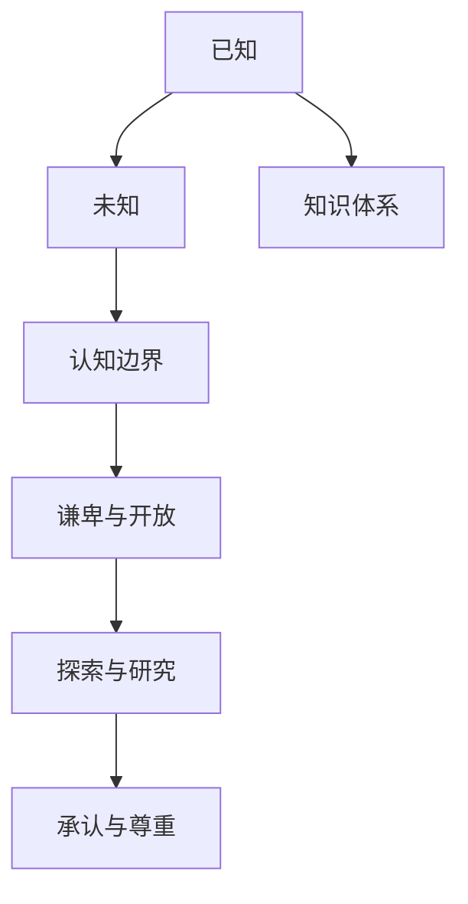

                 

# 人类知识的局限性：承认与尊重未知领域

在人工智能领域，无论是模型训练、知识图谱构建，还是自然语言处理，我们始终在追求对未知领域的探索。然而，人类自身的知识体系并非完美无缺，在面对一些未知领域时，我们需要谦卑地承认自己的局限性，并尊重未知领域的复杂性和多样性。本文旨在探讨人类知识的局限性，以及如何正确地认识并尊重这些未知领域。

## 1. 背景介绍

### 1.1 问题由来
在科学探索和工程技术中，我们总是试图利用已有的知识体系来理解和解决未知问题。这种做法在很多情况下是成功的，但同时也带来了局限性。例如，在传统机器学习中，我们假设数据遵循一定的分布，且模型能完美地学习这些分布。然而，在现实世界中，数据分布可能复杂多变，难以简单建模。又如在知识图谱中，我们试图将所有实体和关系都纳入到一个固定的框架内，但人类活动的复杂性使得这一目标难以实现。

### 1.2 问题核心关键点
面对未知领域，我们的挑战在于如何平衡已有知识与未知因素之间的关系。这涉及到了两个核心问题：
- **知识边界**：人类知识体系能够覆盖哪些领域，其边界在哪里？
- **未知探索**：如何以谦卑的心态，探索和尊重未知领域的复杂性和多样性。

## 2. 核心概念与联系

### 2.1 核心概念概述

为更好地理解如何承认和尊重未知领域，本节将介绍几个关键概念：

- **已知与未知**：人类知识体系中，我们往往只关注已知的部分，而忽略或忽视未知领域。这种思维方式在科学探索和工程技术中可能导致错误的结论。
- **认知边界**：我们的认知边界是对已知与未知的划分。认知边界内，我们有充足的知识和理论；而边界外，则是未知的、不确定的领域。
- **谦卑与开放**：在面对未知领域时，谦卑地承认自己的局限性，并保持开放的心态，接受未知领域的多样性和复杂性。

这些概念之间的逻辑关系可以通过以下Mermaid流程图来展示：



这个流程图展示了的核心概念及其之间的关系：

1. 已知部分是知识体系的基础，是我们进行探索和研究的出发点。
2. 未知部分是认知边界之外的部分，需要谦卑地承认其复杂性和多样性。
3. 认知边界是我们对已知与未知的划分，认知边界内，我们有充足的知识和理论；边界外，则是未知的、不确定的领域。
4. 谦卑与开放是我们面对未知领域的基本态度，只有这样才能更好地进行探索与研究。
5. 探索与研究是在谦卑与开放的基础上，主动认识和理解未知领域的过程。
6. 承认与尊重是对未知领域多样性和复杂性的接受，这有助于我们更好地应对未知。

## 3. 核心算法原理 & 具体操作步骤

### 3.1 算法原理概述

面对未知领域，我们的核心算法原理是基于谦卑与开放的心态，主动探索和尊重未知领域。这种思维方式类似于某种形式的元学习，即学习如何学习，学习如何适应不同的数据分布和复杂性。

### 3.2 算法步骤详解

以下是基于谦卑与开放的心态，进行未知领域探索的具体步骤：

1. **谦卑与开放的心态**：首先，我们需要承认自己的局限性，保持谦卑的心态，认识到自己的知识体系并非万能的。同时，保持开放的心态，接受未知领域的多样性和复杂性。

2. **设立认知边界**：根据已有的知识体系，设立认知边界，明确哪些是我们已经了解的，哪些是需要进一步探索的。认知边界内的知识，我们可以采用已有的方法进行处理；认知边界外的未知领域，则需要特别对待。

3. **主动探索未知领域**：在认知边界之外，我们需要主动地探索和研究未知领域。这可以通过多种方式进行，如实地考察、文献回顾、实验验证等。探索的过程可能漫长而曲折，需要耐心和毅力。

4. **尊重未知领域**：在探索过程中，我们需要尊重未知领域的复杂性和多样性。这意味着，我们需要接受并非所有的未知问题都能用已有的方法解决，需要灵活调整策略，甚至尝试新的方法。

5. **持续学习与改进**：通过不断的探索和研究，我们逐步了解未知领域的特点和规律。在此基础上，我们可以持续地改进已有的知识体系，使之更好地适应未知领域。

### 3.3 算法优缺点

基于谦卑与开放的心态，进行未知领域探索的算法具有以下优点：

1. **灵活性**：通过开放的心态，我们能够灵活应对不同领域和问题，不至于被已有知识体系所束缚。
2. **创新性**：在探索未知领域的过程中，我们更容易发现新的问题和机会，推动技术和理论的创新。
3. **适应性**：尊重未知领域的复杂性，使我们能够更好地适应不同数据分布和问题特点，提高模型和算法的泛化能力。

然而，这种方法也存在一些缺点：

1. **探索成本高**：主动探索未知领域可能需要投入大量的人力和资源，尤其是在初期阶段。
2. **不确定性高**：未知领域可能存在多种可能，探索过程中容易迷失方向。
3. **结果不确定**：探索的结果可能并不如预期，甚至可能失败，这需要我们有足够的心理准备。

### 3.4 算法应用领域

基于谦卑与开放的心态，进行未知领域探索的方法在多个领域都有应用。例如：

- **科学探索**：在物理学、天文学、生物学等领域，我们需要面对大量的未知问题，通过谦卑与开放的心态，积极探索和研究，才能不断推动科学的进步。
- **工程创新**：在工程技术中，我们需要面对不同环境和条件下的未知问题，通过灵活应对和创新，才能开发出更好的技术解决方案。
- **人工智能**：在人工智能领域，面对复杂多变的数据分布，我们需要尊重未知领域的复杂性，采用谦卑与开放的心态，不断改进和优化模型和算法。

## 4. 数学模型和公式 & 详细讲解 & 举例说明

### 4.1 数学模型构建

在数学模型中，我们常常用已知数据和假设来构建模型，以预测未知数据。然而，面对未知领域，我们的数学模型需要更加灵活和开放，以便更好地适应不同的数据分布。

### 4.2 公式推导过程

以线性回归模型为例，我们假设数据遵循线性关系，通过已知数据来推导模型的参数。然而，在面对未知领域时，我们可能需要采用更为复杂的模型，如神经网络、深度学习等，以适应不同数据分布的复杂性。

### 4.3 案例分析与讲解

考虑一个简单的回归问题，我们假设数据遵循线性关系 $y = ax + b$。然而，在实际数据中，我们可能发现数据呈现出更复杂的非线性关系。此时，我们需要尊重数据的多样性和复杂性，采用更为灵活的模型，如多项式回归、神经网络等，以更好地拟合数据。

## 5. 项目实践：代码实例和详细解释说明

### 5.1 开发环境搭建

在进行未知领域探索的实践前，我们需要准备好开发环境。以下是使用Python进行TensorFlow开发的环境配置流程：

1. 安装Anaconda：从官网下载并安装Anaconda，用于创建独立的Python环境。

2. 创建并激活虚拟环境：
```bash
conda create -n tf-env python=3.8 
conda activate tf-env
```

3. 安装TensorFlow：根据CUDA版本，从官网获取对应的安装命令。例如：
```bash
conda install tensorflow -c pytorch -c conda-forge
```

4. 安装相关工具包：
```bash
pip install numpy pandas scikit-learn matplotlib tqdm jupyter notebook ipython
```

完成上述步骤后，即可在`tf-env`环境中开始探索实践。

### 5.2 源代码详细实现

以下是一个简单的回归问题代码实现，展示如何在TensorFlow中构建和训练模型：

```python
import tensorflow as tf

# 定义训练数据
x_train = [1.0, 2.0, 3.0, 4.0, 5.0]
y_train = [2.0, 4.0, 6.0, 8.0, 10.0]

# 定义模型
model = tf.keras.Sequential([
    tf.keras.layers.Dense(units=1, input_shape=[1])
])

# 编译模型
model.compile(optimizer=tf.keras.optimizers.Adam(learning_rate=0.01), loss='mse')

# 训练模型
model.fit(x_train, y_train, epochs=100, verbose=0)

# 预测
x_test = [6.0, 7.0, 8.0, 9.0, 10.0]
y_pred = model.predict(x_test)
```

### 5.3 代码解读与分析

让我们再详细解读一下关键代码的实现细节：

**定义训练数据**：我们定义了5个训练数据点，每个数据点的特征是自变量 $x$，目标是因变量 $y$。

**定义模型**：我们使用Keras框架，定义了一个简单的神经网络模型，包含一个全连接层，输出一个线性关系。

**编译模型**：我们使用Adam优化器进行模型训练，设置学习率为0.01，损失函数为均方误差。

**训练模型**：我们使用训练数据对模型进行训练，训练100个epoch。

**预测**：使用训练好的模型对测试数据进行预测，输出预测结果。

## 6. 实际应用场景

### 6.1 智能家居系统

在智能家居系统中，我们需要面对大量不同的环境和用户需求。面对这些未知领域，我们需要保持谦卑和开放的心态，主动探索和研究用户需求，以提供更好的用户体验。

### 6.2 医疗健康领域

在医疗健康领域，我们需要面对复杂的病理学、药理学等未知领域。尊重未知领域的复杂性，通过不断的研究和探索，才能开发出更有效的医疗解决方案。

### 6.3 自动驾驶技术

在自动驾驶技术中，我们需要面对不同的道路环境、交通状况等未知因素。通过谦卑和开放的心态，我们才能不断改进算法，提高自动驾驶的安全性和可靠性。

### 6.4 未来应用展望

随着技术的进步和数据的积累，我们对未知领域的探索将更加深入和广泛。未来，谦卑与开放的心态将成为人类面对未知领域的基本态度，推动科学、工程和技术的不断进步。

## 7. 工具和资源推荐

### 7.1 学习资源推荐

为了帮助开发者系统掌握未知领域探索的理论基础和实践技巧，这里推荐一些优质的学习资源：

1. 《人工智能原理与实践》系列博文：由大模型技术专家撰写，深入浅出地介绍了人工智能原理、探索方法等前沿话题。

2. 《机器学习》课程：斯坦福大学开设的经典机器学习课程，有Lecture视频和配套作业，带你入门机器学习的基本概念和核心技术。

3. 《深度学习》书籍：深度学习领域的经典著作，全面介绍了深度学习的理论基础和应用实践，是深度学习入门的必备资料。

4. arXiv：最新的科研论文发布平台，提供海量科研文章，涵盖机器学习、计算机视觉、自然语言处理等多个领域，是探索未知领域的宝贵资源。

5. GitHub：开源社区，提供丰富的开源项目和代码，可以快速学习掌握未知领域的实践经验。

通过对这些资源的学习实践，相信你一定能够更好地掌握未知领域探索的精髓，并用于解决实际的问题。

### 7.2 开发工具推荐

高效的开发离不开优秀的工具支持。以下是几款用于探索未知领域的常用工具：

1. TensorFlow：由Google主导开发的开源深度学习框架，生产部署方便，适合大规模工程应用。

2. PyTorch：基于Python的开源深度学习框架，灵活动态的计算图，适合快速迭代研究。

3. Jupyter Notebook：交互式编程环境，支持多语言的代码编写和执行，便于分享学习笔记。

4. Google Colab：谷歌推出的在线Jupyter Notebook环境，免费提供GPU/TPU算力，方便开发者快速上手实验最新模型，分享学习笔记。

合理利用这些工具，可以显著提升探索未知领域的开发效率，加快创新迭代的步伐。

### 7.3 相关论文推荐

未知领域的探索源于学界的持续研究。以下是几篇奠基性的相关论文，推荐阅读：

1. 《The Elements of Statistical Learning》：统计学习领域的经典著作，全面介绍了统计学习的理论基础和应用实践。

2. 《Deep Learning》：深度学习领域的经典著作，涵盖了深度学习的理论基础和应用实践。

3. 《Human-AI Collaboration》：探讨人机协同的论文，强调了在探索未知领域时，人类与AI的协同作用。

这些论文代表了大规模数据探索和未知领域研究的发展脉络。通过学习这些前沿成果，可以帮助研究者把握学科前进方向，激发更多的创新灵感。

## 8. 总结：未来发展趋势与挑战

### 8.1 总结

本文对基于谦卑与开放的心态，进行未知领域探索方法进行了全面系统的介绍。首先阐述了认知边界、未知领域、谦卑与开放等核心概念，明确了在探索未知领域时，需要保持谦卑与开放的心态，主动探索和尊重未知领域的复杂性和多样性。其次，从原理到实践，详细讲解了未知领域探索的数学模型构建、公式推导过程和案例分析，给出了未知领域探索任务开发的完整代码实例。同时，本文还探讨了未知领域探索在智能家居、医疗健康、自动驾驶等多个行业领域的应用前景，展示了未知领域探索范式的巨大潜力。最后，本文精选了未知领域探索技术的各类学习资源，力求为开发者提供全方位的技术指引。

通过本文的系统梳理，可以看到，基于谦卑与开放的心态，进行未知领域探索技术已经成为人工智能领域的重要范式，极大地拓展了人工智能技术的应用边界，催生了更多的落地场景。随着技术的进步和数据的积累，未知领域探索技术还将不断进步，为人机协同和智能化发展注入新的动力。

### 8.2 未来发展趋势

展望未来，未知领域探索技术将呈现以下几个发展趋势：

1. **跨领域融合**：未来，未知领域探索技术将更多地与其他技术领域进行融合，如自然语言处理、计算机视觉、机器人学等，形成更加全面、多模态的探索方法。

2. **自动化探索**：通过自动化算法和工具，大幅提升探索效率和效果，使得探索未知领域变得更加可行和高效。

3. **模型融合**：将不同的探索方法进行融合，形成更加全面和准确的探索结果，提高探索的准确性和泛化能力。

4. **持续学习**：未知领域探索需要不断学习新的数据和知识，适应数据分布的变化，持续改进探索方法和模型。

5. **人机协同**：探索未知领域需要人类的智慧和经验，未来人机协同的探索方式将更加普遍和有效。

这些趋势凸显了未知领域探索技术的广阔前景。这些方向的探索发展，必将进一步提升人工智能技术在垂直行业的应用范围，为人类认知智能的进化带来深远影响。

### 8.3 面临的挑战

尽管未知领域探索技术已经取得了瞩目成就，但在迈向更加智能化、普适化应用的过程中，它仍面临着诸多挑战：

1. **数据稀缺性**：许多未知领域的数据稀缺，难以获得足够的训练数据。

2. **模型复杂性**：未知领域可能涉及多种复杂因素，模型需要具备高度的灵活性和适应性。

3. **伦理与安全**：未知领域的探索可能涉及隐私和安全问题，需要特别注意。

4. **算法可解释性**：未知领域的探索模型需要具备高度的可解释性，以便于人类理解和监督。

5. **资源消耗**：未知领域的探索需要大量的计算资源和时间，如何在资源有限的情况下进行探索，是重要的研究方向。

这些挑战需要研究者从数据、算法、工程等多个维度进行深入研究，以克服未知领域探索中的困难。

### 8.4 研究展望

面对未知领域探索所面临的挑战，未来的研究需要在以下几个方面寻求新的突破：

1. **数据增强**：通过数据增强技术，如数据合成、数据迁移等，提高探索数据的丰富性和多样性。

2. **模型优化**：开发更加灵活和高效的探索模型，如神经网络、深度学习等，提高模型的适应性和泛化能力。

3. **算法改进**：改进探索算法的效率和效果，如自动化算法、多模态融合等，提升探索的效率和效果。

4. **人机协同**：在探索未知领域时，需要充分利用人类的智慧和经验，形成人机协同的探索方式，提高探索的准确性和可靠性。

5. **伦理与安全**：在探索未知领域时，需要特别注意隐私和安全问题，建立完善的伦理与安全保障机制。

这些研究方向将推动未知领域探索技术迈向更高的台阶，为构建安全、可靠、可解释、可控的智能系统铺平道路。面向未来，未知领域探索技术还需要与其他人工智能技术进行更深入的融合，多路径协同发力，共同推动自然语言理解和智能交互系统的进步。只有勇于创新、敢于突破，才能不断拓展语言模型的边界，让智能技术更好地造福人类社会。

## 9. 附录：常见问题与解答

**Q1：如何平衡已有知识与未知因素之间的关系？**

A: 在探索未知领域时，我们需要尊重未知领域的复杂性和多样性，同时利用已有的知识体系作为探索的出发点。在探索过程中，我们需要不断调整和改进已有知识体系，以更好地适应未知领域。

**Q2：如何在探索未知领域时，保持谦卑与开放的心态？**

A: 保持谦卑与开放的心态，需要我们认识到自己的局限性，接受未知领域的复杂性和多样性。在探索过程中，我们需要保持好奇和探索精神，不断学习和尝试新的方法和技术。

**Q3：探索未知领域需要投入大量资源，如何优化资源利用？**

A: 通过自动化算法和工具，如数据增强、模型优化等，可以大幅提升探索效率和效果，使得探索未知领域变得更加可行和高效。同时，我们需要合理分配资源，充分利用计算资源和时间，提升探索的效率。

**Q4：未知领域的探索结果可能并不如预期，如何应对？**

A: 探索未知领域的结果可能并不如预期，甚至可能失败。我们需要有足够的心理准备，接受探索结果的不确定性，同时及时总结经验，调整探索策略，继续探索未知领域。

**Q5：未知领域探索中的数据稀缺性如何克服？**

A: 通过数据增强技术，如数据合成、数据迁移等，可以丰富探索数据，提高数据的多样性和覆盖率。同时，我们也需要积极寻找和获取更多的数据资源，确保探索数据的充分性和有效性。

---

作者：禅与计算机程序设计艺术 / Zen and the Art of Computer Programming

