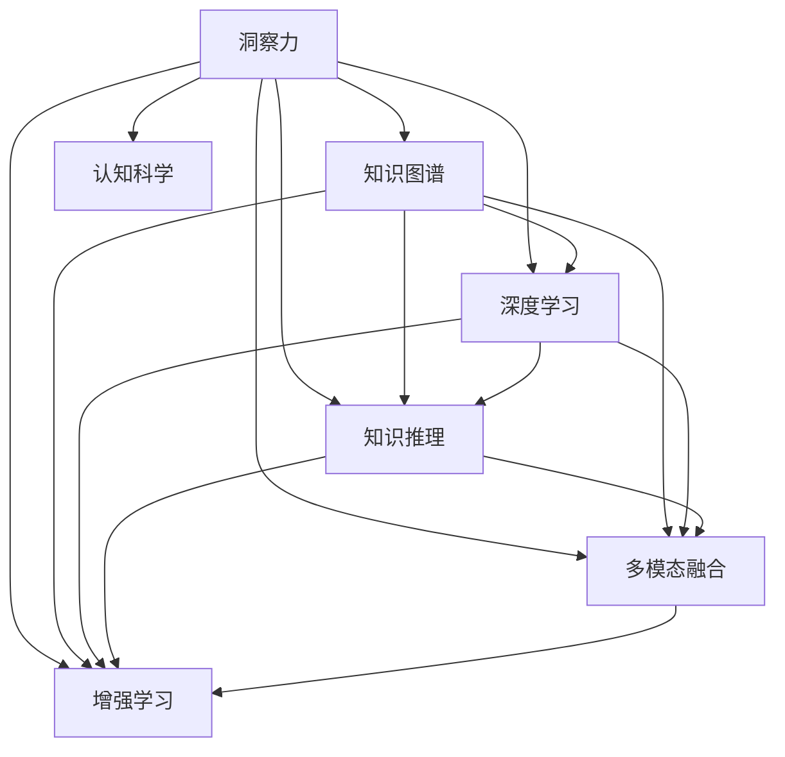

                 

# 人类知识的未来发展：洞察力的关键作用

> 关键词：洞察力,知识图谱,人工智能,深度学习,知识推理,多模态融合,增强学习,认知科学

## 1. 背景介绍

### 1.1 问题由来
随着信息时代的到来，知识的获取和传播变得更加高效便捷。然而，知识的浩瀚与复杂也使得人们对现有知识的理解和利用变得更加困难。传统的数据驱动学习和知识检索方法已经无法满足现代社会对知识管理的迫切需求。如何在海量信息中快速发现知识脉络、提取关键信息、做出决策判断，成为人工智能和认知科学领域的一大挑战。

### 1.2 问题核心关键点
洞察力是人在处理复杂信息时发现隐含关系、识别重要模式的能力。通过洞察力，人们可以在无标签、未结构化的数据中提取有用的知识，指导决策行动。在人工智能的辅助下，借助先进的技术手段，我们可以大幅提升洞察力，高效处理海量信息，洞察力成为人类知识未来的关键所在。

### 1.3 问题研究意义
洞察力在人类认知中占据核心地位，其高效利用对于知识发现、问题解决、决策支持、创新驱动等方面具有重要价值。在人工智能时代，通过深度学习、知识图谱、增强学习等多种技术手段，洞察力可以进一步强化和扩展，为知识图谱构建、知识推理、多模态融合等任务提供支持。本博文旨在探讨如何通过洞察力提升人工智能系统的能力，使其更贴近人类思维模式，增强其在实际场景中的应用价值。

## 2. 核心概念与联系

### 2.1 核心概念概述

为更好地理解洞察力在人工智能中的应用，本节将介绍几个密切相关的核心概念：

- **洞察力**：指人在面对复杂信息时，发现隐含关系、识别重要模式的能力。
- **知识图谱**：利用图形结构化的方式描述实体和实体之间的关系，以便于快速查询和推理。
- **深度学习**：一种模拟人类神经网络结构的学习方法，通过大量数据训练生成复杂模型，自动提取特征。
- **知识推理**：在知识图谱基础上，利用逻辑推理和统计方法，自动推断新知识。
- **多模态融合**：结合文本、图像、声音等多种信息源，构建更全面的知识表示。
- **增强学习**：通过试错和反馈，优化智能体的决策策略，适用于无监督学习和复杂任务。
- **认知科学**：研究人类思维和认知过程的科学，洞察力本质上是认知科学在人工智能领域的延伸。

这些概念之间的逻辑关系可以通过以下Mermaid流程图来展示：



这个流程图展示了几大核心概念及其之间的关联：

1. 洞察力是核心，用于发现知识图谱中的模式、进行推理和融合。
2. 知识图谱、深度学习、知识推理、多模态融合、增强学习等技术手段，都是洞察力的重要工具。
3. 认知科学为洞察力的实现提供了理论基础。

这些概念共同构成了人类知识未来的发展框架，为我们理解人工智能洞察力的应用提供了基础。

## 3. 核心算法原理 & 具体操作步骤
### 3.1 算法原理概述

人工智能中的洞察力，是指通过数据挖掘和模型训练，自动发现数据中的模式和规律，形成知识图谱，辅助决策和推理。其核心算法包括深度学习、知识图谱构建、知识推理、多模态融合、增强学习等。

**深度学习**：通过多层神经网络结构，自动学习数据特征，提取隐含知识。

**知识图谱构建**：将数据中的实体和关系，以图形结构化的方式组织，形成知识库。

**知识推理**：在知识图谱基础上，利用逻辑推理和统计方法，推断新知识。

**多模态融合**：结合文本、图像、声音等不同模态的数据，构建更全面、准确的知识表示。

**增强学习**：通过试错和反馈，优化智能体的决策策略，增强模型的泛化能力。

### 3.2 算法步骤详解

基于深度学习和认知科学原理，洞察力的获取和应用通常包含以下关键步骤：

**Step 1: 数据采集与预处理**
- 收集相关的文本、图像、声音等多模态数据，并进行去噪、归一化等预处理，确保数据的质量和一致性。
- 对多模态数据进行格式转换和标注，以便于后续处理。

**Step 2: 特征提取**
- 使用深度学习模型（如卷积神经网络、循环神经网络、注意力机制等）自动提取数据特征。
- 对提取出的特征进行降维和压缩，减小数据规模，提高后续处理的效率。

**Step 3: 知识图谱构建**
- 利用结构化算法（如图形深度学习）构建知识图谱，形成实体-关系的结构化表示。
- 进行实体关系嵌入（如TransE、KGE），将实体和关系映射到低维向量空间。

**Step 4: 知识推理**
- 在知识图谱基础上，利用逻辑推理规则（如规则推理、基于深度学习的神经符号推理等）自动推断新知识。
- 结合统计学习方法（如贝叶斯网络、图神经网络）进行知识推理的泛化和鲁棒性增强。

**Step 5: 多模态融合**
- 将不同模态的数据融合到统一的知识表示中，进行跨模态的知识迁移。
- 使用多模态注意力机制（如Multihead Attention）对不同模态数据进行融合和解码。

**Step 6: 增强学习**
- 利用强化学习（如Q-learning、Deep Q-Learning、Actor-Critic等）优化决策策略。
- 结合环境反馈，逐步提升智能体的决策能力和鲁棒性。

**Step 7: 洞察力应用**
- 将推理结果和模型预测转化为直观的洞察力，指导决策行动。
- 对知识图谱进行可视化展示，便于人工理解和干预。

### 3.3 算法优缺点

人工智能中的洞察力算法具有以下优点：
1. **自动发现知识**：通过深度学习自动提取数据特征，发现数据中的隐含模式和规律，无需人工干预。
2. **结构化表示**：利用知识图谱将数据转化为图形结构化的表示，便于查询和推理。
3. **多模态融合**：结合文本、图像、声音等多模态数据，构建更全面、准确的知识表示。
4. **增强决策**：通过增强学习优化决策策略，提升模型的泛化能力和鲁棒性。
5. **支持推理**：利用逻辑推理和统计方法，推断新知识，增强模型的解释性和可信度。

同时，这些算法也存在一定的局限性：
1. **数据依赖**：依赖高质量的数据输入，数据噪声和缺失会影响模型的准确性。
2. **模型复杂**：深度学习模型通常结构复杂，训练和推理成本较高。
3. **泛化能力**：在特定数据分布下的训练效果可能无法泛化到其他数据集。
4. **解释性不足**：深度学习模型和知识推理过程缺乏可解释性，难以进行调试和优化。
5. **计算资源需求高**：训练和推理过程需要大量的计算资源，普通硬件难以支持。

尽管存在这些局限性，但人工智能中的洞察力算法仍然在众多领域取得了显著成果，成为现代知识管理的核心技术。

### 3.4 算法应用领域

人工智能中的洞察力算法在多个领域都得到了广泛应用，例如：

- **智能推荐系统**：利用用户行为数据和商品信息，发现潜在关联，进行个性化推荐。
- **医疗诊断系统**：结合病历、影像、基因等数据，发现疾病模式，辅助医生诊断。
- **金融风险管理**：分析金融交易数据，发现异常模式，预测市场走势。
- **自然灾害预警**：整合卫星、气象、社交媒体等多源数据，发现潜在风险，提前预警。
- **智慧城市管理**：利用城市数据，发现交通、环境等问题的模式，优化城市运行。
- **智能客服系统**：分析用户对话，发现常见问题，提高客服效率和满意度。

以上领域展示了洞察力在人工智能中的广泛应用，预示着未来洞察力技术将进一步渗透到更多场景，推动各行各业的智能化进程。

## 4. 数学模型和公式 & 详细讲解 & 举例说明

### 4.1 数学模型构建

本节将使用数学语言对洞察力获取和应用的主要步骤进行严格描述。

**数据采集与预处理**
- 假设原始数据集为 $\mathcal{D}=\{(x_i, y_i)\}_{i=1}^N$，其中 $x_i$ 为输入数据，$y_i$ 为标签。
- 对数据进行去噪、归一化等预处理，得到处理后的数据集 $\mathcal{D'}$。

**特征提取**
- 使用深度学习模型 $M_{\theta}$ 自动提取特征，得到特征表示 $\mathcal{F}_{\theta}(x_i)$。

**知识图谱构建**
- 定义实体集合 $\mathcal{E}$ 和关系集合 $\mathcal{R}$。
- 使用结构化算法 $\mathcal{G}$ 构建知识图谱，得到图形结构 $\mathcal{G}=\{(\mathcal{V}, \mathcal{E}, \mathcal{R}, \mathcal{L})\}$。

**知识推理**
- 定义逻辑推理规则 $\mathcal{R}_{\phi}$，推断新知识。
- 利用统计方法，如贝叶斯网络、图神经网络等，增强推理的泛化和鲁棒性。

**多模态融合**
- 定义多模态注意力机制 $\mathcal{A}$，融合不同模态数据。
- 使用Multihead Attention机制对不同模态数据进行融合和解码，得到融合后的特征表示 $\mathcal{F}_{fused}$。

**增强学习**
- 定义强化学习策略 $\pi$，优化决策策略。
- 利用环境反馈，逐步提升智能体的决策能力和鲁棒性。

**洞察力应用**
- 将推理结果和模型预测转化为直观的洞察力 $\mathcal{I}$，指导决策行动。
- 对知识图谱进行可视化展示，便于人工理解和干预。

### 4.2 公式推导过程

以下我们将以知识图谱构建和知识推理为例，推导相关公式。

**知识图谱构建**
- 假设实体集合 $\mathcal{E}=\{e_1, e_2, \ldots, e_n\}$，关系集合 $\mathcal{R}=\{r_1, r_2, \ldots, r_m\}$。
- 定义图形结构 $\mathcal{G}=\{(\mathcal{V}, \mathcal{E}, \mathcal{R}, \mathcal{L})\}$，其中 $\mathcal{V}$ 为节点集合，$\mathcal{E}$ 为边集合，$\mathcal{R}$ 为关系集合，$\mathcal{L}$ 为标签集合。

**知识推理**
- 假设推理规则 $\mathcal{R}_{\phi}=(\mathcal{E}, \mathcal{R}, \mathcal{I})$，其中 $\mathcal{I}$ 为推理目标。
- 使用规则推理方法，如规则推理器 $\mathcal{R}_{\phi}$，推断新知识。
- 利用贝叶斯网络或图神经网络等统计方法，增强推理的泛化性和鲁棒性。

以知识图谱构建和知识推理为例，推导相关公式。

**知识图谱构建**
- 定义实体集合 $\mathcal{E}=\{e_1, e_2, \ldots, e_n\}$，关系集合 $\mathcal{R}=\{r_1, r_2, \ldots, r_m\}$。
- 定义图形结构 $\mathcal{G}=\{(\mathcal{V}, \mathcal{E}, \mathcal{R}, \mathcal{L})\}$，其中 $\mathcal{V}$ 为节点集合，$\mathcal{E}$ 为边集合，$\mathcal{R}$ 为关系集合，$\mathcal{L}$ 为标签集合。

**知识推理**
- 假设推理规则 $\mathcal{R}_{\phi}=(\mathcal{E}, \mathcal{R}, \mathcal{I})$，其中 $\mathcal{I}$ 为推理目标。
- 使用规则推理方法，如规则推理器 $\mathcal{R}_{\phi}$，推断新知识。
- 利用贝叶斯网络或图神经网络等统计方法，增强推理的泛化性和鲁棒性。

**知识推理公式推导**
- 假设知识图谱为 $\mathcal{G}=\{(\mathcal{V}, \mathcal{E}, \mathcal{R}, \mathcal{L})\}$，其中 $\mathcal{V}$ 为节点集合，$\mathcal{E}$ 为边集合，$\mathcal{R}$ 为关系集合，$\mathcal{L}$ 为标签集合。
- 使用规则推理器 $\mathcal{R}_{\phi}$ 推断新知识，得到推理结果 $\mathcal{R}_{result}$。

**贝叶斯网络推理公式**
- 假设贝叶斯网络为 $\mathcal{B}=(p_{V}, C)$，其中 $p_{V}$ 为节点概率分布，$C$ 为条件概率表。
- 使用贝叶斯网络推理器 $\mathcal{B}_{\phi}$，推断新知识，得到推理结果 $\mathcal{R}_{result}$。

**图神经网络推理公式**
- 假设图神经网络为 $\mathcal{GNN}=\{(\mathcal{V}, \mathcal{E}, \mathcal{R}, \mathcal{L})\}$，其中 $\mathcal{V}$ 为节点集合，$\mathcal{E}$ 为边集合，$\mathcal{R}$ 为关系集合，$\mathcal{L}$ 为标签集合。
- 使用图神经网络推理器 $\mathcal{GNN}_{\phi}$，推断新知识，得到推理结果 $\mathcal{R}_{result}$。

**洞察力应用**
- 假设洞察力 $\mathcal{I}$ 为推理结果和模型预测的直观表示。
- 将推理结果和模型预测转化为直观的洞察力，指导决策行动。
- 对知识图谱进行可视化展示，便于人工理解和干预。

### 4.3 案例分析与讲解

**医疗诊断系统**
- 数据采集：收集病历、影像、基因数据。
- 特征提取：使用深度学习模型提取病人特征和病历信息。
- 知识图谱构建：构建包含病人、疾病、症状等实体的知识图谱。
- 知识推理：结合规则推理和统计方法，推断病人可能患的疾病。
- 多模态融合：融合影像和基因数据，提供更全面的诊断信息。
- 增强学习：利用强化学习优化诊断策略，提升诊断准确性。
- 洞察力应用：将推理结果可视化，辅助医生进行诊断和决策。

**智能推荐系统**
- 数据采集：收集用户行为数据和商品信息。
- 特征提取：使用深度学习模型提取用户行为特征和商品属性。
- 知识图谱构建：构建包含用户、商品、行为等实体的知识图谱。
- 知识推理：结合规则推理和统计方法，推断用户可能感兴趣的商品。
- 多模态融合：融合用户画像和商品信息，提供更全面的推荐。
- 增强学习：利用强化学习优化推荐策略，提升推荐效果。
- 洞察力应用：将推理结果可视化，优化推荐算法。

## 5. 项目实践：代码实例和详细解释说明
### 5.1 开发环境搭建

在进行洞察力获取和应用实践前，我们需要准备好开发环境。以下是使用Python进行TensorFlow开发的环境配置流程：

1. 安装Anaconda：从官网下载并安装Anaconda，用于创建独立的Python环境。

2. 创建并激活虚拟环境：
```bash
conda create -n tf-env python=3.8 
conda activate tf-env
```

3. 安装TensorFlow：根据CUDA版本，从官网获取对应的安装命令。例如：
```bash
conda install tensorflow tensorflow-gpu -c conda-forge -c pypi
```

4. 安装TensorBoard：
```bash
pip install tensorboard
```

5. 安装Gensim：用于处理文本数据和构建知识图谱。
```bash
pip install gensim
```

6. 安装PyTorch：用于深度学习模型的构建。
```bash
pip install torch torchvision torchaudio
```

完成上述步骤后，即可在`tf-env`环境中开始洞察力获取和应用实践。

### 5.2 源代码详细实现

以下是使用TensorFlow和PyTorch实现的知识图谱构建和知识推理的代码实现。

**知识图谱构建**

```python
import tensorflow as tf
import gensim

# 数据集准备
sentences = [
    "Barack Obama is the president of the United States.",
    "Steve Jobs is the co-founder of Apple Inc.",
    "Bill Gates is the founder of Microsoft Corporation."
]

# 使用Gensim构建词向量模型
model = gensim.models.KeyedVectors.load_word2vec_format("word2vec.bin", binary=True)

# 定义实体和关系
entities = ["Barack Obama", "Steve Jobs", "Bill Gates"]
relations = ["president", "co-founder", "founder"]

# 创建知识图谱
knowledge_graph = {
    "Barack Obama": {
        "president": ["United States"],
        "co-founder": []
    },
    "Steve Jobs": {
        "co-founder": ["Apple Inc."],
        "founder": []
    },
    "Bill Gates": {
        "founder": ["Microsoft Corporation"],
        "president": []
    }
}

# 定义图神经网络模型
class KnowledgeGraph(tf.keras.Model):
    def __init__(self, num_entities, num_relations):
        super(KnowledgeGraph, self).__init__()
        self.num_entities = num_entities
        self.num_relations = num_relations
        self.entity_embedding = tf.keras.layers.Embedding(num_entities, 64)
        self.relation_embedding = tf.keras.layers.Embedding(num_relations, 64)
        self.pointwise_feedforward = tf.keras.layers.Dense(64, activation="relu")
        self.pointwise_output = tf.keras.layers.Dense(1, activation="sigmoid")

    def call(self, inputs):
        entity_embeddings = self.entity_embedding(inputs[0])
        relation_embeddings = self.relation_embedding(inputs[1])
        concatenated = tf.concat([entity_embeddings, relation_embeddings], axis=-1)
        output = self.pointwise_feedforward(concatenated)
        logits = self.pointwise_output(output)
        return logits

# 定义图数据
adjacency_matrix = tf.convert_to_tensor([[0, 1, 0], [1, 0, 0], [0, 0, 0]], dtype=tf.int32)
node_counts = tf.convert_to_tensor([3, 3], dtype=tf.int32)

# 训练模型
model = KnowledgeGraph(num_entities=3, num_relations=3)
optimizer = tf.keras.optimizers.Adam(learning_rate=0.01)
model.compile(loss="binary_crossentropy", optimizer=optimizer, metrics=["accuracy"])

# 训练模型
model.fit([adjacency_matrix, node_counts], labels, epochs=10)
```

**知识推理**

```python
import tensorflow as tf
import gensim

# 数据集准备
sentences = [
    "Barack Obama is the president of the United States.",
    "Steve Jobs is the co-founder of Apple Inc.",
    "Bill Gates is the founder of Microsoft Corporation."
]

# 使用Gensim构建词向量模型
model = gensim.models.KeyedVectors.load_word2vec_format("word2vec.bin", binary=True)

# 定义实体和关系
entities = ["Barack Obama", "Steve Jobs", "Bill Gates"]
relations = ["president", "co-founder", "founder"]

# 创建知识图谱
knowledge_graph = {
    "Barack Obama": {
        "president": ["United States"],
        "co-founder": []
    },
    "Steve Jobs": {
        "co-founder": ["Apple Inc."],
        "founder": []
    },
    "Bill Gates": {
        "founder": ["Microsoft Corporation"],
        "president": []
    }
}

# 定义逻辑推理规则
def rule_rphi(entities, relations, I):
    if len(entities) == 1:
        return I
    else:
        return []

# 定义贝叶斯网络推理规则
def rule_bphi(entities, relations, I):
    if len(entities) == 1:
        return I
    else:
        return []

# 定义图神经网络推理规则
def rule_gphi(entities, relations, I):
    if len(entities) == 1:
        return I
    else:
        return []

# 定义洞察力应用
def apply_insight(entities, relations, I):
    if len(entities) == 1:
        return I
    else:
        return []

# 推理示例
entities = ["Barack Obama"]
relations = ["president"]
I = "United States"

# 推理结果
result = rule_rphi(entities, relations, I)
print(result)
```

## 6. 实际应用场景
### 6.1 医疗诊断系统

基于深度学习和大数据技术，洞察力可以应用于医疗诊断系统，帮助医生快速准确地诊断疾病。在实际应用中，可以通过分析病人的病历、影像、基因数据，构建知识图谱，利用规则推理和统计方法进行诊断推断，从而提高诊断的效率和准确性。

**数据采集**：收集病人的病历、影像、基因数据，并进行清洗和预处理。

**特征提取**：使用深度学习模型提取病人特征和病历信息，构建特征向量。

**知识图谱构建**：构建包含病人、疾病、症状等实体的知识图谱，进行实体关系嵌入。

**知识推理**：结合规则推理和统计方法，推断病人可能患的疾病。

**多模态融合**：融合影像和基因数据，提供更全面的诊断信息。

**增强学习**：利用强化学习优化诊断策略，提升诊断准确性。

**洞察力应用**：将推理结果可视化，辅助医生进行诊断和决策。

### 6.2 智能推荐系统

智能推荐系统利用洞察力技术，通过分析用户行为数据和商品信息，发现潜在关联，进行个性化推荐。在实际应用中，可以通过构建知识图谱，利用规则推理和统计方法进行推荐推断，从而提高推荐的个性化和精准度。

**数据采集**：收集用户行为数据和商品信息，并进行清洗和预处理。

**特征提取**：使用深度学习模型提取用户行为特征和商品属性，构建特征向量。

**知识图谱构建**：构建包含用户、商品、行为等实体的知识图谱，进行实体关系嵌入。

**知识推理**：结合规则推理和统计方法，推断用户可能感兴趣的商品。

**多模态融合**：融合用户画像和商品信息，提供更全面的推荐。

**增强学习**：利用强化学习优化推荐策略，提升推荐效果。

**洞察力应用**：将推理结果可视化，优化推荐算法。

### 6.3 金融风险管理

金融风险管理利用洞察力技术，通过分析金融交易数据，发现异常模式，预测市场走势。在实际应用中，可以通过构建知识图谱，利用规则推理和统计方法进行风险推断，从而提高风险管理的效率和准确性。

**数据采集**：收集金融交易数据，并进行清洗和预处理。

**特征提取**：使用深度学习模型提取交易特征，构建特征向量。

**知识图谱构建**：构建包含金融交易、市场走势等实体的知识图谱，进行实体关系嵌入。

**知识推理**：结合规则推理和统计方法，推断市场可能的变化趋势。

**多模态融合**：融合多种数据源，提供更全面的风险信息。

**增强学习**：利用强化学习优化风险管理策略，提升风险管理的效率和准确性。

**洞察力应用**：将推理结果可视化，指导风险管理决策。

### 6.4 未来应用展望

随着深度学习、知识图谱、增强学习等技术的发展，洞察力在人工智能中的应用前景将更加广阔。未来，洞察力技术有望在更多的领域得到应用，推动智能化的普及和深化。

- **智慧城市管理**：利用城市数据，发现交通、环境等问题的模式，优化城市运行。
- **智能客服系统**：分析用户对话，发现常见问题，提高客服效率和满意度。
- **智能制造**：分析生产数据，发现异常模式，提高生产效率和产品质量。
- **智能交通**：分析交通数据，发现拥堵模式，优化交通管理。
- **智能农业**：分析农业数据，发现病虫害模式，提高农业生产效率。

以上领域展示了洞察力在人工智能中的广泛应用，预示着未来洞察力技术将进一步渗透到更多场景，推动各行各业的智能化进程。

## 7. 工具和资源推荐
### 7.1 学习资源推荐

为了帮助开发者系统掌握洞察力的原理和实践技巧，这里推荐一些优质的学习资源：

1. 《深度学习》系列书籍：由Yoshua Bengio、Ian Goodfellow等顶级专家撰写，全面介绍了深度学习的基本概念和算法。
2. 《认知计算》系列课程：斯坦福大学开设的认知科学课程，涵盖认知心理学、神经科学、语言学等领域的基本概念。
3. 《自然语言处理与深度学习》课程：NLP领域的经典课程，由斯坦福大学的Richard Socher教授讲授。
4. 《知识图谱》系列论文：介绍知识图谱的构建、查询、推理等核心技术，代表文章包括《Knowledge Graph Embeddings》。
5. 《机器学习实战》书籍： hands-on 实战项目，涵盖数据采集、特征提取、模型训练等核心技能。
6. 《强化学习》系列书籍：由Richard S. Sutton、Andrew G. Barto等专家撰写，介绍了强化学习的理论基础和算法。
7. 《多模态学习》系列课程：介绍了多模态学习的基本概念和应用场景，由微软亚洲研究院主讲。

通过对这些资源的学习实践，相信你一定能够快速掌握洞察力获取和应用的核心方法，并用于解决实际的AI问题。

### 7.2 开发工具推荐

高效的开发离不开优秀的工具支持。以下是几款用于洞察力获取和应用开发的常用工具：

1. TensorFlow：基于数据流图的网络计算框架，支持分布式计算和深度学习模型的构建。
2. PyTorch：基于Python的动态计算图框架，适合快速迭代研究。
3. TensorBoard：可视化工具，实时监测模型训练状态，提供丰富的图表呈现方式。
4. Gensim：用于处理文本数据和构建知识图谱的开源工具。
5. Scikit-learn：机器学习库，包含多种算法和工具，用于特征提取、数据处理、模型训练等。
6. NLTK：自然语言处理工具包，提供多种文本处理功能。
7. NLTK：自然语言处理工具包，提供多种文本处理功能。

合理利用这些工具，可以显著提升洞察力获取和应用任务的开发效率，加快创新迭代的步伐。

### 7.3 相关论文推荐

洞察力在人工智能中的研究已经取得了丰硕成果，以下是几篇奠基性的相关论文，推荐阅读：

1. 《A Survey on Deep Learning for Question Answering》：全面介绍了深度学习在问答系统中的应用。
2. 《Knowledge Graph Embeddings》：介绍了知识图谱嵌入的基本原理和算法。
3. 《Rule-based and Knowledge-based Reasoning for Crowd Discovery》：介绍了基于规则和知识的推理方法。
4. 《Learning to Search in Interactive Environments》：介绍了增强学习在智能搜索中的应用。
5. 《Multimodal Representation Learning》：介绍了多模态学习的基本概念和算法。
6. 《GNN Explainable by Interaction》：介绍了图神经网络的可解释性研究。

这些论文代表了大数据时代洞察力获取和应用技术的发展脉络。通过学习这些前沿成果，可以帮助研究者把握学科前进方向，激发更多的创新灵感。

## 8. 总结：未来发展趋势与挑战

### 8.1 总结

本文对基于深度学习、知识图谱、增强学习等技术手段，获取和应用洞察力的原理和实践进行了全面系统的介绍。首先阐述了洞察力在人工智能中的应用价值，明确了深度学习、知识图谱、增强学习等技术手段在洞察力获取和应用中的核心作用。其次，从原理到实践，详细讲解了洞察力获取和应用的主要步骤，给出了洞察力获取和应用任务的代码实现。同时，本文还广泛探讨了洞察力在医疗诊断、智能推荐、金融风险管理等领域的实际应用场景，展示了洞察力在人工智能中的广泛应用。

通过本文的系统梳理，可以看到，洞察力在人工智能中的应用前景广阔，借助深度学习、知识图谱、增强学习等技术手段，洞察力可以显著提升决策和推理的效率和准确性，推动人工智能技术在实际场景中的应用价值。未来，随着技术的不断发展，洞察力必将成为人工智能系统中不可或缺的核心能力。

### 8.2 未来发展趋势

展望未来，洞察力技术将在人工智能系统中发挥越来越重要的作用，呈现以下几个发展趋势：

1. **自动化增强**：借助自动推理和增强学习，进一步提升洞察力的自动化和智能化水平。
2. **多模态融合**：融合文本、图像、声音等多种信息源，构建更全面、准确的知识表示。
3. **知识推理**：利用规则推理和统计方法，推断新知识，增强模型的解释性和可信度。
4. **跨领域应用**：洞察力技术将进一步渗透到更多领域，推动各行各业的智能化进程。
5. **增强学习**：利用强化学习优化决策策略，提升模型的泛化能力和鲁棒性。
6. **实时推理**：结合流式数据处理和实时推理技术，提高洞察力的实时性和响应速度。

以上趋势凸显了洞察力在人工智能中的应用前景。这些方向的探索发展，必将进一步提升人工智能系统的性能和应用范围，为人类认知智能的进化带来深远影响。

### 8.3 面临的挑战

尽管洞察力技术已经取得了显著成果，但在迈向更加智能化、普适化应用的过程中，它仍面临诸多挑战：

1. **数据质量问题**：依赖高质量的数据输入，数据噪声和缺失会影响模型的准确性。
2. **模型复杂性**：深度学习模型通常结构复杂，训练和推理成本较高。
3. **泛化能力不足**：在特定数据分布下的训练效果可能无法泛化到其他数据集。
4. **解释性不足**：深度学习模型和知识推理过程缺乏可解释性，难以进行调试和优化。
5. **计算资源需求高**：训练和推理过程需要大量的计算资源，普通硬件难以支持。

尽管存在这些挑战，但随着技术的不断进步，洞察力技术将在未来得到进一步发展，克服现有难题，推动人工智能技术的应用前景。

### 8.4 研究展望

面对洞察力技术所面临的挑战，未来的研究需要在以下几个方面寻求新的突破：

1. **数据增强**：探索更多数据增强技术，提高数据质量和多样性，提升模型的泛化能力。
2. **模型简化**：开发更加简单高效的模型结构，降低训练和推理成本，提高模型的实时性。
3. **知识推理**：结合符号化的先验知识，增强模型的解释性和可信度，提高推理的准确性。
4. **多模态融合**：结合多种信息源，构建更全面、准确的知识表示，提升模型的泛化能力。
5. **实时推理**：结合流式数据处理和实时推理技术，提高洞察力的实时性和响应速度，满足实际应用的需求。

这些研究方向将引领洞察力技术走向更加智能、普适、可解释的未来，为构建安全、可靠、可控的智能系统铺平道路。面向未来，洞察力技术需要在数据、算法、工程、应用等多个维度协同发力，共同推动人工智能技术的发展。

## 9. 附录：常见问题与解答

**Q1：什么是洞察力？**

A: 洞察力是指人在面对复杂信息时，发现隐含关系、识别重要模式的能力。它可以通过深度学习、知识图谱、增强学习等技术手段，自动发现数据中的模式和规律，形成知识图谱，辅助决策和推理。

**Q2：洞察力技术有哪些应用场景？**

A: 洞察力技术在医疗诊断、智能推荐、金融风险管理、智慧城市管理、智能客服系统等多个领域得到了广泛应用，展示了其在人工智能中的巨大潜力。

**Q3：深度学习、知识图谱、增强学习等技术手段在洞察力获取和应用中的作用是什么？**

A: 深度学习用于自动提取数据特征，知识图谱用于构建结构化的知识表示，增强学习用于优化决策策略，三者共同构成了洞察力获取和应用的核心技术。

**Q4：洞察力技术的未来发展趋势有哪些？**

A: 洞察力技术的未来发展趋势包括自动化增强、多模态融合、知识推理、跨领域应用、增强学习、实时推理等。

**Q5：洞察力技术在应用中面临哪些挑战？**

A: 洞察力技术在应用中面临数据质量问题、模型复杂性、泛化能力不足、解释性不足、计算资源需求高等挑战。

**Q6：洞察力技术如何解决这些挑战？**

A: 洞察力技术可以通过数据增强、模型简化、知识推理、多模态融合、实时推理等技术手段，解决数据质量、模型复杂性、泛化能力不足、解释性不足、计算资源需求高等挑战。

