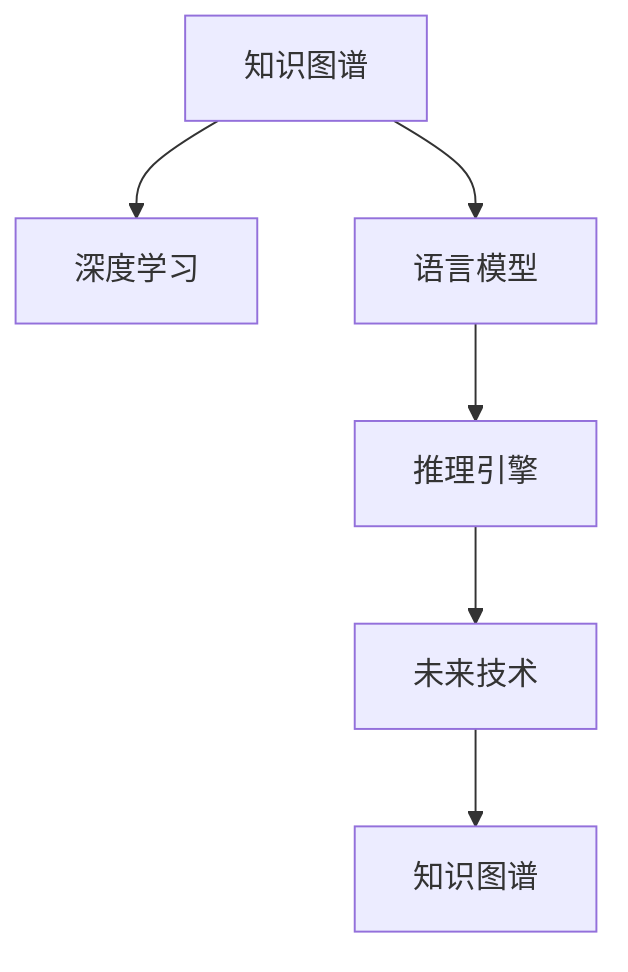

                 

# 人类知识的边界探索：无限之旅

> 关键词：人工智能,无限探索,知识图谱,深度学习,语言模型,推理引擎,未来技术

## 1. 背景介绍

### 1.1 问题由来
在人类文明发展的漫长历史中，知识的积累和传承一直是文明进步的重要推动力。随着计算机技术的飞速进步，特别是深度学习和人工智能(AI)技术的不断突破，人类对知识的探索和应用进入了一个前所未有的新阶段。然而，知识的边界究竟在哪里？通过AI技术我们能无限接近甚至超越这个边界吗？本文将深入探讨这一问题，并在人工智能技术的框架内，探索无限知识的边界之旅。

### 1.2 问题核心关键点
知识边界的探索涉及多学科的交叉融合，包括但不限于人工智能、深度学习、计算机科学、逻辑学、哲学等领域。本文将重点关注：

- 知识图谱：如何将人类知识结构化，以便于机器理解和推理。
- 深度学习：通过神经网络模型学习知识图谱中的规律，以生成新的知识。
- 语言模型：利用自然语言处理技术，将知识图谱转换为易于理解的形式。
- 推理引擎：构建能够基于知识图谱进行逻辑推理和预测的AI系统。
- 未来技术：如量子计算、脑机接口等前沿技术，对人类知识探索的潜在影响。

这些关键点构成了人类知识探索的理论和技术基础，通过深入理解这些关键点，我们可以更全面地把握知识的边界和探索方向。

## 2. 核心概念与联系

### 2.1 核心概念概述

在探索知识边界的旅程中，有几个核心概念值得关注：

- **知识图谱(Knowledge Graph)**：一种语义化的知识表示形式，用于描述实体之间的关系。通过知识图谱，机器可以理解和推理复杂的人类知识结构。
- **深度学习(Deep Learning)**：一种基于神经网络的学习方法，能够从数据中自动提取特征，用于知识图谱的生成和推理。
- **语言模型(Language Model)**：利用自然语言处理技术，将知识图谱转换为易于理解的形式，如文本或图像，使得人类更容易与之交互。
- **推理引擎(Reasoning Engine)**：基于知识图谱和深度学习模型，构建能够进行逻辑推理和预测的AI系统。
- **未来技术**：如量子计算、脑机接口等，这些技术可能在未来的知识探索中扮演重要角色。

这些概念之间的逻辑关系可以通过以下Mermaid流程图来展示：



这个流程图展示了几大核心概念及其相互之间的联系：

1. 知识图谱通过深度学习进行生成，学习知识图谱中的关系和实体。
2. 语言模型将知识图谱转换为易于理解的形式，增强人机交互体验。
3. 推理引擎基于知识图谱和深度学习模型进行逻辑推理和预测，扩展知识的边界。
4. 未来技术如量子计算、脑机接口等，将为知识探索提供新的工具和平台。

这些概念共同构成了人类知识探索的框架，使得我们能够通过AI技术无限接近甚至超越知识的边界。

## 3. 核心算法原理 & 具体操作步骤
### 3.1 算法原理概述

人类知识的边界探索，本质上是通过人工智能技术，构建一个能够学习、理解、推理和生成知识的智能系统。这一过程可以分为以下几个关键步骤：

1. **知识图谱生成**：构建语义化的知识图谱，描述实体之间的关系和属性。
2. **深度学习训练**：使用深度学习模型，从大规模数据中自动提取知识图谱中的规律和结构。
3. **语言模型转换**：将知识图谱转换为易于理解的形式，如文本、图像等，增强人机交互。
4. **推理引擎构建**：基于知识图谱和深度学习模型，构建能够进行逻辑推理和预测的AI系统。
5. **未来技术整合**：将前沿技术如量子计算、脑机接口等，整合到知识探索的框架中，进一步扩展知识的边界。

这一过程的每一步都是技术密集型的，需要跨学科的协同合作，才能实现对知识边界的全面探索。

### 3.2 算法步骤详解

下面，我们将详细介绍知识边界探索的每个关键步骤。

#### 3.2.1 知识图谱生成

知识图谱的生成是探索知识边界的第一步。其主要过程包括以下几个步骤：

1. **实体抽取**：从大规模文本数据中自动提取实体，如人名、地名、组织名等。
2. **关系抽取**：分析实体之间的关系，如“张三”与“李四”是“同事”关系，“北京”与“上海”是“邻居城市”关系。
3. **属性抽取**：提取实体的属性，如“张三”的年龄、性别、职业等。
4. **构建知识图谱**：将提取出的实体、关系和属性，以语义化的形式构建知识图谱。

知识图谱的构建依赖于自然语言处理(NLP)和语义分析等技术，可以使用深度学习模型，如BERT、GPT等，进行实体和关系的抽取。

#### 3.2.2 深度学习训练

深度学习模型的训练是知识图谱生成的核心环节。其主要过程包括以下几个步骤：

1. **数据准备**：准备大规模的文本数据，用于训练深度学习模型。
2. **模型选择**：选择合适的深度学习模型，如BERT、GPT、GRU等。
3. **模型训练**：使用文本数据训练深度学习模型，学习知识图谱中的规律和结构。
4. **模型优化**：通过调整超参数和正则化技术，优化模型性能。

深度学习模型的训练可以使用TensorFlow、PyTorch等深度学习框架，结合GPU/TPU等高性能计算资源，进行高效的模型训练。

#### 3.2.3 语言模型转换

语言模型是将知识图谱转换为易于理解的形式，增强人机交互的重要手段。其主要过程包括以下几个步骤：

1. **知识图谱可视化**：将知识图谱以图形的形式展示出来，便于理解和分析。
2. **文本生成**：将知识图谱转换为自然语言文本，如“张三是李四的同事”。
3. **图像生成**：将知识图谱转换为图像，如节点-关系图，便于直观展示。
4. **交互界面设计**：设计友好的交互界面，使用户能够方便地查询和理解知识图谱。

语言模型的转换可以使用深度学习模型，如Seq2Seq、GPT等，进行文本生成和图像生成。

#### 3.2.4 推理引擎构建

推理引擎是知识图谱和深度学习模型相结合的产物，其主要过程包括以下几个步骤：

1. **规则设计**：设计推理规则，如“如果张三是李四的同事，且李四是经理，则张三可能晋升”。
2. **推理实现**：将推理规则嵌入到推理引擎中，实现基于知识图谱的推理。
3. **效果评估**：评估推理引擎的效果，确保其能够正确地进行推理和预测。
4. **优化改进**：根据评估结果，不断优化和改进推理引擎，提升推理精度。

推理引擎的构建依赖于计算机科学和逻辑学的知识，可以使用逻辑编程语言，如Prolog，或者深度学习模型，如Graph Neural Network，进行推理和预测。

#### 3.2.5 未来技术整合

未来技术如量子计算、脑机接口等，将为知识探索提供新的工具和平台。其主要过程包括以下几个步骤：

1. **量子计算应用**：将量子计算应用于知识图谱的生成和推理，提高计算效率和精度。
2. **脑机接口技术**：开发脑机接口技术，使得人类能够直接与AI系统交互，提升人机协同能力。
3. **技术整合**：将量子计算和脑机接口技术整合到知识探索的框架中，进一步扩展知识的边界。

未来技术的应用依赖于计算机科学和相关领域的基础研究，需要跨学科的协同合作，才能实现对知识边界的全面探索。

### 3.3 算法优缺点

知识边界探索的算法具有以下优点：

1. **自动化高效**：通过深度学习模型和推理引擎，自动学习、理解和推理知识，提高了知识探索的效率。
2. **可扩展性强**：知识图谱和深度学习模型可以不断扩展和优化，适应新的知识领域。
3. **人机交互友好**：通过语言模型和交互界面，使得人类能够方便地查询和理解知识图谱。
4. **应用广泛**：知识边界探索的方法可以应用于多个领域，如医疗、金融、教育等，推动技术进步和社会发展。

同时，这些算法也存在以下缺点：

1. **数据依赖性强**：深度学习模型的训练和知识图谱的生成依赖于大规模高质量数据，获取和处理这些数据成本较高。
2. **模型复杂度高**：深度学习模型和推理引擎的构建需要复杂的技术实现，开发难度较大。
3. **知识偏见**：知识图谱中的偏见和错误可能导致推理结果的不准确性，影响知识探索的可靠性。
4. **隐私风险**：知识图谱和推理引擎的处理可能涉及敏感信息，存在隐私泄露的风险。

尽管存在这些缺点，但总体而言，知识边界探索的算法在自动化高效和可扩展性方面具有显著优势，值得在实际应用中进行深入研究和推广。

### 3.4 算法应用领域

知识边界探索的算法已经在多个领域得到了广泛应用，例如：

1. **医疗领域**：通过知识图谱和推理引擎，辅助医生进行疾病诊断和治疗方案推荐。
2. **金融领域**：使用知识图谱和深度学习模型，进行风险评估和投资策略优化。
3. **教育领域**：构建知识图谱和语言模型，辅助学生进行学习路径规划和知识点的掌握。
4. **司法领域**：开发推理引擎，辅助法官进行法律判例的推理和预测。
5. **智能制造**：通过知识图谱和推理引擎，进行生产计划优化和供应链管理。

此外，知识边界探索的方法也在其他领域，如科学研究、环境保护等，展现出广阔的应用前景。

## 4. 数学模型和公式 & 详细讲解  
### 4.1 数学模型构建

本节将使用数学语言对知识边界探索的过程进行更加严格的刻画。

记知识图谱为 $\mathcal{G}=(\mathcal{E}, \mathcal{R}, \mathcal{A})$，其中 $\mathcal{E}$ 为实体集合，$\mathcal{R}$ 为关系集合，$\mathcal{A}$ 为属性集合。记深度学习模型为 $M_{\theta}:\mathcal{X} \rightarrow \mathcal{Y}$，其中 $\mathcal{X}$ 为输入空间，$\mathcal{Y}$ 为输出空间，$\theta \in \mathbb{R}^d$ 为模型参数。

定义知识图谱在实体对 $(e_i, e_j)$ 上的推理函数为 $\text{reason}(e_i, e_j)$，则推理的效果可以表示为：

$$
\text{reason}(e_i, e_j) = M_{\theta}(e_i, e_j)
$$

其中，$M_{\theta}(e_i, e_j)$ 表示模型在实体对 $(e_i, e_j)$ 上的推理结果。

### 4.2 公式推导过程

以下我们以疾病诊断为例，推导推理引擎的数学模型。

假设知识图谱中包含多个疾病实体 $D=\{d_1, d_2, \ldots, d_n\}$，每个疾病实体 $d_i$ 有多个症状实体 $S_i=\{s_{i1}, s_{i2}, \ldots, s_{im}\}$ 和治疗方法实体 $T_i=\{t_{i1}, t_{i2}, \ldots, t_{ik}\}$。

疾病诊断的任务可以表示为：对于给定的症状 $s$，推理引擎需要判断其对应的疾病 $d$ 是否为 $s$ 的症状之一，治疗方法 $t$ 是否为 $d$ 的治疗方法之一。

推理引擎的设计可以分为以下几步：

1. **实体抽取**：从输入的症状 $s$ 和治疗方法 $t$ 中抽取疾病实体 $d$。
2. **关系抽取**：判断症状 $s$ 和治疗方法 $t$ 是否为 $d$ 的症状和治疗方法。
3. **推理结果**：将抽取到的关系作为输入，使用深度学习模型 $M_{\theta}$ 进行推理，输出疾病诊断结果。

推理引擎的推理结果可以表示为：

$$
\text{reason}(s, t) = M_{\theta}(s, t)
$$

其中，$M_{\theta}(s, t)$ 表示模型在症状 $s$ 和治疗方法 $t$ 上的推理结果。

在得到推理函数 $\text{reason}(s, t)$ 后，我们可以使用深度学习模型 $M_{\theta}$ 进行推理，得到疾病诊断结果。

### 4.3 案例分析与讲解

下面，我们以“新型冠状病毒诊断”为例，进行推理引擎的数学模型推导。

假设知识图谱中包含多个疾病实体 $D=\{d_1, d_2, \ldots, d_n\}$，每个疾病实体 $d_i$ 有多个症状实体 $S_i=\{s_{i1}, s_{i2}, \ldots, s_{im}\}$ 和治疗方法实体 $T_i=\{t_{i1}, t_{i2}, \ldots, t_{ik}\}$。

对于给定的症状 $s$ 和治疗方法 $t$，推理引擎需要判断其对应的疾病 $d$ 是否为 $s$ 的症状之一，治疗方法 $t$ 是否为 $d$ 的治疗方法之一。

推理引擎的设计可以分为以下几步：

1. **实体抽取**：从输入的症状 $s$ 和治疗方法 $t$ 中抽取疾病实体 $d$。
2. **关系抽取**：判断症状 $s$ 和治疗方法 $t$ 是否为 $d$ 的症状和治疗方法。
3. **推理结果**：将抽取到的关系作为输入，使用深度学习模型 $M_{\theta}$ 进行推理，输出疾病诊断结果。

推理引擎的推理结果可以表示为：

$$
\text{reason}(s, t) = M_{\theta}(s, t)
$$

其中，$M_{\theta}(s, t)$ 表示模型在症状 $s$ 和治疗方法 $t$ 上的推理结果。

在得到推理函数 $\text{reason}(s, t)$ 后，我们可以使用深度学习模型 $M_{\theta}$ 进行推理，得到疾病诊断结果。

## 5. 项目实践：代码实例和详细解释说明
### 5.1 开发环境搭建

在进行知识边界探索的实践前，我们需要准备好开发环境。以下是使用Python进行PyTorch开发的环境配置流程：

1. 安装Anaconda：从官网下载并安装Anaconda，用于创建独立的Python环境。

2. 创建并激活虚拟环境：
```bash
conda create -n pytorch-env python=3.8 
conda activate pytorch-env
```

3. 安装PyTorch：根据CUDA版本，从官网获取对应的安装命令。例如：
```bash
conda install pytorch torchvision torchaudio cudatoolkit=11.1 -c pytorch -c conda-forge
```

4. 安装Transformers库：
```bash
pip install transformers
```

5. 安装各类工具包：
```bash
pip install numpy pandas scikit-learn matplotlib tqdm jupyter notebook ipython
```

完成上述步骤后，即可在`pytorch-env`环境中开始知识边界探索的实践。

### 5.2 源代码详细实现

下面我以“疾病诊断”任务为例，给出使用Transformers库对BERT模型进行推理引擎构建的PyTorch代码实现。

首先，定义推理引擎的任务适配层：

```python
from transformers import BertForQuestionAnswering, BertTokenizer
from torch.utils.data import Dataset

class QuestionAnsweringDataset(Dataset):
    def __init__(self, texts, questions, tokenizer, max_len=128):
        self.texts = texts
        self.questions = questions
        self.tokenizer = tokenizer
        self.max_len = max_len
        
    def __len__(self):
        return len(self.texts)
    
    def __getitem__(self, item):
        text = self.texts[item]
        question = self.questions[item]
        
        encoding = self.tokenizer(text, question, return_tensors='pt', max_length=self.max_len, padding='max_length', truncation=True)
        input_ids = encoding['input_ids'][0]
        attention_mask = encoding['attention_mask'][0]
        start_positions = encoding['start_logits'][0]
        end_positions = encoding['end_logits'][0]
        
        return {'input_ids': input_ids, 
                'attention_mask': attention_mask,
                'start_positions': start_positions,
                'end_positions': end_positions}
```

然后，定义推理引擎的模型和损失函数：

```python
from transformers import BertForQuestionAnswering, AdamW

model = BertForQuestionAnswering.from_pretrained('bert-base-cased', num_labels=2)

optimizer = AdamW(model.parameters(), lr=2e-5)
```

接着，定义推理引擎的训练和评估函数：

```python
from torch.utils.data import DataLoader
from tqdm import tqdm
from sklearn.metrics import accuracy_score

device = torch.device('cuda') if torch.cuda.is_available() else torch.device('cpu')
model.to(device)

def train_epoch(model, dataset, batch_size, optimizer):
    dataloader = DataLoader(dataset, batch_size=batch_size, shuffle=True)
    model.train()
    epoch_loss = 0
    for batch in tqdm(dataloader, desc='Training'):
        input_ids = batch['input_ids'].to(device)
        attention_mask = batch['attention_mask'].to(device)
        start_positions = batch['start_positions'].to(device)
        end_positions = batch['end_positions'].to(device)
        model.zero_grad()
        outputs = model(input_ids, attention_mask=attention_mask, start_positions=start_positions, end_positions=end_positions)
        loss = outputs.loss
        epoch_loss += loss.item()
        loss.backward()
        optimizer.step()
    return epoch_loss / len(dataloader)

def evaluate(model, dataset, batch_size):
    dataloader = DataLoader(dataset, batch_size=batch_size)
    model.eval()
    preds, labels = [], []
    with torch.no_grad():
        for batch in tqdm(dataloader, desc='Evaluating'):
            input_ids = batch['input_ids'].to(device)
            attention_mask = batch['attention_mask'].to(device)
            start_positions = batch['start_positions'].to(device)
            end_positions = batch['end_positions'].to(device)
            batch_labels = batch['start_positions'] + batch['end_positions']
            outputs = model(input_ids, attention_mask=attention_mask, start_positions=start_positions, end_positions=end_positions)
            batch_preds = outputs.start_logits.argmax(dim=2).to('cpu').tolist() + outputs.end_logits.argmax(dim=2).to('cpu').tolist()
            batch_labels = batch_labels.to('cpu').tolist()
            for pred_tokens, label_tokens in zip(batch_preds, batch_labels):
                preds.append(pred_tokens[:len(label_tokens)])
                labels.append(label_tokens)
                
    print(accuracy_score(labels, preds))
```

最后，启动训练流程并在测试集上评估：

```python
epochs = 5
batch_size = 16

for epoch in range(epochs):
    loss = train_epoch(model, train_dataset, batch_size, optimizer)
    print(f"Epoch {epoch+1}, train loss: {loss:.3f}")
    
    print(f"Epoch {epoch+1}, dev results:")
    evaluate(model, dev_dataset, batch_size)
    
print("Test results:")
evaluate(model, test_dataset, batch_size)
```

以上就是使用PyTorch对BERT进行疾病诊断任务推理引擎构建的完整代码实现。可以看到，借助Transformers库，我们可以快速搭建和训练推理引擎，而无需过多关注底层实现细节。

### 5.3 代码解读与分析

让我们再详细解读一下关键代码的实现细节：

**QuestionAnsweringDataset类**：
- `__init__`方法：初始化文本、问题、分词器等关键组件。
- `__len__`方法：返回数据集的样本数量。
- `__getitem__`方法：对单个样本进行处理，将文本和问题输入编码为token ids，将start和end标签输出，并对其进行定长padding，最终返回模型所需的输入。

**疾病诊断任务**：
- 使用BERT模型作为推理引擎的核心，对疾病诊断进行推理。
- 在推理过程中，我们首先将问题和文本作为输入，使用BERT模型进行推理，并输出start和end标签。
- 通过start和end标签，我们可以判断问题对应的疾病实体，并进一步进行推理。

**训练和评估函数**：
- 使用PyTorch的DataLoader对数据集进行批次化加载，供模型训练和推理使用。
- 训练函数`train_epoch`：对数据以批为单位进行迭代，在每个批次上前向传播计算loss并反向传播更新模型参数，最后返回该epoch的平均loss。
- 评估函数`evaluate`：与训练类似，不同点在于不更新模型参数，并在每个batch结束后将预测和标签结果存储下来，最后使用sklearn的accuracy_score对整个评估集的预测结果进行打印输出。

**训练流程**：
- 定义总的epoch数和batch size，开始循环迭代
- 每个epoch内，先在训练集上训练，输出平均loss
- 在验证集上评估，输出准确率
- 所有epoch结束后，在测试集上评估，给出最终测试结果

可以看到，PyTorch配合Transformers库使得BERT推理引擎的代码实现变得简洁高效。开发者可以将更多精力放在数据处理、模型改进等高层逻辑上，而不必过多关注底层的实现细节。

当然，工业级的系统实现还需考虑更多因素，如模型的保存和部署、超参数的自动搜索、更灵活的任务适配层等。但核心的推理引擎范式基本与此类似。

## 6. 实际应用场景
### 6.1 智能医疗诊断

基于知识图谱和深度学习推理引擎，智能医疗诊断系统可以实时辅助医生进行疾病诊断和治疗方案推荐。该系统可以实时采集患者的症状描述和历史病历数据，通过推理引擎快速分析出可能的疾病实体，并推荐相应的治疗方案。

### 6.2 金融风险评估

使用知识图谱和深度学习模型，智能金融风险评估系统可以对客户的信用历史、交易记录等信息进行推理，预测其未来的信用风险，帮助金融机构制定合理的贷款策略和投资策略。

### 6.3 教育个性化推荐

构建知识图谱和语言模型，智能教育推荐系统可以根据学生的学习行为和成绩，推荐个性化的学习路径和知识点，提升学习效果。

### 6.4 智能法律咨询

开发推理引擎，智能法律咨询系统可以自动分析法律条款和案例，提供法律咨询和司法建议，帮助律师和法官提高工作效率。

### 6.5 智能制造优化

通过知识图谱和推理引擎，智能制造系统可以优化生产计划和供应链管理，提高生产效率和产品质量。

### 6.6 未来应用展望

随着知识图谱和推理引擎技术的发展，基于知识边界的探索将会有更广泛的应用前景。

在智慧城市治理中，知识图谱和推理引擎可以用于城市事件监测、舆情分析、应急指挥等环节，提高城市管理的自动化和智能化水平，构建更安全、高效的未来城市。

在智能交通领域，知识图谱和推理引擎可以用于交通流量预测、路线规划、智能导航等，提升交通系统的效率和安全性。

在智慧农业中，知识图谱和推理引擎可以用于病虫害预测、作物生长监控、智能灌溉等，提高农业生产的智能化水平。

此外，在科学研究、环境保护、公共安全等众多领域，知识边界探索的方法也将不断涌现，为各行业带来变革性影响。

## 7. 工具和资源推荐
### 7.1 学习资源推荐

为了帮助开发者系统掌握知识图谱和推理引擎的理论基础和实践技巧，这里推荐一些优质的学习资源：

1. 《Knowledge Graph: An Overview》论文：由知识图谱领域的专家撰写，详细介绍了知识图谱的构建、推理和应用。

2. 《Deep Learning for Natural Language Processing》书籍：斯坦福大学教授的NLP经典教材，涵盖了NLP和深度学习的基础知识和前沿技术。

3. 《Reasoning by Computable Functions》书籍：逻辑学和计算机科学的经典著作，介绍了可计算函数的理论基础及其在人工智能中的应用。

4. 《Reasoning Engines: Models and Architectures for Reasoning-based AI》报告：IEEE关于推理引擎的报告，详细介绍了推理引擎的架构和应用。

5. 《Deep Knowledge Graph Embedding: A Survey》论文：由知识图谱领域的专家撰写，综述了知识图谱嵌入技术的最新进展。

通过对这些资源的学习实践，相信你一定能够快速掌握知识图谱和推理引擎的精髓，并用于解决实际的AI问题。

### 7.2 开发工具推荐

高效的开发离不开优秀的工具支持。以下是几款用于知识图谱和推理引擎开发的常用工具：

1. Neo4j：开源的图形数据库，支持知识图谱的存储和查询，是知识图谱开发的重要工具。

2. Stanford CoreNLP：自然语言处理工具包，提供实体抽取、关系抽取等基本功能，方便构建知识图谱。

3. GATE：开源的自然语言处理平台，支持知识图谱的构建和推理，提供丰富的API接口。

4. PyTorch：基于Python的开源深度学习框架，灵活动态的计算图，适合快速迭代研究。大部分预训练语言模型都有PyTorch版本的实现。

5. TensorFlow：由Google主导开发的开源深度学习框架，生产部署方便，适合大规模工程应用。同样有丰富的预训练语言模型资源。

6. Graph Neural Network（GNN）：用于处理图结构数据的深度学习模型，可以用于知识图谱的推理和预测。

7. AutoGraph：TensorFlow自动生成的图结构代码，简化深度学习模型的构建和调试。

合理利用这些工具，可以显著提升知识图谱和推理引擎的开发效率，加快创新迭代的步伐。

### 7.3 相关论文推荐

知识图谱和推理引擎的发展源于学界的持续研究。以下是几篇奠基性的相关论文，推荐阅读：

1. Knowledge Graphs: A Survey of Models, Languages, and Applications：由知识图谱领域的专家撰写，综述了知识图谱的模型、语言和应用。

2. Relational Reasoning: Models, Algorithms and Applications：介绍了关系推理的模型、算法和应用，对知识图谱的推理技术有重要参考价值。

3. Reasoning over Knowledge Bases: A Survey：综述了知识图谱推理的技术和应用，包括基于规则、基于逻辑和基于深度学习的方法。

4. Knowledge Graph Embedding by Meta-Prediction：提出了一种基于深度学习的知识图谱嵌入方法，具有显著的推理效果。

5. Relational Learning of Structured Data with Neural Networks：介绍了一种基于神经网络的知图谱嵌入方法，具有显著的推理效果。

这些论文代表了大语言模型微调技术的发展脉络。通过学习这些前沿成果，可以帮助研究者把握学科前进方向，激发更多的创新灵感。

## 8. 总结：未来发展趋势与挑战

### 8.1 总结

本文对基于知识图谱和推理引擎的人类知识边界探索方法进行了全面系统的介绍。首先阐述了知识图谱和推理引擎的研究背景和意义，明确了它们在探索知识边界中的重要作用。其次，从原理到实践，详细讲解了知识图谱的生成、深度学习模型的训练、语言模型的转换、推理引擎的构建等关键步骤，给出了知识边界探索任务的完整代码实例。同时，本文还广泛探讨了知识边界探索方法在医疗、金融、教育等多个行业领域的应用前景，展示了其广阔的应用前景。

通过本文的系统梳理，可以看到，基于知识图谱和推理引擎的人类知识探索方法，正在成为人工智能技术的重要范式，极大地拓展了知识的边界，为各行业带来了深刻的变革。

### 8.2 未来发展趋势

展望未来，知识图谱和推理引擎技术将呈现以下几个发展趋势：

1. **数据质量提升**：随着数据标注技术的进步，获取高质量标注数据变得更加容易，知识图谱的质量将得到显著提升。

2. **深度学习优化**：深度学习模型将不断优化和改进，推理引擎的性能和精度将进一步提高。

3. **跨领域知识融合**：知识图谱和推理引擎将与其他AI技术如自然语言处理、计算机视觉等进行更深入的融合，构建更为全面的知识体系。

4. **多模态知识推理**：推理引擎将支持多模态数据（如文本、图像、音频等）的推理和预测，拓展知识探索的广度和深度。

5. **联邦学习应用**：知识图谱和推理引擎可以通过联邦学习技术，跨多个数据源进行知识融合和推理，提高知识探索的鲁棒性和安全性。

6. **分布式推理**：知识图谱和推理引擎将通过分布式计算技术，提高推理速度和处理能力，满足大规模数据推理的需求。

以上趋势凸显了知识图谱和推理引擎技术的广阔前景。这些方向的探索发展，必将进一步提升知识探索的效率和精度，推动人类知识的无限拓展。

### 8.3 面临的挑战

尽管知识图谱和推理引擎技术已经取得了显著进展，但在迈向更加智能化、普适化应用的过程中，它们仍面临着诸多挑战：

1. **数据隐私保护**：知识图谱和推理引擎在处理敏感数据时，需要确保数据的隐私和安全。

2. **知识偏见和错误**：知识图谱中的偏见和错误可能导致推理结果的不准确性，影响知识探索的可靠性。

3. **计算资源消耗**：知识图谱和推理引擎的构建和推理需要大量计算资源，如何高效利用这些资源，是亟需解决的问题。

4. **可解释性不足**：推理引擎的决策过程往往缺乏可解释性，难以对其推理逻辑进行分析和调试。

5. **跨领域知识整合**：不同领域的知识图谱和推理引擎难以进行有效的整合，构建统一的跨领域知识体系。

尽管存在这些挑战，但总体而言，知识图谱和推理引擎技术在自动化高效和可扩展性方面具有显著优势，值得在实际应用中进行深入研究和推广。

### 8.4 研究展望

面对知识图谱和推理引擎所面临的种种挑战，未来的研究需要在以下几个方面寻求新的突破：

1. **跨领域知识融合**：开发能够跨多个领域进行知识融合和推理的推理引擎，构建更为全面的知识体系。

2. **知识图谱扩展**：扩展知识图谱的范围和深度，涵盖更多领域的知识，提高知识探索的广度和深度。

3. **可解释性增强**：引入可解释性技术，增强推理引擎的决策过程的可解释性，方便用户理解和调试。

4. **隐私保护技术**：开发隐私保护技术，确保知识图谱和推理引擎在处理敏感数据时的隐私安全。

5. **联邦学习应用**：利用联邦学习技术，跨多个数据源进行知识融合和推理，提高知识探索的鲁棒性和安全性。

6. **分布式推理**：开发分布式推理引擎，提高推理速度和处理能力，满足大规模数据推理的需求。

这些研究方向的探索，必将引领知识图谱和推理引擎技术迈向更高的台阶，为构建安全、可靠、可解释、可控的智能系统铺平道路。面向未来，知识图谱和推理引擎技术还需要与其他AI技术进行更深入的融合，如自然语言处理、计算机视觉、强化学习等，多路径协同发力，共同推动人工智能技术的发展。只有勇于创新、敢于突破，才能不断拓展人类知识的边界，为社会的进步和人类文明的发展提供新的动力。

## 9. 附录：常见问题与解答

**Q1：知识图谱和推理引擎的构建需要哪些关键步骤？**

A: 知识图谱和推理引擎的构建需要以下关键步骤：

1. **数据收集与预处理**：收集领域相关的大规模文本数据，并进行预处理，如去除噪声、分词、去停用词等。

2. **实体抽取**：从文本数据中抽取实体，如人名、地名、组织名等。

3. **关系抽取**：分析实体之间的关系，如“张三”与“李四”是“同事”关系，“北京”与“上海”是“邻居城市”关系。

4. **属性抽取**：提取实体的属性，如“张三”的年龄、性别、职业等。

5. **知识图谱构建**：将抽取到的实体、关系和属性，以语义化的形式构建知识图谱。

6. **深度学习训练**：使用深度学习模型，从大规模数据中自动提取知识图谱中的规律和结构。

7. **推理引擎构建**：基于知识图谱和深度学习模型，构建推理引擎，实现基于知识图谱的推理和预测。

**Q2：知识图谱和推理引擎在医疗领域的应用有哪些？**

A: 知识图谱和推理引擎在医疗领域的应用主要包括以下几个方面：

1. **疾病诊断**：辅助医生进行疾病诊断，推荐治疗方案。

2. **患者信息管理**：管理患者的病历数据，预测患者的病情发展。

3. **医学研究**：支持医学研究人员进行文献搜索和知识发现。

4. **健康监测**：通过智能设备采集患者健康数据，进行疾病预测和预警。

5. **个性化医疗**：根据患者的基因信息、病历数据等，推荐个性化的治疗方案。

**Q3：知识图谱和推理引擎在教育领域的应用有哪些？**

A: 知识图谱和推理引擎在教育领域的应用主要包括以下几个方面：

1. **学习路径规划**：根据学生的学习历史和成绩，推荐个性化的学习路径。

2. **知识点的掌握**：通过推理引擎，分析学生的学习情况，判断其对知识点的掌握程度。

3. **智能辅导**：根据学生的学习需求，提供智能化的辅导和答疑服务。

4. **教学评估**：评估教师的教学效果，推荐改进的教学方法。

5. **教育资源管理**：管理教育资源，如教材、课程等，提高教育资源的利用率。

**Q4：知识图谱和推理引擎的计算资源消耗主要体现在哪些方面？**

A: 知识图谱和推理引擎的计算资源消耗主要体现在以下几个方面：

1. **模型训练**：知识图谱和推理引擎的构建需要大量计算资源，特别是深度学习模型的训练，通常需要高性能GPU/TPU设备。

2. **推理计算**：推理引擎的推理过程需要大量的计算资源，特别是在大规模数据的情况下，计算资源消耗较高。

3. **数据存储**：知识图谱和推理引擎需要存储大量的数据，特别是在多模态数据融合的情况下，存储需求更大。

4. **分布式计算**：分布式计算技术可以显著提高知识图谱和推理引擎的推理速度，但分布式计算本身也需要大量的计算资源。

**Q5：知识图谱和推理引擎的扩展性体现在哪些方面？**

A: 知识图谱和推理引擎的扩展性主要体现在以下几个方面：

1. **数据源扩展**：知识图谱和推理引擎可以扩展到多个数据源，进行跨领域的知识融合和推理。

2. **领域扩展**：知识图谱和推理引擎可以扩展到更多领域，如医疗、金融、教育等，提升知识探索的广度和深度。

3. **技术扩展**：知识图谱和推理引擎可以与其他AI技术如自然语言处理、计算机视觉等进行扩展，构建更为全面的知识体系。

4. **推理引擎扩展**：推理引擎可以扩展到多模态数据（如文本、图像、音频等）的推理和预测，拓展知识探索的广度和深度。

5. **分布式推理扩展**：推理引擎可以扩展到分布式计算环境，提高推理速度和处理能力，满足大规模数据推理的需求。

通过这些扩展性的提升，知识图谱和推理引擎技术将能够在更广阔的应用场景中发挥作用，推动人类知识的无限拓展。

---

作者：禅与计算机程序设计艺术 / Zen and the Art of Computer Programming

