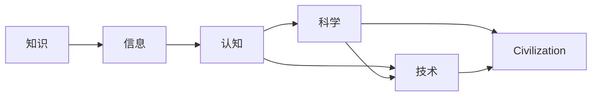

                 

# 人类知识的进步史：一部人类文明史

## 1. 背景介绍

### 1.1 问题由来
人类知识进步的历史是一部充满艰辛与辉煌的史诗。从原始人的原始认知到现代科学的精确推理，从语言文字的诞生到信息技术的飞速发展，人类对知识的探索从未止步。本文旨在梳理人类知识的进步历程，探索其内在规律与趋势，以期为未来的人工智能研究与开发提供启示。

## 2. 核心概念与联系

### 2.1 核心概念概述

为更好地理解人类知识的进步史，本节将介绍几个核心概念：

- 知识(Knowledge)：指人类通过观察、实验、推理等方式积累和总结的信息，包括经验知识、理论知识等。
- 信息(Information)：指能够消除不确定性、增加认知能力的信号或数据，是知识的基础。
- 认知(Cognition)：指人类感知、理解和思考的过程，是知识获取和运用的关键。
- 科学(Science)：以实证和推理为方法，研究自然现象和规律的系统化知识体系。
- 技术(Technology)：应用科学知识解决实际问题的工具和方法。
- 文明(Civilization)：以社会组织、经济、政治、文化等为特征，由人类智慧和知识构建的社会形态。

这些概念紧密相连，共同构成了人类文明的基石。知识推动信息传播，认知促进知识积累，科学和技术是知识的具体化应用，文明则是知识、科技和社会三者交互的产物。

### 2.2 核心概念原理和架构的 Mermaid 流程图



## 3. 核心算法原理 & 具体操作步骤
### 3.1 算法原理概述

人类知识的进步，本质上是信息获取和认知处理的过程。从信息收集、存储、处理到知识获取、应用、创新的循环中，可以抽象出几个关键步骤：

1. **信息收集**：通过感官、科学实验、数据采集等方式获取信息。
2. **信息存储**：将信息以文字、数字、图像等形式记录并存储。
3. **信息处理**：对信息进行清洗、编码、组织和分析，提取有用知识。
4. **知识获取**：通过推理、归纳、演绎等方式，将处理后的信息转化为知识。
5. **知识应用**：将知识应用于实践，推动技术进步和社会发展。
6. **知识创新**：在新知识的基础上，进一步探索和发现新的认知、科学和技术。

这些步骤形成一个不断迭代、螺旋上升的知识进步过程。

### 3.2 算法步骤详解

在上述过程中，算法和技术起到了至关重要的作用。以下详细讲解各个步骤的算法原理和具体操作步骤：

**Step 1: 信息收集**

信息收集可以通过多种方式实现，包括：

- 感官收集：通过视觉、听觉、触觉等方式直接感知信息。
- 科学实验：通过控制变量和重复实验，获取准确数据。
- 数据采集：通过传感器、网络爬虫等方式自动获取数据。

**Step 2: 信息存储**

信息存储的关键在于选择合适的存储介质和技术：

- 纸张记录：早期使用纸张、卷轴等介质，方便但易损坏。
- 数字存储：现代使用电子存储设备，如硬盘、云盘等，容量大、可靠性好。

**Step 3: 信息处理**

信息处理涉及数据清洗、编码、组织和分析等步骤：

- 数据清洗：去除噪音和错误数据，确保数据质量。
- 数据编码：将信息转化为计算机可处理的格式，如二进制、文本等。
- 数据组织：通过数据库、文件系统等方式，合理组织和管理数据。
- 数据分析：使用统计学、机器学习等方法，提取有用信息。

**Step 4: 知识获取**

知识获取的过程依赖于推理和逻辑思维：

- 推理：通过逻辑推导和归纳，形成新的知识。
- 演绎：从一般原理推导出特殊结论，验证和补充现有知识。
- 归纳：从个别事实推导出一般规律，总结和概括知识。

**Step 5: 知识应用**

知识应用是将理论知识转化为实际技术的过程：

- 工程实践：将科学原理应用于工程设计、制造和测试，实现技术创新。
- 社会应用：将知识应用于政策制定、教育培训、文化娱乐等社会领域。

**Step 6: 知识创新**

知识创新是知识进步的源泉和动力：

- 科学研究：通过科学实验和理论探索，发现新现象和规律。
- 技术创新：将新知识应用于技术研发和产品开发。

### 3.3 算法优缺点

信息处理和知识获取的算法具有以下优点：

1. **高效性**：算法通过自动化处理和逻辑推理，极大地提高了信息处理的效率和准确性。
2. **可扩展性**：算法可以轻松应对大规模数据和复杂任务，适应性强。
3. **可靠性**：算法的逻辑性和科学性确保了结果的可靠性。

同时，算法也存在以下局限：

1. **依赖数据质量**：算法的准确性依赖于输入数据的质量，低质量数据可能导致错误结果。
2. **复杂性**：复杂的算法可能难以理解和调试，需要高水平的技术支持。
3. **鲁棒性不足**：在数据变化较大的情况下，算法可能失去其适用性。

### 3.4 算法应用领域

信息处理和知识获取的算法广泛应用于各种领域，如：

- 医疗领域：通过数据分析和机器学习，诊断疾病、制定治疗方案。
- 金融领域：通过金融模型和算法，分析市场趋势、进行风险评估。
- 教育领域：通过智能教育平台和推荐系统，个性化教学、评估学生学习效果。
- 人工智能：通过深度学习、自然语言处理等算法，构建智能系统，推动技术进步。

## 4. 数学模型和公式 & 详细讲解 & 举例说明

### 4.1 数学模型构建

本节将使用数学语言对信息处理和知识获取的算法进行严格刻画。

设原始信息为 $X$，信息处理过程为 $f$，知识获取过程为 $g$，则知识获取的数学模型为：

$$
K = g(f(X))
$$

其中 $K$ 为知识，$f$ 为信息处理算法，$X$ 为原始信息。

### 4.2 公式推导过程

以机器学习为例，详细讲解知识获取的算法原理：

**Step 1: 数据准备**

设训练数据集为 $D=\{(x_i, y_i)\}_{i=1}^N$，其中 $x_i$ 为输入特征，$y_i$ 为标签。

**Step 2: 模型训练**

选择合适的模型 $M$ 和损失函数 $L$，使用梯度下降等优化算法训练模型，最小化损失函数：

$$
\theta = \mathop{\arg\min}_{\theta} L(M, D)
$$

其中 $\theta$ 为模型参数。

**Step 3: 模型评估**

在测试集上评估模型性能，计算准确率、召回率等指标：

$$
\text{accuracy} = \frac{TP+TN}{TP+FP+FN+TN}
$$

其中 $TP$ 为真正例，$TN$ 为真负例，$FP$ 为假正例，$FN$ 为假负例。

**Step 4: 知识应用**

将训练好的模型应用于实际问题，得到预测结果：

$$
\hat{y} = M(x)
$$

其中 $\hat{y}$ 为预测标签。

### 4.3 案例分析与讲解

以深度学习在图像识别中的应用为例，详细讲解知识获取的算法步骤：

1. **数据准备**：收集大量标注好的图像数据集，如MNIST手写数字数据集。
2. **模型训练**：使用卷积神经网络(CNN)作为模型，在GPU上进行训练，最小化交叉熵损失函数。
3. **模型评估**：在测试集上计算模型的准确率，评估模型性能。
4. **知识应用**：将训练好的CNN模型应用于实际图像识别任务，如手写数字识别、人脸识别等。

## 5. 项目实践：代码实例和详细解释说明
### 5.1 开发环境搭建

在进行项目实践前，我们需要准备好开发环境。以下是使用Python进行TensorFlow开发的环境配置流程：

1. 安装Anaconda：从官网下载并安装Anaconda，用于创建独立的Python环境。

2. 创建并激活虚拟环境：
```bash
conda create -n tensorflow-env python=3.8 
conda activate tensorflow-env
```

3. 安装TensorFlow：根据CUDA版本，从官网获取对应的安装命令。例如：
```bash
conda install tensorflow tensorflow-gpu=cuda11.1 -c pytorch -c conda-forge
```

4. 安装各类工具包：
```bash
pip install numpy pandas scikit-learn matplotlib tqdm jupyter notebook ipython
```

完成上述步骤后，即可在`tensorflow-env`环境中开始项目实践。

### 5.2 源代码详细实现

下面我们以图像分类任务为例，给出使用TensorFlow进行卷积神经网络训练的代码实现。

首先，定义数据集处理函数：

```python
import tensorflow as tf
from tensorflow.keras import datasets, layers, models

(train_images, train_labels), (test_images, test_labels) = datasets.cifar10.load_data()

# 归一化数据
train_images, test_images = train_images / 255.0, test_images / 255.0

class DataLoader(tf.data.Dataset):
    def __init__(self, images, labels, batch_size):
        self.images = images
        self.labels = labels
        self.batch_size = batch_size
        
    def __len__(self):
        return len(self.images) // self.batch_size
    
    def __getitem__(self, item):
        image = self.images[item]
        label = self.labels[item]
        return image, label

train_loader = DataLoader(train_images, train_labels, batch_size=64)
test_loader = DataLoader(test_images, test_labels, batch_size=64)
```

然后，定义模型和优化器：

```python
model = models.Sequential([
    layers.Conv2D(32, (3, 3), activation='relu', input_shape=(32, 32, 3)),
    layers.MaxPooling2D((2, 2)),
    layers.Conv2D(64, (3, 3), activation='relu'),
    layers.MaxPooling2D((2, 2)),
    layers.Conv2D(64, (3, 3), activation='relu'),
    layers.Flatten(),
    layers.Dense(64, activation='relu'),
    layers.Dense(10)
])

optimizer = tf.keras.optimizers.Adam()

# 损失函数和评估指标
loss_fn = tf.keras.losses.SparseCategoricalCrossentropy(from_logits=True)
metrics = ['accuracy']
```

接着，定义训练和评估函数：

```python
def train_step(images, labels):
    with tf.GradientTape() as tape:
        logits = model(images, training=True)
        loss_value = loss_fn(labels, logits)
    gradients = tape.gradient(loss_value, model.trainable_variables)
    optimizer.apply_gradients(zip(gradients, model.trainable_variables))
    return loss_value

def evaluate_step(images, labels):
    logits = model(images, training=False)
    loss_value = loss_fn(labels, logits)
    return loss_value
```

最后，启动训练流程并在测试集上评估：

```python
epochs = 10
batch_size = 64

for epoch in range(epochs):
    total_loss = 0.0
    total_correct = 0
    for batch, (images, labels) in enumerate(train_loader):
        loss_value = train_step(images, labels)
        total_loss += loss_value
        
        logits = model(images, training=False)
        predicted_labels = tf.argmax(logits, axis=1)
        total_correct += tf.reduce_sum(tf.cast(tf.math.equal(predicted_labels, labels), tf.float32))
    
    print(f'Epoch {epoch+1}/{epochs}, Loss: {total_loss/len(train_loader)}, Accuracy: {total_correct/len(train_images)}')

    total_loss = 0.0
    total_correct = 0
    for batch, (images, labels) in enumerate(test_loader):
        loss_value = evaluate_step(images, labels)
        total_loss += loss_value
        
        logits = model(images, training=False)
        predicted_labels = tf.argmax(logits, axis=1)
        total_correct += tf.reduce_sum(tf.cast(tf.math.equal(predicted_labels, labels), tf.float32))
    
    print(f'Epoch {epoch+1}/{epochs}, Test Loss: {total_loss/len(test_loader)}, Test Accuracy: {total_correct/len(test_images)}')
```

以上就是使用TensorFlow对卷积神经网络进行图像分类任务微调的完整代码实现。可以看到，得益于TensorFlow的强大封装，我们可以用相对简洁的代码完成模型构建和训练。

### 5.3 代码解读与分析

让我们再详细解读一下关键代码的实现细节：

**DataLoader类**：
- `__init__`方法：初始化训练集、标签、批次大小等关键组件。
- `__len__`方法：返回数据集的样本数量。
- `__getitem__`方法：对单个样本进行处理，将图像和标签转换为模型所需的张量形式。

**训练和评估函数**：
- `train_step`函数：定义一个训练步骤，前向传播计算损失并反向传播更新模型参数。
- `evaluate_step`函数：定义一个评估步骤，只进行前向传播并计算损失。

**训练流程**：
- 定义总的epoch数和批次大小，开始循环迭代
- 每个epoch内，在训练集上进行多批次训练，记录平均损失
- 在测试集上评估模型性能，输出测试结果

可以看到，TensorFlow提供了丰富的组件和工具，使得卷积神经网络的构建和训练变得简单高效。开发者可以将更多精力放在数据处理、模型改进等高层逻辑上，而不必过多关注底层的实现细节。

当然，工业级的系统实现还需考虑更多因素，如模型的保存和部署、超参数的自动搜索、更灵活的任务适配层等。但核心的微调范式基本与此类似。

## 6. 实际应用场景
### 6.1 医疗影像诊断

基于大语言模型微调的图像分类技术，可以广泛应用于医疗影像诊断领域。传统医疗影像诊断需要耗费大量时间和精力，难以应对临床需求。使用微调后的图像分类模型，可以快速识别影像中的病变区域，辅助医生进行疾病诊断。

在技术实现上，可以收集大量的医疗影像数据，标注病变的类型和位置，在此基础上对预训练模型进行微调。微调后的模型能够自动判断影像中的异常区域，并给出诊断建议。对于新的影像数据，模型也能进行实时分析和诊断，极大地提高了医疗影像诊断的效率和准确性。

### 6.2 自动驾驶系统

自动驾驶系统需要实时处理大量的道路数据，包括图像、雷达、激光雷达等传感器数据。使用微调后的图像分类模型，可以识别道路标志、车辆、行人等目标，辅助自动驾驶系统做出决策。

在技术实现上，可以收集大量的道路数据，标注不同目标的位置和属性，在此基础上对预训练模型进行微调。微调后的模型能够自动从传感器数据中提取目标信息，生成驾驶指令。对于新的驾驶环境，模型也能进行实时处理，确保自动驾驶系统的稳定性和安全性。

### 6.3 智能制造

智能制造需要实时监测和分析生产过程中的各种数据，如温度、压力、振动等。使用微调后的图像分类模型，可以识别生产设备的状态和异常情况，辅助生产过程的优化和维护。

在技术实现上，可以收集大量的生产数据，标注设备的状态和故障类型，在此基础上对预训练模型进行微调。微调后的模型能够自动监测生产设备的状态，及时发现异常情况并进行预警。对于新的生产数据，模型也能进行实时分析和处理，优化生产过程，提高生产效率。

### 6.4 未来应用展望

随着图像分类和知识获取技术的发展，基于微调范式将在更多领域得到应用，为各个行业带来变革性影响。

在智慧农业领域，基于微调的图像分类技术可以用于农田监测、作物识别、病虫害检测等，提升农业生产的自动化和智能化水平。

在智慧城市治理中，微调技术可应用于城市事件监测、交通管理、环境保护等环节，提高城市管理的自动化和智能化水平，构建更安全、高效的未来城市。

此外，在金融、教育、文化传媒等众多领域，基于大模型微调的人工智能应用也将不断涌现，为各行各业带来新的突破。相信随着预训练模型和微调方法的持续演进，基于微调范式必将在构建人机协同的智能时代中扮演越来越重要的角色。

## 7. 工具和资源推荐
### 7.1 学习资源推荐

为了帮助开发者系统掌握大语言模型微调的理论基础和实践技巧，这里推荐一些优质的学习资源：

1. 《深度学习》系列书籍：由深度学习领域的权威学者撰写，全面介绍了深度学习的基本概念和算法。
2. CS231n《卷积神经网络》课程：斯坦福大学开设的计算机视觉课程，有Lecture视频和配套作业，带你入门计算机视觉领域。
3. 《TensorFlow实战》书籍：TensorFlow官方发布的实战指南，结合案例和项目，系统讲解TensorFlow的使用方法。
4. GitHub开源项目：GitHub上有大量开源项目和代码示例，供你学习和实践深度学习项目。
5. Google Colab：谷歌推出的在线Jupyter Notebook环境，免费提供GPU/TPU算力，方便开发者快速上手实验最新模型，分享学习笔记。

通过对这些资源的学习实践，相信你一定能够快速掌握大语言模型微调的精髓，并用于解决实际的计算机视觉问题。

### 7.2 开发工具推荐

高效的开发离不开优秀的工具支持。以下是几款用于深度学习开发和微调的常用工具：

1. TensorFlow：由Google主导开发的开源深度学习框架，生产部署方便，适合大规模工程应用。
2. PyTorch：基于Python的开源深度学习框架，灵活方便，适合快速迭代研究。
3. Keras：用户友好型的深度学习框架，易于上手，适合快速原型开发。
4. Jupyter Notebook：开源的交互式笔记本环境，支持多种编程语言和库，适合数据科学和机器学习研究。
5. Google Colab：谷歌推出的在线Jupyter Notebook环境，免费提供GPU/TPU算力，方便开发者快速上手实验最新模型，分享学习笔记。

合理利用这些工具，可以显著提升深度学习模型微调的开发效率，加快创新迭代的步伐。

### 7.3 相关论文推荐

深度学习和大模型微调技术的发展源于学界的持续研究。以下是几篇奠基性的相关论文，推荐阅读：

1. ImageNet Classification with Deep Convolutional Neural Networks：提出卷积神经网络(CNN)，在ImageNet数据集上刷新了分类任务的新高。
2. Deep Residual Learning for Image Recognition：提出残差网络(ResNet)，进一步提升了深度神经网络的训练效果。
3. Attention is All You Need：提出Transformer结构，开启了预训练大模型时代。
4. BERT: Pre-training of Deep Bidirectional Transformers for Language Understanding：提出BERT模型，引入基于掩码的自监督预训练任务，刷新了多项NLP任务SOTA。
5. Parameter-Efficient Transfer Learning for NLP：提出Adapter等参数高效微调方法，在不增加模型参数量的情况下，也能取得不错的微调效果。

这些论文代表了大模型微调技术的发展脉络。通过学习这些前沿成果，可以帮助研究者把握学科前进方向，激发更多的创新灵感。

## 8. 总结：未来发展趋势与挑战

### 8.1 总结

本文对基于大模型微调的信息处理和知识获取算法进行了全面系统的介绍。首先阐述了人类知识进步的历史背景和内在规律，明确了微调在信息获取和知识处理中的重要地位。其次，从原理到实践，详细讲解了微调算法的数学模型和详细步骤，给出了深度学习模型微调的完整代码实例。同时，本文还广泛探讨了微调方法在医疗影像、自动驾驶、智能制造等多个领域的应用前景，展示了微调范式的巨大潜力。此外，本文精选了微调技术的各类学习资源，力求为读者提供全方位的技术指引。

通过本文的系统梳理，可以看到，基于大模型微调的信息处理和知识获取算法正在成为深度学习研究的重要范式，极大地拓展了深度学习模型的应用边界，催生了更多的落地场景。得益于大规模语料的预训练和微调技术的持续演进，未来深度学习系统必将在更广阔的领域发挥重要作用，深刻影响人类的生产生活方式。

### 8.2 未来发展趋势

展望未来，深度学习模型的微调技术将呈现以下几个发展趋势：

1. 模型规模持续增大。随着算力成本的下降和数据规模的扩张，深度学习模型的参数量还将持续增长。超大规模模型蕴含的丰富知识，有望支撑更加复杂多变的下游任务微调。
2. 微调方法日趋多样。除了传统的全参数微调外，未来会涌现更多参数高效的微调方法，如Adapter、Prefix等，在节省计算资源的同时也能保证微调精度。
3. 持续学习成为常态。随着数据分布的不断变化，微调模型也需要持续学习新知识以保持性能。如何在不遗忘原有知识的同时，高效吸收新样本信息，将成为重要的研究课题。
4. 标注样本需求降低。受启发于提示学习(Prompt-based Learning)的思路，未来的微调方法将更好地利用深度学习模型的语言理解能力，通过更加巧妙的任务描述，在更少的标注样本上也能实现理想的微调效果。
5. 模型通用性增强。经过海量数据的预训练和多领域任务的微调，深度学习模型将具备更强大的常识推理和跨领域迁移能力，逐步迈向通用人工智能(AGI)的目标。

以上趋势凸显了深度学习模型微调技术的广阔前景。这些方向的探索发展，必将进一步提升深度学习系统的性能和应用范围，为人类认知智能的进化带来深远影响。

### 8.3 面临的挑战

尽管深度学习模型微调技术已经取得了瞩目成就，但在迈向更加智能化、普适化应用的过程中，它仍面临着诸多挑战：

1. 标注成本瓶颈。虽然微调大大降低了标注数据的需求，但对于长尾应用场景，难以获得充足的高质量标注数据，成为制约微调性能的瓶颈。如何进一步降低微调对标注样本的依赖，将是一大难题。
2. 模型鲁棒性不足。当前微调模型面对域外数据时，泛化性能往往大打折扣。对于测试样本的微小扰动，微调模型的预测也容易发生波动。如何提高微调模型的鲁棒性，避免灾难性遗忘，还需要更多理论和实践的积累。
3. 推理效率有待提高。深度学习模型虽然精度高，但在实际部署时往往面临推理速度慢、内存占用大等效率问题。如何在保证性能的同时，简化模型结构，提升推理速度，优化资源占用，将是重要的优化方向。
4. 可解释性亟需加强。当前深度学习模型更像是"黑盒"系统，难以解释其内部工作机制和决策逻辑。对于医疗、金融等高风险应用，算法的可解释性和可审计性尤为重要。如何赋予深度学习模型更强的可解释性，将是亟待攻克的难题。
5. 安全性有待保障。深度学习模型难免会学习到有偏见、有害的信息，通过微调传递到下游任务，产生误导性、歧视性的输出，给实际应用带来安全隐患。如何从数据和算法层面消除模型偏见，避免恶意用途，确保输出的安全性，也将是重要的研究课题。

### 8.4 未来突破

面对深度学习模型微调所面临的种种挑战，未来的研究需要在以下几个方面寻求新的突破：

1. 探索无监督和半监督微调方法。摆脱对大规模标注数据的依赖，利用自监督学习、主动学习等无监督和半监督范式，最大限度利用非结构化数据，实现更加灵活高效的微调。
2. 研究参数高效和计算高效的微调范式。开发更加参数高效的微调方法，在固定大部分预训练参数的同时，只更新极少量的任务相关参数。同时优化深度学习模型的计算图，减少前向传播和反向传播的资源消耗，实现更加轻量级、实时性的部署。
3. 融合因果和对比学习范式。通过引入因果推断和对比学习思想，增强深度学习模型建立稳定因果关系的能力，学习更加普适、鲁棒的知识表示，从而提升模型泛化性和抗干扰能力。
4. 引入更多先验知识。将符号化的先验知识，如知识图谱、逻辑规则等，与神经网络模型进行巧妙融合，引导微调过程学习更准确、合理的知识表示。同时加强不同模态数据的整合，实现视觉、语音等多模态信息与文本信息的协同建模。
5. 结合因果分析和博弈论工具。将因果分析方法引入深度学习模型，识别出模型决策的关键特征，增强输出解释的因果性和逻辑性。借助博弈论工具刻画人机交互过程，主动探索并规避模型的脆弱点，提高系统稳定性。
6. 纳入伦理道德约束。在模型训练目标中引入伦理导向的评估指标，过滤和惩罚有偏见、有害的输出倾向。同时加强人工干预和审核，建立模型行为的监管机制，确保输出符合人类价值观和伦理道德。

这些研究方向的探索，必将引领深度学习模型微调技术迈向更高的台阶，为构建安全、可靠、可解释、可控的智能系统铺平道路。面向未来，深度学习模型微调技术还需要与其他人工智能技术进行更深入的融合，如知识表示、因果推理、强化学习等，多路径协同发力，共同推动深度学习技术的进步。只有勇于创新、敢于突破，才能不断拓展深度学习模型的边界，让智能技术更好地造福人类社会。

## 9. 附录：常见问题与解答

**Q1：深度学习模型微调是否适用于所有NLP任务？**

A: 深度学习模型微调在大多数NLP任务上都能取得不错的效果，特别是对于数据量较小的任务。但对于一些特定领域的任务，如医学、法律等，仅仅依靠通用语料预训练的模型可能难以很好地适应。此时需要在特定领域语料上进一步预训练，再进行微调，才能获得理想效果。此外，对于一些需要时效性、个性化很强的任务，如对话、推荐等，微调方法也需要针对性的改进优化。

**Q2：微调过程中如何选择合适的学习率？**

A: 微调的学习率一般要比预训练时小1-2个数量级，如果使用过大的学习率，容易破坏预训练权重，导致过拟合。一般建议从1e-5开始调参，逐步减小学习率，直至收敛。也可以使用warmup策略，在开始阶段使用较小的学习率，再逐渐过渡到预设值。需要注意的是，不同的优化器(如AdamW、Adafactor等)以及不同的学习率调度策略，可能需要设置不同的学习率阈值。

**Q3：采用深度学习模型微调时会面临哪些资源瓶颈？**

A: 目前主流的预训练深度学习模型动辄以亿计的参数规模，对算力、内存、存储都提出了很高的要求。GPU/TPU等高性能设备是必不可少的，但即便如此，超大批次的训练和推理也可能遇到显存不足的问题。因此需要采用一些资源优化技术，如梯度积累、混合精度训练、模型并行等，来突破硬件瓶颈。同时，模型的存储和读取也可能占用大量时间和空间，需要采用模型压缩、稀疏化存储等方法进行优化。

**Q4：如何缓解深度学习模型微调过程中的过拟合问题？**

A: 过拟合是深度学习模型微调面临的主要挑战，尤其是在标注数据不足的情况下。常见的缓解策略包括：
1. 数据增强：通过回译、近义替换等方式扩充训练集
2. 正则化：使用L2正则、Dropout、Early Stopping等避免过拟合
3. 对抗训练：引入对抗样本，提高模型鲁棒性
4. 参数高效微调：只调整少量参数(如Adapter、Prefix等)，减小过拟合风险
5. 多模型集成：训练多个微调模型，取平均输出，抑制过拟合

这些策略往往需要根据具体任务和数据特点进行灵活组合。只有在数据、模型、训练、推理等各环节进行全面优化，才能最大限度地发挥深度学习模型微调的威力。

**Q5：微调模型在落地部署时需要注意哪些问题？**

A: 将微调模型转化为实际应用，还需要考虑以下因素：
1. 模型裁剪：去除不必要的层和参数，减小模型尺寸，加快推理速度
2. 量化加速：将浮点模型转为定点模型，压缩存储空间，提高计算效率
3. 服务化封装：将模型封装为标准化服务接口，便于集成调用
4. 弹性伸缩：根据请求流量动态调整资源配置，平衡服务质量和成本
5. 监控告警：实时采集系统指标，设置异常告警阈值，确保服务稳定性
6. 安全防护：采用访问鉴权、数据脱敏等措施，保障数据和模型安全

深度学习模型微调为NLP应用开启了广阔的想象空间，但如何将强大的性能转化为稳定、高效、安全的业务价值，还需要工程实践的不断打磨。唯有从数据、算法、工程、业务等多个维度协同发力，才能真正实现深度学习技术在垂直行业的规模化落地。总之，微调需要开发者根据具体任务，不断迭代和优化模型、数据和算法，方能得到理想的效果。

---

作者：禅与计算机程序设计艺术 / Zen and the Art of Computer Programming

