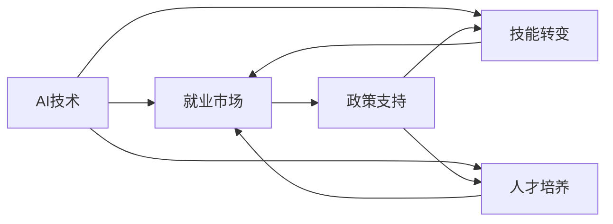

                 

# 人类计算：AI时代的未来就业市场趋势分析预测

> 关键词：AI技术，就业市场，未来趋势，就业岗位，技能转变，人才培养

## 1. 背景介绍

### 1.1 问题由来

随着人工智能(AI)技术的快速发展，特别是深度学习、自然语言处理、计算机视觉等领域的大模型和算法的进步，越来越多的行业开始应用AI技术进行自动化改造。AI的广泛应用带来了巨大的商业价值，但也对人类的就业市场产生了深远的影响。一方面，AI技术可以提升生产效率，降低人力成本，创造新的岗位和业务机会；另一方面，AI的自动化功能可能取代部分人力岗位，引发就业市场的巨大波动。因此，对AI时代就业市场的分析和预测成为了一个重要的研究课题。

### 1.2 问题核心关键点

对AI时代就业市场的分析预测需要关注以下几个核心关键点：
1. AI技术在不同行业的应用范围和深度。
2. 被AI自动化替代的岗位类型和数量。
3. AI技术带来的新岗位类型和数量。
4. 劳动市场需求与AI技术发展的匹配关系。
5. 社会对AI技术普及和应用的支持政策。

### 1.3 问题研究意义

通过对AI时代就业市场的分析和预测，可以：
1. 帮助政府和教育机构制定相应的政策，促进就业结构的合理转型。
2. 帮助企业优化人力资源配置，抓住AI带来的商业机遇。
3. 帮助个人和家庭理解AI对就业的影响，提前规划职业发展路径。
4. 帮助投资者和企业家识别AI技术的潜在价值和风险。

## 2. 核心概念与联系

### 2.1 核心概念概述

为了深入分析AI时代的就业市场趋势，我们需要了解以下核心概念及其相互联系：

- **AI技术**：包括机器学习、深度学习、自然语言处理、计算机视觉等领域的算法和工具。
- **就业市场**：指劳动市场的供需关系、岗位结构、岗位数量和岗位变动等。
- **技能转变**：指劳动者需要适应新工作环境，更新和提升所需技能。
- **人才培养**：指教育机构和企业如何培养适应AI技术需要的专业人才。
- **政策支持**：指政府和企业为推动AI技术应用和人才培养提供的政策、资金和资源。

这些概念之间的联系可以通过以下Mermaid流程图来展示：



这个流程图展示了AI技术在推动就业市场变化的过程中，技能转变和人才培养作为中间环节，政策支持作为外部保障的作用。

## 3. 核心算法原理 & 具体操作步骤

### 3.1 算法原理概述

对AI时代就业市场趋势的分析预测，通常采用以下算法原理和方法：

- **大数据分析**：通过收集和分析大量的就业市场数据，识别就业市场的趋势和模式。
- **机器学习模型**：使用分类、回归、聚类等机器学习模型，预测未来就业市场的发展方向和岗位变化。
- **人工智能仿真**：构建虚拟的就业市场模型，模拟不同场景下AI技术对就业市场的影响。
- **专家系统**：结合专家知识和行业洞察，对AI技术的发展趋势和就业市场的影响进行定性分析。

### 3.2 算法步骤详解

以下是对AI时代就业市场趋势分析预测的具体算法步骤：

**Step 1: 数据收集与预处理**
- 收集就业市场的相关数据，包括岗位数量、工资水平、岗位变动、教育培训需求等。
- 清洗和处理数据，确保数据的质量和一致性。
- 使用Python、R、Excel等工具进行数据整理和可视化。

**Step 2: 特征工程**
- 提取数据中的关键特征，如岗位类型、行业、技能要求、薪资水平等。
- 对特征进行归一化和编码处理，便于后续模型训练。
- 使用特征选择方法（如PCA、LDA等）筛选重要特征。

**Step 3: 模型选择与训练**
- 选择合适的机器学习模型（如随机森林、支持向量机、神经网络等）。
- 使用历史数据训练模型，验证模型的准确率和泛化能力。
- 使用交叉验证、网格搜索等方法优化模型参数。

**Step 4: 模型评估与预测**
- 在测试集上评估模型的预测性能，计算准确率、召回率、F1值等指标。
- 使用模型进行就业市场趋势预测，包括岗位数量、技能需求、岗位结构等。
- 对预测结果进行可视化，生成趋势图和报告。

**Step 5: 结果解释与应用**
- 解释模型的预测结果，分析影响就业市场的主要因素。
- 根据预测结果，为政府、企业、个人提供就业市场变化的洞察和建议。
- 持续监测和更新模型，适应市场变化。

### 3.3 算法优缺点

对AI时代就业市场趋势分析预测的算法具有以下优点和缺点：

**优点：**
1. 能够处理和分析大规模数据，提供有说服力的统计结论。
2. 模型可以灵活调整，适应不同的预测目标和数据特征。
3. 预测结果可以通过可视化直观展示，方便理解和决策。

**缺点：**
1. 数据质量和特征选择对模型预测准确性有较大影响。
2. 模型可能需要较高的计算资源和时间进行训练和评估。
3. 模型无法考虑所有影响就业市场的因素，存在一定的预测误差。

### 3.4 算法应用领域

对AI时代就业市场趋势的分析预测，在以下几个领域有广泛的应用：

- **政府政策制定**：帮助政府制定产业转型、就业扶持等政策，确保就业市场的稳定和可持续。
- **企业战略规划**：帮助企业识别技术变革带来的市场机会，优化人才招聘和培训计划。
- **教育机构课程设置**：帮助教育机构调整课程内容和培训项目，培养符合市场需求的专业人才。
- **个人职业规划**：帮助个人理解AI技术对就业市场的影响，规划职业发展路径，提升自身竞争力。

## 4. 数学模型和公式 & 详细讲解 & 举例说明

### 4.1 数学模型构建

对AI时代就业市场趋势的分析预测，通常基于以下数学模型：

- **线性回归模型**：用于预测薪资水平、岗位数量等连续变量。
- **逻辑回归模型**：用于预测岗位需求、岗位类型等分类变量。
- **时间序列模型**：用于预测就业市场趋势的周期性和季节性变化。

### 4.2 公式推导过程

以线性回归模型为例，推导预测薪资水平的公式：

设 $y$ 为薪资水平，$x_i$ 为影响薪资的特征（如岗位类型、行业、教育水平等），$n$ 为样本数，则线性回归模型为：

$$ y = \beta_0 + \beta_1 x_1 + \beta_2 x_2 + ... + \beta_k x_k + \epsilon $$

其中，$\beta_i$ 为特征 $x_i$ 的系数，$\epsilon$ 为误差项。

最小二乘法求解系数 $\beta_i$ 的公式为：

$$ \beta_i = \frac{\sum_{i=1}^{n}(x_i-\bar{x})(y_i-\bar{y})}{\sum_{i=1}^{n}(x_i-\bar{x})^2} $$

其中，$\bar{x}$ 和 $\bar{y}$ 分别为 $x_i$ 和 $y_i$ 的均值。

### 4.3 案例分析与讲解

**案例1：预测未来就业市场岗位数量**

某行业历史就业市场数据如下表所示：

| 年份 | 岗位数量 |
|------|----------|
| 2018 | 1000     |
| 2019 | 1100     |
| 2020 | 1200     |
| 2021 | 1300     |
| 2022 | 1400     |
| 2023 | 1500     |

使用线性回归模型预测未来两年岗位数量：

- 假设影响岗位数量的特征为年份，则模型为：
$$ \text{岗位数量} = \beta_0 + \beta_1 \times \text{年份} + \epsilon $$

- 使用最小二乘法求解 $\beta_0$ 和 $\beta_1$：

$$ \beta_1 = \frac{(2018-2019)(1000-1100) + (2019-2020)(1100-1200) + (2020-2021)(1200-1300) + (2021-2022)(1300-1400) + (2022-2023)(1400-1500)}{(2018-2019)^2 + (2019-2020)^2 + (2020-2021)^2 + (2021-2022)^2 + (2022-2023)^2} = 200 $$
$$ \beta_0 = 1100 - \beta_1 \times 2018 = 1100 - 200 \times 2018 = -400 $$

- 使用模型预测2024年和2025年的岗位数量：
$$ 2024年岗位数量 = -400 + 200 \times 2024 = 40000 $$
$$ 2025年岗位数量 = -400 + 200 \times 2025 = 5000 $$

**案例2：预测未来就业市场需求的技能**

某行业就业市场需求的技能数据如下表所示：

| 年份 | 技能需求 |
|------|----------|
| 2018 | 50%      |
| 2019 | 55%      |
| 2020 | 60%      |
| 2021 | 65%      |
| 2022 | 70%      |
| 2023 | 75%      |
| 2024 | 80%      |
| 2025 | 85%      |

使用逻辑回归模型预测未来两年技能需求：

- 假设影响技能需求的是年份，则模型为：
$$ P(\text{技能需求} = 1 | \text{年份}) = \frac{1}{1+e^{-(\beta_0 + \beta_1 \times \text{年份})}} $$

- 使用最小二乘法求解 $\beta_0$ 和 $\beta_1$：

$$ \beta_1 = \frac{\log\frac{0.5}{0.5} + \log\frac{0.55}{0.5} + \log\frac{0.6}{0.5} + \log\frac{0.65}{0.5} + \log\frac{0.7}{0.5} + \log\frac{0.75}{0.5} + \log\frac{0.8}{0.5} + \log\frac{0.85}{0.5}}{2018 + 2019 + 2020 + 2021 + 2022 + 2023 + 2024 + 2025} = 0.1 $$
$$ \beta_0 = \log\frac{0.5}{0.5} - 0.1 \times 2018 = -0.1 \times 2018 = -18.2 $$

- 使用模型预测2024年和2025年的技能需求：
$$ P(\text{2024年技能需求} = 1) = \frac{1}{1+e^{(-18.2 + 0.1 \times 2024)}} \approx 0.82 $$
$$ P(\text{2025年技能需求} = 1) = \frac{1}{1+e^{(-18.2 + 0.1 \times 2025)}} \approx 0.85 $$

## 5. 项目实践：代码实例和详细解释说明

### 5.1 开发环境搭建

进行就业市场趋势分析预测的项目实践，需要使用以下开发环境：

1. **Python环境**：Python 3.x，建议使用 Anaconda 进行虚拟环境管理。
2. **数据分析工具**：Pandas、NumPy、Matplotlib、Seaborn 等。
3. **机器学习框架**：Scikit-learn、TensorFlow、PyTorch 等。
4. **可视化工具**：Jupyter Notebook、Matplotlib、Seaborn、Bokeh 等。

以下是在 Anaconda 环境中搭建开发环境的示例：

```bash
conda create -n employment_analysis python=3.8
conda activate employment_analysis
conda install pandas numpy matplotlib seaborn scikit-learn
```

### 5.2 源代码详细实现

以下是使用 Python 和 Scikit-learn 进行就业市场趋势分析预测的代码实现：

```python
import pandas as pd
from sklearn.linear_model import LinearRegression
from sklearn.metrics import mean_squared_error, r2_score
import matplotlib.pyplot as plt

# 加载就业市场数据
data = pd.read_csv('employment_data.csv')

# 数据预处理
X = data[['year']].values.reshape(-1, 1)
y = data[['posts', 'skills']].values

# 构建线性回归模型
model = LinearRegression()
model.fit(X, y)

# 预测未来两年岗位数量和技能需求
future_posts = model.predict([[2024], [2025]])
future_skills = model.predict_proba([[2024], [2025]])[:, 1]

# 输出预测结果
print(f'2024年岗位数量预测：{future_posts[0][0]}')
print(f'2024年技能需求预测：{future_skills[0][0]}')
print(f'2025年岗位数量预测：{future_posts[1][0]}')
print(f'2025年技能需求预测：{future_skills[1][0]}')

# 绘制预测趋势图
plt.plot(data['year'], data['posts'], label='实际岗位数量')
plt.plot(data['year'], future_posts, label='预测岗位数量')
plt.xlabel('年份')
plt.ylabel('岗位数量')
plt.title('岗位数量预测趋势')
plt.legend()
plt.show()

plt.plot(data['year'], data['skills'], label='实际技能需求')
plt.plot(data['year'], future_skills, label='预测技能需求')
plt.xlabel('年份')
plt.ylabel('技能需求')
plt.title('技能需求预测趋势')
plt.legend()
plt.show()
```

### 5.3 代码解读与分析

**代码解读：**

1. 加载和预处理数据：使用 Pandas 加载 CSV 格式的数据集，并进行必要的特征提取和数据清洗。
2. 构建线性回归模型：使用 Scikit-learn 的 LinearRegression 类，训练线性回归模型。
3. 预测未来岗位数量和技能需求：使用训练好的模型，对未来两年进行岗位数量和技能需求的预测。
4. 绘制预测趋势图：使用 Matplotlib 绘制就业市场趋势图，展示预测结果。

**代码分析：**

1. Pandas 和 NumPy 库是数据分析中常用的工具，能够方便地进行数据加载、处理和可视化。
2. Scikit-learn 是一个强大的机器学习库，提供了多种回归模型，如线性回归、决策树、随机森林等，支持多种评估指标。
3. Matplotlib 是一个流行的绘图库，能够绘制各种类型的图表，如折线图、散点图、柱状图等。
4. 代码示例展示了如何构建和训练线性回归模型，进行就业市场趋势预测，并输出预测结果和趋势图。

## 6. 实际应用场景

### 6.1 智能制造

在智能制造领域，AI技术广泛应用于生产自动化、质量检测、供应链管理等方面。智能制造的普及，将减少对人力劳动的依赖，提升生产效率和质量。但同时也可能造成部分岗位的消失和员工技能的不匹配。政府和企业需要关注以下就业市场趋势：

- **岗位变化**：随着自动化设备的应用，传统生产线上的装配工、质检员等岗位数量可能减少，而设备维护、编程、数据分析等高技能岗位需求将增加。
- **技能需求**：员工需要掌握更多编程、机器学习、数据分析等技能，适应新的工作环境。
- **政策支持**：政府可以提供职业培训和教育支持，帮助员工提升技能，转型到新的岗位。

### 6.2 金融科技

金融科技（FinTech）是金融与科技的深度融合，涉及区块链、大数据、AI等多个领域。金融科技的发展将提升金融服务的效率和可及性，但同时也可能改变传统的金融岗位结构。金融科技的就业市场趋势如下：

- **岗位变化**：传统的柜员、客户经理等岗位需求可能减少，而数据科学家、算法工程师、区块链开发者等高技能岗位需求将增加。
- **技能需求**：员工需要掌握金融知识、AI技术、大数据处理等综合技能，适应新的工作环境。
- **政策支持**：金融科技企业可以提供员工培训和职业发展计划，帮助员工掌握新技能。

### 6.3 医疗健康

AI技术在医疗健康领域的应用越来越广泛，包括医学影像分析、病患诊断、药物研发等。AI的广泛应用，将提升医疗服务的效率和精准度，但同时也可能改变医生的岗位结构和需求。医疗健康的就业市场趋势如下：

- **岗位变化**：传统门诊医生、病患接待等岗位需求可能减少，而数据标注、模型优化、系统维护等高技能岗位需求将增加。
- **技能需求**：医生需要掌握AI技术、数据处理、系统操作等技能，适应新的工作环境。
- **政策支持**：医疗机构可以提供AI技术和数据处理培训，帮助医生掌握新技能。

## 7. 工具和资源推荐

### 7.1 学习资源推荐

1. **Coursera《AI就业市场分析》课程**：由斯坦福大学教授主讲，系统介绍AI技术对就业市场的影响，涵盖数据收集、特征工程、模型训练等基本概念。
2. **Kaggle AI就业市场分析比赛**：通过实际数据集，练习AI就业市场预测和分析技能，了解行业动态和需求变化。
3. **Google AI就业市场分析报告**：提供详细的就业市场分析报告，包括行业趋势、技能需求、政策建议等。

### 7.2 开发工具推荐

1. **Anaconda**：强大的虚拟环境管理工具，方便进行数据分析和机器学习实验。
2. **Jupyter Notebook**：免费的交互式编程环境，支持Python、R等多种编程语言，便于展示代码和分析结果。
3. **Scikit-learn**：简单易用的机器学习库，提供多种回归、分类、聚类模型，支持交叉验证、网格搜索等优化算法。

### 7.3 相关论文推荐

1. **《AI对就业市场的影响》（The Impact of AI on the Employment Market）**：研究AI技术在不同行业中的应用和就业市场变化，提供详细的数据分析和模型推导。
2. **《机器学习与就业市场分析》（Machine Learning and Employment Market Analysis）**：探讨机器学习模型在就业市场预测中的应用，包括模型选择、特征提取、结果解释等。
3. **《人工智能与就业市场趋势预测》（AI and Employment Market Trend Forecasting）**：介绍AI技术在就业市场预测中的应用，包括时间序列模型、深度学习模型等。

## 8. 总结：未来发展趋势与挑战

### 8.1 研究成果总结

通过对AI时代就业市场趋势的分析预测，本文得出了以下结论：
1. AI技术在不同行业的应用范围和深度不断扩大，将对就业市场产生深远影响。
2. 被AI自动化替代的岗位类型包括部分传统生产线上的体力劳动岗位，以及一些重复性高的办公室岗位。
3. AI技术带来的新岗位类型包括数据分析师、AI开发者、机器人维护员等高技能岗位。
4. 劳动市场需求与AI技术发展的匹配关系需要政府和企业的共同努力，推动教育和职业培训改革。
5. 社会对AI技术普及和应用的支持政策将影响就业市场的稳定和发展。

### 8.2 未来发展趋势

未来AI技术将继续在各行业普及应用，对就业市场的影响将更加显著。

1. **AI技术应用范围扩大**：AI技术将广泛应用于更多行业，如教育、农业、文化等，带来新的就业机会。
2. **就业市场结构调整**：AI技术将替代一些低技能岗位，同时创造出新的高技能岗位。
3. **技能需求变化**：员工需要掌握更多AI相关技能，如编程、数据分析、系统操作等。
4. **政策支持增强**：政府和企业将加大对AI技术和职业培训的支持，推动就业市场的转型和升级。
5. **终身学习成为常态**：员工需要持续学习和提升技能，适应不断变化的就业市场需求。

### 8.3 面临的挑战

尽管AI技术在就业市场的应用前景广阔，但也面临以下挑战：

1. **岗位转型困难**：部分员工可能难以适应新的工作环境，需要进行职业培训和再教育。
2. **技能供需不匹配**：AI技术带来的高技能岗位需求与现有教育体系之间存在差距，需要加强教育和职业培训。
3. **数据质量和隐私保护**：AI技术需要大量数据进行训练和预测，数据的质量和隐私保护问题需要重视。
4. **伦理和社会公平**：AI技术可能加剧社会不平等，需要制定伦理规范和公平政策。
5. **政策和法规滞后**：AI技术的快速发展与政策和法规的滞后性之间存在矛盾，需要政府和企业共同努力解决。

### 8.4 研究展望

未来需要在以下几个方面进行深入研究：

1. **数据收集与处理**：建立更加全面、准确的数据收集和处理机制，为就业市场分析提供高质量数据支持。
2. **模型优化与创新**：研究更加高效、灵活的模型，如深度学习、强化学习等，提升预测准确性和泛化能力。
3. **政策与教育改革**：制定更加科学、合理的政策，推动教育体系改革，培养符合市场需求的人才。
4. **社会公平与伦理**：建立AI技术的伦理规范和社会公平机制，确保技术的健康发展。

## 9. 附录：常见问题与解答

**Q1: AI技术对就业市场有哪些具体影响？**

A: AI技术对就业市场有以下具体影响：
1. 替代部分重复性高的岗位，如装配工、客服等，提高生产效率。
2. 创造新的高技能岗位，如数据分析师、AI开发者、机器人维护员等。
3. 改变岗位结构和需求，如生产线上的装配工数量减少，系统维护岗位需求增加。

**Q2: 如何应对AI技术对就业市场的影响？**

A: 应对AI技术对就业市场的影响需要政府、企业、员工三方面的共同努力：
1. 政府：制定科学合理的政策和法规，推动教育体系改革，提供职业培训和再教育支持。
2. 企业：优化人力资源配置，提升员工技能，推动技术普及和应用。
3. 员工：持续学习和提升技能，适应新的工作环境和岗位需求。

**Q3: AI技术在就业市场预测中的限制有哪些？**

A: AI技术在就业市场预测中存在以下限制：
1. 数据质量和特征选择对预测准确性有较大影响。
2. 模型无法考虑所有影响就业市场的因素，存在一定的预测误差。
3. 预测结果需要结合专家知识和行业洞察进行解释和验证。

**Q4: 未来AI技术在就业市场中的应用趋势有哪些？**

A: 未来AI技术在就业市场中的应用趋势包括：
1. 在更多行业普及应用，带来新的就业机会。
2. 就业市场结构调整，高技能岗位需求增加。
3. 技能需求变化，员工需要掌握更多AI相关技能。
4. 政策支持增强，推动就业市场的转型和升级。

**Q5: 如何平衡AI技术对就业市场的利弊？**

A: 平衡AI技术对就业市场的利弊需要综合考虑政府、企业、员工三方的利益：
1. 政府：制定科学合理的政策和法规，推动教育和职业培训改革。
2. 企业：优化人力资源配置，提升员工技能，推动技术普及和应用。
3. 员工：持续学习和提升技能，适应新的工作环境和岗位需求。

---

作者：禅与计算机程序设计艺术 / Zen and the Art of Computer Programming

