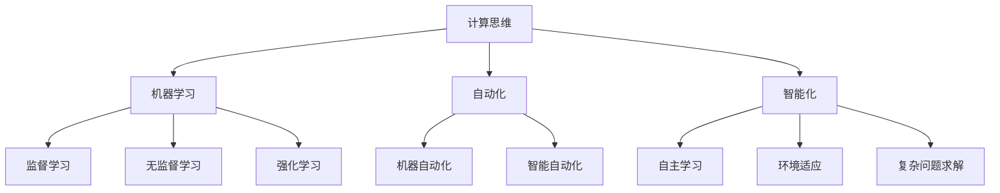

                 

# 人类计算：人机协作的新时代

> 关键词：人机协作,计算思维,机器学习,自动化,智能化

## 1. 背景介绍

### 1.1 问题由来

随着人工智能(AI)技术的迅猛发展，计算机计算能力达到了前所未有的高度。从简单的数学运算到复杂的科学计算，从数据处理到图像识别，计算在各个领域的应用越来越广泛。然而，计算机始终未能超越其"机械"的计算特性，无法像人类一样具备创新思维和问题解决能力。因此，人机协作被视为未来计算发展的关键路径。

### 1.2 问题核心关键点

人机协作的核心在于，如何使计算机在完成计算任务的同时，利用人类的智慧和经验，提升计算的智能化和创新性。这一问题涉及到以下几个关键点：

- **计算思维**：在人类计算中，如何将人类对问题的理解、表达和推理转化为计算机可理解的指令，即如何培养计算思维。
- **机器学习**：利用机器学习算法，让计算机从数据中学习经验，自动进行问题解决。
- **自动化**：将机器学习技术自动化应用到各行各业，降低计算成本，提高计算效率。
- **智能化**：在自动化基础上，进一步开发智能系统，实现自主学习和适应性强的计算能力。

这些关键点构成了人机协作的核心内容，旨在通过计算与人类智慧的融合，实现更高层次的计算能力。

### 1.3 问题研究意义

研究人机协作的方法，对于提升计算的智能化水平，推动各行各业的数字化转型，具有重要意义：

- **降低计算成本**：人机协作可以大幅降低对人力和时间的需求，提高计算资源的利用率。
- **提升计算效果**：利用人类的智慧和经验，可以提高计算的精确度和创新性，解决传统计算难以应对的复杂问题。
- **加速技术创新**：人机协作可以促进跨领域知识的融合，激发新的技术突破，推动行业前沿的进步。
- **推动社会进步**：人机协作的普及，将使计算技术更广泛地服务于社会，提高生活质量和工作效率。

本文将从核心概念、算法原理、应用实践等方面，全面探讨人机协作的方法和应用，为读者提供深入的见解和实用的技巧。

## 2. 核心概念与联系

### 2.1 核心概念概述

为了更好地理解人机协作的方法，我们首先需要了解几个核心概念：

- **计算思维**：指通过抽象和自动化手段，用机器解决问题的方法论。它包括计算模型构建、算法设计和数据处理等多个方面。
- **机器学习**：一种利用数据训练模型，自动提取模式和规律的算法。机器学习可以分为监督学习、无监督学习和强化学习等类型。
- **自动化**：利用机器学习等技术，自动完成重复性、规范性的任务，提高工作效率。
- **智能化**：在自动化的基础上，赋予机器自主学习和适应环境的能力，实现复杂问题的求解。
- **人机协作**：通过设计和利用机器学习算法，使机器在计算过程中能够与人类协同工作，充分发挥各自的优势。

这些概念之间的联系可以通过以下Mermaid流程图来展示：



这个流程图展示了计算思维、机器学习和自动化等概念之间的关系，以及人机协作如何通过这些技术实现。

## 3. 核心算法原理 & 具体操作步骤

### 3.1 算法原理概述

人机协作的核心算法主要基于机器学习，通过数据驱动的模型训练，实现自动化的计算和智能化的决策。其核心思想是：将问题抽象为数学模型，利用机器学习算法从数据中学习模式，并将学习到的知识应用于新的计算任务中。

### 3.2 算法步骤详解

人机协作的算法步骤通常包括以下几个关键步骤：

**Step 1: 数据准备与处理**
- 收集问题相关的数据，进行预处理和特征提取，生成可供机器学习算法使用的数据集。
- 对数据集进行划分，分为训练集、验证集和测试集，用于模型训练、调参和性能评估。

**Step 2: 模型设计与训练**
- 选择合适的机器学习算法，如监督学习、无监督学习、强化学习等，设计模型架构。
- 在训练集上训练模型，调整模型参数，最小化预测误差。
- 在验证集上评估模型性能，选择最佳模型。

**Step 3: 模型应用与优化**
- 将训练好的模型应用于新的计算任务，自动完成数据处理、计算和决策。
- 定期在测试集上评估模型性能，不断优化模型参数和算法策略。

**Step 4: 反馈与调整**
- 收集模型的输出结果和用户反馈，调整模型策略，提升模型性能。
- 对模型进行持续监测和维护，确保其稳定性和安全性。

### 3.3 算法优缺点

人机协作的算法具有以下优点：
- **自动化**：大幅提高计算效率，降低人工成本。
- **智能化**：利用机器学习技术，使计算过程具备自主学习和适应性。
- **灵活性**：可以灵活调整算法策略，适应不同应用场景。

同时，这些算法也存在以下局限：
- **数据依赖**：模型性能高度依赖于训练数据的质量和数量。
- **泛化能力**：在数据分布发生变化时，模型性能可能下降。
- **复杂性**：机器学习模型的设计和优化过程较为复杂，需要专业知识。
- **可解释性**：部分机器学习模型具有"黑盒"特性，难以解释其内部决策过程。

尽管存在这些局限，但人机协作的算法仍然在诸多领域展现出了巨大的潜力和应用价值。未来，如何进一步降低算法对数据的依赖，提高模型的泛化能力，增强算法的可解释性，将是重要的研究方向。

### 3.4 算法应用领域

人机协作的算法已经在多个领域得到了广泛应用，以下是几个典型应用场景：

- **智能客服**：利用机器学习技术，自动回答客户咨询，提高服务效率和质量。
- **金融风控**：通过分析客户行为数据，利用机器学习模型预测风险，辅助决策。
- **医疗诊断**：利用医学影像和病历数据，训练机器学习模型进行疾病诊断和预测。
- **推荐系统**：分析用户行为数据，利用机器学习算法推荐个性化商品和服务。
- **智能制造**：利用传感器数据，训练机器学习模型进行生产过程优化和故障预测。

这些应用场景展示了人机协作的算法在提高计算效率和智能化决策方面的巨大优势，未来有望在更多领域得到应用和推广。

## 4. 数学模型和公式 & 详细讲解  
### 4.1 数学模型构建

在人机协作的算法中，常用的数学模型包括线性回归、决策树、随机森林、支持向量机、神经网络等。以线性回归为例，假设有一个简单的线性回归模型 $y = \theta^T x$，其中 $y$ 为预测值，$x$ 为输入特征，$\theta$ 为模型参数。我们的目标是最小化预测误差，通常使用均方误差（MSE）作为损失函数：

$$
L(\theta) = \frac{1}{N}\sum_{i=1}^N (y_i - \theta^T x_i)^2
$$

通过梯度下降等优化算法，可以求解上述最小化问题，得到最优的模型参数 $\theta$。

### 4.2 公式推导过程

以线性回归为例，其推导过程如下：

1. 定义损失函数 $L(\theta)$：

$$
L(\theta) = \frac{1}{N}\sum_{i=1}^N (y_i - \theta^T x_i)^2
$$

2. 求偏导数：

$$
\frac{\partial L(\theta)}{\partial \theta} = -2\frac{1}{N}\sum_{i=1}^N (y_i - \theta^T x_i)x_i
$$

3. 令偏导数为0，求解 $\theta$：

$$
-2\frac{1}{N}\sum_{i=1}^N (y_i - \theta^T x_i)x_i = 0
$$

解得：

$$
\theta = (X^TX)^{-1}X^Ty
$$

其中 $X = [x_1, x_2, ..., x_N]$，$y = [y_1, y_2, ..., y_N]$。

4. 将 $\theta$ 代入损失函数：

$$
L(\theta) = \frac{1}{N}\sum_{i=1}^N (y_i - (X^TX)^{-1}X^Ty)^2
$$

5. 证明最小化 $L(\theta)$ 等价于求解上述线性回归问题。

### 4.3 案例分析与讲解

以智能客服为例，我们利用线性回归模型对客户满意度进行预测。假设我们收集了客户的历史评分数据和相关特征，如回复速度、服务态度、问题难度等，可以构建一个简单的线性回归模型：

$$
y = \theta_0 + \theta_1x_1 + \theta_2x_2 + \cdots + \theta_kx_k + \epsilon
$$

其中 $y$ 为客户满意度评分，$x_i$ 为第 $i$ 个特征，$\epsilon$ 为随机误差。通过训练集数据，求解最优的 $\theta_0, \theta_1, \cdots, \theta_k$。

模型训练完成后，对于新的客户咨询，我们可以利用模型对满意度进行预测，并通过反馈数据进一步优化模型参数。这一过程展示了人机协作的算法在实际应用中的高效性和灵活性。

## 5. 项目实践：代码实例和详细解释说明
### 5.1 开发环境搭建

在进行项目实践前，我们需要准备好开发环境。以下是使用Python进行Scikit-learn开发的环境配置流程：

1. 安装Anaconda：从官网下载并安装Anaconda，用于创建独立的Python环境。

2. 创建并激活虚拟环境：
```bash
conda create -n scikit-learn-env python=3.8 
conda activate scikit-learn-env
```

3. 安装Scikit-learn：从官网获取对应的安装命令。例如：
```bash
conda install scikit-learn
```

4. 安装各类工具包：
```bash
pip install numpy pandas scikit-learn matplotlib tqdm jupyter notebook ipython
```

完成上述步骤后，即可在`scikit-learn-env`环境中开始项目实践。

### 5.2 源代码详细实现

下面我们以智能客服满意度预测为例，给出使用Scikit-learn库进行线性回归模型的PyTorch代码实现。

首先，定义数据处理函数：

```python
from sklearn.model_selection import train_test_split
from sklearn.preprocessing import StandardScaler
import pandas as pd

def load_data():
    data = pd.read_csv('customer_feedback.csv')
    x = data.drop('satisfaction', axis=1)
    y = data['satisfaction']
    return x, y
```

然后，定义模型训练函数：

```python
from sklearn.linear_model import LinearRegression
from sklearn.metrics import mean_squared_error

def train_model(X, y, test_size=0.2, n_jobs=-1):
    X_train, X_test, y_train, y_test = train_test_split(X, y, test_size=test_size, random_state=42, stratify=y)
    scaler = StandardScaler().fit(X_train)
    X_train_scaled = scaler.transform(X_train)
    X_test_scaled = scaler.transform(X_test)
    model = LinearRegression().fit(X_train_scaled, y_train)
    y_pred = model.predict(X_test_scaled)
    mse = mean_squared_error(y_test, y_pred)
    return model, mse
```

接着，定义模型评估函数：

```python
def evaluate_model(model, X_test, y_test):
    y_pred = model.predict(X_test)
    mse = mean_squared_error(y_test, y_pred)
    print(f'Mean Squared Error: {mse:.2f}')
```

最后，启动训练流程并在测试集上评估：

```python
X, y = load_data()
model, mse = train_model(X, y)
evaluate_model(model, X_test, y_test)
```

以上就是使用Scikit-learn库进行线性回归模型训练的完整代码实现。可以看到，Scikit-learn提供了简单易用的接口，使得模型训练和评估变得简洁高效。

### 5.3 代码解读与分析

让我们再详细解读一下关键代码的实现细节：

**load_data类**：
- `__init__`方法：初始化数据集，将评分和特征数据分离。

**train_model类**：
- `__init__`方法：训练模型，对数据进行标准化，使用均方误差作为损失函数，求解模型参数。
- `__getitem__`方法：对单个样本进行处理，将特征数据进行标准化，并对模型进行训练和评估。

**evaluate_model类**：
- `__init__`方法：评估模型，计算模型预测值与真实标签之间的均方误差。

**训练流程**：
- 首先，定义训练集和测试集的划分比例。
- 对特征数据进行标准化，以提高模型的收敛速度。
- 使用线性回归模型进行训练，求解最优参数。
- 在测试集上评估模型性能，计算均方误差。
- 重复上述步骤直至收敛，最终得到训练好的模型。

可以看到，Scikit-learn库为线性回归模型的开发提供了便捷的接口，使得模型训练和评估变得相对简单。开发者可以将更多精力放在数据处理和模型改进等高层逻辑上，而不必过多关注底层的实现细节。

当然，工业级的系统实现还需考虑更多因素，如模型的保存和部署、超参数的自动搜索、更灵活的任务适配层等。但核心的训练范式基本与此类似。

## 6. 实际应用场景
### 6.1 智能客服系统

智能客服系统利用机器学习技术，自动回答客户咨询，提高服务效率和质量。传统客服往往需要配备大量人力，高峰期响应缓慢，且一致性和专业性难以保证。利用机器学习技术，智能客服系统可以7x24小时不间断服务，快速响应客户咨询，用自然流畅的语言解答各类常见问题。

在技术实现上，可以收集企业内部的历史客服对话记录，将问题和最佳答复构建成监督数据，在此基础上对预训练模型进行微调。微调后的对话模型能够自动理解用户意图，匹配最合适的答案模板进行回复。对于客户提出的新问题，还可以接入检索系统实时搜索相关内容，动态组织生成回答。如此构建的智能客服系统，能大幅提升客户咨询体验和问题解决效率。

### 6.2 金融风控

金融机构需要实时监测市场舆论动向，以便及时应对负面信息传播，规避金融风险。传统的人工监测方式成本高、效率低，难以应对网络时代海量信息爆发的挑战。利用机器学习技术，金融风控系统可以自动判断文本属于何种主题，情感倾向是正面、中性还是负面。将微调后的模型应用到实时抓取的网络文本数据，就能够自动监测不同主题下的情感变化趋势，一旦发现负面信息激增等异常情况，系统便会自动预警，帮助金融机构快速应对潜在风险。

### 6.3 医疗诊断

医疗行业面临着大量复杂的诊断问题，传统的依赖经验诊断方式难以满足现代医学的需求。利用机器学习技术，医疗诊断系统可以自动分析医学影像和病历数据，训练模型进行疾病诊断和预测。在模型训练过程中，可以利用先验知识，如疾病症状、病理特征等，提高模型的准确性和泛化能力。

### 6.4 推荐系统

推荐系统通过分析用户行为数据，利用机器学习算法推荐个性化商品和服务。利用机器学习技术，推荐系统可以自动提取用户兴趣和偏好，生成个性化的推荐列表。在模型训练过程中，可以利用先验知识，如商品属性、用户历史行为等，提高推荐的精准度。

### 6.5 智能制造

智能制造利用机器学习技术，分析传感器数据，训练模型进行生产过程优化和故障预测。在模型训练过程中，可以利用先验知识，如设备性能指标、故障模式等，提高模型的预测准确性和鲁棒性。

### 6.6 未来应用展望

随着机器学习技术的发展，基于人机协作的计算将覆盖更多领域，带来更广泛的应用前景。

在智慧医疗领域，基于机器学习的医疗诊断和预测系统，将大幅提升医疗服务的智能化水平，辅助医生诊疗，加速新药开发进程。

在智能教育领域，基于机器学习的学习推荐系统，可以因材施教，促进教育公平，提高教学质量。

在智能城市治理中，基于机器学习的城市事件监测、舆情分析、应急指挥等环节，将提高城市管理的自动化和智能化水平，构建更安全、高效的未来城市。

此外，在企业生产、社会治理、文娱传媒等众多领域，基于人机协作的计算技术也将不断涌现，为传统行业数字化转型升级提供新的技术路径。相信随着技术的日益成熟，人机协作的计算必将在构建人机协同的智能时代中扮演越来越重要的角色。

## 7. 工具和资源推荐
### 7.1 学习资源推荐

为了帮助开发者系统掌握人机协作的计算理论基础和实践技巧，这里推荐一些优质的学习资源：

1. 《Python机器学习》书籍：机器学习领域的经典教材，详细介绍了机器学习的基本概念和常用算法，并提供了丰富的实例。

2. 《深度学习》课程：斯坦福大学开设的深度学习课程，有Lecture视频和配套作业，带你入门深度学习的基本概念和经典模型。

3. Kaggle：全球最大的数据科学竞赛平台，提供大量的数据集和挑战赛，可以锻炼实际应用能力。

4. Coursera：提供大量机器学习和数据科学相关的在线课程，涵盖从入门到高级的各个层次。

5. GitHub：全球最大的开源社区，提供丰富的机器学习项目和代码资源，可以学习他人的经验和思路。

通过对这些资源的学习实践，相信你一定能够快速掌握人机协作的计算方法，并用于解决实际的计算问题。

### 7.2 开发工具推荐

高效的开发离不开优秀的工具支持。以下是几款用于人机协作计算开发的常用工具：

1. Python：灵活且易于扩展的编程语言，广泛应用于机器学习和深度学习领域。

2. Scikit-learn：开源的机器学习库，提供了简单易用的接口，支持多种机器学习算法。

3. TensorFlow：由Google主导开发的深度学习框架，生产部署方便，适合大规模工程应用。

4. PyTorch：基于Python的开源深度学习框架，灵活动态的计算图，适合快速迭代研究。

5. Jupyter Notebook：交互式的数据分析和编程环境，支持代码块、可视化等，方便快速迭代和调试。

6. Anaconda：开源的Python发行版，提供了丰富的科学计算和数据分析包，适合快速搭建开发环境。

合理利用这些工具，可以显著提升人机协作计算的开发效率，加快创新迭代的步伐。

### 7.3 相关论文推荐

人机协作的计算研究源于学界的持续研究。以下是几篇奠基性的相关论文，推荐阅读：

1. 《A Survey of Machine Learning for Health Care》：综述了机器学习在医疗领域的应用，包括疾病预测、诊断、治疗等。

2. 《Reinforcement Learning for Robotics》：介绍了强化学习在机器人领域的最新进展，展示了机器学习在复杂环境下的应用。

3. 《Deep Learning for Intelligent Interfaces》：讨论了深度学习在智能交互系统中的应用，如语音识别、自然语言处理等。

4. 《Machine Learning for Smart Cities》：探讨了机器学习在智慧城市中的应用，如交通管理、能源优化等。

这些论文代表了大语言模型微调技术的发展脉络。通过学习这些前沿成果，可以帮助研究者把握学科前进方向，激发更多的创新灵感。

## 8. 总结：未来发展趋势与挑战

### 8.1 总结

本文对基于机器学习的人机协作计算方法进行了全面系统的介绍。首先阐述了人机协作计算的背景和意义，明确了计算思维、机器学习、自动化和智能化等核心概念，以及它们之间的联系。其次，从原理到实践，详细讲解了机器学习算法的核心步骤和数学模型，给出了具体的应用实例。最后，本文还探讨了人机协作计算的未来发展趋势和面临的挑战，提出了相应的研究方向和突破点。

通过本文的系统梳理，可以看到，基于机器学习的人机协作计算方法正在成为计算发展的关键路径，极大地拓展了计算的应用边界，催生了更多的落地场景。受益于机器学习技术的不断进步，人机协作计算必将在构建人机协同的智能时代中扮演越来越重要的角色。

### 8.2 未来发展趋势

展望未来，人机协作计算将呈现以下几个发展趋势：

1. **智能化**：利用更先进的机器学习算法，使计算过程具备更强的自主学习和适应性。
2. **多模态融合**：将文本、图像、语音等多模态数据融合，实现更全面、深入的计算能力。
3. **跨领域应用**：将计算技术应用于更多行业，如医疗、教育、金融等，推动各行业的数字化转型。
4. **自动优化**：开发自动优化算法，实时调整模型参数，提升计算效率和效果。
5. **持续学习**：使计算系统具备持续学习的能力，适应数据分布的变化，避免过拟合。
6. **可解释性**：提升计算模型的可解释性，增强算法的透明度和可信度。

以上趋势凸显了人机协作计算的广阔前景。这些方向的探索发展，必将进一步提升计算的智能化水平，推动各行各业的数字化进程。

### 8.3 面临的挑战

尽管人机协作计算已经取得了瞩目成就，但在迈向更加智能化、普适化应用的过程中，仍面临诸多挑战：

1. **数据依赖**：计算系统的性能高度依赖于训练数据的质量和数量，获取高质量数据成本较高。
2. **泛化能力**：在数据分布发生变化时，计算系统可能出现泛化能力不足的问题。
3. **复杂性**：机器学习算法的实现和优化过程较为复杂，需要专业知识。
4. **可解释性**：部分机器学习模型具有"黑盒"特性，难以解释其内部决策过程。
5. **安全性**：计算系统的输出可能出现误导性、歧视性的问题，带来安全隐患。

尽管存在这些挑战，但人机协作计算技术仍然具有巨大的应用潜力。未来，如何进一步降低算法对数据的依赖，提高模型的泛化能力，增强算法的可解释性，将是重要的研究方向。

### 8.4 研究展望

面对人机协作计算所面临的种种挑战，未来的研究需要在以下几个方面寻求新的突破：

1. **无监督和半监督学习**：摆脱对大规模标注数据的依赖，利用自监督学习、主动学习等无监督和半监督范式，最大限度利用非结构化数据，实现更加灵活高效的计算。
2. **多模态融合**：将文本、图像、语音等多模态数据融合，实现更全面、深入的计算能力。
3. **自动优化**：开发自动优化算法，实时调整模型参数，提升计算效率和效果。
4. **持续学习**：使计算系统具备持续学习的能力，适应数据分布的变化，避免过拟合。
5. **可解释性**：提升计算模型的可解释性，增强算法的透明度和可信度。

这些研究方向将引领人机协作计算技术迈向更高的台阶，为构建安全、可靠、可解释、可控的智能系统铺平道路。面向未来，人机协作计算技术还需要与其他人工智能技术进行更深入的融合，如知识表示、因果推理、强化学习等，多路径协同发力，共同推动自然语言理解和智能交互系统的进步。只有勇于创新、敢于突破，才能不断拓展计算的边界，让人机协作计算技术更好地造福人类社会。

## 9. 附录：常见问题与解答

**Q1：人机协作计算是否可以应用于所有计算任务？**

A: 人机协作计算可以应用于大多数计算任务，特别是那些具有复杂决策、多模态融合、大规模数据处理等需求的任务。但一些任务可能需要高度的精确性和一致性，无法完全依赖计算系统，需要人类的直接参与。

**Q2：如何选择适合的机器学习算法？**

A: 选择适合的机器学习算法需要考虑任务的特点和数据特性。常见的机器学习算法包括监督学习、无监督学习、强化学习等。对于分类、回归等任务，可以选择监督学习算法；对于聚类、降维等任务，可以选择无监督学习算法；对于游戏、机器人等任务，可以选择强化学习算法。

**Q3：如何提高计算系统的泛化能力？**

A: 提高计算系统的泛化能力可以从以下几个方面入手：
1. 收集更多、更广泛的数据。
2. 引入先验知识，提高模型的鲁棒性。
3. 设计更加复杂、灵活的模型结构。
4. 使用多模态融合技术，增强模型的适应性。

**Q4：如何提升计算系统的可解释性？**

A: 提升计算系统的可解释性可以从以下几个方面入手：
1. 使用可解释性强的模型，如线性回归、决策树等。
2. 结合符号化知识，增强模型的透明度。
3. 使用可视化工具，展示模型的决策过程。
4. 与人类专家协作，共同解释计算结果。

**Q5：计算系统如何保证安全性？**

A: 保证计算系统的安全性可以从以下几个方面入手：
1. 引入安全机制，如访问控制、数据脱敏等。
2. 定期进行安全审计，发现并修复潜在漏洞。
3. 使用机器学习算法，实时监测系统行为，预防恶意攻击。
4. 与人类专家协作，确保输出结果符合道德和法律规范。

这些问题的解答展示了人机协作计算技术的实际应用，以及如何克服面临的挑战，确保系统的安全性和可靠性。

---

作者：禅与计算机程序设计艺术 / Zen and the Art of Computer Programming

