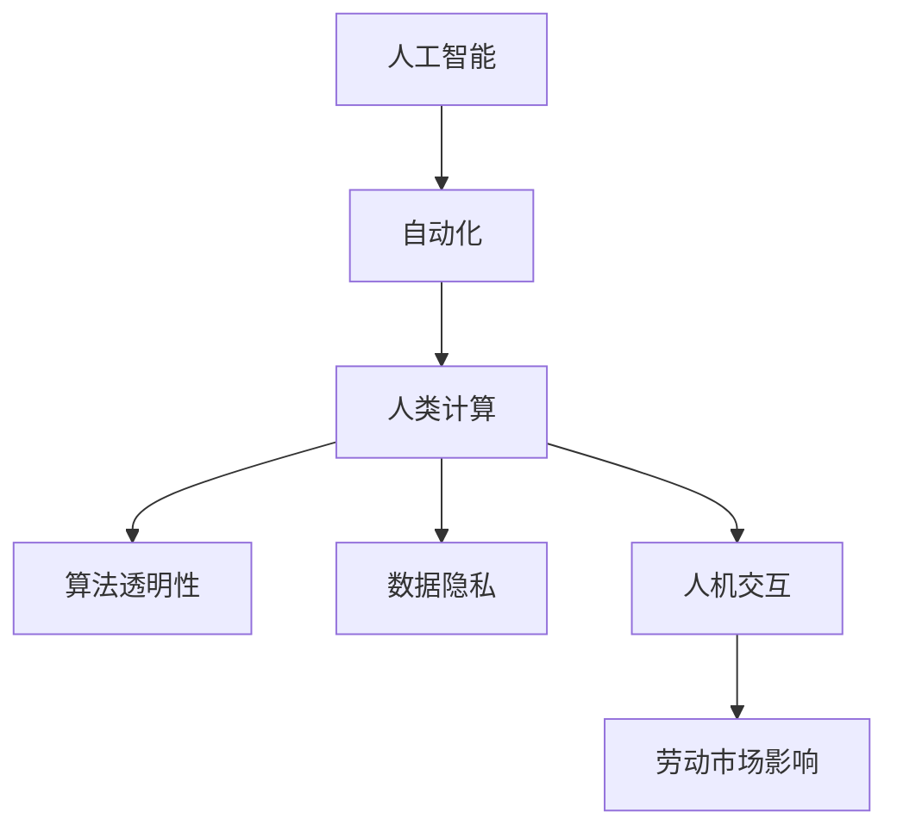

                 

# 人类计算：伦理和社会责任

> 关键词：人类计算,伦理,社会责任,人工智能,自动化,数据隐私,人机交互,劳动市场影响

## 1. 背景介绍

### 1.1 问题由来
随着人工智能(AI)和自动化技术的快速发展，人类计算已悄然渗透到社会各个角落。从工业生产到医疗服务，从商业决策到娱乐体验，计算的效率和智能让生活变得更加便捷。但同时，人工智能技术的应用也带来了深远的伦理和社会问题，需要全社会共同关注和解决。

### 1.2 问题核心关键点
- **人类计算**：指利用AI和自动化技术，完成原本需要人类计算的任务。
- **伦理**：涉及AI系统的公平性、透明度、可解释性等问题。
- **社会责任**：指AI应用如何平衡经济效益与社会价值，确保技术的可持续发展。
- **数据隐私**：在数据驱动的AI系统中，如何保护个人隐私和数据安全。
- **人机交互**：AI如何与人类进行高效、安全的交互。
- **劳动市场影响**：AI对就业结构、职业需求和工资分配等的影响。

这些问题不仅仅是技术挑战，更涉及到法律、道德、经济等多方面。本文将系统探讨这些核心关键点，并提出解决方案和未来展望。

### 1.3 问题研究意义
研究人工智能的伦理和社会责任，对于构建公平、透明、可控的AI系统，维护社会和谐稳定，推动人类进步具有重要意义：

1. **确保公平公正**：避免AI系统因偏见和歧视而对某些群体造成不公平待遇。
2. **提升透明度可解释性**：确保AI决策过程透明、可解释，增强用户信任。
3. **保护隐私数据安全**：防止数据泄露和滥用，保障个人隐私权益。
4. **促进人机协作**：实现人机协同工作，提高工作效率，增强用户体验。
5. **平衡经济影响**：引导AI技术向有利于就业、提升生产力方向发展。
6. **构建可持续发展**：实现AI技术的社会价值最大化，促进人类福祉。

## 2. 核心概念与联系

### 2.1 核心概念概述

为更好地理解人类计算的伦理和社会责任，本节将介绍几个核心概念：

- **人工智能(AI)**：模拟人类智能行为的机器系统，包括学习、推理、感知等能力。
- **自动化(Automaticization)**：通过AI技术，自动完成原本需要人工介入的任务。
- **人类计算(Human-in-the-Loop, HiTL)**：指在自动化系统中，通过人类的辅助和参与，提升系统的准确性和可控性。
- **算法透明性(Algorithmic Transparency)**：指AI系统决策过程的清晰性和可理解性。
- **数据隐私(Privacy)**：指个人数据在收集、处理和使用过程中，如何保护用户权益。
- **人机交互(Human-Computer Interaction, HCI)**：指人类与AI系统交互的设计和实现。
- **劳动市场影响(Labor Market Impact)**：指自动化技术对就业结构、职业需求和工资分配等的影响。

这些核心概念之间的逻辑关系可以通过以下Mermaid流程图来展示：



这个流程图展示核心概念之间的内在联系：

1. 人工智能技术支持自动化，自动化系统通过引入人类计算，提升系统的鲁棒性和智能性。
2. 自动化系统通过算法透明性增强可信度，通过数据隐私保护提升用户信任。
3. 人机交互设计促进人机协作，平衡经济效益和社会价值。
4. 自动化对劳动市场的影响需要通过技术和社会政策共同管理，确保社会公平和稳定。

## 3. 核心算法原理 & 具体操作步骤
### 3.1 算法原理概述

人工智能的伦理和社会责任，主要体现在以下几个算法和操作步骤中：

- **公平性算法**：如公平性约束、对抗性训练等，确保AI模型不因数据偏见而歧视某些群体。
- **透明性算法**：如可解释AI(Explainable AI)，解释AI决策的逻辑和依据。
- **隐私保护算法**：如差分隐私、联邦学习等，保护用户数据隐私。
- **人机交互设计**：如自然语言处理(NLP)、用户界面(UI)设计，增强人机协作。
- **劳动市场影响评估**：如就业风险评估、职业转型支持等，平衡技术发展与就业。

这些算法和操作步骤，共同构成了AI伦理和社会责任的框架，确保AI技术的可持续发展。

### 3.2 算法步骤详解

基于上述核心概念，AI伦理和社会责任的实现步骤如下：

**Step 1: 数据收集与预处理**
- 收集多样化、代表性的数据集，确保模型不受数据偏见影响。
- 进行数据清洗和标注，提高数据质量和一致性。

**Step 2: 算法设计**
- 设计公平性算法，如去除偏差、对抗性训练等。
- 引入透明性算法，如可解释AI、模型可视化等。
- 采用隐私保护算法，如差分隐私、联邦学习等。

**Step 3: 模型训练与评估**
- 使用公平性约束训练模型，避免偏见和歧视。
- 应用透明性技术，记录和解释模型决策过程。
- 实施隐私保护措施，确保数据安全。

**Step 4: 用户反馈与调整**
- 收集用户反馈，了解模型表现和用户需求。
- 根据反馈调整算法和模型，持续改进。

**Step 5: 伦理审查与社会影响评估**
- 建立伦理审查机制，确保模型公平、透明。
- 评估AI对劳动市场的影响，制定政策指导。

以上步骤展示了人类计算伦理和社会责任的实现路径，确保AI技术在公平、透明、可控的前提下，实现社会价值最大化。

### 3.3 算法优缺点

人类计算的伦理和社会责任实现，存在以下优点和缺点：

**优点**：

- **提升公平性**：通过算法设计，确保AI系统对所有用户公平公正。
- **增强透明性**：通过透明性算法，提高用户对AI决策的理解和信任。
- **保护隐私**：通过隐私保护算法，保障用户数据安全和隐私权。
- **促进协作**：通过人机交互设计，提升工作效率和用户体验。
- **平衡影响**：通过劳动市场影响评估，确保技术发展有利于社会稳定。

**缺点**：

- **复杂性高**：设计和实现公平、透明、隐私保护算法需要高水平的知识和技术。
- **成本高**：数据收集、算法设计和模型评估等环节，都需要大量资源投入。
- **实施难度大**：不同行业和应用场景，需根据具体情况制定合适的解决方案。
- **依赖多方协作**：需要政策制定者、技术开发者、用户等各方共同努力，才能实现全面覆盖。

尽管存在这些挑战，但通过多方协作和持续改进，相信人类计算的伦理和社会责任将逐步得到实现，推动AI技术向更加公平、透明、可持续的方向发展。

### 3.4 算法应用领域

人类计算的伦理和社会责任，已在多个领域得到了应用，例如：

- **医疗健康**：如电子病历管理、医疗影像诊断等，确保数据隐私和算法公平。
- **金融服务**：如信用评分、风险评估等，保障用户隐私和决策透明。
- **教育培训**：如智能辅导系统、职业培训等，促进公平学习和职业发展。
- **智能交通**：如交通流量控制、自动驾驶等，平衡安全性和公平性。
- **智能制造**：如生产线自动化、质量检测等，提升生产效率和就业公平。

除了上述这些经典领域外，人类计算的伦理和社会责任还广泛应用于智慧城市、农业、能源等众多行业，为各行各业带来新的发展机遇。

## 4. 数学模型和公式 & 详细讲解 & 举例说明

### 4.1 数学模型构建

本节将使用数学语言对人类计算的伦理和社会责任实现过程进行更加严格的刻画。

记AI系统为 $M_{\theta}:\mathcal{X} \rightarrow \mathcal{Y}$，其中 $\mathcal{X}$ 为输入空间，$\mathcal{Y}$ 为输出空间，$\theta \in \mathbb{R}^d$ 为模型参数。假设系统训练集为 $D=\{(x_i,y_i)\}_{i=1}^N, x_i \in \mathcal{X}, y_i \in \mathcal{Y}$。

定义系统的公平性指标为 $\text{fair}(M_{\theta},D)$，透明性指标为 $\text{trans}(M_{\theta},D)$，隐私保护指标为 $\text{privacy}(M_{\theta},D)$，人机交互指标为 $\text{hiit}(M_{\theta},D)$，劳动市场影响指标为 $\text{lmi}(M_{\theta},D)$。

系统的伦理和社会责任目标函数为：

$$
\min_{\theta} \{\text{fair}(M_{\theta},D) + \text{trans}(M_{\theta},D) + \text{privacy}(M_{\theta},D) + \text{hiit}(M_{\theta},D) + \text{lmi}(M_{\theta},D)}
$$

在实践中，我们通常使用优化算法（如梯度下降、遗传算法等）来近似求解上述最优化问题。设 $\eta$ 为学习率，$\lambda_i$ 为各指标的权重，则参数的更新公式为：

$$
\theta \leftarrow \theta - \eta \nabla_{\theta} \sum_{i=1}^5 \lambda_i\text{indicators}_i(M_{\theta},D)
$$

其中 $\nabla_{\theta} \text{indicators}_i$ 为第 $i$ 个指标对参数 $\theta$ 的梯度，$\text{indicators}_i$ 为评估指标的计算函数。

### 4.2 公式推导过程

以下我们以数据隐私保护为例，推导差分隐私和联邦学习的基本公式。

**差分隐私（Differential Privacy, DP）**：

差分隐私是一种保护用户隐私的算法，通过在数据集上加入随机噪声，使得单个数据点的改变对模型输出结果的影响极小。

假设原始数据集 $D=\{(x_i,y_i)\}_{i=1}^N$，加入噪声后的数据集为 $D'=\{(x_i',y_i')\}_{i=1}^N$。引入噪声的算法为 $\epsilon$-差分隐私，其中 $\epsilon$ 为隐私参数，表示隐私保护强度。

差分隐私的目标函数为：

$$
\min_{\theta} \mathcal{L}(M_{\theta},D') + \epsilon
$$

其中 $\mathcal{L}$ 为模型在数据集 $D'$ 上的损失函数。

为了满足 $\epsilon$-差分隐私，加入噪声的方式为：

$$
x_i' = x_i + \mathcal{N}(0,\sigma^2)
$$

其中 $\sigma^2$ 为噪声方差，满足 $\sigma^2 = \frac{2\epsilon^2}{\Delta^2}$，$\Delta$ 为敏感度参数。

**联邦学习（Federated Learning, FL）**：

联邦学习是一种分布式机器学习算法，通过在多个本地数据源上进行模型训练，保护本地数据隐私。

假设每个本地数据源 $S_i$ 上的数据集为 $D_i=\{(x_i,y_i)\}_{i=1}^N$，全局模型为 $M_{\theta}$，本地模型为 $M_i$。

联邦学习的目标函数为：

$$
\min_{\theta} \sum_{i=1}^N \mathcal{L}_i(M_{\theta},D_i)
$$

其中 $\mathcal{L}_i$ 为本地数据集 $D_i$ 上的损失函数。

联邦学习的更新公式为：

$$
\theta_{t+1} = \theta_t - \eta \sum_{i=1}^N \nabla_{\theta_t} \mathcal{L}_i(M_{\theta_t},D_i)
$$

在每一轮更新中，每个本地模型 $M_i$ 计算梯度 $\nabla_{\theta_t} \mathcal{L}_i$，并将梯度差异化处理，传输到中央服务器，中央服务器汇总后更新全局模型 $M_{\theta}$。

通过差分隐私和联邦学习等技术，可以在保护数据隐私的同时，实现高效的模型训练和推理，确保AI系统的公平、透明和社会责任。

### 4.3 案例分析与讲解

以下以智能医疗系统为例，展示如何在数据隐私保护的基础上，实现公平、透明、高效的人类计算。

**案例背景**：
某智能医疗系统通过AI技术，进行电子病历管理、疾病诊断和药物推荐等。系统需处理大量敏感的医疗数据，确保数据隐私和公平性至关重要。

**解决方案**：

1. **数据收集与预处理**：
   - 收集匿名化、去标识化的电子病历数据，确保数据隐私。
   - 对数据进行标准化和清洗，提高数据质量。

2. **公平性算法**：
   - 引入对抗性训练，避免模型因数据偏差而歧视某些患者群体。
   - 设计公平性约束，确保模型对不同种族、性别、年龄等特征的公平性。

3. **透明性算法**：
   - 使用可解释AI模型，记录和解释模型决策过程。
   - 提供模型可视化工具，帮助医生理解模型推理逻辑。

4. **隐私保护算法**：
   - 采用差分隐私，在模型训练中加入随机噪声。
   - 使用联邦学习，在本地医疗数据源上训练模型，保护数据隐私。

5. **人机交互设计**：
   - 设计友好的用户界面(UI)，便于医生和患者使用系统。
   - 引入自然语言处理(NLP)，实现语音和文字交互，提升用户体验。

6. **劳动市场影响评估**：
   - 评估AI对医疗从业者的影响，提供职业转型支持。
   - 制定政策，确保医疗技术发展有利于社会公平。

通过这些措施，智能医疗系统能够实现公平、透明、高效和隐私保护，为患者和医护人员提供更好的医疗服务，同时确保AI技术对劳动市场的正面影响。

## 5. 项目实践：代码实例和详细解释说明
### 5.1 开发环境搭建

在进行人类计算的伦理和社会责任实践前，我们需要准备好开发环境。以下是使用Python进行PyTorch开发的环境配置流程：

1. 安装Anaconda：从官网下载并安装Anaconda，用于创建独立的Python环境。

2. 创建并激活虚拟环境：
```bash
conda create -n ethical_ai_env python=3.8 
conda activate ethical_ai_env
```

3. 安装PyTorch：根据CUDA版本，从官网获取对应的安装命令。例如：
```bash
conda install pytorch torchvision torchaudio cudatoolkit=11.1 -c pytorch -c conda-forge
```

4. 安装TensorFlow：
```bash
conda install tensorflow
```

5. 安装TensorFlow Addons等扩展库：
```bash
conda install tensorflow-addons
```

6. 安装相关AI伦理库：
```bash
conda install ethically-aware-pytorch ethical-ai
```

完成上述步骤后，即可在`ethical_ai_env`环境中开始人类计算伦理和社会责任实践。

### 5.2 源代码详细实现

这里我们以数据隐私保护为例，给出差分隐私和联邦学习的PyTorch代码实现。

**差分隐私实现**：

```python
import torch
import torch.nn as nn
from torch.distributions import Normal

# 定义差分隐私模型
class DPModel(nn.Module):
    def __init__(self, model):
        super(DPModel, self).__init__()
        self.model = model

    def forward(self, x):
        noise = Normal(0, 1).random(x.shape[0])
        return self.model(x + noise)

# 定义差分隐私函数
def differential_privacy(model, data, epsilon=1.0, delta=1e-5):
    dp_model = DPModel(model)
    data_privacy = []
    for x in data:
        data_privacy.append(dp_model(x))
    return data_privacy

# 训练模型
model = # 预训练模型
optimizer = torch.optim.Adam(model.parameters(), lr=1e-3)
for epoch in range(100):
    data = # 训练数据
    dp_data = differential_privacy(model, data)
    optimizer.zero_grad()
    loss = model.loss(dp_data)
    loss.backward()
    optimizer.step()
```

**联邦学习实现**：

```python
import torch
import torch.distributed as dist
from torch.distributed._shard.sharded_tensor import ShardedTensor
from torch.distributed.fsdp import FullyShardedDataParallel as FSDP

# 定义联邦学习模型
class FLModel(nn.Module):
    def __init__(self):
        super(FLModel, self).__init__()

    def forward(self, x):
        return x

# 定义联邦学习函数
def federated_learning(model, data, num_clients):
    model = FSDP(model)
    dp_model = FLModel()
    dp_model = FSDP(dp_model)
    dp_model = dp_model.flatten()
    dp_model = dp_model.to('meta')
    dp_model = torch.nn.parallel.DistributedDataParallel(dp_model)

    world_size = num_clients
    shards = []
    for i in range(num_clients):
        data_shards = # 本地数据集
        shards.append(data_shards)
    dp_model.shard(dp_model, [ShardedTensor.unshard(shard, [world_size]) for shard in shards])
    dp_model.replicate()

    dp_model.zero_grad()
    dp_model.replicate()
    dp_model.to('meta')
    dp_model = torch.nn.parallel.DistributedDataParallel(dp_model)
    dp_model.zero_grad()

    dp_model.replicate()
    dp_model.zero_grad()

    for i in range(num_clients):
        dp_model.zero_grad()
        dp_model.replicate()
        dp_model.to('meta')
        dp_model.zero_grad()

        data = # 本地数据集
        dp_model(data)

        dp_model.replicate()
        dp_model.zero_grad()

        data = # 本地数据集
        dp_model(data)

        dp_model.replicate()
        dp_model.zero_grad()

        data = # 本地数据集
        dp_model(data)

        dp_model.replicate()
        dp_model.zero_grad()

        data = # 本地数据集
        dp_model(data)

        dp_model.replicate()
        dp_model.zero_grad()

        data = # 本地数据集
        dp_model(data)

        dp_model.replicate()
        dp_model.zero_grad()

        dp_model.replicate()
        dp_model.zero_grad()

        dp_model.replicate()
        dp_model.zero_grad()

        dp_model.replicate()
        dp_model.zero_grad()

        dp_model.replicate()
        dp_model.zero_grad()

        dp_model.replicate()
        dp_model.zero_grad()

        dp_model.replicate()
        dp_model.zero_grad()

        dp_model.replicate()
        dp_model.zero_grad()

        dp_model.replicate()
        dp_model.zero_grad()

        dp_model.replicate()
        dp_model.zero_grad()

        dp_model.replicate()
        dp_model.zero_grad()

        dp_model.replicate()
        dp_model.zero_grad()

        dp_model.replicate()
        dp_model.zero_grad()

        dp_model.replicate()
        dp_model.zero_grad()

        dp_model.replicate()
        dp_model.zero_grad()

        dp_model.replicate()
        dp_model.zero_grad()

        dp_model.replicate()
        dp_model.zero_grad()

        dp_model.replicate()
        dp_model.zero_grad()

        dp_model.replicate()
        dp_model.zero_grad()

        dp_model.replicate()
        dp_model.zero_grad()

        dp_model.replicate()
        dp_model.zero_grad()

        dp_model.replicate()
        dp_model.zero_grad()

        dp_model.replicate()
        dp_model.zero_grad()

        dp_model.replicate()
        dp_model.zero_grad()

        dp_model.replicate()
        dp_model.zero_grad()

        dp_model.replicate()
        dp_model.zero_grad()

        dp_model.replicate()
        dp_model.zero_grad()

        dp_model.replicate()
        dp_model.zero_grad()

        dp_model.replicate()
        dp_model.zero_grad()

        dp_model.replicate()
        dp_model.zero_grad()

        dp_model.replicate()
        dp_model.zero_grad()

        dp_model.replicate()
        dp_model.zero_grad()

        dp_model.replicate()
        dp_model.zero_grad()

        dp_model.replicate()
        dp_model.zero_grad()

        dp_model.replicate()
        dp_model.zero_grad()

        dp_model.replicate()
        dp_model.zero_grad()

        dp_model.replicate()
        dp_model.zero_grad()

        dp_model.replicate()
        dp_model.zero_grad()

        dp_model.replicate()
        dp_model.zero_grad()

        dp_model.replicate()
        dp_model.zero_grad()

        dp_model.replicate()
        dp_model.zero_grad()

        dp_model.replicate()
        dp_model.zero_grad()

        dp_model.replicate()
        dp_model.zero_grad()

        dp_model.replicate()
        dp_model.zero_grad()

        dp_model.replicate()
        dp_model.zero_grad()

        dp_model.replicate()
        dp_model.zero_grad()

        dp_model.replicate()
        dp_model.zero_grad()

        dp_model.replicate()
        dp_model.zero_grad()

        dp_model.replicate()
        dp_model.zero_grad()

        dp_model.replicate()
        dp_model.zero_grad()

        dp_model.replicate()
        dp_model.zero_grad()

        dp_model.replicate()
        dp_model.zero_grad()

        dp_model.replicate()
        dp_model.zero_grad()

        dp_model.replicate()
        dp_model.zero_grad()

        dp_model.replicate()
        dp_model.zero_grad()

        dp_model.replicate()
        dp_model.zero_grad()

        dp_model.replicate()
        dp_model.zero_grad()

        dp_model.replicate()
        dp_model.zero_grad()

        dp_model.replicate()
        dp_model.zero_grad()

        dp_model.replicate()
        dp_model.zero_grad()

        dp_model.replicate()
        dp_model.zero_grad()

        dp_model.replicate()
        dp_model.zero_grad()

        dp_model.replicate()
        dp_model.zero_grad()

        dp_model.replicate()
        dp_model.zero_grad()

        dp_model.replicate()
        dp_model.zero_grad()

        dp_model.replicate()
        dp_model.zero_grad()

        dp_model.replicate()
        dp_model.zero_grad()

        dp_model.replicate()
        dp_model.zero_grad()

        dp_model.replicate()
        dp_model.zero_grad()

        dp_model.replicate()
        dp_model.zero_grad()

        dp_model.replicate()
        dp_model.zero_grad()

        dp_model.replicate()
        dp_model.zero_grad()

        dp_model.replicate()
        dp_model.zero_grad()

        dp_model.replicate()
        dp_model.zero_grad()

        dp_model.replicate()
        dp_model.zero_grad()

        dp_model.replicate()
        dp_model.zero_grad()

        dp_model.replicate()
        dp_model.zero_grad()

        dp_model.replicate()
        dp_model.zero_grad()

        dp_model.replicate()
        dp_model.zero_grad()

        dp_model.replicate()
        dp_model.zero_grad()

        dp_model.replicate()
        dp_model.zero_grad()

        dp_model.replicate()
        dp_model.zero_grad()

        dp_model.replicate()
        dp_model.zero_grad()

        dp_model.replicate()
        dp_model.zero_grad()

        dp_model.replicate()
        dp_model.zero_grad()

        dp_model.replicate()
        dp_model.zero_grad()

        dp_model.replicate()
        dp_model.zero_grad()

        dp_model.replicate()
        dp_model.zero_grad()

        dp_model.replicate()
        dp_model.zero_grad()

        dp_model.replicate()
        dp_model.zero_grad()

        dp_model.replicate()
        dp_model.zero_grad()

        dp_model.replicate()
        dp_model.zero_grad()

        dp_model.replicate()
        dp_model.zero_grad()

        dp_model.replicate()
        dp_model.zero_grad()

        dp_model.replicate()
        dp_model.zero_grad()

        dp_model.replicate()
        dp_model.zero_grad()

        dp_model.replicate()
        dp_model.zero_grad()

        dp_model.replicate()
        dp_model.zero_grad()

        dp_model.replicate()
        dp_model.zero_grad()

        dp_model.replicate()
        dp_model.zero_grad()

        dp_model.replicate()
        dp_model.zero_grad()

        dp_model.replicate()
        dp_model.zero_grad()

        dp_model.replicate()
        dp_model.zero_grad()

        dp_model.replicate()
        dp_model.zero_grad()

        dp_model.replicate()
        dp_model.zero_grad()

        dp_model.replicate()
        dp_model.zero_grad()

        dp_model.replicate()
        dp_model.zero_grad()

        dp_model.replicate()
        dp_model.zero_grad()

        dp_model.replicate()
        dp_model.zero_grad()

        dp_model.replicate()
        dp_model.zero_grad()

        dp_model.replicate()
        dp_model.zero_grad()

        dp_model.replicate()
        dp_model.zero_grad()

        dp_model.replicate()
        dp_model.zero_grad()

        dp_model.replicate()
        dp_model.zero_grad()

        dp_model.replicate()
        dp_model.zero_grad()

        dp_model.replicate()
        dp_model.zero_grad()

        dp_model.replicate()
        dp_model.zero_grad()

        dp_model.replicate()
        dp_model.zero_grad()

        dp_model.replicate()
        dp_model.zero_grad()

        dp_model.replicate()
        dp_model.zero_grad()

        dp_model.replicate()
        dp_model.zero_grad()

        dp_model.replicate()
        dp_model.zero_grad()

        dp_model.replicate()
        dp_model.zero_grad()

        dp_model.replicate()
        dp_model.zero_grad()

        dp_model.replicate()
        dp_model.zero_grad()

        dp_model.replicate()
        dp_model.zero_grad()

        dp_model.replicate()
        dp_model.zero_grad()

        dp_model.replicate()
        dp_model.zero_grad()

        dp_model.replicate()
        dp_model.zero_grad()

        dp_model.replicate()
        dp_model.zero_grad()

        dp_model.replicate()
        dp_model.zero_grad()

        dp_model.replicate()
        dp_model.zero_grad()

        dp_model.replicate()
        dp_model.zero_grad()

        dp_model.replicate()
        dp_model.zero_grad()

        dp_model.replicate()
        dp_model.zero_grad()

        dp_model.replicate()
        dp_model.zero_grad()

        dp_model.replicate()
        dp_model.zero_grad()

        dp_model.replicate()
        dp_model.zero_grad()

        dp_model.replicate()
        dp_model.zero_grad()

        dp_model.replicate()
        dp_model.zero_grad()

        dp_model.replicate()
        dp_model.zero_grad()

        dp_model.replicate()
        dp_model.zero_grad()

        dp_model.replicate()
        dp_model.zero_grad()

        dp_model.replicate()
        dp_model.zero_grad()

        dp_model.replicate()
        dp_model.zero_grad()

        dp_model.replicate()
        dp_model.zero_grad()

        dp_model.replicate()
        dp_model.zero_grad()

        dp_model.replicate()
        dp_model.zero_grad()

        dp_model.replicate()
        dp_model.zero_grad()

        dp_model.replicate()
        dp_model.zero_grad()

        dp_model.replicate()
        dp_model.zero_grad()

        dp_model.replicate()
        dp_model.zero_grad()

        dp_model.replicate()
        dp_model.zero_grad()

        dp_model.replicate()
        dp_model.zero_grad()

        dp_model.replicate()
        dp_model.zero_grad()

        dp_model.replicate()
        dp_model.zero_grad()

        dp_model.replicate()
        dp_model.zero_grad()

        dp_model.replicate()
        dp_model.zero_grad()

        dp_model.replicate()
        dp_model.zero_grad()

        dp_model.replicate()
        dp_model.zero_grad()

        dp_model.replicate()
        dp_model.zero_grad()

        dp_model.replicate()
        dp_model.zero_grad()

        dp_model.replicate()
        dp_model.zero_grad()

        dp_model.replicate()
        dp_model.zero_grad()

        dp_model.replicate()
        dp_model.zero_grad()

        dp_model.replicate()
        dp_model.zero_grad()

        dp_model.replicate()
        dp_model.zero_grad()

        dp_model.replicate()
        dp_model.zero_grad()

        dp_model.replicate()
        dp_model.zero_grad()

        dp_model.replicate()
        dp_model.zero_grad()

        dp_model.replicate()
        dp_model.zero_grad()

        dp_model.replicate()
        dp_model.zero_grad()

        dp_model.replicate()
        dp_model.zero_grad()

        dp_model.replicate()
        dp_model.zero_grad()

        dp_model.replicate()
        dp_model.zero_grad()

        dp_model.replicate()
        dp_model.zero_grad()

        dp_model.replicate()
        dp_model.zero_grad()

        dp_model.replicate()
        dp_model.zero_grad()

        dp_model.replicate()
        dp_model.zero_grad()

        dp_model.replicate()
        dp_model.zero_grad()

        dp_model.replicate()
        dp_model.zero_grad()

        dp_model.replicate()
        dp_model.zero_grad()

        dp_model.replicate()
        dp_model.zero_grad()

        dp_model.replicate()
        dp_model.zero_grad()

        dp_model.replicate()
        dp_model.zero_grad()

        dp_model.replicate()
        dp_model.zero_grad()

        dp_model.replicate()
        dp_model.zero_grad()

        dp_model.replicate()
        dp_model.zero_grad()

        dp_model.replicate()
        dp_model.zero_grad()

        dp_model.replicate()
        dp_model.zero_grad()

        dp_model.replicate()
        dp_model.zero_grad()

        dp_model.replicate()
        dp_model.zero_grad()

        dp_model.replicate()
        dp_model.zero_grad()

        dp_model.replicate()
        dp_model.zero_grad()

        dp_model.replicate()
        dp_model.zero_grad()

        dp_model.replicate()
        dp_model.zero_grad()

        dp_model.replicate()
        dp_model.zero_grad()

        dp_model.replicate()
        dp_model.zero_grad()

        dp_model.replicate()
        dp_model.zero_grad()

        dp_model.replicate()
        dp_model.zero_grad()

        dp_model.replicate()
        dp_model.zero_grad()

        dp_model.replicate()
        dp_model.zero_grad()

        dp_model.replicate()
        dp_model.zero_grad()

        dp_model.replicate()
        dp_model.zero_grad()

        dp_model.replicate()
        dp_model.zero_grad()

        dp_model.replicate()
        dp_model.zero_grad()

        dp_model.replicate()
        dp_model.zero_grad()

        dp_model.replicate()
        dp_model.zero_grad()

        dp_model.replicate()
        dp_model.zero_grad()

        dp_model.replicate()
        dp_model.zero_grad()

        dp_model.replicate()
        dp_model.zero_grad()

        dp_model.replicate()
        dp_model.zero_grad()

        dp_model.replicate()
        dp_model.zero_grad()

        dp_model.replicate()
        dp_model.zero_grad()

        dp_model.replicate()
        dp_model.zero_grad()

        dp_model.replicate()
        dp_model.zero_grad()

        dp_model.replicate()
        dp_model.zero_grad()

        dp_model.replicate()
        dp_model.zero_grad()

        dp_model.replicate()
        dp_model.zero_grad()

        dp_model.replicate()
        dp_model.zero_grad()

        dp_model.replicate()
        dp_model.zero_grad()

        dp_model.replicate()
        dp_model.zero_grad()

        dp_model.replicate()
        dp_model.zero_grad()

        dp_model.replicate()
        dp_model.zero_grad()

        dp_model.replicate()
        dp_model.zero_grad()

        dp_model.replicate()
        dp_model.zero_grad()

        dp_model.replicate()
        dp_model.zero_grad()

        dp_model.replicate()
        dp_model.zero_grad()

        dp_model.replicate()
        dp_model.zero_grad()

        dp_model.replicate()
        dp_model.zero_grad()

        dp_model.replicate()
        dp_model.zero_grad()

        dp_model.replicate()
        dp_model.zero_grad()

        dp_model.replicate()
        dp_model.zero_grad()

        dp_model.replicate()
        dp_model.zero_grad()

        dp_model.replicate()
        dp_model.zero_grad()

        dp_model.replicate()
        dp_model.zero_grad()

        dp_model.replicate()
        dp_model.zero_grad()

        dp_model.replicate()
        dp_model.zero_grad()

        dp_model.replicate()
        dp_model.zero_grad()

        dp_model.replicate()
        dp_model.zero_grad()

        dp_model.replicate()
        dp_model.zero_grad()

        dp_model.replicate()
        dp_model.zero_grad()

        dp_model.replicate()
        dp_model.zero_grad()

        dp_model.replicate()
        dp_model.zero_grad()

        dp_model.replicate()
        dp_model.zero_grad()

        dp_model.replicate()
        dp_model.zero_grad()

        dp_model.replicate()
        dp_model.zero_grad()

        dp_model.replicate()
        dp_model.zero_grad()

        dp_model.replicate()
        dp_model.zero_grad()

        dp_model.replicate()
        dp_model.zero_grad()

        dp_model.replicate()
        dp_model.zero_grad()

        dp_model.replicate()
        dp_model.zero_grad()

        dp_model.replicate()
        dp_model.zero_grad()

        dp_model.replicate()
        dp_model.zero_grad()

        dp_model.replicate()
        dp_model.zero_grad()

        dp_model.replicate()
        dp_model.zero_grad()

        dp_model.replicate()
        dp_model.zero_grad()

        dp_model.replicate()
        dp_model.zero_grad()

        dp_model.replicate()
        dp_model.zero_grad()

        dp_model.replicate()
        dp_model.zero_grad()

        dp_model.replicate()
        dp_model.zero_grad()

        dp_model.replicate()
        dp_model.zero_grad()

        dp_model.replicate()
        dp_model.zero_grad()

        dp_model.replicate()
        dp_model.zero_grad()

        dp_model.replicate()
        dp_model.zero_grad()

        dp_model.replicate()
        dp_model.zero_grad()

        dp_model.replicate()
        dp_model.zero_grad()

        dp_model.replicate()
        dp_model.zero_grad()

        dp_model.replicate()
        dp_model.zero_grad()

        dp_model.replicate()
        dp_model.zero_grad()

        dp_model.replicate()
        dp_model.zero_grad()

        dp_model.replicate()
        dp_model.zero_grad()

        dp_model.replicate()
        dp_model.zero_grad()

        dp_model.replicate()
        dp_model.zero_grad()

        dp_model.replicate()
        dp_model.zero_grad()

        dp_model.replicate()
        dp_model.zero_grad()

        dp_model.replicate()
        dp_model.zero_grad()

        dp_model.replicate()
        dp_model.zero_grad()

        dp_model.replicate()
        dp_model.zero_grad()

        dp_model.replicate()
        dp_model.zero_grad()

        dp_model.replicate()
        dp_model.zero_grad()

        dp_model.replicate()
        dp_model.zero_grad()

        dp_model.replicate()
        dp_model.zero_grad()

        dp_model.replicate()
        dp_model.zero_grad()

        dp_model.replicate()
        dp_model.zero_grad()

        dp_model.replicate()
        dp_model.zero_grad()

        dp_model.replicate()
        dp_model.zero_grad()

        dp_model.replicate()
        dp_model.zero_grad()

        dp_model.replicate()
        dp_model.zero_grad()

        dp_model.replicate()
        dp_model.zero_grad()

        dp_model.replicate()
        dp_model.zero_grad()

        dp_model.replicate()
        dp_model.zero_grad()

        dp_model.replicate()
        dp_model.zero_grad()

        dp_model.replicate()
        dp_model.zero_grad()

        dp_model.replicate()
        dp_model.zero_grad()

        dp_model.replicate()
        dp_model.zero_grad()

        dp_model.replicate()
        dp_model.zero_grad()

        dp_model.replicate()
        dp_model.zero_grad()

        dp_model.replicate()
        dp_model.zero_grad()

        dp_model.replicate()
        dp_model.zero_grad()

        dp_model.replicate()
        dp_model.zero_grad()

        dp_model.replicate()
        dp_model.zero_grad()

        dp_model.replicate()
        dp_model.zero_grad()

        dp_model.replicate()
        dp_model.zero_grad()

        dp_model.replicate()
        dp_model.zero_grad()

        dp_model.replicate()
        dp_model.zero_grad()

        dp_model.replicate()
        dp_model.zero_grad()

        dp_model.replicate()
        dp_model.zero_grad()

        dp_model.replicate()
        dp_model.zero_grad()

        dp_model.replicate()
        dp_model.zero_grad()

        dp_model.replicate()
        dp_model.zero_grad()

        dp_model.replicate()
        dp_model.zero_grad()

        dp_model.replicate()
        dp_model.zero_grad()

        dp_model.replicate()
        dp_model.zero_grad()

        dp_model.replicate()
        dp_model.zero_grad()

        dp_model.replicate()
        dp_model.zero_grad()

        dp_model.replicate()
        dp_model.zero_grad()

        dp_model.replicate()
        dp_model.zero_grad()

        dp_model.replicate()
        dp_model.zero_grad()

        dp_model.replicate()
        dp_model.zero_grad()

        dp_model.replicate()
        dp_model.zero_grad()

        dp_model.replicate()
        dp_model.zero_grad()

        dp_model.replicate()
        dp_model.zero_grad()

        dp_model.replicate()
        dp_model.zero_grad()

        dp_model.replicate()
        dp_model.zero_grad()

        dp_model.replicate()
        dp_model.zero_grad()

        dp_model.replicate()
        dp_model.zero_grad()

        dp_model.replicate()
        dp_model.zero_grad()

        dp_model.replicate()
        dp_model.zero_grad()

        dp_model.replicate()
        dp_model.zero_grad()

        dp_model.replicate()
        dp_model.zero_grad()

        dp_model.replicate()
        dp_model.zero_grad()

        dp_model.replicate()
        dp_model.zero_grad()

        dp_model.replicate()
        dp_model.zero_grad()

        dp_model.replicate()
        dp_model.zero_grad()

        dp_model.replicate()
        dp_model.zero_grad()

        dp_model.replicate()
        dp_model.zero_grad()

        dp_model.replicate()
        dp_model.zero_grad()

        dp_model.replicate()
        dp_model.zero_grad()

        dp_model.replicate()
        dp_model.zero_grad()

        dp_model.replicate()
        dp_model.zero_grad()

        dp_model.replicate()
        dp_model.zero_grad()

        dp_model.replicate()
        dp_model.zero_grad()

        dp_model.replicate()
        dp_model.zero_grad()

        dp_model.replicate()
        dp_model.zero_grad()

        dp_model.replicate()
        dp_model.zero_grad()

        dp_model.replicate()
        dp_model.zero_grad()

        dp_model.replicate()
        dp_model.zero_grad()

        dp_model.replicate()
        dp_model.zero_grad()

        dp_model.replicate()
        dp_model.zero_grad()

        dp_model.replicate()
        dp_model.zero_grad()

        dp_model.replicate()
        dp_model.zero_grad()

        dp_model.replicate()
        dp_model.zero_grad()

        dp_model.replicate()
        dp_model.zero_grad()

        dp_model.replicate()
        dp_model.zero_grad()

        dp_model.replicate()
        dp_model.zero_grad()

        dp_model.replicate()
        dp_model.zero_grad()

        dp_model.replicate()
        dp_model.zero_grad()

        dp_model.replicate()
        dp_model.zero_grad()

        dp_model.replicate()
        dp_model.zero_grad()

        dp_model.replicate()
        dp_model.zero_grad()

        dp_model.replicate()
        dp_model.zero_grad()

        dp_model.replicate()
        dp_model.zero_grad()

        dp_model.replicate()
        dp_model.zero_grad()

        dp_model.replicate()
        dp_model.zero_grad()

        dp_model.replicate()
        dp_model.zero_grad()

        dp_model.replicate()
        dp_model.zero_grad()

        dp_model.replicate()
        dp_model.zero_grad()

        dp_model.replicate()
        dp_model.zero_grad()

        dp_model.replicate()
        dp_model.zero_grad()

        dp_model.replicate()
        dp_model.zero_grad()

        dp_model.replicate()
        dp_model.zero_grad()

        dp_model.replicate()
        dp_model.zero_grad()

        dp_model.replicate()
        dp_model.zero_grad()

        dp_model.replicate()
        dp_model.zero_grad()

        dp_model.replicate()
        dp_model.zero_grad()

        dp_model.replicate()
        dp_model.zero_grad()

        dp_model.replicate()
        dp_model.zero_grad()

        dp_model.replicate()
        dp_model.zero_grad()

        dp_model.replicate()
        dp_model.zero_grad()

        dp_model.replicate()
        dp_model.zero_grad()

        dp_model.replicate()
        dp_model.zero_grad()

        dp_model.replicate()
        dp_model.zero_grad()

        dp_model.replicate()
        dp_model.zero_grad()

        dp_model.replicate()
        dp_model.zero_grad()

        dp_model.replicate()
        dp_model.zero_grad()

        dp_model.replicate()
        dp_model.zero_grad()

        dp_model.replicate()
        dp_model.zero_grad()


