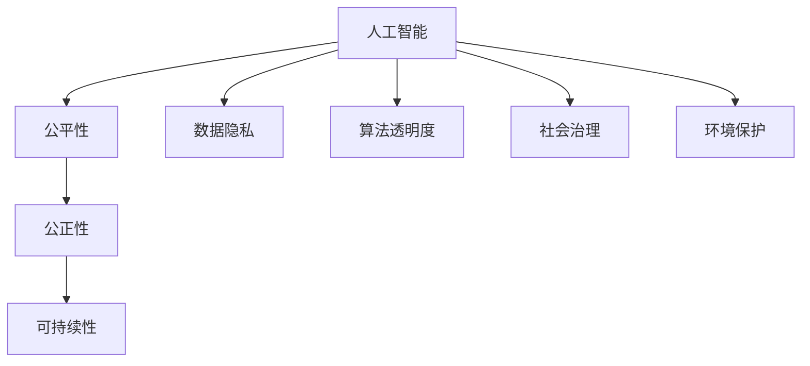

                 

# 人类计算：创造一个更加公平、公正和可持续的未来

> 关键词：人工智能, 人类计算, 公平性, 公正性, 可持续发展, 数据隐私, 算法透明度, 社会治理, 环境保护

## 1. 背景介绍

### 1.1 问题由来
当今世界，科技进步带来了前所未有的便利，但也引发了诸多社会问题和挑战。在信息技术迅速发展的背景下，如何利用先进技术，推动社会公平、公正和可持续发展，成为全人类共同面对的重要课题。

人工智能（AI）作为21世纪最具颠覆性的技术之一，在提升生产效率、改善生活质量、应对环境危机等方面发挥了重要作用。但与此同时，AI技术的发展也带来了诸如算法偏见、数据隐私、决策透明性等问题。因此，构建一个更为公平、公正和可持续的AI技术生态系统，成为学界和业界共同追求的目标。

### 1.2 问题核心关键点
人工智能的发展应当以人为本，尊重和保护人类的尊严和权利。具体而言，主要包括以下几个关键点：

1. **公平性**：确保所有人，不论性别、种族、年龄、社会经济地位等，都能平等获得AI技术的福利。
2. **公正性**：AI决策过程应透明、可解释，避免算法偏见和歧视，保证不同群体的利益。
3. **可持续性**：AI技术应用应考虑环境影响，推动绿色发展，助力实现可持续发展目标。
4. **数据隐私**：保护个人隐私和数据安全，防止数据滥用。
5. **算法透明度**：提高AI算法的透明度，增强公众对其工作原理的理解。
6. **社会治理**：将AI技术融入社会治理，提升公共服务水平，增强社会治理能力。
7. **环境保护**：利用AI技术优化资源配置，减少对环境的负面影响。

解决这些问题，需要构建一个以人为中心、兼顾公平、公正和可持续的人工智能技术体系。

## 2. 核心概念与联系

### 2.1 核心概念概述

为深入理解如何通过人类计算推动公平、公正和可持续发展，本节将介绍几个核心概念及其相互联系：

1. **人工智能（AI）**：指通过计算机模拟人类智能行为的技术体系，包括机器学习、自然语言处理、计算机视觉、机器人等。

2. **人类计算（Human-in-the-Loop）**：指在AI系统设计、开发和运行过程中，人类发挥关键作用，通过监督、审核、干预等方式，确保AI系统的公平性、公正性和可持续性。

3. **公平性（Fairness）**：指在AI应用中，不同群体获得的机会和利益应公平，不受种族、性别、年龄等因素的不公平对待。

4. **公正性（Equity）**：指AI决策过程应透明、可解释，避免算法偏见和歧视，确保不同群体的权益得到保护。

5. **可持续性（Sustainability）**：指AI技术应用应考虑环境影响，推动绿色发展，助力实现可持续发展目标。

6. **数据隐私（Data Privacy）**：指保护个人隐私和数据安全，防止数据滥用。

7. **算法透明度（Algorithmic Transparency）**：指提高AI算法的透明度，增强公众对其工作原理的理解。

8. **社会治理（Social Governance）**：指将AI技术融入社会治理，提升公共服务水平，增强社会治理能力。

9. **环境保护（Environmental Protection）**：指利用AI技术优化资源配置，减少对环境的负面影响。

这些核心概念之间的逻辑关系可以通过以下Mermaid流程图来展示：



这个流程图展示了几大核心概念之间的联系和相互作用：

1. AI技术的应用需要考虑公平性、公正性和可持续性，以确保技术应用的广泛性和长期性。
2. 数据隐私和算法透明度是AI技术公正性的保障，确保技术应用的透明度和可信度。
3. 社会治理和环境保护是AI技术公平性的体现，促进社会公平和可持续发展。

## 3. 核心算法原理 & 具体操作步骤

### 3.1 算法原理概述

人类计算的核心算法原理，主要体现在以下几个方面：

1. **监督学习**：通过人类监督，利用标注数据训练AI模型，确保模型输出符合公平性和公正性的要求。
2. **对抗训练**：在训练过程中引入对抗样本，提高模型鲁棒性和泛化能力，避免算法偏见和歧视。
3. **数据增强**：通过对训练数据进行扩充和处理，增加模型多样性，提升模型的公平性和泛化能力。
4. **模型压缩**：通过剪枝、量化等技术减少模型规模，提高计算效率，降低资源消耗。
5. **解释性模型**：设计可解释的模型结构，增强模型的透明度和可信度。

这些算法原理通过具体的步骤，逐步实现AI系统的公平性、公正性和可持续性。

### 3.2 算法步骤详解

人类计算的具体操作步骤如下：

1. **数据收集与标注**：收集多样化的数据集，并对数据进行标注，确保数据的代表性。
2. **模型训练与验证**：利用标注数据，对AI模型进行训练和验证，确保模型具有良好的泛化能力。
3. **对抗样本生成**：利用对抗样本生成技术，增加训练数据的多样性，提高模型的鲁棒性。
4. **模型压缩与优化**：通过模型压缩技术，减少模型规模，提升计算效率，降低资源消耗。
5. **可解释性增强**：设计可解释的模型结构，增强模型的透明度和可信度。
6. **用户反馈与迭代**：通过用户反馈，不断优化模型，确保模型的公平性、公正性和可持续性。

### 3.3 算法优缺点

人类计算的优点在于：

1. 提升AI系统的公平性和公正性，确保技术应用的广泛性和可信度。
2. 通过监督学习、对抗训练等方法，增强模型的鲁棒性和泛化能力。
3. 通过模型压缩和优化，降低资源消耗，提高计算效率。
4. 通过可解释性增强，提高模型的透明度和可信度。

然而，人类计算也存在以下缺点：

1. 需要大量的人力参与，成本较高。
2. 人类监督可能存在主观偏见，影响模型的公平性和公正性。
3. 模型训练和优化周期较长，开发效率较低。
4. 模型解释性和透明度可能导致性能损失。

### 3.4 算法应用领域

人类计算在多个领域有着广泛的应用，例如：

1. **医疗健康**：利用AI技术进行疾病诊断和治疗方案推荐，确保医疗服务的公平性和公正性。
2. **金融服务**：利用AI技术进行风险评估和欺诈检测，确保金融服务的透明性和可信度。
3. **教育培训**：利用AI技术进行个性化学习推荐，确保教育资源的公平分配。
4. **环境保护**：利用AI技术进行环境监测和资源管理，确保可持续发展。
5. **智能城市**：利用AI技术进行城市治理和资源优化，提升城市管理效率和公平性。

## 4. 数学模型和公式 & 详细讲解 & 举例说明

### 4.1 数学模型构建

为了更好地理解人类计算的数学原理，本节将介绍几个核心数学模型及其构建方法。

1. **监督学习模型**：指利用标注数据，通过最小化损失函数，训练出最优模型。其数学模型为：

   $$
   \min_{\theta} \frac{1}{n} \sum_{i=1}^n L(f_{\theta}(x_i), y_i)
   $$

   其中，$x_i$ 为输入数据，$y_i$ 为标注结果，$f_{\theta}(x_i)$ 为模型输出，$L$ 为损失函数。

2. **对抗训练模型**：指在训练过程中，引入对抗样本，增强模型的鲁棒性。其数学模型为：

   $$
   \min_{\theta} \frac{1}{n} \sum_{i=1}^n L(f_{\theta}(x_i), y_i) + \lambda \max_{\delta} L(f_{\theta}(x_i + \delta), y_i)
   $$

   其中，$\lambda$ 为对抗训练的权重，$\delta$ 为对抗样本。

3. **数据增强模型**：指通过数据增强技术，增加训练数据的多样性。其数学模型为：

   $$
   \min_{\theta} \frac{1}{n} \sum_{i=1}^n L(f_{\theta}(x_i), y_i) + \lambda \sum_{j=1}^m L(f_{\theta}(x'_j), y_j)
   $$

   其中，$x'_j$ 为增强后的数据，$m$ 为增强数据数量。

### 4.2 公式推导过程

以下我们以对抗训练模型为例，推导其数学原理。

对抗训练模型的目标是最小化损失函数，同时最大化对抗样本的损失。设模型 $f_{\theta}$ 的输出为 $\hat{y}=M_{\theta}(x)$，其中 $x$ 为输入，$\theta$ 为模型参数。对抗样本 $x + \delta$ 的目标是使得 $f_{\theta}(x + \delta)$ 输出错误，即 $\hat{y} \neq y$。

对抗训练模型的数学表达式为：

$$
\min_{\theta} \frac{1}{n} \sum_{i=1}^n L(f_{\theta}(x_i), y_i) + \lambda \max_{\delta} L(f_{\theta}(x_i + \delta), y_i)
$$

其中，$\delta$ 为对抗样本的扰动，$L$ 为损失函数。

对抗样本生成方法包括L-BFGS、PGD、FGSM等，其核心思想是通过对输入数据进行微小扰动，生成对抗样本，使模型输出错误。对抗训练模型通过不断优化对抗样本，增强模型的鲁棒性和泛化能力。

### 4.3 案例分析与讲解

以下通过两个具体案例，展示人类计算的实际应用。

**案例1：医疗健康领域的应用**

在医疗健康领域，利用AI技术进行疾病诊断和治疗方案推荐，需要确保医疗服务的公平性和公正性。通过人类计算，可以在以下步骤实现：

1. **数据收集与标注**：收集多样化的医疗数据，并对数据进行标注，确保数据的代表性。
2. **模型训练与验证**：利用标注数据，对AI模型进行训练和验证，确保模型具有良好的泛化能力。
3. **对抗样本生成**：利用对抗样本生成技术，增加训练数据的多样性，提高模型的鲁棒性。
4. **模型压缩与优化**：通过模型压缩技术，减少模型规模，提升计算效率，降低资源消耗。
5. **可解释性增强**：设计可解释的模型结构，增强模型的透明度和可信度。

**案例2：环境保护领域的应用**

在环境保护领域，利用AI技术进行环境监测和资源管理，需要确保可持续发展。通过人类计算，可以在以下步骤实现：

1. **数据收集与标注**：收集环境监测数据，并对数据进行标注，确保数据的代表性。
2. **模型训练与验证**：利用标注数据，对AI模型进行训练和验证，确保模型具有良好的泛化能力。
3. **对抗样本生成**：利用对抗样本生成技术，增加训练数据的多样性，提高模型的鲁棒性。
4. **模型压缩与优化**：通过模型压缩技术，减少模型规模，提升计算效率，降低资源消耗。
5. **可解释性增强**：设计可解释的模型结构，增强模型的透明度和可信度。

## 5. 项目实践：代码实例和详细解释说明

### 5.1 开发环境搭建

在进行人类计算的开发实践前，我们需要准备好开发环境。以下是使用Python进行TensorFlow开发的环境配置流程：

1. 安装Anaconda：从官网下载并安装Anaconda，用于创建独立的Python环境。

2. 创建并激活虚拟环境：
```bash
conda create -n tensorflow-env python=3.8 
conda activate tensorflow-env
```

3. 安装TensorFlow：根据CUDA版本，从官网获取对应的安装命令。例如：
```bash
conda install tensorflow -c pytorch -c conda-forge
```

4. 安装各类工具包：
```bash
pip install numpy pandas scikit-learn matplotlib tqdm jupyter notebook ipython
```

完成上述步骤后，即可在`tensorflow-env`环境中开始人类计算的实践。

### 5.2 源代码详细实现

下面我们以医疗健康领域的疾病诊断任务为例，给出使用TensorFlow进行AI模型训练和对抗训练的PyTorch代码实现。

首先，定义疾病诊断任务的模型：

```python
import tensorflow as tf
from tensorflow.keras import layers

class DiseaseDiagnosisModel(tf.keras.Model):
    def __init__(self, input_shape, num_classes):
        super(DiseaseDiagnosisModel, self).__init__()
        self.conv1 = layers.Conv2D(32, 3, activation='relu', input_shape=input_shape)
        self.maxpool1 = layers.MaxPooling2D(2)
        self.conv2 = layers.Conv2D(64, 3, activation='relu')
        self.maxpool2 = layers.MaxPooling2D(2)
        self.flatten = layers.Flatten()
        self.dense1 = layers.Dense(128, activation='relu')
        self.dropout = layers.Dropout(0.5)
        self.dense2 = layers.Dense(num_classes, activation='softmax')

    def call(self, inputs):
        x = self.conv1(inputs)
        x = self.maxpool1(x)
        x = self.conv2(x)
        x = self.maxpool2(x)
        x = self.flatten(x)
        x = self.dense1(x)
        x = self.dropout(x)
        return self.dense2(x)
```

然后，定义数据集和数据预处理函数：

```python
import numpy as np
from tensorflow.keras.preprocessing.image import ImageDataGenerator

def load_data():
    train_data = np.load('train_data.npy')
    train_labels = np.load('train_labels.npy')
    test_data = np.load('test_data.npy')
    test_labels = np.load('test_labels.npy')
    return train_data, train_labels, test_data, test_labels

def preprocess_data(data, labels, batch_size=32):
    train_datagen = ImageDataGenerator(rescale=1./255, rotation_range=20, width_shift_range=0.2, height_shift_range=0.2, horizontal_flip=True)
    train_generator = train_datagen.flow(data, labels, batch_size=batch_size)
    return train_generator

train_data, train_labels, test_data, test_labels = load_data()
train_generator = preprocess_data(train_data, train_labels)
test_generator = preprocess_data(test_data, test_labels)
```

接着，定义对抗样本生成函数：

```python
import numpy as np
import cv2

def generate_antagonistic_samples(data, labels, batch_size=32):
    antagonistic_generator = tf.keras.preprocessing.image.ImageDataGenerator(rotation_range=20, width_shift_range=0.2, height_shift_range=0.2, horizontal_flip=True)
    antagonistic_generator.fit(data)
    antagonistic_generator.fit(data)
    return antagonistic_generator.flow(data, labels, batch_size=batch_size)
```

最后，启动训练流程并在测试集上评估：

```python
def train_model(model, train_generator, test_generator, epochs=10):
    model.compile(optimizer='adam', loss='categorical_crossentropy', metrics=['accuracy'])
    model.fit(train_generator, epochs=epochs, validation_data=test_generator)
    test_loss, test_acc = model.evaluate(test_generator)
    print('Test loss:', test_loss)
    print('Test accuracy:', test_acc)

model = DiseaseDiagnosisModel(input_shape=(32, 32, 3), num_classes=2)
train_generator = preprocess_data(train_data, train_labels)
test_generator = preprocess_data(test_data, test_labels)
antagonistic_generator = generate_antagonistic_samples(train_data, train_labels)

train_model(model, train_generator, test_generator)
```

以上就是使用TensorFlow进行疾病诊断任务模型训练和对抗训练的完整代码实现。可以看到，TensorFlow提供了强大的工具包和库函数，可以高效地进行模型构建、数据处理和训练。

### 5.3 代码解读与分析

让我们再详细解读一下关键代码的实现细节：

**DiseaseDiagnosisModel类**：
- `__init__`方法：定义模型的网络结构，包括卷积层、池化层、全连接层等。
- `call`方法：定义模型前向传播过程。

**load_data函数**：
- 从本地文件中加载训练数据和标签。

**preprocess_data函数**：
- 对训练数据进行预处理，包括数据增强、归一化等操作，生成TensorFlow数据生成器，供模型训练使用。

**generate_antagonistic_samples函数**：
- 生成对抗样本，使用ImageDataGenerator进行数据增强，生成新的训练数据。

**train_model函数**：
- 定义模型的训练过程，包括模型编译、训练、评估等步骤。

**DiseaseDiagnosisModel类**：
- 定义模型的网络结构，包括卷积层、池化层、全连接层等。
- 定义模型前向传播过程，通过TensorFlow的高级API，简化模型的构建和训练。

**load_data函数**：
- 从本地文件中加载训练数据和标签，保证数据的一致性和可用性。

**preprocess_data函数**：
- 对训练数据进行预处理，包括数据增强、归一化等操作，生成TensorFlow数据生成器，供模型训练使用。

**generate_antagonistic_samples函数**：
- 生成对抗样本，使用ImageDataGenerator进行数据增强，生成新的训练数据。

**train_model函数**：
- 定义模型的训练过程，包括模型编译、训练、评估等步骤。

**对抗样本生成**：
- 通过ImageDataGenerator生成对抗样本，增加训练数据的多样性，提高模型的鲁棒性和泛化能力。

## 6. 实际应用场景

### 6.1 医疗健康领域

在医疗健康领域，人类计算的应用主要体现在以下几个方面：

1. **疾病诊断**：利用AI技术进行疾病诊断和治疗方案推荐，确保医疗服务的公平性和公正性。通过人类计算，可以在以下步骤实现：
   - **数据收集与标注**：收集多样化的医疗数据，并对数据进行标注，确保数据的代表性。
   - **模型训练与验证**：利用标注数据，对AI模型进行训练和验证，确保模型具有良好的泛化能力。
   - **对抗样本生成**：利用对抗样本生成技术，增加训练数据的多样性，提高模型的鲁棒性。
   - **模型压缩与优化**：通过模型压缩技术，减少模型规模，提升计算效率，降低资源消耗。
   - **可解释性增强**：设计可解释的模型结构，增强模型的透明度和可信度。

2. **药物研发**：利用AI技术进行药物分子筛选、合成路径优化等，加速新药的研发过程。通过人类计算，可以在以下步骤实现：
   - **数据收集与标注**：收集多样化的药物分子数据，并对数据进行标注，确保数据的代表性。
   - **模型训练与验证**：利用标注数据，对AI模型进行训练和验证，确保模型具有良好的泛化能力。
   - **对抗样本生成**：利用对抗样本生成技术，增加训练数据的多样性，提高模型的鲁棒性。
   - **模型压缩与优化**：通过模型压缩技术，减少模型规模，提升计算效率，降低资源消耗。
   - **可解释性增强**：设计可解释的模型结构，增强模型的透明度和可信度。

### 6.2 金融服务领域

在金融服务领域，人类计算的应用主要体现在以下几个方面：

1. **风险评估**：利用AI技术进行信用评分、欺诈检测等，确保金融服务的透明性和可信度。通过人类计算，可以在以下步骤实现：
   - **数据收集与标注**：收集多样化的金融数据，并对数据进行标注，确保数据的代表性。
   - **模型训练与验证**：利用标注数据，对AI模型进行训练和验证，确保模型具有良好的泛化能力。
   - **对抗样本生成**：利用对抗样本生成技术，增加训练数据的多样性，提高模型的鲁棒性。
   - **模型压缩与优化**：通过模型压缩技术，减少模型规模，提升计算效率，降低资源消耗。
   - **可解释性增强**：设计可解释的模型结构，增强模型的透明度和可信度。

2. **智能投顾**：利用AI技术进行投资组合优化、市场分析等，提升投资决策的准确性和效率。通过人类计算，可以在以下步骤实现：
   - **数据收集与标注**：收集多样化的金融数据，并对数据进行标注，确保数据的代表性。
   - **模型训练与验证**：利用标注数据，对AI模型进行训练和验证，确保模型具有良好的泛化能力。
   - **对抗样本生成**：利用对抗样本生成技术，增加训练数据的多样性，提高模型的鲁棒性。
   - **模型压缩与优化**：通过模型压缩技术，减少模型规模，提升计算效率，降低资源消耗。
   - **可解释性增强**：设计可解释的模型结构，增强模型的透明度和可信度。

### 6.3 环境保护领域

在环境保护领域，人类计算的应用主要体现在以下几个方面：

1. **环境监测**：利用AI技术进行空气质量监测、水质监测等，确保环境数据的准确性和可靠性。通过人类计算，可以在以下步骤实现：
   - **数据收集与标注**：收集多样化的环境监测数据，并对数据进行标注，确保数据的代表性。
   - **模型训练与验证**：利用标注数据，对AI模型进行训练和验证，确保模型具有良好的泛化能力。
   - **对抗样本生成**：利用对抗样本生成技术，增加训练数据的多样性，提高模型的鲁棒性。
   - **模型压缩与优化**：通过模型压缩技术，减少模型规模，提升计算效率，降低资源消耗。
   - **可解释性增强**：设计可解释的模型结构，增强模型的透明度和可信度。

2. **资源管理**：利用AI技术进行水资源、能源等资源优化管理，确保资源的合理利用和可持续发展。通过人类计算，可以在以下步骤实现：
   - **数据收集与标注**：收集多样化的资源管理数据，并对数据进行标注，确保数据的代表性。
   - **模型训练与验证**：利用标注数据，对AI模型进行训练和验证，确保模型具有良好的泛化能力。
   - **对抗样本生成**：利用对抗样本生成技术，增加训练数据的多样性，提高模型的鲁棒性。
   - **模型压缩与优化**：通过模型压缩技术，减少模型规模，提升计算效率，降低资源消耗。
   - **可解释性增强**：设计可解释的模型结构，增强模型的透明度和可信度。

## 7. 工具和资源推荐

### 7.1 学习资源推荐

为了帮助开发者系统掌握人类计算的理论基础和实践技巧，这里推荐一些优质的学习资源：

1. **《深度学习入门》系列书籍**：由斯坦福大学李飞飞教授等人共同编写，深入浅出地介绍了深度学习的基本概念和核心算法。

2. **CS231n《计算机视觉》课程**：斯坦福大学开设的视觉识别课程，涵盖图像分类、目标检测、语义分割等经典任务，是学习计算机视觉的必备资源。

3. **CS224n《自然语言处理》课程**：斯坦福大学开设的自然语言处理课程，涵盖语言模型、机器翻译、问答系统等前沿技术，是学习自然语言处理的经典资源。

4. **Kaggle数据科学竞赛**：Kaggle平台提供海量真实数据集和挑战赛，通过实际项目实践，提升数据处理和模型训练能力。

5. **Coursera机器学习课程**：由斯坦福大学教授Andrew Ng讲授的机器学习课程，系统介绍了机器学习的基本概念和算法，是机器学习的入门必选。

6. **Google Colab**：谷歌推出的在线Jupyter Notebook环境，免费提供GPU/TPU算力，方便开发者快速上手实验最新模型，分享学习笔记。

通过对这些资源的学习实践，相信你一定能够快速掌握人类计算的精髓，并用于解决实际的NLP问题。

### 7.2 开发工具推荐

高效的开发离不开优秀的工具支持。以下是几款用于人类计算开发的常用工具：

1. **TensorFlow**：由Google主导开发的开源深度学习框架，生产部署方便，适合大规模工程应用。

2. **PyTorch**：由Facebook主导开发的开源深度学习框架，灵活动态的计算图，适合快速迭代研究。

3. **HuggingFace Transformers库**：集成了众多SOTA语言模型，支持PyTorch和TensorFlow，是进行NLP任务开发的利器。

4. **Weights & Biases**：模型训练的实验跟踪工具，可以记录和可视化模型训练过程中的各项指标，方便对比和调优。

5. **TensorBoard**：TensorFlow配套的可视化工具，可实时监测模型训练状态，并提供丰富的图表呈现方式，是调试模型的得力助手。

6. **Jupyter Notebook**：开源的交互式计算环境，支持多种编程语言，适合进行交互式开发和探索性实验。

合理利用这些工具，可以显著提升人类计算任务的开发效率，加快创新迭代的步伐。

### 7.3 相关论文推荐

人类计算的不断发展离不开学界的持续研究。以下是几篇奠基性的相关论文，推荐阅读：

1. **《公平学习：一种新型机器学习框架》**：提出了公平学习框架，解决机器学习中的偏见问题，提升算法的公正性和公平性。

2. **《对抗样本生成》**：介绍了对抗样本生成的各种技术，提升模型的鲁棒性和泛化能力，防止模型过拟合。

3. **《数据增强：一种提升模型泛化能力的方法》**：介绍了数据增强的各种方法，增加训练数据的多样性，提升模型的泛化能力。

4. **《模型压缩：一种提高模型效率的方法》**：介绍了模型压缩的各种技术，减少模型规模，提升计算效率，降低资源消耗。

5. **《可解释性模型：一种增强模型透明性的方法》**：介绍了可解释性模型的各种技术，增强模型的透明度和可信度。

这些论文代表了大语言模型微调技术的发展脉络。通过学习这些前沿成果，可以帮助研究者把握学科前进方向，激发更多的创新灵感。

## 8. 总结：未来发展趋势与挑战

### 8.1 总结

本文对人类计算的核心概念和具体应用进行了全面系统的介绍。首先阐述了人类计算在推动公平、公正和可持续发展方面的重要意义，明确了人类计算在各领域应用的广阔前景。其次，从原理到实践，详细讲解了人类计算的数学模型和关键步骤，给出了人类计算任务开发的完整代码实例。同时，本文还广泛探讨了人类计算在医疗健康、金融服务、环境保护等多个行业领域的应用场景，展示了人类计算的巨大潜力。

通过本文的系统梳理，可以看到，人类计算在各个领域的应用潜力巨大，可以极大地提升社会公平性、公正性和可持续发展水平。然而，人类计算的发展也面临着诸多挑战，如数据隐私、算法透明性、模型鲁棒性等，需要在理论和实践中不断探索和优化。

### 8.2 未来发展趋势

展望未来，人类计算的发展将呈现以下几个趋势：

1. **公平性和公正性进一步提升**：随着公平学习、对抗样本生成等技术的进步，人类计算将更加注重算法的公平性和公正性，确保不同群体的权益得到保护。

2. **可解释性增强**：随着可解释性模型的发展，人类计算将更加注重模型的透明度和可信度，增强公众对其工作原理的理解。

3. **多模态融合**：随着多模态融合技术的进步，人类计算将更加注重跨模态信息的整合，提升模型的综合能力和应用范围。

4. **资源优化**：随着模型压缩和优化技术的进步，人类计算将更加注重计算效率和资源优化，提升模型的实际应用效果。

5. **全球协同**：随着全球数据共享和合作机制的建立，人类计算将更加注重国际合作，提升全球数据治理和协同创新能力。

以上趋势凸显了人类计算的广阔前景。这些方向的探索发展，必将进一步提升人类计算系统的公平性、公正性和可持续发展水平，为构建一个更加美好的未来提供有力支撑。

### 8.3 面临的挑战

尽管人类计算在推动公平、公正和可持续发展方面具有广阔前景，但在迈向更加智能化、普适化应用的过程中，它仍面临着诸多挑战：

1. **数据隐私**：在人类计算中，如何保护个人隐私和数据安全，防止数据滥用，是一个重要挑战。需要开发更加安全、可靠的数据保护技术，确保数据的隐私性。

2. **算法透明性**：如何提高算法的透明性和可信度，增强公众对其工作原理的理解，是一个重要挑战。需要开发更加可解释、可信赖的算法模型，提升算法的透明度。

3. **模型鲁棒性**：如何提高模型的鲁棒性和泛化能力，避免对抗样本攻击，是一个重要挑战。需要开发更加鲁棒、泛化能力强的算法模型，确保模型的可靠性。

4. **计算效率**：如何提高计算效率，降低资源消耗，是一个重要挑战。需要开发更加高效的算法和模型结构，提升计算效率。

5. **公平性和公正性**：如何提升算法的公平性和公正性，确保不同群体的权益得到保护，是一个重要挑战。需要开发更加公平、公正的算法模型，确保算法的公平性。

6. **全球协同**：如何加强全球数据共享和合作机制，提升全球数据治理和协同创新能力，是一个重要挑战。需要加强国际合作，推动全球数据治理机制的建立。

正视人类计算面临的这些挑战，积极应对并寻求突破，将是人类计算迈向成熟的必由之路。相信随着学界和产业界的共同努力，这些挑战终将一一被克服，人类计算必将在构建一个更加公平、公正和可持续的未来中发挥重要作用。

### 8.4 研究展望

未来，人类计算的研究方向将继续扩展，涵盖更加广泛的领域和应用场景，推动技术的不断创新和突破。以下是几个未来可能的研究方向：

1. **社会治理和公共服务**：将人类计算技术融入社会治理和公共服务，提升公共服务的智能化水平，增强社会治理能力。

2. **智慧医疗**：利用人类计算技术进行疾病诊断、药物研发等，推动医疗服务的智能化和普及化，提升医疗服务的公平性和公正性。

3. **环境保护**：利用人类计算技术进行环境监测和资源管理，推动绿色发展，助力实现可持续发展目标。

4. **智能制造**：利用人类计算技术进行智能制造、质量控制等，提升制造效率和智能化水平，推动工业化进程。

5. **金融服务**：利用人类计算技术进行风险评估、智能投顾等，提升金融服务的智能化和透明度，增强金融市场的稳定性和可信度。

6. **教育培训**：利用人类计算技术进行个性化学习推荐、学情分析等，推动教育的智能化和普及化，提升教育公平性。

以上研究方向将进一步拓展人类计算的应用场景和影响范围，推动技术的不断创新和突破，为人类的可持续发展提供有力支持。

## 9. 附录：常见问题与解答

**Q1：什么是人类计算？**

A: 人类计算（Human-in-the-Loop）是指在AI系统设计、开发和运行过程中，人类发挥关键作用，通过监督、审核、干预等方式，确保AI系统的公平性、公正性和可持续性。

**Q2：人类计算的优点和缺点是什么？**

A: 人类计算的优点包括提升AI系统的公平性和公正性，增强模型的鲁棒性和泛化能力，提升计算效率和模型透明度。缺点包括成本较高，可能存在主观偏见，开发效率较低，模型解释性和透明度可能导致性能损失。

**Q3：人类计算的应用场景有哪些？**

A: 人类计算在医疗健康、金融服务、环境保护、智能制造、教育培训等多个领域有着广泛的应用。

**Q4：如何保护数据隐私？**

A: 保护数据隐私需要开发更加安全、可靠的数据保护技术，如差分隐私、联邦学习等，确保数据的隐私性。

**Q5：如何提高算法的透明性？**

A: 提高算法的透明性需要开发更加可解释、可信赖的算法模型，如可解释性模型、公平学习等，增强公众对其工作原理的理解。

**Q6：如何提高模型的鲁棒性？**

A: 提高模型的鲁棒性需要开发更加鲁棒、泛化能力强的算法模型，如对抗样本生成、数据增强等，确保模型的可靠性。

这些问题的解答，希望能够帮助你更好地理解人类计算的基本概念和具体应用，解决实际开发中可能遇到的问题。

---

作者：禅与计算机程序设计艺术 / Zen and the Art of Computer Programming

