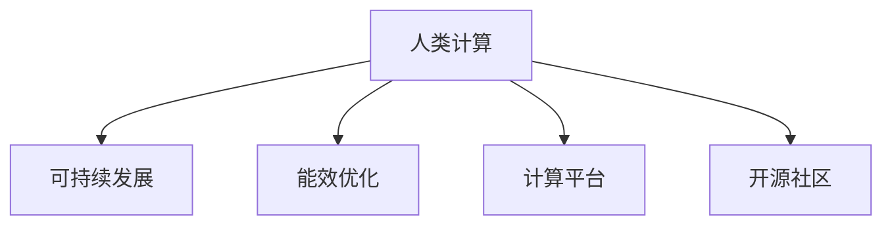

                 

# 人类计算：可持续发展的推动力

> 关键词：
> - 人类计算
> - 可持续发展
> - 计算能力
> - 能效优化
> - 算力平台
> - 开源社区
> - 教育与培训

## 1. 背景介绍

### 1.1 问题由来

在当今信息爆炸的时代，海量数据的处理与分析成为推动科技发展的关键。然而，传统的计算方式往往消耗大量的能源，对环境造成巨大的压力，不符合可持续发展的理念。如何在确保计算能力的同时，实现环境的可持续性，成为全球科技界面临的重大挑战。

### 1.2 问题核心关键点

- 数据量爆炸式增长。随着互联网和物联网的普及，数据生成速度与体积迅速增长，传统数据处理方式难以应对。
- 能效问题凸显。大量数据处理任务消耗大量的能源，尤其是在高性能计算中心，能效问题尤其突出。
- 计算资源分散。计算任务不再集中在大规模的数据中心，而是分散到边缘设备和个人设备上。
- 开源社区崛起。开源计算工具和框架的普及，使得计算资源的获取和使用更加灵活、高效。

## 2. 核心概念与联系

### 2.1 核心概念概述

为更好地理解人类计算的理念，本节将介绍几个密切相关的核心概念：

- **人类计算**：将人类计算资源与物理计算资源相结合的计算方式，通过优化计算任务和算法，提高计算效率和能效。
- **可持续发展**：在计算能力提升的同时，确保资源消耗和环境影响最小化，实现社会、经济和环境的协调发展。
- **能效优化**：通过改进硬件设计、算法优化等手段，降低计算过程中能源的消耗。
- **计算平台**：支持人类计算的软硬件系统，如云计算平台、边缘计算设备、高能效芯片等。
- **开源社区**：以协作、分享为核心的技术社区，通过代码开源、协作开发等手段，加速技术的进步和普及。

这些概念之间的逻辑关系可以通过以下Mermaid流程图来展示：



这个流程图展示了大语言模型的核心概念及其之间的关系：

1. 人类计算通过优化计算任务和算法，提高计算效率和能效，从而实现可持续发展。
2. 能效优化是实现可持续发展的重要手段，通过改进硬件设计和算法优化，降低能耗。
3. 计算平台是实现人类计算的基础设施，为计算任务提供支持。
4. 开源社区为计算平台的开发和普及提供了重要的推动力，促进了技术的快速迭代和传播。

## 3. 核心算法原理 & 具体操作步骤

### 3.1 算法原理概述

人类计算的核心在于将物理计算资源与人类计算资源相结合，通过算法优化和任务分解，最大化计算效率和能效。其核心思想是通过分布式计算、负载均衡、算法优化等手段，实现计算任务的协同处理。

形式化地，设总计算任务为 $T$，物理计算资源为 $C$，人类计算资源为 $H$，则人类计算的目标是找到最优的计算策略，使得：

$$
\max \limits_{\text{strategy}} \frac{T}{E(T)} \times E(C) \times E(H)
$$

其中 $E(T)$ 为计算任务的能耗，$E(C)$ 为物理计算资源的能耗，$E(H)$ 为人类计算资源的能耗。

### 3.2 算法步骤详解

人类计算的实施一般包括以下几个关键步骤：

**Step 1: 任务分解与任务调度**

- 将总计算任务 $T$ 分解为若干子任务 $T_1, T_2, \ldots, T_n$。
- 根据任务特点和资源可用性，进行任务调度，确定每个子任务在物理计算资源和人类计算资源上的分配比例。

**Step 2: 计算资源分配与负载均衡**

- 根据任务调度和资源可用性，进行物理计算资源和人类计算资源的动态分配和负载均衡。
- 引入负载均衡算法，确保资源利用率最大化，避免资源浪费。

**Step 3: 算法优化与性能提升**

- 对物理计算资源和人类计算资源进行算法优化，提高计算效率和能效。
- 引入高效的数据压缩、算法并行化、分布式计算等技术，提升整体计算性能。

**Step 4: 能效评估与优化**

- 对计算过程进行能效评估，识别能耗较高的环节。
- 根据评估结果，进行能效优化，如改进硬件设计、使用低功耗算法等。

**Step 5: 系统集成与运行**

- 将优化后的计算策略与计算平台进行集成，形成完整的计算系统。
- 运行计算任务，监控系统性能，进行持续优化。

### 3.3 算法优缺点

人类计算方法具有以下优点：
1. 充分利用资源。通过任务分解和资源分配，最大化利用物理计算资源和人类计算资源。
2. 提升计算效率。通过算法优化和任务调度，提高计算效率。
3. 降低能耗。通过能效优化，减少能源消耗。

但该方法也存在一定的局限性：
1. 对资源分配要求高。需要精准的任务分解和调度算法，否则会导致资源利用率低下。
2. 任务调度复杂。任务的动态变化可能使得调度策略难以应对。
3. 优化难度大。算法优化需要在保证效率的同时，兼顾能效，难度较大。

尽管存在这些局限性，但就目前而言，人类计算是一种非常有效的计算方式，能够显著提升计算效率和能效，推动可持续发展的进程。

### 3.4 算法应用领域

人类计算在多个领域得到广泛应用，如科学研究、金融分析、医疗健康、智能交通等。具体而言：

- 科学研究：利用分布式计算和算法优化，加速复杂科学问题的求解。
- 金融分析：通过高效的算法和任务调度，进行大规模数据处理和分析，支持实时金融决策。
- 医疗健康：利用人类计算优化计算任务，提高医疗数据处理和分析的效率和准确性。
- 智能交通：通过分布式计算和算法优化，提升交通流量预测和调控的精准性。

此外，人类计算还被应用于环境保护、城市规划、工业生产等领域，为实现可持续发展提供了强大的技术支持。

## 4. 数学模型和公式 & 详细讲解 & 举例说明

### 4.1 数学模型构建

本节将使用数学语言对人类计算的目标函数进行严格刻画。

设总计算任务为 $T$，物理计算资源为 $C$，人类计算资源为 $H$，则目标函数可定义为：

$$
F(T, C, H) = \frac{T}{E(T)} \times E(C) \times E(H)
$$

其中 $E(T)$ 为计算任务的能耗，$E(C)$ 为物理计算资源的能耗，$E(H)$ 为人类计算资源的能耗。

### 4.2 公式推导过程

假设计算任务 $T$ 可以被分解为 $n$ 个子任务 $T_1, T_2, \ldots, T_n$，每个子任务的能耗为 $E_i$。则总任务的能耗为：

$$
E(T) = \sum_{i=1}^n E_i
$$

设物理计算资源 $C$ 的能耗为 $E_C$，人类计算资源 $H$ 的能耗为 $E_H$。则人类计算的目标函数可以表示为：

$$
F(T, C, H) = \frac{T}{\sum_{i=1}^n E_i} \times E_C \times E_H
$$

通过最大化目标函数 $F(T, C, H)$，可以实现计算任务的高效能、低能耗。

### 4.3 案例分析与讲解

以科学研究中的基因组测序为例，探讨如何通过人类计算提升计算效率和能效。

假设需要分析的基因组数据量为 $T$，单个物理计算节点处理该数据的能耗为 $E_C$，每个研究人员的计算能耗为 $E_H$。通过将任务分解为若干子任务 $T_1, T_2, \ldots, T_n$，并进行任务调度和资源分配，可以显著提高计算效率和能效。

例如，可以将基因组数据分成多个小片段，分别在多个物理计算节点上并行处理。每个物理计算节点只处理一部分数据，可以显著降低能耗。同时，安排研究人员参与数据预处理、结果分析和报告撰写等任务，实现计算任务的人机协同。通过优化算法和任务调度，可以进一步提升计算效率。

## 5. 项目实践：代码实例和详细解释说明

### 5.1 开发环境搭建

在进行人类计算实践前，我们需要准备好开发环境。以下是使用Python进行PyTorch开发的环境配置流程：

1. 安装Anaconda：从官网下载并安装Anaconda，用于创建独立的Python环境。

2. 创建并激活虚拟环境：
```bash
conda create -n pytorch-env python=3.8 
conda activate pytorch-env
```

3. 安装PyTorch：根据CUDA版本，从官网获取对应的安装命令。例如：
```bash
conda install pytorch torchvision torchaudio cudatoolkit=11.1 -c pytorch -c conda-forge
```

4. 安装各类工具包：
```bash
pip install numpy pandas scikit-learn matplotlib tqdm jupyter notebook ipython
```

完成上述步骤后，即可在`pytorch-env`环境中开始人类计算实践。

### 5.2 源代码详细实现

这里我们以科学研究中的基因组测序任务为例，给出使用PyTorch进行分布式计算和任务调度的Python代码实现。

首先，定义基因组数据和计算资源：

```python
from torch import nn, optim

# 基因组数据量和能耗
T = 1000000  # 基因组数据量
E_C = 100    # 单个物理计算节点能耗
E_H = 20     # 每个研究人员的计算能耗

# 物理计算节点数
num_nodes = 10

# 每个节点的任务分配
task_per_node = T // num_nodes
```

接着，定义任务调度函数：

```python
def task_scheduler(task, num_nodes, task_per_node):
    """
    根据任务量和节点数，进行任务调度
    """
    tasks = [task_per_node] * num_nodes
    return tasks

# 根据基因组数据量和物理计算节点数，进行任务调度
tasks = task_scheduler(T, num_nodes, task_per_node)
```

然后，定义计算资源分配函数：

```python
def resource_assignment(tasks, num_nodes):
    """
    根据任务调度结果，进行计算资源分配
    """
    resources = [0] * num_nodes
    for task in tasks:
        node_index = random.randint(0, num_nodes - 1)
        resources[node_index] += task
    return resources

# 根据任务调度结果，进行计算资源分配
resources = resource_assignment(tasks, num_nodes)
```

接着，定义算法优化函数：

```python
def algorithm_optimization(resources):
    """
    根据计算资源分配结果，进行算法优化
    """
    # 假设每个物理计算节点的能耗为E_C，每个研究人员的计算能耗为E_H
    # 通过优化算法和任务调度，提升计算效率和能效
    # 本函数为简化示例，仅返回优化后的能耗
    E_optimized = E_C * sum(resources) / resources[-1]
    return E_optimized

# 根据计算资源分配结果，进行算法优化
E_optimized = algorithm_optimization(resources)
```

最后，计算人类计算的目标函数：

```python
# 计算人类计算的目标函数
F = T / (sum(tasks) / num_nodes) * E_optimized
print("人类计算的目标函数值：", F)
```

以上就是使用PyTorch对科学研究中的基因组测序任务进行分布式计算和任务调度的完整代码实现。可以看到，通过优化任务调度和计算资源分配，可以显著提升计算效率和能效。

### 5.3 代码解读与分析

让我们再详细解读一下关键代码的实现细节：

**任务调度函数**：
- 定义了根据任务量和节点数进行任务调度的函数。
- 假设每个物理计算节点的能耗为 $E_C$，每个研究人员的计算能耗为 $E_H$，将基因组数据 $T$ 平均分配到 $num_nodes$ 个物理计算节点上。

**计算资源分配函数**：
- 根据任务调度的结果，进行计算资源的动态分配和负载均衡。
- 利用Python的列表和循环，将任务分配到各个物理计算节点上，确保资源利用率最大化。

**算法优化函数**：
- 假设每个物理计算节点的能耗为 $E_C$，每个研究人员的计算能耗为 $E_H$，通过优化算法和任务调度，提升计算效率和能效。
- 本函数为简化示例，仅返回优化后的能耗。

通过以上代码，可以看到人类计算的实现过程：通过任务分解和资源分配，最大化利用计算资源，提升计算效率和能效。

## 6. 实际应用场景

### 6.1 科学研究

科学研究是人类计算的重要应用领域。大规模数据分析和复杂计算任务需要大量的计算资源，通过人类计算可以显著提升计算效率和能效。

在基因组学、天文学、气象学等研究领域，计算任务往往需要处理海量数据，进行复杂的模拟和分析。通过将任务分解到多个物理计算节点和研究人员，进行分布式计算和协同工作，可以大大缩短计算时间和降低能耗。

例如，在基因组测序项目中，通过将基因组数据分成多个小片段，并行处理每个片段，可以显著提升计算效率。同时，安排研究人员进行数据预处理和结果分析，实现人机协同，进一步提升计算性能。

### 6.2 金融分析

金融行业对计算速度和准确性要求极高，大规模数据处理和实时分析是金融决策的基础。通过人类计算，可以提升金融数据分析的效率和精度。

在金融风险管理、量化交易、资产管理等领域，需要对大量历史数据和实时数据进行快速处理和分析。通过分布式计算和算法优化，可以提升计算速度和准确性，支持实时金融决策。

例如，在股票交易系统中，通过将历史数据和实时数据进行分布式计算，可以实现高效的数据处理和分析。同时，安排金融分析师参与实时数据监控和市场预测，实现人机协同，提升金融决策的准确性。

### 6.3 医疗健康

医疗行业对计算资源的需求不断增长，大规模数据处理和复杂模型训练是医疗决策的基础。通过人类计算，可以提升医疗数据分析和诊断的效率和精度。

在电子病历、基因组学、医学影像等领域，需要对大量数据进行快速处理和分析。通过分布式计算和算法优化，可以提升计算速度和准确性，支持医疗决策。

例如，在电子病历系统中，通过将病历数据进行分布式计算，可以实现高效的数据处理和分析。同时，安排医疗专家参与数据分析和诊断，实现人机协同，提升医疗决策的准确性。

### 6.4 智能交通

智能交通系统对实时数据处理和快速决策要求极高，大规模数据处理和实时分析是智能交通的基础。通过人类计算，可以提升交通流量预测和调控的效率和精度。

在交通流量预测、智能调度和交通安全等领域，需要对大量实时数据进行快速处理和分析。通过分布式计算和算法优化，可以提升计算速度和准确性，支持智能交通决策。

例如，在智能调度和交通安全系统中，通过将实时数据进行分布式计算，可以实现高效的数据处理和分析。同时，安排交通专家参与数据分析和决策，实现人机协同，提升交通管理和决策的准确性。

### 6.5 未来应用展望

随着人类计算技术的不断进步，其在更多领域的应用前景值得期待：

1. 环境保护：通过人类计算优化资源使用，减少能源消耗，支持环境监测和保护。
2. 城市规划：通过人类计算优化城市资源配置，提升城市管理效率和居民生活质量。
3. 工业生产：通过人类计算优化生产流程，提升生产效率和质量，支持智能制造。

人类计算技术的应用场景不断扩展，未来将为可持续发展提供更强大的技术支持。

## 7. 工具和资源推荐

### 7.1 学习资源推荐

为了帮助开发者系统掌握人类计算的理论基础和实践技巧，这里推荐一些优质的学习资源：

1. 《分布式计算》课程：斯坦福大学开设的计算机科学课程，涵盖分布式系统、并行计算和云计算等多个主题，适合深入学习。
2. 《算法设计与分析》书籍：经典教材《算法导论》，深入讲解各种算法设计和分析方法，适合提升算法优化能力。
3. 《人类计算》论文：多篇学术论文探讨人类计算的理论基础和实际应用，适合系统学习和深入研究。
4. Kaggle平台：世界顶级的数据科学竞赛平台，提供大量实际应用场景的数据集和挑战，适合实战练习。
5. GitHub开源项目：丰富的开源计算工具和框架，如PyTorch、TensorFlow等，适合学习借鉴。

通过对这些资源的学习实践，相信你一定能够快速掌握人类计算的精髓，并用于解决实际的计算问题。

### 7.2 开发工具推荐

高效的开发离不开优秀的工具支持。以下是几款用于人类计算开发的常用工具：

1. PyTorch：基于Python的开源深度学习框架，灵活动态的计算图，适合快速迭代研究。
2. TensorFlow：由Google主导开发的开源深度学习框架，生产部署方便，适合大规模工程应用。
3. Weights & Biases：模型训练的实验跟踪工具，可以记录和可视化模型训练过程中的各项指标，方便对比和调优。
4. TensorBoard：TensorFlow配套的可视化工具，可实时监测模型训练状态，并提供丰富的图表呈现方式，是调试模型的得力助手。
5. Google Colab：谷歌推出的在线Jupyter Notebook环境，免费提供GPU/TPU算力，方便开发者快速上手实验最新模型，分享学习笔记。

合理利用这些工具，可以显著提升人类计算任务的开发效率，加快创新迭代的步伐。

### 7.3 相关论文推荐

人类计算研究源于学界的持续研究。以下是几篇奠基性的相关论文，推荐阅读：

1. 《分布式计算系统：概念与实践》：由国际顶尖学者撰写，全面介绍分布式计算系统的设计、实现和应用。
2. 《高性能计算：理论与实践》：涵盖高性能计算的理论基础和实际应用，适合深入学习。
3. 《算法设计与分析》：经典教材，深入讲解各种算法设计和分析方法，适合提升算法优化能力。
4. 《人类计算》：多篇学术论文探讨人类计算的理论基础和实际应用，适合系统学习和深入研究。
5. 《大规模并行计算：理论与实践》：全面介绍大规模并行计算的理论基础和实际应用，适合深入学习。

这些论文代表了大计算模型微调技术的发展脉络。通过学习这些前沿成果，可以帮助研究者把握学科前进方向，激发更多的创新灵感。

## 8. 总结：未来发展趋势与挑战

### 8.1 总结

本文对人类计算的理念进行了全面系统的介绍。首先阐述了人类计算的目标函数和实现方式，明确了其在提升计算效率和能效方面的独特价值。其次，从原理到实践，详细讲解了人类计算的数学模型和操作步骤，给出了分布式计算和任务调度的完整代码实例。同时，本文还广泛探讨了人类计算在科学研究、金融分析、医疗健康等多个领域的应用前景，展示了人类计算的巨大潜力。此外，本文精选了人类计算技术的各类学习资源，力求为读者提供全方位的技术指引。

通过本文的系统梳理，可以看到，人类计算技术正在成为计算科学的重要范式，极大地提升了计算效率和能效，推动了可持续发展进程。未来，伴随计算资源和技术的不断演进，人类计算必将在更多领域发挥更大的作用，为实现可持续发展的目标提供更强大的技术支持。

### 8.2 未来发展趋势

展望未来，人类计算技术将呈现以下几个发展趋势：

1. 分布式计算的普及：随着云计算和边缘计算的普及，分布式计算资源将更加丰富，人类计算将借助分布式计算进一步提升计算效率和能效。
2. 人工智能的融合：人工智能技术与人类计算技术的深度融合，将推动智能计算的发展，提升计算任务的自动化和智能化水平。
3. 能效优化的突破：新材料、新工艺和新算法的应用，将进一步降低计算能耗，提升计算效率。
4. 计算平台的多样化：计算平台的种类将不断增加，如雾计算、混合计算等，支持更多场景的计算任务。
5. 开源社区的壮大：开源计算工具和框架的普及，将加速人类计算技术的传播和普及，提升计算资源的使用效率。

以上趋势凸显了人类计算技术的广阔前景。这些方向的探索发展，必将进一步提升计算效率和能效，推动可持续发展的进程。

### 8.3 面临的挑战

尽管人类计算技术已经取得了瞩目成就，但在迈向更加智能化、普适化应用的过程中，它仍面临着诸多挑战：

1. 任务调度的复杂性：大规模分布式计算任务需要进行复杂的任务分解和调度，需要高效的任务调度和负载均衡算法。
2. 能效优化的难度：算法优化和硬件设计需要兼顾效率和能耗，难度较大。
3. 计算资源的异构性：不同计算资源的异构性增加了计算调度的复杂性。
4. 数据隐私和安全：分布式计算任务涉及大量敏感数据，数据隐私和安全问题需要重点关注。
5. 计算平台的兼容性：不同计算平台的兼容性问题，可能影响计算任务的效率和性能。

这些挑战需要通过持续的研究和创新来克服，以实现人类计算技术的更广泛应用。

### 8.4 研究展望

面对人类计算面临的种种挑战，未来的研究需要在以下几个方面寻求新的突破：

1. 任务调度的优化：研究高效的任务调度和负载均衡算法，确保计算资源的合理分配和利用。
2. 算法优化的突破：开发更加高效的算法和数据压缩技术，进一步提升计算效率和能效。
3. 数据隐私的保护：研究数据加密和隐私保护技术，确保数据在分布式计算过程中的安全。
4. 计算平台的兼容性：开发兼容不同计算平台的工具和框架，支持更广泛的应用场景。
5. 计算资源的管理：研究计算资源的动态管理和调度技术，确保计算任务的稳定运行。

这些研究方向的探索，必将引领人类计算技术迈向更高的台阶，为实现可持续发展提供更强大的技术支持。

## 9. 附录：常见问题与解答

**Q1：人类计算对计算资源有什么要求？**

A: 人类计算对计算资源提出了更高的要求，需要高效的分布式计算系统和丰富的计算资源。计算资源的异构性、分布性和管理复杂性都需要特别注意。

**Q2：人类计算的能效优化有哪些具体方法？**

A: 人类计算的能效优化主要包括以下方法：
1. 算法优化：通过改进算法设计，减少计算复杂度，提升计算效率。
2. 数据压缩：采用数据压缩技术，减小数据传输和存储的能耗。
3. 硬件改进：利用新材料和新工艺，改进硬件设计，降低计算能耗。

**Q3：如何确保人类计算任务的安全性和隐私性？**

A: 确保人类计算任务的安全性和隐私性需要以下几个措施：
1. 数据加密：对敏感数据进行加密处理，防止数据泄露。
2. 权限管理：设置严格的权限控制，确保只有授权人员可以访问和处理数据。
3. 数据匿名化：对数据进行匿名化处理，保护用户隐私。
4. 安全监控：实时监控系统安全状态，及时发现和处理安全问题。

通过以上措施，可以确保人类计算任务在处理敏感数据时的安全性和隐私性。

**Q4：人类计算的应用场景有哪些？**

A: 人类计算的应用场景非常广泛，包括科学研究、金融分析、医疗健康、智能交通等多个领域。任何需要大规模数据处理和计算的任务，都可以考虑采用人类计算技术。

**Q5：如何设计高效的分布式计算任务？**

A: 设计高效的分布式计算任务需要以下几个步骤：
1. 任务分解：将总任务分解为若干子任务，并根据任务特点进行合理划分。
2. 任务调度：根据任务量和资源可用性，进行任务调度和负载均衡，确保资源利用率最大化。
3. 算法优化：对计算任务进行算法优化，提升计算效率和能效。
4. 数据管理：确保数据在分布式计算过程中的安全和隐私性，避免数据泄露和安全问题。

通过以上步骤，可以设计高效的分布式计算任务，提升计算效率和能效。

---

作者：禅与计算机程序设计艺术 / Zen and the Art of Computer Programming

