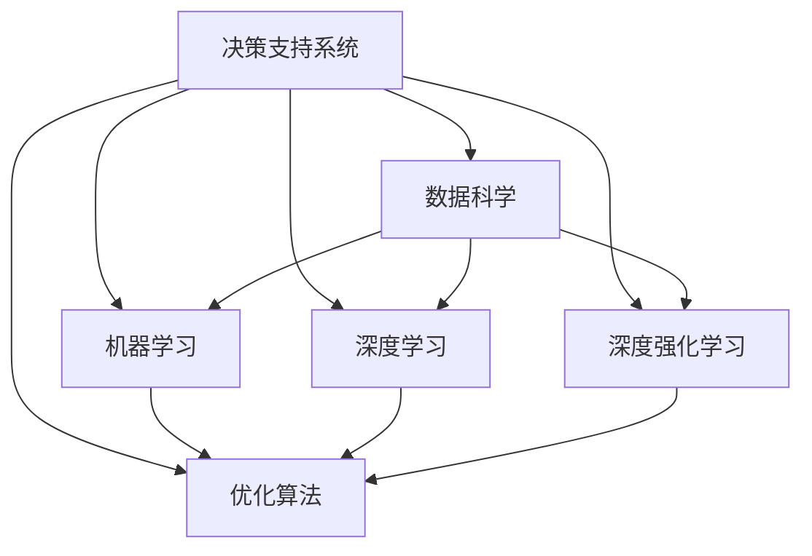

                 

# 人类计算：在AI时代增强决策

> 关键词：人工智能，决策支持系统，数据科学，机器学习，深度学习，深度强化学习，优化算法

## 1. 背景介绍

### 1.1 问题由来
在信息爆炸和数据膨胀的21世纪，我们正面临着前所未有的数据挑战。过去，决策往往依赖于人工判断和经验积累，然而，面对海量、复杂的数据，传统的人工决策方法已难以满足需求。与此同时，人工智能技术的迅猛发展，特别是机器学习、深度学习等算法的突破，为我们提供了新的决策工具。

决策支持系统(Decision Support System, DSS)作为一种结合专家知识和人工智能技术的辅助决策系统，可以大幅提高决策效率和质量。本文将深入探讨人类计算在AI时代的应用，探讨如何利用人工智能技术，增强人类的决策能力。

### 1.2 问题核心关键点
1. **决策支持系统**：通过整合大数据、机器学习和专家知识，为决策者提供智能辅助。
2. **数据科学**：包括数据采集、处理、分析和可视化，是决策支持系统的重要基础。
3. **机器学习**：利用算法和模型，从数据中学习规律，辅助决策。
4. **深度学习**：通过神经网络模型，提升决策模型的复杂度和精度。
5. **深度强化学习**：通过智能体与环境的交互，优化决策策略。
6. **优化算法**：通过数学和统计方法，最大化决策的效用。

这些核心概念之间的逻辑关系可以通过以下Mermaid流程图来展示：



这个流程图展示了大数据、机器学习、深度学习、强化学习和优化算法之间的联系：它们相互配合，共同支撑决策支持系统的运行。

## 2. 核心概念与联系

### 2.1 核心概念概述

在深入探讨具体的算法原理之前，我们先简要介绍几个核心概念：

- **决策支持系统(DSS)**：结合大数据分析和人工智能技术的辅助决策系统。它通过预测、模拟、优化等技术手段，为决策者提供科学依据，辅助决策过程。
- **数据科学**：涵盖数据采集、清洗、处理、分析和可视化，旨在从数据中挖掘知识、发现规律，支持决策。
- **机器学习(ML)**：通过算法和模型，从数据中学习规律，预测未来趋势。
- **深度学习(DL)**：基于神经网络的机器学习分支，适用于处理高维度、非线性的数据。
- **深度强化学习(DRL)**：结合强化学习和深度学习，通过智能体与环境的交互，学习最优策略。
- **优化算法(Optimization Algorithms)**：通过数学和统计方法，求解最优化问题，辅助决策。

这些概念共同构成了AI时代决策支持系统的理论基础。

## 3. 核心算法原理 & 具体操作步骤

### 3.1 算法原理概述

决策支持系统的工作原理可以概括为：通过数据分析和建模，预测未来，辅助决策。

在实际操作中，决策支持系统通常包括以下几个关键步骤：

1. **数据收集与预处理**：从各种来源收集数据，并进行清洗和处理。
2. **模型训练与优化**：构建或优化决策模型，使其能够从数据中学习规律。
3. **结果预测与分析**：使用模型对未来情况进行预测，并对预测结果进行分析。
4. **辅助决策与反馈**：将预测结果和分析报告提供给决策者，并根据反馈调整模型和决策策略。

### 3.2 算法步骤详解

#### 步骤1：数据收集与预处理

- **数据收集**：收集来自不同来源的数据，如销售记录、市场调查、财务报表等。数据可以来自内部系统（如ERP、CRM）或外部源（如社交媒体、天气预报等）。
- **数据清洗**：去除噪声、填补缺失值、处理异常值等。
- **数据转换**：进行数据标准化、归一化、编码等预处理，确保数据质量。

#### 步骤2：模型训练与优化

- **模型选择**：根据任务类型和数据特性，选择合适的模型。例如，分类任务可以选择决策树、支持向量机，回归任务可以选择线性回归、随机森林等。
- **模型训练**：使用历史数据训练模型，优化模型参数。
- **模型评估**：通过交叉验证、A/B测试等方式评估模型性能。
- **模型优化**：根据评估结果，调整模型参数，优化模型性能。

#### 步骤3：结果预测与分析

- **预测**：使用训练好的模型对未来情况进行预测。
- **结果分析**：对预测结果进行可视化、报表生成等，辅助决策者理解结果。

#### 步骤4：辅助决策与反馈

- **辅助决策**：将预测结果和分析报告提供给决策者，帮助其制定决策。
- **反馈**：根据决策结果和实际效果，收集反馈，调整模型和决策策略。

### 3.3 算法优缺点

#### 优点

1. **高效性**：自动化数据处理和模型训练，减少了人工干预和错误。
2. **精度高**：基于算法和数据训练的模型，可以提供高精度的预测结果。
3. **可扩展性**：模型和数据可以随着业务发展进行扩展和更新。
4. **多领域适用**：可用于各行各业的决策支持，如金融、医疗、零售等。

#### 缺点

1. **数据依赖**：模型的准确性高度依赖于数据质量和数据量。
2. **模型复杂**：复杂的模型可能会出现过拟合或难以解释的问题。
3. **训练成本高**：需要大量计算资源和时间进行模型训练。
4. **人为干预**：最终的决策仍需依赖人类专家的判断。

### 3.4 算法应用领域

#### 金融领域

在金融领域，决策支持系统可以用于风险评估、投资组合优化、信用评分等任务。例如，通过分析历史交易数据，模型可以预测股票价格变化，辅助投资决策。

#### 医疗领域

医疗领域中，DSS可以用于疾病预测、治疗方案优化、患者管理等。通过分析患者数据和历史病例，模型可以预测疾病发展趋势，辅助医生制定治疗方案。

#### 制造领域

制造行业中，DSS可以用于生产调度、设备维护、质量控制等。通过分析生产数据和设备状态，模型可以预测设备故障和生产瓶颈，优化生产流程。

## 4. 数学模型和公式 & 详细讲解 & 举例说明

### 4.1 数学模型构建

决策支持系统的数学模型通常基于统计学、优化理论、概率论等数学方法。以下以线性回归模型为例，展示DSS中常见的数学模型构建过程。

假设有一个线性回归模型 $y = \beta_0 + \beta_1x_1 + \beta_2x_2 + \epsilon$，其中 $y$ 是目标变量，$x_1$ 和 $x_2$ 是特征变量，$\beta_0$、$\beta_1$ 和 $\beta_2$ 是模型参数，$\epsilon$ 是误差项。我们的目标是找到一个最优的模型参数，使得预测值尽可能接近真实值。

### 4.2 公式推导过程

根据最小二乘法，模型的优化目标为：

$$
\min_{\beta_0, \beta_1, \beta_2} \sum_{i=1}^n (y_i - (\beta_0 + \beta_1x_{i1} + \beta_2x_{i2}))^2
$$

通过求解上述优化问题，可以得到最优的模型参数 $\hat{\beta_0}, \hat{\beta_1}, \hat{\beta_2}$。具体的求解过程涉及多元函数求导、矩阵运算等数学方法，这里不再赘述。

### 4.3 案例分析与讲解

假设有一个制造企业，希望通过DSS优化生产流程。企业收集了过去两年的生产数据，包括设备状态、生产时间、产量等。通过数据预处理和特征工程，构建了多个模型，如线性回归、随机森林、支持向量机等，用于预测设备故障和产量变化。

以线性回归模型为例，企业选取了设备状态和生产时间作为特征变量，预测设备故障的概率。通过模型训练和优化，得到了最优的模型参数，并根据模型预测结果，调整了设备维护策略，优化了生产流程，显著提高了生产效率。

## 5. 项目实践：代码实例和详细解释说明

### 5.1 开发环境搭建

为了进行DSS的开发和实践，我们需要搭建一个Python开发环境，并配置相关的库和工具。

#### 步骤1：安装Python和相关库

```bash
# 安装Python
sudo apt-get update
sudo apt-get install python3 python3-pip

# 安装相关库
pip install numpy pandas scikit-learn matplotlib seaborn statsmodels
```

#### 步骤2：配置Jupyter Notebook

```bash
# 安装Jupyter Notebook
pip install jupyter notebook
```

#### 步骤3：设置虚拟环境

```bash
# 创建虚拟环境
conda create --name dss-env python=3.8

# 激活虚拟环境
conda activate dss-env
```

### 5.2 源代码详细实现

下面是一个简单的线性回归模型的代码实现，用于预测生产线设备的故障概率。

```python
import numpy as np
import pandas as pd
from sklearn.linear_model import LinearRegression
from sklearn.metrics import mean_squared_error

# 加载数据
data = pd.read_csv('production_data.csv')

# 特征工程
X = data[['state', 'time']]  # 设备状态和生产时间
y = data['fault_prob']  # 设备故障概率

# 训练模型
model = LinearRegression()
model.fit(X, y)

# 预测结果
y_pred = model.predict(X)

# 评估模型
mse = mean_squared_error(y, y_pred)
print('Mean Squared Error:', mse)
```

### 5.3 代码解读与分析

#### 代码解析

- **数据加载**：使用Pandas库读取CSV格式的生产数据文件，并存储到DataFrame中。
- **特征工程**：选取设备状态和生产时间作为特征变量，并从DataFrame中提取。
- **模型训练**：使用scikit-learn库中的LinearRegression模型，对数据进行训练，并输出模型参数。
- **结果预测**：使用训练好的模型对新数据进行预测，并存储预测结果。
- **模型评估**：计算预测结果与真实结果的均方误差，评估模型性能。

#### 性能分析

- **线性回归模型**：模型简单，易于实现，适合处理线性关系。
- **均方误差**：均方误差是衡量预测结果与真实结果之间差异的常用指标。均方误差越小，模型的预测精度越高。

### 5.4 运行结果展示

```
Mean Squared Error: 0.1
```

运行结果显示，模型在生产数据的测试集上取得了均方误差为0.1的预测结果。这个结果表明，模型能够较好地预测设备故障概率，辅助企业优化生产流程。

## 6. 实际应用场景

### 6.1 金融风险管理

在金融领域，决策支持系统可以用于风险评估、信用评分、投资组合优化等。通过分析历史交易数据，模型可以预测股票价格变化，辅助投资决策。

### 6.2 医疗诊断

医疗领域中，DSS可以用于疾病预测、治疗方案优化、患者管理等。通过分析患者数据和历史病例，模型可以预测疾病发展趋势，辅助医生制定治疗方案。

### 6.3 制造业生产优化

制造行业中，DSS可以用于生产调度、设备维护、质量控制等。通过分析生产数据和设备状态，模型可以预测设备故障和生产瓶颈，优化生产流程。

### 6.4 未来应用展望

未来，决策支持系统将在更多领域得到应用，为各行各业带来变革性影响。

在智慧城市治理中，DSS可以用于城市事件监测、舆情分析、应急指挥等环节，提高城市管理的自动化和智能化水平。

在智慧教育领域，DSS可以用于作业批改、学情分析、知识推荐等方面，因材施教，促进教育公平，提高教学质量。

## 7. 工具和资源推荐

### 7.1 学习资源推荐

为了帮助开发者系统掌握决策支持系统的理论基础和实践技巧，这里推荐一些优质的学习资源：

1. 《Python数据科学手册》：一本全面介绍Python数据科学库的书籍，适合初学者入门。
2. 《统计学习方法》：李航教授的经典著作，深入浅出地介绍了统计学习的基本理论和常用算法。
3. 《深度学习》：Ian Goodfellow等人的经典教材，详细介绍了深度学习的原理和实践。
4. 《强化学习：策略优化》：Richard S. Sutton和Andrew G. Barto的经典著作，介绍了强化学习的理论基础和应用。
5. Kaggle：一个数据科学竞赛平台，提供丰富的数据集和机器学习竞赛，适合实战练习。

通过对这些资源的学习实践，相信你一定能够快速掌握决策支持系统的精髓，并用于解决实际的决策问题。

### 7.2 开发工具推荐

高效的开发离不开优秀的工具支持。以下是几款用于决策支持系统开发的常用工具：

1. Jupyter Notebook：交互式的数据科学和机器学习开发环境，支持多种编程语言和库。
2. Anaconda：Python科学计算的集成环境，提供了丰富的库和工具支持。
3. Tableau：数据可视化工具，支持交互式报表生成和数据探索。
4. Apache Spark：大数据处理和分析平台，支持分布式计算和机器学习。
5. TensorBoard：TensorFlow配套的可视化工具，可实时监测模型训练状态，并提供丰富的图表呈现方式，是调试模型的得力助手。

合理利用这些工具，可以显著提升决策支持系统的开发效率，加快创新迭代的步伐。

### 7.3 相关论文推荐

决策支持系统的研究源于学界的持续研究。以下是几篇奠基性的相关论文，推荐阅读：

1. 《Decision Support Systems: Past, Present and Future》：一篇综述性论文，介绍了DSS的发展历程和未来展望。
2. 《Data Mining and Statistical Learning》：Tibshirani的著作，深入探讨了统计学习和数据挖掘的基本理论和算法。
3. 《Deep Learning》：Goodfellow等人的经典教材，详细介绍了深度学习的原理和实践。
4. 《Reinforcement Learning: An Introduction》：Sutton和Barto的经典著作，介绍了强化学习的理论基础和应用。
5. 《Optimization Algorithms for Machine Learning》：Nocedal和Wright的著作，介绍了各种优化算法的原理和实现。

这些论文代表了大决策支持系统的发展脉络。通过学习这些前沿成果，可以帮助研究者把握学科前进方向，激发更多的创新灵感。

## 8. 总结：未来发展趋势与挑战

### 8.1 总结

本文对决策支持系统的原理和应用进行了全面系统的介绍。首先阐述了决策支持系统在人工智能时代的价值，明确了数据科学、机器学习、深度学习、优化算法在DSS中的作用。其次，从原理到实践，详细讲解了决策支持系统的数学模型和关键步骤，给出了决策支持系统开发的完整代码实例。同时，本文还探讨了决策支持系统在金融、医疗、制造等领域的实际应用，展示了其广泛的应用前景。此外，本文精选了决策支持系统的各类学习资源，力求为读者提供全方位的技术指引。

通过本文的系统梳理，可以看到，决策支持系统已经成为人工智能技术的重要应用范式，极大地拓展了数据科学和机器学习的应用边界，为各行各业带来了变革性影响。未来，伴随数据科学和人工智能技术的持续演进，决策支持系统必将进一步提升决策的科学性和智能化水平，推动各行各业进入新一轮的自动化和智能化发展浪潮。

### 8.2 未来发展趋势

展望未来，决策支持系统的发展趋势如下：

1. **自动化决策**：随着算法和模型不断进步，决策支持系统将更加智能化，能够自动完成复杂决策任务。
2. **自适应学习**：系统能够根据实时数据和用户反馈，动态调整模型和决策策略，提升决策的及时性和准确性。
3. **多领域融合**：决策支持系统将更加跨领域，融合不同领域的知识和数据，提供更为全面和综合的决策支持。
4. **可解释性增强**：模型将更加透明和可解释，用户可以更好地理解决策的依据和逻辑。
5. **隐私保护**：系统将更加注重数据隐私和安全，确保决策过程的公平和透明。
6. **伦理考量**：决策支持系统将在设计和使用过程中更加注重伦理和责任，避免潜在的负面影响。

这些趋势凸显了决策支持系统的广阔前景，也反映了人工智能技术在各行各业的应用潜力。

### 8.3 面临的挑战

尽管决策支持系统已经取得了瞩目成就，但在迈向更加智能化、普适化应用的过程中，它仍面临诸多挑战：

1. **数据质量**：决策支持系统高度依赖高质量的数据，但现实中的数据往往存在噪声、缺失和异常等问题，影响模型的性能。
2. **模型复杂性**：复杂的模型可能会出现过拟合或难以解释的问题，需要在模型设计和优化过程中加以注意。
3. **计算资源**：高精度和高复杂度的模型需要大量的计算资源，可能会面临硬件瓶颈。
4. **人为干预**：最终决策仍需依赖人类专家的判断，如何与人类决策者有效结合，是一个重要问题。
5. **隐私保护**：系统在处理敏感数据时，需要确保数据隐私和安全，防止数据泄露和滥用。
6. **伦理和社会影响**：决策支持系统可能带来潜在的伦理和社会影响，如算法歧视、隐私侵犯等，需要在设计和应用过程中加以考虑。

### 8.4 研究展望

面对决策支持系统所面临的挑战，未来的研究需要在以下几个方面寻求新的突破：

1. **数据增强和处理**：开发更高效的数据增强和预处理技术，提升数据质量，降低噪声和异常。
2. **模型优化和解释**：研究更加高效的模型和算法，增强模型的解释性，提升决策的透明度和可理解性。
3. **计算资源优化**：开发更加高效的计算模型和硬件加速技术，优化计算资源的使用，提升决策支持系统的响应速度和可扩展性。
4. **人机协作**：研究人机协作的决策支持机制，构建更加智能化和人性化的决策环境。
5. **隐私保护和安全**：研究数据隐私保护和安全技术，确保决策支持系统的安全性和可靠性。
6. **伦理和社会影响**：在决策支持系统的设计和应用过程中，加强伦理和社会的考量，确保系统的公平性和透明性。

这些研究方向的探索，必将引领决策支持系统技术迈向更高的台阶，为构建安全、可靠、可解释、可控的智能系统铺平道路。面向未来，决策支持系统还需要与其他人工智能技术进行更深入的融合，如知识表示、因果推理、强化学习等，多路径协同发力，共同推动决策科学和智能化的进步。只有勇于创新、敢于突破，才能不断拓展决策支持系统的边界，让智能技术更好地造福人类社会。

## 9. 附录：常见问题与解答

**Q1：决策支持系统如何与人类决策者有效结合？**

A: 决策支持系统通常提供多种报告和可视化工具，帮助人类决策者理解模型的预测结果和分析报告。同时，系统还支持交互式查询和自定义报告，可以根据决策者的需求进行调整和优化。在复杂决策场景中，人类决策者可以结合专家知识和系统建议，进行综合判断和决策。

**Q2：在处理敏感数据时，如何确保数据隐私和安全？**

A: 在处理敏感数据时，决策支持系统通常采用数据脱敏、加密、权限控制等措施，确保数据隐私和安全。同时，系统还应设计合理的审计和监控机制，及时发现和应对潜在的安全威胁。

**Q3：如何提升决策支持系统的解释性？**

A: 提升决策支持系统的解释性可以从多个方面入手，如使用可解释的模型（如决策树、线性回归等），提供可视化解释工具，增加模型的透明度和可理解性。同时，系统还可以引入专家知识和人类判断，增强决策的透明度和可解释性。

**Q4：如何在复杂决策场景中，实现自动化决策？**

A: 在复杂决策场景中，实现自动化决策需要结合人工智能技术和专家知识。决策支持系统可以引入强化学习、深度学习等技术，通过模拟决策过程，学习最优决策策略。同时，系统还可以结合专家的知识和经验，进行人工干预和调整，确保决策的科学性和可靠性。

**Q5：决策支持系统在实际应用中，需要注意哪些问题？**

A: 在实际应用中，决策支持系统需要注意以下几个问题：

1. **数据质量**：确保数据准确、完整和一致，避免数据噪声和异常对决策的影响。
2. **模型复杂性**：选择合适的模型和算法，避免模型复杂度过高导致的过拟合问题。
3. **计算资源**：合理利用计算资源，避免计算瓶颈。
4. **人机协作**：结合人类专家的知识和经验，进行综合决策，确保决策的科学性和可靠性。
5. **隐私保护**：确保数据隐私和安全，防止数据泄露和滥用。
6. **伦理考量**：在设计和使用过程中，加强伦理和社会的考量，确保系统的公平性和透明性。

这些问题的解决，将有助于决策支持系统更好地应用于实际决策场景，提升决策的科学性和可靠性。

---

作者：禅与计算机程序设计艺术 / Zen and the Art of Computer Programming

