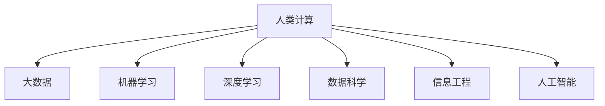

                 

# 人类计算：大数据时代的关键技术

> 关键词：人类计算,大数据,机器学习,深度学习,数据科学,信息工程,人工智能

## 1. 背景介绍

### 1.1 问题由来

在21世纪的大数据时代，数据的产生、存储、处理和分析已经成为各行各业发展的关键。然而，面对海量数据的挑战，传统的计算方式和计算资源已经显得捉襟见肘。随着计算需求日益增长，如何让计算机高效地处理和分析数据，成为亟待解决的问题。人类计算技术应运而生，通过结合人机协同的方式，利用人类的智慧和计算资源，实现高效的数据处理和分析。

### 1.2 问题核心关键点

人类计算技术的核心在于将人脑的计算能力和计算机的存储能力结合，通过人机协同，实现更高效、更精确的数据处理。该技术的实现依赖于以下几个关键点：

- 数据存储：高效的数据存储系统是保证数据可访问性和可处理性的基础。
- 计算资源：分布式计算框架和云计算服务，提供了强大的计算能力。
- 算法设计：高效的算法设计是实现人类计算的核心，包括机器学习和深度学习算法。
- 用户界面：直观的用户界面使得数据处理过程更加友好和易于理解。
- 安全隐私：数据安全和个人隐私的保护，是实现人类计算的前提。

## 2. 核心概念与联系

### 2.1 核心概念概述

为了更好地理解人类计算技术的原理和架构，本节将介绍几个密切相关的核心概念：

- **人类计算（Human Computing）**：一种利用人类智慧进行计算的方法，结合计算机的强大存储和计算能力，提高数据处理效率。
- **大数据（Big Data）**：规模庞大、类型多样的数据集，需要高效处理和分析的技术。
- **机器学习（Machine Learning）**：通过算法让计算机从数据中学习并做出预测或决策。
- **深度学习（Deep Learning）**：一种特殊的机器学习技术，使用多层神经网络对数据进行深度建模。
- **数据科学（Data Science）**：一门结合统计学、数据处理和计算机科学的新兴学科，旨在从数据中提取知识和洞察力。
- **信息工程（Information Engineering）**：涉及信息技术与工程领域的交叉学科，致力于实现信息的有效管理和应用。
- **人工智能（Artificial Intelligence）**：一种模仿人类智能的技术，包括感知、推理、学习和决策等能力。

这些核心概念之间的逻辑关系可以通过以下Mermaid流程图来展示：



这个流程图展示了几类概念之间的联系：

1. **人类计算**是数据处理的关键技术。
2. **大数据**需要高效处理和分析技术。
3. **机器学习**和**深度学习**是实现高效数据处理的核心算法。
4. **数据科学**和**信息工程**为数据处理提供了理论和工程支持。
5. **人工智能**代表了人类计算的最终目标。

## 3. 核心算法原理 & 具体操作步骤

### 3.1 算法原理概述

人类计算的核心算法原理基于机器学习特别是深度学习的技术，通过人机协同的方式进行数据处理和分析。该算法通常包括以下几个步骤：

1. **数据收集与预处理**：从不同渠道收集数据，并进行清洗和预处理。
2. **特征提取与建模**：提取数据的特征，并使用机器学习算法建立模型。
3. **模型训练与优化**：通过大规模数据集训练模型，并使用优化算法（如梯度下降）对模型进行优化。
4. **结果验证与分析**：使用验证集对模型进行评估，并使用统计学方法对结果进行解释和分析。

### 3.2 算法步骤详解

人类计算的算法步骤可以分为以下几个部分：

**Step 1: 数据收集与预处理**

- **数据源**：选择不同来源的数据，如社交媒体、传感器、日志文件等。
- **数据清洗**：去除噪声、处理缺失值、标准化数据格式。
- **数据分割**：将数据集分割为训练集、验证集和测试集。
- **数据存储**：使用高效的数据存储系统，如Hadoop、Spark等，确保数据可访问性和高效处理。

**Step 2: 特征提取与建模**

- **特征选择**：选择对问题有影响的特征，如文本的TF-IDF值、图像的颜色直方图等。
- **特征工程**：对原始特征进行转换和组合，如归一化、降维等。
- **模型选择**：选择适合问题的机器学习模型，如线性回归、支持向量机、随机森林等。
- **模型训练**：使用训练集对模型进行训练，并使用交叉验证进行调参。

**Step 3: 模型训练与优化**

- **损失函数**：定义损失函数，如均方误差、交叉熵等。
- **优化算法**：使用梯度下降等优化算法进行模型优化。
- **超参数调整**：通过网格搜索、随机搜索等方法调整模型超参数。
- **模型评估**：使用验证集对模型进行评估，计算准确率、召回率、F1-score等指标。

**Step 4: 结果验证与分析**

- **模型评估**：使用测试集对模型进行最终评估，计算模型性能指标。
- **结果解释**：使用统计学方法解释模型的结果，如图表、可视化等。
- **结果应用**：将模型应用于实际问题，进行数据预测或决策支持。

### 3.3 算法优缺点

人类计算算法具有以下优点：

1. **高效性**：结合人类智慧和计算资源，能够快速处理大规模数据集。
2. **灵活性**：算法能够灵活适应不同类型和规模的数据。
3. **准确性**：通过机器学习算法，能够实现高精度数据处理。

同时，该算法也存在一些局限性：

1. **数据依赖性**：对数据质量和数据量的依赖性较高，需要大量高质量数据。
2. **计算复杂性**：算法的计算复杂度较高，需要强大的计算资源支持。
3. **模型可解释性**：机器学习模型的黑盒特性，使得其结果难以解释。
4. **隐私风险**：数据处理过程中可能涉及个人隐私信息，需要严格的数据保护措施。

## 4. 数学模型和公式 & 详细讲解

### 4.1 数学模型构建

人类计算的数学模型主要基于机器学习和深度学习技术，以下是一些常见的数学模型和公式：

**线性回归模型**：

$$
y = \beta_0 + \beta_1 x_1 + \beta_2 x_2 + \ldots + \beta_n x_n + \epsilon
$$

其中，$y$ 表示目标变量，$x_i$ 表示特征变量，$\beta_i$ 表示回归系数，$\epsilon$ 表示误差项。

**随机森林模型**：

$$
f(x) = \frac{1}{M}\sum_{m=1}^M f_m(x)
$$

其中，$f(x)$ 表示预测结果，$f_m(x)$ 表示随机森林中的单个决策树对输入 $x$ 的预测结果，$M$ 表示决策树的数量。

**卷积神经网络（CNN）**：

$$
f(x) = \sum_{i,j} w_{ij} x_i * y_j + b
$$

其中，$f(x)$ 表示输出结果，$x_i$ 和 $y_j$ 表示卷积核和输入特征，$w_{ij}$ 表示卷积核权重，$b$ 表示偏置项。

### 4.2 公式推导过程

线性回归模型的推导过程如下：

1. **最小二乘法**：最小化误差的平方和，求解回归系数。
2. **正规方程**：通过求解矩阵方程，得到回归系数的解析解。
3. **梯度下降法**：通过迭代更新回归系数，最小化损失函数。

随机森林模型的推导过程如下：

1. **决策树生成**：随机选择特征和样本，生成一棵决策树。
2. **森林聚合**：对多棵决策树的结果进行聚合，得到最终预测结果。
3. **随机选择**：通过随机选择，减少过拟合，提高模型泛化能力。

卷积神经网络的推导过程如下：

1. **卷积操作**：对输入特征进行卷积，得到特征映射。
2. **池化操作**：对特征映射进行下采样，减少计算量和参数数量。
3. **全连接层**：将特征映射转化为最终的输出结果。

### 4.3 案例分析与讲解

以手写数字识别为例，人类计算算法可以分为以下几个步骤：

**Step 1: 数据收集与预处理**

- **数据集**：选择MNIST数据集，包含手写数字的图像和标签。
- **数据预处理**：将图像转换为灰度图像，并进行归一化处理。

**Step 2: 特征提取与建模**

- **特征提取**：将图像转化为特征向量，如提取边缘、角点等特征。
- **模型选择**：选择卷积神经网络模型，进行特征提取和分类。
- **模型训练**：使用训练集对模型进行训练，并使用验证集进行调参。

**Step 3: 模型训练与优化**

- **损失函数**：定义交叉熵损失函数。
- **优化算法**：使用梯度下降算法进行模型优化。
- **超参数调整**：通过网格搜索调整卷积核大小、学习率等超参数。

**Step 4: 结果验证与分析**

- **模型评估**：使用测试集对模型进行评估，计算准确率和召回率。
- **结果解释**：使用可视化技术展示模型输出的特征图和分类结果。
- **结果应用**：将模型应用于实际手写数字识别任务，进行准确识别。

## 5. 项目实践：代码实例和详细解释说明

### 5.1 开发环境搭建

在进行人类计算项目实践前，我们需要准备好开发环境。以下是使用Python进行TensorFlow开发的环境配置流程：

1. 安装Anaconda：从官网下载并安装Anaconda，用于创建独立的Python环境。

2. 创建并激活虚拟环境：
```bash
conda create -n tf-env python=3.8 
conda activate tf-env
```

3. 安装TensorFlow：根据CUDA版本，从官网获取对应的安装命令。例如：
```bash
conda install tensorflow==2.3.1 
```

4. 安装numpy、pandas、scikit-learn等必要的库：
```bash
pip install numpy pandas scikit-learn
```

完成上述步骤后，即可在`tf-env`环境中开始项目实践。

### 5.2 源代码详细实现

下面我们以手写数字识别为例，给出使用TensorFlow进行人类计算项目的代码实现。

```python
import tensorflow as tf
import numpy as np
import matplotlib.pyplot as plt

# 加载MNIST数据集
mnist = tf.keras.datasets.mnist
(x_train, y_train), (x_test, y_test) = mnist.load_data()

# 数据预处理
x_train, x_test = x_train / 255.0, x_test / 255.0

# 构建卷积神经网络模型
model = tf.keras.Sequential([
    tf.keras.layers.Conv2D(32, (3,3), activation='relu', input_shape=(28,28,1)),
    tf.keras.layers.MaxPooling2D((2,2)),
    tf.keras.layers.Flatten(),
    tf.keras.layers.Dense(10, activation='softmax')
])

# 定义损失函数和优化器
loss_fn = tf.keras.losses.SparseCategoricalCrossentropy(from_logits=True)
optimizer = tf.keras.optimizers.Adam()

# 训练模型
for epoch in range(10):
    for i in range(len(x_train)):
        with tf.GradientTape() as tape:
            logits = model(x_train[i:i+1])
            loss_value = loss_fn(y_train[i:i+1], logits)
        gradients = tape.gradient(loss_value, model.trainable_variables)
        optimizer.apply_gradients(zip(gradients, model.trainable_variables))
        
# 评估模型
test_loss = loss_fn(y_test, model(x_test))
print('Test loss:', test_loss.numpy())

# 可视化结果
predictions = model(x_test[:5])
print('Predictions:', np.argmax(predictions, axis=1))
plt.imshow(x_test[0], cmap='gray')
plt.show()
```

### 5.3 代码解读与分析

让我们再详细解读一下关键代码的实现细节：

**加载数据集**：
```python
mnist = tf.keras.datasets.mnist
(x_train, y_train), (x_test, y_test) = mnist.load_data()
```

**数据预处理**：
```python
x_train, x_test = x_train / 255.0, x_test / 255.0
```

**构建模型**：
```python
model = tf.keras.Sequential([
    tf.keras.layers.Conv2D(32, (3,3), activation='relu', input_shape=(28,28,1)),
    tf.keras.layers.MaxPooling2D((2,2)),
    tf.keras.layers.Flatten(),
    tf.keras.layers.Dense(10, activation='softmax')
])
```

**定义损失函数和优化器**：
```python
loss_fn = tf.keras.losses.SparseCategoricalCrossentropy(from_logits=True)
optimizer = tf.keras.optimizers.Adam()
```

**训练模型**：
```python
for epoch in range(10):
    for i in range(len(x_train)):
        with tf.GradientTape() as tape:
            logits = model(x_train[i:i+1])
            loss_value = loss_fn(y_train[i:i+1], logits)
        gradients = tape.gradient(loss_value, model.trainable_variables)
        optimizer.apply_gradients(zip(gradients, model.trainable_variables))
```

**评估模型**：
```python
test_loss = loss_fn(y_test, model(x_test))
print('Test loss:', test_loss.numpy())
```

**可视化结果**：
```python
predictions = model(x_test[:5])
print('Predictions:', np.argmax(predictions, axis=1))
plt.imshow(x_test[0], cmap='gray')
plt.show()
```

可以看出，TensorFlow提供了简单易用的接口，方便进行卷积神经网络的构建和训练。

## 6. 实际应用场景

### 6.1 医疗诊断

人类计算技术在医疗诊断领域具有广泛的应用前景。通过对大规模医学数据的学习和分析，人类计算模型可以辅助医生进行诊断，提高诊断的准确性和效率。

具体而言，可以收集各种类型的医学数据，如病历、影像、基因组数据等，构建数据集。使用人类计算模型，如深度学习神经网络，对数据进行建模和分析，预测疾病的发生概率，辅助医生进行诊断和治疗。例如，在放射科中，人类计算模型可以自动检测和标记病灶，提高诊断速度和准确性。

### 6.2 金融风险管理

金融行业需要实时监控市场动态，预测股票价格和风险。人类计算技术可以在大数据和机器学习的基础上，构建金融预测模型，预测市场走势和风险，帮助投资者做出更明智的投资决策。

在实践中，可以收集金融市场的历史数据、新闻、社交媒体等信息，构建数据集。使用人类计算模型，如随机森林、时间序列模型，对数据进行建模和分析，预测股票价格和市场风险。例如，通过分析社交媒体上的情绪数据，可以预测市场的情绪波动，辅助投资者进行投资决策。

### 6.3 自动驾驶

自动驾驶技术需要处理大量的传感器数据，如摄像头、雷达、激光雷达等，进行实时分析和决策。人类计算技术可以在计算机视觉、传感器数据处理和决策系统方面发挥重要作用。

具体而言，可以收集自动驾驶车辆的各种传感器数据，构建数据集。使用人类计算模型，如卷积神经网络、深度学习模型，对数据进行建模和分析，进行目标检测、路径规划和决策。例如，通过分析摄像头图像和雷达数据，自动驾驶系统可以识别道路上的障碍物，规划最优路径，实现安全行驶。

### 6.4 未来应用展望

随着人类计算技术的不断发展和应用，其应用领域将会越来越广泛。未来，人类计算技术将可能出现在以下几个方面：

1. **智能制造**：通过分析制造数据和设备状态，优化生产流程，提高生产效率。
2. **智慧城市**：通过分析城市交通、能源、环境等数据，优化城市管理，提升城市运行效率。
3. **生物信息学**：通过分析生物数据，揭示生命科学中的规律，推动医学研究和生物技术的发展。
4. **个性化推荐**：通过分析用户行为数据，提供个性化推荐，提高用户体验。
5. **自然语言处理**：通过分析语言数据，提高自然语言处理系统的准确性和智能化程度。

## 7. 工具和资源推荐

### 7.1 学习资源推荐

为了帮助开发者系统掌握人类计算技术的原理和实践，这里推荐一些优质的学习资源：

1. 《深度学习》系列书籍：由Ian Goodfellow等专家合著，深入浅出地介绍了深度学习的基础理论和应用。
2. Coursera《深度学习》课程：由斯坦福大学Andrew Ng教授开设的深度学习课程，涵盖深度学习的基础理论和实践。
3. Kaggle平台：通过参加数据科学竞赛，实践深度学习算法的应用。
4. Google AI博文：Google AI团队发布的深度学习博文，涵盖最新的深度学习研究成果和技术进展。
5. arXiv预印本网站：访问最新的人工智能研究成果，了解最新的学术趋势和技术进展。

通过对这些资源的学习实践，相信你一定能够快速掌握人类计算技术的精髓，并用于解决实际的NLP问题。

### 7.2 开发工具推荐

高效的开发离不开优秀的工具支持。以下是几款用于人类计算开发的常用工具：

1. TensorFlow：由Google主导开发的深度学习框架，生产部署方便，适合大规模工程应用。
2. PyTorch：由Facebook主导开发的深度学习框架，灵活易用，适合研究和快速迭代。
3. Scikit-learn：Python的机器学习库，提供简单易用的接口，适合数据预处理和模型训练。
4. Jupyter Notebook：交互式编程环境，方便编写和调试代码。
5. Visual Studio Code：现代开发工具，支持多种语言和环境，提供丰富的扩展插件。

合理利用这些工具，可以显著提升人类计算任务的开发效率，加快创新迭代的步伐。

### 7.3 相关论文推荐

人类计算技术的发展源于学界的持续研究。以下是几篇奠基性的相关论文，推荐阅读：

1. Google Brain团队发表的“Human-Computer Collaboration on Large-Scale Problems”。
2. DeepMind发表的“DeepMind for Healthcare: Willing volunteers and brain researchers work together to tackle world health challenges?”。
3. IBM Watson团队发表的“Watson Health: Revolutionizing healthcare with AI”。
4. Google Cloud AI团队发表的“AI for Everyone”。
5. Microsoft Research团队发表的“The Promise of Human-Centered AI”。

这些论文代表了大数据时代的最新研究进展，值得深入学习和参考。

## 8. 总结：未来发展趋势与挑战

### 8.1 研究成果总结

人类计算技术已经在医疗诊断、金融风险管理、自动驾驶等多个领域取得了显著成果。未来，随着技术的不断发展和应用，人类计算将在更多的领域发挥重要作用。

### 8.2 未来发展趋势

展望未来，人类计算技术将呈现以下几个发展趋势：

1. **多模态数据融合**：融合文本、图像、语音、传感器等多种数据源，实现更全面、更深入的数据分析。
2. **端到端计算**：在边缘设备上进行数据处理和分析，实现实时响应和高效率。
3. **自适应算法**：根据数据特征和应用场景，动态调整算法和模型，提升算法的适应性和泛化能力。
4. **协同计算**：结合云计算、边缘计算和分布式计算，实现更高效、更灵活的数据处理。
5. **智能决策**：结合人类智慧和机器学习，实现智能化的决策支持。

### 8.3 面临的挑战

尽管人类计算技术已经取得了瞩目成就，但在迈向更加智能化、普适化应用的过程中，仍面临诸多挑战：

1. **数据隐私和安全**：处理敏感数据时，需要严格的数据保护措施，确保数据隐私和安全。
2. **计算资源**：大规模数据集和复杂算法的处理需要强大的计算资源支持，硬件资源不足可能成为瓶颈。
3. **算法可解释性**：机器学习算法的黑盒特性，使得其结果难以解释，需要开发更可解释的算法。
4. **跨领域应用**：不同领域的数据和应用场景差异较大，需要开发适应不同领域的模型和算法。
5. **模型公平性**：机器学习模型可能存在偏见，需要开发公平、无偏的模型。

### 8.4 研究展望

面向未来，人类计算技术需要在以下几个方面寻求新的突破：

1. **隐私保护技术**：开发高效、安全的数据隐私保护技术，确保数据处理过程中的隐私安全。
2. **高效计算技术**：开发高效、灵活的计算框架和算法，实现大规模数据的快速处理。
3. **可解释性算法**：开发更可解释的机器学习算法，提升算法的透明度和可信度。
4. **跨领域应用**：结合领域知识和算法模型，实现跨领域的数据处理和分析。
5. **公平算法**：开发公平、无偏的机器学习算法，提高算法的公平性和公正性。

这些研究方向将推动人类计算技术迈向更高的台阶，为人工智能技术的未来发展提供坚实的保障。

## 9. 附录：常见问题与解答

**Q1: 人类计算技术是否可以应用于所有数据类型和场景？**

A: 人类计算技术可以应用于多种数据类型和场景，但需要根据具体问题进行定制化设计和优化。例如，在医疗诊断中，需要对医疗影像数据进行特殊的处理和分析；在金融风险管理中，需要对金融市场数据进行深度建模和预测。

**Q2: 人类计算技术的瓶颈在哪里？**

A: 人类计算技术的瓶颈主要在于数据隐私保护和计算资源不足。处理大规模敏感数据时，需要严格的数据保护措施，确保数据隐私和安全。同时，大规模数据集和复杂算法的处理需要强大的计算资源支持，硬件资源不足可能成为瓶颈。

**Q3: 人类计算技术与传统计算技术有何区别？**

A: 人类计算技术与传统计算技术的主要区别在于结合了人机协同的方式，利用人类的智慧和计算资源进行数据处理和分析。人类计算技术能够更灵活、更高效地处理大规模数据集，并且在某些领域可以取得比传统计算技术更好的效果。

**Q4: 人类计算技术在实际应用中需要注意哪些问题？**

A: 人类计算技术在实际应用中需要注意数据隐私和安全问题，确保数据处理过程中的隐私安全。同时，需要注意算法的可解释性和公平性，避免算法偏见和歧视。

通过深入理解人类计算技术的原理和应用，可以更好地利用这一技术解决实际问题，推动人工智能技术的不断发展和应用。总之，人类计算技术将成为未来人工智能发展的重要组成部分，助力数据时代的繁荣与进步。

---

作者：禅与计算机程序设计艺术 / Zen and the Art of Computer Programming

