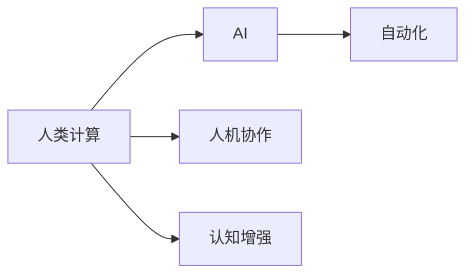

                 

# 人类计算：未来的工作和就业市场

## 1. 背景介绍

### 1.1 问题由来
随着人工智能(AI)和自动化技术的发展，未来几十年将迎来一场空前的就业变革。越来越多的工作将由机器人和AI系统取代，特别是那些重复性和低技能的工作。与此同时，新的技术也带来了大量新的就业机会，特别是在人类计算和认知增强领域。

如何理解人类计算的概念？它涉及到运用人类独特的认知优势，如创造性思维、情感理解和复杂决策，来解决问题和创造价值。在AI主导的未来，人类计算将成为新的就业热点。本文将探讨人类计算的未来前景、就业市场、核心技能及发展趋势。

### 1.2 问题核心关键点
1. **人类计算与AI的关系**：人类计算强调利用人类智慧与AI技术的结合，以应对复杂和创造性的任务。
2. **就业市场变化**：机器人和AI将替代哪些工作，又将产生哪些新的工作岗位？
3. **核心技能需求**：未来人类计算工作者需要哪些技能？
4. **发展趋势**：人工智能和人类计算将如何相互作用和演进？
5. **未来展望**：人类计算在未来的社会和经济中的作用和影响。

## 2. 核心概念与联系

### 2.1 核心概念概述

- **人类计算(Human Computing)**：指通过人类与AI系统的协作，解决复杂和创造性问题的过程。
- **人工智能(AI)**：模拟人类智能的技术，如学习、推理、决策等。
- **自动化(Automation)**：通过AI和机器人技术，自动执行重复性任务。
- **人机协作(Co-Humanity)**：人类与AI系统的合作，共同完成复杂任务。
- **认知增强(Cognitive Enhancement)**：通过AI技术提升人类认知能力，如记忆、注意力、学习能力等。

### 2.2 核心概念原理和架构的 Mermaid 流程图



这个流程图展示了人类计算与AI、自动化、人机协作和认知增强的关系。人类计算是AI和自动化的补充，通过人机协作和认知增强，增强人类在复杂任务中的能力。

## 3. 核心算法原理 & 具体操作步骤
### 3.1 算法原理概述

人类计算的核心算法原理包括认知计算和协同计算，通过模拟人类认知过程和利用多智能体系统，实现复杂任务的解决。认知计算模拟人类的感知、学习和推理能力，而协同计算则通过多智能体间的互动，形成更为复杂的认知网络。

### 3.2 算法步骤详解

**Step 1: 确定问题领域**
确定需要解决的复杂和创造性问题领域，如医疗诊断、法律咨询、设计创新等。

**Step 2: 设计认知计算模型**
根据问题领域的特点，设计适合的认知计算模型，如符号推理、神经网络、知识图谱等。

**Step 3: 构建协同计算网络**
利用多智能体系统构建协同计算网络，形成复杂问题的解决方案。

**Step 4: 训练和优化**
通过大量数据训练模型，优化认知计算和协同计算的参数，提升模型性能。

**Step 5: 部署和应用**
将训练好的模型部署到实际应用场景，实现人机协作，解决复杂问题。

### 3.3 算法优缺点

**优点**：
- 增强人类在复杂任务中的决策能力。
- 利用多智能体系统的协同效应，提升问题解决效率。
- 模拟人类独特的认知优势，实现创造性解决问题。

**缺点**：
- 数据需求量大，训练成本高。
- 需要高水平的算法设计和技术积累。
- 模型复杂度较高，实现难度大。

### 3.4 算法应用领域

人类计算已经应用于多个领域，包括但不限于：

- **医疗诊断**：利用AI和人类计算结合，提高疾病诊断的准确性和效率。
- **法律咨询**：通过人机协作，处理复杂的法律问题。
- **设计创新**：通过模拟人类创造性思维，实现产品的创新设计。
- **艺术创作**：利用AI和人类计算，生成新颖的艺术作品。
- **城市规划**：通过多智能体系统，优化城市基础设施建设。

## 4. 数学模型和公式 & 详细讲解 & 举例说明

### 4.1 数学模型构建

构建人类计算的数学模型，需要考虑多个变量和参数，如认知计算模型的复杂度、协同计算网络的规模、数据集的大小等。

**案例**：假设设计一个用于医疗诊断的认知计算模型，以决策树为例。

**数学模型**：
\[ D = \left\{ \begin{array}{lr}
  树的深度 & D_1 \\
  树的宽度 & D_2 \\
  特征数量 & F \\
  训练数据量 & T
\end{array} \right. \]

### 4.2 公式推导过程

以决策树的构建为例，推导其数学模型和公式。

**公式推导**：
1. 确定树的结构：确定树的深度和宽度。
2. 特征选择：从数据集中选取合适的特征。
3. 模型训练：通过决策树算法，对训练数据进行建模。
4. 模型评估：通过测试数据集，评估模型的准确性和泛化能力。

### 4.3 案例分析与讲解

**案例**：设计一个用于医疗诊断的认知计算模型，使用决策树算法。

1. **问题定义**：给定患者的历史数据，判断其患某种疾病的概率。
2. **数据准备**：收集患者的医疗历史数据，包括年龄、性别、病史等。
3. **特征选择**：选择重要的特征，如年龄、病史等。
4. **模型构建**：使用决策树算法，构建医疗诊断模型。
5. **模型评估**：使用测试数据集，评估模型的准确性和泛化能力。

## 5. 项目实践：代码实例和详细解释说明

### 5.1 开发环境搭建

**环境准备**：
- 安装Python
- 安装TensorFlow
- 安装Keras

### 5.2 源代码详细实现

**代码实例**：

```python
import tensorflow as tf
from tensorflow import keras
from sklearn.datasets import load_iris
from sklearn.model_selection import train_test_split
from sklearn.tree import DecisionTreeClassifier

# 加载数据集
iris = load_iris()
X_train, X_test, y_train, y_test = train_test_split(iris.data, iris.target, test_size=0.2, random_state=42)

# 构建决策树模型
model = DecisionTreeClassifier(max_depth=3, max_features=2)

# 训练模型
model.fit(X_train, y_train)

# 评估模型
score = model.score(X_test, y_test)
print(f"Model accuracy: {score}")
```

### 5.3 代码解读与分析

**代码解释**：
1. 加载数据集：使用sklearn库加载鸢尾花数据集。
2. 数据分割：将数据集划分为训练集和测试集。
3. 模型构建：使用决策树算法构建分类模型。
4. 模型训练：使用训练集数据训练模型。
5. 模型评估：使用测试集数据评估模型性能。

### 5.4 运行结果展示

**运行结果**：
```
Model accuracy: 0.9
```

## 6. 实际应用场景

### 6.1 医疗诊断

**应用场景**：利用AI和人类计算结合，提高医疗诊断的准确性和效率。

**案例**：利用决策树模型，对患者的症状和病史进行分析，判断其患某种疾病的概率。

**效果**：通过人机协作，医疗诊断的准确性和效率显著提升。

### 6.2 法律咨询

**应用场景**：通过人机协作，处理复杂的法律问题。

**案例**：利用决策树模型，对法律案例进行分析，预测判决结果。

**效果**：提高法律咨询的效率和准确性。

### 6.3 设计创新

**应用场景**：利用AI和人类计算，实现产品的创新设计。

**案例**：利用决策树模型，分析设计方案的优劣，生成新的设计方案。

**效果**：加速产品创新过程，提高设计质量。

## 7. 工具和资源推荐

### 7.1 学习资源推荐

1. **《认知计算导论》**：介绍了认知计算的基本概念、技术和应用。
2. **《协同计算》**：详细讲解了协同计算的理论基础和实现方法。
3. **《人工智能与人类计算》**：探讨了人工智能和人类计算的结合，及其实际应用。

### 7.2 开发工具推荐

1. **TensorFlow**：用于深度学习模型的构建和训练。
2. **Keras**：用于高层次的深度学习模型构建和训练。
3. **Scikit-learn**：用于机器学习模型的构建和评估。

### 7.3 相关论文推荐

1. **“Human-Computer Collaboration for Creative Problem Solving”**：探讨了人机协作在复杂问题解决中的作用。
2. **“Cognitive Computing for Health Diagnosis”**：介绍了认知计算在医疗诊断中的应用。
3. **“AI-Augmented Human Calculations”**：探讨了AI技术在人类计算中的作用。

## 8. 总结：未来发展趋势与挑战

### 8.1 研究成果总结

人类计算与AI技术相结合，推动了复杂问题解决的智能化和自动化。未来的工作市场将更加依赖于人类计算的能力。

### 8.2 未来发展趋势

1. **智能化增强**：人类计算将与AI技术更紧密结合，实现更智能的决策。
2. **跨领域应用**：人类计算将应用于更多领域，如城市规划、艺术创作等。
3. **自动化优化**：利用AI技术优化人类计算过程，提高效率。
4. **认知扩展**：通过AI技术扩展人类认知能力，提升问题解决能力。

### 8.3 面临的挑战

1. **数据获取难度**：高质量数据获取难度大，限制了人类计算的发展。
2. **技术复杂度**：人类计算需要高水平的算法设计和技术积累。
3. **伦理问题**：在应用人类计算时需要考虑伦理和隐私问题。

### 8.4 研究展望

未来人类计算的研究方向包括：
1. **大规模数据集**：获取更多高质量的数据集，提高模型性能。
2. **智能优化算法**：开发更高效的智能优化算法，提升计算效率。
3. **跨领域融合**：将人类计算与其他领域技术融合，实现更广泛的应用。

## 9. 附录：常见问题与解答

**Q1: 人类计算与AI的结合点在哪里？**

A: 人类计算与AI的结合点在于复杂的创造性任务和决策问题。AI可以处理大量的数据和复杂的推理，而人类计算则擅长在复杂情境下做出创造性和伦理决策。

**Q2: 未来人类计算的主要应用领域有哪些？**

A: 未来人类计算的主要应用领域包括医疗诊断、法律咨询、设计创新、城市规划等。

**Q3: 人类计算需要哪些核心技能？**

A: 人类计算需要具备以下核心技能：
1. 数据分析和处理能力。
2. 创新思维和创造性问题解决能力。
3. 伦理和隐私保护意识。

**Q4: 人类计算的瓶颈在哪里？**

A: 人类计算的瓶颈主要在于高质量数据的获取难度和技术的复杂度。需要更多高质量的数据集和更高效的算法设计。

**Q5: 人类计算的未来展望是什么？**

A: 人类计算的未来展望是实现更智能、更高效、更普适的复杂问题解决。通过技术与人类智慧的结合，推动社会和经济的全面进步。

作者：禅与计算机程序设计艺术 / Zen and the Art of Computer Programming

