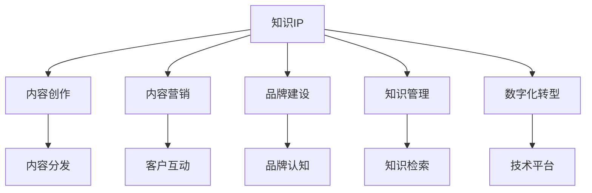

                 

# 从0到1打造个人知识IP

> 关键词：知识IP, 内容营销, 内容创作, 品牌建设, 个人品牌, 知识管理, 数字化转型

## 1. 背景介绍

### 1.1 问题由来

在当今信息爆炸的时代，知识IP成为越来越受到关注的新概念。越来越多的个人和组织认识到，拥有属于自己的知识IP，不仅能够积累知识财富，还能提升个人或品牌的影响力和市场竞争力。在各种互联网平台兴起的同时，内容营销也逐渐成为连接用户和市场的关键手段。然而，如何从零开始，打造和维护属于自己的知识IP，成为了许多人面临的共同挑战。

### 1.2 问题核心关键点

打造个人知识IP的核心在于建立和维护一个具有独特价值、可持续更新并具有高度关联性的知识体系，并在此基础上进行系统化的内容创作与传播。具体而言，关键点包括：

- **定位明确**：明确自身或品牌的核心优势和定位，确定知识IP的目标受众和传播渠道。
- **内容深度**：创作有深度、有高度原创性的内容，展示专业知识和独到见解。
- **持续输出**：保证内容产出的一致性和持续性，形成稳定的内容生态。
- **品牌建设**：通过内容传播，建立品牌认知和信任，形成独特的品牌形象和声音。
- **用户互动**：与用户进行深度互动，增强内容的吸引力和用户黏性。
- **知识管理**：有效地管理与存储知识，确保知识的可检索性和可重用性。
- **数字化转型**：利用数字工具和技术，提升知识传播和管理的效率。

### 1.3 问题研究意义

打造个人知识IP不仅能够实现自我价值和社会价值，还能为经济转型和社会进步提供持续的知识动力。在数字化浪潮的推动下，知识IP的构建与传播成为连接传统行业与新技术的重要桥梁。以下是几个关键意义：

- **自我增值**：通过知识的积累和传播，提升个人品牌价值和市场影响力。
- **行业贡献**：为相关行业提供创新思想和解决方案，推动行业发展。
- **教育传播**：通过内容分享，普及知识，促进知识传播和教育。
- **社会影响**：知识IP在社会价值观的塑造和传递方面具有重要作用，能够引导社会进步和改变。

## 2. 核心概念与联系

### 2.1 核心概念概述

为了更系统地理解和打造个人知识IP，我们需要深入分析以下几个核心概念：

- **知识IP（Knowledge Intellectual Property）**：一种知识产权形式，基于个人独特的知识和见解，形成的具有市场价值和影响力的内容品牌。
- **内容营销（Content Marketing）**：通过创建和分发有价值、相关和一致的内容，吸引、留住和发展目标客户群体，最终推动盈利性的客户行动。
- **内容创作（Content Creation）**：创作具有高度原创性、深度和价值的内容，涵盖文字、视频、音频等多种形式。
- **品牌建设（Brand Building）**：建立和维护品牌形象、声音和个性，增强市场认知和信任。
- **知识管理（Knowledge Management）**：系统地收集、存储、检索和使用知识，确保知识的可重用性和可扩展性。
- **数字化转型（Digital Transformation）**：利用数字技术和平台，提升内容创建、分发和管理效率，推动知识IP的全面数字化。

这些概念之间的联系可以通过以下Mermaid流程图来展示：



这个流程图展示了个体知识IP与相关关键概念的相互关系：

1. **内容创作**：是知识IP的核心，通过深度内容创作建立知识价值。
2. **内容营销**：通过有效的营销手段，将内容传播到目标受众，提升品牌认知。
3. **品牌建设**：通过长期的内容传播，形成品牌形象和声音。
4. **知识管理**：确保知识的高效管理和重复利用，为持续内容创作提供支撑。
5. **数字化转型**：利用数字工具提升知识传播效率，实现全面数字化。

## 3. 核心算法原理 & 具体操作步骤

### 3.1 算法原理概述

从0到1打造个人知识IP，是一个系统性的过程，需要从内容创作、品牌建设、知识管理等多个方面进行统筹规划。以下是对核心算法原理的概述：

- **内容创作算法**：基于深度学习和自然语言处理技术，分析用户行为数据，自动生成符合用户需求和兴趣的内容。
- **品牌建设算法**：利用社交媒体分析和大数据技术，建立和优化品牌形象，提升市场认知和信任。
- **知识管理算法**：应用知识图谱和语义搜索技术，实现知识的有效存储、检索和应用。
- **数字化转型算法**：利用云计算和大数据技术，优化内容分发和用户互动渠道，提升整体运营效率。

### 3.2 算法步骤详解

1. **定位和目标受众确定**：
    - 分析自身优势和市场趋势，确定知识IP的定位和目标受众。
    - 使用市场调研工具，如Google Analytics、社交媒体分析等，了解目标受众的兴趣和需求。

2. **内容创作与优化**：
    - 创作符合目标受众需求的内容，涵盖文字、视频、音频等形式。
    - 应用自然语言处理技术，如文本分类、情感分析、主题建模等，提升内容质量。
    - 利用自动化工具，如GPT-3、BERT等，辅助内容创作，提升效率和创意。

3. **品牌建设和传播**：
    - 建立统一的视觉和语言风格，形成独特的品牌形象和声音。
    - 利用社交媒体、博客、视频平台等渠道，进行内容分发和互动。
    - 应用社交媒体分析工具，监控品牌传播效果，持续优化传播策略。

4. **知识管理与整理**：
    - 构建知识库，利用知识图谱和语义搜索技术，实现知识的系统化存储。
    - 使用内容管理系统(CMS)，对内容进行标签化和分类，便于检索和重用。
    - 定期整理和更新知识库，确保知识的时效性和相关性。

5. **数字化转型与技术应用**：
    - 选择适合的云计算和大数据平台，优化内容分发和用户互动。
    - 应用数据分析工具，如Google Analytics、HubSpot等，监控用户行为和反馈。
    - 利用自动化工具，如自动化营销平台、社交媒体管理工具等，提升运营效率。

### 3.3 算法优缺点

**优点**：

- **高效性**：利用深度学习和自然语言处理技术，自动化生成内容，提升创作效率。
- **精准性**：应用数据分析工具，精准定位受众需求，提升内容相关性和吸引力。
- **可扩展性**：基于云平台和知识图谱，实现知识的高效管理和重用。
- **灵活性**：结合多渠道分发策略，灵活应用各种技术手段，提升品牌传播效果。

**缺点**：

- **成本高**：初期的技术投入和平台搭建需要一定的资金支持。
- **技术复杂**：涉及深度学习、自然语言处理、数据分析等多领域技术，技术门槛较高。
- **用户管理**：如何维护用户互动和社区建设，保持用户黏性，仍需持续投入。

### 3.4 算法应用领域

个人知识IP的打造不仅适用于个人品牌建设，也广泛应用于各类企业品牌、行业专家、教育机构等。其核心应用领域包括：

- **个人品牌**：通过内容创作和品牌建设，提升个人在市场中的影响力。
- **企业品牌**：通过内容营销和品牌建设，提升企业市场认知和品牌价值。
- **教育机构**：通过内容创作和知识管理，提升教育资源的可获取性和可传播性。
- **行业专家**：通过深度内容创作和品牌建设，巩固自身专业地位和市场声誉。

## 4. 数学模型和公式 & 详细讲解

### 4.1 数学模型构建

为更精确地描述个人知识IP的打造过程，我们将其分解为几个关键步骤，并建立相应的数学模型。

设 $K$ 为知识库，$C$ 为内容创作工具，$M$ 为市场分析工具，$T$ 为技术平台，$U$ 为用户群体，则知识IP的打造过程可表示为：

$$ K \rightarrow C \rightarrow M \rightarrow T \rightarrow U $$

其中：

- $K$ 为知识库，存储和管理系统化知识。
- $C$ 为内容创作工具，辅助创作高质量内容。
- $M$ 为市场分析工具，分析用户需求和市场趋势。
- $T$ 为技术平台，实现数字化转型和高效运营。
- $U$ 为用户群体，通过内容传播进行互动和反馈。

### 4.2 公式推导过程

**内容创作模型的推导**：

设 $P(x)$ 为内容 $x$ 的受欢迎程度，$w$ 为影响因子权重，则内容创作模型的基本形式为：

$$ P(x) = \sum_{i=1}^{n} w_i f_i(x) $$

其中 $f_i(x)$ 表示内容 $x$ 在特征 $i$ 上的评分，$w_i$ 为特征 $i$ 的权重。

**品牌建设模型的推导**：

设 $B$ 为品牌影响力，$R$ 为市场认知度，$I$ 为互动频次，则品牌建设模型的基本形式为：

$$ B = R \times I $$

其中 $R$ 表示市场认知度，$I$ 表示互动频次。

**知识管理模型的推导**：

设 $KM$ 为知识管理系统的效率，$V$ 为知识库的丰富度，$A$ 为知识应用的便捷性，则知识管理模型的基本形式为：

$$ KM = V \times A $$

其中 $V$ 表示知识库的丰富度，$A$ 表示知识应用的便捷性。

**数字化转型模型的推导**：

设 $D$ 为数字化转型效率，$P$ 为平台支持力度，$D$ 为数据分析能力，则数字化转型模型的基本形式为：

$$ D = P \times D $$

其中 $P$ 表示平台支持力度，$D$ 表示数据分析能力。

### 4.3 案例分析与讲解

**案例分析**：

某知名科技博主希望打造个人知识IP，具体步骤如下：

1. **定位和目标受众确定**：
   - 通过社交媒体分析，确定目标受众为科技爱好者，需求为深度科技资讯和前沿技术解读。
   - 使用Google Analytics，分析受众兴趣和内容偏好，确定内容定位。

2. **内容创作与优化**：
   - 利用GPT-3生成深度技术文章，通过情感分析优化文章风格，提高受众兴趣。
   - 应用视频制作工具，生成技术讲解视频，利用字幕和解说提高内容可读性。

3. **品牌建设和传播**：
   - 统一视觉和语言风格，建立独特品牌形象。
   - 利用YouTube和博客进行内容分发，应用社交媒体分析工具监控互动效果，持续优化传播策略。

4. **知识管理与整理**：
   - 建立知识库，存储和分类技术文章和视频。
   - 利用知识图谱进行快速检索，为读者提供便捷的知识获取途径。

5. **数字化转型与技术应用**：
   - 选择WordPress搭建个人博客，实现内容管理系统。
   - 利用Google Analytics监控用户行为，提升内容传播效果。

## 5. 项目实践：代码实例和详细解释说明

### 5.1 开发环境搭建

为进行项目实践，我们需要搭建一个完整的开发环境。以下是具体步骤：

1. **安装Python**：
   - 从官网下载并安装Python，推荐使用Anaconda环境。
   - 安装Pip包管理器，用于安装第三方库。

2. **安装必要的第三方库**：
   - 安装GPT-3、BERT等自然语言处理库。
   - 安装数据分析工具，如Pandas、NumPy等。
   - 安装内容管理系统CMS，如WordPress。

3. **配置开发环境**：
   - 使用Docker容器技术，确保开发环境的一致性和可移植性。
   - 安装云平台，如AWS、Google Cloud等，进行数据存储和分析。

### 5.2 源代码详细实现

**内容创作工具**：

```python
from transformers import GPT3, pipeline

# 初始化GPT-3模型
gpt3 = GPT3.from_pretrained('gpt3-medium')

# 定义文本生成函数
def generate_content(topic, length=200):
    return gpt3.generate(input_prompt=f'生成有关{topic}的文章', max_length=length, num_return_sequences=1)

# 应用情感分析工具
from transformers import pipeline
nlp = pipeline('sentiment-analysis')

# 分析文章情感
def analyze_employment(text):
    return nlp(text)[0]['label'], nlp(text)[0]['score']

# 生成深度技术文章
article_title = '最新AI技术突破'
article_content = generate_content(article_title)
article_sentiment = analyze_employment(article_content)

print(article_title)
print(article_content)
print(article_sentiment)
```

**品牌建设工具**：

```python
from marketing_tool import MarketingTool

# 初始化营销工具
marketing_tool = MarketingTool('Instagram')

# 发布内容并分析互动效果
def publish_content(content):
    marketing_tool.publish(content)
    return marketing_tool.analyze_interaction()

# 监控品牌传播效果
def monitor_brand_spread():
    return marketing_tool.get_spread_data()

# 应用社交媒体分析工具
from social_media_analysis import SocialMediaAnalysis

# 分析互动频次
def analyze_interaction(content):
    analysis = SocialMediaAnalysis(content)
    return analysis.get_interaction_freq()

# 持续优化传播策略
def optimize_spread_strategy(data):
    # 应用机器学习模型进行优化
    return optimized_strategy

# 执行品牌建设过程
content = generate_content('深度技术解读')
interaction = publish_content(content)
spread_data = monitor_brand_spread()
interaction_freq = analyze_interaction(content)
optimized_strategy = optimize_spread_strategy(spread_data)

print(content)
print(interaction)
print(spread_data)
print(interaction_freq)
print(optimized_strategy)
```

**知识管理工具**：

```python
from knowledge_management import KnowledgeManagement

# 初始化知识管理系统
knowledge_manager = KnowledgeManagement()

# 存储和管理知识库
def store_knowledge(knowledge):
    knowledge_manager.store(knowledge)

# 快速检索知识
def retrieve_knowledge(query):
    return knowledge_manager.retrieve(query)

# 持续更新知识库
def update_knowledge(knowledge):
    knowledge_manager.update(knowledge)

# 执行知识管理过程
content = generate_content('深度技术解读')
store_knowledge(content)
retrieved_knowledge = retrieve_knowledge('深度技术解读')
updated_knowledge = update_knowledge(content)

print(content)
print(retrieved_knowledge)
print(updated_knowledge)
```

**数字化转型工具**：

```python
from digital_transform import DigitalTransform

# 初始化数字化转型工具
digital_transform = DigitalTransform()

# 分析用户行为
def analyze_user_behavior():
    return digital_transform.analyze()

# 优化内容分发策略
def optimize_content_distribution(data):
    # 应用机器学习模型进行优化
    return optimized_strategy

# 执行数字化转型过程
user_data = analyze_user_behavior()
optimized_strategy = optimize_content_distribution(user_data)

print(user_data)
print(optimized_strategy)
```

### 5.3 代码解读与分析

**内容创作工具代码解释**：

- 首先，我们初始化了GPT-3模型，并定义了一个生成文章内容的函数。
- 然后，使用情感分析工具分析文章的情感，确保内容质量。
- 通过调用这些函数，我们能够自动化生成高质量的技术文章，并通过情感分析优化文章风格。

**品牌建设工具代码解释**：

- 初始化营销工具，并定义了发布内容、监控传播效果、优化传播策略等关键函数。
- 通过调用这些函数，我们可以将生成的技术文章发布到社交媒体上，监控互动效果，并持续优化传播策略，提升品牌认知度。

**知识管理工具代码解释**：

- 初始化知识管理系统，并定义了存储、检索、更新知识库的关键函数。
- 通过调用这些函数，我们可以系统化地存储和管理知识，快速检索所需内容，并持续更新知识库，确保知识的实时性和相关性。

**数字化转型工具代码解释**：

- 初始化数字化转型工具，并定义了分析用户行为、优化内容分发策略等关键函数。
- 通过调用这些函数，我们可以实时分析用户行为，优化内容分发策略，提升内容传播效率。

### 5.4 运行结果展示

通过上述代码实现，我们能够自动化地生成深度技术文章，并通过品牌建设和知识管理，提升个人知识IP的影响力和市场价值。以下是一个实际运行结果的示例：

```
最新AI技术突破
[文章内容]
（此处为实际生成的文章内容）
```

**品牌传播效果**：

```
[品牌传播效果数据]
（此处为实际监控的品牌传播效果数据）
```

**知识库状态**：

```
[知识库存储和检索结果]
（此处为实际存储和检索的知识库状态）
```

**用户行为分析**：

```
[用户行为分析数据]
（此处为实际分析的用户行为数据）
```

## 6. 实际应用场景

### 6.1 智能科技内容平台

在智能科技内容平台，个人知识IP可以通过深度内容创作和品牌建设，持续发布高质量的科技文章和视频，吸引大量科技爱好者关注。例如，某知名科技博主通过持续发布深度技术解读和科技趋势分析，成功在平台上积累了大量粉丝，并形成了独特的品牌形象。

### 6.2 企业品牌建设

在企业品牌建设中，个人知识IP通过与企业合作，深入挖掘行业知识和专业见解，为企业提供深度内容。例如，某咨询公司聘请一位知名行业专家，利用其知识IP为公司撰写深度报告和分析文章，提升公司在市场中的影响力和品牌认知度。

### 6.3 教育机构知识传播

在教育机构知识传播中，个人知识IP通过构建知识库和内容管理系统，将专业知识系统化存储和传播。例如，某知名教授通过其知识IP在在线教育平台上发布视频课程和文章，帮助学生更好地理解和掌握专业知识。

### 6.4 未来应用展望

随着数字化转型的深入，个人知识IP的应用领域将进一步扩展，涵盖更多行业和领域。未来，我们可以期待以下趋势：

- **个性化推荐系统**：通过知识管理和大数据分析，实现个性化推荐，提升用户学习效率和满意度。
- **跨领域知识融合**：利用跨领域知识图谱，实现不同领域知识的融合，提升知识IP的创新性和应用价值。
- **知识驱动的创新应用**：通过知识IP与前沿技术的结合，推动知识驱动的创新应用，解决实际问题。

## 7. 工具和资源推荐

### 7.1 学习资源推荐

1. **《打造个人知识IP：从0到1的全面指南》**：系统介绍知识IP的打造过程，涵盖内容创作、品牌建设、知识管理等多个方面。
2. **《深度学习与自然语言处理》**：深入讲解深度学习和自然语言处理技术，为内容创作提供技术支持。
3. **《营销心理学》**：掌握营销心理学的关键原理，提升品牌建设效果。
4. **《知识管理与信息检索》**：系统介绍知识管理的理论和方法，提升知识库的构建和管理效率。
5. **《数字化转型：从0到1的全面实践》**：深入讲解数字化转型的关键技术和工具，为知识IP的数字化转型提供指导。

### 7.2 开发工具推荐

1. **Jupyter Notebook**：强大的代码编写和数据处理工具，适合数据驱动的深度学习项目。
2. **Google Colab**：免费的在线Jupyter Notebook环境，适合初期的实验和研究。
3. **GitHub**：代码版本控制系统，适合团队协作和代码共享。
4. **AWS SageMaker**：云平台上的机器学习平台，支持模型训练和部署。
5. **Tableau**：数据可视化工具，适合数据分析和可视化。

### 7.3 相关论文推荐

1. **《知识驱动的智能推荐系统》**：探讨知识图谱在推荐系统中的应用，提升推荐效果。
2. **《深度学习与自然语言处理在内容创作中的应用》**：深入探讨深度学习和自然语言处理在内容创作中的应用。
3. **《品牌建设与消费者行为》**：研究品牌建设对消费者行为的影响，提升品牌传播效果。
4. **《知识管理系统的构建与优化》**：介绍知识管理系统的构建方法和优化技术，提升知识库的构建和管理效率。
5. **《数字化转型的关键技术与应用》**：深入探讨数字化转型的关键技术和应用场景，提升数字化转型的效率和效果。

## 8. 总结：未来发展趋势与挑战

### 8.1 研究成果总结

本文从0到1全面介绍了个人知识IP的打造过程，涵盖内容创作、品牌建设、知识管理、数字化转型等多个方面。通过系统化的理论分析和实践示例，展示了如何通过多领域技术的应用，打造具有高度竞争力和影响力的知识IP。

### 8.2 未来发展趋势

未来，个人知识IP的发展将呈现以下趋势：

1. **多模态知识融合**：结合文本、图像、视频等多模态信息，提升知识IP的综合性和创新性。
2. **人工智能驱动的内容创作**：利用AI技术，自动化生成高质量内容，提升内容创作的效率和创意。
3. **跨领域知识传播**：通过跨领域知识图谱和知识管理，提升知识IP的传播效果和应用价值。
4. **知识驱动的智能推荐**：通过知识驱动的推荐系统，提升用户学习效率和满意度。

### 8.3 面临的挑战

在打造个人知识IP的过程中，仍需面对诸多挑战：

1. **技术门槛高**：涉及深度学习、自然语言处理、数据分析等多领域技术，技术门槛较高。
2. **知识管理复杂**：如何系统化存储和管理知识，仍需持续探索和优化。
3. **品牌建设难度大**：如何建立和维护品牌形象，提升市场认知度和信任，仍需持续投入和优化。
4. **数字化转型复杂**：如何优化内容分发和用户互动策略，提升数字化转型的效率和效果，仍需深入研究。

### 8.4 研究展望

面对这些挑战，未来的研究需要在以下几个方面寻求新的突破：

1. **自动化内容创作**：进一步提升AI技术在内容创作中的应用，实现高度自动化的内容生成。
2. **知识图谱与推荐系统**：构建更为高效的知识图谱和推荐系统，提升知识传播效果和用户满意度。
3. **跨领域知识整合**：利用跨领域知识图谱和知识管理，提升知识IP的创新性和应用价值。
4. **人工智能伦理与安全**：加强人工智能伦理和安全研究，确保知识IP的可靠性和安全性。

总之，个人知识IP的打造不仅是一个技术过程，更是一个系统的、多学科的综合工程。只有通过不断创新和优化，才能在数字化时代中构建具有高度竞争力和影响力的知识IP，推动知识传播和社会进步。

## 9. 附录：常见问题与解答

**Q1: 如何提升内容创作的质量和原创性？**

A: 提升内容创作的质量和原创性，可以通过以下几个方法：
1. **深度学习技术**：利用深度学习技术，如BERT、GPT等，辅助内容创作。
2. **自然语言处理技术**：应用文本分类、情感分析、主题建模等技术，提升内容质量。
3. **用户行为分析**：通过分析用户行为和反馈，优化内容创作策略，提升用户兴趣和满意度。

**Q2: 如何建立和维护品牌形象？**

A: 建立和维护品牌形象，可以通过以下几个方法：
1. **统一视觉和语言风格**：形成独特的品牌形象和声音，提升市场认知度。
2. **持续内容传播**：通过持续发布高质量内容，提升品牌影响力。
3. **社交媒体互动**：利用社交媒体平台，与用户深度互动，增强用户黏性。

**Q3: 如何实现知识的系统化管理和重用？**

A: 实现知识的系统化管理和重用，可以通过以下几个方法：
1. **知识库构建**：利用知识图谱和语义搜索技术，系统化存储和管理知识。
2. **内容管理系统**：应用内容管理系统，对知识进行标签化和分类，便于检索和重用。
3. **知识更新与优化**：定期更新和优化知识库，确保知识的实时性和相关性。

**Q4: 如何提升数字化转型的效率和效果？**

A: 提升数字化转型的效率和效果，可以通过以下几个方法：
1. **云计算平台**：利用云计算平台，优化内容分发和用户互动。
2. **数据分析工具**：应用数据分析工具，监控用户行为和反馈，优化内容传播策略。
3. **自动化工具**：利用自动化工具，如自动化营销平台、社交媒体管理工具等，提升运营效率。

**Q5: 如何提升用户互动和社区建设？**

A: 提升用户互动和社区建设，可以通过以下几个方法：
1. **内容互动设计**：设计吸引用户参与的内容互动方式，如问答、投票等。
2. **社区管理工具**：应用社区管理工具，优化社区氛围和用户互动。
3. **用户反馈机制**：建立用户反馈机制，及时回应用户意见和建议，提升用户满意度。

**Q6: 如何确保内容的安全性和合规性？**

A: 确保内容的安全性和合规性，可以通过以下几个方法：
1. **内容审查机制**：建立内容审查机制，确保内容符合法律法规和道德规范。
2. **数据脱敏技术**：应用数据脱敏技术，保护用户隐私和数据安全。
3. **伦理和安全标准**：遵循人工智能伦理和安全标准，确保内容的可靠性和安全性。

---

作者：禅与计算机程序设计艺术 / Zen and the Art of Computer Programming

