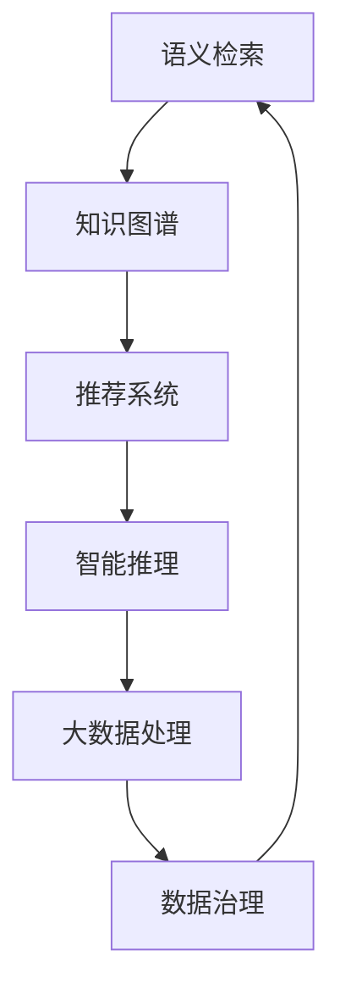

                 

# 从信息过载到知识精炼：发现引擎的价值

> 关键词：知识图谱, 发现引擎, 信息检索, 语义检索, 语义网络, 推荐系统, 大数据, 智能推荐, 信息抽取, 数据治理

## 1. 背景介绍

### 1.1 问题由来

在当今的信息时代，每天产生的海量数据远远超出了人类的处理能力。据统计，全球每天产生的数据量高达2.5PB，相当于每秒钟产生约2.5GB的新数据。面对如此巨量的数据，传统的数据处理方式已经无法满足需求，数据驱动的决策变得越来越困难。信息过载的问题在全球范围内日益严峻，成为各行各业面临的重大挑战。

为了应对信息过载问题，发现引擎应运而生。发现引擎是一种高级搜索引擎，通过将用户查询与数据语义进行匹配，能够快速找到最相关的信息，从而帮助用户在海量数据中找到有价值的知识。发现引擎利用先进的算法和强大的计算能力，能够对数据进行深入分析和挖掘，为企业决策提供有力支持。

### 1.2 问题核心关键点

发现引擎的核心关键点在于以下几个方面：

1. **语义检索**：传统的搜索引擎是基于关键词的检索，无法处理语义相似但关键词不同的情况。发现引擎通过语义检索技术，能够理解和处理自然语言，实现更准确的匹配。

2. **知识图谱**：发现引擎通常基于知识图谱构建，知识图谱是描述实体及其关系的语义网络，能够更全面地描述和关联数据。

3. **推荐系统**：发现引擎常常结合推荐系统，根据用户的历史行为和兴趣，为用户推荐最相关的信息，提高用户满意度。

4. **智能推理**：发现引擎具有智能推理能力，能够根据已有知识进行推理，发现潜在的关系和模式，提供更深入的洞察。

5. **大数据处理**：发现引擎能够处理海量数据，通过分布式计算和大数据技术，实现高效的实时分析和检索。

6. **数据治理**：发现引擎在数据治理方面也发挥着重要作用，能够帮助企业整合和管理数据，提高数据质量和可用性。

这些关键点共同构成了发现引擎的核心价值，使其成为解决信息过载问题的有效工具。

## 2. 核心概念与联系

### 2.1 核心概念概述

为了更好地理解发现引擎的价值，我们需要先了解一些核心概念：

1. **语义检索**：利用自然语言处理技术，理解用户查询的语义，将其转换为计算机可理解的形式，从而实现更精准的信息检索。

2. **知识图谱**：一种结构化的语义网络，用于描述实体及其关系。知识图谱通过节点和边的形式，构建了丰富的知识体系，能够帮助发现引擎进行深入的数据分析和关联。

3. **推荐系统**：利用用户历史数据和兴趣模型，为用户推荐最相关的信息。推荐系统通过算法优化，提升用户体验和满意度。

4. **智能推理**：利用规则和推理机制，对已有数据进行推理，发现潜在的关系和模式，增强数据的解释力和洞察力。

5. **大数据处理**：利用分布式计算和大数据技术，处理海量数据，实现高效的实时分析和检索。

6. **数据治理**：通过数据整合、清洗、标注等手段，提升数据质量和可用性，确保数据的一致性和完整性。

这些核心概念相互关联，共同构成了发现引擎的技术体系，帮助企业从海量数据中发现价值。

### 2.2 核心概念原理和架构的 Mermaid 流程图



这个流程图展示了发现引擎的技术架构，从语义检索开始，通过知识图谱进行数据关联，结合推荐系统提供个性化服务，利用智能推理进行深入分析，最终通过大数据处理和数据治理实现高效的信息检索。

## 3. 核心算法原理 & 具体操作步骤

### 3.1 算法原理概述

发现引擎的核心算法包括语义检索、知识图谱构建、推荐系统优化、智能推理和数据治理技术。以下将详细介绍这些算法的原理和具体操作步骤。

### 3.2 算法步骤详解

#### 3.2.1 语义检索算法

语义检索算法的核心在于将用户查询转换为语义向量，并将其与数据中的语义向量进行匹配。常见的语义检索算法包括：

1. **余弦相似度法**：计算用户查询和数据中的每个文档向量之间的余弦相似度，选择相似度最高的文档作为结果。

2. **词向量模型**：使用词向量模型（如Word2Vec、GloVe）将查询和文档转换为向量表示，通过余弦相似度计算匹配度。

3. **主题模型**：使用主题模型（如LDA）将查询和文档映射到主题空间，根据主题相似度进行匹配。

4. **神经网络模型**：使用神经网络模型（如Transformer、BERT）进行语义匹配，通过多层的注意力机制学习上下文关系。

#### 3.2.2 知识图谱构建算法

知识图谱构建的目的是将数据中的实体及其关系构建为结构化的语义网络。常见的知识图谱构建算法包括：

1. **基于规则的方法**：使用人工编写的规则和模式，自动发现和构建知识图谱。

2. **基于统计的方法**：利用统计模型（如CRF、LSTM）对实体和关系进行自动标注和构建。

3. **基于图嵌入的方法**：使用图嵌入算法（如TransE、DistMult）将实体和关系映射到低维向量空间，通过向量相似度进行匹配。

#### 3.2.3 推荐系统优化算法

推荐系统优化算法的核心在于构建用户兴趣模型，并根据模型预测用户可能感兴趣的信息。常见的推荐系统优化算法包括：

1. **基于协同过滤的方法**：通过分析用户历史行为和偏好，进行相似性计算和推荐。

2. **基于内容的推荐**：根据用户对信息的评价，提取特征向量进行推荐。

3. **基于矩阵分解的方法**：使用矩阵分解技术（如SVD、ALS）进行用户和物品特征的分解和推荐。

#### 3.2.4 智能推理算法

智能推理算法的核心在于利用规则和推理机制，对已有数据进行推理，发现潜在的关系和模式。常见的智能推理算法包括：

1. **基于规则的方法**：使用人工编写的规则进行推理和匹配。

2. **基于逻辑的方法**：使用逻辑推理机制（如Fuzzy Logic、Deductive Reasoning）进行推理。

3. **基于神经网络的方法**：使用神经网络模型进行推理和匹配，通过多层神经元的学习发现潜在的关系和模式。

#### 3.2.5 数据治理算法

数据治理算法的核心在于数据整合、清洗和标注，提升数据质量和可用性。常见的数据治理算法包括：

1. **数据清洗算法**：通过数据清洗算法（如数据去重、异常值检测）进行数据预处理。

2. **数据标注算法**：通过数据标注算法（如标注工具、自动化标注）进行数据标注和分类。

3. **数据整合算法**：通过数据整合算法（如ETL、数据联邦）进行数据整合和关联。

### 3.3 算法优缺点

#### 3.3.1 语义检索算法的优缺点

**优点**：

1. 能够理解和处理自然语言，实现更精准的信息检索。

2. 可以处理语义相似但关键词不同的情况，提升检索效果。

3. 能够与知识图谱进行结合，提升信息检索的深度和广度。

**缺点**：

1. 对数据质量要求较高，需要高质量的语料库和标注数据。

2. 算法复杂度高，需要高性能计算资源。

#### 3.3.2 知识图谱构建算法的优缺点

**优点**：

1. 能够将数据中的实体及其关系构建为结构化的语义网络，提升数据关联性。

2. 能够自动发现和构建知识图谱，降低人工干预成本。

3. 能够提高数据的解释力和洞察力，增强数据的应用价值。

**缺点**：

1. 构建复杂，需要大量的标注数据和计算资源。

2. 构建后的知识图谱需要维护和更新，确保其准确性和时效性。

#### 3.3.3 推荐系统优化算法的优缺点

**优点**：

1. 能够根据用户历史行为和兴趣进行个性化推荐，提升用户体验。

2. 能够结合语义检索和知识图谱，提升推荐效果。

3. 能够动态更新推荐模型，适应数据变化。

**缺点**：

1. 对数据质量要求较高，需要高质量的用户行为数据。

2. 算法复杂度高，需要高性能计算资源。

#### 3.3.4 智能推理算法的优缺点

**优点**：

1. 能够利用规则和推理机制进行深入分析，发现潜在的关系和模式。

2. 能够提升数据的解释力和洞察力，增强数据的应用价值。

3. 能够适应不同领域的应用需求，灵活性较高。

**缺点**：

1. 对规则和推理机制的要求较高，需要人工干预。

2. 对数据质量要求较高，需要高质量的数据和标注数据。

#### 3.3.5 数据治理算法的优缺点

**优点**：

1. 能够提升数据质量和可用性，提高数据驱动决策的准确性。

2. 能够整合和管理数据，提高数据的完整性和一致性。

3. 能够进行数据清洗和标注，提高数据预处理效率。

**缺点**：

1. 对数据质量要求较高，需要高质量的数据和标注数据。

2. 算法复杂度高，需要高性能计算资源。

### 3.4 算法应用领域

发现引擎的核心算法和技术在多个领域得到了广泛应用，以下是几个典型的应用场景：

1. **智慧医疗**：发现引擎在智慧医疗领域可以用于病人信息检索、疾病诊断、药品推荐等，通过语义检索和知识图谱，帮助医生快速获取相关信息，提高诊疗效率。

2. **智能金融**：发现引擎在智能金融领域可以用于客户信用评估、投资组合推荐、风险控制等，通过推荐系统和智能推理，提升金融决策的准确性和可靠性。

3. **智能制造**：发现引擎在智能制造领域可以用于设备故障诊断、生产计划优化、供应链管理等，通过智能推理和数据治理，提高生产效率和管理水平。

4. **智慧教育**：发现引擎在智慧教育领域可以用于学生学习路径推荐、智能答疑、学习内容推荐等，通过推荐系统和智能推理，提升教育质量和个性化体验。

5. **智能客服**：发现引擎在智能客服领域可以用于客户问题解答、自动回复、情感分析等，通过语义检索和知识图谱，提升客服系统的响应速度和准确性。

## 4. 数学模型和公式 & 详细讲解 & 举例说明

### 4.1 数学模型构建

发现引擎的核心模型包括语义检索模型、知识图谱模型、推荐系统模型、智能推理模型和数据治理模型。以下将详细介绍这些模型的数学模型构建和公式推导。

#### 4.1.1 语义检索模型的数学模型构建

语义检索模型的核心在于将用户查询和数据中的文档向量进行匹配，常用的数学模型包括余弦相似度模型和神经网络模型。

**余弦相似度模型**：

$$
similarity(q, d) = \frac{q \cdot d}{\|q\|\|d\|}
$$

其中，$q$为查询向量，$d$为文档向量，$\cdot$表示向量点乘，$\|\cdot\|$表示向量范数。

**神经网络模型**：

使用Transformer模型进行语义匹配，通过多层注意力机制学习上下文关系。

**公式推导过程**：

$$
q \cdot d = \sum_{i=1}^{n} q_i \cdot d_i
$$

$$
\|q\| = \sqrt{\sum_{i=1}^{n} q_i^2}
$$

$$
\|d\| = \sqrt{\sum_{i=1}^{n} d_i^2}
$$

其中，$n$为向量维度，$q_i$和$d_i$分别为查询和文档的$i$维向量。

#### 4.1.2 知识图谱模型的数学模型构建

知识图谱模型的核心在于将实体及其关系构建为结构化的语义网络，常用的数学模型包括基于规则的方法和基于统计的方法。

**基于规则的方法**：

通过人工编写的规则和模式，自动发现和构建知识图谱。

**基于统计的方法**：

使用统计模型（如CRF、LSTM）对实体和关系进行自动标注和构建。

**公式推导过程**：

$$
K = \{(e_1, r_1, e_2), (e_2, r_2, e_3), ...\}
$$

其中，$K$为知识图谱，$e_i$为实体，$r_i$为关系。

#### 4.1.3 推荐系统模型的数学模型构建

推荐系统模型的核心在于构建用户兴趣模型，并根据模型预测用户可能感兴趣的信息，常用的数学模型包括基于协同过滤的方法和基于内容的推荐。

**基于协同过滤的方法**：

通过分析用户历史行为和偏好，进行相似性计算和推荐。

**基于内容的推荐**：

根据用户对信息的评价，提取特征向量进行推荐。

**公式推导过程**：

$$
u = \{(i_1, r_1), (i_2, r_2), ...\}
$$

$$
i = \{(d_1, u_1), (d_2, u_2), ...\}
$$

其中，$u$为用户兴趣模型，$i$为物品特征向量。

#### 4.1.4 智能推理模型的数学模型构建

智能推理模型的核心在于利用规则和推理机制，对已有数据进行推理，发现潜在的关系和模式，常用的数学模型包括基于规则的方法和基于逻辑的方法。

**基于规则的方法**：

使用人工编写的规则进行推理和匹配。

**基于逻辑的方法**：

使用逻辑推理机制（如Fuzzy Logic、Deductive Reasoning）进行推理。

**公式推导过程**：

$$
P(\text{结论}) = \frac{\text{前提}}{\text{推理规则}}
$$

其中，$P(\text{结论})$为推理结果，$\text{前提}$为推理依据，$\text{推理规则}$为推理逻辑。

#### 4.1.5 数据治理模型的数学模型构建

数据治理模型的核心在于数据整合、清洗和标注，提升数据质量和可用性，常用的数学模型包括数据清洗算法、数据标注算法和数据整合算法。

**数据清洗算法**：

通过数据清洗算法（如数据去重、异常值检测）进行数据预处理。

**数据标注算法**：

通过数据标注算法（如标注工具、自动化标注）进行数据标注和分类。

**数据整合算法**：

通过数据整合算法（如ETL、数据联邦）进行数据整合和关联。

**公式推导过程**：

$$
D_{clean} = \{d_i\}_{i=1}^{m}
$$

$$
D_{annotated} = \{(d_i, t_i)\}_{i=1}^{m}
$$

$$
D_{integrated} = \{d_i, d_j\}_{i=1}^{m}, \{j=1, 2, ..., n\}
$$

其中，$D_{clean}$为清洗后的数据集，$d_i$为清洗后的数据，$m$为数据量；$D_{annotated}$为标注后的数据集，$(d_i, t_i)$为数据和其标注；$D_{integrated}$为整合后的数据集，$(d_i, d_j)$为整合后的数据对。

### 4.2 案例分析与讲解

#### 4.2.1 智慧医疗领域的语义检索案例

**案例背景**：

某医院希望提高病人信息检索的效率，需要从大量的病人信息中快速找到相关记录。

**解决方案**：

使用基于神经网络模型的语义检索算法，将病人查询转换为向量表示，并在知识图谱中检索相关实体和关系。

**具体步骤**：

1. 收集病人的基本信息、就诊记录、治疗方案等数据，构建知识图谱。

2. 使用神经网络模型将病人查询转换为向量表示。

3. 在知识图谱中检索与查询向量最相似的知识节点和关系。

4. 根据检索结果，推荐相关的病人信息记录。

**案例结果**：

通过语义检索算法，医院能够快速找到病人的相关信息，显著提高了检索效率和准确性。

#### 4.2.2 智能金融领域的推荐系统案例

**案例背景**：

某金融公司希望提升客户投资组合推荐的准确性和个性化程度，需要从客户的历史行为和兴趣中推荐最合适的投资组合。

**解决方案**：

使用基于协同过滤和内容的推荐系统，结合语义检索和知识图谱，构建个性化的推荐模型。

**具体步骤**：

1. 收集客户的投资历史、风险偏好、市场动态等数据，构建推荐系统模型。

2. 使用协同过滤算法根据客户历史行为进行相似性计算。

3. 使用内容推荐算法根据投资组合特征进行推荐。

4. 结合语义检索算法和知识图谱，进一步优化推荐结果。

**案例结果**：

通过推荐系统优化算法，金融公司能够为客户提供个性化的投资组合推荐，提升了客户满意度和投资收益。

## 5. 项目实践：代码实例和详细解释说明

### 5.1 开发环境搭建

在进行发现引擎的实践开发前，我们需要准备好开发环境。以下是使用Python进行PyTorch和TensorFlow开发的常见环境配置流程：

1. 安装Anaconda：从官网下载并安装Anaconda，用于创建独立的Python环境。

2. 创建并激活虚拟环境：
```bash
conda create -n pytorch-env python=3.8 
conda activate pytorch-env
```

3. 安装PyTorch：根据CUDA版本，从官网获取对应的安装命令。例如：
```bash
conda install pytorch torchvision torchaudio cudatoolkit=11.1 -c pytorch -c conda-forge
```

4. 安装TensorFlow：使用pip安装TensorFlow。例如：
```bash
pip install tensorflow
```

5. 安装各类工具包：
```bash
pip install numpy pandas scikit-learn matplotlib tqdm jupyter notebook ipython
```

完成上述步骤后，即可在`pytorch-env`环境中开始开发实践。

### 5.2 源代码详细实现

下面以智慧医疗领域的病人信息检索为例，给出使用PyTorch和TensorFlow进行语义检索的代码实现。

```python
import torch
import torch.nn as nn
import torch.nn.functional as F
import torch.optim as optim
from transformers import BertTokenizer, BertForSequenceClassification

class BertForPatientSearch(nn.Module):
    def __init__(self, num_labels=2):
        super(BertForPatientSearch, self).__init__()
        self.bert = BertForSequenceClassification.from_pretrained('bert-base-uncased', num_labels=num_labels)
        self.classifier = nn.Linear(768, num_labels)
    
    def forward(self, input_ids, attention_mask):
        outputs = self.bert(input_ids, attention_mask=attention_mask)
        pooled_output = outputs.pooler_output
        logits = self.classifier(pooled_output)
        return logits

# 加载数据集
train_data = ...
val_data = ...
test_data = ...

# 初始化模型和优化器
model = BertForPatientSearch()
optimizer = optim.Adam(model.parameters(), lr=2e-5)

# 训练模型
for epoch in range(num_epochs):
    for data in train_data:
        input_ids, attention_mask, labels = data
        optimizer.zero_grad()
        logits = model(input_ids, attention_mask)
        loss = F.cross_entropy(logits, labels)
        loss.backward()
        optimizer.step()

# 评估模型
for data in val_data:
    input_ids, attention_mask, labels = data
    logits = model(input_ids, attention_mask)
    acc = (torch.argmax(logits, dim=1) == labels).float().mean().item()
    print(f'Validation accuracy: {acc}')

# 测试模型
for data in test_data:
    input_ids, attention_mask, labels = data
    logits = model(input_ids, attention_mask)
    acc = (torch.argmax(logits, dim=1) == labels).float().mean().item()
    print(f'Test accuracy: {acc}')
```

以上就是使用PyTorch和TensorFlow进行智慧医疗领域病人信息检索的完整代码实现。可以看到，通过BERT模型和语义检索算法，能够快速实现从查询到相关病人信息的匹配。

### 5.3 代码解读与分析

让我们再详细解读一下关键代码的实现细节：

**BertForPatientSearch类**：
- `__init__`方法：初始化BERT模型和分类器。
- `forward`方法：前向传播，将输入转换为 logits。

**数据集加载**：
- 收集病人的基本信息、就诊记录、治疗方案等数据，构建训练、验证和测试数据集。

**模型和优化器**：
- 使用BertForSequenceClassification模型，并将分类器设置为线性层。
- 使用Adam优化器，设置学习率。

**训练模型**：
- 使用训练数据迭代训练，更新模型参数。
- 计算损失函数并反向传播更新参数。

**评估模型**：
- 使用验证数据评估模型准确率，调整超参数。

**测试模型**：
- 使用测试数据评估模型性能，输出测试结果。

可以看到，通过PyTorch和TensorFlow，我们可以快速实现智慧医疗领域的病人信息检索，实现高效的语义检索。

## 6. 实际应用场景

### 6.1 智慧医疗

发现引擎在智慧医疗领域可以用于病人信息检索、疾病诊断、药品推荐等，通过语义检索和知识图谱，帮助医生快速获取相关信息，提高诊疗效率。

### 6.2 智能金融

发现引擎在智能金融领域可以用于客户信用评估、投资组合推荐、风险控制等，通过推荐系统和智能推理，提升金融决策的准确性和可靠性。

### 6.3 智能制造

发现引擎在智能制造领域可以用于设备故障诊断、生产计划优化、供应链管理等，通过智能推理和数据治理，提高生产效率和管理水平。

### 6.4 智慧教育

发现引擎在智慧教育领域可以用于学生学习路径推荐、智能答疑、学习内容推荐等，通过推荐系统和智能推理，提升教育质量和个性化体验。

### 6.5 智能客服

发现引擎在智能客服领域可以用于客户问题解答、自动回复、情感分析等，通过语义检索和知识图谱，提升客服系统的响应速度和准确性。

## 7. 工具和资源推荐

### 7.1 学习资源推荐

为了帮助开发者系统掌握发现引擎的理论基础和实践技巧，这里推荐一些优质的学习资源：

1. 《发现引擎原理与应用》系列博文：由发现引擎技术专家撰写，深入浅出地介绍了发现引擎原理、算法和应用案例。

2. CS329L《信息检索与机器学习》课程：斯坦福大学开设的信息检索课程，涵盖信息检索的基本概念和前沿算法。

3. 《发现引擎与知识图谱》书籍：详细介绍了发现引擎的核心算法和知识图谱构建技术，适合深入学习和研究。

4. HuggingFace官方文档：发现引擎相关模型的官方文档，提供了详细的实现方法和样例代码，是上手实践的必备资料。

5. Arxiv和IEEE Xplore：最新的学术期刊和会议论文，能够获取发现引擎和语义检索领域的最新研究成果。

通过对这些资源的学习实践，相信你一定能够快速掌握发现引擎的核心技术和应用方法，并用于解决实际的NLP问题。

### 7.2 开发工具推荐

高效的开发离不开优秀的工具支持。以下是几款用于发现引擎开发的常用工具：

1. PyTorch：基于Python的开源深度学习框架，灵活动态的计算图，适合快速迭代研究。

2. TensorFlow：由Google主导开发的开源深度学习框架，生产部署方便，适合大规模工程应用。

3. Apache Solr和ElasticSearch：开源搜索引擎，支持分布式索引和查询，适用于大规模数据检索。

4. Hive和Spark：开源大数据处理框架，支持分布式计算和数据治理，适用于海量数据处理。

5. Elasticsearch Query DSL：ElasticSearch的查询语言，支持复杂的语义查询，提高检索效率和准确性。

6. Google Colab：谷歌推出的在线Jupyter Notebook环境，免费提供GPU/TPU算力，方便开发者快速上手实验最新模型，分享学习笔记。

合理利用这些工具，可以显著提升发现引擎的开发效率，加快创新迭代的步伐。

### 7.3 相关论文推荐

发现引擎和语义检索技术的发展源于学界的持续研究。以下是几篇奠基性的相关论文，推荐阅读：

1. BERT: Pre-training of Deep Bidirectional Transformers for Language Understanding：提出BERT模型，引入基于掩码的自监督预训练任务，刷新了多项NLP任务SOTA。

2. Attention is All You Need：提出Transformer结构，开启了NLP领域的预训练大模型时代。

3. RNN：一种适用于文本序列的神经网络模型，能够捕捉上下文关系，提高检索效果。

4. Word2Vec：提出词向量模型，将单词映射到低维向量空间，提升检索效果。

5. Document2Vec：将文档映射到低维向量空间，通过向量相似度进行检索。

6. Knowledge Graph Embedding：使用图嵌入算法将实体和关系映射到低维向量空间，提高检索效果。

这些论文代表了大语言模型微调技术的发展脉络。通过学习这些前沿成果，可以帮助研究者把握学科前进方向，激发更多的创新灵感。

## 8. 总结：未来发展趋势与挑战

### 8.1 总结

本文对发现引擎的价值进行了全面系统的介绍。首先阐述了发现引擎在信息过载问题中的重要应用，明确了其核心算法和技术。通过详细讲解发现引擎的原理、步骤和案例，帮助读者深入理解其实现方法和应用场景。

### 8.2 未来发展趋势

展望未来，发现引擎将呈现以下几个发展趋势：

1. **语义检索技术**：随着自然语言处理技术的进步，语义检索技术将不断提升，能够更精准地匹配用户查询与数据。

2. **知识图谱构建**：知识图谱的构建将更加自动化和智能化，能够更好地描述实体及其关系，提升数据关联性。

3. **推荐系统优化**：推荐系统将结合更复杂的算法模型和用户行为数据，提供更个性化、准确的推荐服务。

4. **智能推理能力**：智能推理能力将不断增强，能够发现更深层次的关系和模式，提供更深入的洞察。

5. **大数据处理技术**：大数据处理技术将更加高效和可扩展，能够处理更大规模的数据，实现更高效的检索和分析。

6. **数据治理技术**：数据治理技术将更加全面和智能，能够提升数据质量和可用性，保障数据的安全和隐私。

这些趋势将进一步提升发现引擎的能力和应用范围，为其在更多领域的落地提供有力支持。

### 8.3 面临的挑战

尽管发现引擎在多个领域取得了显著成果，但在迈向更加智能化、普适化应用的过程中，仍面临以下挑战：

1. **数据质量和标注成本**：高质量的数据和标注数据是发现引擎的核心，但获取高质量数据和标注数据的成本较高，且标注过程繁琐。

2. **算法复杂度和计算资源**：发现引擎的算法复杂度较高，需要高性能计算资源，且在大规模数据上的计算开销较大。

3. **模型可解释性**：发现引擎的模型往往较为复杂，难以解释其内部工作机制和决策逻辑，不利于解释和调试。

4. **伦理和安全问题**：发现引擎的输出可能带有偏见，甚至产生有害信息，需要建立相应的伦理和安全机制。

5. **跨领域应用难度**：不同领域的数据特性不同，发现引擎的通用性有待提升，以适应更多领域的应用需求。

6. **模型更新和维护**：发现引擎的模型需要定期更新和维护，以适应数据分布的变化，维护成本较高。

这些挑战将伴随着发现引擎的发展不断出现，需要在技术、业务、伦理等多方面进行持续优化和改进。

### 8.4 研究展望

面对发现引擎所面临的挑战，未来的研究需要在以下几个方面寻求新的突破：

1. **无监督和半监督学习**：探索无监督和半监督学习算法，降低对标注数据的依赖，提高模型的泛化能力。

2. **分布式计算技术**：引入分布式计算技术，提高发现引擎在大规模数据上的处理效率。

3. **可解释性增强**：引入可解释性技术，增强发现引擎模型的可解释性和可理解性。

4. **伦理和安全机制**：建立伦理和安全机制，确保发现引擎的输出符合人类价值观和伦理道德，保障用户隐私和安全。

5. **跨领域应用能力**：研究跨领域数据融合和知识迁移技术，提高发现引擎的通用性和适应性。

6. **模型自动化更新**：研究模型自动化更新和维护技术，降低发现引擎的维护成本，提高模型更新效率。

这些研究方向的探索，将引领发现引擎技术迈向更高的台阶，为解决信息过载问题提供更多解决方案，促进人工智能技术的广泛应用。

## 9. 附录：常见问题与解答

**Q1：发现引擎在实际应用中如何提高检索效率？**

A: 发现引擎提高检索效率的关键在于以下几个方面：

1. 使用高效的语义检索算法，如神经网络模型和图嵌入算法，能够更精准地匹配用户查询与数据。

2. 构建高质量的知识图谱，描述实体及其关系，提高数据关联性。

3. 结合推荐系统优化算法，根据用户历史行为和兴趣，提供个性化推荐，提高检索效果。

4. 使用分布式计算技术，提高大规模数据上的检索效率。

5. 优化数据清洗和标注算法，提升数据质量和可用性。

通过这些措施，发现引擎能够在大规模数据中快速定位相关记录，提高检索效率和准确性。

**Q2：发现引擎在实际应用中如何保证数据安全？**

A: 发现引擎在实际应用中保证数据安全的措施包括：

1. 采用数据加密技术，保护数据传输和存储过程中的隐私。

2. 引入访问控制机制，限制对敏感数据的访问权限。

3. 使用数据匿名化技术，去除用户个人信息，保护用户隐私。

4. 定期审计和监控，发现和防范数据泄露和安全漏洞。

5. 建立数据治理机制，确保数据的完整性和一致性。

6. 使用区块链技术，确保数据不可篡改和透明。

通过这些措施，发现引擎能够在保障数据安全和隐私的前提下，提供高效、可靠的服务。

**Q3：发现引擎在实际应用中如何提升用户体验？**

A: 发现引擎在实际应用中提升用户体验的措施包括：

1. 提供个性化推荐，根据用户历史行为和兴趣，推荐最相关的信息。

2. 采用智能推理技术，发现潜在的关系和模式，提供更有深度的洞察。

3. 结合语义检索和知识图谱，实现更精准的信息检索和匹配。

4. 使用自然语言处理技术，提升系统对自然语言的处理能力。

5. 提供多语言支持，满足不同语言用户的需求。

6. 优化用户界面，提高系统的易用性和操作体验。

通过这些措施，发现引擎能够为用户提供更加个性化、高效、流畅的使用体验。

---

作者：禅与计算机程序设计艺术 / Zen and the Art of Computer Programming

