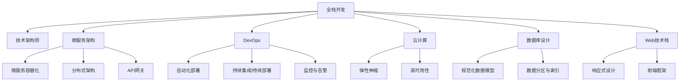

                 

# 从全栈开发到技术架构师的进阶

> 关键词：全栈开发,技术架构师,微服务架构,DevOps,云计算,数据库设计,Web技术栈,DevOps实践,技术演进

## 1. 背景介绍

在当今快速变化的技术环境中，作为软件开发人员，仅仅掌握一门编程语言或一种技术栈已经远远不够。随着软件系统的复杂度不断增加，为了能够开发出稳定、高效、可扩展的系统，我们需要从全栈开发转变为技术架构师。本文将从全栈开发的基础出发，逐步引导你了解技术架构的深层知识，以及如何将所学知识应用于实际工作中的技术架构实践。

## 2. 核心概念与联系

### 2.1 核心概念概述

- **全栈开发**：全栈开发人员掌握前端、后端和数据库等多个技术栈，能够从零开始构建完整的系统。在软件开发的早期阶段，全栈开发往往是更高效、更灵活的选择。

- **技术架构师**：技术架构师负责设计和规划复杂的软件系统，确保其能够满足业务需求和性能要求。需要具备深度的技术知识和良好的沟通协调能力，能够与团队成员和业务团队密切合作。

- **微服务架构**：微服务架构是一种通过将应用拆分为多个小型、独立服务的架构模式，旨在提高系统的可维护性、可扩展性和灵活性。

- **DevOps**：DevOps是一种将软件开发和运维流程优化、自动化并紧密结合的实践方法，旨在提高生产效率和系统稳定性。

- **云计算**：云计算提供了一种灵活、可扩展的计算资源提供方式，使得开发者可以更专注于应用开发而非基础设施管理。

- **数据库设计**：良好的数据库设计能够显著提升系统性能和数据存储效率，避免潜在的性能瓶颈和数据冗余。

- **Web技术栈**：Web技术栈包括多种前端和后端技术，如HTML/CSS/JavaScript、React、Node.js、Ruby on Rails、Django等，构建高质量的Web应用程序。

### 2.2 核心概念原理和架构的 Mermaid 流程图



此图表展示从全栈开发到技术架构师进阶的核心概念及其相互关系：

1. 全栈开发是技术架构师的基础，能够覆盖前端、后端、数据库等多个技术栈。
2. 微服务架构、DevOps、云计算、数据库设计等概念进一步扩充了技术架构师的知识体系。
3. 各个概念之间相互关联，共同构成了一个完整的技术架构体系。

## 3. 核心算法原理 & 具体操作步骤

### 3.1 算法原理概述

技术架构设计涉及多个层面，包括系统架构、组件设计、技术选型等。本文将重点介绍如何设计一个典型的微服务架构，并展示DevOps在架构中的应用。

### 3.2 算法步骤详解

1. **业务需求分析**：深入理解业务需求和目标，确保架构设计符合业务要求。

2. **系统设计**：根据业务需求，设计系统的高层架构。考虑使用微服务架构还是单体架构，选择不同的设计模式，如MVC、MVVM、组件化等。

3. **组件设计**：确定系统的主要组件，如数据访问层、业务逻辑层、用户界面层等，并定义组件间的关系和通信机制。

4. **技术选型**：根据组件设计选择合适的技术栈，如前端框架、后端语言、数据库系统、缓存系统等。

5. **DevOps实践**：引入DevOps工具和流程，如CI/CD、容器化、监控告警等，提升开发效率和系统稳定性。

6. **持续优化**：系统上线后，通过性能测试和用户反馈，不断优化和改进架构设计。

### 3.3 算法优缺点

**优点**：

- 提高系统可维护性和可扩展性。
- 增强系统的弹性和稳定性。
- 加速开发和交付流程。

**缺点**：

- 初期设计和实施复杂，需要更多的时间和资源。
- 对架构师的技术水平要求较高。

### 3.4 算法应用领域

微服务架构和DevOps已经成为现代软件开发的标准实践。几乎所有的软件开发项目，尤其是大型复杂系统，都可以考虑引入这些技术架构。这些技术架构的应用领域包括：

- 互联网企业：如电商平台、社交网络、在线广告等。
- 金融科技：如银行、保险、支付系统等。
- 医疗健康：如电子病历、医疗影像处理等。
- 物联网：如智能家居、工业物联网等。

## 4. 数学模型和公式 & 详细讲解 & 举例说明

### 4.1 数学模型构建

在技术架构的设计过程中，我们常常需要使用一些数学模型来分析和优化系统性能。以下是一个简单的系统负载均衡模型：

$$
P = \frac{R}{C}
$$

其中，$P$为系统响应时间，$R$为请求处理时间，$C$为并发处理能力。

### 4.2 公式推导过程

假设我们有一个包含多个微服务的系统，每个微服务的响应时间不同。我们可以使用以下公式计算系统整体的响应时间：

$$
P = \sum_{i=1}^n \frac{R_i}{C_i}
$$

其中，$R_i$为第$i$个微服务的响应时间，$C_i$为该微服务的并发处理能力。

### 4.3 案例分析与讲解

假设一个电商平台的订单系统由多个微服务组成，每个微服务的响应时间和并发处理能力如下表所示：

| 微服务 | 响应时间(s) | 并发处理能力 |
| --- | --- | --- |
| 订单处理 | 0.5 | 100 |
| 库存管理 | 0.3 | 200 |
| 支付系统 | 0.2 | 300 |

假设总请求数为1000，分别计算不同负载均衡策略下的系统响应时间。

1. 均匀负载均衡：每个微服务处理相同数量的请求。

   $$
   P_{\text{均匀}} = \frac{1000}{100+200+300} \times (0.5+0.3+0.2) = 1.1 \text{s}
   $$

2. 根据响应时间加权负载均衡：

   $$
   P_{\text{加权}} = \frac{1000}{100+200+300} \times (0.5 \times 100 + 0.3 \times 200 + 0.2 \times 300) = 0.85 \text{s}
   $$

通过对比可以看出，合理的负载均衡策略可以显著提高系统的响应时间。

## 5. 项目实践：代码实例和详细解释说明

### 5.1 开发环境搭建

以下是一个基于Spring Boot和Docker的微服务架构的搭建流程：

1. 安装JDK和Maven。

2. 搭建Docker环境，安装Docker和Docker Compose。

3. 创建Spring Boot项目，包含多个微服务模块，如订单处理、库存管理、支付系统等。

4. 配置Docker Compose文件，定义各个微服务的Docker镜像和启动命令。

5. 启动Docker Compose容器，启动所有微服务。

### 5.2 源代码详细实现

以下是一个简单的订单处理服务的代码实现：

```java
@RestController
@RequestMapping("/orders")
public class OrderController {

    @Autowired
    private OrderService orderService;

    @GetMapping("/{id}")
    public ResponseEntity<Order> getOrderById(@PathVariable("id") Long id) {
        Order order = orderService.findById(id);
        return ResponseEntity.ok(order);
    }

    @PostMapping
    public ResponseEntity<String> createOrder(@RequestBody Order order) {
        orderService.save(order);
        return ResponseEntity.ok("Order created successfully");
    }
}
```

### 5.3 代码解读与分析

**OrderService**：

```java
@Service
public class OrderService {

    @Autowired
    private OrderRepository orderRepository;

    public Order findOrderById(Long id) {
        return orderRepository.findById(id).orElse(null);
    }

    public void save(Order order) {
        orderRepository.save(order);
    }
}
```

**OrderRepository**：

```java
@Repository
public interface OrderRepository extends JpaRepository<Order, Long> {}
```

该代码展示了如何使用Spring Boot和Spring Data JPA构建订单处理服务。

### 5.4 运行结果展示

启动Docker Compose容器后，可以通过以下命令访问各个微服务：

```bash
# 订单服务
curl http://localhost:8080/orders/1

# 库存服务
curl http://localhost:8000/inventory/1

# 支付服务
curl http://localhost:9000/payment/1
```

## 6. 实际应用场景

### 6.1 互联网企业

互联网企业的典型应用场景包括电商平台、社交网络等。这些企业往往需要处理海量的用户请求，使用微服务架构可以提高系统的扩展性和稳定性。

### 6.2 金融科技

金融科技企业如银行、保险公司需要处理敏感数据和大量并发请求，微服务架构和DevOps可以显著提升系统性能和可靠性。

### 6.3 医疗健康

医疗健康行业需要处理大量患者数据和实时信息，使用微服务架构可以更好地管理数据和系统。

### 6.4 物联网

物联网设备需要实时处理大量数据，使用微服务架构和DevOps可以优化资源分配和系统维护。

## 7. 工具和资源推荐

### 7.1 学习资源推荐

1. **《全栈开发：从入门到精通》**：这本书详细介绍了前端、后端、数据库等多个技术栈，适合全栈开发者阅读。

2. **《微服务架构设计》**：这本书介绍了微服务架构的设计原则和实践方法，适合技术架构师参考。

3. **《DevOps实践指南》**：这本书介绍了DevOps工具和流程，适合DevOps工程师阅读。

4. **《云计算技术基础》**：这本书介绍了云计算的基本概念和应用场景，适合云计算开发者阅读。

5. **《数据库系统设计》**：这本书介绍了数据库设计的基本原则和实践方法，适合数据库工程师阅读。

### 7.2 开发工具推荐

1. **Spring Boot**：一个快速开发微服务架构的Java框架。

2. **Docker**：一个开源容器化平台，方便部署和运行微服务。

3. **Jenkins**：一个开源CI/CD工具，方便构建和部署微服务。

4. **Prometheus**：一个开源监控工具，用于监控微服务系统性能。

5. **Grafana**：一个开源数据可视化工具，与Prometheus配合使用，展示系统性能数据。

### 7.3 相关论文推荐

1. **《微服务架构设计模式》**：探讨微服务架构的设计模式和最佳实践。

2. **《DevOps工程实践》**：介绍DevOps工具和流程的实际应用。

3. **《云计算技术演进》**：介绍云计算技术的发展历程和未来趋势。

4. **《数据库系统设计与优化》**：探讨数据库系统的设计与优化策略。

5. **《Web技术栈演变》**：介绍Web技术栈的演变历程和未来趋势。

## 8. 总结：未来发展趋势与挑战

### 8.1 研究成果总结

本文从全栈开发出发，探讨了技术架构师的工作内容和核心概念。通过深入了解微服务架构和DevOps，可以构建高效、可扩展的系统。

### 8.2 未来发展趋势

未来技术架构设计将继续向微服务化和DevOps化方向发展。随着云计算和容器技术的成熟，微服务架构将成为主流的软件设计模式。DevOps工具和流程也将更加自动化和智能化，提升系统部署和维护的效率。

### 8.3 面临的挑战

技术架构师面临的主要挑战包括：

- 技术栈选择和整合。需要根据业务需求选择合适的技术栈，并进行有效的整合。
- 系统性能优化。需要不断优化和改进架构设计，提升系统性能。
- 团队协作与沟通。需要与开发、运维和业务团队紧密合作，协调开发和运维工作。

### 8.4 研究展望

未来技术架构设计的研究方向包括：

- 自动化架构设计。引入AI和自动化工具，优化架构设计和优化策略。
- 多云集成。探索多云集成和混合云架构，提升系统可靠性和资源利用率。
- 数据驱动架构设计。引入数据驱动的架构设计方法，提升系统的可扩展性和弹性。

## 9. 附录：常见问题与解答

**Q1: 如何选择合适的技术栈？**

A: 选择技术栈需要考虑多个因素，如业务需求、团队技术水平、开发效率等。可以根据业务需求和团队技术水平选择合适的技术栈，如Spring Boot、Node.js、Ruby on Rails等。

**Q2: 如何进行微服务架构设计？**

A: 微服务架构设计需要考虑多个方面，如服务拆分、数据管理、通信机制等。可以通过参考微服务架构设计模式和最佳实践，设计适合项目的微服务架构。

**Q3: 如何提高DevOps效率？**

A: 提高DevOps效率需要引入自动化工具和流程，如CI/CD、容器化、监控告警等。同时需要建立标准化的流程和规范，提升团队协作效率。

**Q4: 如何优化微服务架构？**

A: 优化微服务架构需要不断测试和改进，如性能测试、负载均衡、缓存优化等。同时需要引入监控工具，实时监测系统性能和资源利用率。

**Q5: 如何选择数据库系统？**

A: 选择数据库系统需要考虑多个因素，如数据规模、并发处理能力、数据一致性等。可以根据业务需求选择合适的数据库系统，如MySQL、PostgreSQL、MongoDB等。

---

作者：禅与计算机程序设计艺术 / Zen and the Art of Computer Programming

