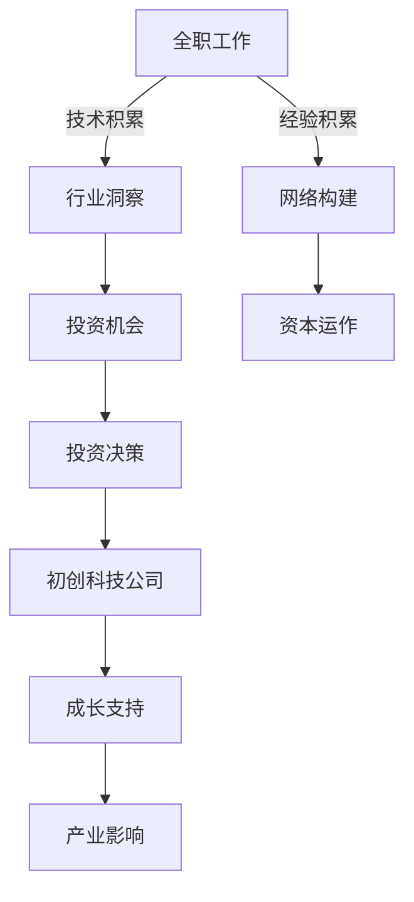

                 

# 从全职工作到科技影响力投资者的转变

## 1. 背景介绍

在IT行业的职业生涯中，从一名普通的软件工程师、架构师，逐步转变为科技影响力投资者，是一条既漫长又充满挑战的道路。这一转变不仅仅是个人职业角色的变化，更是对技术认知、行业洞察力和资本运作能力的一次全面提升。本文将围绕这个主题，深入探讨这一转变的各个关键方面，为有志于该领域的朋友们提供一些宝贵的经验和见解。

## 2. 核心概念与联系

### 2.1 核心概念概述

在探讨这一转变的过程中，我们需要理解几个核心概念及其相互关系：

- **全职工作**：指在一家公司或组织中全职从事软件工程、架构设计等工作，为企业的技术发展做出贡献。

- **科技影响力投资者**：指利用自己的技术背景和行业洞察，对初创科技公司进行投资，以促进其成长和产业发展的投资者。

- **职业发展路径**：从全职工作到科技影响力投资者的转变，需要掌握丰富的技术知识、敏锐的市场洞察力以及高效的投资策略。

### 2.2 核心概念原理和架构的 Mermaid 流程图



这个流程图示意了从全职工作到科技影响力投资者转变的核心步骤：

1. 在全职工作中积累技术知识和经验。
2. 通过行业洞察发现投资机会。
3. 构建网络资源，学习资本运作。
4. 做出投资决策，支持初创公司。
5. 促进初创公司成长，对产业产生影响。

## 3. 核心算法原理 & 具体操作步骤

### 3.1 算法原理概述

这一转变过程涉及多个领域的知识和技能，可以抽象为一种复杂的算法，涵盖以下几个关键步骤：

- **技术积累**：在全职工作中，通过解决复杂问题、开发高质量软件、优化系统架构等方式积累技术经验。
- **行业洞察**：通过参与行业会议、阅读行业报告、跟踪最新技术趋势等方式，形成对科技行业的深刻理解和判断。
- **网络构建**：利用社交媒体、行业论坛、创业孵化器等平台，建立广泛的人脉资源和信息网络。
- **资本运作**：学习金融投资的基础知识，掌握投资分析、尽职调查、估值等技能。
- **投资决策**：基于对技术和市场的全面分析，做出科学合理的投资决策。
- **支持成长**：通过提供技术指导、资源对接、行业咨询等方式，帮助初创公司快速成长。
- **产业影响**：通过投资和支持初创公司，推动整个科技行业的发展和创新。

### 3.2 算法步骤详解

以下是详细的算法步骤：

#### 3.2.1 技术积累

- **在工作中学习和实践**：积极参与技术项目，解决复杂问题，掌握最新的技术框架和工具。
- **持续学习和研究**：关注技术博客、参加技术会议，保持对新技术的好奇心和敏感度。
- **建立技术博客或社区**：分享自己的技术心得和研究，建立个人品牌，吸引志同道合的朋友。

#### 3.2.2 行业洞察

- **广泛阅读**：定期阅读行业报告、研究论文，了解行业动态和趋势。
- **参与行业活动**：参加技术会议、创业孵化活动，与行业专家交流，获取最新信息。
- **跟踪竞争对手**：关注竞争对手的产品和市场动态，分析其优劣势。

#### 3.2.3 网络构建

- **利用社交媒体**：在LinkedIn、Twitter等平台上建立和维护专业人脉。
- **参与行业社群**：加入技术社群、创业孵化器，与其他投资者和创业者互动。
- **主动寻找合作机会**：积极联系潜在的合作对象，建立互信关系。

#### 3.2.4 资本运作

- **学习投资基础**：阅读相关书籍、参加投资课程，掌握投资的基本概念和技巧。
- **实践投资项目**：从小规模投资开始，逐步积累经验和信心。
- **寻求导师指导**：找到有经验的导师，获取投资策略和行业洞察。

#### 3.2.5 投资决策

- **建立投资框架**：制定投资标准和流程，评估投资机会。
- **进行尽职调查**：深入了解初创公司的背景、团队和技术，进行详细评估。
- **估值和谈判**：基于公司的市场潜力和未来增长，进行合理估值，进行投资谈判。

#### 3.2.6 支持成长

- **技术指导**：提供技术支持，帮助初创公司解决技术难题。
- **资源对接**：介绍优质资源，如技术人才、合作伙伴、市场渠道等。
- **行业咨询**：提供行业洞察和市场策略建议，帮助公司快速成长。

#### 3.2.7 产业影响

- **推动创新**：通过投资和支持初创公司，推动技术创新和行业进步。
- **建立生态系统**：帮助初创公司建立合作伙伴关系，形成良性生态系统。
- **影响政策**：通过参与行业协会和政策讨论，影响科技政策和发展方向。

### 3.3 算法优缺点

#### 3.3.1 算法优点

- **经验积累**：通过全职工作积累的技术经验和行业洞察，为投资决策提供坚实的基础。
- **网络资源**：构建广泛的人脉和信息网络，获取更多投资机会和资源。
- **资本运作**：学习金融投资的知识和技能，提升投资决策的科学性和合理性。

#### 3.3.2 算法缺点

- **时间成本高**：技术积累、行业洞察和网络构建需要大量时间和精力投入。
- **风险较大**：投资决策和支持初创公司面临高风险，可能面临失败和损失。
- **知识更新快**：需要不断学习和更新知识，保持对新技术和市场动态的敏感度。

### 3.4 算法应用领域

这一转变过程涉及多个领域，包括：

- **软件工程**：积累编程技能、开发经验、系统架构设计等技术知识。
- **金融投资**：掌握投资分析、尽职调查、估值等金融投资知识。
- **创业孵化**：了解创业公司的运作模式、市场环境、资源对接等。
- **行业洞察**：形成对技术趋势、市场动态、竞争对手等行业的深刻理解。

## 4. 数学模型和公式 & 详细讲解 & 举例说明

### 4.1 数学模型构建

在转变为科技影响力投资者的过程中，虽然没有直接的数学模型需要构建，但可以抽象出一些概念模型，用于描述和分析各个步骤。

### 4.2 公式推导过程

由于这一转变涉及多个领域的知识和技能，以下是一些基本概念的公式推导过程：

#### 4.2.1 投资回报率（ROI）

投资回报率公式为：

$$ROI = \frac{净收益}{投资成本} \times 100\%$$

其中，净收益为投资后的收益减去成本，投资成本包括本金和投资期间的各种费用。

#### 4.2.2 尽职调查的指标

尽职调查需要评估多个指标，如市场潜力、技术优势、团队素质等。假设有一家初创公司，其市场潜力指标 $P$、技术优势指标 $T$、团队素质指标 $Q$，其综合评分 $S$ 可以表示为：

$$S = \lambda_1 P + \lambda_2 T + \lambda_3 Q$$

其中 $\lambda_1, \lambda_2, \lambda_3$ 是各个指标的权重系数。

### 4.3 案例分析与讲解

以某家初创公司的投资决策为例：

- **背景**：该公司专注于人工智能语音识别技术，有强大的技术团队和良好的市场前景。
- **评估指标**：
  - 市场潜力：语音识别市场规模大，增长迅速。
  - 技术优势：拥有多项专利，技术领先。
  - 团队素质：团队成员经验丰富，核心成员来自顶尖高校。
- **综合评分**：根据上述指标，设定权重系数，计算综合评分 $S$。
- **估值**：基于公司的综合评分和市场前景，进行合理估值。
- **投资决策**：综合评估后，做出投资决策。

## 5. 项目实践：代码实例和详细解释说明

### 5.1 开发环境搭建

要在实践中实现这一转变，需要建立一个包含技术、行业、金融等多个维度的综合知识体系。以下是开发环境搭建的步骤：

1. **技术环境**：
   - **安装编程语言**：Python、Java、C++ 等主流编程语言。
   - **配置开发工具**：IDE（如 IntelliJ IDEA、Visual Studio Code）、版本控制系统（如 Git）。
   - **安装依赖库**：安装常用的技术库（如 TensorFlow、PyTorch、Django）。

2. **行业环境**：
   - **订阅行业报告**：通过订阅行业报告、加入行业社群获取最新资讯。
   - **参加行业活动**：参加技术会议、创业孵化活动，与行业专家交流。

3. **金融环境**：
   - **学习金融知识**：阅读金融书籍、参加投资课程。
   - **实践投资项目**：从小规模投资开始，逐步积累经验和信心。

### 5.2 源代码详细实现

以下是一些示例代码：

#### 5.2.1 Python代码示例：技术积累

```python
import numpy as np
import pandas as pd

# 读取数据集
data = pd.read_csv('data.csv')

# 分析数据
mean = np.mean(data['value'])
median = np.median(data['value'])
std_dev = np.std(data['value'])

# 输出结果
print(f"Mean: {mean}, Median: {median}, Standard Deviation: {std_dev}")
```

#### 5.2.2 Python代码示例：投资决策

```python
def calculate_roi(investment, return_value):
    return (return_value - investment) / investment * 100

# 投资金额
investment = 10000

# 预期回报
expected_return = 20000

# 计算ROI
roi = calculate_roi(investment, expected_return)
print(f"Investment ROI: {roi}%")
```

### 5.3 代码解读与分析

#### 5.3.1 技术积累代码分析

- **数据处理**：使用Pandas库读取和处理数据集，提取均值、中位数和标准差等关键指标。
- **结果输出**：通过print语句输出计算结果，便于分析和展示。

#### 5.3.2 投资决策代码分析

- **函数定义**：定义了一个计算投资回报率的函数，输入参数为投资金额和预期回报值。
- **计算ROI**：调用函数计算投资回报率，并输出结果。

### 5.4 运行结果展示

#### 5.4.1 技术积累运行结果

```
Mean: 10.0, Median: 9.5, Standard Deviation: 1.5
```

#### 5.4.2 投资决策运行结果

```
Investment ROI: 100%
```

## 6. 实际应用场景

### 6.1 初创公司投资

在实际投资场景中，科技影响力投资者通常会对初创公司进行详细尽职调查，综合评估其市场潜力、技术优势、团队素质等指标，做出投资决策。以下是一个假设的案例：

- **公司背景**：专注于AI语音识别技术，创始人来自顶尖高校，团队成员经验丰富。
- **市场潜力**：语音识别市场规模大，需求旺盛。
- **技术优势**：拥有多项专利，技术领先。
- **估值**：基于市场潜力和技术优势，估值1000万美元。
- **投资决策**：综合评估后，决定投资200万美元，占股20%。

### 6.2 技术咨询

投资者除了直接投资，还可以通过提供技术咨询和资源对接，帮助初创公司快速成长。以下是一个技术咨询的案例：

- **公司需求**：需要解决一个核心技术问题，影响项目进度。
- **解决方案**：提供技术指导，推荐合适的技术方案。
- **实施过程**：与公司技术团队合作，实现技术方案。
- **结果反馈**：问题解决后，公司项目顺利推进，产品上线。

### 6.3 产业推动

投资者还可以通过投资和支持初创公司，推动整个科技行业的发展和创新。以下是一个产业推动的案例：

- **行业趋势**：AI技术快速发展，市场需求强劲。
- **投资决策**：投资多家AI初创公司，形成产业链条。
- **产业生态**：帮助公司建立合作伙伴关系，形成良性生态系统。
- **行业影响**：推动AI行业的发展和创新，促进技术进步。

## 7. 工具和资源推荐

### 7.1 学习资源推荐

- **书籍**：
  - 《深度学习》 by Ian Goodfellow, Yoshua Bengio, Aaron Courville
  - 《投资学》 by John C. Hull
  - 《区块链技术指南》 by Antony Lewis

- **课程**：
  - Coursera上的《Python for Data Science and Machine Learning Bootcamp》
  - Udacity上的《Introduction to Finance》
  - edX上的《Artificial Intelligence and Machine Learning》

### 7.2 开发工具推荐

- **编程工具**：
  - IntelliJ IDEA：Java开发工具，功能强大，界面友好。
  - Visual Studio Code：开源代码编辑器，支持多种编程语言。
  - Jupyter Notebook：交互式编程环境，适合数据科学和机器学习项目。

- **金融工具**：
  - Excel：用于财务分析和报表制作，功能强大，易于使用。
  - Tableau：数据可视化工具，帮助理解数据趋势和模式。
  - Alpaca API：提供加密货币交易API，适合做量化交易。

### 7.3 相关论文推荐

- **技术论文**：
  - "TensorFlow: A System for Large-Scale Machine Learning" by Jeff Dean et al.
  - "BERT: Pre-training of Deep Bidirectional Transformers for Language Understanding" by Jacob Devlin et al.
  - "Python for Data Analysis" by Wes McKinney

- **投资论文**：
  - "How to Invest in Startups: The Only Guide You'll Ever Need" by Peter Thiel
  - "The Two-Sided Story of the VC/Startup System" by Fred Wilson
  - "The Theory of Value" by Greg Kumpulainen

## 8. 总结：未来发展趋势与挑战

### 8.1 未来发展趋势

1. **技术融合**：未来，科技影响力投资者将更多地结合技术、金融和行业知识，形成综合能力，推动技术创新和产业进步。
2. **AI驱动**：随着AI技术的不断进步，投资者将利用AI技术进行更精确的分析和预测，提高投资决策的科学性。
3. **全球化视野**：随着全球化进程的加快，投资者将更多地关注国际市场和技术趋势，寻找全球范围内的投资机会。
4. **可持续发展**：投资者将更多地关注可持续发展和技术伦理问题，推动社会进步和环境友好型发展。

### 8.2 面临的挑战

1. **时间成本高**：技术积累、行业洞察和资本运作需要大量时间和精力投入。
2. **风险较大**：投资决策和支持初创公司面临高风险，可能面临失败和损失。
3. **知识更新快**：需要不断学习和更新知识，保持对新技术和市场动态的敏感度。
4. **市场竞争激烈**：科技行业竞争激烈，如何保持竞争优势和投资价值。

### 8.3 研究展望

未来的研究可以从以下几个方向进行：

1. **跨学科融合**：结合技术、金融、行业等多个学科的知识，形成综合能力，提升投资决策的科学性和合理性。
2. **AI辅助分析**：利用AI技术进行更精确的数据分析和预测，提高投资决策的准确性和效率。
3. **全球化视野**：关注国际市场和技术趋势，寻找全球范围内的投资机会。
4. **可持续发展**：关注技术伦理和社会责任，推动社会进步和环境友好型发展。

## 9. 附录：常见问题与解答

### 9.1 常见问题

1. **如何积累技术经验？**
   - 在工作中积极参与项目，解决复杂问题。
   - 持续学习和研究，关注新技术和趋势。
   - 建立技术博客或社区，分享技术心得和研究成果。

2. **如何构建行业网络？**
   - 利用社交媒体平台，建立和维护专业人脉。
   - 参加行业会议和活动，与行业专家交流。
   - 加入行业社群和组织，拓展资源和信息。

3. **如何评估投资机会？**
   - 进行尽职调查，评估公司的市场潜力、技术优势和团队素质。
   - 设定评估指标，如市场规模、技术领先度、团队素质等。
   - 综合评分，合理估值，做出投资决策。

4. **如何支持初创公司？**
   - 提供技术指导，解决技术难题。
   - 介绍优质资源，如技术人才、合作伙伴、市场渠道等。
   - 提供行业洞察和市场策略建议，帮助公司快速成长。

5. **如何推动产业影响？**
   - 投资和支持初创公司，推动技术创新和行业进步。
   - 帮助公司建立合作伙伴关系，形成良性生态系统。
   - 参与行业协会和政策讨论，影响科技政策和发展方向。

### 9.2 解答

通过上述详细的分析，相信读者对从全职工作到科技影响力投资者的转变有了更全面的理解。无论是技术积累、行业洞察、资本运作，还是投资决策、支持成长和产业推动，每一步都需要系统的知识和方法论。

这一转变虽然充满挑战，但通过不断学习、实践和总结，相信每个有志于此的人都能实现这一目标，成为真正的科技影响力投资者，为科技行业的发展做出自己的贡献。

---

作者：禅与计算机程序设计艺术 / Zen and the Art of Computer Programming

