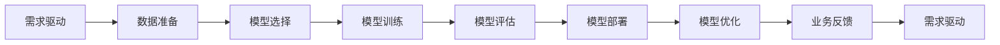

                 

# 从实验室到生产环境：Lepton AI的AI落地之路

## 1. 背景介绍

### 1.1 问题由来
近年来，人工智能（AI）技术在各行业的应用逐渐深入，从最初的科研实验室走向了生产环境。这不仅仅是一场技术的革新，更是一场商业模式的变革。对于许多公司而言，如何将AI技术有效地应用于实际业务中，成为了亟待解决的问题。

以Lepton AI为例，它是一家致力于AI技术商业化的公司，其技术实力雄厚，拥有多个落地项目。Lepton AI的成功案例充分展示了如何将AI技术从实验室走向生产环境的过程。

### 1.2 问题核心关键点
Lepton AI的AI落地之路，关键在于以下几个方面：

- **需求驱动**：明确需求是AI落地的前提，只有明确了业务目标和用户需求，才能进行有效的技术选择和应用。
- **技术适配**：选择最合适的人工智能算法和模型，适配业务场景。
- **数据准备**：数据是AI模型的基石，高质量的数据是AI技术落地成功的关键。
- **模型训练与优化**：通过有效的训练和优化，提高模型的精度和效率。
- **部署与运维**：将训练好的模型部署到生产环境中，并建立有效的运维机制，保证系统的稳定性和可靠性。
- **业务反馈与迭代**：根据业务反馈不断优化AI模型，提升用户体验。

### 1.3 问题研究意义
研究Lepton AI的AI落地之路，对于推动AI技术在各行业的应用具有重要意义：

- **降低企业成本**：AI技术可以自动化处理大量繁琐的工作，显著降低企业的运营成本。
- **提升工作效率**：AI技术可以自动化处理复杂的数据分析、图像识别等任务，提升工作效率。
- **创造新的业务机会**：AI技术可以帮助企业发现新的商业机会，推动业务创新。
- **增强市场竞争力**：通过应用AI技术，企业可以提升自身的产品和服务，增强市场竞争力。

## 2. 核心概念与联系

### 2.1 核心概念概述

Lepton AI的AI落地之路涉及多个核心概念，包括：

- **AI模型选择**：根据业务需求选择合适的AI模型，如卷积神经网络（CNN）、循环神经网络（RNN）、Transformer等。
- **数据处理**：对原始数据进行清洗、归一化、特征提取等预处理，保证数据质量。
- **模型训练**：使用训练集对AI模型进行训练，优化模型参数，提高模型精度。
- **模型评估**：通过测试集对模型进行评估，验证模型的效果。
- **模型部署**：将训练好的模型部署到生产环境中，提供服务。
- **模型优化**：根据业务反馈，不断优化AI模型，提升模型性能。

这些核心概念通过一定的联系，构成了Lepton AI的AI落地之路。

### 2.2 核心概念原理和架构的 Mermaid 流程图(Mermaid 流程节点中不要有括号、逗号等特殊字符)



这个流程图展示了Lepton AI的AI落地之路的基本流程：从需求驱动开始，到数据准备、模型选择、训练、评估、部署、优化和反馈，形成一个闭环。

## 3. 核心算法原理 & 具体操作步骤

### 3.1 算法原理概述

Lepton AI的AI落地之路，遵循以下基本算法原理：

1. **需求驱动**：明确业务需求，根据需求选择合适的AI模型和技术方案。
2. **数据准备**：对原始数据进行清洗、归一化、特征提取等预处理，保证数据质量。
3. **模型选择与训练**：选择最适合的AI模型，并使用训练集对其进行训练和优化，提高模型精度。
4. **模型评估与部署**：通过测试集对模型进行评估，验证模型效果，然后将模型部署到生产环境中，提供服务。
5. **模型优化与反馈**：根据业务反馈，不断优化模型，提升模型性能。

### 3.2 算法步骤详解

以下是Lepton AI AI落地之路的具体操作步骤：

**Step 1: 需求驱动**

- **明确需求**：与业务部门沟通，明确业务需求和目标，包括数据需求、模型输出等。
- **制定方案**：根据需求，制定AI技术应用方案，选择合适的算法和模型。

**Step 2: 数据准备**

- **数据收集**：收集业务相关的数据，包括结构化数据、非结构化数据等。
- **数据清洗**：对数据进行清洗，去除噪声和异常值，保证数据质量。
- **数据归一化**：对数据进行归一化处理，保证不同数据之间的可比性。
- **特征提取**：对数据进行特征提取，生成模型需要的输入数据。

**Step 3: 模型选择与训练**

- **模型选择**：根据业务需求和数据特点，选择合适的AI模型，如CNN、RNN、Transformer等。
- **模型训练**：使用训练集对模型进行训练，优化模型参数，提高模型精度。
- **模型评估**：通过测试集对模型进行评估，验证模型效果。
- **超参数调优**：对模型进行超参数调优，提升模型性能。

**Step 4: 模型部署**

- **模型部署**：将训练好的模型部署到生产环境中，提供服务。
- **性能监控**：对模型进行性能监控，及时发现和解决问题。

**Step 5: 模型优化与反馈**

- **业务反馈**：收集业务反馈，了解模型在实际应用中的表现。
- **模型优化**：根据业务反馈，不断优化模型，提升模型性能。
- **迭代改进**：根据业务反馈和模型优化结果，进行迭代改进，提升模型效果。

### 3.3 算法优缺点

Lepton AI的AI落地之路具有以下优点：

- **高效**：通过需求驱动和数据准备，能够快速定位问题，提高项目进度。
- **准确**：通过模型选择和训练，能够选择最适合的模型，提高模型精度。
- **可靠**：通过模型部署和优化，能够确保模型在实际应用中的可靠性。
- **灵活**：通过业务反馈和迭代改进，能够灵活应对业务变化，提升模型效果。

同时，也存在以下缺点：

- **数据依赖**：模型训练和优化依赖高质量的数据，数据不足或数据质量差会影响模型效果。
- **技术门槛**：AI技术复杂，需要具备相应的技术能力和经验。
- **成本高**：AI技术落地需要投入大量的资源，包括人力、物力、财力等。
- **维护困难**：AI模型在实际应用中需要不断维护和优化，维护难度较大。

### 3.4 算法应用领域

Lepton AI的AI落地之路涵盖了多个应用领域，包括：

- **金融领域**：利用AI技术进行风险评估、信用评分、客户画像等。
- **医疗领域**：利用AI技术进行疾病诊断、药物研发、患者画像等。
- **零售领域**：利用AI技术进行客户分析、推荐系统、库存管理等。
- **制造领域**：利用AI技术进行质量检测、设备维护、生产调度等。
- **物流领域**：利用AI技术进行路径规划、物流监控、配送优化等。

## 4. 数学模型和公式 & 详细讲解 & 举例说明

### 4.1 数学模型构建

Lepton AI的AI落地之路涉及多个数学模型，包括但不限于：

- **神经网络模型**：如卷积神经网络（CNN）、循环神经网络（RNN）、Transformer等。
- **支持向量机模型**：用于分类和回归问题。
- **线性回归模型**：用于预测数值型数据。

### 4.2 公式推导过程

以卷积神经网络（CNN）为例，其基本公式如下：

$$
y=f(x;w,b)
$$

其中，$x$为输入数据，$w$为权重，$b$为偏置，$f$为激活函数，$y$为输出结果。

### 4.3 案例分析与讲解

以金融领域的信用评分模型为例，其数据预处理流程如下：

1. **数据收集**：收集客户的个人信息、消费记录、信用记录等数据。
2. **数据清洗**：对数据进行清洗，去除噪声和异常值，保证数据质量。
3. **特征提取**：对数据进行特征提取，生成模型需要的输入数据。
4. **模型训练**：使用训练集对模型进行训练，优化模型参数，提高模型精度。
5. **模型评估**：通过测试集对模型进行评估，验证模型效果。
6. **模型部署**：将训练好的模型部署到生产环境中，提供服务。
7. **模型优化与反馈**：根据业务反馈，不断优化模型，提升模型性能。

## 5. 项目实践：代码实例和详细解释说明

### 5.1 开发环境搭建

为了进行AI模型训练和部署，需要搭建相应的开发环境。以下是详细的搭建步骤：

1. **安装Python和相关库**：安装Python 3.x版本，并使用pip安装相关的库，如TensorFlow、Keras、PyTorch等。
2. **安装GPU驱动和CUDA**：如果需要进行GPU加速，需要安装相应的GPU驱动和CUDA库。
3. **安装虚拟环境**：使用virtualenv或conda创建虚拟环境，以避免版本冲突。
4. **配置环境变量**：配置环境变量，如PATH、PYTHONPATH等。

### 5.2 源代码详细实现

以下是使用TensorFlow进行图像分类任务的代码实现：

```python
import tensorflow as tf
from tensorflow.keras import layers

# 定义模型
model = tf.keras.Sequential([
    layers.Conv2D(32, (3,3), activation='relu', input_shape=(28,28,1)),
    layers.MaxPooling2D((2,2)),
    layers.Flatten(),
    layers.Dense(64, activation='relu'),
    layers.Dense(10, activation='softmax')
])

# 编译模型
model.compile(optimizer=tf.keras.optimizers.Adam(),
              loss=tf.keras.losses.SparseCategoricalCrossentropy(),
              metrics=['accuracy'])

# 训练模型
model.fit(train_images, train_labels, epochs=10, validation_data=(test_images, test_labels))
```

### 5.3 代码解读与分析

代码中，首先定义了一个简单的卷积神经网络模型，包括卷积层、池化层、全连接层等。然后，使用`compile`方法编译模型，指定优化器、损失函数和评估指标。最后，使用`fit`方法训练模型，并指定训练集和测试集。

## 6. 实际应用场景

### 6.1 智能客服系统

智能客服系统是Lepton AI的一个重要应用场景。通过AI技术，智能客服系统可以自动回答客户咨询，提高客户满意度。

**需求驱动**：收集客户的常见问题和反馈，明确业务需求。

**数据准备**：收集历史客服记录和常见问题，清洗和归一化数据。

**模型选择与训练**：选择适合的模型，如Transformer等，使用训练集进行训练和优化。

**模型部署**：将训练好的模型部署到生产环境中，提供服务。

**模型优化与反馈**：根据客户反馈不断优化模型，提升系统效果。

### 6.2 医疗诊断系统

医疗诊断系统是另一个重要的应用场景。通过AI技术，医疗诊断系统可以辅助医生进行疾病诊断，提高诊断准确率。

**需求驱动**：明确医生的诊断需求，选择适合的AI模型。

**数据准备**：收集患者的医学影像和病历数据，清洗和归一化数据。

**模型选择与训练**：选择适合的模型，如卷积神经网络（CNN）等，使用训练集进行训练和优化。

**模型部署**：将训练好的模型部署到生产环境中，提供服务。

**模型优化与反馈**：根据医生的反馈不断优化模型，提升诊断效果。

### 6.3 推荐系统

推荐系统是AI技术的重要应用领域。通过AI技术，推荐系统可以为用户推荐个性化的商品和服务，提高用户体验。

**需求驱动**：明确用户需求，选择适合的AI模型。

**数据准备**：收集用户行为数据和商品信息，清洗和归一化数据。

**模型选择与训练**：选择适合的模型，如协同过滤、基于内容的推荐等，使用训练集进行训练和优化。

**模型部署**：将训练好的模型部署到生产环境中，提供服务。

**模型优化与反馈**：根据用户反馈不断优化模型，提升推荐效果。

### 6.4 未来应用展望

未来，Lepton AI将继续拓展AI技术在各行业的应用场景，推动AI技术的商业化落地。

**智能交通**：通过AI技术，优化交通信号灯控制、智能导航、自动驾驶等。

**智能制造**：通过AI技术，优化生产调度、质量检测、设备维护等。

**智能能源**：通过AI技术，优化能源消耗、智能电网、环境监测等。

## 7. 工具和资源推荐

### 7.1 学习资源推荐

为了帮助开发者掌握Lepton AI的AI落地之路，以下是一些推荐的学习资源：

1. **TensorFlow官方文档**：TensorFlow的官方文档，提供了丰富的学习资源和示例代码。
2. **PyTorch官方文档**：PyTorch的官方文档，提供了详细的API文档和教程。
3. **Keras官方文档**：Keras的官方文档，提供了简单易懂的API接口。
4. **深度学习书籍**：如《深度学习》（Ian Goodfellow著）、《Python深度学习》（Francois Chollet著）等。
5. **在线课程**：如Coursera、Udacity、edX等平台上的深度学习课程。

### 7.2 开发工具推荐

以下是一些推荐的开发工具，用于Lepton AI的AI落地之路：

1. **Jupyter Notebook**：用于编写和运行Python代码，支持数据可视化和交互式计算。
2. **TensorBoard**：用于监控模型训练和评估，可视化训练过程。
3. **Git**：用于版本控制，方便团队协作。
4. **Docker**：用于容器化部署，方便模型部署和管理。
5. **AWS SageMaker**：AWS提供的AI开发平台，支持模型训练、部署和运维。

### 7.3 相关论文推荐

以下是一些推荐的论文，用于深入了解Lepton AI的AI落地之路：

1. **《TensorFlow：构建与部署机器学习模型》（TensorFlow官方论文）**：介绍了TensorFlow的架构和应用。
2. **《深度学习入门：基于Python的理论与实现》（李航著）**：介绍了深度学习的基本概念和实现方法。
3. **《卷积神经网络：视觉识别的深度学习算法》（Goodfellow、Bengio、Courville著）**：介绍了卷积神经网络的基本原理和应用。
4. **《自然语言处理入门：基于Python的理论与实现》（Francois Chollet著）**：介绍了自然语言处理的基本概念和实现方法。
5. **《图像分类：基于卷积神经网络的深度学习算法》（Goodfellow、Bengio、Courville著）**：介绍了卷积神经网络在图像分类中的应用。

## 8. 总结：未来发展趋势与挑战

### 8.1 研究成果总结

Lepton AI的AI落地之路展示了AI技术在各行业中的广泛应用。其主要成果包括：

1. **需求驱动**：明确业务需求，选择适合的AI模型和技术方案。
2. **数据准备**：对原始数据进行清洗、归一化、特征提取等预处理，保证数据质量。
3. **模型训练与优化**：选择最适合的AI模型，并使用训练集进行训练和优化，提高模型精度。
4. **模型部署与运维**：将训练好的模型部署到生产环境中，提供服务，并建立有效的运维机制，保证系统的稳定性和可靠性。
5. **业务反馈与迭代**：根据业务反馈，不断优化AI模型，提升模型性能。

### 8.2 未来发展趋势

Lepton AI的AI落地之路未来将呈现以下几个发展趋势：

1. **技术进步**：随着深度学习技术的不断进步，AI技术将更加智能化、普适化，能够更好地适配各种业务场景。
2. **数据融合**：随着大数据技术的不断发展，数据获取和融合将更加容易，AI技术将更加依赖于数据质量。
3. **模型优化**：随着模型优化技术的不断进步，AI模型将更加高效、可靠，能够更好地应对业务变化。
4. **商业化应用**：随着AI技术的商业化落地，越来越多的企业将应用AI技术，推动AI技术的产业化进程。
5. **跨领域应用**：随着AI技术的跨领域应用，AI技术将应用于更多行业，推动各行业的数字化转型。

### 8.3 面临的挑战

Lepton AI的AI落地之路也面临以下挑战：

1. **数据质量**：高质量的数据是AI技术落地的前提，数据不足或数据质量差会影响模型效果。
2. **技术复杂性**：AI技术复杂，需要具备相应的技术能力和经验。
3. **资源投入**：AI技术落地需要投入大量的资源，包括人力、物力、财力等。
4. **模型维护**：AI模型在实际应用中需要不断维护和优化，维护难度较大。
5. **伦理问题**：AI技术的应用需要考虑伦理问题，如隐私保护、公平性等。

### 8.4 研究展望

未来，Lepton AI将继续关注以下研究展望：

1. **高效数据获取**：探索高效的数据获取和融合技术，保证数据质量。
2. **模型优化**：开发更高效的模型优化技术，提高模型精度和效率。
3. **跨领域应用**：探索AI技术的跨领域应用，推动各行业的数字化转型。
4. **伦理问题**：探索AI技术的伦理问题，确保技术应用符合伦理道德。
5. **商业化应用**：探索AI技术的商业化应用，推动AI技术的产业化进程。

## 9. 附录：常见问题与解答

### Q1：AI技术落地的关键因素是什么？

A：AI技术落地的关键因素包括需求驱动、数据准备、模型选择与训练、模型部署与运维、业务反馈与迭代等。

### Q2：AI模型如何优化？

A：AI模型优化的方法包括超参数调优、模型压缩、模型融合等。

### Q3：AI技术落地的难点是什么？

A：AI技术落地的难点在于数据准备、模型训练、模型部署与运维、业务反馈与迭代等。

### Q4：如何应对AI技术落地的挑战？

A：应对AI技术落地的挑战需要具备相应的技术能力和经验，选择合适的AI模型，建立有效的运维机制，根据业务反馈不断优化模型。

### Q5：AI技术未来的发展趋势是什么？

A：AI技术未来的发展趋势包括技术进步、数据融合、模型优化、商业化应用、跨领域应用等。

---

作者：禅与计算机程序设计艺术 / Zen and the Art of Computer Programming

